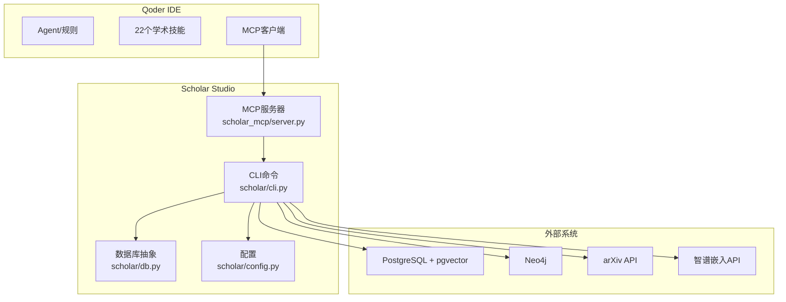
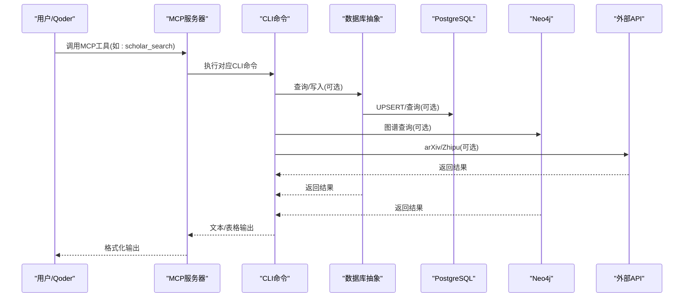
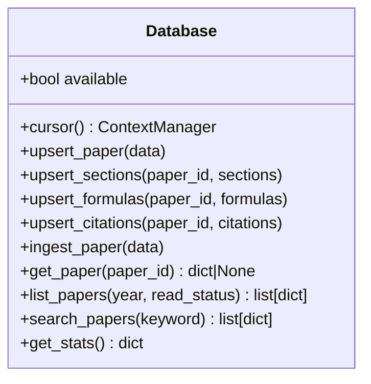
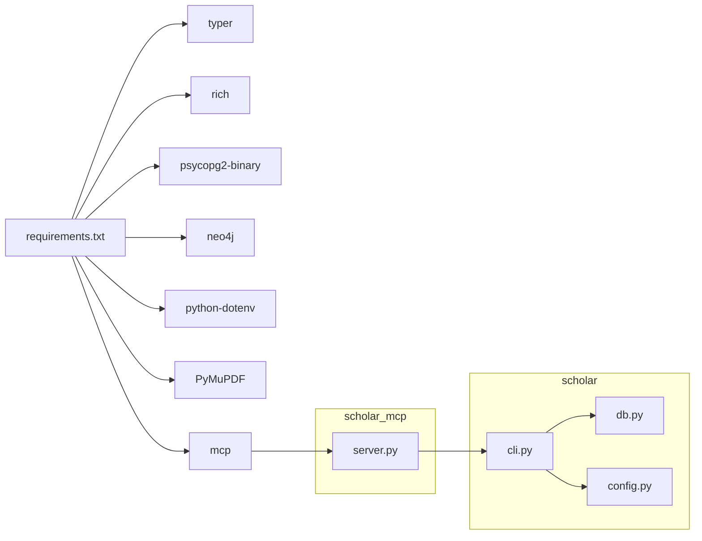

# API参考文档

<cite>
**本文档引用的文件**
- [cli.py](file://scholar/cli.py)
- [__main__.py](file://scholar/__main__.py)
- [server.py](file://scholar_mcp/server.py)
- [__main__.py](file://scholar_mcp/__main__.py)
- [db.py](file://scholar/db.py)
- [config.py](file://scholar/config.py)
- [README.md](file://README.md)
- [requirements.txt](file://requirements.txt)
</cite>

## 目录
1. [简介](#简介)
2. [项目结构](#项目结构)
3. [核心组件](#核心组件)
4. [架构总览](#架构总览)
5. [详细组件分析](#详细组件分析)
6. [依赖分析](#依赖分析)
7. [性能考虑](#性能考虑)
8. [故障排除指南](#故障排除指南)
9. [结论](#结论)
10. [附录](#附录)

## 简介
本项目提供一套完整的学术研究工具链，支持：
- 命令行接口（CLI）：对440+篇AI论文进行解析、检索、图谱分析、RAG语义搜索、批量处理等
- MCP协议服务：将CLI能力暴露为MCP工具，供Qoder IDE集成使用
- 可选数据库层：PostgreSQL + pgvector用于结构化存储与向量检索
- 可选图数据库：Neo4j用于引用网络与概念图谱
- 可选外部API：arXiv搜索、智谱嵌入API

本参考文档覆盖CLI命令、MCP工具、数据库接口、配置项及使用示例，并提供版本管理、兼容性与废弃策略说明。

## 项目结构
项目采用模块化组织，核心模块包括：
- scholar：Python CLI与数据处理逻辑
- scholar_mcp：MCP服务器，桥接CLI到Qoder
- scholar/db.py：数据库抽象层（PostgreSQL）
- scholar/config.py：全局配置与环境变量
- README.md：快速开始、命令参考、数据规模等

**图表来源**
- [server.py:1-387](file://scholar_mcp/server.py#L1-L387)
- [cli.py:1-1638](file://scholar/cli.py#L1-L1638)
- [db.py:1-270](file://scholar/db.py#L1-L270)
- [config.py:1-62](file://scholar/config.py#L1-L62)

**章节来源**
- [README.md:300-325](file://README.md#L300-L325)
- [requirements.txt:1-9](file://requirements.txt#L1-L9)

## 核心组件
- CLI命令行接口：提供论文扫描、解析、搜索、图谱查询、RAG语义搜索、批量处理、编排流水线等命令
- MCP服务器：将CLI命令封装为MCP工具，供Qoder IDE调用
- 数据库层：统一PostgreSQL访问接口，支持UPSERT、全文检索、统计查询
- 配置系统：集中管理路径、数据库、图数据库、嵌入API等配置

**章节来源**
- [cli.py:22-28](file://scholar/cli.py#L22-L28)
- [server.py:17-21](file://scholar_mcp/server.py#L17-L21)
- [db.py:24-270](file://scholar/db.py#L24-L270)
- [config.py:20-62](file://scholar/config.py#L20-L62)

## 架构总览
下图展示了Scholar Studio的端到端数据流与组件交互：

**图表来源**
- [server.py:23-36](file://scholar_mcp/server.py#L23-L36)
- [cli.py:31-39](file://scholar/cli.py#L31-L39)
- [db.py:79-170](file://scholar/db.py#L79-L170)

## 详细组件分析

### CLI命令参考

#### 命令：scan
- 功能：扫描论文目录并显示解析状态
- 参数：无
- 输出：表格统计（状态、ULID、是否有源文件、是否有PDF、是否已解析）
- 示例：python -m scholar scan

**章节来源**
- [cli.py:45-126](file://scholar/cli.py#L45-L126)

#### 命令：parse
- 功能：解析单篇论文的TeX源码为结构化JSON
- 参数：ulid（论文ULID）
- 输出：解析结果摘要与保存路径
- 示例：python -m scholar parse 01KT6MT...

**章节来源**
- [cli.py:131-168](file://scholar/cli.py#L131-L168)

#### 命令：parse-all
- 功能：批量解析所有论文
- 参数：
  - limit：最大解析数量（0表示全部）
  - force：是否重新解析已解析的论文
- 输出：进度条与成功/失败计数
- 示例：python -m scholar parse-all --limit 100 --force

**章节来源**
- [cli.py:173-234](file://scholar/cli.py#L173-L234)

#### 命令：info
- 功能：显示已解析论文的详细信息
- 参数：ulid（论文ULID）
- 输出：标题、作者、年份、会议、TeX文件数、主文件、摘要、章节、公式、引用预览
- 示例：python -m scholar info 01KT6MT...

**章节来源**
- [cli.py:239-301](file://scholar/cli.py#L239-L301)

#### 命令：search
- 功能：跨已解析论文进行全文搜索（标题、摘要、章节）
- 参数：
  - keyword：搜索关键词
  - limit：最大结果数
- 输出：论文ID、标题、年份表格
- 示例：python -m scholar search "attention" --limit 20

**章节来源**
- [cli.py:306-365](file://scholar/cli.py#L306-L365)

#### 命令：list-papers
- 功能：列出已解析论文元数据
- 参数：
  - year：按年份过滤
  - limit：最大显示数量
- 输出：论文ID、标题、年份、会议、节/公式/引用数表格
- 示例：python -m scholar list-papers --year 2024 --limit 30

**章节来源**
- [cli.py:369-411](file://scholar/cli.py#L369-L411)

#### 命令：stats
- 功能：显示知识库统计信息
- 参数：无
- 输出：论文总数、章节/公式/引用总数、数据库状态、元数据覆盖率、按年份/会议分布
- 示例：python -m scholar stats

**章节来源**
- [cli.py:416-482](file://scholar/cli.py#L416-L482)

#### 命令：export-bib
- 功能：导出BibTeX条目
- 参数：output（输出.bib文件路径，默认output/bib/references.bib）
- 输出：导出条目数量与保存路径
- 示例：python -m scholar export-bib --output output/bib/references.bib

**章节来源**
- [cli.py:487-519](file://scholar/cli.py#L487-L519)

#### 命令：author-fix
- 功能：通过arXiv API补全缺失作者
- 参数：
  - apply：是否应用更改（默认试运行）
  - limit：最大查询数量
- 输出：查询次数、填充数量、结果预览
- 示例：python -m scholar author-fix --apply --limit 50

**章节来源**
- [cli.py:524-603](file://scholar/cli.py#L524-L603)

#### 命令：arxiv-search
- 功能：搜索arXiv论文
- 参数：
  - query：搜索查询
  - max_results：最大结果数
- 输出：标题、作者、年份、arXiv ID表格
- 示例：python -m scholar arxiv-search "transformer" --max 10

**章节来源**
- [cli.py:608-668](file://scholar/cli.py#L608-L668)

#### 命令：graph-build
- 功能：在Neo4j中构建引用网络与概念图谱
- 参数：无
- 输出：构建统计（论文数、引用边数、概念链接数、共现边数、REPLACES边数）
- 示例：python -m scholar graph-build

**章节来源**
- [cli.py:673-715](file://scholar/cli.py#L673-L715)

#### 命令：graph-stats
- 功能：显示图谱统计信息
- 参数：无
- 输出：节点/边数、已解析/未解析引用、孤立节点、Top被引/桥接论文
- 示例：python -m scholar graph-stats

**章节来源**
- [cli.py:721-800](file://scholar/cli.py#L721-L800)

#### 命令：graph-query
- 功能：按概念查询论文与相关概念
- 参数：concept（概念ID）
- 输出：论文列表与相关概念权重
- 示例：python -m scholar graph-query "attention"

**章节来源**
- [cli.py:807-843](file://scholar/cli.py#L807-L843)

#### 命令：cite-network
- 功能：引用网络统计或指定论文的前后向引用分析
- 参数：ulid（可选，不提供则显示全局统计）
- 输出：全局统计或论文的前向/后向引用列表
- 示例：python -m scholar cite-network 或 python -m scholar cite-network 01KT6MT...

**章节来源**
- [cli.py:849-894](file://scholar/cli.py#L849-L894)

#### 命令：year-fix
- 功能：通过Lean4交叉引用与arXiv补全年份
- 参数：
  - apply：是否应用更改（默认试运行）
- 输出：Lean4匹配统计、arXiv查询结果与填充数量
- 示例：python -m scholar year-fix --apply

**章节来源**
- [cli.py:899-933](file://scholar/cli.py#L899-L933)

#### 命令：rag-index
- 功能：构建RAG向量索引
- 参数：无
- 输出：论文数、分块数、嵌入成功/失败、HNSW索引状态
- 示例：python -m scholar rag-index

**章节来源**
- [cli.py:937-958](file://scholar/cli.py#L937-L958)

#### 命令：rag-search
- 功能：RAG语义搜索（支持混合模式）
- 参数：
  - query：搜索查询
  - limit：最大结果数
  - hybrid：是否使用混合搜索（向量+BM25+RRF）
- 输出：论文ID、章节、内容片段、相似度表格
- 示例：python -m scholar rag-search "attention mechanism" --limit 10 --hybrid

**章节来源**
- [cli.py:963-998](file://scholar/cli.py#L963-L998)

#### 命令：auto-notes
- 功能：生成阅读笔记（单篇或批量）
- 参数：
  - ulid：论文ULID（省略则批量处理）
  - force：是否覆盖现有笔记
- 输出：单篇状态或批量统计
- 示例：python -m scholar auto-notes 01KT6MT... --force

**章节来源**
- [cli.py:1003-1028](file://scholar/cli.py#L1003-L1028)

#### 命令：quality-score
- 功能：对论文进行7维度质量评分（A-F）
- 参数：
  - ulid：论文ULID（省略则使用--all）
  - all_papers：评分所有论文
- 输出：单篇维度明细与总分/等级；或批量评分统计与等级分布
- 示例：python -m scholar quality-score 01KT6MT... 或 python -m scholar quality-score --all

**章节来源**
- [cli.py:1033-1077](file://scholar/cli.py#L1033-L1077)

#### 命令：classify
- 功能：论文领域/子方向/方法分类
- 参数：
  - ulid：论文ULID（省略则使用--all或--list-tags）
  - all_papers：分类所有论文
  - list_tags：列出语料库中的标签
- 输出：标签列表或分类结果
- 示例：python -m scholar classify --list-tags

**章节来源**
- [cli.py:1082-1125](file://scholar/cli.py#L1082-L1125)

#### 命令：cite-resolve
- 功能：解析引用：内部匹配 + arXiv查询 + Neo4j外部节点
- 参数：
  - limit：最大arXiv查询数
  - dry_run：试运行（默认）
  - apply：应用更改
- 输出：引用解析统计
- 示例：python -m scholar cite-resolve --apply --limit 200

**章节来源**
- [cli.py:1130-1150](file://scholar/cli.py#L1130-L1150)

#### 命令：bootstrap
- 功能：全量初始化流水线（首次部署）
- 步骤：parse-all → year-fix → author-fix → graph-build → PG同步 → rag-index → auto-notes → quality → classify
- 输出：各步骤统计与最终完成提示
- 示例：python -m scholar bootstrap

**章节来源**
- [cli.py:1155-1268](file://scholar/cli.py#L1155-L1268)

#### 命令：ingest
- 功能：增量导入单篇论文（parse → author-fix → auto-notes → quality → classify → graph-update → rag-index）
- 参数：ulid（论文ULID）
- 输出：各步骤状态与最终成功提示
- 示例：python -m scholar ingest 01KT6MT...

**章节来源**
- [cli.py:1273-1372](file://scholar/cli.py#L1273-L1372)

#### 命令：survey
- 功能：研究综述流水线：混合RAG搜索 → 图谱概念查询 → 分类 → 时间线 → 结构化输出
- 参数：
  - topic：研究主题
  - depth：标准/完整
  - limit：最大论文数
- 输出：综述报告保存路径
- 示例：python -m scholar survey "transformer" --depth standard --limit 20

**章节来源**
- [cli.py:1377-1515](file://scholar/cli.py#L1377-L1515)

#### 命令：landscape
- 功能：领域景观分析：标签匹配 → 图谱中心性 → 年份分布 → 关键论文
- 参数：topic（研究领域）
- 输出：领域匹配、论文收集、年份分布柱状图、质量分布、报告保存路径
- 示例：python -m scholar landscape "NLP"

**章节来源**
- [cli.py:1520-1599](file://scholar/cli.py#L1520-L1599)

### MCP工具参考

MCP服务器将CLI命令封装为工具，供Qoder IDE调用。工具命名与CLI命令一一对应，部分工具支持额外参数。

- 工具：scholar_scan
  - 描述：扫描所有论文并显示解析状态
  - 返回：文本表格
  - 示例：在Qoder中调用

- 工具：scholar_parse
  - 参数：ulid（论文ULID）
  - 返回：解析结果摘要

- 工具：scholar_parse_all
  - 返回：批量解析结果

- 工具：scholar_info
  - 参数：ulid
  - 返回：论文详情

- 工具：scholar_search
  - 参数：query（搜索关键词）
  - 返回：论文列表

- 工具：scholar_list_papers
  - 参数：year（可选）
  - 返回：论文列表

- 工具：scholar_stats
  - 返回：知识库统计

- 工具：scholar_export_bib
  - 参数：output（可选，默认路径）
  - 返回：导出结果

- 工具：scholar_year_fix
  - 参数：apply（可选）
  - 返回：年份补全结果

- 工具：scholar_graph_build
  - 返回：图谱构建统计

- 工具：scholar_graph_query
  - 参数：concept
  - 返回：论文与相关概念

- 工具：scholar_cite_network
  - 参数：ulid（可选）
  - 返回：引用网络统计或单篇分析

- 工具：scholar_rag_index
  - 返回：向量索引构建统计

- 工具：scholar_rag_search
  - 参数：query, hybrid（可选）
  - 返回：RAG搜索结果

- 工具：scholar_arxiv_search
  - 参数：query, max_results（可选）
  - 返回：arXiv搜索结果

- 工具：scholar_graph_stats
  - 返回：图谱统计

- 工具：scholar_author_fix
  - 参数：apply（可选）
  - 返回：作者补全结果

- 工具：scholar_cite_resolve
  - 参数：apply（可选）
  - 返回：引用解析统计

- 工具：scholar_auto_notes
  - 参数：ulid（可选）, force（可选）
  - 返回：笔记生成结果

- 工具：scholar_quality_score
  - 参数：ulid（可选）, all_papers（可选）
  - 返回：质量评分结果

- 工具：scholar_classify
  - 参数：ulid（可选）, all_papers（可选）, list_tags（可选）
  - 返回：分类结果

- 工具：scholar_bootstrap
  - 返回：全量初始化结果

- 工具：scholar_ingest
  - 参数：ulid
  - 返回：增量导入结果

- 工具：scholar_survey
  - 参数：topic, depth（可选）, limit（可选）
  - 返回：综述报告路径

- 工具：scholar_landscape
  - 参数：topic
  - 返回：领域景观报告路径

- 工具：read_auto_note
  - 参数：ulid
  - 返回：阅读笔记内容

- 工具：read_quality_score
  - 参数：ulid
  - 返回：质量评分JSON

- 工具：read_parsed_paper
  - 参数：ulid
  - 返回：解析后的JSON数据

- 工具：read_skill
  - 参数：skill_name
  - 返回：技能说明文档

**章节来源**
- [server.py:41-387](file://scholar_mcp/server.py#L41-L387)

### 数据库接口参考

数据库层提供统一的PostgreSQL访问接口，支持：
- 连接检测与上下文管理
- 论文、章节、公式、引用的UPSERT与查询
- 全文搜索与统计

**图表来源**
- [db.py:24-270](file://scholar/db.py#L24-L270)

**章节来源**
- [db.py:15-270](file://scholar/db.py#L15-L270)

### 配置参考

配置项通过环境变量与默认值控制，主要包括：
- 项目根目录与数据/输出目录
- PostgreSQL连接参数
- Neo4j连接参数
- RAG嵌入API提供商、模型、维度与密钥
- LaTeX与Lean4路径

**章节来源**
- [config.py:20-62](file://scholar/config.py#L20-L62)

## 依赖分析

**图表来源**
- [requirements.txt:1-9](file://requirements.txt#L1-L9)
- [cli.py:1-28](file://scholar/cli.py#L1-L28)
- [db.py:1-13](file://scholar/db.py#L1-L13)
- [config.py:1-19](file://scholar/config.py#L1-L19)
- [server.py:1-21](file://scholar_mcp/server.py#L1-L21)

**章节来源**
- [requirements.txt:1-9](file://requirements.txt#L1-L9)

## 性能考虑
- 批处理与进度可视化：parse-all与bootstrap使用进度条减少长时间无反馈体验
- 数据库事务：使用上下文管理器确保提交/回滚一致性
- 外部API限流：arXiv查询限制最大数量，避免过度请求
- RAG索引：分块大小与HNSW索引提升检索效率
- 可选功能：当数据库/图数据库/嵌入API不可用时，系统自动降级到文件模式

[本节为通用指导，无需特定文件来源]

## 故障排除指南
- Docker容器启动失败：检查端口占用与WSL2后端配置
- PostgreSQL连接超时：确认端口5433与凭据正确
- RAG搜索无结果：确认嵌入API密钥、索引构建完成
- Bootstrap中断恢复：直接重新运行bootstrap，已完成步骤自动跳过
- Neo4j不可用：确认容器运行与连接参数

**章节来源**
- [README.md:429-480](file://README.md#L429-L480)

## 结论
本项目提供了从论文解析到语义检索、图谱分析与自动化研究工作流的完整解决方案。CLI与MCP工具统一暴露底层能力，数据库与外部API提供可扩展的数据层。通过合理的配置与依赖管理，可在不同环境中稳定运行并持续演进。

[本节为总结性内容，无需特定文件来源]

## 附录

### 版本管理、兼容性与废弃策略
- 版本号：参见包元数据
- 兼容性：Python 3.10+；Docker Desktop 4.x+；Qoder IDE最新版
- 废弃策略：未在代码中发现明确的废弃API声明；建议通过README与变更日志跟踪

**章节来源**
- [__init__.py:1-3](file://scholar/__init__.py#L1-L3)
- [README.md:11-21](file://README.md#L11-L21)

### 请求/响应示例与SDK使用
- CLI示例：参见命令参考中的“示例”小节
- MCP工具：在Qoder对话框中直接调用工具名称或使用/快捷指令
- SDK：无专用SDK，可通过MCP协议或直接调用CLI实现集成

**章节来源**
- [README.md:265-296](file://README.md#L265-L296)
- [server.py:381-387](file://scholar_mcp/server.py#L381-L387)

### API测试与调试
- 测试工具：CLI命令本身即为测试入口；结合数据库与图数据库状态验证
- 调试方法：逐步执行bootstrap；检查.env配置；验证容器健康状态
- 性能基准：根据README中的步骤耗时估算，结合实际硬件调整参数

**章节来源**
- [README.md:87-108](file://README.md#L87-L108)