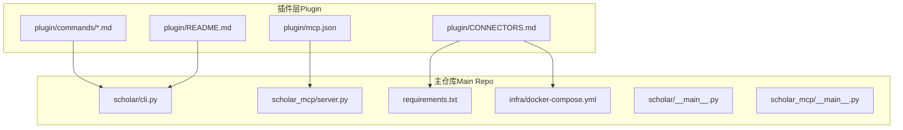
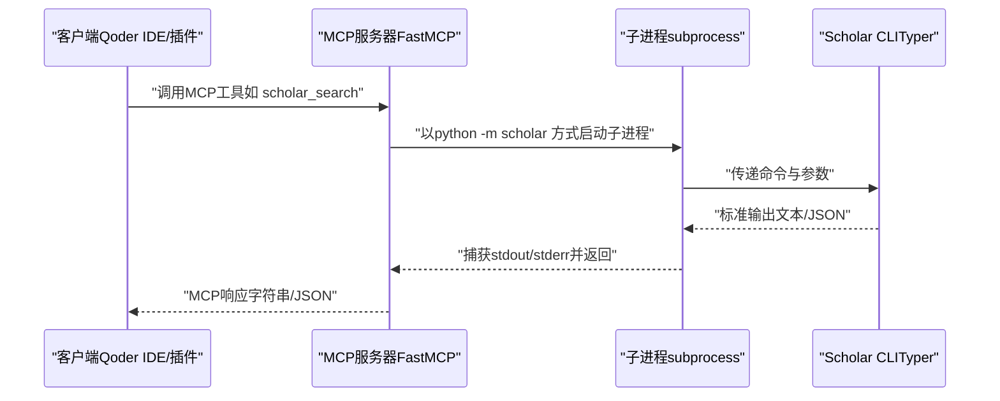
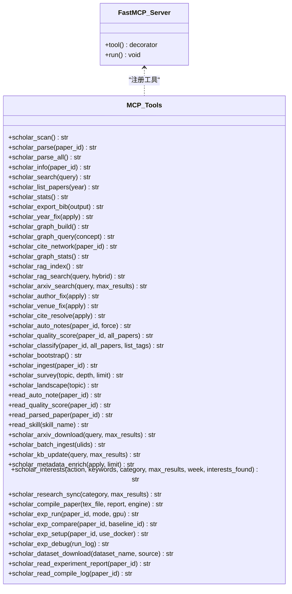
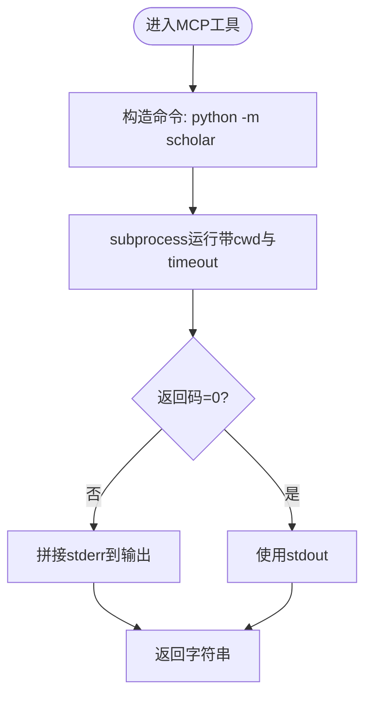
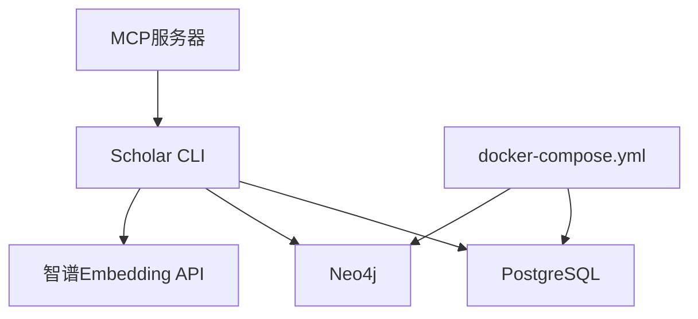

# API参考文档

<cite>
**本文档引用的文件**
- [mcp.json](file://plugin/mcp.json)
- [cli.py](file://scholar/cli.py)
- [server.py](file://scholar_mcp/server.py)
- [__main__.py](file://scholar/__main__.py)
- [__main__.py](file://scholar_mcp/__main__.py)
- [CONNECTORS.md](file://plugin/CONNECTORS.md)
- [README.md](file://plugin/README.md)
- [requirements.txt](file://requirements.txt)
- [docker-compose.yml](file://infra/docker-compose.yml)
- [find.md](file://plugin/commands/find.md)
- [health.md](file://plugin/commands/health.md)
- [paper.md](file://plugin/commands/paper.md)
- [resume.md](file://plugin/commands/resume.md)
- [stats.md](file://plugin/commands/stats.md)
- [sync.md](file://plugin/commands/sync.md)
</cite>

## 目录
1. [简介](#简介)
2. [项目结构](#项目结构)
3. [核心组件](#核心组件)
4. [架构总览](#架构总览)
5. [详细组件分析](#详细组件分析)
6. [依赖分析](#依赖分析)
7. [性能考虑](#性能考虑)
8. [故障排除指南](#故障排除指南)
9. [结论](#结论)
10. [附录](#附录)

## 简介
本文件为Scholar Studio项目的API参考文档，覆盖以下方面：
- CLI命令参考：命令语法、参数、使用示例与最佳实践
- MCP工具API：接口规范、调用协议与格式、扩展开发指南
- 外部系统对接：PostgreSQL、Neo4j、智谱Embedding API
- 错误码与处理策略：常见错误、返回值与排障建议
- 版本管理与兼容性：依赖版本、向后兼容策略
- 测试与性能优化：基准测试、并发与缓存建议

## 项目结构
该项目由“插件层”和“主仓库”两部分组成：
- 插件层（Plugin）：提供Skills、Commands、Rules、Hooks与MCP配置，负责工作流编排与用户交互
- 主仓库（Main Repo）：提供Python CLI与MCP Server，执行搜索、解析、索引、图谱构建等任务，并通过Docker管理数据库与图数据库

图表来源
- [plugin/README.md:1-79](file://plugin/README.md#L1-L79)
- [plugin/CONNECTORS.md:1-45](file://plugin/CONNECTORS.md#L1-L45)
- [plugin/mcp.json:1-16](file://plugin/mcp.json#L1-L16)
- [scholar/cli.py:1-800](file://scholar/cli.py#L1-L800)
- [scholar_mcp/server.py:1-631](file://scholar_mcp/server.py#L1-L631)
- [requirements.txt:1-14](file://requirements.txt#L1-L14)
- [infra/docker-compose.yml:1-44](file://infra/docker-compose.yml#L1-L44)

章节来源
- [plugin/README.md:1-79](file://plugin/README.md#L1-L79)
- [plugin/CONNECTORS.md:1-45](file://plugin/CONNECTORS.md#L1-L45)
- [plugin/mcp.json:1-16](file://plugin/mcp.json#L1-L16)
- [scholar/cli.py:1-800](file://scholar/cli.py#L1-L800)
- [scholar_mcp/server.py:1-631](file://scholar_mcp/server.py#L1-L631)
- [requirements.txt:1-14](file://requirements.txt#L1-L14)
- [infra/docker-compose.yml:1-44](file://infra/docker-compose.yml#L1-L44)

## 核心组件
- CLI入口与命令集
  - 入口：python -m scholar
  - 命令：scan、parse、parse-all、info、search、list-papers、stats、export-bib、author-fix、arxiv-search、graph-build、graph-stats、graph-query、cite-network、rag-index、rag-search、arxiv-download、batch-ingest、kb-update、metadata-enrich、interests、research-sync、compile-paper、exp-run、exp-compare、exp-setup、exp-debug、dataset-download、read_experiment_report、read_compile_log、bootstrap、ingest、survey、landscape、auto-notes、quality-score、classify、year-fix、venue-fix、cite-resolve、read_auto_note、read_quality_score、read_parsed_paper、read_skill
- MCP服务器
  - 入口：python -m scholar_mcp
  - 工具：41个MCP工具，覆盖论文解析、检索、图谱、RAG、元数据补全、实验执行、编译、技能读取等
- 外部依赖
  - PostgreSQL（结构化数据与RAG向量索引）
  - Neo4j（引用网络与概念图谱）
  - 智谱Embedding API（RAG语义检索）

章节来源
- [__main__.py:1-8](file://scholar/__main__.py#L1-L8)
- [cli.py:1-800](file://scholar/cli.py#L1-L800)
- [__main__.py:1-5](file://scholar_mcp/__main__.py#L1-L5)
- [server.py:1-631](file://scholar_mcp/server.py#L1-L631)
- [CONNECTORS.md:1-45](file://plugin/CONNECTORS.md#L1-L45)

## 架构总览
MCP服务器作为Scholar Studio的“执行层”，将CLI命令封装为MCP工具，供IDE或其他客户端调用；CLI则面向终端用户与自动化脚本。

图表来源
- [server.py:23-36](file://scholar_mcp/server.py#L23-L36)
- [server.py:41-80](file://scholar_mcp/server.py#L41-L80)
- [cli.py:1-800](file://scholar/cli.py#L1-L800)

## 详细组件分析

### CLI命令参考与最佳实践
- 命令入口
  - 使用：python -m scholar <command> [options]
  - 示例：python -m scholar stats
- 常用命令与参数
  - scan：扫描论文目录，显示解析状态
  - parse <paper_id>：解析单篇TeX源为结构化JSON
  - parse-all [--limit] [--force]：批量解析
  - info <paper_id>：显示解析后论文的详细信息
  - search <keyword> [--limit]：全文搜索（标题/摘要/章节）
  - list-papers [--year] [--limit]：列出解析后的论文
  - stats：知识库统计（论文数、字段覆盖率、期刊分布）
  - export-bib [--output]：导出BibTeX
  - author-fix [--apply] [--limit]：通过arXiv API补全作者
  - arxiv-search <query> [--max]：arXiv搜索
  - graph-build：构建引用网络与概念图谱（需Neo4j）
  - graph-stats：图谱统计（节点/边/中心性/孤立节点）
  - graph-query <concept>：基于概念图谱查询
  - cite-network [<paper_id>]：引用网络分析（全局/单篇）
  - rag-index：构建RAG向量索引（需SCHOLAR_EMBEDDING_API_KEY）
  - rag-search <query> [--hybrid]：语义检索（可混合BM25+RRF）
  - arxiv-download <query> [--max]：下载arXiv论文TeX源
  - batch-ingest [--ulids]：批量入库（解析→元数据增强→图谱更新→笔记→评分→分类）
  - kb-update [--query] [--max]：一键更新知识库（arXiv搜索→下载→批量入库）
  - metadata-enrich [--apply] [--limit]：回填arXiv ID/DOI
  - interests <action> [--keywords] [--category] [--max] [--week] [--found]：研究方向管理与对话日志分析
  - research-sync [--category] [--max]：按研究方向同步arXiv论文并全量入库
  - compile-paper <tex_file> [--report] [--engine]：LaTeX编译与错误报告
  - exp-run <paper_id> [--mode quick|full] [--gpu]：运行实验代码并收集指标
  - exp-compare <paper_id> [--baseline-id]：与论文报告指标对比
  - exp-setup <paper_id> [--docker]：设置实验环境（conda/Docker）
  - exp-debug <run_log>：根据运行日志诊断失败原因
  - dataset-download <dataset_name> [--source auto|huggingface|paperswithcode]：下载论文使用的数据集
  - read_experiment_report <paper_id>：读取实验运行日志与结果
  - read_compile_log <paper_id>：读取LaTeX编译日志
  - bootstrap：全量初始化（解析→年份修正→图谱构建→RAG索引→自动生成笔记→质量评分→分类）
  - ingest <paper_id>：新论文入库流水线
  - survey <topic> [--depth standard|full] [--limit]：全面文献调研报告
  - landscape <topic>：领域全景分析报告
  - auto-notes [<paper_id>] [--force]：生成结构化阅读笔记
  - quality-score [<paper_id>|--all]：多维度质量评分
  - classify [<paper_id>|--all|--list-tags]：论文分类标签
  - year-fix [--apply]：通过Lean4数据库补全年份
  - venue-fix [--apply]：通过启发式补全会议/期刊
  - cite-resolve [--apply]：解析引用关系（内部匹配+arXiv+外部节点）
  - read_auto_note <paper_id>：读取自动生成的阅读笔记
  - read_quality_score <paper_id>：读取质量评分JSON
  - read_parsed_paper <paper_id>：读取解析后的完整JSON
  - read_skill <skill_name>：读取技能说明文档
- 最佳实践
  - 批量操作时合理设置limit，避免一次性处理过多数据
  - 使用--apply谨慎提交变更，先dry-run预览
  - RAG功能需配置SCHOLAR_EMBEDDING_API_KEY
  - 图谱功能需启动Neo4j容器
  - 编译与实验运行建议指定引擎与GPU开关

章节来源
- [__main__.py:1-8](file://scholar/__main__.py#L1-L8)
- [cli.py:1-800](file://scholar/cli.py#L1-L800)

### MCP工具API规范
- 服务器与配置
  - 入口：python -m scholar_mcp
  - 配置：plugin/mcp.json中声明scholar MCP服务器，通过python -m scholar执行命令
- 工具清单与参数
  - 论文库：scholar_scan、scholar_parse、scholar_parse_all、scholar_info、scholar_search、scholar_list_papers、scholar_stats、scholar_export_bib、scholar_year_fix
  - 图与网络：scholar_graph_build、scholar_graph_query、scholar_cite_network、scholar_graph_stats
  - RAG：scholar_rag_index、scholar_rag_search
  - 外部：scholar_arxiv_search
  - 元数据补全：scholar_author_fix、scholar_venue_fix、scholar_cite_resolve
  - 批处理预处理：scholar_auto_notes、scholar_quality_score、scholar_classify
  - 编排：scholar_bootstrap、scholar_ingest、scholar_survey、scholar_landscape
  - 文件访问：read_auto_note、read_quality_score、read_parsed_paper、read_skill
  - 知识库更新：scholar_arxiv_download、scholar_batch_ingest、scholar_kb_update、scholar_metadata_enrich
  - 研究循环：scholar_interests、scholar_research_sync
  - 执行层：scholar_compile_paper、scholar_exp_run、scholar_exp_compare、scholar_exp_setup、scholar_exp_debug、scholar_dataset_download、scholar_read_experiment_report、scholar_read_compile_log
- 调用协议与格式
  - 协议：MCP（Model Context Protocol）工具调用
  - 参数：工具函数参数映射到CLI选项与位置参数
  - 返回：字符串（文本/JSON），stderr会附加错误提示
- 扩展开发指南
  - 新增工具：在server.py中添加@mcp.tool()装饰器函数，内部调用_subprocess运行python -m scholar <command>
  - 参数校验：对必填参数进行校验，必要时提供默认值
  - 超时控制：为耗时操作设置超时（如parse-all/graph-build/rag-index）
  - 错误处理：捕获子进程返回码与stderr，统一拼接到输出中返回

图表来源
- [server.py:17-20](file://scholar_mcp/server.py#L17-L20)
- [server.py:41-631](file://scholar_mcp/server.py#L41-L631)

章节来源
- [mcp.json:1-16](file://plugin/mcp.json#L1-L16)
- [server.py:1-631](file://scholar_mcp/server.py#L1-L631)

### HTTP接口规范
- 当前实现：本项目未提供HTTP接口。MCP服务器通过本地IPC（子进程）与CLI交互，CLI通过Typer提供命令行界面。
- 若需HTTP接口，可在现有MCP/CLI之上增加一层HTTP适配器（例如FastAPI/Flask），将MCP工具映射为REST端点，并实现鉴权、限流与日志记录。

[本节为概念性说明，不直接分析具体文件]

### WebSocket通信协议
- 当前实现：未提供WebSocket通信。
- 若需实时通信，可在HTTP适配器层引入WebSocket端点，用于推送MCP工具执行进度、结果与错误事件。

[本节为概念性说明，不直接分析具体文件]

### IPC通信机制
- 子进程调用：MCP工具通过subprocess运行python -m scholar <command>，捕获stdout/stderr并返回给调用方
- 超时控制：为耗时操作设置超时（如parse-all:600s、graph-build:300s、rag-index:600s、bootstrap:1200s、auto-notes:300s、quality/classify:300s、survey/landscape:300s、compile-paper:300s、exp-run:3600s、kb-update:600s、metadata-enrich:600s）
- 错误传播：若子进程返回码非0，将stderr拼接到输出中返回

图表来源
- [server.py:23-36](file://scholar_mcp/server.py#L23-L36)

章节来源
- [server.py:23-36](file://scholar_mcp/server.py#L23-L36)

### 请求与响应示例
- MCP工具调用（示例）
  - 请求：调用scholar_search(query="Transformer")
  - 响应：返回搜索结果表格或空结果提示
- CLI命令调用（示例）
  - 请求：python -m scholar stats
  - 响应：知识库统计面板（论文数、字段覆盖率、数据库状态等）
- 文件读取工具（示例）
  - 请求：read_parsed_paper(paper_id="01KT6MT...")
  - 响应：解析后的JSON内容或“未找到”的提示

章节来源
- [server.py:74-80](file://scholar_mcp/server.py#L74-L80)
- [cli.py:422-476](file://scholar/cli.py#L422-L476)
- [server.py:373-384](file://scholar_mcp/server.py#L373-L384)

### 认证方法
- 当前实现：未提供认证机制。MCP服务器与CLI均为本地IPC调用。
- 若扩展为HTTP接口，建议采用API Key或Bearer Token，并在网关层实现CORS与速率限制。

[本节为概念性说明，不直接分析具体文件]

### 错误码与处理策略
- 子进程返回码
  - 0：成功
  - 非0：失败，stderr会被拼接到输出中返回
- 常见错误场景
  - 数据库不可用：scan/info/search/list-papers/stats等命令在无数据库时降级为文件模式
  - Neo4j不可用：graph-build/graph-stats/graph-query等命令提示启动容器
  - RAG未配置：rag-index/rag-search需设置SCHOLAR_EMBEDDING_API_KEY
  - arXiv请求失败：提示设置代理或检查网络
- 处理策略
  - 优先检查依赖服务（PostgreSQL/Neo4j/Embedding API）
  - 对批量任务设置limit与超时，避免长时间阻塞
  - 使用--apply谨慎提交变更，先dry-run预览

章节来源
- [cli.py:32-40](file://scholar/cli.py#L32-L40)
- [server.py:128-132](file://scholar_mcp/server.py#L128-L132)
- [server.py:184-192](file://scholar_mcp/server.py#L184-L192)
- [CONNECTORS.md:1-45](file://plugin/CONNECTORS.md#L1-L45)

### 版本管理与兼容性
- 依赖版本
  - typer>=0.9.0、rich>=13.0、psycopg2-binary>=2.9、neo4j>=5.0、python-dotenv>=1.0、PyMuPDF>=1.23、mcp>=1.0
  - 可选依赖：datasets>=2.14（HuggingFace下载）、ulid>=1.1（ULID生成）
- 兼容性建议
  - 保持Python版本与依赖范围一致
  - MCP工具参数命名与CLI选项保持一致，便于向后兼容
  - 批处理工具保留默认超时，避免破坏调用方行为

章节来源
- [requirements.txt:1-14](file://requirements.txt#L1-L14)

### API测试
- 单元测试
  - 使用pytest与test目录下的测试文件进行单元测试
- 端到端测试
  - 使用test_e2e.py进行端到端集成测试
- 建议的测试场景
  - MCP工具调用（含超时与错误分支）
  - CLI命令在有/无数据库下的行为差异
  - Neo4j可用性对图谱功能的影响
  - RAG API Key缺失时的降级行为

章节来源
- [test/test_e2e.py](file://test/test_e2e.py)
- [test/test_cli.py](file://test/test_cli.py)

## 依赖分析
- 外部服务
  - PostgreSQL：结构化数据与RAG向量索引
  - Neo4j：引用网络与概念图谱
  - 智谱Embedding API：RAG语义检索
- 容器编排
  - docker-compose.yml提供PostgreSQL与Neo4j服务定义与健康检查
- 依赖关系
  - MCP服务器依赖Python包与外部服务
  - CLI命令依赖数据库与可选图数据库
  - RAG功能依赖外部Embedding API

图表来源
- [server.py:1-631](file://scholar_mcp/server.py#L1-L631)
- [cli.py:1-800](file://scholar/cli.py#L1-L800)
- [CONNECTORS.md:1-45](file://plugin/CONNECTORS.md#L1-L45)
- [infra/docker-compose.yml:1-44](file://infra/docker-compose.yml#L1-L44)

章节来源
- [CONNECTORS.md:1-45](file://plugin/CONNECTORS.md#L1-L45)
- [infra/docker-compose.yml:1-44](file://infra/docker-compose.yml#L1-L44)

## 性能考虑
- 批处理优化
  - parse-all、graph-build、rag-index、bootstrap、auto-notes、quality-score、classify、survey、landscape、compile-paper、exp-run、kb-update、metadata-enrich等工具均设置了合理的超时，避免长时间阻塞
- I/O与缓存
  - 解析后的JSON与中间产物保存在output目录，建议定期清理与归档
- 并发与限流
  - 建议在HTTP适配层实现并发控制与队列，避免同时触发多个长耗时任务
- 网络与API
  - RAG调用需考虑API限流与重试策略

[本节提供一般性指导，不直接分析具体文件]

## 故障排除指南
- 数据库不可用
  - 现象：scan/info/search/list-papers/stats等命令降级为文件模式
  - 处理：确认PostgreSQL连接参数与服务状态
- Neo4j不可用
  - 现象：graph-build/graph-stats/graph-query等命令报错
  - 处理：启动Neo4j容器或禁用相关功能
- RAG未配置
  - 现象：rag-index/rag-search报错
  - 处理：设置SCHOLAR_EMBEDDING_API_KEY或禁用RAG功能
- arXiv请求失败
  - 现象：arxiv-search/author-fix等命令失败
  - 处理：设置HTTP_PROXY或检查网络
- MCP工具超时
  - 现象：parse-all/graph-build/rag-index等工具返回超时
  - 处理：增大超时或分批执行

章节来源
- [cli.py:32-40](file://scholar/cli.py#L32-L40)
- [server.py:128-132](file://scholar_mcp/server.py#L128-L132)
- [server.py:184-192](file://scholar_mcp/server.py#L184-L192)
- [CONNECTORS.md:1-45](file://plugin/CONNECTORS.md#L1-L45)

## 结论
本API参考文档梳理了Scholar Studio的CLI与MCP工具体系，明确了命令语法、参数、使用示例与最佳实践，并提供了错误处理与性能优化建议。对于需要HTTP/WebSocket接口的场景，可在现有MCP/CLI基础上扩展适配层，以满足更广泛的集成需求。

## 附录
- 插件能力概览
  - Skills：14个（原子+工作流）
  - Commands：4个（stats/find/paper/health/sync）
  - Rules/Hooks：1/2
  - MCP Server：1个（41个工具）
- 外部服务依赖与安装
  - PostgreSQL、Neo4j、智谱Embedding API、Scholar Python包

章节来源
- [plugin/README.md:50-79](file://plugin/README.md#L50-L79)
- [plugin/CONNECTORS.md:1-45](file://plugin/CONNECTORS.md#L1-L45)