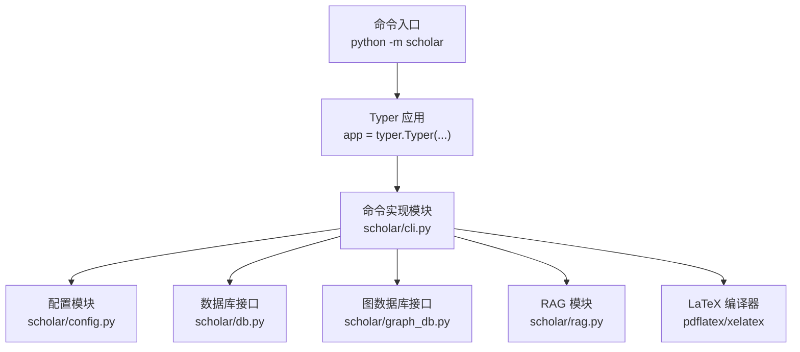
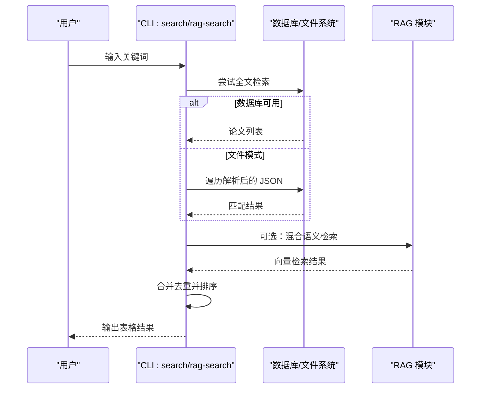
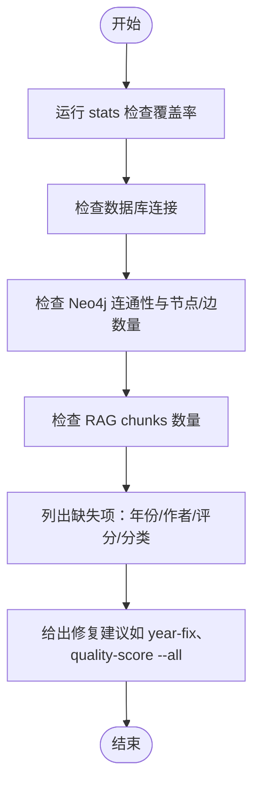
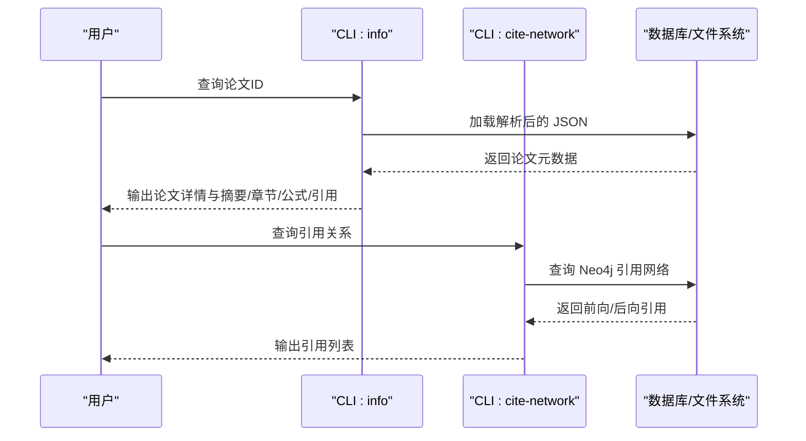
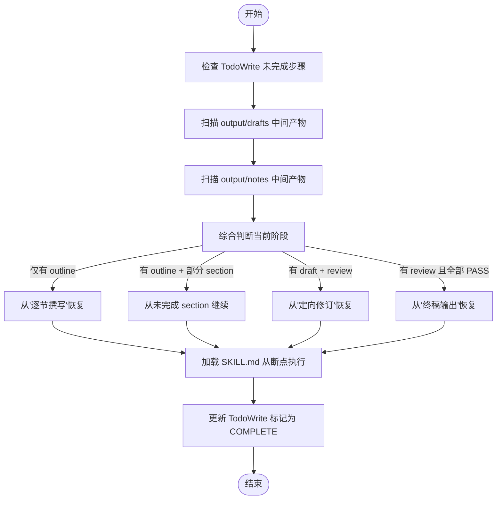
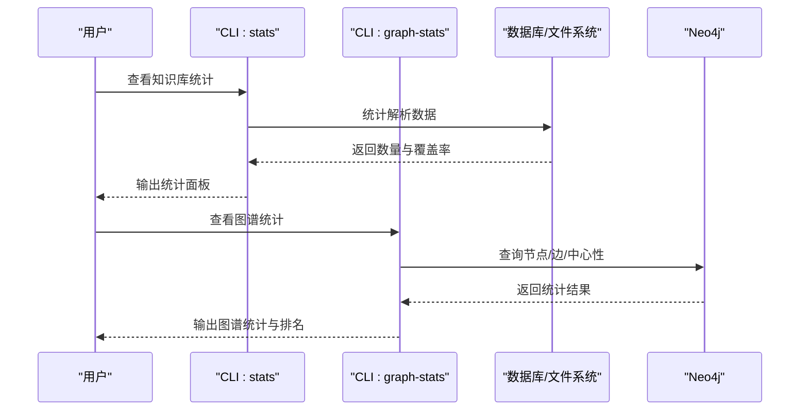
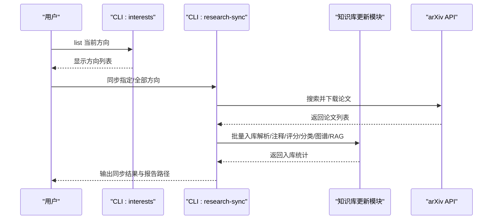
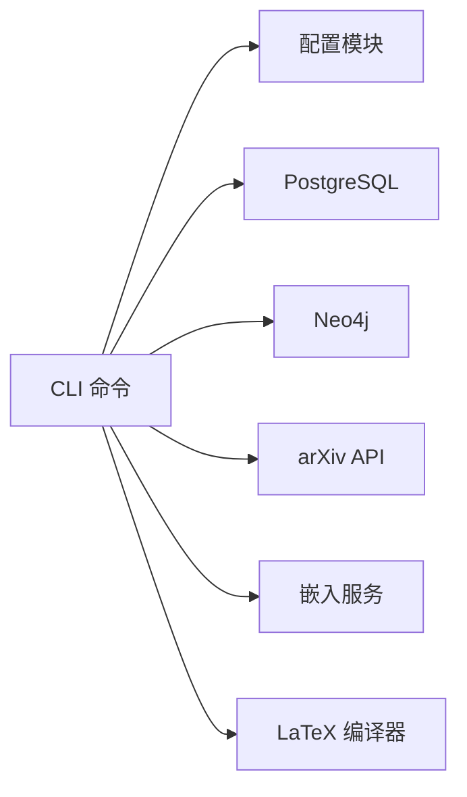

# CLI命令参考

<cite>
**本文档引用的文件**
- [cli.py](file://scholar/cli.py)
- [config.py](file://scholar/config.py)
- [__main__.py](file://scholar/__main__.py)
- [test_cli.py](file://test/test_cli.py)
- [find.md](file://plugin/commands/find.md)
- [health.md](file://plugin/commands/health.md)
- [paper.md](file://plugin/commands/paper.md)
- [resume.md](file://plugin/commands/resume.md)
- [stats.md](file://plugin/commands/stats.md)
- [sync.md](file://plugin/commands/sync.md)
</cite>

## 目录
1. [简介](#简介)
2. [项目结构](#项目结构)
3. [核心组件](#核心组件)
4. [架构总览](#架构总览)
5. [详细组件分析](#详细组件分析)
6. [依赖分析](#依赖分析)
7. [性能考虑](#性能考虑)
8. [故障排除指南](#故障排除指南)
9. [结论](#结论)
10. [附录](#附录)

## 简介
本文件为 Scholar Studio 的 CLI 命令参考，聚焦于核心命令“find、health、paper、resume、stats、sync”的功能特性、语法结构、参数选项、使用示例、错误处理、组合使用场景、批量操作、配置文件交互、环境变量、权限与安全注意事项、调试与日志分析方法。CLI 基于 Typer 构建，入口为 python -m scholar，并通过 rich 输出富文本界面。

## 项目结构
- CLI 主入口位于 scholar/__main__.py，委托给 scholar/cli.py 定义的 Typer 应用。
- 核心命令集中在 scholar/cli.py 中，按功能域组织（解析、查询、统计、图谱、RAG、实验、下载等）。
- 配置集中于 scholar/config.py，支持 .env 环境变量注入，定义数据库、图数据库、嵌入模型、编译器等路径与凭据。
- 测试位于 test/test_cli.py，覆盖帮助信息、基本输出与错误处理行为。



图表来源
- [__main__.py:1-8](file://scholar/__main__.py#L1-L8)
- [cli.py:23-29](file://scholar/cli.py#L23-L29)
- [config.py:1-119](file://scholar/config.py#L1-L119)

章节来源
- [__main__.py:1-8](file://scholar/__main__.py#L1-L8)
- [cli.py:1-80](file://scholar/cli.py#L1-L80)
- [config.py:1-119](file://scholar/config.py#L1-L119)

## 核心组件
- Typer 应用与命令注册：通过 app.command() 注册各类子命令，统一帮助与参数解析。
- 富文本输出：使用 rich.Console、Table、Panel 提供结构化输出。
- 数据访问：封装数据库连接与查询，支持文件模式与数据库模式双态。
- 外部服务集成：arXiv API、Neo4j、PostgreSQL/pgvector、嵌入服务等。

章节来源
- [cli.py:23-29](file://scholar/cli.py#L23-L29)
- [config.py:44-66](file://scholar/config.py#L44-L66)

## 架构总览
下图展示 CLI 与外部系统的关系：命令通过配置模块加载环境变量，访问数据库与图数据库，调用 RAG 模块进行向量检索，或通过 LaTeX 编译器生成 PDF 报告。

```mermaid
graph TB
subgraph "CLI"
CLI["Typer 应用<br/>scholar/cli.py"]
end
subgraph "配置"
CFG["环境变量与路径<br/>scholar/config.py"]
end
subgraph "数据层"
PG["PostgreSQL + pgvector"]
FS["JSON/文件系统"]
end
subgraph "图谱"
NEO["Neo4j"]
end
subgraph "嵌入"
EMB["嵌入服务 API"]
end
subgraph "编译"
LTX["pdflatex/xelatex"]
end
CLI --> CFG
CLI --> PG
CLI --> FS
CLI --> NEO
CLI --> EMB
CLI --> LTX
```

图表来源
- [cli.py:420-477](file://scholar/cli.py#L420-L477)
- [config.py:44-66](file://scholar/config.py#L44-L66)

## 详细组件分析

### 命令：find（快速检索）
- 功能：在知识库中进行全文搜索与语义搜索的组合，合并去重后按相关度排序展示前若干论文。
- 语法：
  - 全文搜索：python -m scholar search "<关键词>"
  - 语义搜索：python -m scholar rag-search "<关键词>" --hybrid
- 输入输出：
  - 输入：关键词字符串；可选 limit 控制结果数量。
  - 输出：表格列出论文 ID、标题、年份等；语义搜索额外显示片段相似度。
- 错误处理：未找到结果时提示；数据库不可用时回退至文件模式。
- 使用示例（基于插件文档）：
  - 先全文搜索，再语义搜索，最后合并展示。
- 最佳实践：
  - 先用全文搜索缩小范围，再用 --hybrid 语义搜索提升召回。
  - 适当调整 limit，避免过多噪声。



图表来源
- [cli.py:309-370](file://scholar/cli.py#L309-L370)
- [cli.py:952-990](file://scholar/cli.py#L952-L990)
- [find.md:1-10](file://plugin/commands/find.md#L1-L10)

章节来源
- [cli.py:309-370](file://scholar/cli.py#L309-L370)
- [cli.py:952-990](file://scholar/cli.py#L952-L990)
- [find.md:1-10](file://plugin/commands/find.md#L1-L10)

### 命令：health（知识库健康检查）
- 功能：检查元数据覆盖率、数据库与图谱一致性、RAG 索引状态、缺失字段统计，并给出修复建议。
- 语法：python -m scholar stats（配合其他命令进行综合检查）
- 输入输出：
  - 输出：知识库统计面板（论文总数、段落数、公式数、引用数、数据库状态、元数据覆盖率等）。
- 错误处理：数据库不可用时以文件模式统计；Neo4j 不可用时提示启动容器或安装驱动。
- 使用示例（基于插件文档）：
  - 运行 stats 检查覆盖率；检查 PG 与 Neo4j 一致性；检查 RAG chunks 是否为 0；列出需补全的论文项。
- 最佳实践：
  - 定期运行 health 检查，优先修复缺失年份、作者、评分与分类。



图表来源
- [cli.py:418-487](file://scholar/cli.py#L418-L487)
- [health.md:1-13](file://plugin/commands/health.md#L1-L13)

章节来源
- [cli.py:418-487](file://scholar/cli.py#L418-L487)
- [health.md:1-13](file://plugin/commands/health.md#L1-L13)

### 命令：paper（论文详情与引用关系）
- 功能：查看某篇论文的元数据、关键概念、引用关系与质量评分；支持通过 ULID、arXiv ID、DOI 或关键词解析。
- 语法：python -m scholar info <paper_id>；python -m scholar cite-network <paper_id>
- 输入输出：
  - info 输出：标题、作者、年份、会议、TeX 文件数、主文件、摘要、章节、公式、引用等。
  - cite-network 输出：前向引用（该论文引用他者）与后向引用（被他人引用）各若干篇。
- 错误处理：未解析时提示先执行 parse；ID 解析失败时提示不存在。
- 使用示例（基于插件文档）：
  - info 获取基础信息；若存在质量评分与阅读笔记则一并展示；cite-network 展示引用关系。
- 最佳实践：
  - 先 parse 再 info；引用关系有助于识别高影响力论文。



图表来源
- [cli.py:239-306](file://scholar/cli.py#L239-L306)
- [cli.py:836-885](file://scholar/cli.py#L836-L885)
- [paper.md:1-11](file://plugin/commands/paper.md#L1-L11)

章节来源
- [cli.py:239-306](file://scholar/cli.py#L239-L306)
- [cli.py:836-885](file://scholar/cli.py#L836-L885)
- [paper.md:1-11](file://plugin/commands/paper.md#L1-L11)

### 命令：resume（恢复中断的研究/写作流程）
- 功能：扫描中间产物（草稿、笔记、质量评分），判断当前阶段并从断点继续执行，最终更新任务状态。
- 语法：python -m scholar resume
- 输入输出：
  - 输出：综合断点判断与建议，加载对应技能文件（SKILL.md）从断点步骤开始执行。
- 错误处理：未发现未完成步骤时提示无断点；找不到中间产物时提示重新开始。
- 使用示例（基于插件文档）：
  - 扫描 output/drafts 与 output/notes，按 outline/review/draft 等阶段推断断点，加载 SKILL.md 继续。
- 最佳实践：
  - 定期提交中间产物，确保断点可恢复；完成后更新任务状态为 COMPLETE。



图表来源
- [resume.md:1-22](file://plugin/commands/resume.md#L1-L22)

章节来源
- [resume.md:1-22](file://plugin/commands/resume.md#L1-L22)

### 命令：stats（知识库状态统计）
- 功能：快速查看知识库状态（论文数量、图谱规模、RAG 覆盖率等）。
- 语法：python -m scholar stats；python -m scholar graph-stats
- 输入输出：
  - stats 输出：论文文件夹数、解析数、段落数、公式数、引用数、数据库状态、元数据覆盖率。
  - graph-stats 输出：节点/边数量、已解析/未解析引用、孤立节点、中心性指标等。
- 错误处理：数据库/图库不可用时提示启动服务或安装驱动。
- 使用示例（基于插件文档）：
  - 运行 stats 与 graph-stats，汇总所有数据层的覆盖率与数量。
- 最佳实践：
  - 将 stats 作为日常健康检查的一部分；关注元数据覆盖率变化趋势。



图表来源
- [cli.py:418-487](file://scholar/cli.py#L418-L487)
- [cli.py:708-791](file://scholar/cli.py#L708-L791)
- [stats.md:1-10](file://plugin/commands/stats.md#L1-L10)

章节来源
- [cli.py:418-487](file://scholar/cli.py#L418-L487)
- [cli.py:708-791](file://scholar/cli.py#L708-L791)
- [stats.md:1-10](file://plugin/commands/stats.md#L1-L10)

### 命令：sync（研究方向同步）
- 功能：根据研究方向搜索 arXiv 并全流程入库，支持单方向与全方向同步。
- 语法：python -m scholar interests list；python -m scholar research-sync --max 10；python -m scholar stats；查看同步报告 output/digests/sync-*.md
- 输入输出：
  - 输出：同步结果面板（方向、下载数、入库数、错误数）；生成同步报告。
- 错误处理：无研究方向时提示；同步过程中出现错误会记录并继续处理其他方向。
- 使用示例（基于插件文档）：
  - 列出当前方向，同步所有方向，确认入库结果，展示同步报告。
- 最佳实践：
  - 定期维护研究方向；控制 --max 限制每次同步数量，避免资源占用过高。



图表来源
- [cli.py:2421-2455](file://scholar/cli.py#L2421-L2455)
- [cli.py:2343-2419](file://scholar/cli.py#L2343-L2419)
- [sync.md:1-11](file://plugin/commands/sync.md#L1-L11)

章节来源
- [cli.py:2421-2455](file://scholar/cli.py#L2421-L2455)
- [cli.py:2343-2419](file://scholar/cli.py#L2343-L2419)
- [sync.md:1-11](file://plugin/commands/sync.md#L1-L11)

## 依赖分析
- CLI 与配置：CLI 通过 config.py 读取环境变量与目录路径，确保跨平台兼容与可配置性。
- 外部依赖：PostgreSQL（结构化数据与 RAG）、Neo4j（图谱）、arXiv API（论文检索）、嵌入服务（RAG 向量）、LaTeX 编译器（PDF 报告）。
- 错误传播：命令层捕获异常并优雅提示，避免崩溃；部分命令提供 --apply/--dry-run 降低风险。



图表来源
- [config.py:44-66](file://scholar/config.py#L44-L66)
- [cli.py:926-950](file://scholar/cli.py#L926-L950)

章节来源
- [config.py:44-66](file://scholar/config.py#L44-L66)
- [cli.py:926-950](file://scholar/cli.py#L926-L950)

## 性能考虑
- 批量操作：parse-all、batch-ingest、quality-score --all、classify --all 等命令支持 limit 与并行进度条，减少一次性负载。
- 检索优化：search 优先数据库查询；rag-search 支持混合检索（向量+BM25+RRF）提升相关性。
- I/O 优化：输出目录统一管理，避免重复解析与下载；LaTeX 编译采用多轮尝试与 bibtex 后处理。
- 资源控制：实验运行设置超时时间，避免长时间阻塞。

## 故障排除指南
- 常见问题与解决：
  - 数据库不可用：stats 输出“not available (file-only mode)”；建议启动 PostgreSQL/pgvector 或检查连接参数。
  - Neo4j 不可用：graph-build/graph-stats 提示启动容器或安装驱动；检查 SCHOLAR_NEO4J_* 环境变量。
  - RAG 未构建：rag-search 提示先执行 rag-index；检查 SCHOLAR_EMBEDDING_API_KEY 与提供商配置。
  - arXiv 请求失败：提示设置代理或重试；检查 SCHOLAR_ARXIV_TIMEOUT/SCHOLAR_ARXIV_RETRIES。
  - LaTeX 编译失败：compile-paper 提供结构化错误报告（FATAL/WARN/INFO），定位 overfull/underfull 与未定义引用。
- 调试技巧：
  - 使用 --help 快速验证命令是否存在与参数解析正确。
  - 使用 --report 仅解析现有日志，不触发编译。
  - 实验失败使用 exp-debug 自动提取常见问题（模块缺失、OOM、文件未找到、运行时错误）。
- 日志分析：
  - 查看 output/logs 与各命令输出面板中的统计信息。
  - 实验日志保存在 experiments/*/run_log.txt，便于对比与回归分析。

章节来源
- [cli.py:660-705](file://scholar/cli.py#L660-L705)
- [cli.py:926-950](file://scholar/cli.py#L926-L950)
- [cli.py:1810-1974](file://scholar/cli.py#L1810-L1974)
- [cli.py:2171-2214](file://scholar/cli.py#L2171-L2214)
- [test_cli.py:95-111](file://test/test_cli.py#L95-L111)

## 结论
本文档系统梳理了 Scholar Studio 的 CLI 命令，重点围绕 find、health、paper、resume、stats、sync 的使用方法与最佳实践，结合配置、错误处理与调试技巧，帮助用户高效完成论文检索、知识库维护、研究流程恢复与批量入库等任务。建议在生产环境中定期运行 health 与 stats，合理设置环境变量与资源上限，并利用断点恢复与批量命令提升效率。

## 附录

### 环境变量与配置要点
- 数据库与图谱：SCHOLAR_PG_HOST/PORT/NAME/USER/PASS；SCHOLAR_NEO4J_URI/USER/PASS
- 嵌入服务：SCHOLAR_EMBEDDING_PROVIDER/MODEL/DIM/API_KEY
- LaTeX：SCHOLAR_LATEX_CMD
- arXiv：SCHOLAR_ARXIV_TIMEOUT/RETRIES，以及 HTTP_PROXY/HTTPS_PROXY
- 目录结构：由 config.py 统一管理，确保输出目录存在

章节来源
- [config.py:44-119](file://scholar/config.py#L44-L119)

### 权限与安全注意事项
- 嵌入 API Key：必须设置 SCHOLAR_EMBEDDING_API_KEY；避免在日志中泄露。
- 数据库凭据：确保只在受信任环境使用默认凭据，生产环境务必修改。
- 外部 API：合理设置超时与重试，避免被 arXiv 限流。
- 文件系统：注意输出目录权限，避免跨平台编码问题（如 Windows 的 emoji 输出）。

### 命令组合与批量操作示例
- 全流程入库：arxiv-download + batch-ingest + stats
- 研究同步：interests list → research-sync --max → stats → 查看 digest 报告
- 断点恢复：resume → 根据断点继续执行 SKILL.md 步骤 → 更新任务状态
- 健康检查：stats → graph-stats → 检查缺失字段 → year-fix/author-fix/metadata-enrich

章节来源
- [cli.py:1633-1721](file://scholar/cli.py#L1633-L1721)
- [cli.py:2421-2455](file://scholar/cli.py#L2421-L2455)
- [resume.md:1-22](file://plugin/commands/resume.md#L1-L22)
- [health.md:1-13](file://plugin/commands/health.md#L1-L13)