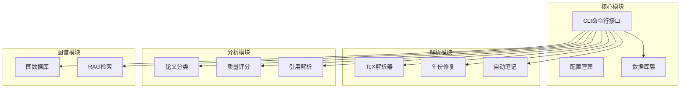
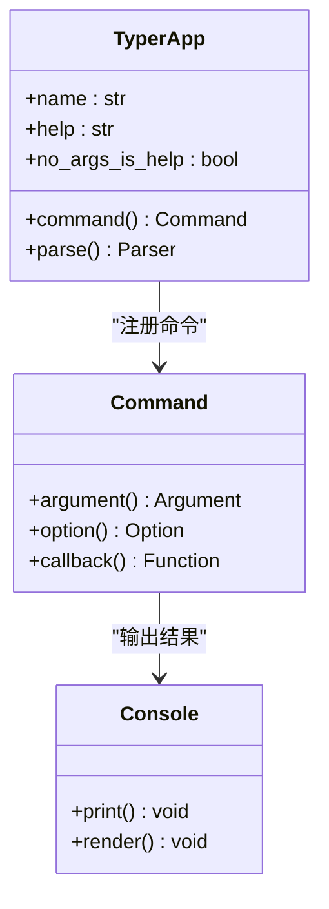
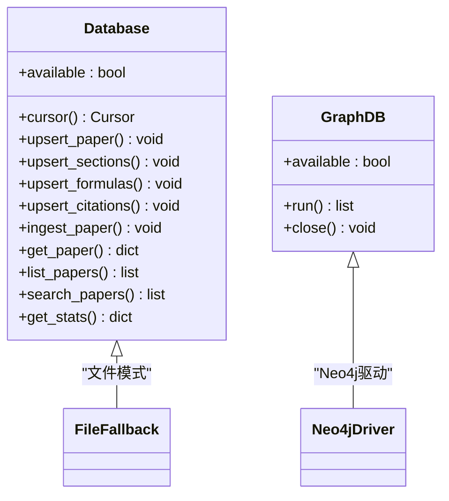
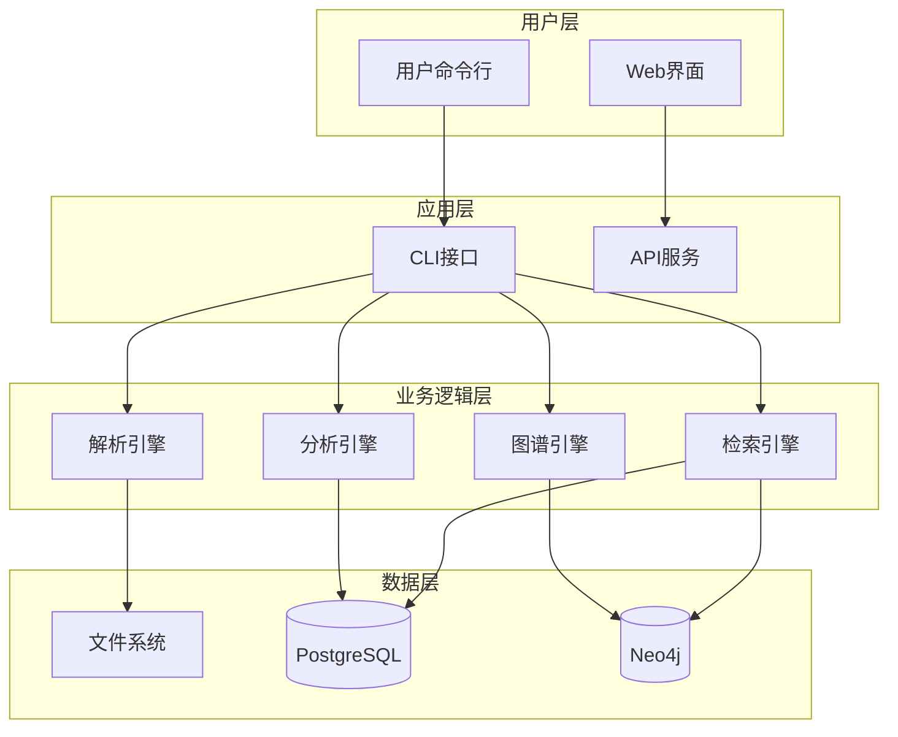
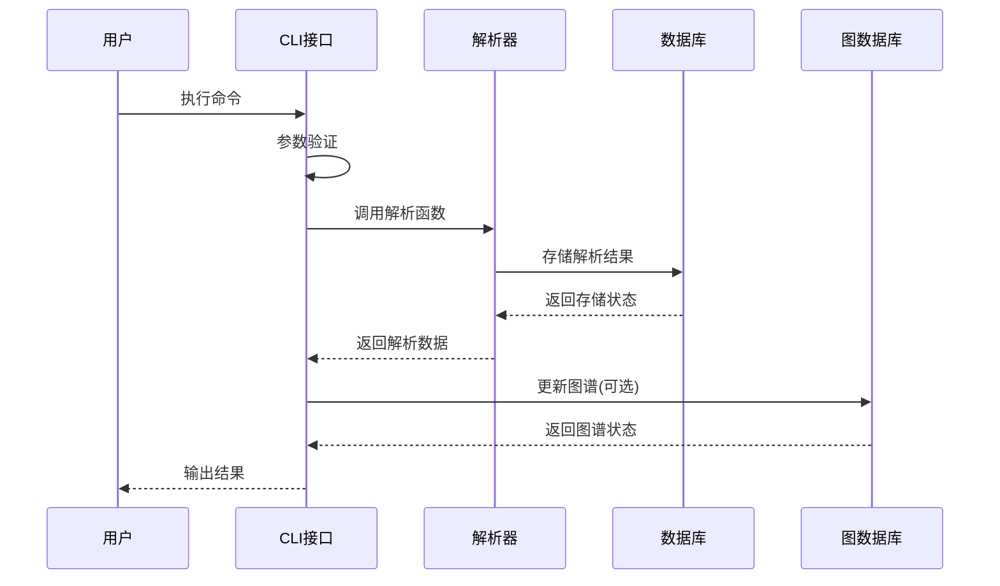
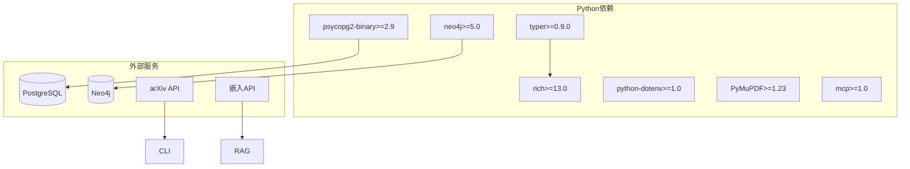
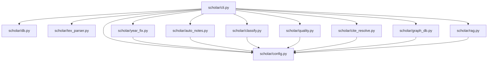

# CLI命令行接口

<cite>
**本文档引用的文件**
- [cli.py](file://scholar/cli.py)
- [__main__.py](file://scholar/__main__.py)
- [config.py](file://scholar/config.py)
- [db.py](file://scholar/db.py)
- [graph_db.py](file://scholar/graph_db.py)
- [tex_parser.py](file://scholar/tex_parser.py)
- [year_fix.py](file://scholar/year_fix.py)
- [auto_notes.py](file://scholar/auto_notes.py)
- [classify.py](file://scholar/classify.py)
- [quality.py](file://scholar/quality.py)
- [cite_resolve.py](file://scholar/cite_resolve.py)
- [rag.py](file://scholar/rag.py)
- [requirements.txt](file://requirements.txt)
</cite>

## 目录
1. [简介](#简介)
2. [项目结构](#项目结构)
3. [核心组件](#核心组件)
4. [架构概览](#架构概览)
5. [详细组件分析](#详细组件分析)
6. [依赖关系分析](#依赖关系分析)
7. [性能考虑](#性能考虑)
8. [故障排除指南](#故障排除指南)
9. [结论](#结论)

## 简介

Scholar Studio CLI是一个功能强大的学术研究工具包，提供了完整的命令行接口来管理学术论文知识库。该系统支持从LaTeX源码解析到知识图谱构建的全流程自动化处理。

主要功能包括：
- 论文解析和结构化提取
- 全文搜索和元数据管理
- 引用网络和概念图谱构建
- 质量评估和分类标签
- 自动笔记生成和RAG检索
- 批量处理和增量更新

## 项目结构



**图表来源**
- [cli.py:1-1638](file://scholar/cli.py#L1-L1638)
- [config.py:1-62](file://scholar/config.py#L1-L62)

**章节来源**
- [cli.py:1-1638](file://scholar/cli.py#L1-L1638)
- [config.py:1-62](file://scholar/config.py#L1-L62)

## 核心组件

### 命令行接口架构

Scholar Studio基于Typer框架构建，提供直观的命令行界面：



**图表来源**
- [cli.py:22-28](file://scholar/cli.py#L22-L28)

### 数据库抽象层



**图表来源**
- [db.py:24-270](file://scholar/db.py#L24-L270)
- [graph_db.py:32-70](file://scholar/graph_db.py#L32-L70)

**章节来源**
- [cli.py:31-40](file://scholar/cli.py#L31-L40)
- [db.py:24-270](file://scholar/db.py#L24-L270)
- [graph_db.py:32-70](file://scholar/graph_db.py#L32-L70)

## 架构概览

### 整体系统架构



**图表来源**
- [cli.py:1-1638](file://scholar/cli.py#L1-L1638)
- [config.py:39-62](file://scholar/config.py#L39-L62)

### 命令执行流程



**图表来源**
- [cli.py:131-168](file://scholar/cli.py#L131-L168)
- [db.py:164-170](file://scholar/db.py#L164-L170)

## 详细组件分析

### 基础命令

#### scan - 扫描论文目录
显示论文库状态，包括解析状态、源码存在性、PDF存在性和解析完成情况。

**命令语法**
```bash
python -m scholar scan
```

**参数说明**
- 无参数

**输出格式**
- 表格形式显示每篇论文的状态
- 包含状态、ULID、源码、PDF、解析标志
- 总计统计面板

**使用示例**
```bash
# 基本扫描
python -m scholar scan
```

**章节来源**
- [cli.py:45-126](file://scholar/cli.py#L45-L126)

#### parse - 解析单篇论文
解析指定ULID的论文，从TeX源码提取结构化信息。

**命令语法**
```bash
python -m scholar parse <ULID>
```

**参数说明**
- ULID: 论文唯一标识符（必需）

**输出格式**
- 详细解析信息面板
- 包括标题、作者、年份、会议、章节数量、公式数量、引用数量
- 输出文件路径

**错误处理**
- 目录不存在时返回错误
- 解析失败时抛出异常

**使用示例**
```bash
# 解析特定论文
python -m scholar parse 01KT6MTAVPBEJS3VEQHDQ731M2
```

**章节来源**
- [cli.py:131-168](file://scholar/cli.py#L131-L168)

#### parse-all - 批量解析论文
批量解析所有论文，支持限制数量和强制重新解析。

**命令语法**
```bash
python -m scholar parse-all [--limit N] [--force]
```

**参数说明**
- --limit INT: 最大解析数量（默认：0表示全部）
- --force: 强制重新解析已解析的论文

**输出格式**
- 进度条显示解析进度
- 成功/失败统计
- 失败论文列表（最多20个）

**使用示例**
```bash
# 解析前10篇论文
python -m scholar parse-all --limit 10

# 强制重新解析所有论文
python -m scholar parse-all --force
```

**章节来源**
- [cli.py:173-234](file://scholar/cli.py#L173-L234)

### 查询和信息命令

#### info - 显示论文详细信息
显示解析后论文的详细信息，包括元数据、摘要、章节结构、公式和引用。

**命令语法**
```bash
python -m scholar info <ULID>
```

**参数说明**
- ULID: 论文唯一标识符（必需）

**输出格式**
- 论文元数据面板
- 摘要预览
- 章节表格
- 公式列表（前10个）
- 引用列表（前15个）

**使用示例**
```bash
python -m scholar info 01KT6MTAVPBEJS3VEQHDQ731M2
```

**章节来源**
- [cli.py:239-301](file://scholar/cli.py#L239-L301)

#### search - 全文搜索
在解析后的论文中进行全文搜索，支持关键词匹配。

**命令语法**
```bash
python -m scholar search "<关键词>" [--limit N]
```

**参数说明**
- 关键词: 搜索关键词（必需）
- --limit INT: 最大结果数量（默认：20）

**输出格式**
- 搜索结果表格
- 包括论文ID、标题、年份

**搜索策略**
- 优先使用数据库查询
- 备用方案：遍历JSON文件进行关键字匹配
- 基于标题、摘要、章节内容的综合评分

**使用示例**
```bash
# 搜索机器学习相关论文
python -m scholar search "machine learning"

# 限制结果数量
python -m scholar search "neural networks" --limit 30
```

**章节来源**
- [cli.py:306-365](file://scholar/cli.py#L306-L365)

#### list-papers - 列出论文
列出已解析的论文，支持按年份过滤和数量限制。

**命令语法**
```bash
python -m scholar list-papers [--year Y] [--limit N]
```

**参数说明**
- --year INT: 按年份过滤
- --limit INT: 最大显示数量（默认：30）

**输出格式**
- 论表格
- 包括论文ID、标题、年份、会议、章节数、公式数、引用数

**使用示例**
```bash
# 列出所有论文
python -m scholar list-papers

# 按年份过滤
python -m scholar list-papers --year 2023
```

**章节来源**
- [cli.py:370-411](file://scholar/cli.py#L370-L411)

### 统计和导出命令

#### stats - 知识库统计
显示知识库的整体统计信息和元数据覆盖情况。

**命令语法**
```bash
python -m scholar stats
```

**参数说明**
- 无参数

**输出格式**
- 统计面板
  - 论文文件夹总数
  - 已解析论文数量
  - 总章节数、公式数、引用数
  - 数据库连接状态
  - 元数据覆盖率百分比
- 年份分布
- 会议分布

**使用示例**
```bash
python -m scholar stats
```

**章节来源**
- [cli.py:416-482](file://scholar/cli.py#L416-L482)

#### export-bib - 导出BibTeX
从解析的论文生成BibTeX引用文件。

**命令语法**
```bash
python -m scholar export-bib [--output PATH]
```

**参数说明**
- --output PATH: 输出文件路径（默认：output/bib/references.bib）

**输出格式**
- BibTeX文件
- 每篇论文一行引用条目

**使用示例**
```bash
# 导出到默认位置
python -m scholar export-bib

# 指定输出路径
python -m scholar export-bib --output ./references.bib
```

**章节来源**
- [cli.py:487-519](file://scholar/cli.py#L487-L519)

### 数据修复和增强命令

#### author-fix - 作者信息修复
使用arXiv API填充缺失的作者信息。

**命令语法**
```bash
python -m scholar author-fix [--apply] [--limit N]
```

**参数说明**
- --apply: 应用更改（默认：仅试运行）
- --limit INT: 最大查询数量（默认：50）

**工作流程**
1. 遍历已解析的论文JSON文件
2. 跳过已有作者信息的论文
3. 使用arXiv API按标题搜索
4. 可选：直接修改JSON文件

**输出格式**
- 统计面板
  - 查询数量
  - 填充数量
- 结果列表（前10个）

**使用示例**
```bash
# 试运行查看将要修复的论文
python -m scholar author-fix

# 实际应用修复
python -m scholar author-fix --apply --limit 100
```

**章节来源**
- [cli.py:524-604](file://scholar/cli.py#L524-L604)

#### arxiv-search - arXiv搜索
直接在arXiv上搜索论文。

**命令语法**
```bash
python -m scholar arxiv-search "<查询>" [--max N]
```

**参数说明**
- 查询: 搜索查询（必需）
- --max INT: 最大结果数量（默认：10）

**输出格式**
- arXiv搜索结果表格
- 包括序号、标题、作者、年份、arXiv ID

**使用示例**
```bash
# 搜索深度学习相关论文
python -m scholar arxiv-search "deep learning"

# 获取更多结果
python -m scholar arxiv-search "transformer" --max 20
```

**章节来源**
- [cli.py:608-668](file://scholar/cli.py#L608-L668)

### 图谱构建和分析命令

#### graph-build - 构建引用网络和概念图谱
在Neo4j中构建论文引用网络和概念图谱。

**命令语法**
```bash
python -m scholar graph-build
```

**参数说明**
- 无参数

**构建流程**
1. 构建引用网络（CITES边）
2. 解析引用键到ULID
3. 计算中心性指标
4. 构建概念图谱（HAS_CONCEPT边）
5. 同步Lean4替换关系（REPLACES边）

**输出格式**
- 逐步进度报告
- 最终统计面板

**依赖要求**
- Neo4j数据库可用
- 支持的驱动程序安装

**使用示例**
```bash
python -m scholar graph-build
```

**章节来源**
- [cli.py:673-716](file://scholar/cli.py#L673-L716)

#### graph-stats - 图谱统计
显示Neo4j图谱的详细统计信息。

**命令语法**
```bash
python -m scholar graph-stats
```

**参数说明**
- 无参数

**输出格式**
- 节点和边统计
  - 论文节点数
  - 创新节点数
  - CITES边数（已解析/未解析）
  - HAS_CONCEPT边数
  - RELATED_TO边数
  - REPLACES边数
  - 孤立论文数
- 顶级被引用论文列表
- 顶级桥接论文列表

**使用示例**
```bash
python -m scholar graph-stats
```

**章节来源**
- [cli.py:721-801](file://scholar/cli.py#L721-L801)

#### graph-query - 图谱查询
查询特定概念相关的论文和相关概念。

**命令语法**
```bash
python -m scholar graph-query "<概念ID>"
```

**参数说明**
- 概念ID: 概念标识符（必需）

**输出格式**
- 概念相关论文表格
- 相关概念列表（包含权重）

**使用示例**
```bash
python -m scholar graph-query "Transformer"
```

**章节来源**
- [cli.py:807-843](file://scholar/cli.py#L807-L843)

#### cite-network - 引用网络分析
分析引用网络或查询特定论文的引用关系。

**命令语法**
```bash
python -m scholar cite-network [ULID]
```

**参数说明**
- ULID: 论文唯一标识符（可选）

**输出格式**
- 全局统计：论文总数、引用总数
- 特定论文：前向引用（引用他人的数量）和后向引用（被他人引用的数量）

**使用示例**
```bash
# 查看全局统计
python -m scholar cite-network

# 查询特定论文的引用关系
python -m scholar cite-network 01KT6MTAVPBEJS3VEQHDQ731M2
```

**章节来源**
- [cli.py:849-894](file://scholar/cli.py#L849-L894)

### 数据修复命令

#### year-fix - 年份信息修复
使用Lean4数据库和arXiv API填充缺失的年份信息。

**命令语法**
```bash
python -m scholar year-fix [--apply]
```

**参数说明**
- --apply: 应用更改（默认：仅试运行）

**工作流程**
1. 解析Lean4 Database.lean获取论文年份映射
2. 标题匹配将Lean4 ID映射到ULID
3. 对未匹配的论文尝试内容启发式推断
4. arXiv API备用方案
5. 可选：直接修改JSON文件

**输出格式**
- 详细统计面板
- 各阶段处理结果

**使用示例**
```bash
# 试运行查看修复效果
python -m scholar year-fix

# 实际应用修复
python -m scholar year-fix --apply
```

**章节来源**
- [cli.py:899-933](file://scholar/cli.py#L899-L933)

### RAG检索命令

#### rag-index - 构建RAG向量索引
使用嵌入模型为论文构建向量检索索引。

**命令语法**
```bash
python -m scholar rag-index
```

**参数说明**
- 无参数

**依赖要求**
- 设置嵌入API密钥环境变量
- 支持的嵌入模型配置

**输出格式**
- 处理统计面板
  - 论文数量
  - 总块数
  - 成功嵌入数
  - 失败数
  - HNSW索引状态

**使用示例**
```bash
python -m scholar rag-index
```

**章节来源**
- [cli.py:937-958](file://scholar/cli.py#L937-L958)

#### rag-search - 语义搜索
使用RAG进行语义检索，支持混合搜索模式。

**命令语法**
```bash
python -m scholar rag-search "<查询>" [--limit N] [--hybrid]
```

**参数说明**
- 查询: 搜索查询（必需）
- --limit INT: 最大结果数量（默认：10）
- --hybrid: 使用混合搜索（向量+BM25+RRF融合）

**输出格式**
- 检索结果表格
  - 论文ID、章节、内容片段、相似度分数

**使用示例**
```bash
# 基础语义搜索
python -m scholar rag-search "attention mechanism"

# 混合搜索
python -m scholar rag-search "machine learning algorithms" --hybrid --limit 15
```

**章节来源**
- [cli.py:963-998](file://scholar/cli.py#L963-L998)

### 自动化处理命令

#### auto-notes - 自动生成阅读笔记
从解析的论文数据生成结构化阅读笔记。

**命令语法**
```bash
python -m scholar auto-notes [ULID] [--force]
```

**参数说明**
- ULID: 论文唯一标识符（可选）
- --force: 覆盖现有笔记

**输出格式**
- 单篇模式：详细处理状态
- 批量模式：统计面板（创建、跳过、失败、总计）

**笔记内容**
- 一句话摘要
- 核心贡献提取
- 方法概述
- 关键公式（前5个）
- 章节结构树
- 引用摘要

**使用示例**
```bash
# 生成单篇笔记
python -m scholar auto-notes 01KT6MTAVPBEJS3VEQHDQ731M2

# 批量生成所有笔记
python -m scholar auto-notes

# 覆盖现有笔记
python -m scholar auto-notes --force
```

**章节来源**
- [cli.py:1003-1028](file://scholar/cli.py#L1003-L1028)

### 质量评估命令

#### quality-score - 质量评分
对论文进行多维度质量评估。

**命令语法**
```bash
python -m scholar quality-score [ULID] [--all]
```

**参数说明**
- ULID: 论文唯一标识符（可选）
- --all: 对所有论文评分

**评分维度**
1. 元数据完整性（标题、作者、年份、会议、摘要）
2. 结构质量（章节数量、深度、组织）
3. 引用密度（引用数量、多样性）
4. 可重现性信号（代码链接、数据集提及、超参数）
5. 问题定义清晰度（问题陈述提取）
6. 创新信号（新颖性声明、与先前工作的比较）
7. 实验严谨性（基准提及、消融、统计分析）

**输出格式**
- 单篇模式：详细维度评分和总分
- 批量模式：统计面板和等级分布

**使用示例**
```bash
# 评分单篇论文
python -m scholar quality-score 01KT6MTAVPBEJS3VEQHDQ731M2

# 评分所有论文
python -m scholar quality-score --all
```

**章节来源**
- [cli.py:1033-1077](file://scholar/cli.py#L1033-L1077)

### 分类标签命令

#### classify - 论文分类
将论文分类到领域、子方向和具体方法标签。

**命令语法**
```bash
python -m scholar classify [ULID] [--all] [--list-tags]
```

**参数说明**
- ULID: 论文唯一标识符（可选）
- --all: 对所有论文分类
- --list-tags: 列出所有标签

**分类体系**
- 领域：NLP、CV、RL、ML、Safety、Multimodal、Systems
- 子方向：如语言建模、目标检测、策略优化等
- 方法标签：如Transformer、ResNet、DQN等

**输出格式**
- 单篇模式：分类结果面板
- 批量模式：统计面板和领域分布
- 标签列表：各层级标签统计

**使用示例**
```bash
# 分类单篇论文
python -m scholar classify 01KT6MTAVPBEJS3VEQHDQ731M2

# 分类所有论文
python -m scholar classify --all

# 查看标签统计
python -m scholar classify --list-tags
```

**章节来源**
- [cli.py:1082-1125](file://scholar/cli.py#L1082-L1125)

### 引用解析命令

#### cite-resolve - 引用解析
解析引用参考文献，支持内部匹配和外部arXiv查询。

**命令语法**
```bash
python -m scholar cite-resolve [--limit N] [--dry-run] [--apply]
```

**参数说明**
- --limit INT: 最大arXiv查询数量（默认：200）
- --dry-run: 试运行（默认：启用）
- --apply: 应用更改

**工作流程**
1. 收集所有唯一引用键
2. 内部匹配（Levenshtein距离）
3. arXiv API查询未解析的引用
4. 在Neo4j中创建ExternalPaper节点

**输出格式**
- 详细统计面板
  - 总引用数
  - 内部解析数
  - arXiv解析数
  - 创建的外部节点数
  - 仍无法解析的引用数

**使用示例**
```bash
# 试运行查看解析效果
python -m scholar cite-resolve

# 实际应用解析
python -m scholar cite-resolve --apply --limit 300
```

**章节来源**
- [cli.py:1130-1150](file://scholar/cli.py#L1130-L1150)

### 初始化和流水线命令

#### bootstrap - 完整初始化流水线
执行完整的论文知识库初始化流程。

**命令语法**
```bash
python -m scholar bootstrap
```

**参数说明**
- 无参数

**执行步骤**
1. 解析所有论文
2. 年份补全（Lean4 + 启发式）
3. 作者补全（arXiv API）
4. 图谱构建（Neo4j）
5. PostgreSQL同步
6. RAG索引构建
7. 自动生成笔记
8. 质量评分
9. 论文分类

**输出格式**
- 步骤进度报告
- 最终统计面板

**使用示例**
```bash
python -m scholar bootstrap
```

**章节来源**
- [cli.py:1155-1268](file://scholar/cli.py#L1155-L1268)

#### ingest - 增量论文摄入
处理新增论文的完整处理流程。

**命令语法**
```bash
python -m scholar ingest <ULID>
```

**参数说明**
- ULID: 新增论文的唯一标识符

**执行步骤**
1. 解析论文
2. 作者补全（如需要）
3. 自动生成笔记
4. 质量评分
5. 论文分类
6. 更新图谱和RAG索引

**输出格式**
- 逐步处理状态
- 最终成功消息

**使用示例**
```bash
python -m scholar ingest 01KT6MTAVPBEJS3VEQHDQ731M2
```

**章节来源**
- [cli.py:1273-1372](file://scholar/cli.py#L1273-L1372)

### 高级分析命令

#### survey - 全面研究调查
执行完整的文献调研流程。

**命令语法**
```bash
python -m scholar survey "<研究主题>" [--depth standard|full] [--limit N]
```

**参数说明**
- 研究主题: 研究主题或问题（必需）
- --depth: 深度（standard/full，默认：standard）
- --limit: 最大论文数量（默认：20）

**执行流程**
1. 混合RAG搜索
2. 图谱概念查询
3. 元数据丰富化
4. 分类标签分析
5. 时间线生成
6. 结构化输出

**输出格式**
- 调查报告（Markdown格式）
- 包括论文发现数量、领域分布、时间线、论文列表

**使用示例**
```bash
python -m scholar survey "multi-agent collaboration"

# 全面深度调查
python -m scholar survey "transformer architectures" --depth full --limit 50
```

**章节来源**
- [cli.py:1377-1515](file://scholar/cli.py#L1377-L1515)

#### landscape - 领域景观分析
分析特定研究领域的知识结构。

**命令语法**
```bash
python -m scholar landscape "<研究领域>"
```

**参数说明**
- 研究领域: 领域名称（如NLP、RL、Safety）

**执行流程**
1. 标签匹配
2. 论文收集
3. 年份分布统计
4. 图谱中心性分析
5. 质量分布分析

**输出格式**
- 领域分析报告
- 包括年份分布柱状图、质量等级分布

**使用示例**
```bash
python -m scholar landscape "NLP"
```

**章节来源**
- [cli.py:1520-1599](file://scholar/cli.py#L1520-L1599)

## 依赖关系分析

### 外部依赖



**图表来源**
- [requirements.txt:1-9](file://requirements.txt#L1-L9)

### 内部模块依赖



**图表来源**
- [cli.py:1-28](file://scholar/cli.py#L1-L28)
- [config.py:1-62](file://scholar/config.py#L1-L62)

**章节来源**
- [requirements.txt:1-9](file://requirements.txt#L1-L9)
- [cli.py:1-28](file://scholar/cli.py#L1-L28)

## 性能考虑

### 批量处理优化

1. **进度监控**: 所有批量操作都提供实时进度反馈
2. **内存管理**: 流式处理大量数据，避免内存溢出
3. **并发控制**: 合理的API调用频率限制
4. **缓存机制**: 重复查询的结果缓存

### 数据库性能

1. **索引优化**: PostgreSQL HNSW索引用于快速向量搜索
2. **连接池**: 数据库连接复用
3. **批量操作**: 大量数据插入使用批量提交
4. **查询优化**: 针对不同查询场景的优化策略

### 图谱性能

1. **节点合并**: 使用MERGE避免重复节点
2. **批量创建**: 大规模图操作使用批处理
3. **中心性计算**: 分布式计算复杂指标
4. **查询优化**: Cypher查询计划优化

## 故障排除指南

### 常见问题和解决方案

#### 数据库连接问题
**症状**: 命令执行时报数据库连接错误
**原因**: PostgreSQL配置不正确或服务不可用
**解决方案**:
1. 检查环境变量配置
2. 验证数据库服务状态
3. 确认网络连接

#### Neo4j连接问题
**症状**: 图谱相关命令失败
**原因**: Neo4j服务未启动或认证失败
**解决方案**:
1. 启动Neo4j服务
2. 检查连接凭据
3. 验证防火墙设置

#### API限制问题
**症状**: arXiv API调用失败或被限制
**原因**: 请求频率过高或API配额限制
**解决方案**:
1. 实现适当的请求间隔
2. 使用缓存机制
3. 监控API使用情况

#### 内存不足问题
**症状**: 大批量操作时内存耗尽
**解决方案**:
1. 减少批量大小
2. 增加系统内存
3. 优化数据处理流程

**章节来源**
- [cli.py:31-40](file://scholar/cli.py#L31-L40)
- [db.py:32-44](file://scholar/db.py#L32-L44)
- [graph_db.py:39-49](file://scholar/graph_db.py#L39-L49)

## 结论

Scholar Studio CLI提供了一个完整、强大且用户友好的学术研究工具链。通过模块化的架构设计和丰富的命令集，用户可以高效地管理大规模论文知识库，从基础的数据解析到高级的知识图谱分析。

关键优势包括：
- **全面的功能覆盖**: 从数据解析到知识发现的完整流程
- **灵活的配置**: 支持多种数据库和嵌入模型
- **强大的分析能力**: 提供多维度的质量评估和分类
- **良好的扩展性**: 模块化设计便于功能扩展

建议的最佳实践：
1. 使用bootstrap命令进行初始设置
2. 定期运行year-fix和author-fix保持数据完整性
3. 利用RAG检索提高文献查找效率
4. 定期分析图谱统计了解知识演进趋势