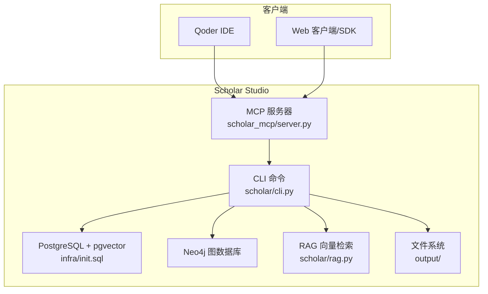
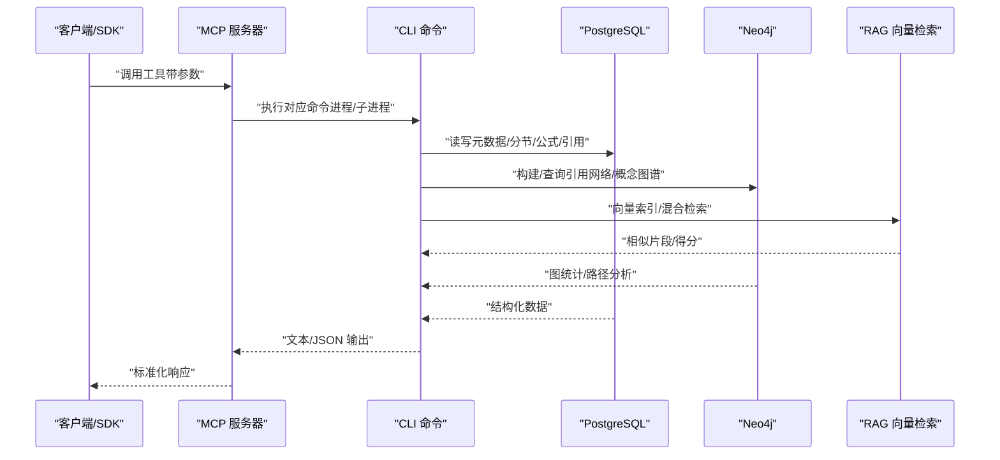
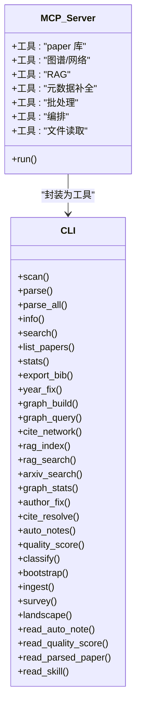
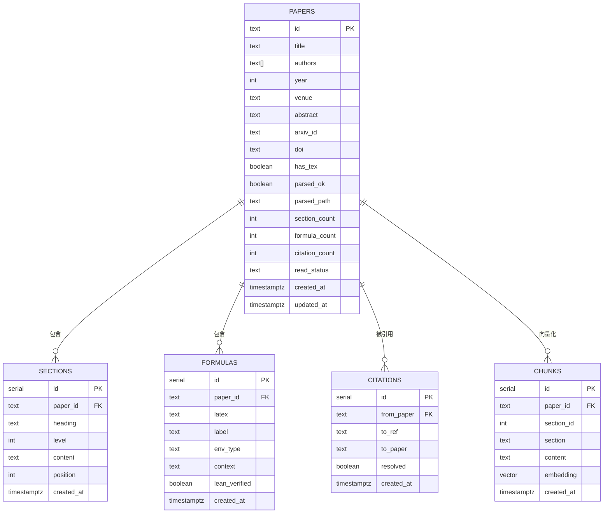
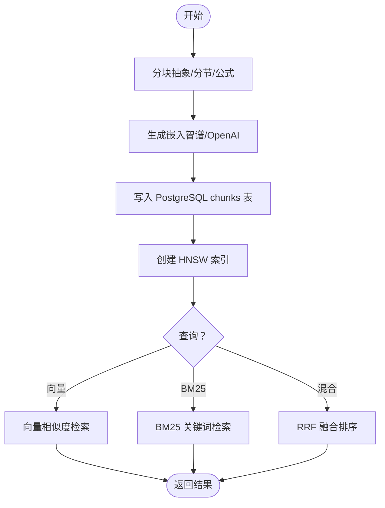
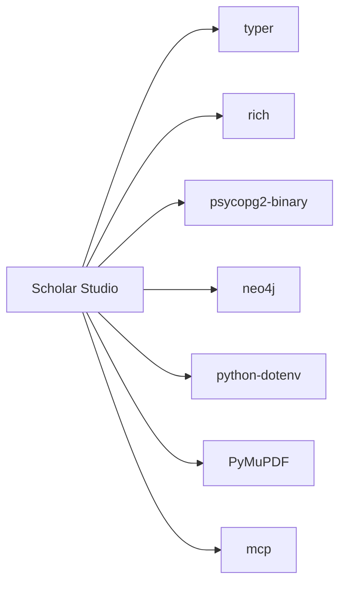
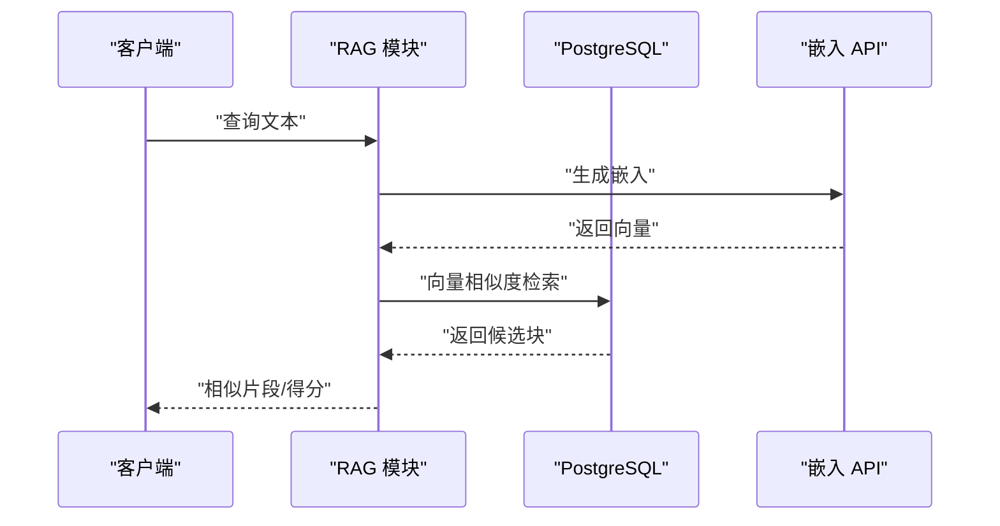

# HTTP REST API

<cite>
**本文档引用的文件**
- [README.md](file://README.md)
- [requirements.txt](file://requirements.txt)
- [scholar/__main__.py](file://scholar/__main__.py)
- [scholar/cli.py](file://scholar/cli.py)
- [scholar/config.py](file://scholar/config.py)
- [scholar/db.py](file://scholar/db.py)
- [scholar_mcp/server.py](file://scholar_mcp/server.py)
- [infra/init.sql](file://infra/init.sql)
- [scholar/rag.py](file://scholar/rag.py)
- [scholar/classify.py](file://scholar/classify.py)
</cite>

## 目录
1. [简介](#简介)
2. [项目结构](#项目结构)
3. [核心组件](#核心组件)
4. [架构总览](#架构总览)
5. [详细组件分析](#详细组件分析)
6. [依赖分析](#依赖分析)
7. [性能考虑](#性能考虑)
8. [故障排查指南](#故障排查指南)
9. [结论](#结论)
10. [附录](#附录)

## 简介
本项目为 Scholar Studio 的学术研究工具集，提供 CLI 与 MCP 服务，覆盖论文解析、知识库构建、Neo4j 引用图谱、RAG 向量检索、Lean4 形式化验证等能力。当前仓库未包含传统“HTTP REST API”端点；对外交互主要通过以下两种方式：
- MCP（Model Context Protocol）服务：面向 Qoder IDE 的原生工具桥接，暴露 29 个工具函数，支持远程调用与参数传递。
- CLI 命令行：通过命令行执行论文解析、搜索、图谱构建、RAG 索引、批量处理等任务。

因此，本“HTTP REST API 文档”将围绕 MCP 工具的调用约定进行说明，并补充数据库访问、RAG 检索与分类等能力的接口化思路与最佳实践，帮助读者理解如何在现有架构基础上扩展 HTTP 接口。

## 项目结构
- scholar：Python CLI 工具集与核心业务模块（数据库、RAG、分类、TeX 解析等）
- scholar_mcp：MCP 服务器，将 CLI 封装为 MCP 工具
- infra：Docker 编排与数据库初始化脚本
- LEAN：Lean4 形式化验证库
- data/papers：论文源文件（TeX/PDF）
- output：解析产物、笔记、草稿、BibTeX 等

图表来源
- [scholar_mcp/server.py:1-387](file://scholar_mcp/server.py#L1-L387)
- [scholar/cli.py:1-800](file://scholar/cli.py#L1-L800)
- [infra/init.sql:1-131](file://infra/init.sql#L1-L131)

章节来源
- [README.md:300-326](file://README.md#L300-L326)
- [requirements.txt:1-9](file://requirements.txt#L1-L9)

## 核心组件
- MCP 服务器：将 CLI 命令封装为 MCP 工具，支持远程调用与参数传递，返回文本或 JSON 字符串。
- CLI 命令集：涵盖论文扫描、解析、搜索、图谱构建、RAG 索引、批量处理、质量评分、分类等。
- 数据库层：PostgreSQL + pgvector，提供论文元数据、分节、公式、引用、向量块等表结构。
- RAG 模块：分块、嵌入、向量存储、HNSW 索引、向量/关键词混合检索。
- Neo4j：引用网络与概念图谱，支持全局统计与单篇分析。
- 配置系统：环境变量加载、目录结构、数据库与嵌入 API 配置。

章节来源
- [scholar_mcp/server.py:1-387](file://scholar_mcp/server.py#L1-L387)
- [scholar/cli.py:1-800](file://scholar/cli.py#L1-L800)
- [scholar/db.py:1-270](file://scholar/db.py#L1-L270)
- [scholar/rag.py:1-582](file://scholar/rag.py#L1-L582)
- [scholar/classify.py:1-328](file://scholar/classify.py#L1-L328)
- [scholar/config.py:1-62](file://scholar/config.py#L1-L62)

## 架构总览
下图展示了 MCP 作为桥接层，将外部客户端与 CLI 命令连接，并与数据库、Neo4j、RAG 系统协同工作：

图表来源
- [scholar_mcp/server.py:23-36](file://scholar_mcp/server.py#L23-L36)
- [scholar/cli.py:1-800](file://scholar/cli.py#L1-L800)
- [scholar/db.py:79-235](file://scholar/db.py#L79-L235)
- [scholar/rag.py:252-421](file://scholar/rag.py#L252-L421)

## 详细组件分析

### MCP 工具与调用约定
- 工具数量：29 个，覆盖论文库、图谱、RAG、元数据补全、批处理、编排等。
- 参数类型：字符串、整数、布尔值、可选参数。
- 返回值：文本表格或 JSON 字符串，部分工具返回文件内容（如解析 JSON、质量评分 JSON、笔记）。
- 超时控制：多数工具设置超时（秒），避免长时间阻塞。
- 错误处理：子进程返回非零码时附加错误信息到输出。

图表来源
- [scholar_mcp/server.py:41-387](file://scholar_mcp/server.py#L41-L387)
- [scholar/cli.py:45-800](file://scholar/cli.py#L45-L800)

章节来源
- [scholar_mcp/server.py:1-387](file://scholar_mcp/server.py#L1-L387)

### 数据库层（PostgreSQL + pgvector）
- 表结构：papers、sections、formulas、citations、concepts、paper_concepts、chunks、innovations、replacements。
- 查询能力：按年份/状态筛选、全文搜索（标题/摘要/分节）、统计聚合。
- 写入能力：UPSERT 论文、替换分节/公式/引用、同步到结构化存储。

图表来源
- [infra/init.sql:9-131](file://infra/init.sql#L9-L131)
- [scholar/db.py:79-235](file://scholar/db.py#L79-L235)

章节来源
- [scholar/db.py:1-270](file://scholar/db.py#L1-L270)
- [infra/init.sql:1-131](file://infra/init.sql#L1-L131)

### RAG 检索与索引
- 分块策略：抽象、分节段落、公式上下文三类块。
- 嵌入生成：支持智谱、OpenAI，可降级为空。
- 向量存储：PostgreSQL + pgvector，HNSW 索引加速近似最近邻搜索。
- 检索方式：向量相似度、BM25 关键词匹配、RRF 融合排序。
- 批量索引：分批获取嵌入并入库，支持进度条与断点续传。

图表来源
- [scholar/rag.py:25-94](file://scholar/rag.py#L25-L94)
- [scholar/rag.py:100-176](file://scholar/rag.py#L100-L176)
- [scholar/rag.py:182-238](file://scholar/rag.py#L182-L238)
- [scholar/rag.py:252-421](file://scholar/rag.py#L252-L421)
- [scholar/rag.py:471-582](file://scholar/rag.py#L471-L582)

章节来源
- [scholar/rag.py:1-582](file://scholar/rag.py#L1-L582)

### 论文分类与标签体系
- 多层级标签：领域（Domain）、子方向（Sub-direction）、方法（Method）。
- 规则引擎：关键词匹配、会议归属提示、前若干分节摘要增强。
- 批处理：对全部/单篇论文写入 tags 字段，支持统计聚合。

章节来源
- [scholar/classify.py:1-328](file://scholar/classify.py#L1-L328)

## 依赖分析
- Python 依赖：typer、rich、psycopg2-binary、neo4j、python-dotenv、PyMuPDF、mcp。
- 数据库依赖：PostgreSQL + pgvector 扩展。
- 外部服务：Neo4j、智谱/第三方嵌入 API（可选）。

图表来源
- [requirements.txt:1-9](file://requirements.txt#L1-L9)

章节来源
- [requirements.txt:1-9](file://requirements.txt#L1-L9)

## 性能考虑
- RAG 索引
  - 分块大小与窗口滑动影响检索精度与召回；建议根据论文长度动态调整。
  - HNSW 索引参数（M、ef_construction）影响索引质量与查询速度，需结合数据规模调优。
  - 批量嵌入优先使用支持批量的提供商（如智谱），减少往返开销。
- 检索融合
  - 向量与 BM25 的 k_vector/k_bm25 控制候选规模，RRF 的 k 常数平衡相关性与多样性。
- 数据库
  - chunks 表建立 HNSW 索引；必要时增加并行查询与连接池。
  - citiations 表的 from_paper/to_paper 建有索引，避免大规模关联查询。
- I/O
  - 批处理时使用进度条与断点续传，避免重复计算。

[本节为通用指导，不直接分析具体文件]

## 故障排查指南
- Docker 容器启动失败
  - 检查端口占用（5433/7474/7687），必要时修改 docker-compose.yml。
- PostgreSQL 连接超时
  - 确认端口为 5433（避免与本地常规 5432 冲突）。
- RAG 搜索无结果
  - 确认嵌入 API Key 设置；无 Key 时 rag-search 会回退至关键词搜索。
- MCP 工具超时
  - 部分工具（如 rag-index/graph-build）设置较长超时，若仍失败请检查资源与网络。
- Neo4j 不可用
  - 确认容器运行与凭据正确，或安装本地驱动。

章节来源
- [README.md:429-479](file://README.md#L429-L479)

## 结论
本项目当前未提供传统 HTTP REST API，而是通过 MCP 服务与 CLI 命令实现学术研究工具链的自动化与可组合性。若需引入 HTTP 接口，可在现有 MCP 与 CLI 基础上进行轻量封装：将工具参数映射为 HTTP 请求体，将 CLI 输出转换为 JSON 响应，并统一错误码与鉴权策略。数据库与 RAG 能力可直接复用，Neo4j 与 Lean4 层可通过服务化或 SDK 方式对外暴露。

[本节为总结性内容，不直接分析具体文件]

## 附录

### MCP 工具清单与调用要点
- 论文库：scan、parse、parse-all、info、search、list-papers、stats、export-bib、year-fix
- 图谱/网络：graph-build、graph-query、cite-network、graph-stats
- RAG：rag-index、rag-search（支持 --hybrid）
- 外部：arxiv-search
- 元数据补全：author-fix、cite-resolve
- 批处理：auto-notes、quality-score、classify
- 编排：bootstrap、ingest、survey、landscape
- 文件读取：read-auto-note、read-quality-score、read-parsed-paper、read-skill

章节来源
- [scholar_mcp/server.py:41-387](file://scholar_mcp/server.py#L41-L387)

### 数据库表字段与索引
- papers：主键 id，多字段索引（year、read_status）
- sections/formulas：paper_id 外键与索引
- citations：from_paper/to_paper 唯一约束与索引
- chunks：embedding HNSW 索引（cosine 距离）

章节来源
- [infra/init.sql:9-131](file://infra/init.sql#L9-L131)
- [scholar/db.py:184-235](file://scholar/db.py#L184-L235)

### RAG 检索流程（序列图）

图表来源
- [scholar/rag.py:252-289](file://scholar/rag.py#L252-L289)