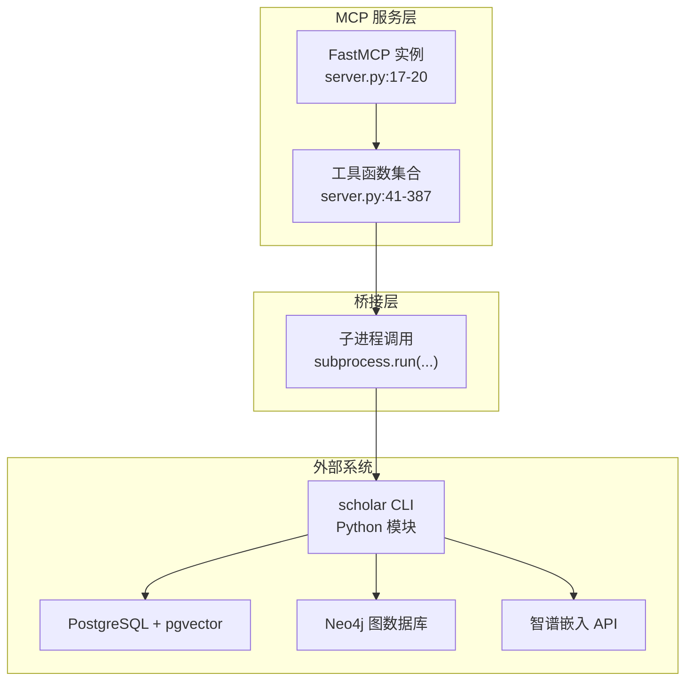
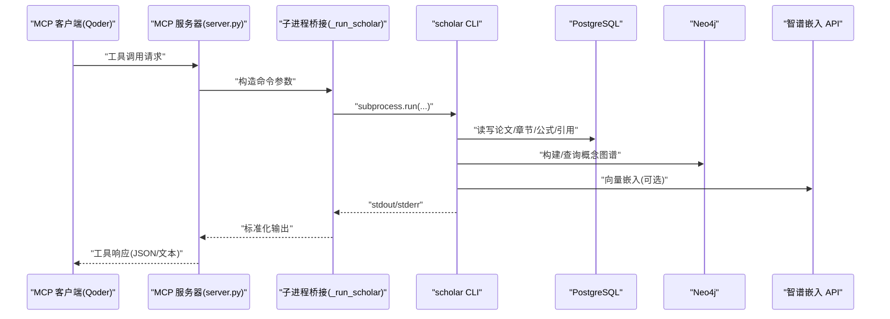
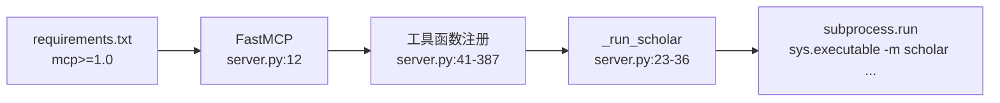

# MCP协议接口

<cite>
**本文档引用的文件**
- [scholar_mcp/server.py](file://scholar_mcp/server.py)
- [scholar_mcp/__main__.py](file://scholar_mcp/__main__.py)
- [requirements.txt](file://requirements.txt)
- [README.md](file://README.md)
</cite>

## 目录
1. [简介](#简介)
2. [项目结构](#项目结构)
3. [核心组件](#核心组件)
4. [架构总览](#架构总览)
5. [详细组件分析](#详细组件分析)
6. [依赖关系分析](#依赖关系分析)
7. [性能考量](#性能考量)
8. [故障排查指南](#故障排查指南)
9. [结论](#结论)
10. [附录](#附录)

## 简介
本文件为 Scholar Studio MCP（Model Context Protocol）服务器的完整协议文档，面向希望在 Qoder IDE 或其他 MCP 客户端中集成 Scholar Studio 的开发者与研究者。文档覆盖 MCP 协议的消息格式、事件类型与通信规范，包括连接处理、消息传递与状态管理；为每个 MCP 工具端点提供参数定义、消息格式与响应示例；并给出协议特定的错误处理、安全考虑与性能优化建议，以及客户端实现指南、集成示例与调试工具。

## 项目结构
Scholar Studio MCP 服务位于 scholar_mcp 目录，采用“MCP 服务桥接层”模式：MCP 服务器将 Qoder 的工具调用转发到 scholar CLI，后者负责实际的数据处理与外部系统交互（如 PostgreSQL、Neo4j、RAG 向量索引等）。核心文件如下：
- scholar_mcp/server.py：MCP 服务器实现，注册 29 个工具函数，封装 scholar CLI 命令
- scholar_mcp/__main__.py：入口模块，启动 MCP 服务器
- requirements.txt：Python 依赖，包含 mcp>=1.0
- README.md：项目总体说明、CLI 命令参考与部署流程

图表来源
- [scholar_mcp/server.py:17-20](file://scholar_mcp/server.py#L17-L20)
- [scholar_mcp/server.py:23-36](file://scholar_mcp/server.py#L23-L36)
- [requirements.txt:8](file://requirements.txt#L8)

章节来源
- [scholar_mcp/server.py:1-387](file://scholar_mcp/server.py#L1-L387)
- [scholar_mcp/__main__.py:1-5](file://scholar_mcp/__main__.py#L1-L5)
- [requirements.txt:1-9](file://requirements.txt#L1-L9)
- [README.md:300-325](file://README.md#L300-L325)

## 核心组件
- FastMCP 实例：在 server.py 中创建 MCP 服务器实例，设置服务器名称与说明，作为所有工具的宿主。
- 工具注册：通过装饰器将 Python 函数注册为 MCP 工具，函数签名即工具的参数定义。
- 子进程桥接：_run_scholar 封装 subprocess.run，统一执行 scholar CLI 命令，并处理返回值与错误信息。
- 文件读取工具：直接读取本地输出文件（如自动生成的阅读笔记、质量评分 JSON），无需外部系统参与。

章节来源
- [scholar_mcp/server.py:17-20](file://scholar_mcp/server.py#L17-L20)
- [scholar_mcp/server.py:23-36](file://scholar_mcp/server.py#L23-L36)
- [scholar_mcp/server.py:327-351](file://scholar_mcp/server.py#L327-L351)

## 架构总览
下图展示了 MCP 客户端、MCP 服务器与底层 CLI/数据库系统的交互关系：

图表来源
- [scholar_mcp/server.py:23-36](file://scholar_mcp/server.py#L23-L36)
- [scholar_mcp/server.py:41-387](file://scholar_mcp/server.py#L41-L387)
- [requirements.txt:8](file://requirements.txt#L8)

## 详细组件分析

### 连接与生命周期
- 启动入口：通过 python -m scholar_mcp 启动，入口模块调用 server.main()，最终执行 mcp.run()。
- 服务器元信息：FastMCP 实例提供服务器名称与说明，供客户端识别与展示。
- 生命周期：MCP 服务器常驻，工具按需调用；长耗时工具通过 timeout 控制与日志提示。

章节来源
- [scholar_mcp/__main__.py:1-5](file://scholar_mcp/__main__.py#L1-L5)
- [scholar_mcp/server.py:17-20](file://scholar_mcp/server.py#L17-L20)
- [scholar_mcp/server.py:381-387](file://scholar_mcp/server.py#L381-L387)

### 工具注册与消息格式
- 工具注册：每个工具函数通过装饰器注册为 MCP 工具，函数参数即工具的 JSON Schema 参数定义。
- 请求格式：客户端发送工具调用请求，包含工具名与参数对象；MCP 服务器根据函数签名进行参数解析与校验。
- 响应格式：工具函数返回字符串（通常是 JSON 文本或结构化文本），MCP 服务器将其作为工具响应返回给客户端。

章节来源
- [scholar_mcp/server.py:41-387](file://scholar_mcp/server.py#L41-L387)

### 论文库工具族
- 工具：scholar_scan、scholar_parse、scholar_parse_all、scholar_info、scholar_search、scholar_list_papers、scholar_stats、scholar_export_bib、scholar_year_fix
- 参数与行为要点：
  - scholar_parse/ scholar_info/ scholar_list_papers/ scholar_export_bib/ scholar_year_fix：均通过 _run_scholar 执行对应 scholar 子命令，支持超时控制与错误合并输出。
  - scholar_list_papers 支持按年过滤；scholar_export_bib 支持指定输出路径；scholar_year_fix 支持 dry-run 与应用变更。
- 响应示例：返回结构化文本或 JSON 字符串，具体取决于底层 CLI 输出。

章节来源
- [scholar_mcp/server.py:41-123](file://scholar_mcp/server.py#L41-L123)

### 图谱与网络工具族
- 工具：scholar_graph_build、scholar_graph_query、scholar_cite_network
- 参数与行为要点：
  - scholar_graph_build：需要 Neo4j 运行；支持较长超时。
  - scholar_graph_query：按概念标识符查询相关论文与概念。
  - scholar_cite_network：全局统计或针对单篇论文的前向/后向引用分析。
- 响应示例：返回图谱查询结果或统计信息。

章节来源
- [scholar_mcp/server.py:125-156](file://scholar_mcp/server.py#L125-L156)

### RAG 工具族
- 工具：scholar_rag_index、scholar_rag_search
- 参数与行为要点：
  - scholar_rag_index：构建向量索引，依赖环境变量 API Key；支持较长超时。
  - scholar_rag_search：支持纯向量搜索与混合搜索（向量+BM25+RRF）。
- 响应示例：返回检索结果列表或空结果提示。

章节来源
- [scholar_mcp/server.py:158-180](file://scholar_mcp/server.py#L158-L180)

### 外部与元数据补全工具族
- 工具：scholar_arxiv_search、scholar_graph_stats、scholar_author_fix、scholar_cite_resolve
- 参数与行为要点：
  - scholar_arxiv_search：支持查询语法与最大结果数限制。
  - scholar_author_fix、scholar_cite_resolve：支持 dry-run 与应用变更。
- 响应示例：返回 arXiv 检索结果或补全进度。

章节来源
- [scholar_mcp/server.py:182-227](file://scholar_mcp/server.py#L182-L227)

### 批处理与编排工具族
- 工具：scholar_auto_notes、scholar_quality_score、scholar_classify、scholar_bootstrap、scholar_ingest、scholar_survey、scholar_landscape
- 参数与行为要点：
  - scholar_auto_notes：支持单篇或批量生成阅读笔记，支持强制覆盖。
  - scholar_quality_score：支持单篇或全量评分。
  - scholar_classify：支持单篇、全量或列出标签。
  - scholar_bootstrap：一次性执行多步初始化流程，最长耗时可达 20 分钟以上。
  - scholar_ingest：增量导入单篇论文。
  - scholar_survey、scholar_landscape：生成综述与领域景观报告。
- 响应示例：返回进度、统计或报告路径。

章节来源
- [scholar_mcp/server.py:229-325](file://scholar_mcp/server.py#L229-L325)

### 文件访问工具族
- 工具：read_auto_note、read_quality_score、read_parsed_paper、read_skill
- 参数与行为要点：
  - 直接读取本地文件，若文件不存在则返回提示信息。
  - read_skill 返回技能工作流说明文档。
- 响应示例：返回 Markdown 文本或 JSON 字符串。

章节来源
- [scholar_mcp/server.py:327-379](file://scholar_mcp/server.py#L327-L379)

### 错误处理与状态管理
- 子进程错误：当子进程返回非零退出码且存在 stderr 时，_run_scholar 会将错误信息拼接到标准输出中返回。
- 文件不存在：文件读取工具在目标文件不存在时返回明确提示，指导用户先执行相应 CLI 命令生成文件。
- 超时控制：不同工具设置不同超时阈值，长耗时工具（如 rag-index、bootstrap）显式提高超时上限。
- 状态提示：README 中提供了知识库统计与健康检查的输出示例，便于客户端判断系统状态。

章节来源
- [scholar_mcp/server.py:23-36](file://scholar_mcp/server.py#L23-L36)
- [scholar_mcp/server.py:327-351](file://scholar_mcp/server.py#L327-L351)
- [README.md:129-141](file://README.md#L129-L141)

### 安全考虑
- 本地文件读取：仅读取项目根目录下的受控输出路径，避免越权访问。
- 环境变量：RAG 功能依赖 API Key，应在安全环境中配置；未配置时功能降级而非报错。
- 子进程隔离：通过固定工作目录与参数拼接，降低注入风险。

章节来源
- [scholar_mcp/server.py:14-15](file://scholar_mcp/server.py#L14-L15)
- [README.md:53-66](file://README.md#L53-L66)

### 性能优化
- 超时策略：为长耗时工具设置合理超时，避免阻塞 MCP 服务器。
- 批处理：优先使用批量工具（如 parse-all、auto-notes --all、quality-score --all、classify --all）减少调用次数。
- 缓存与索引：RAG 索引与 Neo4j 图谱构建完成后，后续查询性能显著提升。
- 资源隔离：数据库与图数据库独立部署，避免单点瓶颈。

章节来源
- [scholar_mcp/server.py:58-60](file://scholar_mcp/server.py#L58-L60)
- [scholar_mcp/server.py:164-165](file://scholar_mcp/server.py#L164-L165)
- [scholar_mcp/server.py:288-289](file://scholar_mcp/server.py#L288-L289)

## 依赖关系分析

图表来源
- [requirements.txt:8](file://requirements.txt#L8)
- [scholar_mcp/server.py:12](file://scholar_mcp/server.py#L12)
- [scholar_mcp/server.py:23-36](file://scholar_mcp/server.py#L23-L36)

章节来源
- [requirements.txt:1-9](file://requirements.txt#L1-L9)
- [scholar_mcp/server.py:12](file://scholar_mcp/server.py#L12)

## 性能考量
- 工具调用频率：批量工具优于多次单次调用；优先使用 --all 参数。
- 资源占用：RAG 索引与图谱构建为 CPU/内存密集型，建议在空闲时段执行。
- 超时与重试：客户端应为长耗时工具设置合理的超时与重试策略。
- 日志与可观测性：结合 MCP 服务器日志与 CLI 输出定位性能瓶颈。

## 故障排查指南
- 客户端无法连接 MCP 服务器
  - 确认已通过 python -m scholar_mcp 启动，且未出现异常退出。
  - 检查端口与防火墙设置（由 MCP 服务器自行选择与绑定）。
- 工具调用返回错误
  - 查看 _run_scholar 的错误合并输出，确认 CLI 子进程返回码与 stderr。
  - 检查所需外部系统（PostgreSQL、Neo4j、嵌入 API）是否正常运行。
- 文件读取工具返回“未找到”
  - 先执行相应的 CLI 命令生成目标文件，再通过 read_* 工具读取。
- RAG 搜索无结果
  - 确认环境变量 API Key 已正确配置；
  - 确认 rag-index 已成功执行；
  - 若无 API Key，功能将回退至全文搜索。

章节来源
- [scholar_mcp/server.py:23-36](file://scholar_mcp/server.py#L23-L36)
- [scholar_mcp/server.py:327-351](file://scholar_mcp/server.py#L327-L351)
- [README.md:452-457](file://README.md#L452-L457)

## 结论
Scholar Studio MCP 服务器通过 FastMCP 将丰富的学术研究能力暴露为标准化工具集，覆盖论文解析、图谱查询、RAG 检索、批处理与编排等多个方面。其设计遵循“MCP 服务桥接层”的最佳实践：MCP 层保持轻量与稳定，业务逻辑下沉到 scholar CLI，并与数据库、图数据库与外部 API 协同工作。客户端应充分利用批量工具、合理设置超时与重试，并关注外部系统健康状态，以获得最佳体验。

## 附录

### MCP 工具清单与参数参考
- 论文库
  - scholar_scan：扫描并显示解析状态
  - scholar_parse(ulid)：解析单篇论文
  - scholar_parse_all：批量解析未解析论文
  - scholar_info(ulid)：显示论文详情
  - scholar_search(query)：全文搜索
  - scholar_list_papers(year?)：列出论文（可选年份过滤）
  - scholar_stats：知识库统计
  - scholar_export_bib(output?)：导出 BibTeX
  - scholar_year_fix(apply?)：补全年份（dry-run 或应用）
- 图谱与网络
  - scholar_graph_build：构建图谱
  - scholar_graph_query(concept)：概念查询
  - scholar_cite_network(ulid?)：引用网络分析
- RAG
  - scholar_rag_index：构建向量索引
  - scholar_rag_search(query, hybrid?)：语义检索
- 外部与元数据补全
  - scholar_arxiv_search(query, max_results?)：arXiv 搜索
  - scholar_graph_stats：图谱统计
  - scholar_author_fix(apply?)：补全作者
  - scholar_cite_resolve(apply?)：解析引用
- 批处理与编排
  - scholar_auto_notes(ulid?, force?)：生成阅读笔记
  - scholar_quality_score(ulid?, all_papers?)：质量评分
  - scholar_classify(ulid?, all_papers?, list_tags?)：领域分类
  - scholar_bootstrap：全量初始化
  - scholar_ingest(ulid)：增量导入
  - scholar_survey(topic, depth?, limit?)：研究综述
  - scholar_landscape(topic)：领域景观
- 文件访问
  - read_auto_note(ulid)：读取阅读笔记
  - read_quality_score(ulid)：读取质量评分 JSON
  - read_parsed_paper(ulid)：读取解析后的 JSON
  - read_skill(skill_name)：读取技能说明

章节来源
- [scholar_mcp/server.py:41-387](file://scholar_mcp/server.py#L41-L387)

### 客户端实现指南
- 启动 MCP 服务器：使用 python -m scholar_mcp 启动服务。
- 发送工具调用：按照 MCP 协议格式发送工具请求，包含工具名与参数对象。
- 处理响应：接收字符串形式的响应，必要时解析为 JSON。
- 错误处理：捕获并处理子进程错误与文件不存在场景。

章节来源
- [scholar_mcp/__main__.py:1-5](file://scholar_mcp/__main__.py#L1-L5)
- [scholar_mcp/server.py:23-36](file://scholar_mcp/server.py#L23-L36)

### 集成示例与调试工具
- 集成示例：在 Qoder 中打开项目后，MCP 服务器自动启动，工具可在对话中直接使用。
- 调试工具：结合 README 中的知识库统计输出与健康检查命令，快速定位问题。

章节来源
- [README.md:109-128](file://README.md#L109-L128)
- [README.md:416-426](file://README.md#L416-L426)