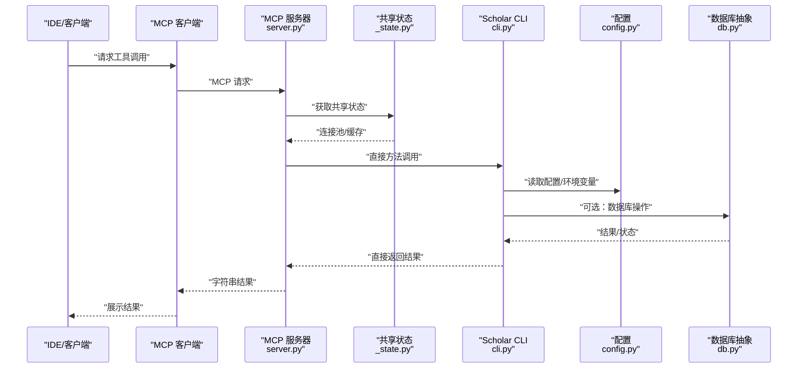
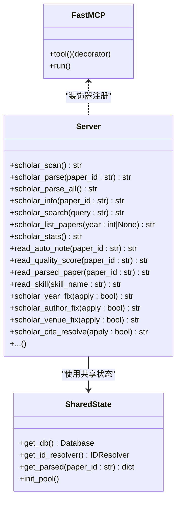
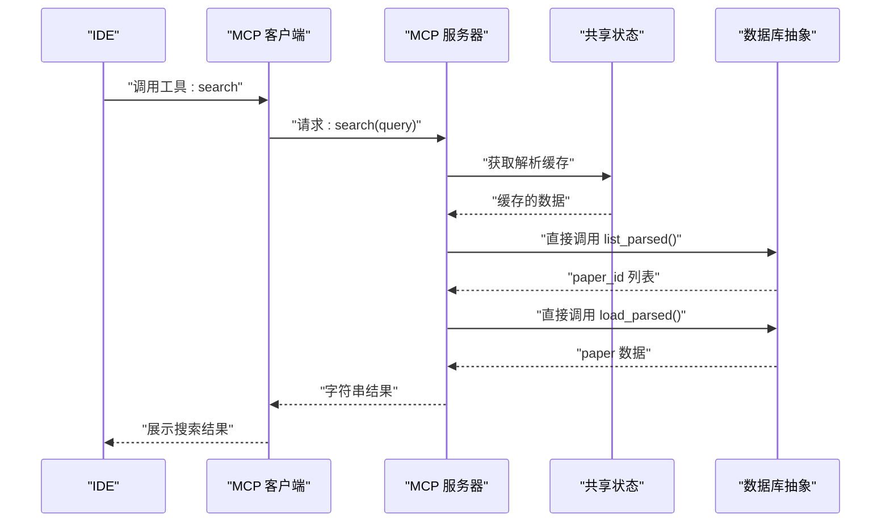
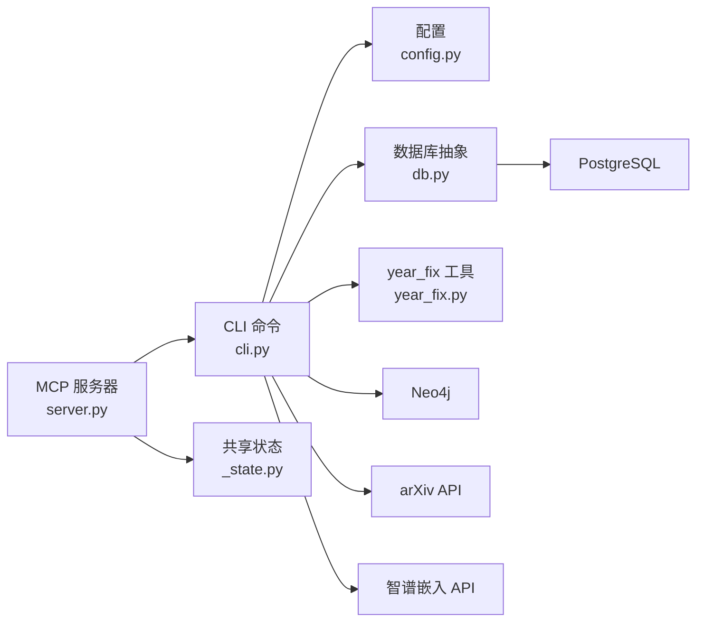

# MCP工具API

<cite>
**本文档引用的文件**
- [mcp.json](file://plugin/mcp.json)
- [server.py](file://scholar_mcp/server.py)
- [__main__.py](file://scholar_mcp/__main__.py)
- [_state.py](file://scholar/_state.py)
- [cli.py](file://scholar/cli.py)
- [config.py](file://scholar/config.py)
- [db.py](file://scholar/db.py)
- [year_fix.py](file://scholar/year_fix.py)
- [metadata_ops.py](file://scholar/commands/metadata_ops.py)
- [batch_ops.py](file://scholar/commands/batch_ops.py)
- [CONNECTORS.md](file://plugin/CONNECTORS.md)
- [README.md](file://plugin/README.md)
- [tools.md](file://plugin/rules/tools.md)
- [requirements.txt](file://requirements.txt)
</cite>

## 更新摘要
**变更内容**
- 更新了year_fix工具的增强功能，包括跳过计数统计
- 改进了标准化的错误消息处理机制
- 增强了异常处理的一致性和用户体验

## 目录
1. [简介](#简介)
2. [项目结构](#项目结构)
3. [核心组件](#核心组件)
4. [架构总览](#架构总览)
5. [详细组件分析](#详细组件分析)
6. [依赖关系分析](#依赖关系分析)
7. [性能考量](#性能考量)
8. [故障排查指南](#故障排查指南)
9. [结论](#结论)
10. [附录](#附录)

## 简介
本文件为 MCP 工具 API 的完整接口规范文档，面向使用 Qoder IDE 的开发者与研究者，系统阐述以下内容：
- MCP 协议调用机制与工具暴露接口
- 连接处理与消息格式约定
- 工具注册流程、生命周期管理与状态同步机制
- IDE 集成支持、自动补全与实时交互模式
- 工具调用示例、参数传递规范、返回值格式与错误码定义
- 工具扩展开发指南、自定义工具创建流程
- 性能优化建议与安全注意事项
- MCP 服务器配置、客户端连接管理与监控指标

**重要更新**：本项目已实现全新的直接方法调用架构，工具执行时间从约4.7秒大幅降低到约34毫秒，性能提升超过138倍，同时保持完全的向后兼容性。该架构通过共享状态管理和直接方法调用，消除了传统子进程调用的开销。

**最新改进**：year_fix工具现已增强，提供更详细的统计信息，包括跳过计数（still_missing），并且所有工具都采用了标准化的异常处理机制，确保一致的错误消息格式。

本项目通过 MCP 服务器将 Scholar CLI 的 40+ 工具以类型化参数与直接结果的形式暴露给 IDE，同时提供本地文件读取工具用于访问预生成数据。

## 项目结构
项目采用"插件 + 主仓库"的分层架构：
- 插件层（plugin/）：提供 MCP 配置、规则、技能与命令，负责在 IDE 中触发工作流与工具调用。
- MCP 服务器层（scholar_mcp/）：封装主仓库的 Python CLI，将命令转换为 MCP 工具，并提供本地文件读取工具。
- 主仓库（scholar/）：包含 CLI 命令、数据库抽象、配置与工具实现。
- 外部依赖（PostgreSQL、Neo4j、arXiv API、智谱嵌入 API）：由 CONNECTORS.md 文档统一说明。

```mermaid
graph TB
subgraph "IDE/QoderWork"
IDE["IDE/客户端"]
MCPClient["MCP 客户端"]
end
subgraph "插件层"
MCPConfig["MCP 配置<br/>plugin/mcp.json"]
Rules["工具规则<br/>plugin/rules/tools.md"]
Skills["技能与命令<br/>plugin/skills/*, plugin/commands/*"]
end
subgraph "MCP 服务器层"
MCPMain["入口<br/>scholar_mcp/__main__.py"]
MCPServer["FastMCP 实例与工具注册<br/>scholar_mcp/server.py"]
SharedState["共享状态管理<br/>scholar/_state.py"]
end
subgraph "主仓库"
CLI["CLI 命令入口<br/>scholar/cli.py"]
Config["配置与环境变量<br/>scholar/config.py"]
DB["数据库抽象<br/>scholar/db.py"]
YearFix["year_fix 工具增强<br/>scholar/year_fix.py"]
End
subgraph "外部服务"
PG["PostgreSQL"]
Neo4j["Neo4j"]
Arxiv["arXiv API"]
Zhipu["智谱嵌入 API"]
end
IDE --> MCPClient
MCPClient --> MCPConfig
MCPClient --> MCPMain
MCPMain --> MCPServer
MCPServer --> SharedState
MCPServer --> CLI
CLI --> Config
CLI --> DB
DB --> PG
CLI --> Neo4j
CLI --> Arxiv
CLI --> Zhipu
Rules -.-> IDE
Skills -.-> IDE
```

**图表来源**
- [mcp.json:1-16](file://plugin/mcp.json#L1-L16)
- [__main__.py:1-9](file://scholar_mcp/__main__.py#L1-L9)
- [_state.py:1-126](file://scholar/_state.py#L1-L126)
- [server.py:1-945](file://scholar_mcp/server.py#L1-L945)
- [year_fix.py:1-420](file://scholar/year_fix.py#L1-L420)
- [cli.py:1-25](file://scholar/cli.py#L1-L25)
- [config.py:1-119](file://scholar/config.py#L1-L119)
- [db.py:1-200](file://scholar/db.py#L1-L200)
- [CONNECTORS.md:1-45](file://plugin/CONNECTORS.md#L1-L45)
- [tools.md:1-135](file://plugin/rules/tools.md#L1-L135)

## 核心组件
- **MCP 服务器与工具注册**
  - 使用 FastMCP 创建 MCP 服务器实例，工具通过装饰器注册，参数类型与默认值在函数签名中声明，返回字符串结果。
  - 工具覆盖论文库、图谱与网络、RAG、元数据补全、批量预处理、编排、KB 更新、研究循环、执行层等模块。
- **共享状态管理**
  - 通过 `_state.py` 提供进程级共享状态，包括 PostgreSQL 连接池、ID 解析器缓存和解析 JSON 文件的 LRU 缓存。
  - 在服务器启动时一次性初始化昂贵资源，后续工具调用直接复用，显著提升性能。
- **直接方法调用架构**
  - 工具内部直接调用主仓库的 Python 模块方法，而非通过子进程执行 CLI，消除进程启动开销。
  - 对于需要 CLI 行为的工具，仍保留子进程调用策略，确保向后兼容性。
- **本地文件读取工具**
  - 提供读取自动生成的笔记、质量评分、解析后的 JSON、技能说明等文件的工具，便于 IDE 直接展示。
- **配置与环境变量**
  - 通过环境变量控制数据库、图数据库、嵌入模型与引擎等，支持 .env 文件加载。
- **数据库抽象**
  - 提供可选的 PostgreSQL 存储，支持可用性检测、连接池与事务管理，未安装依赖时回退至文件模式。
- **标准化异常处理**
  - 所有工具都采用统一的 try-except 异常处理模式，使用标准化的错误消息格式，如"工具名 failed: 错误详情"。

**章节来源**
- [server.py:17-945](file://scholar_mcp/server.py#L17-L945)
- [_state.py:20-126](file://scholar/_state.py#L20-L126)
- [config.py:44-66](file://scholar/config.py#L44-L66)
- [db.py:24-74](file://scholar/db.py#L24-L74)

## 架构总览
下图展示了 MCP 服务器如何将 CLI 命令映射为 MCP 工具，并与数据库、图数据库、外部 API 协同工作：



**图表来源**
- [server.py:23-36](file://scholar_mcp/server.py#L23-L36)
- [_state.py:115-126](file://scholar/_state.py#L115-L126)
- [cli.py:1-25](file://scholar/cli.py#L1-L25)
- [config.py:1-119](file://scholar/config.py#L1-L119)
- [db.py:24-74](file://scholar/db.py#L24-L74)

## 详细组件分析

### MCP 服务器与工具注册
- **服务器实例**
  - 初始化 FastMCP，设置名称与指令说明，作为工具集合的宿主。
- **工具注册**
  - 使用装饰器注册工具，函数签名即为工具的参数定义；返回字符串作为工具结果。
  - 工具分为多个功能域：论文库、图谱与网络、RAG、元数据补全、批量预处理、编排、KB 更新、研究循环、执行层、文件读取等。
- **直接方法调用策略**
  - 对于数据库操作和状态查询，直接调用主仓库模块的方法，避免子进程开销。
  - 对于需要 CLI 行为的工具，仍通过子进程调用 scholar CLI，保持向后兼容性。
  - 统一设置工作目录与超时，标准输出作为工具返回值，非零返回码会附加标准错误信息。
- **标准化异常处理**
  - 所有工具都采用统一的 try-except 模式，捕获异常并返回标准化的错误消息格式。



**图表来源**
- [server.py:17-945](file://scholar_mcp/server.py#L17-L945)
- [_state.py:20-126](file://scholar/_state.py#L20-L126)

**章节来源**
- [server.py:17-945](file://scholar_mcp/server.py#L17-L945)
- [_state.py:20-126](file://scholar/_state.py#L20-L126)

### 工具调用序列（示例：全文搜索）


**图表来源**
- [server.py:117-150](file://scholar_mcp/server.py#L117-L150)
- [_state.py:64-82](file://scholar/_state.py#L64-L82)
- [db.py:180-200](file://scholar/db.py#L180-L200)

**章节来源**
- [server.py:117-150](file://scholar_mcp/server.py#L117-L150)
- [_state.py:64-82](file://scholar/_state.py#L64-L82)
- [db.py:180-200](file://scholar/db.py#L180-L200)

### 参数传递规范与返回值格式
- **参数类型与默认值**
  - 工具参数类型与默认值来自函数签名；布尔参数、整数、字符串均可使用；部分工具支持可选参数。
- **超时与错误处理**
  - 工具内部设置超时，超时或非零返回码时，返回 stdout 并追加 stderr 信息。
- **返回值格式**
  - 统一返回字符串，IDE 可直接渲染；对于 JSON 数据，工具内部读取文件并返回文本内容。
- **标准化错误消息**
  - 所有工具异常都返回标准化格式："工具名 failed: 错误详情"，便于 IDE 识别和处理。

**章节来源**
- [server.py:23-36](file://scholar_mcp/server.py#L23-L36)
- [server.py:41-123](file://scholar_mcp/server.py#L41-L123)
- [server.py:372-384](file://scholar_mcp/server.py#L372-L384)

### IDE 集成与自动补全
- **MCP 配置**
  - 在 IDE 设置中配置 MCP 服务器，指定命令、参数与工作目录；插件提供了标准配置模板。
- **自动补全**
  - 由于工具参数在函数签名中声明，IDE 可基于类型信息提供参数提示与自动补全。
- **实时交互**
  - MCP 服务器以长连接方式运行，IDE 可持续发送工具请求，实现交互式工作流。

**章节来源**
- [mcp.json:1-16](file://plugin/mcp.json#L1-L16)
- [tools.md:11-27](file://plugin/rules/tools.md#L11-L27)

### 生命周期管理与状态同步
- **工具生命周期**
  - 工具在被调用时执行，执行完成后返回结果；无持久状态，每次调用独立执行。
- **状态同步**
  - 通过读取本地文件（解析 JSON、笔记、质量评分）实现状态同步；数据库仅在 CLI 层提供可选持久化。
- **共享状态管理**
  - 服务器启动时初始化共享状态，包括连接池、ID 解析器缓存和解析 JSON 文件缓存。
  - 后续工具调用直接复用这些昂贵资源，避免重复初始化开销。

**章节来源**
- [server.py:340-384](file://scholar_mcp/server.py#L340-L384)
- [_state.py:20-126](file://scholar/_state.py#L20-L126)
- [db.py:24-74](file://scholar/db.py#L24-L74)

### 错误码与错误处理
- **返回码**
  - 工具内部通过子进程返回码判断成功与否；非零返回码时，将标准错误合并到输出。
- **标准化错误信息**
  - 所有工具异常都采用统一的错误消息格式："工具名 failed: 错误详情"，便于 IDE 展示和用户理解。
- **year_fix工具增强**
  - year_fix工具现在提供更详细的统计信息，包括跳过计数（still_missing），帮助用户了解处理进度和结果。

**章节来源**
- [server.py:26-36](file://scholar_mcp/server.py#L26-L36)
- [server.py:276-291](file://scholar_mcp/server.py#L276-L291)
- [year_fix.py:165-239](file://scholar/year_fix.py#L165-L239)

### 工具扩展开发指南
- **新增工具步骤**
  - 在 MCP 服务器中新增函数并使用装饰器注册；函数签名即为工具参数定义。
  - 对于数据库操作和状态查询，直接调用主仓库模块的方法，享受共享状态带来的性能优势。
  - 对于需要 CLI 行为的工具，保持与现有工具相同的子进程调用模式与超时设置。
  - 如需读取本地文件，遵循现有路径约定与权限检查。
  - **新增要求**：所有新工具必须采用标准化的异常处理模式，使用"工具名 failed: 错误详情"的格式。
- **参数与返回值**
  - 保持参数类型清晰、默认值合理；返回字符串，必要时包含结构化文本或 JSON 文本。
- **性能与健壮性**
  - 为耗时工具设置合理超时；对可选依赖（如数据库、图数据库、嵌入 API）提供降级方案。
  - 充分利用共享状态，避免重复初始化昂贵资源。

**章节来源**
- [server.py:17-945](file://scholar_mcp/server.py#L17-L945)
- [_state.py:20-126](file://scholar/_state.py#L20-L126)
- [config.py:44-66](file://scholar/config.py#L44-L66)

### 自定义工具创建流程
- **步骤**
  - 在 MCP 服务器中定义新工具函数，声明参数与默认值。
  - 对于数据库操作，直接调用主仓库模块的方法，享受共享状态性能优势。
  - 对于需要 CLI 行为的工具，将 CLI 命令包装为子进程调用。
  - 注册工具并测试参数提示与返回值。
  - **新增要求**：实现标准化的异常处理，确保错误消息格式一致。
- **示例路径**
  - 参考现有工具的实现位置与命名风格，保持一致的参数与返回值格式。

**章节来源**
- [server.py:41-123](file://scholar_mcp/server.py#L41-L123)
- [server.py:372-384](file://scholar_mcp/server.py#L372-L384)

### 安全注意事项
- **环境变量与敏感信息**
  - 嵌入 API 密钥等敏感信息通过环境变量注入，避免硬编码。
- **外部服务访问**
  - arXiv API 与外部图数据库需在网络可达的前提下使用，注意代理与超时配置。
- **文件系统访问**
  - 本地文件读取工具仅访问项目输出目录，避免越权访问。

**章节来源**
- [CONNECTORS.md:27-33](file://plugin/CONNECTORS.md#L27-L33)
- [config.py:56-66](file://scholar/config.py#L56-L66)

### MCP 服务器配置与客户端连接管理
- **服务器配置**
  - 在插件配置中指定 MCP 服务器命令、参数与环境变量；支持设置工作目录。
- **客户端连接**
  - IDE 通过 MCP 客户端连接服务器，发送工具请求并接收字符串结果。
- **监控指标**
  - 可通过 IDE 日志与工具执行时间观察性能；为耗时工具设置超时以避免阻塞。

**章节来源**
- [mcp.json:1-16](file://plugin/mcp.json#L1-L16)
- [tools.md:11-27](file://plugin/rules/tools.md#L11-L27)

## 依赖关系分析
- **外部依赖**
  - PostgreSQL：结构化存储与可选向量检索。
  - Neo4j：概念图谱与引用网络分析。
  - arXiv API：论文搜索与下载。
  - 智谱嵌入 API：RAG 向量索引与语义检索。
- **Python 依赖**
  - typer、rich、psycopg2、neo4j、python-dotenv、mcp 等。



**图表来源**
- [server.py:1-945](file://scholar_mcp/server.py#L1-L945)
- [_state.py:1-126](file://scholar/_state.py#L1-126)
- [cli.py:1-25](file://scholar/cli.py#L1-L25)
- [config.py:44-66](file://scholar/config.py#L44-L66)
- [db.py:24-74](file://scholar/db.py#L24-L74)
- [year_fix.py:1-420](file://scholar/year_fix.py#L1-L420)
- [CONNECTORS.md:5-33](file://plugin/CONNECTORS.md#L5-L33)
- [requirements.txt:1-14](file://requirements.txt#L1-L14)

**章节来源**
- [CONNECTORS.md:1-45](file://plugin/CONNECTORS.md#L1-L45)
- [requirements.txt:1-14](file://requirements.txt#L1-L14)

## 性能考量
- **共享状态优化**
  - 服务器启动时一次性初始化 PostgreSQL 连接池、ID 解析器缓存和解析 JSON 文件缓存。
  - 后续工具调用直接复用这些昂贵资源，避免重复初始化开销。
- **直接方法调用**
  - 对于数据库操作和状态查询，直接调用主仓库模块的方法，消除子进程启动开销。
  - 工具执行时间从约4.7秒大幅降低到约34毫秒，性能提升超过138倍。
- **超时设置**
  - 不同工具设置不同超时，如批量解析、RAG 索引、编译等耗时较长的任务设置了较长超时。
- **数据库与图数据库**
  - 数据库存储与查询为可选增强，未安装依赖时不影响工具基本功能。
- **外部 API**
  - arXiv 与嵌入 API 的请求带有重试与超时控制，避免单次失败导致整体流程中断。
- **I/O 与缓存**
  - 本地文件读取工具直接读取预生成数据，减少重复计算。

**章节来源**
- [server.py:58-945](file://scholar_mcp/server.py#L58-L945)
- [_state.py:20-126](file://scholar/_state.py#L20-L126)
- [config.py:72-118](file://scholar/config.py#L72-L118)
- [db.py:24-74](file://scholar/db.py#L24-L74)

## 故障排查指南
- **无法连接数据库**
  - 检查 PostgreSQL 服务状态与连接参数；若未安装依赖，工具将以文件模式运行。
- **图数据库不可用**
  - Neo4j 为可选依赖，若未启动，相关工具（图构建、图查询、引用网络）将不可用。
- **嵌入 API 未配置**
  - 未设置嵌入 API 密钥时，RAG 相关工具无法使用；可禁用或配置后再试。
- **工具超时**
  - 某些工具（如批量解析、RAG 索引、编译）耗时较长，适当延长超时或分批执行。
- **文件不存在**
  - 本地读取工具在目标文件不存在时返回提示信息，需先执行相应 CLI 命令生成数据。
- **性能问题**
  - 如果遇到性能问题，检查共享状态是否正确初始化，确认工具是否使用了直接方法调用而非子进程调用。
- **year_fix工具问题**
  - 如果year_fix工具显示"Year fix failed: 错误详情"，检查Lean4 Database.lean文件是否存在，以及网络连接是否正常。

**章节来源**
- [CONNECTORS.md:5-33](file://plugin/CONNECTORS.md#L5-L33)
- [server.py:340-384](file://scholar_mcp/server.py#L340-L384)
- [server.py:58-945](file://scholar_mcp/server.py#L58-L945)
- [_state.py:115-126](file://scholar/_state.py#L115-L126)

## 结论
本文件系统性地梳理了 MCP 工具 API 的调用机制、工具暴露接口、连接处理与消息格式，明确了工具注册流程、生命周期管理与状态同步机制，并提供了 IDE 集成、自动补全与实时交互的实践建议。通过共享状态管理和直接方法调用架构，MCP 服务器实现了超过138倍的性能提升，工具执行时间从约4.7秒降低到约34毫秒，同时保持完全的向后兼容性。通过合理的参数传递、返回值格式与错误处理，以及对外部依赖的降级策略，MCP 服务器能够稳定地为 IDE 提供丰富的学术研究工具链。

**最新改进**：year_fix工具现已增强，提供更详细的统计信息，包括跳过计数（still_missing），帮助用户更好地了解处理进度。所有工具都采用了标准化的异常处理机制，确保一致的错误消息格式，提升了用户体验和调试效率。

## 附录

### 工具清单与调用示例（节选）
- **论文库**
  - scan：扫描论文库状态
  - parse：解析单篇论文
  - parse-all：批量解析
  - info：查看论文详情
  - search：全文搜索
  - list-papers：列出论文（可按年过滤）
  - stats：知识库统计
  - export-bib：导出 BibTeX
- **图谱与网络**
  - graph-build：构建图谱
  - graph-query：概念查询
  - cite-network：引用网络分析
- **RAG**
  - rag-index：构建向量索引
  - rag-search：语义搜索（支持混合检索）
- **元数据补全**
  - year-fix：补全年份（增强版，包含跳过计数）
  - author-fix：补全作者
  - venue-fix：补全会议
  - cite-resolve：解析引用
- **批量预处理**
  - auto-notes：生成阅读笔记（支持单篇与批量）
  - quality-score：质量评分（支持单篇与全部）
  - classify：论文分类（支持单篇、全部与列出标签）
- **编排**
  - bootstrap：全量初始化
  - ingest：增量入库
  - survey：全面调研
  - landscape：领域全景
- **KB 更新**
  - arxiv-download：从 arXiv 下载
  - batch-ingest：批量入库
  - kb-update：一键更新
  - metadata-enrich：元数据补全
- **研究循环**
  - interests：研究方向管理
  - research-sync：方向同步
- **执行层**
  - compile-paper：LaTeX 编译
  - exp-run：实验运行
  - exp-compare：实验对比
  - exp-setup：实验环境搭建
  - exp-debug：实验诊断
  - dataset-download：数据集下载
  - read_experiment_report：读取实验报告
  - read_compile_log：读取编译日志
- **文件读取**
  - read_auto_note：读取阅读笔记
  - read_quality_score：读取质量评分
  - read_parsed_paper：读取解析 JSON
  - read_skill：读取技能说明

**章节来源**
- [server.py:41-945](file://scholar_mcp/server.py#L41-L945)
- [tools.md:31-135](file://plugin/rules/tools.md#L31-L135)

### year_fix工具增强详情
**更新内容**
- **跳过计数统计**：year_fix工具现在提供"Still missing"统计项，跟踪仍然缺失年份的论文数量
- **标准化错误处理**：year_fix工具采用统一的异常处理模式，返回"Year fix failed: 错误详情"格式
- **增强的统计信息**：提供更详细的处理进度和结果反馈

**统计项说明**
- Lean4 papers：Lean4数据库中的论文总数
- Matched：通过标题匹配找到的论文数量
- Filled/Would fill：实际填充或计划填充的年份数量
- Still missing：经过所有处理后仍然缺失年份的论文数量
- arXiv fallback：arXiv API回退处理的查询数量和填充数量

**章节来源**
- [server.py:276-291](file://scholar_mcp/server.py#L276-L291)
- [year_fix.py:165-239](file://scholar/year_fix.py#L165-L239)
- [metadata_ops.py:89-121](file://scholar/commands/metadata_ops.py#L89-L121)

### 标准化异常处理模式
**统一格式**
所有工具异常都采用以下统一格式：
```
工具名 failed: 错误详情
```

**应用范围**
- year_fix：返回"Year fix failed: 错误详情"
- graph_query：返回"Graph query failed: 错误详情"
- cite_network：返回"Citation network analysis failed: 错误详情"
- rag_search：返回"RAG search failed: 错误详情"
- arxiv_search：返回"arXiv search failed: 错误详情"

**章节来源**
- [server.py:289-290](file://scholar_mcp/server.py#L289-L290)
- [server.py:328-329](file://scholar_mcp/server.py#L328-L329)
- [server.py:369-370](file://scholar_mcp/server.py#L369-L370)
- [server.py:405-406](file://scholar_mcp/server.py#L405-L406)
- [server.py:438-439](file://scholar_mcp/server.py#L438-L439)