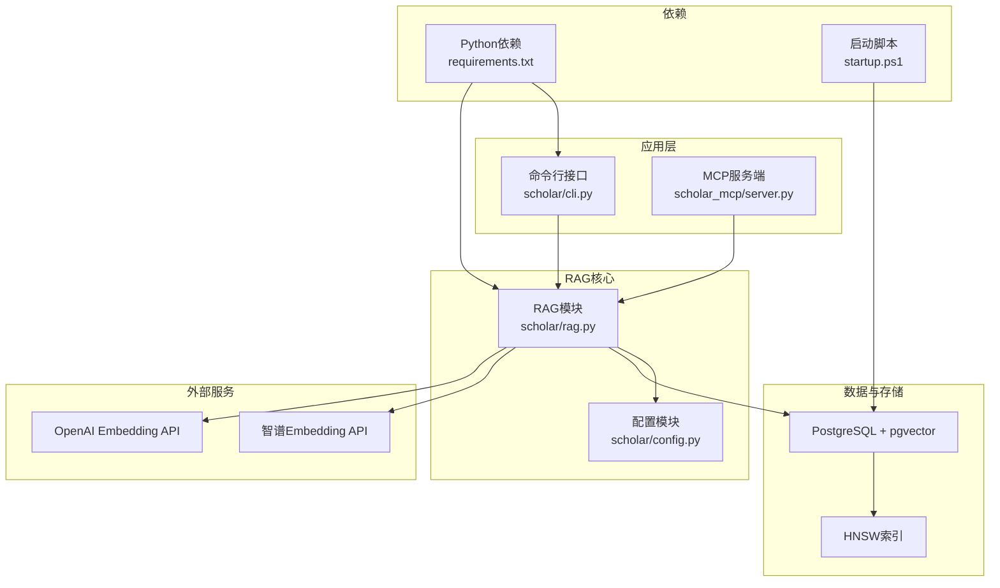
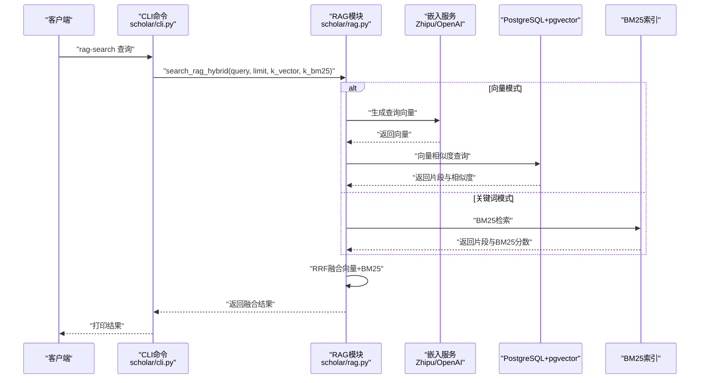
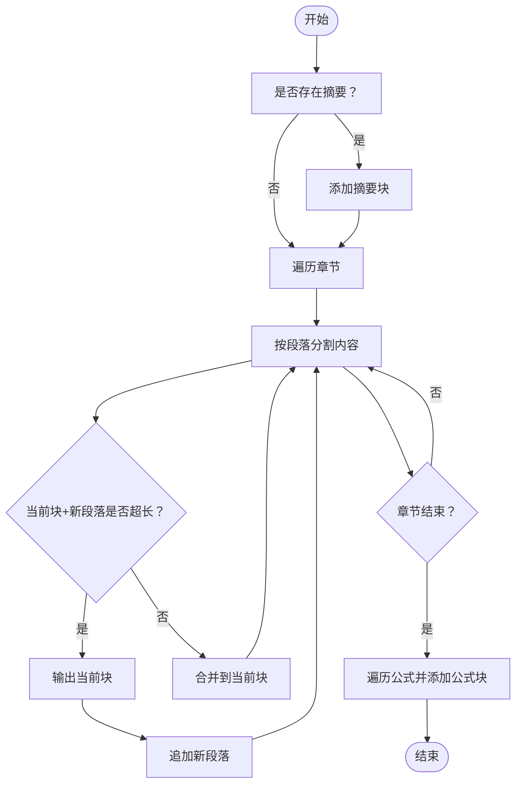
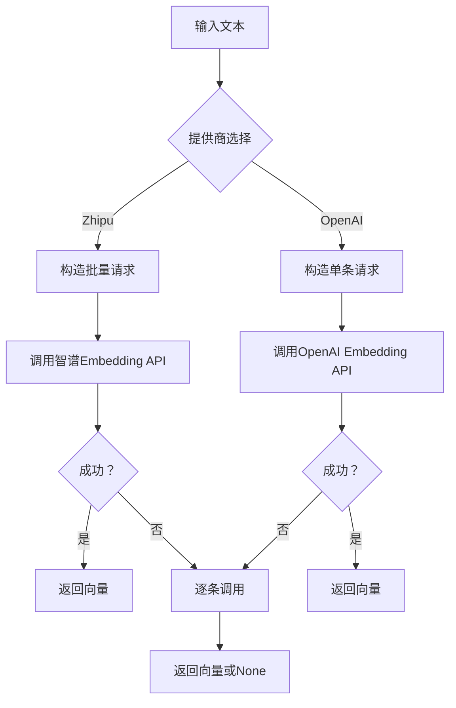
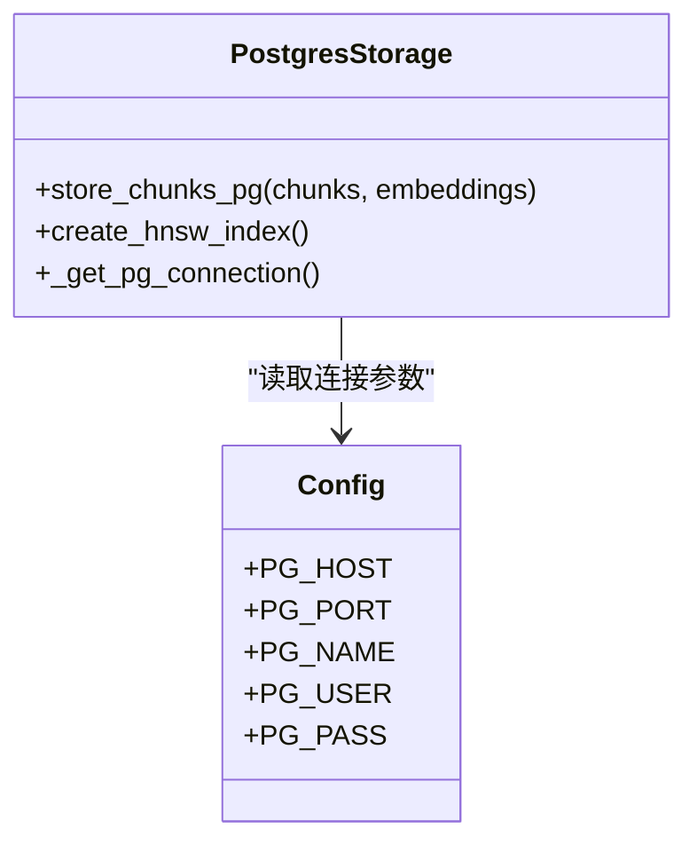
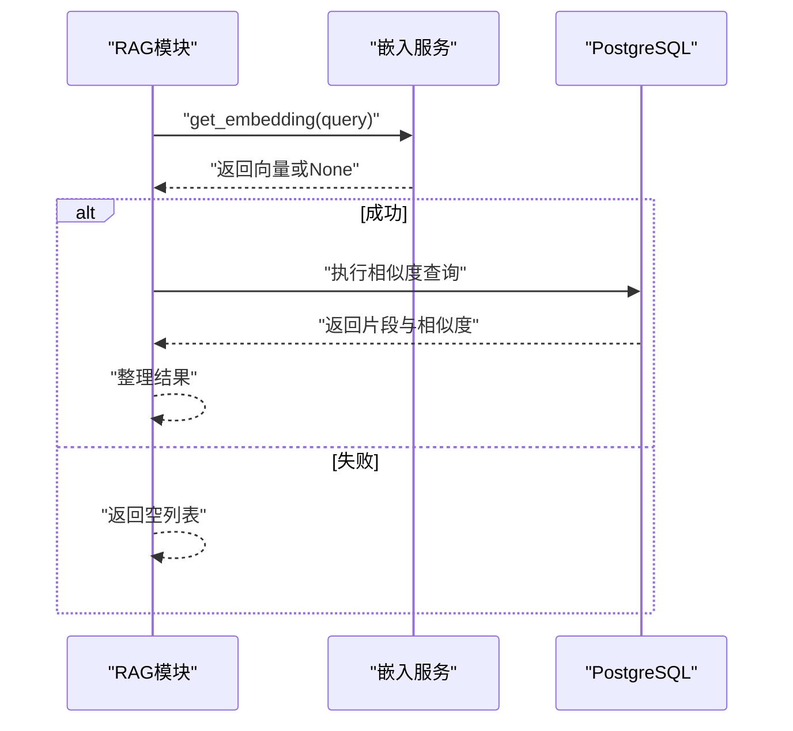
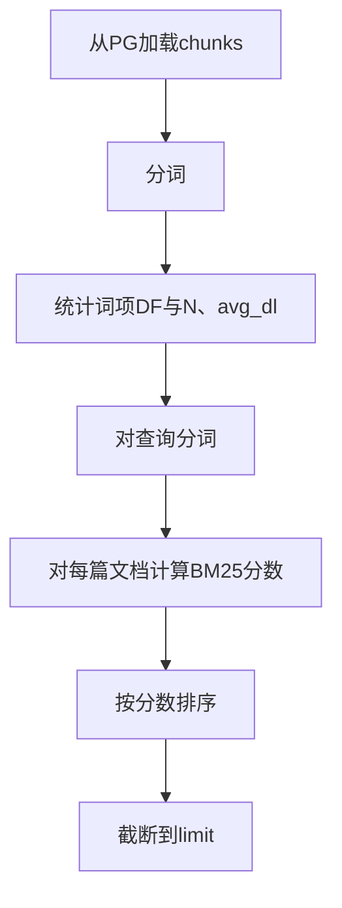
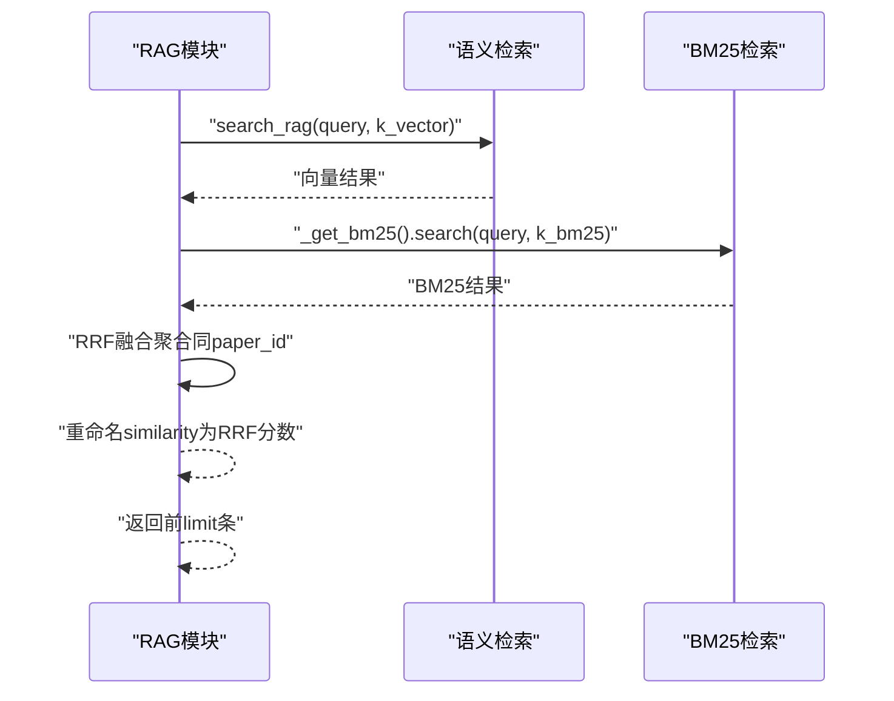
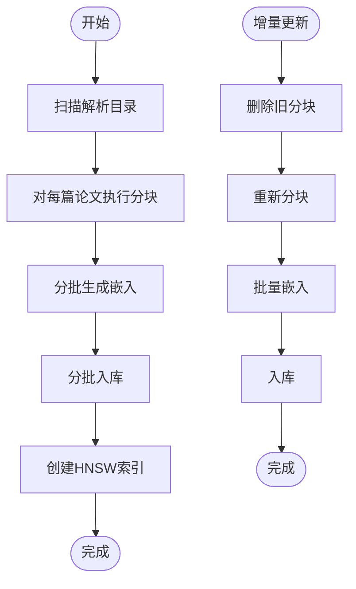
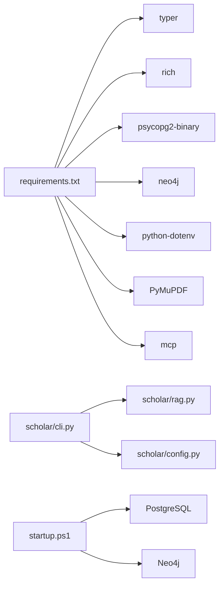

# RAG检索接口

<cite>
**本文引用的文件**   
- [scholar/rag.py](file://scholar/rag.py)
- [scholar/cli.py](file://scholar/cli.py)
- [scholar/config.py](file://scholar/config.py)
- [requirements.txt](file://requirements.txt)
- [startup.ps1](file://startup.ps1)
</cite>

## 目录
1. [简介](#简介)
2. [项目结构](#项目结构)
3. [核心组件](#核心组件)
4. [架构总览](#架构总览)
5. [详细组件分析](#详细组件分析)
6. [依赖关系分析](#依赖关系分析)
7. [性能考量](#性能考量)
8. [故障排查指南](#故障排查指南)
9. [结论](#结论)
10. [附录](#附录)

## 简介
本文件为 Scholar Studio 的 RAG（检索增强生成）检索接口提供完整 API 文档，覆盖以下能力：
- 文本预处理与分块：将解析后的论文内容拆分为可嵌入的语义单元
- 向量嵌入：支持第三方服务（智谱、OpenAI）或本地模型（占位）
- 存储与索引：基于 PostgreSQL + pgvector 的向量存储与 HNSW 近似最近邻索引
- 语义检索：基于余弦距离的向量相似度检索
- 关键词检索：轻量级 BM25 关键词匹配
- 混合检索：向量与 BM25 的互惠排序融合（RRF）
- 批量处理：批式嵌入与索引构建
- 增量更新：按论文粒度重建索引
- 配置与环境：通过环境变量控制嵌入提供商、维度与数据库连接

## 项目结构
RAG 功能主要集中在 scholar/rag.py 中，CLI 命令在 scholar/cli.py 中暴露，配置在 scholar/config.py 中管理，运行时依赖在 requirements.txt 中声明。

图表来源
- [scholar/rag.py:1-582](file://scholar/rag.py#L1-L582)
- [scholar/cli.py:1-800](file://scholar/cli.py#L1-L800)
- [scholar/config.py:1-62](file://scholar/config.py#L1-L62)
- [requirements.txt:1-9](file://requirements.txt#L1-L9)
- [startup.ps1:38-64](file://startup.ps1#L38-L64)

章节来源
- [scholar/rag.py:1-582](file://scholar/rag.py#L1-L582)
- [scholar/cli.py:1-800](file://scholar/cli.py#L1-L800)
- [scholar/config.py:1-62](file://scholar/config.py#L1-L62)
- [requirements.txt:1-9](file://requirements.txt#L1-L9)
- [startup.ps1:38-64](file://startup.ps1#L38-L64)

## 核心组件
- 文本分块器：将论文的摘要、章节段落与公式上下文切分为固定长度的语义片段
- 向量嵌入器：根据配置选择智谱或 OpenAI 提供的 Embedding 接口，或返回空值
- 存储与索引：将分块与向量写入 PostgreSQL 的 chunks 表，并创建 HNSW 索引
- 语义检索：对查询向量与向量库进行余弦距离比较，返回相似度最高的片段
- 关键词检索：轻量级 BM25 实现，从 chunks 表加载内容构建倒排统计
- 混合检索：将向量与 BM25 的结果以 RRF 融合，按最终分数排序
- 批量索引：分批生成嵌入、入库并创建索引
- 增量更新：删除旧分块后重新写入新分块

章节来源
- [scholar/rag.py:25-93](file://scholar/rag.py#L25-L93)
- [scholar/rag.py:100-176](file://scholar/rag.py#L100-L176)
- [scholar/rag.py:182-237](file://scholar/rag.py#L182-L237)
- [scholar/rag.py:252-289](file://scholar/rag.py#L252-L289)
- [scholar/rag.py:295-365](file://scholar/rag.py#L295-L365)
- [scholar/rag.py:383-421](file://scholar/rag.py#L383-L421)
- [scholar/rag.py:471-548](file://scholar/rag.py#L471-L548)
- [scholar/rag.py:551-581](file://scholar/rag.py#L551-L581)

## 架构总览
下图展示从查询到结果返回的关键流程，包括向量生成、存储与检索、关键词检索与混合融合。

图表来源
- [scholar/cli.py:963-980](file://scholar/cli.py#L963-L980)
- [scholar/rag.py:383-421](file://scholar/rag.py#L383-L421)
- [scholar/rag.py:252-289](file://scholar/rag.py#L252-L289)
- [scholar/rag.py:338-365](file://scholar/rag.py#L338-L365)

## 详细组件分析

### 文本分块（Chunking）
- 输入：解析后的论文 JSON 数据（包含 paper_id、标题、摘要、章节列表、公式列表等）
- 策略：
  - 摘要始终作为独立块
  - 章节按段落切分，超过阈值则拆分
  - 公式及其上下文单独成块
- 输出：标准化的分块列表，包含 paper_id、section、content、type 字段

图表来源
- [scholar/rag.py:25-93](file://scholar/rag.py#L25-L93)

章节来源
- [scholar/rag.py:25-93](file://scholar/rag.py#L25-L93)

### 向量嵌入（Embedding）
- 支持提供商：
  - 智谱：支持批量输入，限制单条文本长度
  - OpenAI：使用指定模型，限制单条文本长度
  - 本地：占位符（未实现）
- 错误处理：API 失败时返回空值，避免中断流程
- 批量嵌入：优先使用提供商的批量接口，失败回退为逐条请求

图表来源
- [scholar/rag.py:100-176](file://scholar/rag.py#L100-L176)
- [scholar/rag.py:427-469](file://scholar/rag.py#L427-L469)

章节来源
- [scholar/rag.py:100-176](file://scholar/rag.py#L100-L176)
- [scholar/rag.py:427-469](file://scholar/rag.py#L427-L469)

### 存储与索引（PostgreSQL + pgvector + HNSW）
- 存储：将分块与向量写入 chunks 表（paper_id、section、content、embedding）
- 索引：创建 HNSW 索引，使用向量余弦距离，参数可调
- 连接：通过配置读取数据库凭据

图表来源
- [scholar/rag.py:182-237](file://scholar/rag.py#L182-L237)
- [scholar/config.py:39-49](file://scholar/config.py#L39-L49)

章节来源
- [scholar/rag.py:182-237](file://scholar/rag.py#L182-L237)
- [scholar/config.py:39-49](file://scholar/config.py#L39-L49)

### 语义检索（Semantic Search）
- 步骤：生成查询向量 → 将向量写入 SQL → 使用余弦距离排序 → 返回前 N 条
- 返回字段：paper_id、content、section、similarity（余弦距离转换）

图表来源
- [scholar/rag.py:252-289](file://scholar/rag.py#L252-L289)
- [scholar/rag.py:100-176](file://scholar/rag.py#L100-L176)

章节来源
- [scholar/rag.py:252-289](file://scholar/rag.py#L252-L289)

### 关键词检索（BM25）
- 分词：小写 + 非字母数字字符切分
- 统计：文档频率、平均文档长度
- 计算：IDF × 归一化TF，累加得到 BM25 分数
- 结果：按分数降序返回片段与 BM25 分数

图表来源
- [scholar/rag.py:295-365](file://scholar/rag.py#L295-L365)

章节来源
- [scholar/rag.py:295-365](file://scholar/rag.py#L295-L365)

### 混合检索（Vector + BM25 + RRF）
- 参数：k_vector、k_bm25 控制各自检索规模；RRF 常量默认 60
- 融合：按 paper_id 聚合，RRF_score = Σ 1/(k+rank)，最终按 RRF 降序
- 返回字段：paper_id、content、section、similarity（即 RRF 分数）

图表来源
- [scholar/rag.py:383-421](file://scholar/rag.py#L383-L421)
- [scholar/rag.py:252-289](file://scholar/rag.py#L252-L289)
- [scholar/rag.py:338-365](file://scholar/rag.py#L338-L365)

章节来源
- [scholar/rag.py:383-421](file://scholar/rag.py#L383-L421)

### 批量索引与增量更新
- 批量索引：遍历解析目录，分块 → 批量嵌入 → 分批入库 → 创建索引
- 增量更新：删除旧分块 → 重新分块 → 批量嵌入 → 入库

图表来源
- [scholar/rag.py:471-548](file://scholar/rag.py#L471-L548)
- [scholar/rag.py:551-581](file://scholar/rag.py#L551-L581)

章节来源
- [scholar/rag.py:471-548](file://scholar/rag.py#L471-L548)
- [scholar/rag.py:551-581](file://scholar/rag.py#L551-L581)

## 依赖关系分析
- Python 依赖：typer、rich、psycopg2-binary、neo4j、python-dotenv、PyMuPDF、mcp
- CLI 命令：通过 typer 注册命令，调用 RAG 模块实现检索
- 启动脚本：检查数据库与图数据库状态，提示常用命令

图表来源
- [requirements.txt:1-9](file://requirements.txt#L1-L9)
- [scholar/cli.py:1-800](file://scholar/cli.py#L1-L800)
- [scholar/rag.py:1-582](file://scholar/rag.py#L1-L582)
- [startup.ps1:38-64](file://startup.ps1#L38-L64)

章节来源
- [requirements.txt:1-9](file://requirements.txt#L1-L9)
- [scholar/cli.py:1-800](file://scholar/cli.py#L1-L800)
- [startup.ps1:38-64](file://startup.ps1#L38-L64)

## 性能考量
- 向量检索
  - 使用 HNSW 近似最近邻索引，显著降低查询时间
  - 余弦距离在 pgvector 上高效实现
- 批量处理
  - 批式嵌入减少 API 调用次数与网络开销
  - 分批入库避免单次事务过大
- BM25
  - 仅加载必要字段，避免大文本传输
  - 采用轻量统计与快速排序
- 并发与资源
  - 建议在高并发场景下增加数据库连接池与索引参数调优
  - 对长文本进行截断以满足 API 长度限制

[本节为通用性能建议，不直接分析具体文件]

## 故障排查指南
- 嵌入失败
  - 检查 API Key 是否配置正确
  - 观察提供商接口限制（如单条文本长度）
  - 查看网络超时与异常日志
- 数据库连接
  - 确认数据库主机、端口、库名、用户名、密码
  - 启动脚本会检查表数量，用于快速定位问题
- 索引缺失
  - 若查询缓慢，确认 HNSW 索引已创建
- CLI 命令
  - 使用启动脚本提供的命令快速验证服务状态

章节来源
- [scholar/config.py:39-55](file://scholar/config.py#L39-L55)
- [startup.ps1:38-64](file://startup.ps1#L38-L64)

## 结论
Scholar Studio 的 RAG 检索接口提供了从文本分块、向量嵌入、存储索引到语义检索、关键词检索与混合检索的完整链路。通过 HNSW 近似索引与 RRF 融合策略，在保证检索质量的同时兼顾性能。结合批量处理与增量更新机制，能够支撑大规模学术知识库的检索需求。

[本节为总结性内容，不直接分析具体文件]

## 附录

### API 定义与参数说明
- 语义检索
  - 函数：search_rag(query, limit)
  - 参数
    - query：字符串，查询文本
    - limit：整数，返回结果数量上限
  - 返回：包含 paper_id、content、section、similarity 的列表
- 关键词检索（BM25）
  - 类：BM25Index.search(query, limit)
  - 参数
    - query：字符串，查询文本
    - limit：整数，返回结果数量上限
  - 返回：包含 paper_id、content、section、bm25_score 的列表
- 混合检索
  - 函数：search_rag_hybrid(query, limit, k_vector, k_bm25)
  - 参数
    - query：字符串，查询文本
    - limit：整数，返回结果数量上限
    - k_vector：整数，向量检索规模
    - k_bm25：整数，BM25 检索规模
  - 返回：包含 paper_id、content、section、similarity（RRF 分数）的列表
- 批量索引
  - 函数：index_all_papers(parsed_dir, batch_size)
  - 参数
    - parsed_dir：路径，解析后的论文目录
    - batch_size：整数，批量大小
  - 返回：统计信息（论文数、总块数、嵌入成功数、失败数、索引创建状态）
- 增量更新
  - 函数：index_single_paper(ulid, parsed_dir)
  - 参数
    - ulid：字符串，论文唯一标识
    - parsed_dir：路径，解析后的论文目录
  - 返回：嵌入统计与错误信息

章节来源
- [scholar/rag.py:252-289](file://scholar/rag.py#L252-L289)
- [scholar/rag.py:338-365](file://scholar/rag.py#L338-L365)
- [scholar/rag.py:383-421](file://scholar/rag.py#L383-L421)
- [scholar/rag.py:471-548](file://scholar/rag.py#L471-L548)
- [scholar/rag.py:551-581](file://scholar/rag.py#L551-L581)

### 配置项说明
- 数据库
  - SCHOLAR_PG_HOST、SCHOLAR_PG_PORT、SCHOLAR_PG_NAME、SCHOLAR_PG_USER、SCHOLAR_PG_PASS
- 嵌入
  - SCHOLAR_EMBEDDING_PROVIDER、SCHOLAR_EMBEDDING_MODEL、SCHOLAR_EMBEDDING_DIM、SCHOLAR_EMBEDDING_API_KEY
- 目录
  - PAPERS_DIR、PARSED_DIR、OUTPUT_DIR 等

章节来源
- [scholar/config.py:39-55](file://scholar/config.py#L39-L55)

### CLI 命令与检索入口
- rag-search：调用混合检索接口，支持是否使用混合模式
- 其他命令：scan、parse、search、stats 等，便于整体工作流验证

章节来源
- [scholar/cli.py:963-980](file://scholar/cli.py#L963-L980)