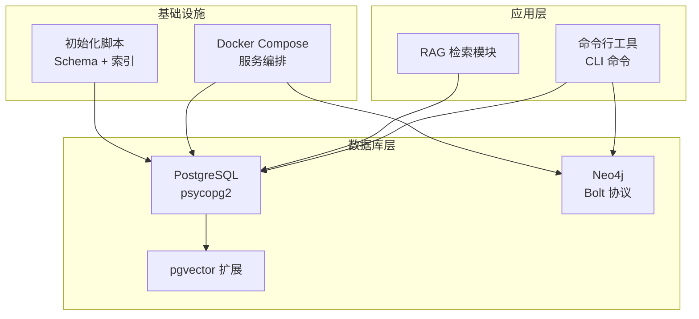
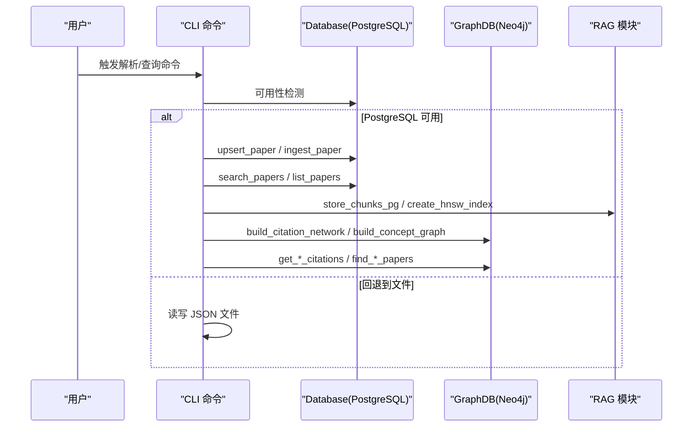
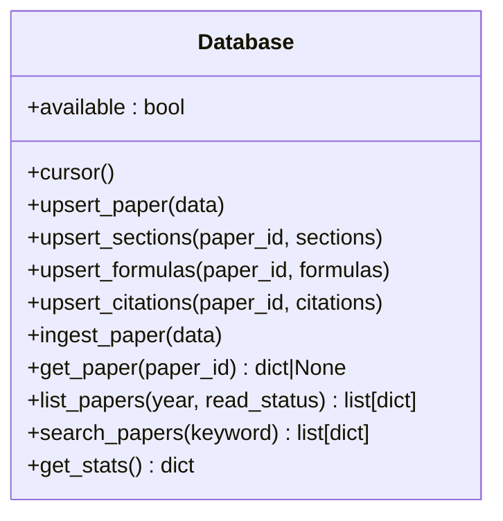
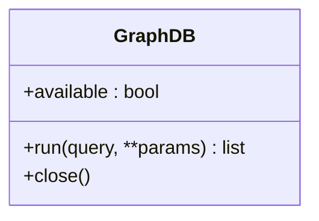
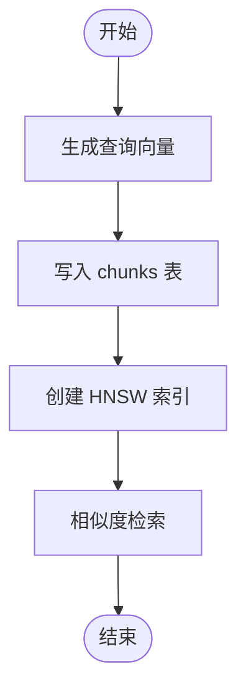
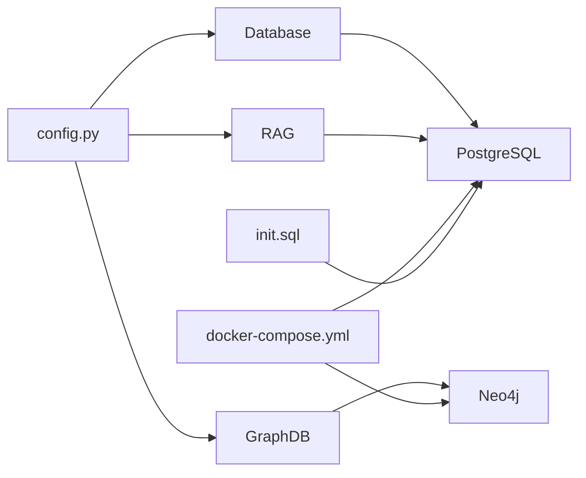

# 数据库接口

<cite>
**本文引用的文件**
- [db.py](file://scholar/db.py)
- [graph_db.py](file://scholar/graph_db.py)
- [config.py](file://scholar/config.py)
- [docker-compose.yml](file://infra/docker-compose.yml)
- [init.sql](file://infra/init.sql)
- [rag.py](file://scholar/rag.py)
- [cli.py](file://scholar/cli.py)
</cite>

## 目录
1. [简介](#简介)
2. [项目结构](#项目结构)
3. [核心组件](#核心组件)
4. [架构总览](#架构总览)
5. [详细组件分析](#详细组件分析)
6. [依赖分析](#依赖分析)
7. [性能考虑](#性能考虑)
8. [故障排查指南](#故障排查指南)
9. [结论](#结论)
10. [附录](#附录)

## 简介
本文件为 Scholar Studio 的数据库接口文档，覆盖 PostgreSQL（含向量扩展）与 Neo4j 图数据库的连接、查询与操作接口规范。内容包括：
- 连接配置与可用性检测
- 结构化数据（论文、章节、公式、引用）的增删改查与事务处理
- 图谱构建与查询（引用网络、概念图、Lean4 创新替换）
- 向量检索（pgvector/HNSW）与混合检索（BM25）
- 数据模型、索引策略与性能优化建议
- 数据库迁移、备份恢复与监控告警
- 数据访问模式、缓存策略与并发控制
- 安全配置、权限管理与审计日志

## 项目结构
Scholar Studio 将数据库层分为两部分：
- 结构化数据库：PostgreSQL（通过 psycopg2），用于论文元数据、分段、公式、引用、嵌入等
- 图数据库：Neo4j（通过 neo4j 驱动），用于引用网络、概念图谱、Lean4 创新替换关系



图表来源
- [docker-compose.yml:1-44](file://infra/docker-compose.yml#L1-L44)
- [init.sql:1-131](file://infra/init.sql#L1-L131)
- [db.py:24-270](file://scholar/db.py#L24-L270)
- [graph_db.py:32-70](file://scholar/graph_db.py#L32-L70)
- [rag.py:180-250](file://scholar/rag.py#L180-L250)

章节来源
- [docker-compose.yml:1-44](file://infra/docker-compose.yml#L1-L44)
- [init.sql:1-131](file://infra/init.sql#L1-L131)
- [config.py:39-62](file://scholar/config.py#L39-L62)

## 核心组件
- PostgreSQL 接口封装（Database 类）
  - 提供连接、事务上下文、可用性检测
  - 支持 upsert_paper、upsert_sections、upsert_formulas、upsert_citations、ingest_paper
  - 支持 get_paper、list_papers、search_papers、get_stats
  - 文件回退：save_parsed、load_parsed、list_parsed
- Neo4j 接口封装（GraphDB 类）
  - 提供连接、run 查询、关闭
  - 引用网络：build_citation_network、resolve_ref_keys、compute_centrality、get_*_citations、get_citation_path、get_bridge_papers
  - 概念图：extract_concepts_tfidf、build_concept_graph、find_*_papers、find_related_concepts、get_concept_timeline、get_concept_subgraph
  - Lean4 同步：sync_lean4_replacements
- RAG 向量检索
  - store_chunks_pg、create_hnsw_index、search_rag、BM25Index
- 配置与环境
  - config.py 中加载 .env 并设置 PostgreSQL、Neo4j、嵌入、LaTeX、Lean 路径等

章节来源
- [db.py:24-270](file://scholar/db.py#L24-L270)
- [graph_db.py:32-922](file://scholar/graph_db.py#L32-L922)
- [rag.py:180-379](file://scholar/rag.py#L180-L379)
- [config.py:1-62](file://scholar/config.py#L1-L62)

## 架构总览
Scholar Studio 的数据库接口采用“双数据库 + 多查询路径”的设计：
- 结构化数据与向量检索走 PostgreSQL + pgvector
- 关系型与语义检索结合，支持精确匹配与近似相似度检索
- 图谱数据走 Neo4j，支撑引用网络、概念图谱与创新演进关系
- CLI 作为入口，优先使用数据库；当数据库不可用时回退到文件系统



图表来源
- [cli.py:180-379](file://scholar/cli.py#L180-L379)
- [db.py:24-270](file://scholar/db.py#L24-L270)
- [graph_db.py:32-922](file://scholar/graph_db.py#L32-L922)
- [rag.py:180-379](file://scholar/rag.py#L180-L379)

## 详细组件分析

### PostgreSQL 数据库接口（Database 类）
- 连接与可用性
  - 使用环境变量进行连接配置
  - available 属性通过尝试连接判断可用性
  - _connect 支持连接复用与 ping 检测
- 事务与上下文
  - cursor 上下文在成功时提交，异常时回滚
- 论文与结构化数据操作
  - upsert_paper：按主键 upsert，更新时间戳
  - upsert_sections / upsert_formulas / upsert_citations：先清空再批量插入
  - ingest_paper：一次性完成论文及其子表的入库
- 查询与统计
  - get_paper：按 id 获取单条记录
  - list_papers：year 与 read_status 条件过滤
  - search_papers：标题/摘要/正文模糊匹配，限制结果数
  - get_stats：统计总数、解析状态、年份范围等
- 文件回退
  - save_parsed / load_parsed / list_parsed：在数据库不可用时保存/读取 JSON



图表来源
- [db.py:24-270](file://scholar/db.py#L24-L270)

章节来源
- [db.py:24-270](file://scholar/db.py#L24-L270)
- [config.py:39-45](file://scholar/config.py#L39-L45)

### Neo4j 图数据库接口（GraphDB 类）
- 连接与可用性
  - available 通过驱动连接并执行 RETURN 1 测试
  - run 统一执行 Cypher 查询并返回记录列表
  - close 关闭驱动实例
- 引用网络
  - build_citation_network：创建 Paper 节点与 CITES 边
  - resolve_ref_keys：将 ref_key 映射到实际 ULID，修正边
  - compute_centrality：计算入度、出度与桥接分数
  - get_*_citations / get_citation_path / get_bridge_papers：查询引用关系与路径
- 概念图
  - extract_concepts_tfidf：基于别名匹配提取概念
  - build_concept_graph：创建 Innovation 节点、HAS_CONCEPT 边、RELATED_TO 边
  - find_*_papers / find_related_concepts / get_concept_timeline / get_concept_subgraph：查询概念相关性与演化
- Lean4 同步
  - sync_lean4_replacements：从 Lean4 Database.lean 动态导入 REPLACES 关系



图表来源
- [graph_db.py:32-70](file://scholar/graph_db.py#L32-L70)

章节来源
- [graph_db.py:32-922](file://scholar/graph_db.py#L32-L922)
- [config.py:46-49](file://scholar/config.py#L46-L49)

### RAG 向量检索（PostgreSQL + pgvector）
- 存储与索引
  - store_chunks_pg：将分块与向量嵌入写入 chunks 表
  - create_hnsw_index：创建 HNSW 索引以加速余弦相似度检索
- 查询
  - search_rag：对查询向量进行相似度排序检索
- BM25（轻量检索）
  - BM25Index：在 chunks 上构建倒排索引，支持关键词检索



图表来源
- [rag.py:180-250](file://scholar/rag.py#L180-L250)
- [rag.py:252-289](file://scholar/rag.py#L252-L289)
- [rag.py:300-365](file://scholar/rag.py#L300-L365)

章节来源
- [rag.py:180-379](file://scholar/rag.py#L180-L379)

### 数据模型与索引策略
- PostgreSQL Schema（来自初始化脚本）
  - papers：论文主表，包含元信息、解析状态、计数字段、时间戳
  - sections/formulas/citations：与 papers 的外键关联，删除级联
  - concepts/paper_concepts：概念抽取与链接
  - chunks：分块文本与向量嵌入，用于 RAG
  - innovations/replacements：Lean4 创新与替换关系
- 索引
  - sections(paper_id)、formulas(paper_id)、citations(from_paper,to_paper)、chunks(paper_id)
  - HNSW 索引（cosine 距离）加速向量检索

```mermaid
erDiagram
PAPERS {
text id PK
text title
text[] authors
int year
text venue
text abstract
text arxiv_id
text doi
boolean has_tex
boolean parsed_ok
text parsed_path
int section_count
int formula_count
int citation_count
text read_status
timestamptz created_at
timestamptz updated_at
}
SECTIONS {
serial id PK
text paper_id FK
text heading
int level
text content
int position
timestamptz created_at
}
FORMULAS {
serial id PK
text paper_id FK
text latex
text label
text env_type
text context
boolean lean_verified
timestamptz created_at
}
CITATIONS {
serial id PK
text from_paper FK
text to_ref
text to_paper
boolean resolved
timestamptz created_at
}
CHUNKS {
serial id PK
text paper_id FK
int section_id
text section
text content
vector embedding
timestamptz created_at
}
CONCEPTS {
serial id PK
text name UK
text definition
timestamptz created_at
}
PAPER_CONCEPTS {
text paper_id FK
int concept_id FK
float relevance
primary key (paper_id, concept_id)
}
INNOVATIONS {
text id PK
text line
boolean core
int year
int scalability
int simplicity
int stability
timestamptz created_at
}
REPLACEMENTS {
serial id PK
text from_innov FK
text to_innov FK
timestamptz created_at
}
PAPERS ||--o{ SECTIONS : "包含"
PAPERS ||--o{ FORMULAS : "包含"
PAPERS ||--o{ CITATIONS : "被引用"
PAPERS ||--o{ CHUNKS : "包含"
PAPERS ||--o{ PAPER_CONCEPTS : "拥有"
CONCEPTS ||--o{ PAPER_CONCEPTS : "被拥有"
INNOVATIONS ||--o{ REPLACEMENTS : "被替换"
```

图表来源
- [init.sql:9-131](file://infra/init.sql#L9-L131)

章节来源
- [init.sql:1-131](file://infra/init.sql#L1-L131)

## 依赖分析
- 运行时依赖
  - PostgreSQL：psycopg2、pgvector 扩展
  - Neo4j：neo4j 驱动
  - RAG：向量检索依赖 HNSW 索引
- 配置依赖
  - 环境变量：SCHOLAR_PG_*、SCHOLAR_NEO4J_*、SCHOLAR_EMBEDDING_* 等
  - Docker Compose：自动拉起数据库容器并挂载初始化脚本



图表来源
- [config.py:39-62](file://scholar/config.py#L39-L62)
- [docker-compose.yml:1-44](file://infra/docker-compose.yml#L1-L44)
- [init.sql:1-131](file://infra/init.sql#L1-L131)

章节来源
- [config.py:1-62](file://scholar/config.py#L1-L62)
- [docker-compose.yml:1-44](file://infra/docker-compose.yml#L1-L44)
- [init.sql:1-131](file://infra/init.sql#L1-L131)

## 性能考虑
- PostgreSQL
  - 使用 upsert（ON CONFLICT）减少重复写入
  - 批量插入（分批）降低网络往返
  - HNSW 索引提升向量检索性能
  - 合理的 WHERE 条件与 LIMIT 限制结果规模
- Neo4j
  - MERGE 避免重复节点/边
  - 对高频查询建立索引或使用预计算属性（如 in/out degree）
  - 分页与 LIMIT 控制返回数量
- RAG
  - 向量维度与索引参数（M、ef_construction）需根据数据规模调优
  - BM25 适合关键词检索，向量检索适合语义相似度
- 并发与缓存
  - PostgreSQL：连接池可选（当前实现为每操作新建连接，可按需引入连接池）
  - Neo4j：驱动会复用连接，注意长事务与超时设置
  - 缓存：对热点查询（如统计、热门概念）可增加应用层缓存

[本节为通用性能建议，不直接分析具体文件]

## 故障排查指南
- PostgreSQL 不可用
  - 现象：Database.available 返回 False
  - 处理：检查环境变量、网络连通性、容器健康状态
  - 回退：CLI 在数据库不可用时使用文件回退
- Neo4j 不可用
  - 现象：GraphDB.available 返回 False
  - 处理：检查 URI、认证、容器健康状态
- 向量检索失败
  - 现象：HNSW 创建失败或检索为空
  - 处理：确认 pgvector 已启用、向量维度一致、索引参数合理
- 引用网络映射失败
  - 现象：ref_key 无法解析为 ULID
  - 处理：检查 normalize/title 匹配逻辑与别名表

章节来源
- [db.py:31-44](file://scholar/db.py#L31-L44)
- [graph_db.py:39-49](file://scholar/graph_db.py#L39-L49)
- [rag.py:214-237](file://scholar/rag.py#L214-L237)
- [cli.py:217-233](file://scholar/cli.py#L217-L233)

## 结论
Scholar Studio 的数据库接口以清晰的职责分离实现了结构化数据与图谱数据的统一管理，并提供了向量检索能力。通过合理的索引与批处理策略，可在大规模论文数据场景中保持良好性能。建议在生产环境中引入连接池、监控告警与定期备份策略，确保系统的稳定性与可维护性。

[本节为总结性内容，不直接分析具体文件]

## 附录

### 数据库连接与配置
- PostgreSQL
  - 主机/端口/库名/用户/密码：通过环境变量 SCHOLAR_PG_* 配置
  - Docker Compose 默认端口 5433，初始凭据 scholar/scholar2024
- Neo4j
  - URI、用户/密码：通过环境变量 SCHOLAR_NEO4J_* 配置
  - Docker Compose 默认端口 7474（浏览器）、7687（Bolt）

章节来源
- [config.py:39-49](file://scholar/config.py#L39-L49)
- [docker-compose.yml:3-19](file://infra/docker-compose.yml#L3-L19)
- [docker-compose.yml:21-39](file://infra/docker-compose.yml#L21-L39)

### 数据库迁移与备份恢复
- 迁移
  - 使用 init.sql 初始化 Schema 与索引
  - 新增列或索引时，建议在维护窗口执行 ALTER TABLE
- 备份
  - PostgreSQL：使用 pg_dump 备份 schema 与数据
  - Neo4j：使用官方备份工具或快照
- 恢复
  - 先恢复数据，再重建索引（如 HNSW）
- 监控告警
  - 建议监控：连接数、慢查询、索引命中率、容器健康状态

[本节为通用运维建议，不直接分析具体文件]

### 安全配置、权限管理与审计日志
- 安全配置
  - 仅在内网或受控网络暴露数据库端口
  - 使用强密码与最小权限账户
- 权限管理
  - 应用使用只读/写入专用账号，避免超级用户
- 审计日志
  - PostgreSQL：开启查询日志与连接日志
  - Neo4j：启用审计日志插件（apoc 或企业版功能）

[本节为通用安全建议，不直接分析具体文件]