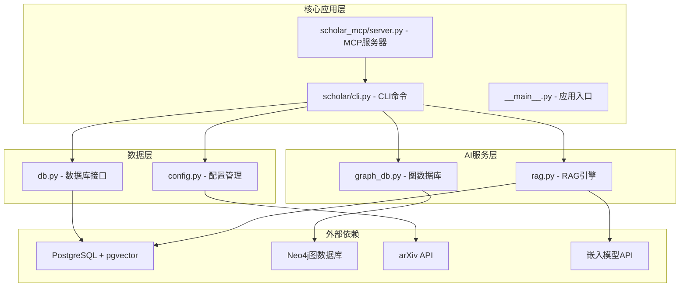
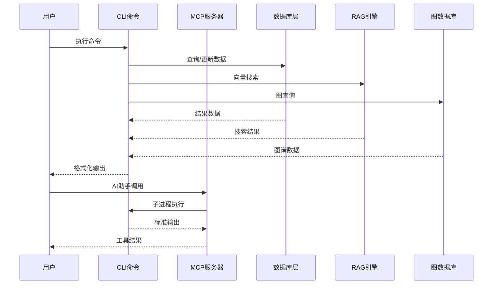
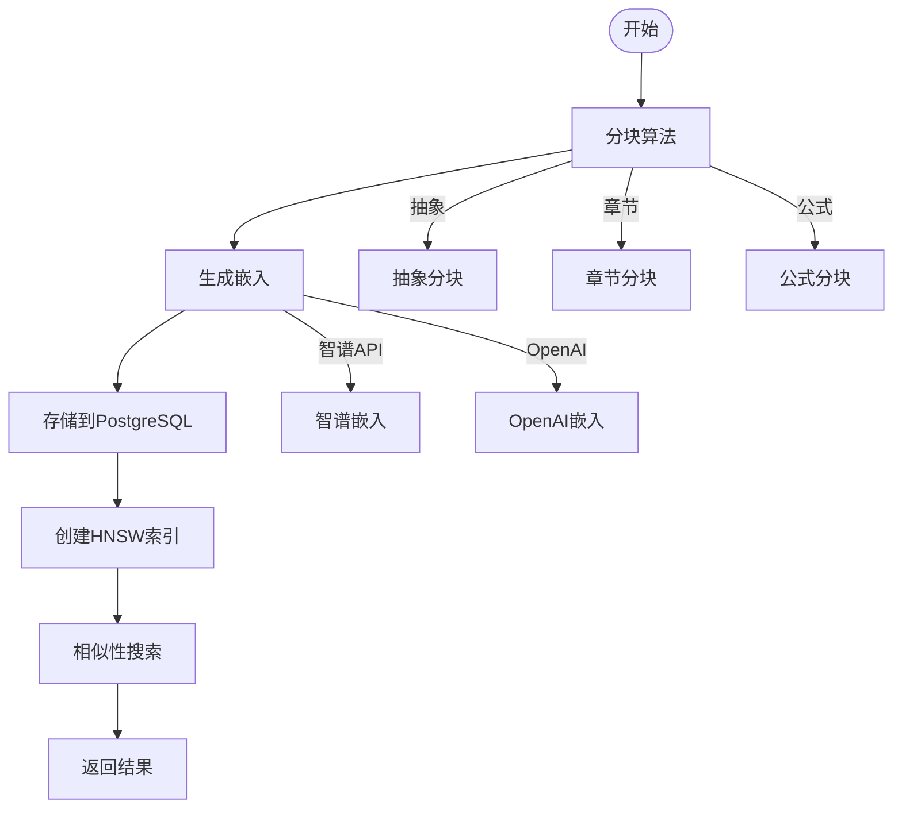
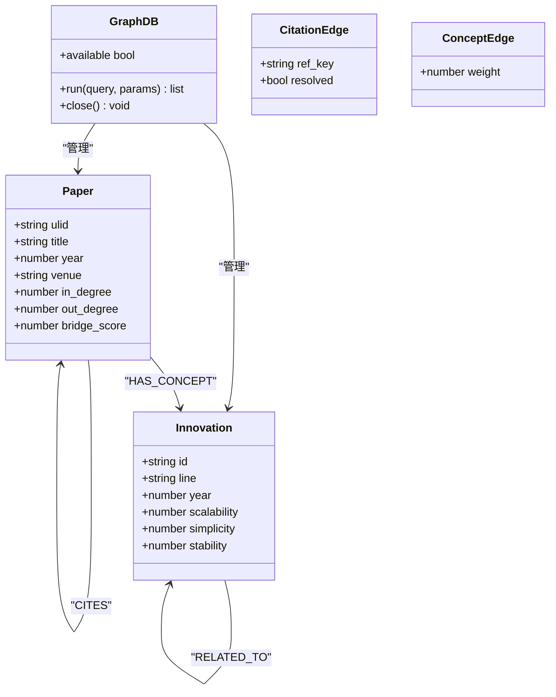
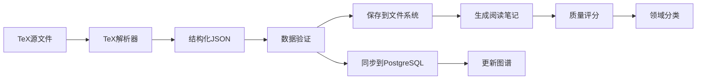
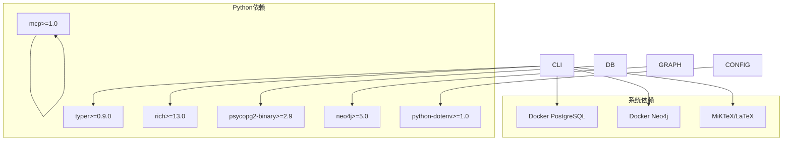

# API接口文档

<cite>
**本文档引用的文件**
- [cli.py](file://scholar/cli.py)
- [__main__.py](file://scholar/__main__.py)
- [config.py](file://scholar/config.py)
- [db.py](file://scholar/db.py)
- [rag.py](file://scholar/rag.py)
- [graph_db.py](file://scholar/graph_db.py)
- [server.py](file://scholar_mcp/server.py)
- [requirements.txt](file://requirements.txt)
- [startup.ps1](file://startup.ps1)
- [plugin/README.md](file://plugin/README.md)
- [plugin/commands/find.md](file://plugin/commands/find.md)
- [plugin/commands/health.md](file://plugin/commands/health.md)
- [plugin/commands/paper.md](file://plugin/commands/paper.md)
- [plugin/commands/stats.md](file://plugin/commands/stats.md)
</cite>

## 目录
1. [简介](#简介)
2. [项目结构](#项目结构)
3. [核心组件](#核心组件)
4. [架构概览](#架构概览)
5. [详细组件分析](#详细组件分析)
6. [依赖关系分析](#依赖关系分析)
7. [性能考虑](#性能考虑)
8. [故障排除指南](#故障排除指南)
9. [结论](#结论)
10. [附录](#附录)

## 简介

Scholar Studio是一个面向学术研究的人工智能工具集，提供了完整的论文管理、分析和检索系统。该系统通过Python CLI接口和MCP服务器为用户提供统一的学术研究工作流。

系统的核心功能包括：
- 论文解析和结构化处理
- 全文检索和语义搜索
- 引用网络分析
- 概念图谱构建
- 实验复现支持
- 研究调查和景观分析

## 项目结构



**图表来源**
- [cli.py:1-50](file://scholar/cli.py#L1-L50)
- [server.py:1-50](file://scholar_mcp/server.py#L1-L50)
- [config.py:40-65](file://scholar/config.py#L40-L65)

**章节来源**
- [cli.py:1-100](file://scholar/cli.py#L1-L100)
- [__main__.py:1-8](file://scholar/__main__.py#L1-L8)
- [plugin/README.md:1-79](file://plugin/README.md#L1-L79)

## 核心组件

### CLI命令系统

Scholar Studio通过Typer框架构建了完整的命令行接口，包含40多个专业命令：

#### 基础命令
- `scan` - 扫描论文库状态
- `parse` - 解析单篇论文
- `parse-all` - 批量解析论文
- `info` - 显示论文详细信息
- `search` - 全文搜索

#### 高级分析命令
- `rag-search` - 语义搜索
- `graph-query` - 图谱查询
- `cite-network` - 引用网络分析
- `survey` - 研究调查
- `landscape` - 领域景观分析

#### 数据管理命令
- `stats` - 知识库统计
- `export-bib` - 导出BibTeX
- `year-fix` - 年份补全
- `author-fix` - 作者补全

**章节来源**
- [cli.py:46-171](file://scholar/cli.py#L46-L171)
- [cli.py:311-370](file://scholar/cli.py#L311-L370)
- [cli.py:421-487](file://scholar/cli.py#L421-L487)

### MCP服务器

MCP（Model Context Protocol）服务器将CLI命令暴露为可被AI助手调用的工具：

#### 工具分类
- **论文库管理**：scan、parse、info、search
- **图谱分析**：graph-build、graph-query、cite-network
- **RAG检索**：rag-index、rag-search
- **元数据补全**：year-fix、author-fix、cite-resolve
- **批量预处理**：auto-notes、quality-score、classify
- **执行层**：compile-paper、exp-run、exp-compare

**章节来源**
- [server.py:41-325](file://scholar_mcp/server.py#L41-L325)

### 数据存储层

#### PostgreSQL + pgvector
- 结构化论文数据存储
- 向量嵌入和相似性搜索
- HNSW索引优化

#### 文件系统回退
- JSON格式的论文解析结果
- 输出目录结构化管理

**章节来源**
- [db.py:24-74](file://scholar/db.py#L24-L74)
- [config.py:41-57](file://scholar/config.py#L41-L57)

## 架构概览



**图表来源**
- [server.py:23-36](file://scholar_mcp/server.py#L23-L36)
- [cli.py:1268-1371](file://scholar/cli.py#L1268-L1371)

## 详细组件分析

### RAG（检索增强生成）系统

#### 向量嵌入管道



**图表来源**
- [rag.py:25-93](file://scholar/rag.py#L25-L93)
- [rag.py:100-176](file://scholar/rag.py#L100-L176)
- [rag.py:182-237](file://scholar/rag.py#L182-L237)

#### 混合搜索策略

系统采用向量搜索和BM25关键字搜索的组合：

1. **向量搜索**：基于语义相似性
2. **BM25搜索**：基于关键词匹配
3. **RRF融合**：递归排名融合算法

**章节来源**
- [rag.py:383-421](file://scholar/rag.py#L383-L421)
- [rag.py:291-365](file://scholar/rag.py#L291-L365)

### 图数据库分析

#### 引用网络构建



**图表来源**
- [graph_db.py:32-69](file://scholar/graph_db.py#L32-L69)
- [graph_db.py:225-281](file://scholar/graph_db.py#L225-L281)
- [graph_db.py:636-732](file://scholar/graph_db.py#L636-L732)

#### 中心性分析

系统计算多种中心性指标：
- **入度中心性**：被引用次数
- **出度中心性**：引用他人次数  
- **桥接中心性**：连接不同社区的能力

**章节来源**
- [graph_db.py:180-223](file://scholar/graph_db.py#L180-L223)
- [graph_db.py:316-365](file://scholar/graph_db.py#L316-L365)

### 论文解析流水线



**图表来源**
- [cli.py:132-171](file://scholar/cli.py#L132-L171)
- [cli.py:1268-1371](file://scholar/cli.py#L1268-L1371)

**章节来源**
- [cli.py:1290-1371](file://scholar/cli.py#L1290-L1371)
- [db.py:170-176](file://scholar/db.py#L170-L176)

## 依赖关系分析



**图表来源**
- [requirements.txt:1-9](file://requirements.txt#L1-L9)
- [startup.ps1:11-15](file://startup.ps1#L11-L15)

**章节来源**
- [requirements.txt:1-9](file://requirements.txt#L1-L9)
- [config.py:41-65](file://scholar/config.py#L41-L65)

## 性能考虑

### 内存优化策略
- **分批处理**：RAG索引采用30条记录批次
- **延迟加载**：BM25索引按需构建
- **连接池**：数据库连接复用

### 索引优化
- **HNSW索引**：向量相似性搜索加速
- **复合索引**：常用查询字段索引
- **缓存策略**：频繁访问的数据缓存

### 并发处理
- **异步操作**：长耗时任务后台执行
- **进度反馈**：Rich库提供实时进度
- **超时控制**：外部API调用超时保护

## 故障排除指南

### 常见问题诊断

#### 数据库连接问题
```bash
# 检查PostgreSQL连接
docker exec scholar-pg psql -U scholar -d scholar -c "SELECT version();"

# 检查Neo4j连接
docker exec scholar-neo4j cypher-shell -u neo4j -p scholar2024 "RETURN 1;"
```

#### RAG索引重建
```bash
# 删除现有索引
docker exec scholar-pg psql -U scholar -d scholar -c "DROP INDEX IF EXISTS idx_chunks_embedding_hnsw;"

# 重新构建索引
python -m scholar rag-index
```

#### 环境变量配置
```bash
# 设置嵌入API密钥
export SCHOLAR_EMBEDDING_API_KEY=your_key_here
export SCHOLAR_EMBEDDING_PROVIDER=zhipu
export SCHOLAR_EMBEDDING_MODEL=embedding-2
```

**章节来源**
- [startup.ps1:18-44](file://startup.ps1#L18-L44)
- [config.py:67-116](file://scholar/config.py#L67-L116)

## 结论

Scholar Studio提供了一个完整的学术研究生态系统，通过CLI命令和MCP服务器实现了高度集成的工作流。系统的设计特点包括：

- **模块化架构**：清晰的组件分离和职责划分
- **多层存储**：结构化数据与向量数据的结合
- **智能分析**：引用网络和概念图谱的深度挖掘
- **可扩展性**：插件化的技能系统和工具接口

该系统特别适合需要处理大量学术论文的研究团队和机构，提供了从数据获取到深度分析的完整解决方案。

## 附录

### 环境配置

#### 必需环境变量
- `SCHOLAR_PG_HOST` - PostgreSQL主机地址
- `SCHOLAR_NEO4J_URI` - Neo4j连接URI  
- `SCHOLAR_EMBEDDING_API_KEY` - 嵌入模型API密钥

#### 启动流程
```bash
# 1. 启动Docker服务
.\startup.ps1

# 2. 安装Python依赖
pip install -r requirements.txt

# 3. 初始化知识库
python -m scholar bootstrap
```

### 插件系统

Scholar Studio插件提供了14个Skills、4个Commands和MCP配置，支持：
- 自动化研究调查
- 论文深度分析
- 实验复现支持
- 知识库维护

**章节来源**
- [plugin/README.md:50-79](file://plugin/README.md#L50-L79)
- [plugin/commands/find.md:1-7](file://plugin/commands/find.md#L1-L7)
- [plugin/commands/health.md:1-10](file://plugin/commands/health.md#L1-L10)
- [plugin/commands/paper.md:1-11](file://plugin/commands/paper.md#L1-L11)
- [plugin/commands/stats.md:1-7](file://plugin/commands/stats.md#L1-L7)