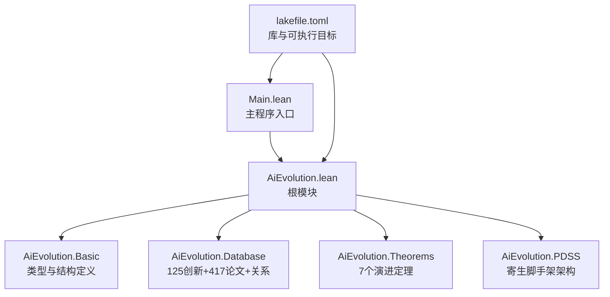
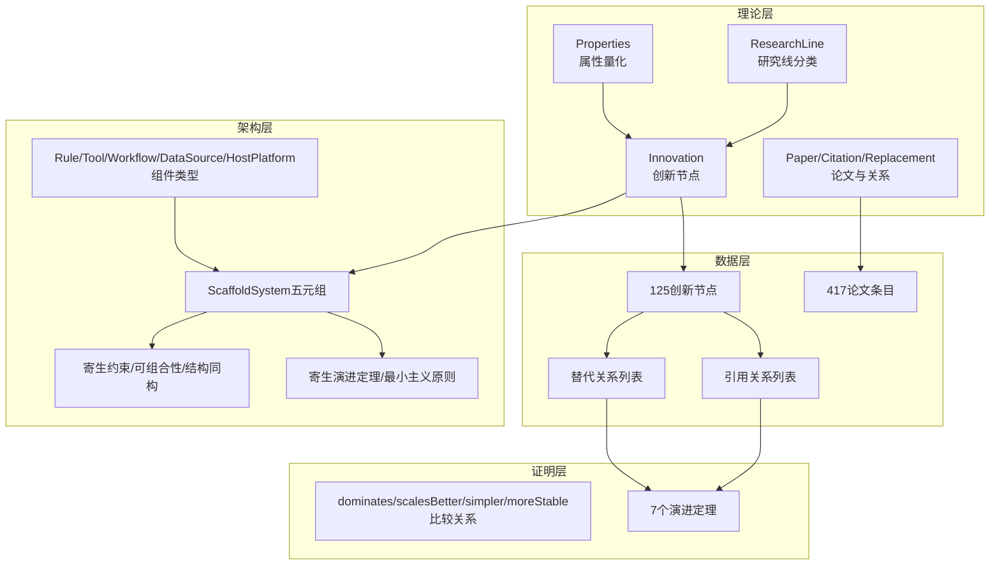
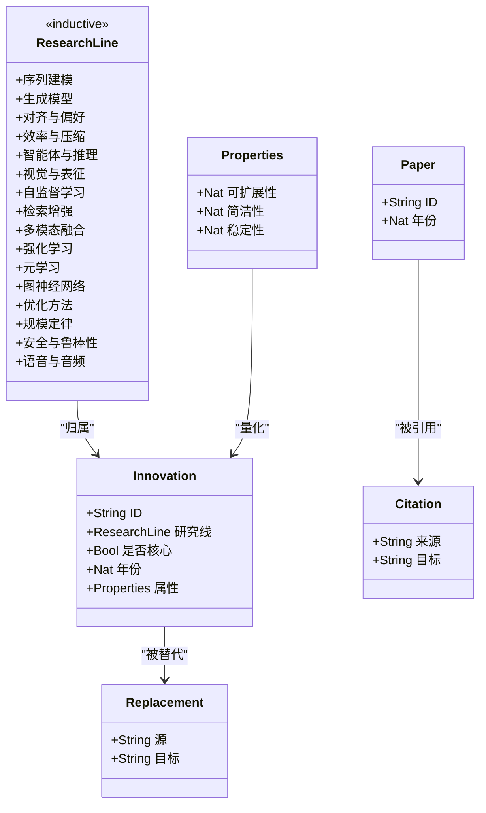
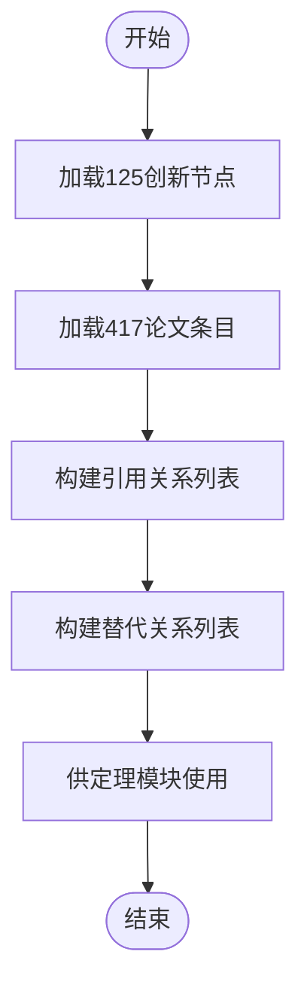
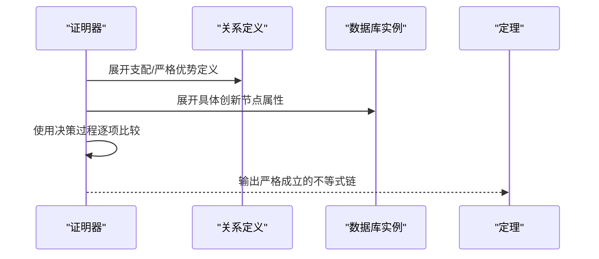
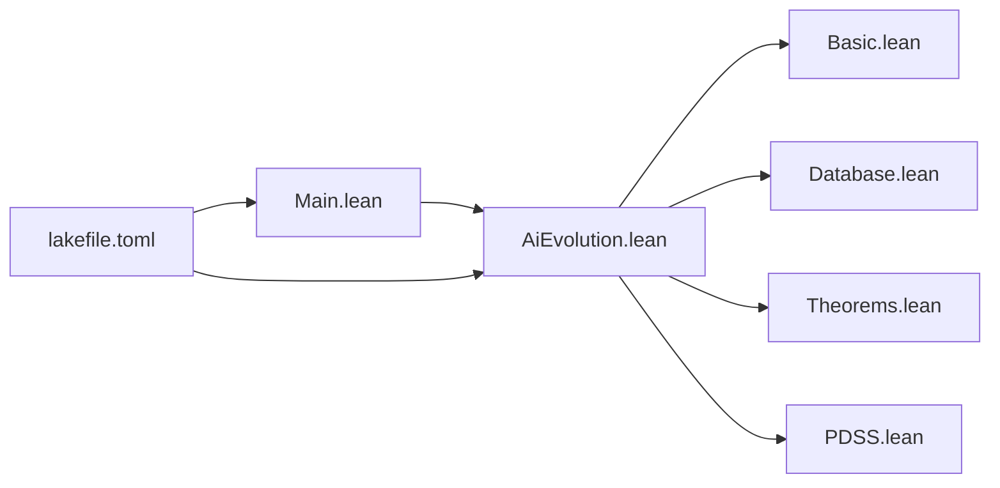

# Lean4形式化系统

<cite>
**本文档引用的文件**
- [AiEvolution.lean](file://LEAN/AiEvolution.lean)
- [Main.lean](file://LEAN/Main.lean)
- [README.md](file://LEAN/README.md)
- [Basic.lean](file://LEAN/AiEvolution/Basic.lean)
- [Database.lean](file://LEAN/AiEvolution/Database.lean)
- [Theorems.lean](file://LEAN/AiEvolution/Theorems.lean)
- [PDSS.lean](file://LEAN/AiEvolution/PDSS.lean)
- [lakefile.toml](file://LEAN/lakefile.toml)
</cite>

## 目录
1. [引言](#引言)
2. [项目结构](#项目结构)
3. [核心组件](#核心组件)
4. [架构总览](#架构总览)
5. [详细组件分析](#详细组件分析)
6. [依赖关系分析](#依赖关系分析)
7. [性能考量](#性能考量)
8. [故障排查指南](#故障排查指南)
9. [结论](#结论)
10. [附录](#附录)

## 引言
本项目为Lean4形式化验证系统，围绕“AI演进”的主题，构建了严谨的数学模型与可验证的定理体系。系统通过形式化定义研究线分类、创新节点、属性量化、论文记录与引用关系，并在严格证明框架下完成7个关键演进定理的编译与验证。同时，系统引入PDSS（寄生领域特定脚手架）架构模式的形式化描述，给出可组合性、结构同构与寄生演进等定理，为工具化研究与工程实践提供形式化支撑。

## 项目结构
项目采用模块化组织，核心入口与库定义如下：
- 根模块：AiEvolution.lean 汇总子模块（Basic、Database、Theorems、PDSS）
- 库与可执行目标：通过lakefile.toml声明库AiEvolution与可执行程序aievolution
- 主程序：Main.lean导入AiEvolution并打印统计信息与证明状态

**图示来源**
- [AiEvolution.lean:1-8](file://LEAN/AiEvolution.lean#L1-L8)
- [Main.lean:1-21](file://LEAN/Main.lean#L1-L21)
- [lakefile.toml:1-11](file://LEAN/lakefile.toml#L1-L11)

**章节来源**
- [AiEvolution.lean:1-8](file://LEAN/AiEvolution.lean#L1-L8)
- [Main.lean:1-21](file://LEAN/Main.lean#L1-L21)
- [lakefile.toml:1-11](file://LEAN/lakefile.toml#L1-L11)

## 核心组件
- 基础类型与结构（AiEvolution.Basic）
  - 研究线分类：16个研究线构成AI演进的分类体系
  - 属性量化：三轴（可扩展性、简洁性、稳定性）的数值化评估
  - 创新节点：连接研究线、年份与属性的结构体
  - 论文与引用：论文元数据与引用关系
  - 替代关系：形式化证明目标（替换关系）
- 数据库（AiEvolution.Database）
  - 125个创新节点按研究线分组，包含年份与属性
  - 417篇论文条目
  - 关键引用关系与替代关系列表
- 形式化定理（AiEvolution.Theorems）
  - 定义支配关系与严格优势关系
  - 7个演进定理：Transformer替换RNN、DPO替换PPO、Diffusion替换GAN、ViT替换CNN、LoRA替换Pruning、AdamW替换Adam、LSTM在可扩展性上优于RNN
- PDSS架构（AiEvolution.PDSS）
  - 规则、工具、工作流、数据源、宿主平台的五元组定义
  - 寄生约束、协议兼容与可组合性、结构同构
  - 寄生演进单调性定理与最小主义原则

**章节来源**
- [Basic.lean:10-64](file://LEAN/AiEvolution/Basic.lean#L10-L64)
- [Database.lean:14-756](file://LEAN/AiEvolution/Database.lean#L14-L756)
- [Theorems.lean:19-128](file://LEAN/AiEvolution/Theorems.lean#L19-L128)
- [PDSS.lean:16-238](file://LEAN/AiEvolution/PDSS.lean#L16-L238)

## 架构总览
系统采用“基础类型—数据库—形式化定理—架构模式”的分层设计。基础类型提供语义建模；数据库提供事实与关系；形式化定理对替代关系进行严格证明；PDSS模块将形式化思想映射到工程架构，形成从理论到实践的闭环。

**图示来源**
- [Basic.lean:10-64](file://LEAN/AiEvolution/Basic.lean#L10-L64)
- [Database.lean:14-756](file://LEAN/AiEvolution/Database.lean#L14-L756)
- [Theorems.lean:19-128](file://LEAN/AiEvolution/Theorems.lean#L19-L128)
- [PDSS.lean:16-238](file://LEAN/AiEvolution/PDSS.lean#L16-L238)

## 详细组件分析

### 基础类型与结构（AiEvolution.Basic）
- 研究线（ResearchLine）：16类研究线覆盖序列建模、生成模型、对齐偏好、效率压缩、智能体推理、视觉表征、自监督学习、检索增强、多模态融合、强化学习、元学习、图神经网络、优化方法、规模定律、安全鲁棒性、语音音频
- 属性（Properties）：三轴量化（可扩展性、简洁性、稳定性），取值范围为1-5
- 创新节点（Innovation）：包含ID、所属研究线、是否核心、年份与属性
- 论文（Paper）、引用（Citation）、替代（Replacement）：用于知识图谱与演进路径建模

**图示来源**
- [Basic.lean:10-64](file://LEAN/AiEvolution/Basic.lean#L10-L64)

**章节来源**
- [Basic.lean:10-64](file://LEAN/AiEvolution/Basic.lean#L10-L64)

### 数据库（AiEvolution.Database）
- 125个创新节点：按研究线分组，每个节点包含ID、研究线、核心标记、年份与三轴属性
- 417篇论文：包含人类可读ID与年份
- 引用关系（citationsDb）：关键论文之间的引用链
- 替代关系（replacesDb）：形式化证明目标，如Transformer替换RNN、DPO替换PPO等

**图示来源**
- [Database.lean:14-756](file://LEAN/AiEvolution/Database.lean#L14-L756)

**章节来源**
- [Database.lean:14-756](file://LEAN/AiEvolution/Database.lean#L14-L756)

### 形式化定理（AiEvolution.Theorems）
- 关系定义
  - 支配关系（dominates）：在至少一个维度严格更优且在其余维度不低于
  - 严格优势关系（scalesBetter/simpler/moreStable）：单维严格更优
- 7个演进定理
  - Transformer替换RNN：在可扩展性与稳定性上严格更优
  - DPO替换PPO：在所有三轴严格更优
  - Diffusion替换GAN：在所有三轴严格更优
  - ViT替换CNN：在可扩展性上严格更优
  - LoRA替换Pruning：在所有三轴严格更优
  - AdamW替换Adam：在稳定性上严格更优
  - LSTM在可扩展性上优于RNN

**图示来源**
- [Theorems.lean:19-128](file://LEAN/AiEvolution/Theorems.lean#L19-L128)
- [Database.lean:18-756](file://LEAN/AiEvolution/Database.lean#L18-L756)

**章节来源**
- [Theorems.lean:19-128](file://LEAN/AiEvolution/Theorems.lean#L19-L128)
- [Database.lean:18-756](file://LEAN/AiEvolution/Database.lean#L18-L756)

### PDSS架构（AiEvolution.PDSS）
- 组件类型
  - 规则（Rule）：Markdown规则注入领域知识
  - 工具（Tool）：标准化协议接口（MCP/CLI）
  - 工作流（Workflow）：多步可执行流程
  - 数据源（DataSource）：JSON文档、属性图、向量索引
  - 宿主平台（HostPlatform）：提供计算、UI、文件系统、终端、版本控制与市场
- 系统定义（五元组S=(R,W,T,D,H)）：满足工作流步调用工具的存在性约束
- 寄生约束：无训练模型、无独立UI、无独立计算资源，全部智力操作委托给宿主LLM
- 可组合性：共享协议兼容工具即为可组合
- 结构同构：独立开发系统在角色与协议层面收敛
- 寄生演进定理：宿主能力提升时系统质量单调上升
- 最小主义原则：工具占比低于一半，强调声明式优先

**图示来源**
- [PDSS.lean:16-238](file://LEAN/AiEvolution/PDSS.lean#L16-L238)

**章节来源**
- [PDSS.lean:16-238](file://LEAN/AiEvolution/PDSS.lean#L16-L238)

## 依赖关系分析
- 模块依赖
  - AiEvolution.lean 导入 Basic、Database、Theorems、PDSS
  - Main.lean 导入 AiEvolution 并打开 Database
  - Theorems.lean 依赖 Basic 与 Database
  - PDSS.lean 仅依赖 Basic
- 目标与构建
  - lakefile.toml 声明库AiEvolution与可执行程序aievolution，根入口为Main

**图示来源**
- [AiEvolution.lean:1-8](file://LEAN/AiEvolution.lean#L1-L8)
- [Main.lean:1-5](file://LEAN/Main.lean#L1-L5)
- [lakefile.toml:1-11](file://LEAN/lakefile.toml#L1-L11)

**章节来源**
- [AiEvolution.lean:1-8](file://LEAN/AiEvolution.lean#L1-L8)
- [Main.lean:1-5](file://LEAN/Main.lean#L1-L5)
- [lakefile.toml:1-11](file://LEAN/lakefile.toml#L1-L11)

## 性能考量
- 形式化证明的可判定性：定理证明依赖属性数值比较与决策过程，复杂度低，适合大规模编译
- 数据规模：125创新节点与417论文的静态数据集，查询与遍历成本可控
- 架构模式的可组合性：通过协议兼容与工具合并实现跨系统协作，避免重复实现
- 最小主义原则：降低工具实现比例，减少维护与部署成本

## 故障排查指南
- 编译失败或未通过
  - 检查lakefile.toml中的默认目标与根入口是否正确
  - 确认AiEvolution.lean中各子模块导入顺序与名称一致
- 定理不成立
  - 核对Database中对应创新节点的属性数值是否符合预期
  - 检查Theorems中比较关系定义与展开是否匹配
- PDSS系统不满足存在性约束
  - 确保工作流中的每一步都引用存在的工具名称
  - 检查工具协议一致性与可组合性假设

**章节来源**
- [lakefile.toml:1-11](file://LEAN/lakefile.toml#L1-L11)
- [AiEvolution.lean:1-8](file://LEAN/AiEvolution.lean#L1-L8)
- [Theorems.lean:19-128](file://LEAN/AiEvolution/Theorems.lean#L19-L128)
- [PDSS.lean:101-104](file://LEAN/AiEvolution/PDSS.lean#L101-L104)

## 结论
本系统以Lean4为载体，将AI演进的分类体系、量化属性、知识图谱与架构模式统一纳入形式化框架。通过7个严格演进定理与PDSS的可组合性、结构同构与寄生演进定理，实现了从理论到实践的闭环验证。对于初学者，建议从Basic与Database入手理解数据模型；对于专家用户，可深入Theorems与PDSS模块探索更高阶的证明与架构设计。

## 附录
- 入门建议
  - 阅读Basic与Database，掌握研究线、属性与创新节点的定义
  - 运行Main查看统计输出与证明状态
  - 阅读Theorems了解支配关系与7个定理的证明策略
  - 探索PDSS模块，理解五元组、寄生约束与可组合性
- 参考路径
  - [AiEvolution.lean](file://LEAN/AiEvolution.lean)
  - [Main.lean](file://LEAN/Main.lean)
  - [Basic.lean](file://LEAN/AiEvolution/Basic.lean)
  - [Database.lean](file://LEAN/AiEvolution/Database.lean)
  - [Theorems.lean](file://LEAN/AiEvolution/Theorems.lean)
  - [PDSS.lean](file://LEAN/AiEvolution/PDSS.lean)
  - [lakefile.toml](file://LEAN/lakefile.toml)