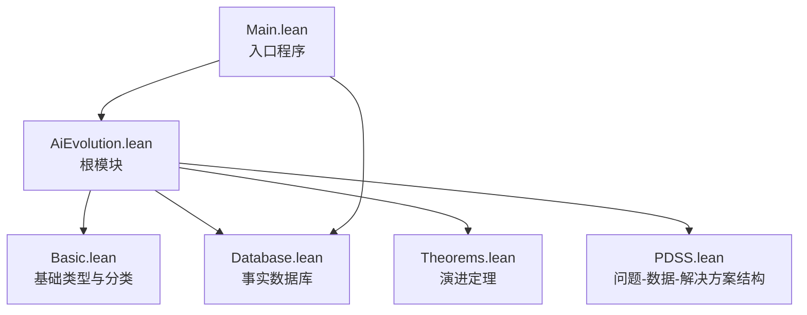
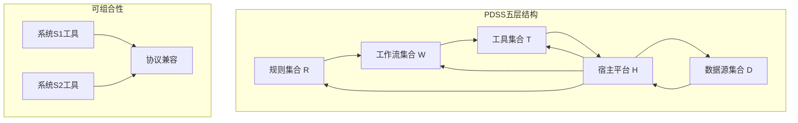
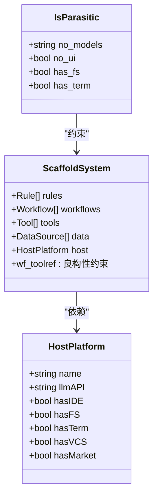
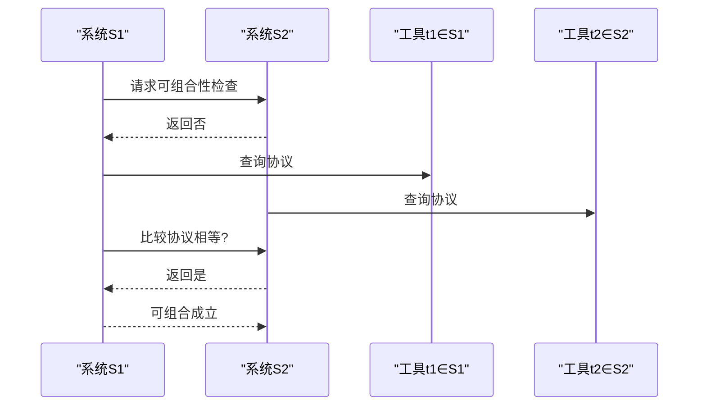
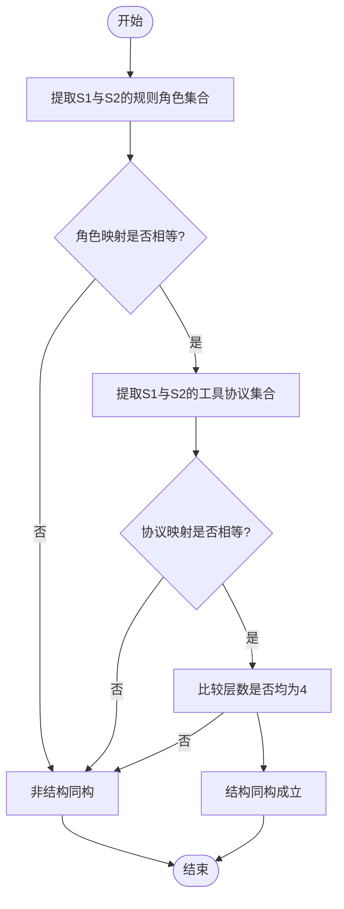
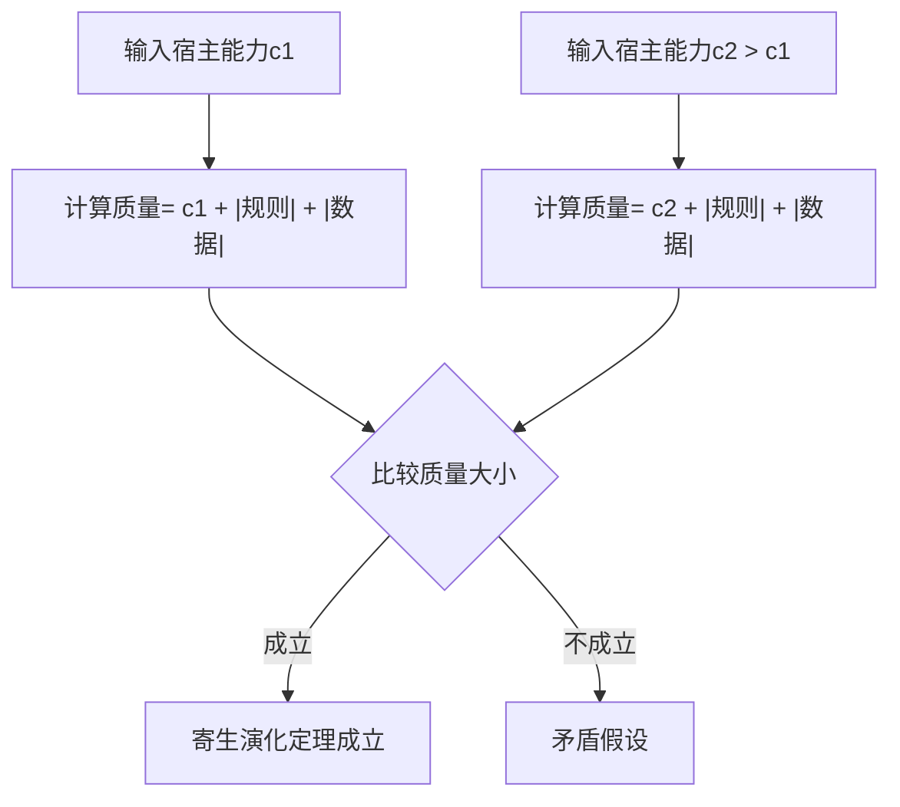
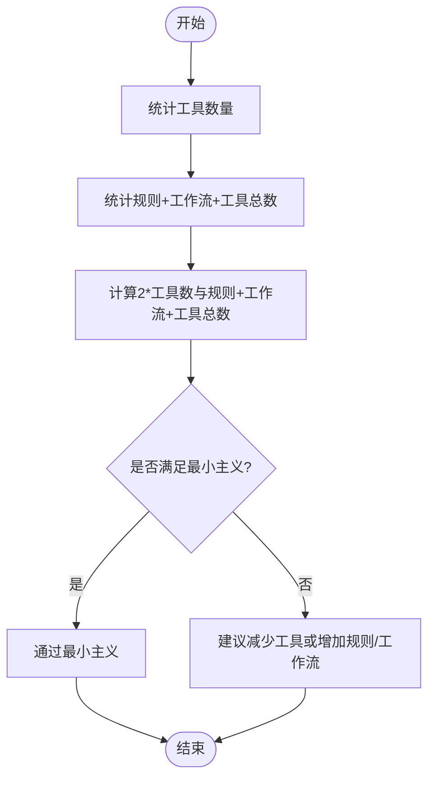
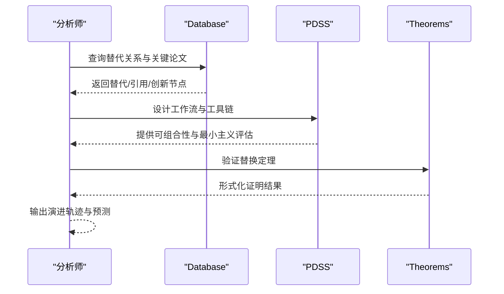
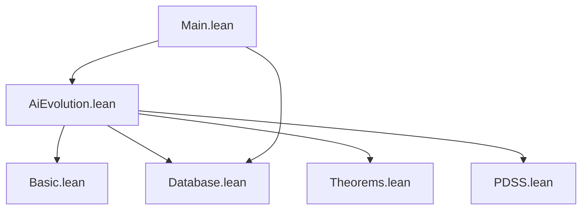

# PDSS问题解决结构

<cite>
**本文档引用的文件**
- [AiEvolution.lean](file://LEAN/AiEvolution.lean)
- [Main.lean](file://LEAN/Main.lean)
- [PDSS.lean](file://LEAN/AiEvolution/PDSS.lean)
- [Basic.lean](file://LEAN/AiEvolution/Basic.lean)
- [Theorems.lean](file://LEAN/AiEvolution/Theorems.lean)
- [Database.lean](file://LEAN/AiEvolution/Database.lean)
</cite>

## 目录
1. [引言](#引言)
2. [项目结构](#项目结构)
3. [核心组件](#核心组件)
4. [架构总览](#架构总览)
5. [详细组件分析](#详细组件分析)
6. [依赖关系分析](#依赖关系分析)
7. [性能考虑](#性能考虑)
8. [故障排除指南](#故障排除指南)
9. [结论](#结论)
10. [附录](#附录)

## 引言
本技术文档围绕Lean4形式化系统中的PDSS（问题-数据-解决方案）问题解决结构展开，目标是将AI演进过程建模为系统性的“问题识别—数据收集—解决方案设计—效果评估”闭环，并通过形式化证明确保框架的可组合性与最小主义原则。文档以AiEvolution库为核心，系统阐释五元组PDSS系统、寄生约束、工具协议兼容与可组合性、结构同构、寄生演化定理以及量化最小主义原则等关键概念，并结合形式化数据库与定理证明模块，给出可操作的应用示例与扩展路径。

## 项目结构
AiEvolution库采用分层模块化组织：根模块导入基础类型、数据库、定理与PDSS定义；Main作为入口程序展示验证结果与编译状态。PDSS模块定义了规则、工具、工作流、数据源与宿主平台等核心构件及其相互关系；Basic模块提供研究线分类、创新节点属性与论文/引用/替代关系的基础类型；Database模块提供125个创新节点、417篇论文及关键引用与替代关系的事实数据库；Theorems模块对7条AI演进定理进行严格形式化证明。

**图示来源**
- [AiEvolution.lean:1-8](file://LEAN/AiEvolution.lean#L1-L8)
- [Main.lean:1-21](file://LEAN/Main.lean#L1-L21)

**章节来源**
- [AiEvolution.lean:1-8](file://LEAN/AiEvolution.lean#L1-L8)
- [Main.lean:1-21](file://LEAN/Main.lean#L1-L21)

## 核心组件
- 规则（Rule）：声明式知识注入单元，承载角色（如身份、路由、约束）与Markdown内容。
- 工具模式（ToolSchema）：标准化接口模式，分别描述输入/输出JSON Schema。
- 工具（Tool）：具体工具实现，包含名称、模式、协议（如MCP、CLI）与实现引用。
- 工作流步骤（WorkflowStep）：单步执行指令，引用工具并指定输出产物格式/路径。
- 工作流（Workflow）：多步骤结构化流程，含触发词、步骤序列与输出产物列表。
- 数据源（DataSource）：结构化数据层实体，区分JSON文档、属性图与向量索引三类。
- 宿主平台（HostPlatform）：提供计算、UI、文件系统、终端、版本控制与市场等基础设施。
- PDSS系统（ScaffoldSystem/PDSS）：五元组(R, W, T, D, H)，满足工作流步骤对工具的良构性约束。
- 寄生约束（IsParasitic）：系统不含训练模型、无独立UI与独立计算资源，所有智能操作委托给宿主大模型。
- 结构同构（StructuralIsomorphism）：两个PDSS系统在规则角色与工具协议层面保持映射不变，体现“自然结构”的收敛性。
- 寄生演化（qualityDependsOnHost）：系统质量随宿主能力单调提升，无需修改脚手架代码。
- 最小主义（codeRatioNum/Den）：工具占比低于一半即满足最小主义，强调声明式优先于命令式实现。

**章节来源**
- [PDSS.lean:20-104](file://LEAN/AiEvolution/PDSS.lean#L20-L104)
- [PDSS.lean:113-124](file://LEAN/AiEvolution/PDSS.lean#L113-L124)
- [PDSS.lean:148-164](file://LEAN/AiEvolution/PDSS.lean#L148-L164)
- [PDSS.lean:172-187](file://LEAN/AiEvolution/PDSS.lean#L172-L187)
- [PDSS.lean:222-237](file://LEAN/AiEvolution/PDSS.lean#L222-L237)

## 架构总览
PDSS架构以“规则—工作流—工具—数据—宿主”五层结构为核心，通过协议兼容与工具联合实现跨系统可组合性；同时以结构同构保证不同独立开发的系统在关键维度上收敛一致；寄生约束确保系统轻量化与宿主能力依赖，从而通过寄生演化定理获得质量单调提升。

**图示来源**
- [PDSS.lean:95-104](file://LEAN/AiEvolution/PDSS.lean#L95-L104)
- [PDSS.lean:135-142](file://LEAN/AiEvolution/PDSS.lean#L135-L142)
- [PDSS.lean:130-131](file://LEAN/AiEvolution/PDSS.lean#L130-L131)

## 详细组件分析

### 组件A：PDSS系统与寄生约束
- 形式化五元组S=(R,W,T,D,H)，要求每个工作流步骤均能被现有工具引用，确保执行可落地。
- 寄生约束要求系统不包含训练模型、无独立UI与独立计算资源，所有智能操作由宿主大模型完成，从而实现“以宿主能力为唯一增益点”的寄生演化。

**图示来源**
- [PDSS.lean:95-104](file://LEAN/AiEvolution/PDSS.lean#L95-L104)
- [PDSS.lean:79-87](file://LEAN/AiEvolution/PDSS.lean#L79-L87)
- [PDSS.lean:113-124](file://LEAN/AiEvolution/PDSS.lean#L113-L124)

**章节来源**
- [PDSS.lean:95-124](file://LEAN/AiEvolution/PDSS.lean#L95-L124)

### 组件B：工具协议兼容与可组合性
- 协议兼容：若两个工具使用相同协议（如均为MCP），则它们在协议层面兼容。
- 可组合性：若两个PDSS系统共享至少一个协议兼容工具，则它们可组合，允许跨系统调用。
- 对称性：可组合性满足交换律，S1与S2可组合当且仅当S2与S1可组合。
- MCP推论：若两系统均使用MCP协议，则它们可组合。

**图示来源**
- [PDSS.lean:130-142](file://LEAN/AiEvolution/PDSS.lean#L130-L142)
- [PDSS.lean:195-203](file://LEAN/AiEvolution/PDSS.lean#L195-L203)
- [PDSS.lean:206-217](file://LEAN/AiEvolution/PDSS.lean#L206-L217)

**章节来源**
- [PDSS.lean:129-142](file://LEAN/AiEvolution/PDSS.lean#L129-L142)
- [PDSS.lean:195-217](file://LEAN/AiEvolution/PDSS.lean#L195-L217)

### 组件C：结构同构与自然结构收敛
- 规则角色映射：两系统规则的角色集合在映射下相等。
- 工具协议映射：两系统工具的协议集合在映射下相等。
- 层次保持：两者均具备四层（规则、工作流、工具、数据+宿主）结构。

**图示来源**
- [PDSS.lean:153-164](file://LEAN/AiEvolution/PDSS.lean#L153-L164)

**章节来源**
- [PDSS.lean:148-164](file://LEAN/AiEvolution/PDSS.lean#L148-L164)

### 组件D：寄生演化与质量度量
- 质量函数：质量取决于宿主能力、规则数量与数据源数量之和，体现“规则与数据作为上下文增强宿主输出”的思想。
- 寄生演化定理：宿主能力严格递增时，系统质量严格递增，无需修改脚手架代码。

**图示来源**
- [PDSS.lean:172-187](file://LEAN/AiEvolution/PDSS.lean#L172-L187)

**章节来源**
- [PDSS.lean:172-187](file://LEAN/AiEvolution/PDSS.lean#L172-L187)

### 组件E：最小主义原则与代码比例
- 代码比例：工具数作为分子，规则+工作流+工具总数作为分母，要求工具占比小于一半。
- 含义：声明式规则与工作流优先，减少命令式实现，提高可维护性与可移植性。

**图示来源**
- [PDSS.lean:222-237](file://LEAN/AiEvolution/PDSS.lean#L222-L237)

**章节来源**
- [PDSS.lean:222-237](file://LEAN/AiEvolution/PDSS.lean#L222-L237)

### 组件F：AI演进形式化与PDSS框架的结合
- 基础类型：研究线分类、创新节点属性（可扩展性、简洁性、稳定性）、论文与引用/替代关系。
- 数据库：125个创新节点与417篇论文的事实库，包含关键替代关系与引用关系。
- 定理：7条AI演进定理，证明某创新在至少两个轴上优于其前代，体现“替换”关系的形式化证明。
- 应用：将AI演进视为“问题—数据—解决方案—效果评估”的PDSS过程，其中：
  - 问题：某研究线的瓶颈（如RNN的可扩展性不足）
  - 数据：历史创新与论文证据（Database）
  - 解决方案：新架构（如Transformer）的工作流与工具链（PDSS）
  - 效果：定理证明的质量度量（Theorems）

**图示来源**
- [Basic.lean:10-64](file://LEAN/AiEvolution/Basic.lean#L10-L64)
- [Database.lean:17-756](file://LEAN/AiEvolution/Database.lean#L17-L756)
- [Theorems.lean:19-128](file://LEAN/AiEvolution/Theorems.lean#L19-L128)
- [PDSS.lean:95-104](file://LEAN/AiEvolution/PDSS.lean#L95-L104)

**章节来源**
- [Basic.lean:10-64](file://LEAN/AiEvolution/Basic.lean#L10-L64)
- [Database.lean:17-756](file://LEAN/AiEvolution/Database.lean#L17-L756)
- [Theorems.lean:19-128](file://LEAN/AiEvolution/Theorems.lean#L19-L128)
- [PDSS.lean:95-104](file://LEAN/AiEvolution/PDSS.lean#L95-L104)

## 依赖关系分析
- 模块依赖：AiEvolution.lean统一导入Basic、Database、Theorems与PDSS；Main导入AiEvolution并访问Database。
- 内部依赖：PDSS依赖Basic（用于规则、工作流、工具、数据源、宿主平台等基础类型）；Theorems依赖Basic与Database（使用创新节点与替代/引用关系）。
- 外部依赖：lake配置文件中包含多个leanprover-community生态包，支持可证明性工具链与自动化构建。

**图示来源**
- [AiEvolution.lean:1-8](file://LEAN/AiEvolution.lean#L1-L8)
- [Main.lean:1-21](file://LEAN/Main.lean#L1-L21)

**章节来源**
- [AiEvolution.lean:1-8](file://LEAN/AiEvolution.lean#L1-L8)
- [Main.lean:1-21](file://LEAN/Main.lean#L1-L21)

## 性能考虑
- 可组合性优化：通过协议兼容快速筛选共享工具，降低跨系统集成成本。
- 最小主义实践：优先使用声明式规则与工作流，减少工具实现数量，提高系统整体可维护性与运行效率。
- 寄生演化策略：将系统升级聚焦于宿主能力提升与规则/数据增强，避免频繁修改工具实现。
- 数据规模管理：Database包含大量创新节点与论文，查询时应利用索引与过滤策略，避免全表扫描。

## 故障排除指南
- 工作流执行失败：检查工作流步骤引用的工具是否存在，确保ScaffoldSystem的良构性约束满足。
- 可组合性判定异常：确认工具协议一致性，必要时引入MCP协议以满足可组合性推论。
- 最小主义不满足：评估工具数量与规则/工作流数量的比例，适当拆分或合并工具实现。
- 定理证明失败：核对创新节点属性与替代关系，确保Database与Theorems的定义一致。

**章节来源**
- [PDSS.lean:101-104](file://LEAN/AiEvolution/PDSS.lean#L101-L104)
- [PDSS.lean:135-142](file://LEAN/AiEvolution/PDSS.lean#L135-L142)
- [PDSS.lean:222-237](file://LEAN/AiEvolution/PDSS.lean#L222-L237)
- [Theorems.lean:25-43](file://LEAN/AiEvolution/Theorems.lean#L25-L43)

## 结论
PDSS问题解决结构以Lean4形式化语言精确刻画了AI演进过程中的“问题—数据—解决方案—效果评估”闭环，通过寄生约束、可组合性、结构同构与最小主义原则，实现了系统性、可验证且可扩展的分析框架。结合Database的事实库与Theorems的形式化证明，PDSS不仅能够描述历史演进，还能指导未来创新路径的设计与评估。

## 附录
- 实际应用示例（基于仓库内事实）：
  - RNN到Transformer的演进：通过Database中的替代关系与Theorems中的定理，验证Transformer在可扩展性与稳定性上的优势。
  - GAN到Diffusion的演进：利用Database的关键论文与替代关系，结合PDSS工作流设计工具链，评估新架构在生成质量与稳定性上的改进。
- 使用技巧：
  - 在设计工作流时，优先选择与现有工具协议一致的实现，以满足可组合性。
  - 将规则与工作流作为主要的知识注入手段，控制工具数量以满足最小主义。
  - 将系统升级重点放在宿主能力提升与规则/数据增强上，遵循寄生演化策略。
- 扩展方法：
  - 新增研究线与创新节点时，同步更新Database与Theorems，确保替换关系与定理成立。
  - 引入新的工具协议（如新标准）时，评估其对可组合性的影响，并在PDSS中更新协议兼容性判断。

**章节来源**
- [Database.lean:617-756](file://LEAN/AiEvolution/Database.lean#L617-L756)
- [Theorems.lean:46-128](file://LEAN/AiEvolution/Theorems.lean#L46-L128)
- [PDSS.lean:129-142](file://LEAN/AiEvolution/PDSS.lean#L129-L142)
- [PDSS.lean:222-237](file://LEAN/AiEvolution/PDSS.lean#L222-L237)