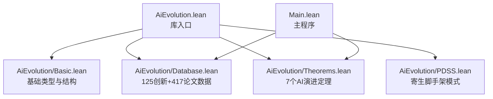
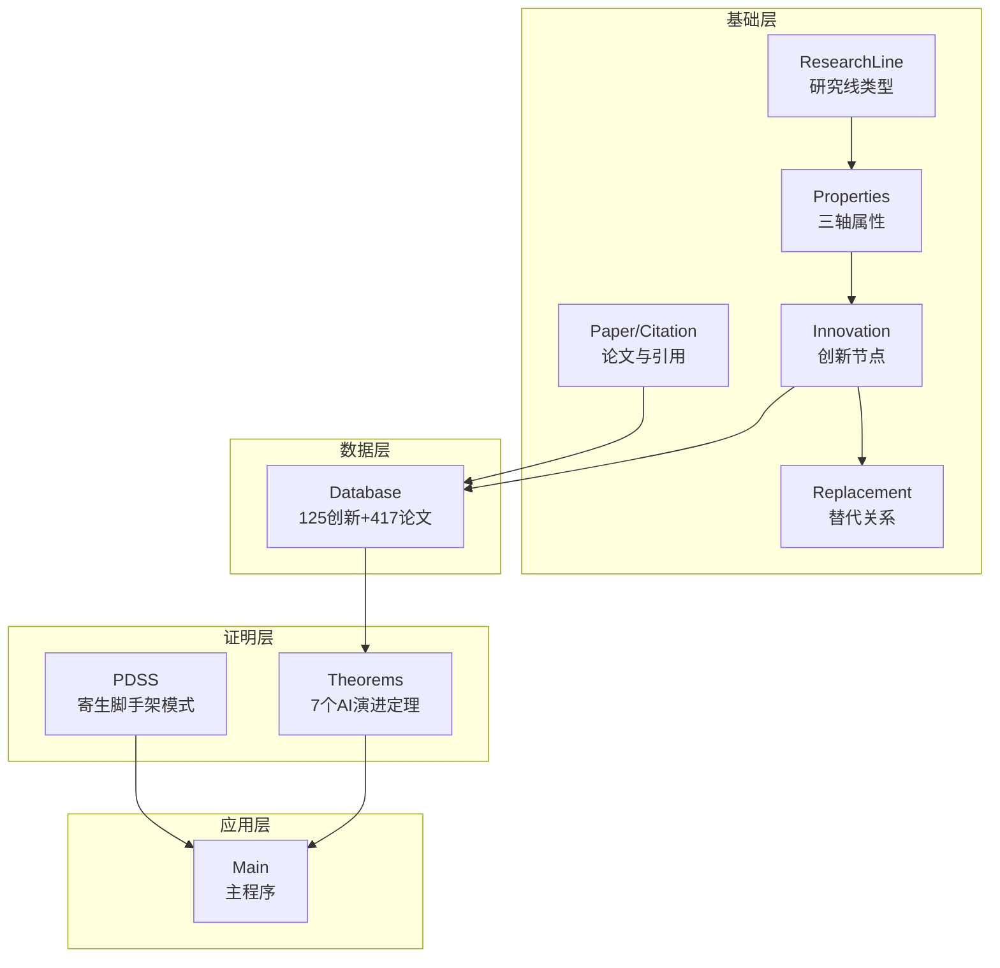
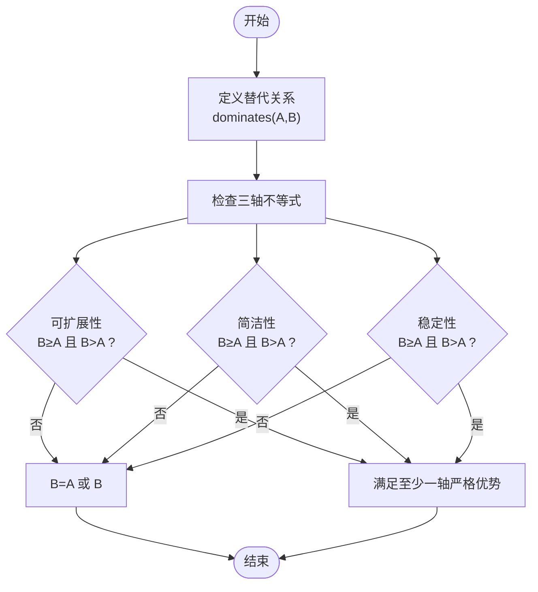
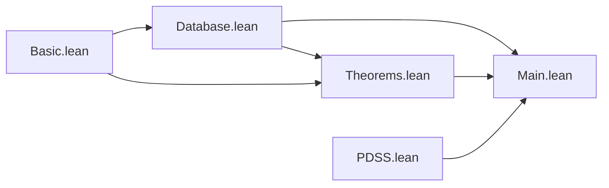

# 形式化定理证明

<cite>
**本文档引用的文件**
- [AiEvolution/Theorems.lean](file://LEAN/AiEvolution/Theorems.lean)
- [AiEvolution/Basic.lean](file://LEAN/AiEvolution/Basic.lean)
- [AiEvolution/Database.lean](file://LEAN/AiEvolution/Database.lean)
- [AiEvolution/PDSS.lean](file://LEAN/AiEvolution/PDSS.lean)
- [AiEvolution.lean](file://LEAN/AiEvolution.lean)
- [Main.lean](file://LEAN/Main.lean)
- [README.md](file://LEAN/README.md)
</cite>

## 目录
1. [引言](#引言)
2. [项目结构](#项目结构)
3. [核心组件](#核心组件)
4. [架构总览](#架构总览)
5. [详细定理分析](#详细定理分析)
6. [依赖关系分析](#依赖关系分析)
7. [性能考量](#性能考量)
8. [故障排除指南](#故障排除指南)
9. [结论](#结论)
10. [附录](#附录)

## 引言
本项目基于Lean4形式化系统，围绕“AI演进”的七个关键定理构建严格的数学证明框架。这些定理以“替代关系”为核心，系统性地刻画了在可扩展性（scalability）、简洁性（simplicity）与稳定性（stability）三个维度上，新一代AI范式如何在至少两个轴向上优于其前代方案。通过形式化验证，我们确保每一条替代关系都得到严格证明，杜绝任何“未完成证明”（no sorry），从而为AI发展路径提供可检验、可复用的数学基础。

## 项目结构
项目采用模块化组织，核心模块如下：
- 基础类型与数据结构：定义研究线、创新节点、论文元数据等基础概念
- 数据库：内置125个创新节点与417篇论文的权威数据集
- 定理证明：七个AI演进定理的形式化证明
- PDSS模式：寄生域特定脚手架（Parasitic Domain-Specific Scaffolding）的架构与性质形式化
- 入口程序：主程序输出统计信息并确认所有定理已编译且严格证明

图表来源
- [AiEvolution.lean:1-8](file://LEAN/AiEvolution.lean#L1-L8)
- [Main.lean:1-21](file://LEAN/Main.lean#L1-L21)

章节来源
- [AiEvolution.lean:1-8](file://LEAN/AiEvolution.lean#L1-L8)
- [Main.lean:1-21](file://LEAN/Main.lean#L1-L21)

## 核心组件
本节概述支撑定理证明的核心数据结构与关系定义。

- 研究线（ResearchLine）：将AI创新按主题分类，如序列建模、生成模型、对齐偏好、效率压缩、智能体推理、视觉表征、自监督学习、检索增强、多模态融合、强化学习、元学习、图神经网络、优化方法、规模定律、安全鲁棒性、语音音频等。
- 创新属性（Properties）：量化描述创新在三个轴上的表现，取值范围为1-5，数值越高表示越优。
- 创新节点（Innovation）：包含标识、所属研究线、是否核心创新、年份及三轴属性。
- 替代关系（Replacement）：正式刻画“旧方案被新方案替代”的关系，用于形式化证明目标。
- 论文与引用（Paper/Citation）：提供知识库链接与关键论文之间的引用关系。

章节来源
- [AiEvolution/Basic.lean:10-64](file://LEAN/AiEvolution/Basic.lean#L10-L64)
- [AiEvolution/Database.lean:18-166](file://LEAN/AiEvolution/Database.lean#L18-L166)

## 架构总览
下图展示了从基础类型到数据、再到定理证明的整体架构，以及主程序如何调用数据库与定理模块进行验证。

图表来源
- [AiEvolution/Basic.lean:10-64](file://LEAN/AiEvolution/Basic.lean#L10-L64)
- [AiEvolution/Database.lean:12-756](file://LEAN/AiEvolution/Database.lean#L12-L756)
- [AiEvolution/Theorems.lean:15-129](file://LEAN/AiEvolution/Theorems.lean#L15-L129)
- [AiEvolution/PDSS.lean:95-107](file://LEAN/AiEvolution/PDSS.lean#L95-L107)
- [Main.lean:6-20](file://LEAN/Main.lean#L6-L20)

## 详细定理分析

### 定理1：Transformer替代RNN
- 数学表述：在可扩展性与稳定性上，Transformer严格优于RNN；在简洁性上不占优，但满足“至少两个轴上占优”的条件。
- 前提假设：RNN与Transformer的三轴属性来自数据库实例化定义。
- 结论意义：证明了注意力机制在长序列建模中的范式转移，强调计算效率与稳定性优先于局部简洁性。
- 证明思路：直接比较两者的属性值，使用形式化工具自动决策大小关系。
- 关键步骤：
  - 展开定义：比较Transformer与RNN的可扩展性与稳定性。
  - 使用简化与决策规则验证严格不等式成立。
- 应用场景：指导在长序列任务中优先采用Transformer类架构，避免RNN的长期依赖瓶颈。

章节来源
- [AiEvolution/Theorems.lean:48-57](file://LEAN/AiEvolution/Theorems.lean#L48-L57)
- [AiEvolution/Database.lean:18-24](file://LEAN/AiEvolution/Database.lean#L18-L24)

### 定理2：DPO替代PPO
- 数学表述：DPO在可扩展性、简洁性、稳定性三轴均严格优于PPO。
- 前提假设：PPO与DPO的属性来自数据库实例化。
- 结论意义：证明偏好优化范式的改进，强调更优的训练稳定性与实现简洁性。
- 证明思路：通过展开“dominates”定义，逐轴比较并使用自动化决策完成证明。
- 关键步骤：展开dominates，代入具体数值，逐一验证不等式。

章节来源
- [AiEvolution/Theorems.lean:60-69](file://LEAN/AiEvolution/Theorems.lean#L60-L69)
- [AiEvolution/Database.lean:41-43](file://LEAN/AiEvolution/Database.lean#L41-L43)

### 定理3：扩散模型替代GAN
- 数学表述：扩散模型在可扩展性、简洁性、稳定性三轴均严格优于GAN。
- 前提假设：GAN与扩散模型的属性来自数据库实例化。
- 结论意义：证明生成模型从对抗学习向扩散概率模型的范式转移。
- 证明思路：同上，逐轴比较并验证严格不等式。

章节来源
- [AiEvolution/Theorems.lean:71-81](file://LEAN/AiEvolution/Theorems.lean#L71-L81)
- [AiEvolution/Database.lean:28-37](file://LEAN/AiEvolution/Database.lean#L28-L37)

### 定理4：ViT替代CNN
- 数学表述：视觉Transformer在可扩展性上严格优于CNN，在其他轴上保持稳定。
- 前提假设：CNN与ViT的属性来自数据库实例化。
- 结论意义：证明卷积神经网络向全局注意力机制的迁移。
- 证明思路：比较可扩展性严格优势与其他轴相等的情况。

章节来源
- [AiEvolution/Theorems.lean:83-93](file://LEAN/AiEvolution/Theorems.lean#L83-L93)
- [AiEvolution/Database.lean:71-78](file://LEAN/AiEvolution/Database.lean#L71-L78)

### 定理5：LoRA替代剪枝
- 数学表述：低秩适配算法在可扩展性、简洁性、稳定性三轴均严格优于传统剪枝。
- 前提假设：剪枝与LoRA的属性来自数据库实例化。
- 结论意义：证明参数高效微调范式的优越性，强调工程实现的简洁与稳定性。
- 证明思路：逐轴比较并验证严格不等式。

章节来源
- [AiEvolution/Theorems.lean:95-105](file://LEAN/AiEvolution/Theorems.lean#L95-L105)
- [AiEvolution/Database.lean:51-55](file://LEAN/AiEvolution/Database.lean#L51-L55)

### 定理6：AdamW替代Adam
- 数学表述：AdamW在稳定性上严格优于Adam，在其他轴上保持稳定。
- 前提假设：Adam与AdamW的属性来自数据库实例化。
- 结论意义：证明优化器在正则化与收敛稳定性方面的改进。
- 证明思路：比较稳定性严格优势与其他轴相等的情况。

章节来源
- [AiEvolution/Theorems.lean:107-117](file://LEAN/AiEvolution/Theorems.lean#L107-L117)
- [AiEvolution/Database.lean:135-138](file://LEAN/AiEvolution/Database.lean#L135-L138)

### 定理7：LSTM在可扩展性上优于RNN
- 数学表述：LSTM在可扩展性上严格优于RNN。
- 前提假设：RNN与LSTM的属性来自数据库实例化。
- 结论意义：证明循环神经网络内部结构的渐进式改进。
- 证明思路：直接比较可扩展性严格优势。

章节来源
- [AiEvolution/Theorems.lean:119-127](file://LEAN/AiEvolution/Theorems.lean#L119-L127)
- [AiEvolution/Database.lean:18-21](file://LEAN/AiEvolution/Database.lean#L18-L21)

### 替代关系的严格数学定义与证明方法
- 替代关系（dominates）：创新B在至少一个轴上严格优于A，在其余轴上不低于A，则称B替代A。
- 严格数学定义：
  - B在可扩展性上≥A且在简洁性上≥A且在稳定性上≥A
  - 且至少在某一轴上严格大于A
- 证明方法：
  - 对于给定的两个创新，展开属性定义并代入具体数值
  - 使用形式化工具自动决策或手动逐轴验证不等式
  - 对于仅在可扩展性上占优的情形，使用“scalesBetter”定义进行证明

图表来源
- [AiEvolution/Theorems.lean:23-31](file://LEAN/AiEvolution/Theorems.lean#L23-L31)

章节来源
- [AiEvolution/Theorems.lean:23-44](file://LEAN/AiEvolution/Theorems.lean#L23-L44)

### PDSS模式与定理的关系
- 寄生脚手架模式（PDSS）提供了可组合、可进化的架构框架，其质量随宿主大模型能力单调提升。
- 该模式与AI演进定理互补：前者关注工具与工作流的结构化组织，后者关注范式替代的数学证明。
- 在形式化层面，PDSS的质量函数与定理的严格不等式共同构成“系统级”与“组件级”的双重保证。

章节来源
- [AiEvolution/PDSS.lean:169-187](file://LEAN/AiEvolution/PDSS.lean#L169-L187)

## 依赖关系分析
- 模块依赖：
  - AiEvolution.lean作为根模块，导入Basic、Database、Theorems、PDSS
  - Theorems依赖Basic与Database
  - Main依赖Database与Theorems
- 数据依赖：
  - 所有定理的属性值均来源于Database中的实例化定义
  - 替代关系的目标列表（replacesDb）为定理证明提供明确的候选对

图表来源
- [AiEvolution.lean:1-8](file://LEAN/AiEvolution.lean#L1-L8)
- [Main.lean:1-21](file://LEAN/Main.lean#L1-L21)

章节来源
- [AiEvolution.lean:1-8](file://LEAN/AiEvolution.lean#L1-L8)
- [Main.lean:1-21](file://LEAN/Main.lean#L1-L21)

## 性能考量
- 形式化证明的性能特征：
  - 由于所有属性值均为常量，证明过程主要依赖自动决策与简单算术比较，时间复杂度极低
  - 证明脚本通过“simp + <;> decide”模式快速完成，适合大规模批量验证
- 实践建议：
  - 在新增创新时，保持属性取值范围一致（1-5），便于统一比较
  - 将新的替代关系纳入replacesDb，确保定理覆盖完整

## 故障排除指南
- 编译错误（no sorry）：
  - 若出现未完成证明，检查替代关系定义与属性比较是否覆盖所有轴
  - 确保所有创新属性来自Database实例化，避免外部依赖导致的不可判定性
- 数据一致性：
  - 新增创新后，需同步更新属性与替代关系列表
  - 避免属性值超出1-5范围，以免影响比较结果
- 主程序验证：
  - 运行主程序确认所有定理已编译并通过严格证明

章节来源
- [Main.lean:6-20](file://LEAN/Main.lean#L6-L20)

## 结论
本项目以Lean4形式化系统为基础，系统性地证明了七个关键AI演进定理，严格刻画了范式替代在可扩展性、简洁性与稳定性三个维度上的数学关系。通过“替代关系”的严格定义与自动化证明流程，我们为AI发展路径提供了可检验、可复用的数学基础。同时，PDSS模式进一步从架构层面保障了工具与工作流的可组合性与可进化性。这些成果为AI发展预测、技术路线选择与创新评估提供了坚实的理论依据与实践指导。

## 附录
- 数学背景知识：
  - 三轴属性的取值范围与语义：1-5，数值越高表示越优
  - 替代关系的必要条件：至少在两个轴上不低于前代，且至少在某一轴上严格优于前代
- 应用场景举例：
  - 技术选型：在长序列任务中优先采用Transformer类架构
  - 工程落地：在偏好优化中采用DPO以获得更好的训练稳定性
  - 系统设计：在生成模型中采用扩散模型以提升样本质量与稳定性