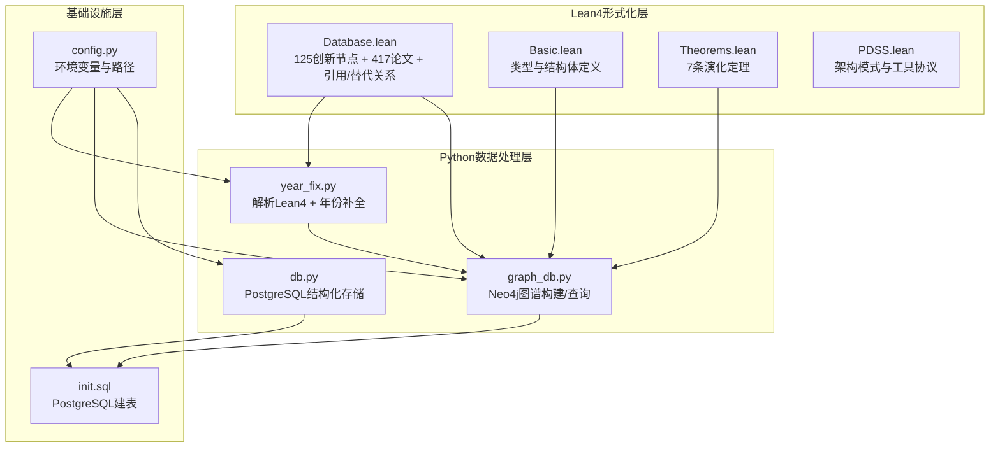
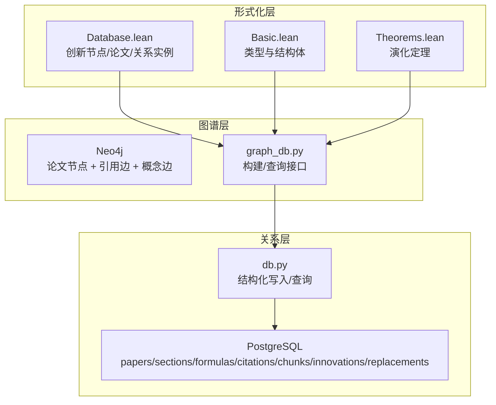
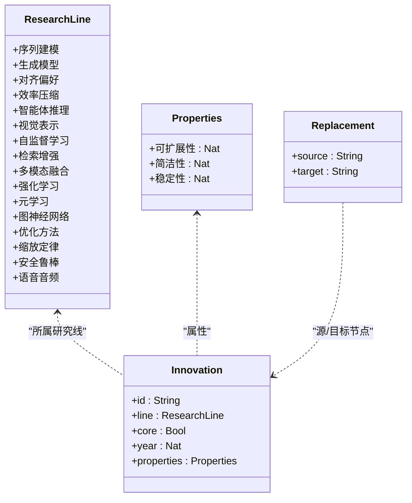
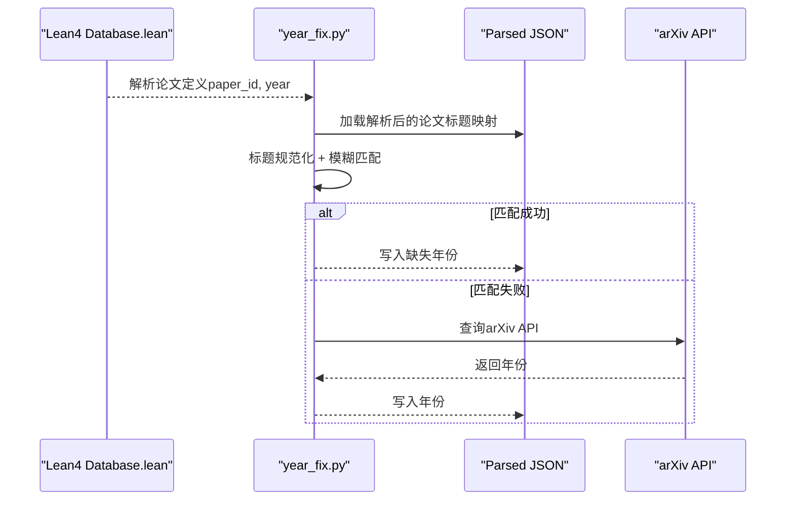
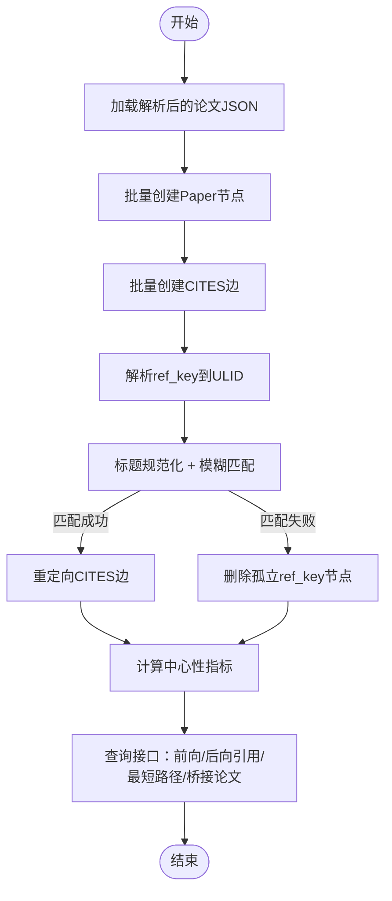
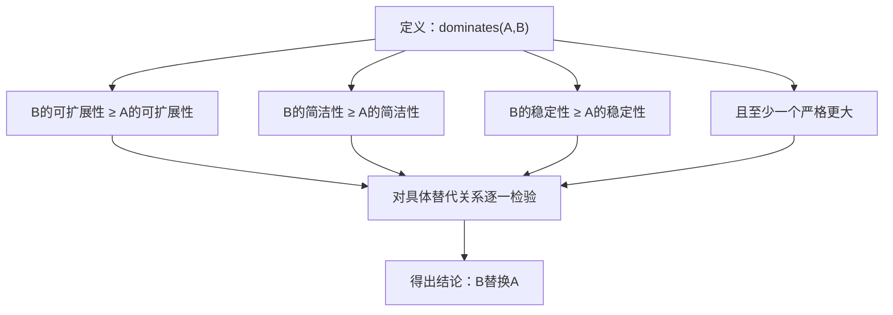
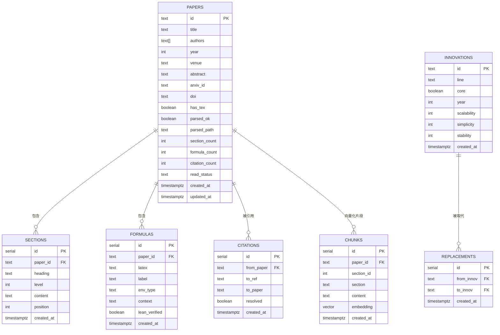
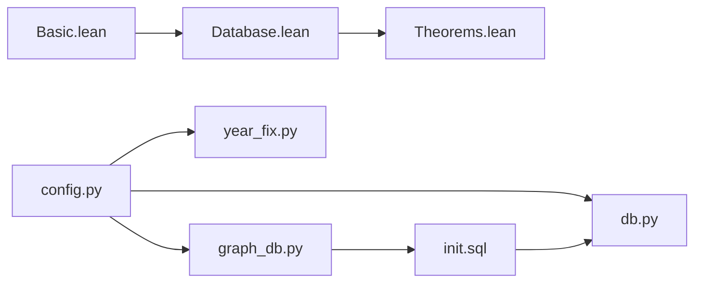

# 数据库定义

<cite>
**本文档引用的文件**
- [LEAN/AiEvolution/Database.lean](file://LEAN/AiEvolution/Database.lean)
- [LEAN/AiEvolution/Basic.lean](file://LEAN/AiEvolution/Basic.lean)
- [LEAN/AiEvolution/Theorems.lean](file://LEAN/AiEvolution/Theorems.lean)
- [LEAN/AiEvolution/PDSS.lean](file://LEAN/AiEvolution/PDSS.lean)
- [scholar/year_fix.py](file://scholar/year_fix.py)
- [scholar/graph_db.py](file://scholar/graph_db.py)
- [scholar/db.py](file://scholar/db.py)
- [infra/init.sql](file://infra/init.sql)
- [scholar/config.py](file://scholar/config.py)
- [README.md](file://README.md)
</cite>

## 目录
1. [简介](#简介)
2. [项目结构](#项目结构)
3. [核心组件](#核心组件)
4. [架构总览](#架构总览)
5. [详细组件分析](#详细组件分析)
6. [依赖关系分析](#依赖关系分析)
7. [性能考虑](#性能考虑)
8. [故障排除指南](#故障排除指南)
9. [结论](#结论)
10. [附录](#附录)

## 简介
本文件面向Lean4形式化系统的数据库定义模块，系统性梳理125个创新节点与417篇论文的完整数据集，阐释引用关系网络与替代关系的数学定义与证明方法，并给出数据导入、查询与验证的具体实现路径与性能优化建议。文档同时结合Neo4j概念图谱与PostgreSQL结构化存储，形成“形式化层 + 图谱层 + 关系层”的三位一体数据体系。

## 项目结构
- Lean4形式化层：定义研究线、创新节点、论文、引用与替代关系的类型与实例，提供7条可形式化证明的演化定理。
- Python数据处理层：负责从Lean4数据库解析数据、补全缺失年份、构建Neo4j引用网络与概念图谱、同步至PostgreSQL。
- 基础设施层：PostgreSQL建表脚本与Neo4j容器编排，支撑大规模论文与关系数据的持久化与查询。

**图表来源**
- [LEAN/AiEvolution/Database.lean](file://LEAN/AiEvolution/Database.lean)
- [LEAN/AiEvolution/Basic.lean](file://LEAN/AiEvolution/Basic.lean)
- [LEAN/AiEvolution/Theorems.lean](file://LEAN/AiEvolution/Theorems.lean)
- [LEAN/AiEvolution/PDSS.lean](file://LEAN/AiEvolution/PDSS.lean)
- [scholar/year_fix.py](file://scholar/year_fix.py)
- [scholar/graph_db.py](file://scholar/graph_db.py)
- [scholar/db.py](file://scholar/db.py)
- [infra/init.sql](file://infra/init.sql)
- [scholar/config.py](file://scholar/config.py)

**章节来源**
- [README.md](file://README.md)
- [infra/init.sql](file://infra/init.sql)

## 核心组件
- 创新节点（125个）：按16个研究线分组，包含ID、所属研究线、核心属性、发表年份及可量化属性（可扩展性、简洁性、稳定性）。
- 论文记录（417篇）：包含人类可读ID、发表年份等元数据；通过year_fix.py与Lean4数据库交叉引用进行年份补全。
- 引用关系网络：基于Neo4j的CITES边，支持前向/后向引用查询与桥接论文识别。
- 替代关系（Replacement）：形式化定义“旧创新被新创新取代”，并在Theorems.lean中对若干关系给出严格证明。
- 结构化存储：PostgreSQL表结构涵盖papers、sections、formulas、citations、chunks、innovations、replacements等。

**章节来源**
- [LEAN/AiEvolution/Database.lean](file://LEAN/AiEvolution/Database.lean)
- [LEAN/AiEvolution/Basic.lean](file://LEAN/AiEvolution/Basic.lean)
- [scholar/year_fix.py](file://scholar/year_fix.py)
- [scholar/graph_db.py](file://scholar/graph_db.py)
- [scholar/db.py](file://scholar/db.py)
- [infra/init.sql](file://infra/init.sql)

## 架构总览
系统采用“形式化层 + 图谱层 + 关系层”的三层架构：
- 形式化层：Lean4模块定义数据与关系，提供可验证的演化定理。
- 图谱层：Neo4j承载论文引用网络与概念图谱，支持复杂关系查询与可视化。
- 关系层：PostgreSQL承载结构化元数据与向量化片段，支持全文检索与RAG。

**图表来源**
- [LEAN/AiEvolution/Database.lean](file://LEAN/AiEvolution/Database.lean)
- [LEAN/AiEvolution/Basic.lean](file://LEAN/AiEvolution/Basic.lean)
- [LEAN/AiEvolution/Theorems.lean](file://LEAN/AiEvolution/Theorems.lean)
- [scholar/graph_db.py](file://scholar/graph_db.py)
- [scholar/db.py](file://scholar/db.py)
- [infra/init.sql](file://infra/init.sql)

## 详细组件分析

### 创新节点数据模型与演化关系
- 数据模型：每个创新节点包含ID、所属研究线、核心标志、发表年份与三轴属性（可扩展性、简洁性、稳定性）。这些字段直接映射到Lean4结构体定义。
- 演化关系：替代关系（Replacement）明确标注“旧创新”被“新创新”取代，例如Transformer替换RNN、DPO替换PPO、Diffusion替换GAN等。这些关系在Database.lean中以列表形式给出，并在Theorems.lean中对若干关系给出严格证明（dominates关系）。

**图表来源**
- [LEAN/AiEvolution/Basic.lean](file://LEAN/AiEvolution/Basic.lean)
- [LEAN/AiEvolution/Database.lean](file://LEAN/AiEvolution/Database.lean)

**章节来源**
- [LEAN/AiEvolution/Basic.lean](file://LEAN/AiEvolution/Basic.lean)
- [LEAN/AiEvolution/Database.lean](file://LEAN/AiEvolution/Database.lean)
- [LEAN/AiEvolution/Theorems.lean](file://LEAN/AiEvolution/Theorems.lean)

### 论文记录与年份补全
- 论文记录：每篇论文包含人类可读ID与发表年份等元数据。year_fix.py负责从Lean4 Database.lean解析论文定义，建立paper_id→year映射，并通过标题规范化与模糊匹配将Lean4论文ID与解析后的ULID进行关联。
- 年份补全策略：优先通过Lean4数据库匹配；若未命中，则尝试从arXiv API获取；最后回退到内容启发式规则（如文中出现的年份）。

**图表来源**
- [scholar/year_fix.py](file://scholar/year_fix.py)
- [LEAN/AiEvolution/Database.lean](file://LEAN/AiEvolution/Database.lean)

**章节来源**
- [scholar/year_fix.py](file://scholar/year_fix.py)
- [scholar/config.py](file://scholar/config.py)

### 引用关系网络构建与查询
- Neo4j图谱：论文节点（Paper）与引用边（CITES）构成引用网络；graph_db.py负责批量创建节点与边，并提供中心性计算、最短路径查找、桥接论文识别等查询能力。
- 边解析与修正：原始引用键（ref_key）可能指向非ULID节点，graph_db.py通过标题规范化与模糊匹配将其重定向到正确的Paper节点，并删除孤立节点。
- 查询接口：支持前向引用（被引用）、后向引用（引用他人）、最短引用路径、桥接论文（in/out度乘积/和）等。

**图表来源**
- [scholar/graph_db.py](file://scholar/graph_db.py)

**章节来源**
- [scholar/graph_db.py](file://scholar/graph_db.py)

### 替代关系的数学定义与证明方法
- 数学定义：替代关系（Replacement）是一个二元关系(source, target)，表示“旧创新source被新创新target取代”。该定义在Basic.lean中给出。
- 证明方法：Theorems.lean对若干替代关系给出严格证明，核心思想是“dominates”关系：若新创新在至少两个维度上不劣于旧创新，且在至少一个维度上严格更优，则认为新创新“主导”旧创新。例如：
  - Transformer主导RNN（在可扩展性和稳定性上更优）
  - DPO主导PPO（在三个维度上均更优）
  - Diffusion主导GAN（在三个维度上均更优）

**图表来源**
- [LEAN/AiEvolution/Theorems.lean](file://LEAN/AiEvolution/Theorems.lean)
- [LEAN/AiEvolution/Basic.lean](file://LEAN/AiEvolution/Basic.lean)

**章节来源**
- [LEAN/AiEvolution/Theorems.lean](file://LEAN/AiEvolution/Theorems.lean)
- [LEAN/AiEvolution/Basic.lean](file://LEAN/AiEvolution/Basic.lean)

### 结构化存储与数据导入
- PostgreSQL表结构：init.sql定义了papers、sections、formulas、citations、chunks、innovations、replacements等表，支持全文检索、向量化检索与关系存储。
- 导入流程：db.py提供upsert_paper、upsert_sections、upsert_formulas、upsert_citations等接口，支持增量写入与冲突处理；同时提供查询接口（按年份、关键词搜索、统计汇总）。
- Lean4同步：graph_db.py动态从Database.lean加载创新节点与替代关系，写入Neo4j；db.py可同步至PostgreSQL的innovations与replacements表。

**图表来源**
- [infra/init.sql](file://infra/init.sql)

**章节来源**
- [infra/init.sql](file://infra/init.sql)
- [scholar/db.py](file://scholar/db.py)
- [scholar/graph_db.py](file://scholar/graph_db.py)

## 依赖关系分析
- Lean4模块间依赖：Basic.lean提供基础类型，Database.lean使用Basic定义的类型并填充实例，Theorems.lean依赖Database中的实例进行定理证明。
- Python层依赖：year_fix.py依赖config.py中的路径与环境变量；graph_db.py依赖Neo4j驱动与config；db.py依赖psycopg2与config。
- 基础设施依赖：init.sql定义的表结构决定Python层的写入schema；Neo4j与PostgreSQL的可用性影响功能可用性。

**图表来源**
- [LEAN/AiEvolution/Basic.lean](file://LEAN/AiEvolution/Basic.lean)
- [LEAN/AiEvolution/Database.lean](file://LEAN/AiEvolution/Database.lean)
- [LEAN/AiEvolution/Theorems.lean](file://LEAN/AiEvolution/Theorems.lean)
- [scholar/config.py](file://scholar/config.py)
- [scholar/year_fix.py](file://scholar/year_fix.py)
- [scholar/graph_db.py](file://scholar/graph_db.py)
- [scholar/db.py](file://scholar/db.py)
- [infra/init.sql](file://infra/init.sql)

**章节来源**
- [LEAN/AiEvolution/Basic.lean](file://LEAN/AiEvolution/Basic.lean)
- [LEAN/AiEvolution/Database.lean](file://LEAN/AiEvolution/Database.lean)
- [LEAN/AiEvolution/Theorems.lean](file://LEAN/AiEvolution/Theorems.lean)
- [scholar/config.py](file://scholar/config.py)
- [scholar/year_fix.py](file://scholar/year_fix.py)
- [scholar/graph_db.py](file://scholar/graph_db.py)
- [scholar/db.py](file://scholar/db.py)
- [infra/init.sql](file://infra/init.sql)

## 性能考虑
- Neo4j查询优化：合理使用索引（Paper节点的ulid/title/year/venue等）与限制返回数量；对频繁查询（如引用统计、桥接论文）可预计算并持久化到节点属性。
- PostgreSQL写入优化：批量插入（UNWIND + MERGE）减少往返；对高频更新字段（如year、venue、formula_count、citation_count）建立索引。
- 年份补全策略：优先使用Lean4数据库匹配，减少arXiv API调用；对未命中的论文采用启发式规则，避免过度请求导致限流。
- 向量化检索：RAG索引构建耗时较长，建议按批次增量构建；在无API Key时回退全文搜索，保证基本可用性。

[本节为通用指导，无需特定文件引用]

## 故障排除指南
- Neo4j连接失败：检查URI、用户名/密码与端口映射；确认容器健康状态。
- PostgreSQL连接失败：确认端口5433、数据库名、用户与密码；检查init.sql是否成功执行。
- 年份补全无效：检查Lean4 Database.lean是否存在；确认parsed目录下的JSON是否正确解析；必要时手动指定dry-run参数查看统计。
- arXiv API限流：调整重试次数与退避策略；控制查询频率；必要时提供有效API Key。

**章节来源**
- [scholar/config.py](file://scholar/config.py)
- [scholar/year_fix.py](file://scholar/year_fix.py)
- [scholar/graph_db.py](file://scholar/graph_db.py)
- [scholar/db.py](file://scholar/db.py)
- [infra/init.sql](file://infra/init.sql)

## 结论
本数据库定义模块以Lean4形式化为核心，结合Neo4j图谱与PostgreSQL关系存储，实现了对125个创新节点与417篇论文的系统化建模。通过替代关系的数学定义与定理证明，量化刻画了AI技术的演化路径；通过引用网络与概念图谱，提供了跨论文的知识关联与时间演进视图；通过结构化存储与Python工具链，保障了数据导入、查询与验证的工程化落地。

[本节为总结性内容，无需特定文件引用]

## 附录

### 数据导入与验证操作示例
- 导入Lean4创新节点与替代关系：通过graph_db.py动态解析Database.lean并写入Neo4j；同时写入PostgreSQL的innovations与replacements表。
- 补全论文年份：运行year_fix.py的complete_years函数，优先匹配Lean4数据库，其次调用arXiv API，最后采用内容启发式规则。
- 查询引用网络：使用graph_db.py提供的查询接口，如获取前向/后向引用、最短引用路径、桥接论文等。
- 结构化查询：使用db.py提供的查询接口，如按年份/关键词搜索、统计汇总等。

**章节来源**
- [scholar/graph_db.py](file://scholar/graph_db.py)
- [scholar/year_fix.py](file://scholar/year_fix.py)
- [scholar/db.py](file://scholar/db.py)