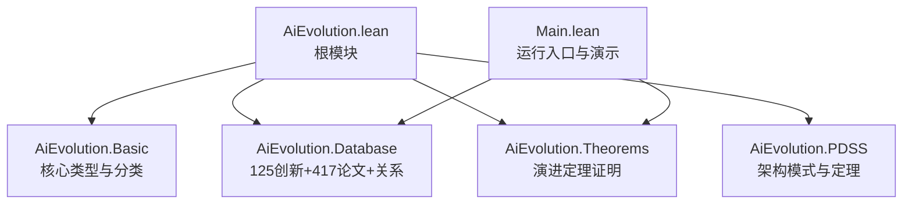
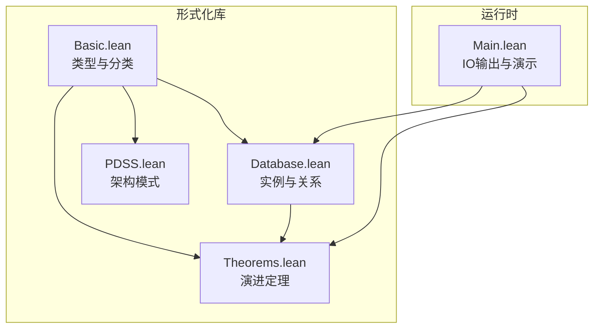
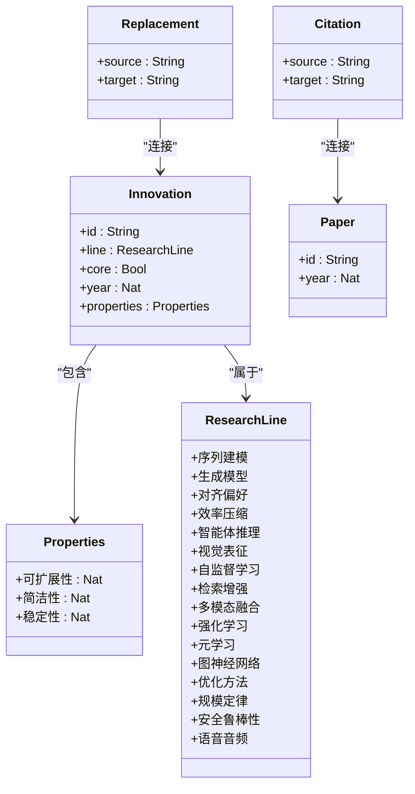
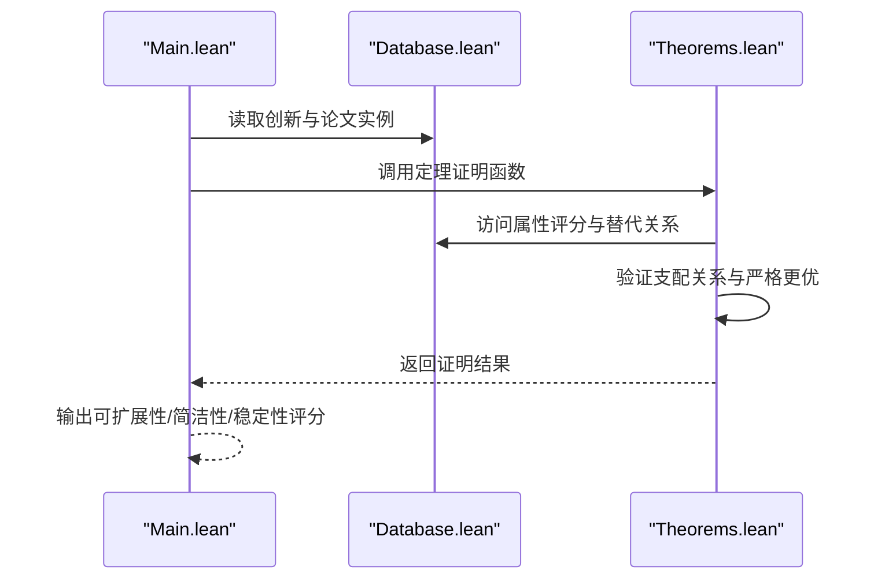
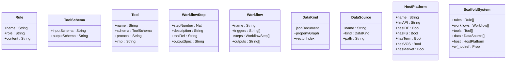
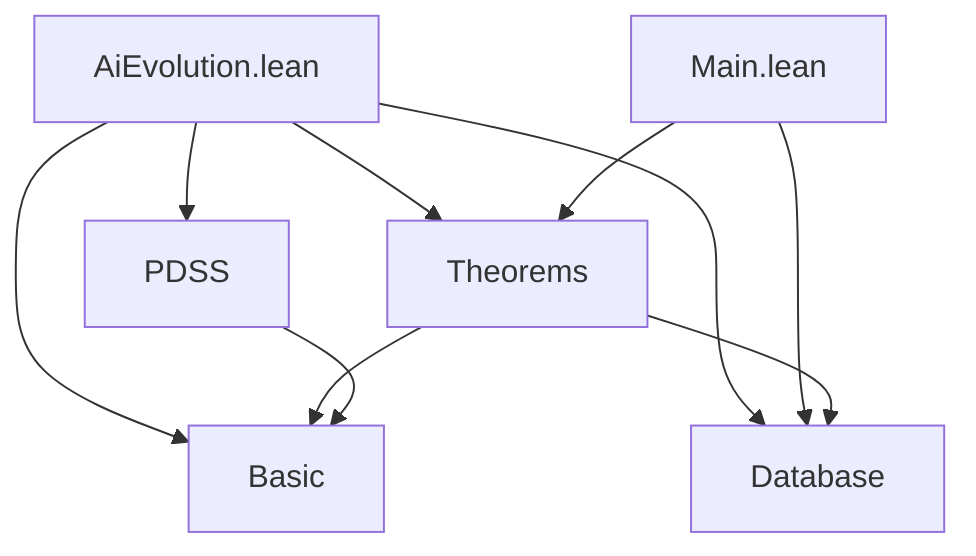

# 核心数据结构

<cite>
**本文档引用的文件**
- [AiEvolution.lean](file://LEAN/AiEvolution.lean)
- [Main.lean](file://LEAN/Main.lean)
- [Basic.lean](file://LEAN/AiEvolution/Basic.lean)
- [Database.lean](file://LEAN/AiEvolution/Database.lean)
- [Theorems.lean](file://LEAN/AiEvolution/Theorems.lean)
- [PDSS.lean](file://LEAN/AiEvolution/PDSS.lean)
- [README.md](file://LEAN/README.md)
- [graph_db.py](file://scholar/graph_db.py)
- [quality.py](file://scholar/quality.py)
</cite>

## 目录
1. [引言](#引言)
2. [项目结构](#项目结构)
3. [核心组件](#核心组件)
4. [架构总览](#架构总览)
5. [详细组件分析](#详细组件分析)
6. [依赖分析](#依赖分析)
7. [性能考虑](#性能考虑)
8. [故障排除指南](#故障排除指南)
9. [结论](#结论)
10. [附录](#附录)

## 引言
本文件面向Lean4形式化系统的核数据结构，聚焦于AI演进分析的类型系统与定理证明。内容涵盖：
- ResearchLine研究线分类体系的16个类别及其理论基础
- Properties属性量化结构的三个维度（可扩展性、简洁性、稳定性）的定义与评分标准
- Innovation创新节点、Paper论文记录、Citation引用关系、Replacement替代关系等核心数据类型的结构定义、字段含义与使用场景
- 基于形式化证明的演进定理与PDSS架构模式的形式化定义

通过主程序与数据库模块的协同，系统实现了对125个创新节点与417篇论文的结构化建模，并以定理形式严格验证“替代关系”在至少两个维度上的优势。

## 项目结构
该Lean库采用分层模块组织：
- 根模块导入各子模块，统一对外暴露
- Basic定义核心数据类型与分类体系
- Database提供具体实例与关系集合
- Theorems基于Database实例进行形式化证明
- PDSS定义“寄生式领域专用脚手架”架构的五元组与性质

**图表来源**
- [AiEvolution.lean:1-8](file://LEAN/AiEvolution.lean#L1-L8)
- [Main.lean:1-21](file://LEAN/Main.lean#L1-L21)

**章节来源**
- [AiEvolution.lean:1-8](file://LEAN/AiEvolution.lean#L1-L8)
- [README.md:1-1](file://LEAN/README.md#L1-L1)

## 核心组件
本节从类型系统角度解析核心数据结构与分类体系。

- ResearchLine：16类研究线的归纳类型，覆盖序列建模、生成模型、对齐偏好、效率压缩、智能体推理、视觉表征、自监督学习、检索增强、多模态融合、强化学习、元学习、图神经网络、优化方法、规模定律、安全鲁棒性、语音音频等方向。
- Properties：量化创新的三个维度，均为1-5分的自然数，分别衡量可扩展性、简洁性与稳定性。
- Innovation：创新节点，包含唯一标识、所属研究线、是否核心、年份以及属性评分。
- Paper：论文记录，包含人类可读ID与发表年份。
- Citation：论文间的引用关系，源论文ID指向目标论文ID。
- Replacement：创新节点间的替代关系，表示旧创新被新创新所取代。

上述结构均实现可打印与可判定相等，便于形式化处理与比较。

**章节来源**
- [Basic.lean:10-64](file://LEAN/AiEvolution/Basic.lean#L10-L64)

## 架构总览
下图展示了从主程序到数据库与定理模块的数据流与依赖关系：

**图表来源**
- [Main.lean:1-21](file://LEAN/Main.lean#L1-L21)
- [Database.lean:1-756](file://LEAN/AiEvolution/Database.lean#L1-L756)
- [Theorems.lean:1-130](file://LEAN/AiEvolution/Theorems.lean#L1-L130)
- [PDSS.lean:1-239](file://LEAN/AiEvolution/PDSS.lean#L1-L239)

## 详细组件分析

### 研究线分类体系（ResearchLine）
- 分类维度与代表性演进路径
  - 序列建模：RNN → LSTM → Transformer → Mamba
  - 生成模型：GAN → VAE → Diffusion → Flow Matching
  - 对齐偏好：PPO → DPO → 宪法级AI
  - 效率压缩：Pruning → Quantization → Distillation → LoRA → MoE
  - 智能体推理：ReAct → CoT → 工具使用 → 多智能体
  - 视觉表征：CNN → ViT → CLIP → DINO
  - 自监督学习：Word2Vec → BERT → GPT → MAE
  - 检索增强：BM25 → DPR → RAG
  - 多模态融合：CLIP → Flamingo → GPT-4V
  - 强化学习：DQN → PPO → SAC
  - 元学习：MAML → 原型网络
  - 图神经网络：GCN → GAT → GraphSAGE
  - 优化方法：SGD → Adam → LAMB
  - 规模定律：Kaplan → Chinchilla
  - 安全鲁棒性：对抗训练 → RLHF → 红队
  - 语音音频：WaveNet → Whisper

- 理论基础
  - 每一类代表一个技术范式的演进轨迹，体现从参数化到结构化、从显式到隐式、从确定性到概率性的趋势。
  - 替代关系通常发生在同一范式内或跨范式的范式迁移（如从GAN到扩散模型）。

**章节来源**
- [Basic.lean:11-28](file://LEAN/AiEvolution/Basic.lean#L11-L28)

### 属性量化结构（Properties）
- 维度定义
  - 可扩展性（scalability）：1-5分，衡量方法随计算/数据规模增长的表现
  - 简洁性（simplicity）：1-5分，数值越低表示越复杂
  - 稳定性（stability）：1-5分，衡量方法的可靠性与鲁棒性
- 评分标准
  - 1分：较差；2分：偏低；3分：中等；4分：偏高；5分：优秀
  - 评分用于比较不同创新在同一维度上的相对优劣，支撑“支配关系”的判定

**章节来源**
- [Basic.lean:31-35](file://LEAN/AiEvolution/Basic.lean#L31-L35)

### 创新节点（Innovation）
- 字段说明
  - id：字符串标识符
  - line：所属研究线
  - core：布尔值，标记是否为核心/基础性创新
  - year：首次提出年份
  - properties：属性评分（可扩展性、简洁性、稳定性）
- 使用场景
  - 构建AI演进图谱，标注范式转折点与技术跃迁
  - 支持按研究线聚合统计与时间序列分析

**章节来源**
- [Basic.lean:38-44](file://LEAN/AiEvolution/Basic.lean#L38-L44)

### 论文记录（Paper）
- 字段说明
  - id：人类可读ID（例如“Attention_Is_All_You_Need”）
  - year：发表年份
- 使用场景
  - 作为知识库条目，与创新节点建立语义关联
  - 与引用关系结合，构建学术影响网络

**章节来源**
- [Basic.lean:47-50](file://LEAN/AiEvolution/Basic.lean#L47-L50)

### 引用关系（Citation）
- 字段说明
  - source：引用方论文ID
  - target：被引用方论文ID
- 使用场景
  - 形成论文引用网络，识别关键奠基工作与影响力传播路径

**章节来源**
- [Basic.lean:53-56](file://LEAN/AiEvolution/Basic.lean#L53-L56)

### 替代关系（Replacement）
- 字段说明
  - source：旧创新ID
  - target：新创新ID
- 使用场景
  - 表达范式替换或技术迭代，支持形式化定理的验证

**章节来源**
- [Basic.lean:59-62](file://LEAN/AiEvolution/Basic.lean#L59-L62)

### 数据库模块（Database）
- 创新节点实例
  - 覆盖16类研究线，共计125个创新节点，包含核心与非核心节点
  - 每个节点附带年份与属性评分
- 论文实例
  - 417篇论文记录，用于知识库链接与引用分析
- 引用关系
  - 关键论文之间的引用列表，反映学术传承
- 替代关系
  - 明确的替代证据，用于定理证明

**图表来源**
- [Basic.lean:11-62](file://LEAN/AiEvolution/Basic.lean#L11-L62)
- [Database.lean:18-753](file://LEAN/AiEvolution/Database.lean#L18-L753)

**章节来源**
- [Database.lean:18-753](file://LEAN/AiEvolution/Database.lean#L18-L753)

### 演进定理（Theorems）
- 定理目标
  - 验证“替代关系”在至少两个维度上成立，即新创新在可扩展性、简洁性、稳定性三者中至少两项优于旧创新
- 关键概念
  - 支配关系（dominates）：在所有维度不低于且至少一项严格更优
  - 严格更优（scalesBetter/simpler/moreStable）
- 代表性定理
  - Transformer替代RNN：在可扩展性与稳定性上显著提升
  - DPO替代PPO：在所有三个维度上全面超越
  - 扩散模型替代GAN：在所有三个维度上全面超越
  - ViT替代CNN：在可扩展性上显著提升
  - LoRA替代Pruning：在所有三个维度上全面超越
  - AdamW替代Adam：在稳定性上显著提升
  - LSTM在可扩展性上优于RNN

**图表来源**
- [Main.lean:6-20](file://LEAN/Main.lean#L6-L20)
- [Theorems.lean:23-128](file://LEAN/AiEvolution/Theorems.lean#L23-L128)
- [Database.lean:18-753](file://LEAN/AiEvolution/Database.lean#L18-L753)

**章节来源**
- [Theorems.lean:23-128](file://LEAN/AiEvolution/Theorems.lean#L23-L128)

### PDSS架构模式（PDSS）
- 五元组系统S=(R,W,T,D,H)
  - R：规则（Rule），Markdown文档注入领域知识
  - W：工作流（Workflow），结构化的多步执行过程
  - T：工具（Tool），标准化协议（如MCP/CLI）的接口与实现
  - D：数据源（DataSource），结构化文档、属性图、向量索引
  - H：宿主平台（HostPlatform），提供LLM、IDE、文件系统、终端等基础设施
- 寄生约束
  - 不包含训练模型、独立UI与独立计算资源，所有智能操作委托给宿主LLM
- 可组合性与最小主义
  - 通过协议兼容实现系统间可组合
  - 最小主义原则要求工具占比低于一半，强调声明式规则与工作流

**图表来源**
- [PDSS.lean:23-104](file://LEAN/AiEvolution/PDSS.lean#L23-L104)

**章节来源**
- [PDSS.lean:16-104](file://LEAN/AiEvolution/PDSS.lean#L16-L104)

## 依赖分析
- 模块依赖
  - Root模块统一导入Basic、Database、Theorems、PDSS
  - Main依赖Database与Theorems进行演示与验证
  - Theorems依赖Basic与Database进行属性访问与定理构造
  - PDSS依赖Basic进行类型复用
- 数据依赖
  - Database提供125创新与417论文的权威实例
  - 引用与替代关系作为定理证明的输入
- 运行时依赖
  - 主程序通过IO展示属性评分与定理编译状态

**图表来源**
- [AiEvolution.lean:3-6](file://LEAN/AiEvolution.lean#L3-L6)
- [Main.lean:1-5](file://LEAN/Main.lean#L1-L5)
- [Theorems.lean:10-11](file://LEAN/AiEvolution/Theorems.lean#L10-L11)
- [PDSS.lean:12](file://LEAN/AiEvolution/PDSS.lean#L12)

**章节来源**
- [AiEvolution.lean:3-6](file://LEAN/AiEvolution.lean#L3-L6)
- [Main.lean:1-5](file://LEAN/Main.lean#L1-L5)
- [Theorems.lean:10-11](file://LEAN/AiEvolution/Theorems.lean#L10-L11)
- [PDSS.lean:12](file://LEAN/AiEvolution/PDSS.lean#L12)

## 性能考虑
- 形式化验证开销
  - 定理证明在编译阶段完成，确保无“遗憾”（no sorry），避免运行时不确定性
- 数据规模与查询
  - 125创新+417论文的规模较小，适合交互式分析与可视化
- 可组合性与最小主义
  - 通过声明式规则与工作流减少工具数量，降低维护成本与部署复杂度

## 故障排除指南
- 编译失败（定理未完成）
  - 确认Database中对应创新的属性评分与替代关系正确
  - 检查Theorems中dominates与严格更优的判定逻辑
- 运行时输出异常
  - 检查Main中对Database属性的访问路径与字段名
- Python侧数据集成问题
  - 若Lean数据库不可用，graph_db.py提供回退种子创新集
  - quality.py提供论文质量评分维度，辅助筛选高质量论文

**章节来源**
- [Main.lean:6-20](file://LEAN/Main.lean#L6-L20)
- [graph_db.py:408-484](file://scholar/graph_db.py#L408-L484)
- [quality.py:306-329](file://scholar/quality.py#L306-L329)

## 结论
本核数据结构以Lean形式化语言精确刻画了AI演进的关键要素：研究线分类、属性量化、创新与论文记录、引用与替代关系。通过Database模块提供权威实例，Theorems模块以严格证明验证范式替代的合理性，PDSS模块则从架构层面提出“寄生式脚手架”的最小主义设计原则。整体方案既满足学术分析需求，又具备形式化验证的严谨性与可扩展性。

## 附录
- 实际应用案例
  - 在主程序中直接调用Database中定义的创新与论文，输出属性评分与定理验证状态
  - 基于Citation与Replacement关系，构建学术影响网络与技术替代图谱
  - 将PDSS五元组映射到实际工具链，评估系统最小主义与可组合性

**章节来源**
- [Main.lean:6-20](file://LEAN/Main.lean#L6-L20)
- [Database.lean:621-753](file://LEAN/AiEvolution/Database.lean#L621-L753)
- [PDSS.lean:95-107](file://LEAN/AiEvolution/PDSS.lean#L95-L107)