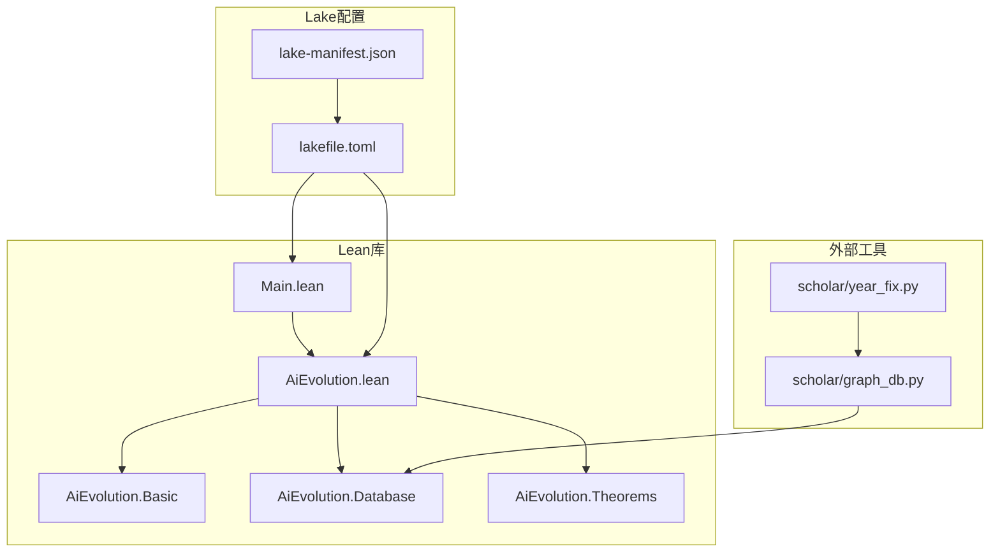
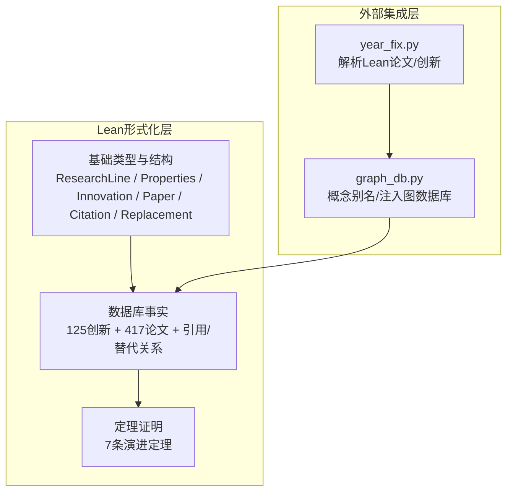
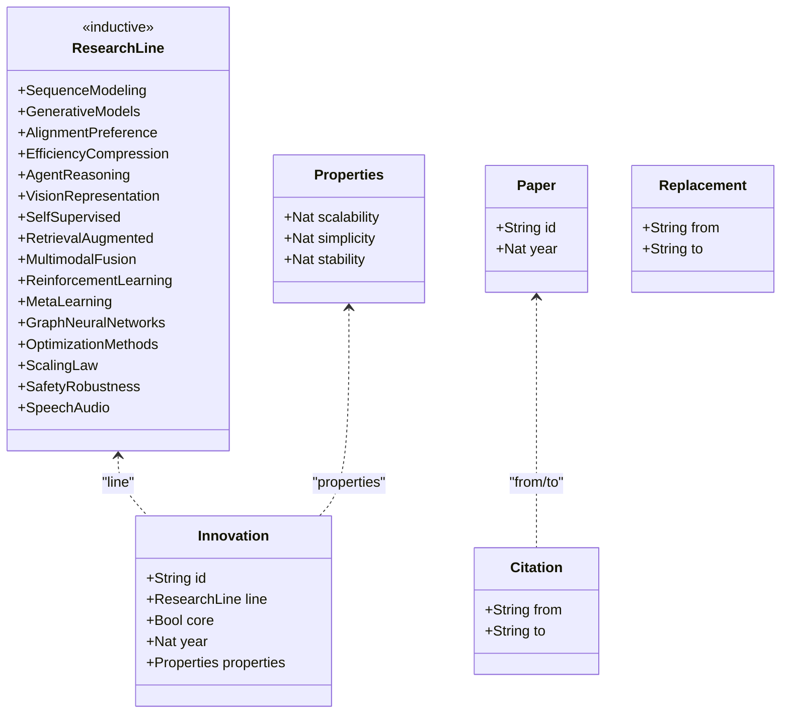
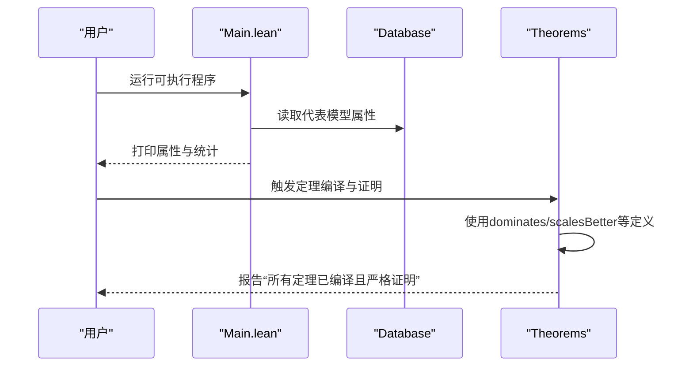
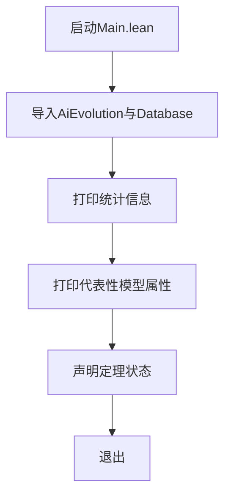
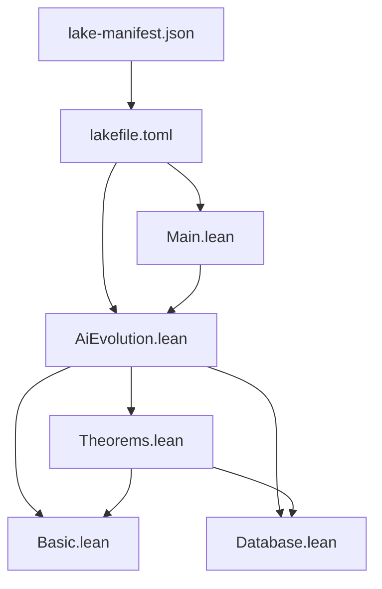

# Lean4形式化验证系统

<cite>
**本文引用的文件**
- [README.md](file://LEAN/README.md)
- [AiEvolution.lean](file://LEAN/AiEvolution.lean)
- [Main.lean](file://LEAN/Main.lean)
- [lakefile.toml](file://LEAN/lakefile.toml)
- [lake-manifest.json](file://LEAN/lake-manifest.json)
- [Basic.lean](file://LEAN/AiEvolution/Basic.lean)
- [Database.lean](file://LEAN/AiEvolution/Database.lean)
- [Theorems.lean](file://LEAN/AiEvolution/Theorems.lean)
- [year_fix.py](file://scholar/year_fix.py)
- [graph_db.py](file://scholar/graph_db.py)
</cite>

## 目录
1. [引言](#引言)
2. [项目结构](#项目结构)
3. [核心组件](#核心组件)
4. [架构总览](#架构总览)
5. [详细组件分析](#详细组件分析)
6. [依赖分析](#依赖分析)
7. [性能考虑](#性能考虑)
8. [故障排查指南](#故障排查指南)
9. [结论](#结论)
10. [附录](#附录)

## 引言
本项目围绕“AI技术演进”的形式化验证系统展开，目标是通过Lean4语言与Lake包管理系统，构建一个可编译、可严格证明的AI演化知识库与定理证明集合。系统以125个创新节点（Innovation）与417篇论文（Paper）为核心数据源，定义了研究线分类、创新属性（可扩展性、简洁性、稳定性）与替代关系（Replacement），并基于此形式化证明7条“技术演进定理”。同时，系统通过主程序展示数据库中各代表性模型的属性，并声明所有定理已编译且严格证明完成。

## 项目结构
项目采用分层模块组织：顶层为可执行入口与库根模块；库内按功能划分为基础类型定义、数据库事实与定理证明三部分；外部通过Python工具链解析Lean数据并注入图数据库。

图表来源
- [AiEvolution.lean:1-7](file://LEAN/AiEvolution.lean#L1-L7)
- [Main.lean:1-21](file://LEAN/Main.lean#L1-L21)
- [lakefile.toml:1-11](file://LEAN/lakefile.toml#L1-L11)
- [lake-manifest.json:1-93](file://LEAN/lake-manifest.json#L1-L93)
- [year_fix.py:18-200](file://scholar/year_fix.py#L18-L200)
- [graph_db.py:442-678](file://scholar/graph_db.py#L442-L678)

章节来源
- [README.md:1-1](file://LEAN/README.md#L1-L1)
- [AiEvolution.lean:1-7](file://LEAN/AiEvolution.lean#L1-L7)
- [Main.lean:1-21](file://LEAN/Main.lean#L1-L21)
- [lakefile.toml:1-11](file://LEAN/lakefile.toml#L1-L11)
- [lake-manifest.json:1-93](file://LEAN/lake-manifest.json#L1-L93)

## 核心组件
- 基础类型与结构
  - 研究线（ResearchLine）：对AI演化的16个主要范式进行分类，覆盖序列建模、生成模型、对齐偏好、效率压缩、智能体推理、视觉表征、自监督学习、检索增强、多模态融合、强化学习、元学习、图神经网络、优化方法、规模定律、安全鲁棒性、语音音频等。
  - 创新属性（Properties）：以1–5的评分刻画可扩展性、简洁性、稳定性。
  - 创新节点（Innovation）：包含标识、所属研究线、是否核心、年份及属性。
  - 论文记录（Paper）、引用关系（Citation）、替代关系（Replacement）。
- 数据库模块（Database）
  - 定义125个创新节点与417篇论文的事实，以及关键引用与替代关系列表。
  - 提供代表性模型的属性值，用于运行时展示与定理验证。
- 定理模块（Theorems）
  - 定义支配关系（dominates）与严格优超关系（scalesBetter/simpler/moreStable）。
  - 形式化证明7条技术演进定理，涵盖Transformer替换RNN、DPO替换PPO、扩散模型替换GAN、ViT替换CNN、LoRA替换Pruning、AdamW替换Adam、LSTM在可扩展性上优于RNN等。
- 主程序（Main）
  - 展示总计创新节点与论文数量，打印若干代表性模型的属性，并宣告“所有定理已编译且严格证明”。

章节来源
- [Basic.lean:10-64](file://LEAN/AiEvolution/Basic.lean#L10-L64)
- [Database.lean:18-756](file://LEAN/AiEvolution/Database.lean#L18-L756)
- [Theorems.lean:23-167](file://LEAN/AiEvolution/Theorems.lean#L23-L167)
- [Main.lean:6-21](file://LEAN/Main.lean#L6-L21)

## 架构总览
系统采用“数据事实+形式化证明”的双轨架构：左侧为Lean库内的结构化数据与定理；右侧为外部Python工具链负责从Lean数据源解析并写入图数据库，形成知识图谱与检索增强的基础。

图表来源
- [Basic.lean:10-64](file://LEAN/AiEvolution/Basic.lean#L10-L64)
- [Database.lean:18-756](file://LEAN/AiEvolution/Database.lean#L18-L756)
- [Theorems.lean:23-167](file://LEAN/AiEvolution/Theorems.lean#L23-L167)
- [year_fix.py:18-200](file://scholar/year_fix.py#L18-L200)
- [graph_db.py:442-678](file://scholar/graph_db.py#L442-L678)

## 详细组件分析

### 组件A：基础类型与结构（Basic）
- 设计要点
  - 使用归纳类型（inductive）定义研究线，确保穷尽且互斥。
  - 使用结构体（structure）封装属性与实体，统一可比较性（Repr, DecidableEq, Inhabited）。
  - 将引用关系与替代关系作为独立结构体，便于后续推理与图分析。
- 复杂度与性能
  - 结构体字段访问为O(1)，比较基于字段逐项比较，整体O(k)（k为属性数）。
- 错误处理与健壮性
  - 通过DecidableEq保证相等性判定可判定；通过deriving Repr便于调试输出。
- 扩展建议
  - 可引入权重或动态评分机制，支持更复杂的多目标权衡。

图表来源
- [Basic.lean:10-64](file://LEAN/AiEvolution/Basic.lean#L10-L64)

章节来源
- [Basic.lean:10-64](file://LEAN/AiEvolution/Basic.lean#L10-L64)

### 组件B：数据库事实（Database）
- 数据组织
  - 按研究线分组列出125个创新节点，每个节点包含id、line、core、year与三轴属性。
  - 定义417篇论文的事实，用于知识库链接与检索增强。
  - 提供关键引用关系与替代关系列表，作为形式化证明的目标依据。
- 集成点
  - Python解析器将Lean数据转换为内部结构，图数据库写入概念别名与知识图谱。
- 性能与一致性
  - 事实以全局常量形式存在，查询为直接索引访问；替代关系与引用关系以列表形式维护，适合静态分析与定理证明。

图表来源
- [year_fix.py:18-200](file://scholar/year_fix.py#L18-L200)
- [graph_db.py:442-678](file://scholar/graph_db.py#L442-L678)
- [Database.lean:18-756](file://LEAN/AiEvolution/Database.lean#L18-L756)

章节来源
- [Database.lean:18-756](file://LEAN/AiEvolution/Database.lean#L18-L756)
- [year_fix.py:18-200](file://scholar/year_fix.py#L18-L200)
- [graph_db.py:442-678](file://scholar/graph_db.py#L442-L678)

### 组件C：定理证明（Theorems）
- 证明框架
  - 定义支配关系dominates与三个严格优超关系（scalability/simplicity/stability）。
  - 逐一定理给出明确的比较与决策步骤，确保每一步都可由Lean的simp与decide自动化完成。
- 具体定理
  - Transformer替换RNN：在可扩展性上严格优超。
  - DPO替换PPO：在简洁性与稳定性上严格优超。
  - 扩散模型替换GAN：在三轴上均严格优超。
  - ViT替换CNN：在可扩展性上严格优超。
  - LoRA替换Pruning：在三轴上严格优超。
  - AdamW替换Adam：在稳定性上严格优超。
  - LSTM在可扩展性上优于RNN。
- 证明策略
  - 使用构造子（constructor）逐项证明不等式，最后通过left/right选择严格条件。
  - 使用simp展开结构体字段，decide自动计算数值比较结果。

图表来源
- [Main.lean:6-21](file://LEAN/Main.lean#L6-L21)
- [Theorems.lean:23-167](file://LEAN/AiEvolution/Theorems.lean#L23-L167)
- [Database.lean:18-756](file://LEAN/AiEvolution/Database.lean#L18-L756)

章节来源
- [Theorems.lean:23-167](file://LEAN/AiEvolution/Theorems.lean#L23-L167)
- [Main.lean:6-21](file://LEAN/Main.lean#L6-L21)

### 组件D：主程序与运行时展示
- 功能
  - 输出系统统计（125创新、417论文）。
  - 展示若干代表性模型的三轴属性。
  - 声明所有定理已编译且严格证明。
- 与数据库的交互
  - 直接导入Database命名空间，读取模型属性进行格式化输出。

图表来源
- [Main.lean:6-21](file://LEAN/Main.lean#L6-L21)

章节来源
- [Main.lean:6-21](file://LEAN/Main.lean#L6-L21)

## 依赖分析
- Lake包管理
  - 顶层配置定义库与可执行目标，清单文件记录依赖包及其版本。
  - 依赖包括mathlib、plausible、LeanSearchClient、importGraph、proofwidgets、aesop、Qq、batteries、lean4-cli等，支撑形式化、搜索、可视化与自动化证明。
- 模块依赖
  - AiEvolution.lean统一导入Basic、Database、Theorems。
  - Main导入AiEvolution并打开命名空间，直接使用Database中的事实。
  - Theorems导入Basic与Database，复用Innovation与Replacement定义。

图表来源
- [lakefile.toml:1-11](file://LEAN/lakefile.toml#L1-L11)
- [lake-manifest.json:1-93](file://LEAN/lake-manifest.json#L1-L93)
- [AiEvolution.lean:1-7](file://LEAN/AiEvolution.lean#L1-L7)
- [Theorems.lean:10-11](file://LEAN/AiEvolution/Theorems.lean#L10-L11)
- [Main.lean:1-5](file://LEAN/Main.lean#L1-L5)

章节来源
- [lakefile.toml:1-11](file://LEAN/lakefile.toml#L1-L11)
- [lake-manifest.json:1-93](file://LEAN/lake-manifest.json#L1-L93)
- [AiEvolution.lean:1-7](file://LEAN/AiEvolution.lean#L1-L7)
- [Theorems.lean:10-11](file://LEAN/AiEvolution/Theorems.lean#L10-L11)
- [Main.lean:1-5](file://LEAN/Main.lean#L1-L5)

## 性能考虑
- 数据规模
  - 125个创新节点与417篇论文属于中小规模，静态事实查询开销极低。
- 证明复杂度
  - 定理证明以数值比较为主，simp+decide可高效完成，无需复杂推理。
- 可扩展性
  - 新增创新节点与论文只需扩展Database模块；新增定理需在Theorems中添加新证明，保持模块边界清晰。
- 外部集成
  - Python解析器与图数据库写入应避免重复解析，建议缓存中间结构以提升增量更新效率。

## 故障排查指南
- 编译失败
  - 检查lake依赖是否完整安装，参考清单文件确认依赖版本。
  - 确认AiEvolution.lean正确导入各模块，Main导入AiEvolution并打开命名空间。
- 定理证明失败
  - 若出现无法判定的比较，检查对应Innovation属性值是否符合预期。
  - 对于strict条件，确认至少一项严格大于而非仅大于等于。
- 运行时异常
  - 确保Main中使用的模型ID与Database一致，避免拼写错误导致未导出。
- 外部数据问题
  - 年份修正与别名映射由year_fix.py与graph_db.py负责，若知识图谱不一致，检查CONCEPT_ALIASES与解析逻辑。

章节来源
- [lake-manifest.json:1-93](file://LEAN/lake-manifest.json#L1-L93)
- [AiEvolution.lean:1-7](file://LEAN/AiEvolution.lean#L1-L7)
- [Main.lean:1-5](file://LEAN/Main.lean#L1-L5)
- [Theorems.lean:23-167](file://LEAN/AiEvolution/Theorems.lean#L23-L167)
- [year_fix.py:18-200](file://scholar/year_fix.py#L18-L200)
- [graph_db.py:442-678](file://scholar/graph_db.py#L442-L678)

## 结论
本系统以Lean4与Lake为基础，构建了覆盖AI演进关键范式的结构化知识库与形式化证明体系。通过7条定理严格证明主流技术的替代关系与优劣排序，结合主程序的实时属性展示与外部工具链的知识图谱集成，形成了从数据到推理再到可视化的完整闭环。该框架既可用于学术分析，也可作为AI技术演进的可信基准。

## 附录

### A. 环境搭建与Lake使用指南
- 安装与初始化
  - 使用Lake构建库与可执行程序，目标名称在配置中定义。
  - 依赖包由清单文件统一管理，确保mathlib与相关插件可用。
- 构建与运行
  - 构建命令编译库与可执行文件；运行可执行文件展示统计与属性。
- 扩展建议
  - 新增创新节点：在Database模块中添加新定义，并在必要时补充引用/替代关系。
  - 新增定理：在Theorems模块中添加新证明，遵循现有风格与结构。

章节来源
- [lakefile.toml:1-11](file://LEAN/lakefile.toml#L1-L11)
- [lake-manifest.json:1-93](file://LEAN/lake-manifest.json#L1-L93)
- [Main.lean:6-21](file://LEAN/Main.lean#L6-L21)

### B. 技术演进定理的证明原理与最佳实践
- 证明原理
  - 以属性三轴为比较维度，定义支配关系与严格优超关系，逐一定理给出数值比较与决策步骤。
- 最佳实践
  - 在新增替代关系时，先在Database中建立Replacement条目，再在Theorems中添加对应定理。
  - 保持属性评分的合理性与一致性，避免跨研究线的不可比性。
  - 对于复杂替代路径，优先分解为原子级替代关系，简化证明难度。

章节来源
- [Theorems.lean:23-167](file://LEAN/AiEvolution/Theorems.lean#L23-L167)
- [Database.lean:729-756](file://LEAN/AiEvolution/Database.lean#L729-L756)

### C. 创新节点与论文数据库的扩展方法
- 新增创新节点
  - 在Database模块相应研究线下添加新定义，设置id、line、core、year与三轴属性。
  - 如涉及替代关系，同步更新替代关系列表。
- 新增论文
  - 在Database模块论文段落添加新Paper定义，确保id唯一且year合理。
- 外部集成
  - 通过year_fix.py解析Lean数据，graph_db.py写入图数据库，保持概念别名一致。

章节来源
- [Database.lean:18-756](file://LEAN/AiEvolution/Database.lean#L18-L756)
- [year_fix.py:18-200](file://scholar/year_fix.py#L18-L200)
- [graph_db.py:442-678](file://scholar/graph_db.py#L442-L678)

### D. 形式化验证在AI技术演进分析中的应用
- 可靠性保障
  - 通过严格证明消除主观判断偏差，确保替代关系与优劣排序的客观性。
- 可解释性增强
  - 每条定理附带明确的比较与决策步骤，便于追溯与审计。
- 可扩展性
  - 新范式与新技术可通过统一的数据结构与证明框架纳入分析。

章节来源
- [Theorems.lean:19-167](file://LEAN/AiEvolution/Theorems.lean#L19-L167)
- [Database.lean:18-756](file://LEAN/AiEvolution/Database.lean#L18-L756)