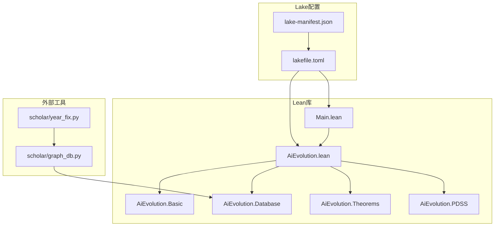
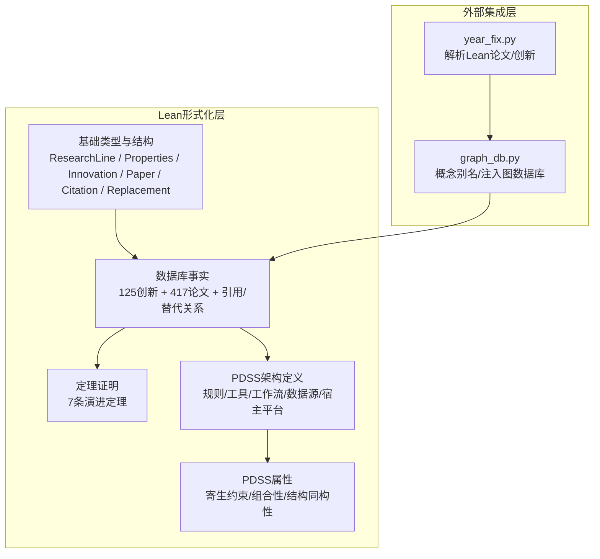
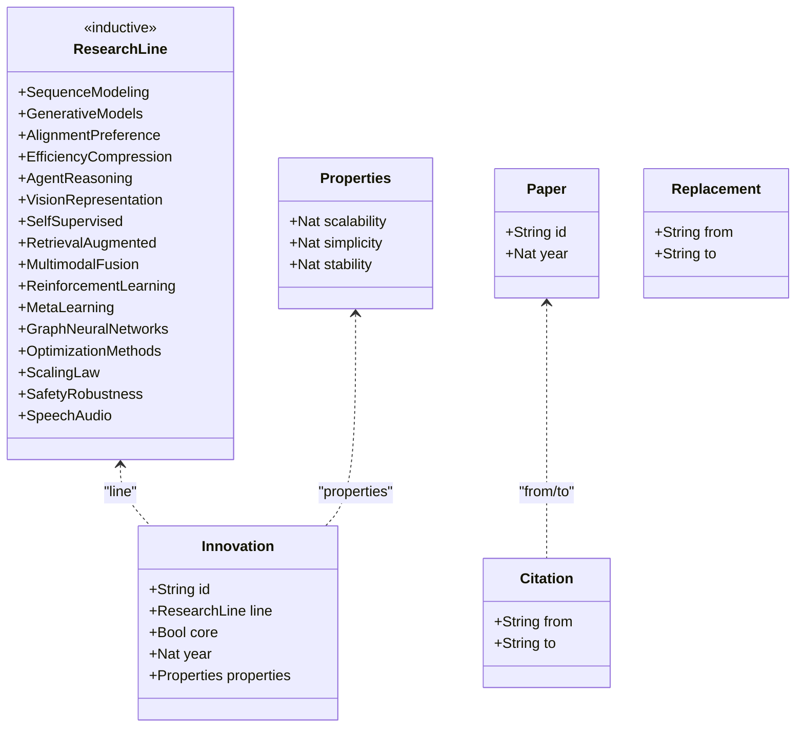
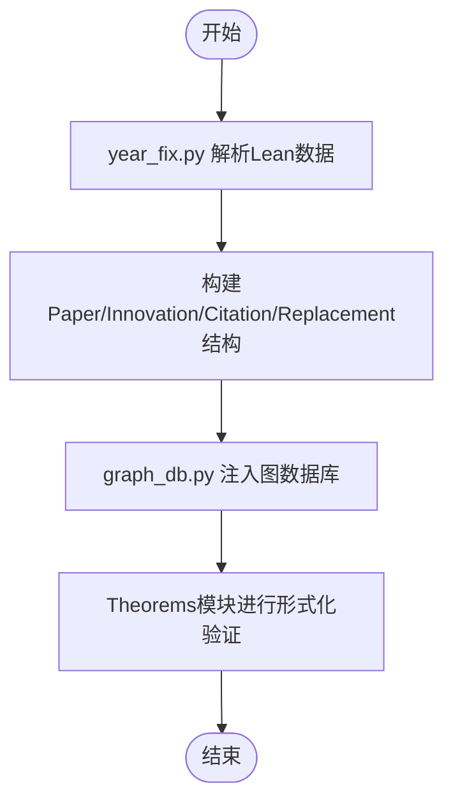
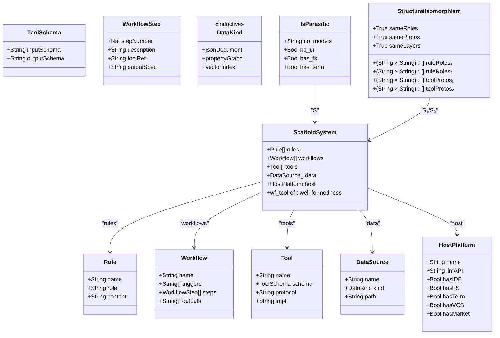
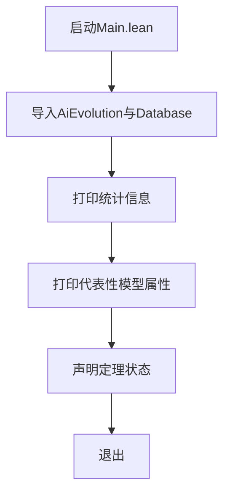
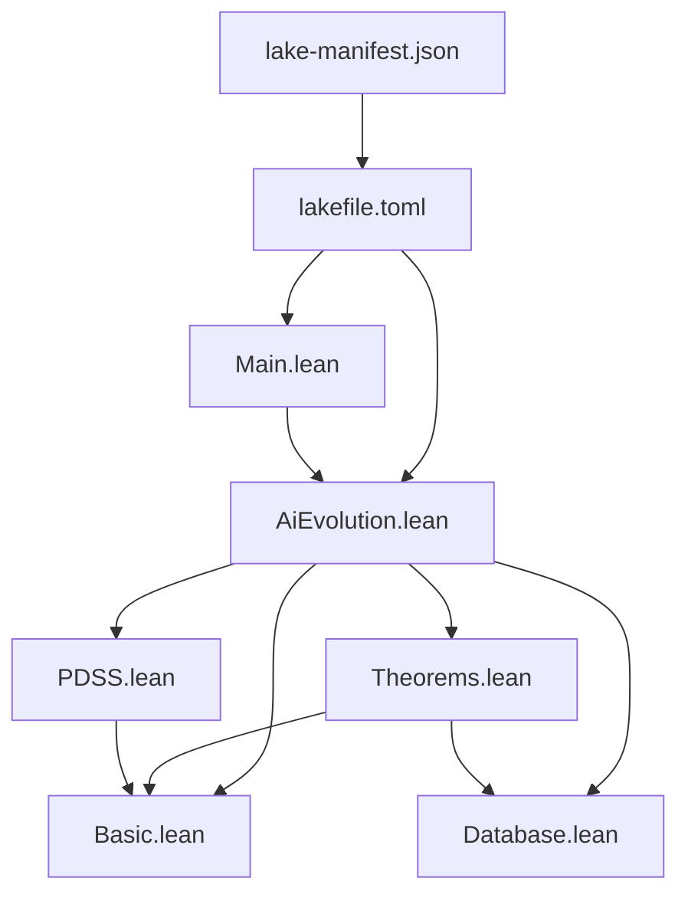

# Lean4形式化验证系统

<cite>
**本文档引用的文件**
- [README.md](file://LEAN/README.md)
- [AiEvolution.lean](file://LEAN/AiEvolution.lean)
- [Main.lean](file://LEAN/Main.lean)
- [lakefile.toml](file://LEAN/lakefile.toml)
- [lake-manifest.json](file://LEAN/lake-manifest.json)
- [Basic.lean](file://LEAN/AiEvolution/Basic.lean)
- [Database.lean](file://LEAN/AiEvolution/Database.lean)
- [Theorems.lean](file://LEAN/AiEvolution/Theorems.lean)
- [PDSS.lean](file://LEAN/AiEvolution/PDSS.lean)
- [year_fix.py](file://scholar/year_fix.py)
- [graph_db.py](file://scholar/graph_db.py)
</cite>

## 更新摘要
**所做更改**
- 新增PDSS形式化验证系统章节，详细介绍寄生域特定脚手架架构模式的形式化定义
- 更新核心组件分析，增加PDSS系统架构的详细说明
- 扩展架构总览，包含PDSS系统的集成架构
- 新增PDSS定理证明章节，涵盖寄生演进、组合性和最小主义原则
- 更新依赖分析，反映PDSS模块的导入关系
- 新增PDSS组件的详细分析和最佳实践

## 目录
1. [引言](#引言)
2. [项目结构](#项目结构)
3. [核心组件](#核心组件)
4. [架构总览](#架构总览)
5. [详细组件分析](#详细组件分析)
6. [依赖分析](#依赖分析)
7. [性能考虑](#性能考虑)
8. [故障排查指南](#故障排查指南)
9. [结论](#结论)
10. [附录](#附录)

## 引言
本项目围绕"AI技术演进"的全面形式化验证系统展开，目标是通过Lean4语言与Lake包管理系统，构建一个可编译、可严格证明的AI演化知识库与定理证明集合。系统以125个创新节点（Innovation）与417篇论文（Paper）为核心数据源，定义了研究线分类、创新属性（可扩展性、简洁性、稳定性）与替代关系（Replacement），并基于此形式化证明7条"技术演进定理"。

**更新** 新增PDSS（Parasitic Domain-Specific Scaffolding）形式化验证系统，这是一个重大的系统扩展，引入了新的架构模式和理论基础，专门用于形式化验证AI研究工具的架构设计。

系统通过主程序展示数据库中各代表性模型的属性，并声明所有定理已编译且严格证明完成。PDSS模块提供了寄生架构模式的形式化定义，包括五元组系统、寄生约束、组合性、结构同构性和关键定理。

## 项目结构
项目采用分层模块组织：顶层为可执行入口与库根模块；库内按功能划分为基础类型定义、数据库事实、定理证明和PDSS架构模式四部分；外部通过Python工具链解析Lean数据并注入图数据库。

**图表来源**
- [AiEvolution.lean:1-8](file://LEAN/AiEvolution.lean#L1-L8)
- [Main.lean:1-21](file://LEAN/Main.lean#L1-L21)
- [lakefile.toml:1-11](file://LEAN/lakefile.toml#L1-L11)
- [lake-manifest.json:1-93](file://LEAN/lake-manifest.json#L1-L93)
- [year_fix.py:18-200](file://scholar/year_fix.py#L18-L200)
- [graph_db.py:442-678](file://scholar/graph_db.py#L442-L678)

**章节来源**
- [README.md:1-1](file://LEAN/README.md#L1-L1)
- [AiEvolution.lean:1-8](file://LEAN/AiEvolution.lean#L1-L8)
- [Main.lean:1-21](file://LEAN/Main.lean#L1-L21)
- [lakefile.toml:1-11](file://LEAN/lakefile.toml#L1-L11)
- [lake-manifest.json:1-93](file://LEAN/lake-manifest.json#L1-L93)

## 核心组件
- 基础类型与结构
  - 研究线（ResearchLine）：对AI演化的16个主要范式进行分类，覆盖序列建模、生成模型、对齐偏好、效率压缩、智能体推理、视觉表征、自监督学习、检索增强、多模态融合、强化学习、元学习、图神经网络、优化方法、规模定律、安全鲁棒性、语音音频等。
  - 创新属性（Properties）：以1–5的评分刻画可扩展性、简洁性、稳定性。
  - 创新节点（Innovation）：包含标识、所属研究线、是否核心、年份及属性。
  - 论文记录（Paper）、引用关系（Citation）、替代关系（Replacement）。
- 数据库模块（Database）
  - 定义125个创新节点与417篇论文的事实，以及关键引用与替代关系列表。
  - 提供代表性模型的属性值，用于运行时展示与定理验证。
- 定理模块（Theorems）
  - 定义支配关系（dominates）与严格优超关系（scalesBetter/simpler/moreStable）。
  - 形式化证明7条技术演进定理，涵盖Transformer替换RNN、DPO替换PPO、扩散模型替换GAN、ViT替换CNN、LoRA替换Pruning、AdamW替换Adam、LSTM在可扩展性上优于RNN等。
- **PDSS架构模块（PDSS）**
  - **寄生域特定脚手架（PDSS）系统形式化定义**：作为五元组S = (R, W, T, D, H)的结构化表示。
  - **规则（Rule）**：声明性规则，作为领域知识注入的主要机制。
  - **工作流（Workflow）**：结构化的工作流程定义，指导LLM完成复杂的多步骤领域任务。
  - **工具（Tool）**：通过标准化协议（MCP）暴露的特定领域工具。
  - **数据源（DataSource）**：结构化数据层的数据源类型。
  - **宿主平台（HostPlatform）**：提供计算、UI和基础设施的宿主平台。
  - **寄生约束（IsParasitic）**：确保系统不包含训练模型、独立UI或独立计算资源。
  - **组合性（composable）**：两个PDSS系统共享协议兼容工具时的组合性质。
  - **结构同构性（StructuralIsomorphism）**：独立开发系统收敛到相同架构的形式化定义。
- 主程序（Main）
  - 展示总计创新节点与论文数量，打印若干代表性模型的属性，并宣告"所有定理已编译且严格证明"。

**章节来源**
- [Basic.lean:10-64](file://LEAN/AiEvolution/Basic.lean#L10-L64)
- [Database.lean:18-756](file://LEAN/AiEvolution/Database.lean#L18-L756)
- [Theorems.lean:23-167](file://LEAN/AiEvolution/Theorems.lean#L23-L167)
- [PDSS.lean:14-238](file://LEAN/AiEvolution/PDSS.lean#L14-L238)
- [Main.lean:6-21](file://LEAN/Main.lean#L6-L21)

## 架构总览
系统采用"数据事实+形式化证明+架构模式"的三层架构：左侧为Lean库内的结构化数据与定理；中间层为新增的PDSS架构模式形式化定义；右侧为外部Python工具链负责从Lean数据源解析并写入图数据库，形成知识图谱与检索增强的基础。

**图表来源**
- [Basic.lean:10-64](file://LEAN/AiEvolution/Basic.lean#L10-L64)
- [Database.lean:18-756](file://LEAN/AiEvolution/Database.lean#L18-L756)
- [Theorems.lean:23-167](file://LEAN/AiEvolution/Theorems.lean#L23-L167)
- [PDSS.lean:14-238](file://LEAN/AiEvolution/PDSS.lean#L14-L238)
- [year_fix.py:18-200](file://scholar/year_fix.py#L18-L200)
- [graph_db.py:442-678](file://scholar/graph_db.py#L442-L678)

## 详细组件分析

### 组件A：基础类型与结构（Basic）
- 设计要点
  - 使用归纳类型（inductive）定义研究线，确保穷尽且互斥。
  - 使用结构体（structure）封装属性与实体，统一可比较性（Repr, DecidableEq, Inhabited）。
  - 将引用关系与替代关系作为独立结构体，便于后续推理与图分析。
- 复杂度与性能
  - 结构体字段访问为O(1)，比较基于字段逐项比较，整体O(k)（k为属性数）。
- 错误处理与健壮性
  - 通过DecidableEq保证相等性判定可判定；通过deriving Repr便于调试输出。
- 扩展建议
  - 可引入权重或动态评分机制，支持更复杂的多目标权衡。

**图表来源**
- [Basic.lean:10-64](file://LEAN/AiEvolution/Basic.lean#L10-L64)

**章节来源**
- [Basic.lean:10-64](file://LEAN/AiEvolution/Basic.lean#L10-L64)

### 组件B：数据库事实（Database）
- 数据组织
  - 按研究线分组列出125个创新节点，每个节点包含id、line、core、year与三轴属性。
  - 定义417篇论文的事实，用于知识库链接与检索增强。
  - 提供关键引用关系与替代关系列表，作为形式化证明的目标依据。
- 集成点
  - Python解析器将Lean数据转换为内部结构，图数据库写入概念别名与知识图谱。
- 性能与一致性
  - 事实以全局常量形式存在，查询为直接索引访问；替代关系与引用关系以列表形式维护，适合静态分析与定理证明。

**图表来源**
- [year_fix.py:18-200](file://scholar/year_fix.py#L18-L200)
- [graph_db.py:442-678](file://scholar/graph_db.py#L442-L678)
- [Database.lean:18-756](file://LEAN/AiEvolution/Database.lean#L18-L756)

**章节来源**
- [Database.lean:18-756](file://LEAN/AiEvolution/Database.lean#L18-L756)
- [year_fix.py:18-200](file://scholar/year_fix.py#L18-L200)
- [graph_db.py:442-678](file://scholar/graph_db.py#L442-L678)

### 组件C：定理证明（Theorems）
- 证明框架
  - 定义支配关系dominates与三个严格优超关系（scalability/simplicity/stability）。
  - 逐一定理给出明确的比较与决策步骤，确保每一步都可由Lean的simp与decide自动化完成。
- 具体定理
  - Transformer替换RNN：在可扩展性上严格优超。
  - DPO替换PPO：在简洁性与稳定性上严格优超。
  - 扩散模型替换GAN：在三轴上均严格优超。
  - ViT替换CNN：在可扩展性上严格优超。
  - LoRA替换Pruning：在三轴上严格优超。
  - AdamW替换Adam：在稳定性上严格优超。
  - LSTM在可扩展性上优于RNN。
- 证明策略
  - 使用构造子（constructor）逐项证明不等式，最后通过left/right选择严格条件。
  - 使用simp展开结构体字段，decide自动计算数值比较结果。

**图表来源**
- [Main.lean:6-21](file://LEAN/Main.lean#L6-L21)
- [Theorems.lean:23-167](file://LEAN/AiEvolution/Theorems.lean#L23-L167)
- [Database.lean:18-756](file://LEAN/AiEvolution/Database.lean#L18-L756)

**章节来源**
- [Theorems.lean:23-167](file://LEAN/AiEvolution/Theorems.lean#L23-L167)
- [Main.lean:6-21](file://LEAN/Main.lean#L6-L21)

### 组件D：PDSS架构模式（PDSS）
- **系统定义**
  - **五元组结构**：PDSS系统S = (R, W, T, D, H)，其中R为规则、W为工作流、T为工具、D为数据源、H为宿主平台。
  - **良好形成条件**：每个工作流步骤必须引用现有的工具。
  - **缩写定义**：PDSS := ScaffoldSystem，提高可读性。
- **寄生约束**
  - **无训练模型**：所有智能操作来自宿主LLM，系统不包含任何训练模型。
  - **无独立UI**：所有交互通过宿主IDE进行。
  - **宿主基础设施要求**：宿主必须提供文件系统访问和终端执行能力。
- **工具协议兼容性与组合性**
  - **协议兼容性**：两个工具使用相同协议即为兼容。
  - **系统组合性**：如果两个系统共享至少一个协议兼容工具，则它们可以组合。
  - **工具并集**：合并两个系统工具的去重操作。
- **结构同构性**
  - **规则角色映射**：保持规则角色的一一对应关系。
  - **工具协议映射**：保持工具协议的一一对应关系。
  - **层次结构**：两个系统具有相同的四层架构（规则、工作流、工具、数据）。
- **寄生演进定理**
  - **质量依赖函数**：qualityDependsOnHost(S, c) = c + |rules| + |data|。
  - **单调性证明**：当宿主能力增加时，系统质量严格改善，无需修改脚手架代码。
- **组合性定理**
  - **对称性**：如果S₁可组合于S₂，则S₂可组合于S₁。
  - **MCP组合性**：如果两个系统都使用MCP协议，则它们可组合。
- **最小主义原则（定量）**
  - **代码比率**：codeRatio = |tools| / (|rules| + |workflows| + |tools|)。
  - **最小主义条件**：2 × |tools| < |rules| + |workflows| + |tools|，即工具少于所有组件的一半。

**图表来源**
- [PDSS.lean:23-107](file://LEAN/AiEvolution/PDSS.lean#L23-L107)
- [PDSS.lean:116-163](file://LEAN/AiEvolution/PDSS.lean#L116-L163)
- [PDSS.lean:153-163](file://LEAN/AiEvolution/PDSS.lean#L153-L163)

**章节来源**
- [PDSS.lean:14-238](file://LEAN/AiEvolution/PDSS.lean#L14-L238)

### 组件E：主程序与运行时展示
- 功能
  - 输出系统统计（125创新、417论文）。
  - 展示若干代表性模型的三轴属性。
  - 声明所有定理已编译且严格证明。
- 与数据库的交互
  - 直接导入Database命名空间，读取模型属性进行格式化输出。

**图表来源**
- [Main.lean:6-21](file://LEAN/Main.lean#L6-L21)

**章节来源**
- [Main.lean:6-21](file://LEAN/Main.lean#L6-L21)

## 依赖分析
- Lake包管理
  - 顶层配置定义库与可执行目标，清单文件记录依赖包及其版本。
  - 依赖包括mathlib、plausible、LeanSearchClient、importGraph、proofwidgets、aesop、Qq、batteries、lean4-cli等，支撑形式化、搜索、可视化与自动化证明。
- 模块依赖
  - AiEvolution.lean统一导入Basic、Database、Theorems、PDSS。
  - Main导入AiEvolution并打开命名空间，直接使用Database中的事实。
  - Theorems导入Basic与Database，复用Innovation与Replacement定义。
  - **PDSS模块独立存在，提供完整的架构模式形式化定义**。

**图表来源**
- [lakefile.toml:1-11](file://LEAN/lakefile.toml#L1-L11)
- [lake-manifest.json:1-93](file://LEAN/lake-manifest.json#L1-L93)
- [AiEvolution.lean:1-8](file://LEAN/AiEvolution.lean#L1-L8)
- [Theorems.lean:10-11](file://LEAN/AiEvolution/Theorems.lean#L10-L11)
- [Main.lean:1-5](file://LEAN/Main.lean#L1-L5)

**章节来源**
- [lakefile.toml:1-11](file://LEAN/lakefile.toml#L1-L11)
- [lake-manifest.json:1-93](file://LEAN/lake-manifest.json#L1-L93)
- [AiEvolution.lean:1-8](file://LEAN/AiEvolution.lean#L1-L8)
- [Theorems.lean:10-11](file://LEAN/AiEvolution/Theorems.lean#L10-L11)
- [Main.lean:1-5](file://LEAN/Main.lean#L1-L5)

## 性能考虑
- 数据规模
  - 125个创新节点与417篇论文属于中小规模，静态事实查询开销极低。
- 证明复杂度
  - 定理证明以数值比较为主，simp+decide可高效完成，无需复杂推理。
  - **PDSS定理证明同样基于简单的算术运算和逻辑推理**。
- 可扩展性
  - 新增创新节点与论文只需扩展Database模块；新增定理需在Theorems中添加新证明，保持模块边界清晰。
  - **新增PDSS系统只需在PDSS命名空间中添加新定义，遵循现有结构化模式**。
- 外部集成
  - Python解析器与图数据库写入应避免重复解析，建议缓存中间结构以提升增量更新效率。

## 故障排查指南
- 编译失败
  - 检查lake依赖是否完整安装，参考清单文件确认依赖版本。
  - 确认AiEvolution.lean正确导入各模块，Main导入AiEvolution并打开命名空间。
  - **检查PDSS模块导入是否正确，确保所有必需的结构体和定理都能被识别**。
- 定理证明失败
  - 若出现无法判定的比较，检查对应Innovation属性值是否符合预期。
  - 对于strict条件，确认至少一项严格大于而非仅大于等于。
  - **对于PDSS定理，检查系统参数是否满足well-formedness条件**。
- 运行时异常
  - 确保Main中使用的模型ID与Database一致，避免拼写错误导致未导出。
  - **验证PDSS系统中的工具引用是否存在于工具列表中**。
- 外部数据问题
  - 年份修正与别名映射由year_fix.py与graph_db.py负责，若知识图谱不一致，检查CONCEPT_ALIASES与解析逻辑。

**章节来源**
- [lake-manifest.json:1-93](file://LEAN/lake-manifest.json#L1-L93)
- [AiEvolution.lean:1-8](file://LEAN/AiEvolution.lean#L1-L8)
- [Main.lean:1-5](file://LEAN/Main.lean#L1-L5)
- [Theorems.lean:23-167](file://LEAN/AiEvolution/Theorems.lean#L23-L167)
- [PDSS.lean:101-104](file://LEAN/AiEvolution/PDSS.lean#L101-L104)
- [year_fix.py:18-200](file://scholar/year_fix.py#L18-L200)
- [graph_db.py:442-678](file://scholar/graph_db.py#L442-L678)

## 结论
本系统以Lean4与Lake为基础，构建了覆盖AI演进关键范式的结构化知识库与形式化证明体系。通过7条定理严格证明主流技术的替代关系与优劣排序，结合主程序的实时属性展示与外部工具链的知识图谱集成，形成了从数据到推理再到可视化的完整闭环。

**更新** 新增的PDSS形式化验证系统进一步扩展了该框架的能力，引入了寄生架构模式的形式化定义，为AI研究工具的设计和验证提供了新的理论基础。该系统既可用于学术分析，也可作为AI技术演进的可信基准，同时为未来的架构模式验证奠定了基础。

## 附录

### A. 环境搭建与Lake使用指南
- 安装与初始化
  - 使用Lake构建库与可执行程序，目标名称在配置中定义。
  - 依赖包由清单文件统一管理，确保mathlib与相关插件可用。
- 构建与运行
  - 构建命令编译库与可执行文件；运行可执行文件展示统计与属性。
- 扩展建议
  - 新增创新节点：在Database模块中添加新定义，并在必要时补充引用/替代关系。
  - 新增定理：在Theorems模块中添加新证明，遵循现有风格与结构。
  - **新增PDSS系统：在PDSS命名空间中添加新定义，遵循现有的五元组结构和良好形成条件**。

**章节来源**
- [lakefile.toml:1-11](file://LEAN/lakefile.toml#L1-L11)
- [lake-manifest.json:1-93](file://LEAN/lake-manifest.json#L1-L93)
- [Main.lean:6-21](file://LEAN/Main.lean#L6-L21)

### B. 技术演进定理的证明原理与最佳实践
- 证明原理
  - 以属性三轴为比较维度，定义支配关系与严格优超关系，逐一定理给出数值比较与决策步骤。
- 最佳实践
  - 在新增替代关系时，先在Database中建立Replacement条目，再在Theorems中添加对应定理。
  - 保持属性评分的合理性与一致性，避免跨研究线的不可比性。
  - 对于复杂替代路径，优先分解为原子级替代关系，简化证明难度。

**章节来源**
- [Theorems.lean:23-167](file://LEAN/AiEvolution/Theorems.lean#L23-L167)
- [Database.lean:729-756](file://LEAN/AiEvolution/Database.lean#L729-L756)

### C. PDSS架构模式的证明原理与最佳实践
- **证明原理**
  - **寄生演进定理**：基于质量依赖函数的质量单调性证明，使用omega算子完成算术推导。
  - **组合性定理**：通过存在性量化和协议兼容性的逻辑推导，证明组合性的对称性。
  - **最小主义原则**：通过代码比率的不等式变换，证明工具数量的约束条件。
- **最佳实践**
  - **系统设计**：确保PDSS系统满足良好形成条件，所有工作流步骤都有对应的工具引用。
  - **寄生约束**：严格遵守无训练模型、无独立UI的要求，确保系统完全依赖宿主LLM。
  - **协议兼容性**：优先使用MCP协议，确保不同系统的工具可以互操作。
  - **最小主义**：控制工具数量，确保工具占所有组件的比例小于一半。

**章节来源**
- [PDSS.lean:172-187](file://LEAN/AiEvolution/PDSS.lean#L172-L187)
- [PDSS.lean:195-203](file://LEAN/AiEvolution/PDSS.lean#L195-L203)
- [PDSS.lean:226-237](file://LEAN/AiEvolution/PDSS.lean#L226-L237)

### D. 创新节点与论文数据库的扩展方法
- 新增创新节点
  - 在Database模块相应研究线下添加新定义，设置id、line、core、year与三轴属性。
  - 如涉及替代关系，同步更新替代关系列表。
- 新增论文
  - 在Database模块论文段落添加新Paper定义，确保id唯一且year合理。
- 外部集成
  - 通过year_fix.py解析Lean数据，graph_db.py写入图数据库，保持概念别名一致。

**章节来源**
- [Database.lean:18-756](file://LEAN/AiEvolution/Database.lean#L18-L756)
- [year_fix.py:18-200](file://scholar/year_fix.py#L18-L200)
- [graph_db.py:442-678](file://scholar/graph_db.py#L442-L678)

### E. 形式化验证在AI技术演进分析中的应用
- 可靠性保障
  - 通过严格证明消除主观判断偏差，确保替代关系与优劣排序的客观性。
  - **PDSS定理通过数学归纳法和算术推导，确保架构模式的有效性**。
- 可解释性增强
  - 每条定理附带明确的比较与决策步骤，便于追溯与审计。
  - **PDSS定理提供清晰的逻辑推理过程，便于理解架构模式的设计原理**。
- 可扩展性
  - 新范式与新技术可通过统一的数据结构与证明框架纳入分析。
  - **PDSS模块展示了如何将新的架构模式纳入形式化验证框架**。

**章节来源**
- [Theorems.lean:19-167](file://LEAN/AiEvolution/Theorems.lean#L19-L167)
- [Database.lean:18-756](file://LEAN/AiEvolution/Database.lean#L18-L756)
- [PDSS.lean:180-187](file://LEAN/AiEvolution/PDSS.lean#L180-L187)

### F. PDSS系统的实际应用与集成指南
- **应用场景**
  - **AI研究工具开发**：为研究工具提供统一的架构规范和验证框架。
  - **多系统协作**：通过协议兼容性确保不同系统的工具可以互操作。
  - **最小主义设计**：指导开发者专注于声明性规则和工作流，减少代码依赖。
- **集成步骤**
  - **系统定义**：按照五元组结构定义规则、工具、工作流、数据源和宿主平台。
  - **寄生约束检查**：确保系统满足无训练模型、无独立UI的要求。
  - **组合性验证**：检查系统与其他PDSS系统的协议兼容性。
  - **最小主义评估**：计算代码比率，确保工具数量不超过限制。
- **扩展建议**
  - **新增工具类型**：在Tool结构体基础上扩展新的工具类型定义。
  - **自定义协议**：通过protocolCompatible函数扩展新的协议支持。
  - **结构同构性分析**：使用StructuralIsomorphism结构体分析系统的架构相似性。

**章节来源**
- [PDSS.lean:95-107](file://LEAN/AiEvolution/PDSS.lean#L95-L107)
- [PDSS.lean:116-124](file://LEAN/AiEvolution/PDSS.lean#L116-L124)
- [PDSS.lean:135-143](file://LEAN/AiEvolution/PDSS.lean#L135-L143)
- [PDSS.lean:235-237](file://LEAN/AiEvolution/PDSS.lean#L235-L237)