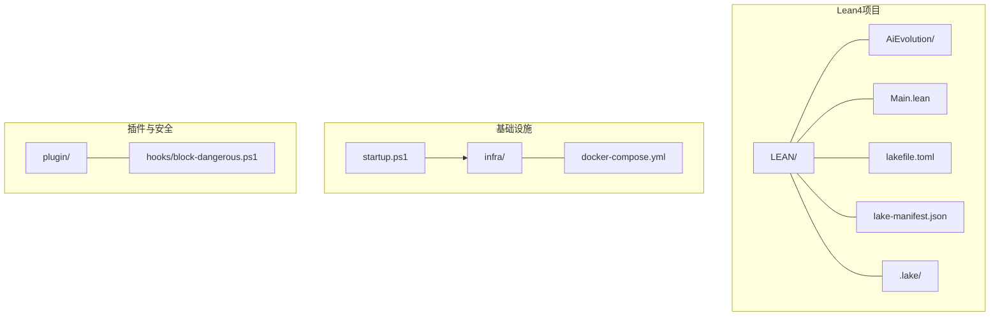
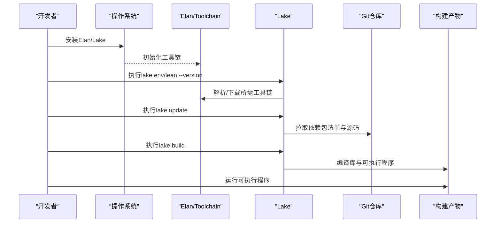
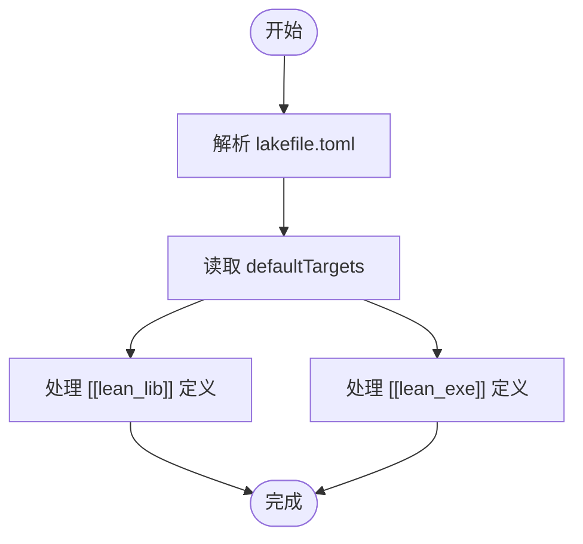
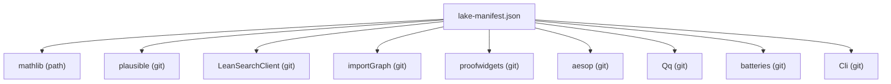
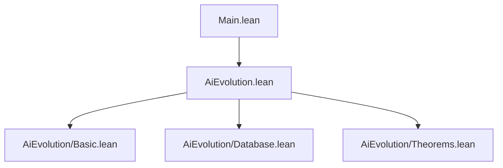
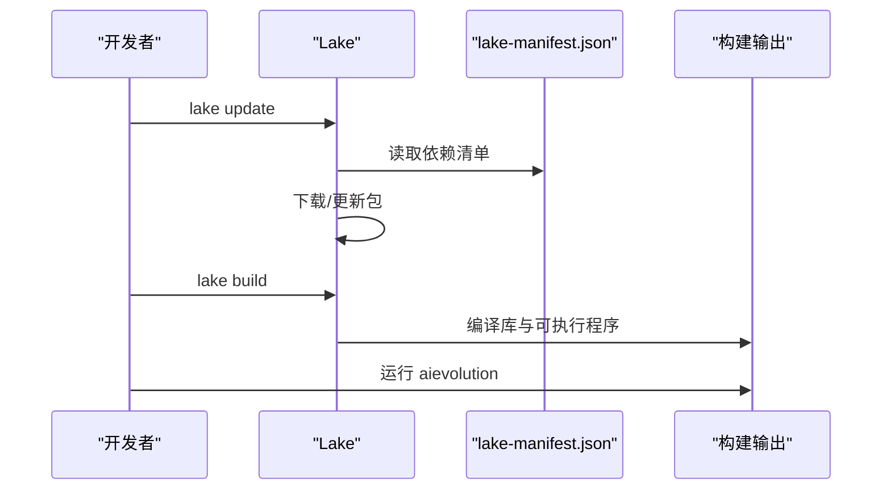
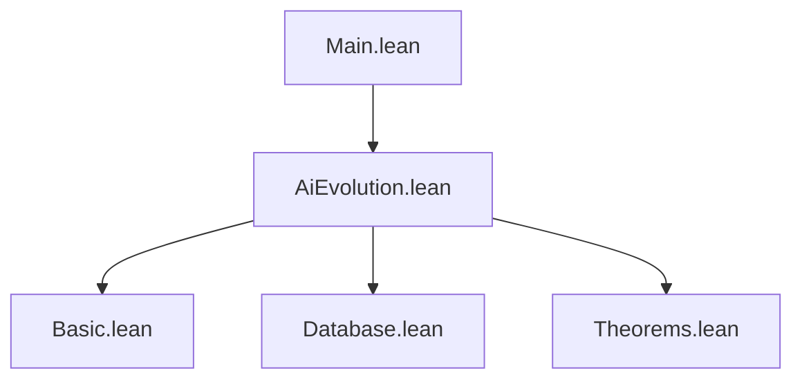

# Lean4环境搭建与配置

<cite>
**本文档引用的文件**
- [lakefile.toml](file://LEAN/lakefile.toml)
- [lake-manifest.json](file://LEAN/lake-manifest.json)
- [Main.lean](file://LEAN/Main.lean)
- [AiEvolution.lean](file://LEAN/AiEvolution.lean)
- [AiEvolution/Basic.lean](file://LEAN/AiEvolution/Basic.lean)
- [AiEvolution/Database.lean](file://LEAN/AiEvolution/Database.lean)
- [AiEvolution/Theorems.lean](file://LEAN/AiEvolution/Theorems.lean)
- [README.md](file://LEAN/README.md)
- [startup.ps1](file://startup.ps1)
- [docker-compose.yml](file://infra/docker-compose.yml)
- [block-dangerous.ps1](file://plugin/hooks/block-dangerous.ps1)
</cite>

## 目录
1. [简介](#简介)
2. [项目结构](#项目结构)
3. [核心组件](#核心组件)
4. [架构概览](#架构概览)
5. [详细组件分析](#详细组件分析)
6. [依赖分析](#依赖分析)
7. [性能考虑](#性能考虑)
8. [故障排除指南](#故障排除指南)
9. [结论](#结论)
10. [附录](#附录)

## 简介
本指南面向需要在本地搭建Lean4开发环境的开发者，结合项目中的Lake配置与实际代码，提供从工具链安装到项目构建、运行与调试的完整流程。文档涵盖以下要点：
- Lean4工具链与Lake包管理器的安装与配置
- Lake配置文件（lakefile.toml）的结构与参数说明
- 依赖包管理：添加新依赖、版本控制与更新策略
- IDE配置建议（VS Code + Lean插件）
- 常见安装问题与故障排除
- 实际安装示例与验证步骤

## 项目结构
该项目采用分层组织方式，核心目录与文件如下：
- LEAN/：Lean4项目根目录，包含Lake配置、源码与生成的包清单
- LEAN/.lake/：Lake缓存与已安装包的本地存储位置
- LEAN/AiEvolution/：库模块，包含基础类型定义、数据库与定理证明
- LEAN/Main.lean：可执行程序入口
- LEAN/lakefile.toml：Lake项目配置文件
- LEAN/lake-manifest.json：Lake生成的依赖包清单
- infra/docker-compose.yml：辅助服务（PostgreSQL + Neo4j）的容器编排
- startup.ps1：一键启动脚本，用于拉起基础设施服务
- plugin/hooks/block-dangerous.ps1：安全钩子脚本，拦截危险命令

**图表来源**
- [lakefile.toml:1-11](file://LEAN/lakefile.toml#L1-L11)
- [lake-manifest.json:1-93](file://LEAN/lake-manifest.json#L1-L93)
- [docker-compose.yml:1-44](file://infra/docker-compose.yml#L1-L44)
- [startup.ps1:1-65](file://startup.ps1#L1-L65)
- [block-dangerous.ps1:1-24](file://plugin/hooks/block-dangerous.ps1#L1-L24)

**章节来源**
- [lakefile.toml:1-11](file://LEAN/lakefile.toml#L1-L11)
- [lake-manifest.json:1-93](file://LEAN/lake-manifest.json#L1-L93)
- [README.md:1-1](file://LEAN/README.md#L1-L1)

## 核心组件
- Lake配置与目标
  - 项目名称、版本与默认目标
  - 定义库模块与可执行程序
- 库模块与可执行程序
  - 库模块AiEvolution导出公共接口
  - 可执行程序aievolution以Main为入口
- 依赖包清单
  - 包含mathlib与多个leanprover-community生态包
  - 记录包来源、版本与配置文件路径

**章节来源**
- [lakefile.toml:1-11](file://LEAN/lakefile.toml#L1-L11)
- [AiEvolution.lean:1-7](file://LEAN/AiEvolution.lean#L1-L7)
- [Main.lean:1-21](file://LEAN/Main.lean#L1-L21)
- [lake-manifest.json:1-93](file://LEAN/lake-manifest.json#L1-L93)

## 架构概览
下图展示了从工具链到项目构建与运行的整体流程：

**图表来源**
- [lake-manifest.json:1-93](file://LEAN/lake-manifest.json#L1-L93)
- [startup.ps1:1-65](file://startup.ps1#L1-L65)

## 详细组件分析

### Lake配置文件（lakefile.toml）解析
- 项目元信息
  - name：项目名称
  - version：版本号
  - defaultTargets：默认构建目标列表
- 库模块定义
  - [[lean_lib]]：定义库模块AiEvolution
- 可执行程序定义
  - [[lean_exe]]：定义可执行程序aievolution，入口为Main

**图表来源**
- [lakefile.toml:1-11](file://LEAN/lakefile.toml#L1-L11)

**章节来源**
- [lakefile.toml:1-11](file://LEAN/lakefile.toml#L1-L11)

### 依赖包管理与版本控制
- 依赖来源
  - mathlib：路径型依赖
  - 其他包来自leanprover-community与leanprover官方仓库
- 版本控制
  - manifest中记录具体提交哈希与输入分支/标签
- 更新策略
  - 使用lake update同步清单与源码
  - 通过lake build触发编译

**图表来源**
- [lake-manifest.json:1-93](file://LEAN/lake-manifest.json#L1-L93)

**章节来源**
- [lake-manifest.json:1-93](file://LEAN/lake-manifest.json#L1-L93)

### 代码结构与模块关系
- 库模块AiEvolution
  - 导入Basic、Database、Theorems等子模块
- 基础类型定义（Basic）
  - 研究领域分类、创新点属性、论文与引用关系等结构
- 数据库模块（Database）
  - 125个创新点、417篇论文及替换/引用关系的权威数据集
- 定理模块（Theorems）
  - 形式化证明7条演化定理，确保无“sorry”
- 可执行程序（Main）
  - 展示AI演化的统计信息与证明状态

**图表来源**
- [AiEvolution.lean:1-7](file://LEAN/AiEvolution.lean#L1-L7)
- [AiEvolution/Basic.lean:1-65](file://LEAN/AiEvolution/Basic.lean#L1-L65)
- [AiEvolution/Database.lean:1-756](file://LEAN/AiEvolution/Database.lean#L1-L756)
- [AiEvolution/Theorems.lean:1-168](file://LEAN/AiEvolution/Theorems.lean#L1-L168)
- [Main.lean:1-21](file://LEAN/Main.lean#L1-L21)

**章节来源**
- [AiEvolution.lean:1-7](file://LEAN/AiEvolution.lean#L1-L7)
- [AiEvolution/Basic.lean:1-65](file://LEAN/AiEvolution/Basic.lean#L1-L65)
- [AiEvolution/Database.lean:1-756](file://LEAN/AiEvolution/Database.lean#L1-L756)
- [AiEvolution/Theorems.lean:1-168](file://LEAN/AiEvolution/Theorems.lean#L1-L168)
- [Main.lean:1-21](file://LEAN/Main.lean#L1-L21)

### Lake工作流序列

**图表来源**
- [lake-manifest.json:1-93](file://LEAN/lake-manifest.json#L1-L93)
- [lakefile.toml:1-11](file://LEAN/lakefile.toml#L1-L11)

**章节来源**
- [lake-manifest.json:1-93](file://LEAN/lake-manifest.json#L1-L93)
- [lakefile.toml:1-11](file://LEAN/lakefile.toml#L1-L11)

## 依赖分析
- 内聚性
  - 库模块AiEvolution内聚地封装了类型、数据与定理证明
- 耦合度
  - Main仅通过AiEvolution公开接口进行交互
  - Database模块作为权威数据源被Theorems模块引用
- 外部依赖
  - 通过lake-manifest.json集中声明，便于版本锁定与更新

**图表来源**
- [Main.lean:1-21](file://LEAN/Main.lean#L1-L21)
- [AiEvolution.lean:1-7](file://LEAN/AiEvolution.lean#L1-L7)
- [AiEvolution/Basic.lean:1-65](file://LEAN/AiEvolution/Basic.lean#L1-L65)
- [AiEvolution/Database.lean:1-756](file://LEAN/AiEvolution/Database.lean#L1-L756)
- [AiEvolution/Theorems.lean:1-168](file://LEAN/AiEvolution/Theorems.lean#L1-L168)

**章节来源**
- [Main.lean:1-21](file://LEAN/Main.lean#L1-L21)
- [AiEvolution.lean:1-7](file://LEAN/AiEvolution.lean#L1-L7)

## 性能考虑
- 构建性能
  - 使用Lake增量编译与并行构建能力
  - 将大型数据集（如Database模块）拆分为独立模块，减少不必要的重编译
- 工具链选择
  - 优先使用与项目匹配的Lean工具链版本，避免重复下载与冲突
- 依赖精简
  - 仅保留必要依赖，定期清理未使用的包以降低构建时间

## 故障排除指南
- Lake无法找到可用工具链
  - 现象：执行lake env或lean --version失败
  - 排查：确认Elan已安装；检查lake-manifest.json中的工具链版本是否正确
  - 参考：工具链版本验证脚本逻辑
- 依赖包下载缓慢或失败
  - 现象：lake update卡住或超时
  - 排查：检查网络代理；尝试更换Git镜像源；清理.lake缓存后重试
- 构建失败或符号未定义
  - 现象：编译时报错找不到模块或定义
  - 排查：确认lakefile.toml中模块导入顺序；确保依赖已通过lake update安装
- 可执行程序无法运行
  - 现象：./aievolution或lake exe run失败
  - 排查：确认defaultTargets包含可执行目标；重新执行lake build

**章节来源**
- [lake-manifest.json:1-93](file://LEAN/lake-manifest.json#L1-L93)
- [startup.ps1:1-65](file://startup.ps1#L1-L65)

## 结论
通过本指南，您可以在本地成功搭建Lean4开发环境并完成项目构建与运行。Lake配置文件明确了项目结构与目标，依赖清单确保了版本一致性与可复现性。建议在日常开发中遵循以下最佳实践：
- 使用lake update统一管理依赖
- 在lakefile.toml中清晰定义库与可执行目标
- 将大型数据与证明模块分离，提升构建效率
- 遇到问题时先检查工具链版本与依赖清单

## 附录

### 安装与配置步骤（基于仓库内容）
- 步骤1：安装Elan与Lake
  - 通过Elan安装Lean工具链，确保lake可用
- 步骤2：初始化项目
  - 在项目根目录执行lake update以同步依赖
- 步骤3：构建项目
  - 执行lake build以编译库与可执行程序
- 步骤4：运行可执行程序
  - 执行aievolution或通过lake exe run运行主程序
- 步骤5：验证环境
  - 运行结果应显示AI演化的统计数据与证明状态

**章节来源**
- [lakefile.toml:1-11](file://LEAN/lakefile.toml#L1-L11)
- [Main.lean:1-21](file://LEAN/Main.lean#L1-L21)
- [startup.ps1:1-65](file://startup.ps1#L1-L65)

### IDE配置建议（VS Code + Lean插件）
- 插件安装
  - 安装Lean官方VS Code扩展
- 工作区配置
  - 设置项目根目录为工作区根
  - 配置Lean工具链路径指向Elan安装的工具链
- 编译与调试
  - 使用任务面板执行lake build
  - 通过终端运行可执行程序进行验证

### 常见问题与解决方案速查
- 问题：工具链版本不匹配
  - 解决：根据lake-manifest.json指定版本，使用Elan切换工具链
- 问题：依赖包缺失
  - 解决：执行lake update后重试构建
- 问题：构建缓慢
  - 解决：清理.lake缓存，启用并行构建，减少无关依赖