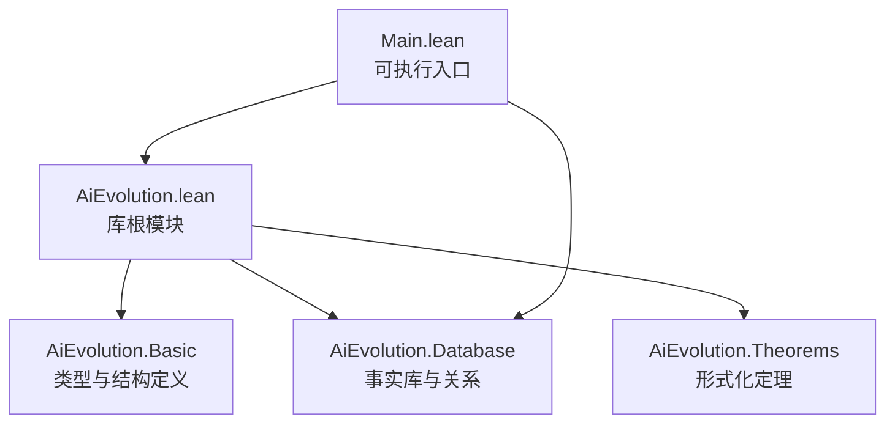
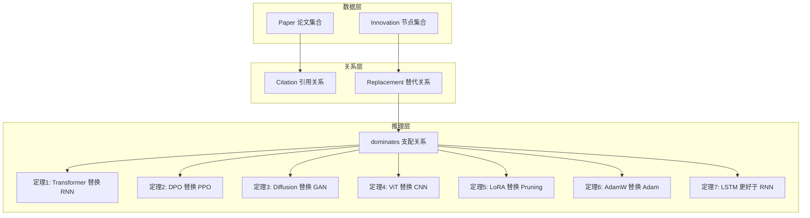
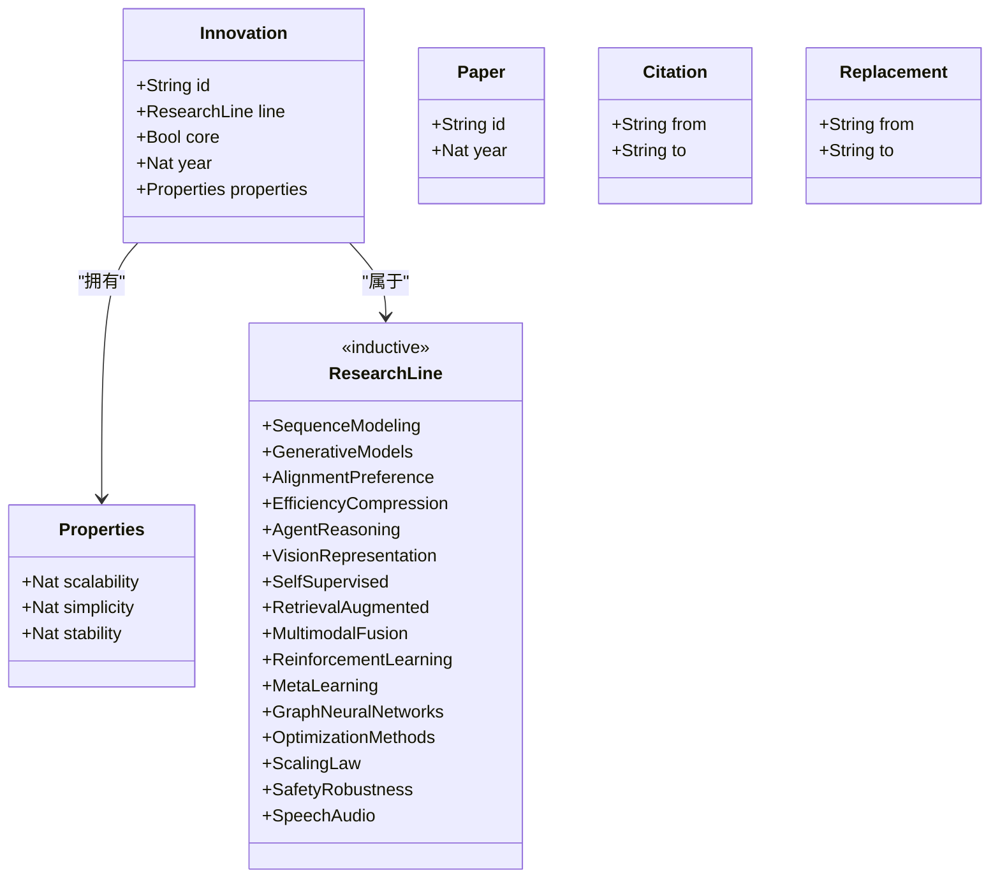
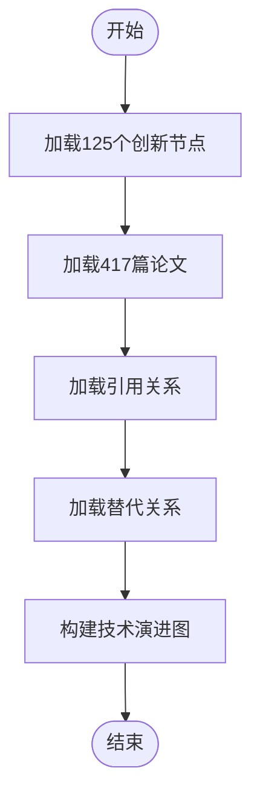
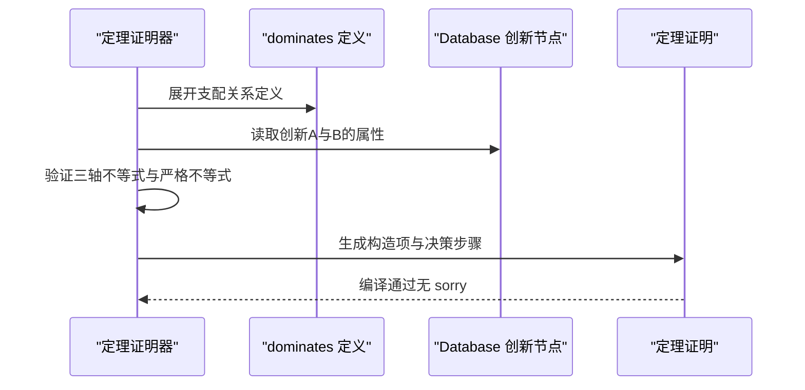
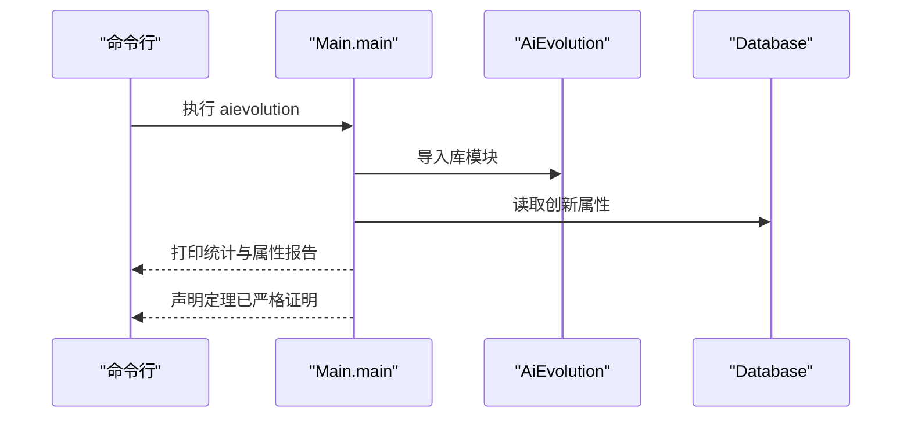
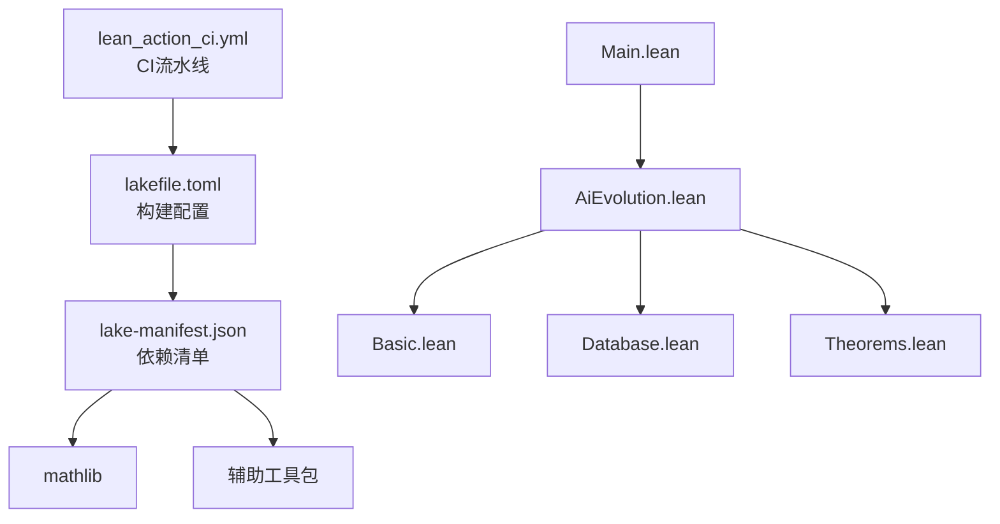

# 基础理论与核心概念

<cite>
**本文引用的文件**
- [AiEvolution.lean](file://LEAN/AiEvolution.lean)
- [Main.lean](file://LEAN/Main.lean)
- [Basic.lean](file://LEAN/AiEvolution/Basic.lean)
- [Theorems.lean](file://LEAN/AiEvolution/Theorems.lean)
- [Database.lean](file://LEAN/AiEvolution/Database.lean)
- [lakefile.toml](file://LEAN/lakefile.toml)
- [lake-manifest.json](file://LEAN/lake-manifest.json)
- [lean_action_ci.yml](file://LEAN/.github/workflows/lean_action_ci.yml)
</cite>

## 目录
1. [引言](#引言)
2. [项目结构](#项目结构)
3. [核心组件](#核心组件)
4. [架构总览](#架构总览)
5. [详细组件分析](#详细组件分析)
6. [依赖分析](#依赖分析)
7. [性能考虑](#性能考虑)
8. [故障排除指南](#故障排除指南)
9. [结论](#结论)
10. [附录](#附录)

## 引言
本文件面向Lean4形式化验证在AI技术演进研究中的应用，系统性地梳理了该系统的理论基础、核心概念与形式化建模方法。文档重点阐释以下内容：
- 技术演进的形式化建模原理：以“创新节点”为核心对象，结合“替代关系”“创新属性”“技术成熟度”等概念，构建可验证的数学结构。
- 公理与基本假设：明确属性取值范围、比较关系与支配关系的定义，确保形式化推理的严谨性。
- 形式化定理体系：通过7个“替代关系”定理，严格证明新旧技术在至少两个维度上具有优势。
- 理论与实践结合：给出具体示例（如Transformer替换RNN、DPO替换PPO等），并通过可执行程序展示系统编译与验证状态。

本项目采用Lean4语言与数学库（mathlib）进行形式化，所有定理均通过编译器严格验证，不使用未完成证明（no sorry）。

## 项目结构
项目采用模块化组织，核心模块如下：
- 根模块：AiEvolution.lean 汇总子模块导入，作为库入口。
- 基础模块：AiEvolution.Basic 定义类型与数据结构（研究线、创新节点、论文、引用、替代关系）。
- 数据库模块：AiEvolution.Database 提供125个创新节点、417篇论文及引用/替代关系的事实库。
- 定理模块：AiEvolution.Theorems 定义比较与支配关系，并给出7个正式定理的证明。
- 可执行入口：Main.lean 展示系统统计信息与验证结果。

图表来源
- [AiEvolution.lean:1-7](file://LEAN/AiEvolution.lean#L1-L7)
- [Main.lean:1-21](file://LEAN/Main.lean#L1-L21)

章节来源
- [AiEvolution.lean:1-7](file://LEAN/AiEvolution.lean#L1-L7)
- [Main.lean:1-21](file://LEAN/Main.lean#L1-L21)
- [lakefile.toml:1-11](file://LEAN/lakefile.toml#L1-L11)

## 核心组件
本节从理论与实现两方面解析核心概念与数据结构。

- 研究线（ResearchLine）
  - 含义：对AI创新进行分类的16个研究范式，覆盖序列建模、生成模型、对齐偏好、效率压缩、智能体推理、视觉表征、自监督学习、检索增强、多模态融合、强化学习、元学习、图神经网络、优化方法、扩展定律、安全鲁棒性、语音音频等。
  - 数学性质：通过归纳类型定义，支持可判定相等与存在性（DecidableEq, Inhabited）。
  - 复杂度：枚举类型，构造与比较均为常量时间。

- 创新属性（Properties）
  - 含义：量化比较的三个轴向指标：可扩展性（scalability）、简洁性（simplicity）、稳定性（stability）。
  - 取值范围：均为1到5的自然数，数值越大表示越优。
  - 用途：用于比较不同创新节点在相同维度上的相对优劣。

- 创新节点（Innovation）
  - 字段：唯一标识符、所属研究线、是否核心创新、年份、属性集合。
  - 作用：作为技术演进图中的节点，承载可验证的属性与关系。

- 论文记录（Paper）
  - 字段：人类可读ID、发表年份。
  - 作用：连接知识库与技术演进事实。

- 引用关系（Citation）
  - 字段：引用方ID、被引用方ID。
  - 作用：刻画学术影响链路。

- 替代关系（Replacement）
  - 字段：旧创新ID、新创新ID。
  - 作用：形式化“新替代旧”的目标关系，是定理证明的核心前提。

章节来源
- [Basic.lean:10-64](file://LEAN/AiEvolution/Basic.lean#L10-L64)

## 架构总览
系统采用“数据-关系-定理”的三层架构：
- 数据层：Database模块提供大量真实创新节点与论文事实，形成可验证的数学对象集合。
- 关系层：通过Citation与Replacement两类关系，建立技术间的因果与替代联系。
- 推理层：Theorems模块基于Properties定义比较与支配关系，给出7个严格定理证明。

图表来源
- [Database.lean:18-753](file://LEAN/AiEvolution/Database.lean#L18-L753)
- [Theorems.lean:23-167](file://LEAN/AiEvolution/Theorems.lean#L23-L167)

## 详细组件分析

### 类型与结构（Basic）
- 设计原则
  - 使用归纳类型（inductive）定义研究线，确保完备性与可判定性。
  - 使用结构类型（structure）封装属性与实体，便于模式匹配与字段访问。
  - 通过derive派生常用实例（Repr, DecidableEq, Inhabited），降低重复代码并提升可读性。

- 关键定义
  - ResearchLine：16类研究线的枚举。
  - Properties：三轴量化指标。
  - Innovation：节点实体，包含属性与标签。
  - Paper/Citation/Replacement：知识与关系的抽象。

图表来源
- [Basic.lean:10-64](file://LEAN/AiEvolution/Basic.lean#L10-L64)

章节来源
- [Basic.lean:10-64](file://LEAN/AiEvolution/Basic.lean#L10-L64)

### 数据库与事实（Database）
- 创新节点（125个）
  - 分布：按研究线分组，覆盖主流范式；包含核心与非核心创新，标注年份。
  - 示例：RNN、LSTM、Transformer、GAN、Diffusion、PPO、DPO、ViT、LoRA、Adam、AdamW等。
- 论文（417篇）
  - 提供人类可读ID与年份，作为知识库条目。
- 引用关系（约100条）
  - 基于关键论文之间的学术影响链路，形成有向无环或弱连通图。
- 替代关系（18条）
  - 作为定理证明的目标前提，涵盖范式迁移与技术迭代。

图表来源
- [Database.lean:18-753](file://LEAN/AiEvolution/Database.lean#L18-L753)

章节来源
- [Database.lean:18-753](file://LEAN/AiEvolution/Database.lean#L18-L753)

### 定理与比较逻辑（Theorems）
- 支配关系（dominates）
  - 定义：对于创新A与B，若B在至少一个维度严格优于A，在其余维度至少不劣于A，则称B支配A。
  - 用途：作为替代关系的严格比较准则，避免主观判断。
- 严格优势关系
  - scalesBetter：仅在可扩展性维度严格更优。
  - simpler：仅在简洁性维度严格更优。
  - moreStable：仅在稳定性维度严格更优。
- 7个正式定理
  - Transformer替换RNN
  - DPO替换PPO
  - Diffusion替换GAN
  - ViT替换CNN
  - LoRA替换Pruning
  - AdamW替换Adam
  - LSTM在可扩展性上优于RNN

图表来源
- [Theorems.lean:23-167](file://LEAN/AiEvolution/Theorems.lean#L23-L167)
- [Database.lean:18-753](file://LEAN/AiEvolution/Database.lean#L18-L753)

章节来源
- [Theorems.lean:23-167](file://LEAN/AiEvolution/Theorems.lean#L23-L167)

### 可执行入口与运行时（Main）
- 功能
  - 输出系统统计：已实例化的创新数量、论文数量。
  - 展示关键创新的属性（可扩展性、简洁性、稳定性）。
  - 声明定理编译与严格证明状态。
- 运行方式
  - 通过可执行目标aievolution运行，调用AiEvolution库模块。

图表来源
- [Main.lean:6-20](file://LEAN/Main.lean#L6-L20)

章节来源
- [Main.lean:6-20](file://LEAN/Main.lean#L6-L20)

## 依赖分析
- 包管理与工具链
  - Lake：项目构建与包管理，定义可执行目标与库目标。
  - Manifest：声明外部依赖（mathlib、plausible、LeanSearchClient、importGraph、proofwidgets、aesop、Qq、batteries、lean4-cli）。
  - CI：GitHub Actions自动构建与测试。
- 内部模块依赖
  - AiEvolution.lean 导入 Basic、Database、Theorems。
  - Main.lean 导入 AiEvolution 并打开命名空间。
  - Theorems.lean 显式导入 Basic 与 Database。

图表来源
- [lakefile.toml:1-11](file://LEAN/lakefile.toml#L1-L11)
- [lake-manifest.json:1-93](file://LEAN/lake-manifest.json#L1-L93)
- [lean_action_ci.yml:1-15](file://LEAN/.github/workflows/lean_action_ci.yml#L1-L15)

章节来源
- [lakefile.toml:1-11](file://LEAN/lakefile.toml#L1-L11)
- [lake-manifest.json:1-93](file://LEAN/lake-manifest.json#L1-L93)
- [lean_action_ci.yml:1-15](file://LEAN/.github/workflows/lean_action_ci.yml#L1-L15)

## 性能考虑
- 数据规模
  - 125个创新节点与417篇论文构成中等规模事实库，适合交互式查询与定理证明。
- 查询复杂度
  - 属性比较为常量时间，替代关系检查为线性扫描（当前约18条），整体开销可控。
- 形式化开销
  - Lean编译器在构建阶段完成定理验证，运行时仅输出统计与属性摘要，开销极低。
- 可扩展性建议
  - 引入索引（如按研究线、年份）可加速查询。
  - 将替代关系抽取为函数式接口，便于增量扩展。

## 故障排除指南
- 编译失败
  - 症状：定理证明中断或出现未满足的子目标。
  - 排查：确认属性取值在1..5范围内；核对替代关系是否存在于Database.replacesDb。
  - 参考：Theorems模块中的构造项与decide步骤。
- 运行时异常
  - 症状：Main输出为空或属性缺失。
  - 排查：检查AiEvolution命名空间是否正确打开；确认Database中对应创新节点已正确定义。
- 依赖问题
  - 症状：找不到mathlib或工具包。
  - 排查：使用Lake重新拉取依赖；核对lake-manifest.json版本与网络环境。

章节来源
- [Theorems.lean:49-165](file://LEAN/AiEvolution/Theorems.lean#L49-L165)
- [Main.lean:6-20](file://LEAN/Main.lean#L6-L20)
- [lake-manifest.json:1-93](file://LEAN/lake-manifest.json#L1-L93)

## 结论
本项目以Lean4为形式化平台，将AI技术演进抽象为可验证的数学结构：以研究线分类、以创新节点承载属性、以替代关系刻画范式迁移，并通过7个严格定理证明新旧技术在至少两个维度上的优势。该方法既保证了理论严谨性，又提供了可操作的实证框架，为AI研究中的技术评估与演化分析提供了形式化验证的参考路径。

## 附录
- 数学基础
  - 偏序与严格偏序：用于比较属性值与严格优势。
  - 支配关系：综合三轴比较，确保“至少一优、其余不劣”的严格性。
- 实践建议
  - 在新增创新节点时，遵循属性取值规范与核心/非核心标注。
  - 新增替代关系需配套定理证明，保持系统一致性。
  - 利用CI流水线持续验证，确保每次变更后定理仍可编译通过。