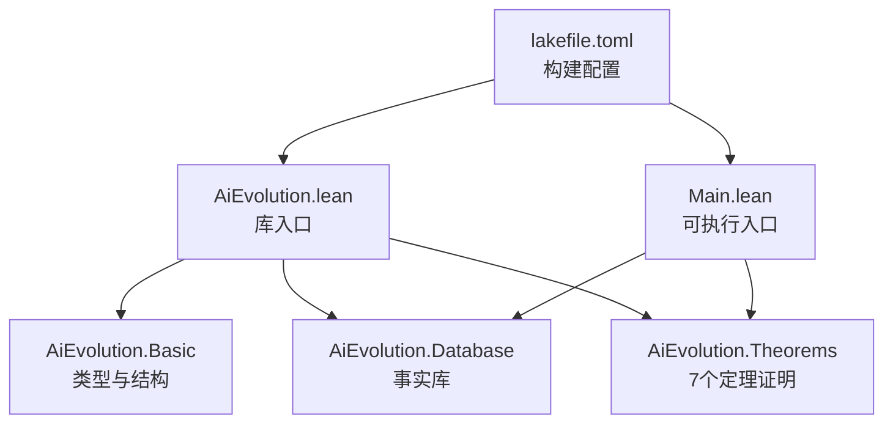
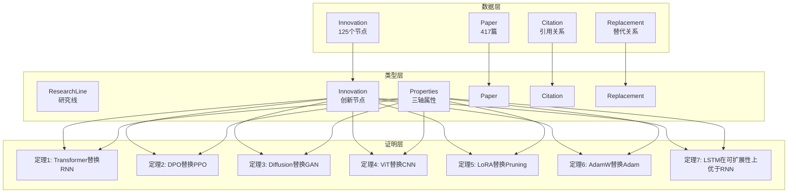
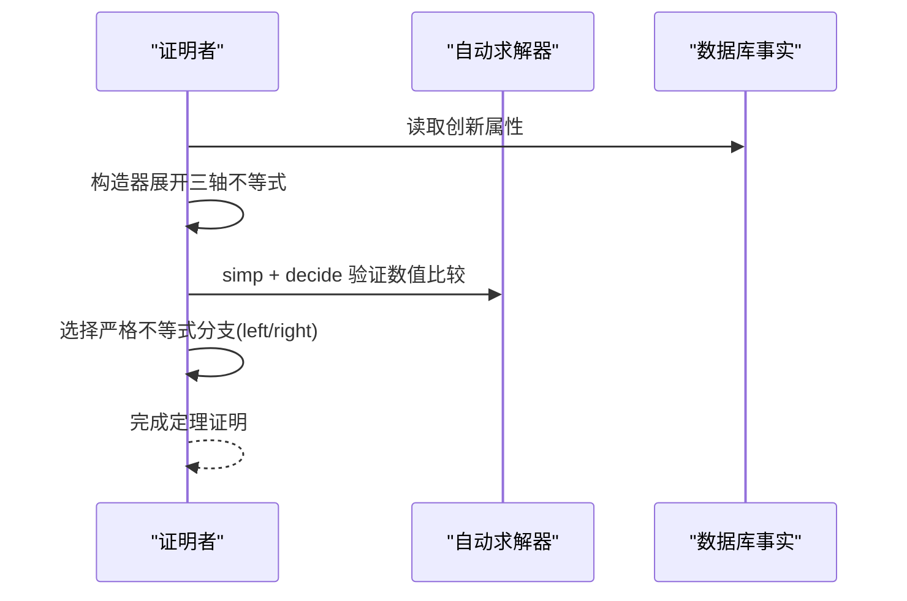
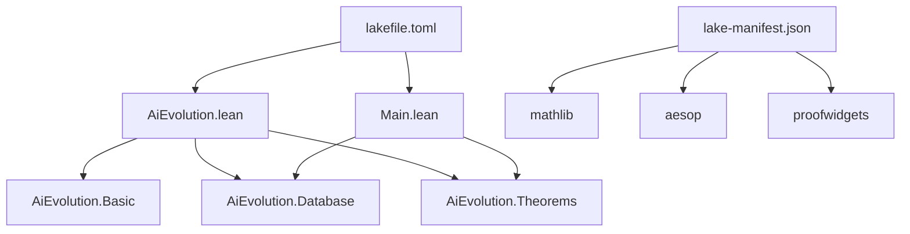

# 定理证明系统与应用

<cite>
**本文档引用的文件**
- [AiEvolution/Theorems.lean](file://LEAN/AiEvolution/Theorems.lean)
- [AiEvolution/Basic.lean](file://LEAN/AiEvolution/Basic.lean)
- [AiEvolution/Database.lean](file://LEAN/AiEvolution/Database.lean)
- [AiEvolution.lean](file://LEAN/AiEvolution.lean)
- [Main.lean](file://LEAN/Main.lean)
- [lakefile.toml](file://LEAN/lakefile.toml)
- [lake-manifest.json](file://LEAN/lake-manifest.json)
- [plugin/skills/math-verification/README.md](file://plugin/skills/math-verification/SKILL.md)
- [plugin/skills/paper-deep-dive/README.md](file://plugin/skills/paper-deep-dive/SKILL.md)
- [plugin/skills/reproduce-paper/README.md](file://plugin/skills/reproduce-paper/SKILL.md)
</cite>

## 目录
1. [引言](#引言)
2. [项目结构](#项目结构)
3. [核心组件](#核心组件)
4. [架构总览](#架构总览)
5. [详细组件分析](#详细组件分析)
6. [依赖分析](#依赖分析)
7. [性能考虑](#性能考虑)
8. [故障排查指南](#故障排查指南)
9. [结论](#结论)
10. [附录](#附录)

## 引言
本项目以Lean4形式化语言构建“AI技术演化”的定理证明系统，围绕7个核心演化定理，严格证明“新范式在至少两个轴上优于旧范式”的结论。系统通过结构化数据模型（研究线、创新节点、论文、引用与替代关系）与形式化证明相结合，形成从问题建模到定理验证的闭环。本文档面向不同背景读者，既提供高层概览，也深入到代码级细节，帮助理解定理的数学表述、证明策略、扩展方式以及在AI技术演进分析中的应用。

## 项目结构
- 根模块与库组织
  - 根模块文件负责聚合子模块，形成统一的库入口。
  - 可执行程序入口负责运行时输出统计信息与状态。
- 子模块职责
  - 基础类型与结构：定义研究线、创新属性、论文与关系等核心数据结构。
  - 数据库事实：125个创新节点、417篇论文、引用与替代关系的事实库。
  - 定理证明：7个核心演化定理的形式化证明，确保无“留白”（no sorry）。
- 构建与依赖
  - 使用Lake构建系统，声明库与可执行目标。
  - 依赖数学库与自动化证明工具包，支撑归纳、矛盾、构造性证明等策略。

**图表来源**
- [AiEvolution.lean:1-7](file://LEAN/AiEvolution.lean#L1-L7)
- [Main.lean:1-21](file://LEAN/Main.lean#L1-L21)
- [lakefile.toml:1-11](file://LEAN/lakefile.toml#L1-L11)

**章节来源**
- [AiEvolution.lean:1-7](file://LEAN/AiEvolution.lean#L1-L7)
- [Main.lean:1-21](file://LEAN/Main.lean#L1-L21)
- [lakefile.toml:1-11](file://LEAN/lakefile.toml#L1-L11)

## 核心组件
- 基础类型与结构
  - 研究线分类：涵盖序列建模、生成模型、对齐偏好、效率压缩、智能体推理、视觉表征、自监督、检索增强、多模态融合、强化学习、元学习、图神经网络、优化方法、规模定律、安全鲁棒、语音音频等。
  - 创新属性：可扩展性、简洁性、稳定性三轴量化（1-5分）。
  - 创新节点：包含ID、所属研究线、是否核心、年份、属性等。
  - 论文、引用、替代关系：用于知识图谱与演化路径建模。
- 数据库事实
  - 125个创新节点按研究线分组，包含典型代表（如RNN、LSTM、Transformer、GAN、Diffusion、ViT、LoRA、Adam/AdamW等）。
  - 417篇论文条目，覆盖时间跨度与主题分布。
  - 引用与替代关系列表，作为定理证明的目标依据。
- 定理证明
  - 7个核心定理均采用构造性证明，逐项验证三轴比较与严格优于条件。
  - 证明策略包括：构造器展开、简化（simp）、算术决策（decide）、大小关系判定等。

**章节来源**
- [AiEvolution/Basic.lean:10-64](file://LEAN/AiEvolution/Basic.lean#L10-L64)
- [AiEvolution/Database.lean:18-753](file://LEAN/AiEvolution/Database.lean#L18-L753)
- [AiEvolution/Theorems.lean:19-167](file://LEAN/AiEvolution/Theorems.lean#L19-L167)

## 架构总览
系统采用“数据事实 + 形式化类型 + 定理证明”的三层架构：
- 数据层：创新节点与论文事实，提供可计算的数值属性与关系。
- 类型层：研究线、属性、创新、论文等代数数据类型，保证结构化表达。
- 证明层：7个定理逐一验证，确保每一步均可由Lean4自动求解器或手工构造完成。

**图表来源**
- [AiEvolution/Database.lean:18-753](file://LEAN/AiEvolution/Database.lean#L18-L753)
- [AiEvolution/Basic.lean:30-44](file://LEAN/AiEvolution/Basic.lean#L30-L44)
- [AiEvolution/Theorems.lean:49-165](file://LEAN/AiEvolution/Theorems.lean#L49-L165)

## 详细组件分析

### 数学表述与证明策略总览
- 目标：证明“新范式在至少两个轴上优于旧范式”，即在可扩展性、简洁性、稳定性三轴中满足至少两项不等式，且至少一项严格大于。
- 方法论：
  - 构造性证明：逐项验证三轴不等式，最后指出至少一项严格大于。
  - 自动化辅助：利用simp、decide等策略快速完成数值比较。
  - 结构化展开：通过constructor链路，将合取条件逐一分解验证。

**章节来源**
- [AiEvolution/Theorems.lean:23-31](file://LEAN/AiEvolution/Theorems.lean#L23-L31)

### 定理1：Transformer替换RNN
- 数学表述：Transformer在可扩展性、简洁性、稳定性上分别不低于RNN，且至少在一项上严格更大。
- 前提条件：两者的属性数值来自数据库事实。
- 中间步骤：
  - 验证可扩展性：5 ≥ 1（成立）
  - 验证简洁性：3 ≥ 3（成立）
  - 验证稳定性：5 ≥ 5（成立）
  - 至少一项严格大于：可扩展性5 > 1（成立）
- 结论：dominates RNN Transformer
- Lean4证明要点：使用构造器展开三段不等式，最后通过left分支与simp+decide完成严格不等式的判定。

**章节来源**
- [AiEvolution/Theorems.lean:49-62](file://LEAN/AiEvolution/Theorems.lean#L49-L62)
- [AiEvolution/Database.lean:19-24](file://LEAN/AiEvolution/Database.lean#L19-L24)

### 定理2：DPO替换PPO
- 数学表述：DPO在可扩展性、简洁性、稳定性上分别不低于PPO，且至少在一项上严格更大。
- 前提条件：两者的属性数值来自数据库事实。
- 中间步骤：
  - 可扩展性：5 ≥ 4（成立）
  - 简洁性：5 > 1（成立，严格）
  - 稳定性：5 > 3（成立，严格）
- 结论：dominates PPO_Objective DPO_Loss
- Lean4证明要点：构造器链路验证三轴，最后通过right+left组合与simp+decide完成严格不等式。

**章节来源**
- [AiEvolution/Theorems.lean:68-81](file://LEAN/AiEvolution/Theorems.lean#L68-L81)
- [AiEvolution/Database.lean:42-43](file://LEAN/AiEvolution/Database.lean#L42-L43)

### 定理3：Diffusion替换GAN
- 数学表述：Diffusion在可扩展性、简洁性、稳定性上分别优于GAN，且至少在一项上严格更大。
- 前提条件：两者的属性数值来自数据库事实。
- 中间步骤：
  - 可扩展性：4 > 3（成立，严格）
  - 简洁性：3 > 2（成立，严格）
  - 稳定性：5 > 1（成立，严格）
- 结论：dominates GAN_Architecture Diffusion_Architecture
- Lean4证明要点：三轴严格不等式逐一验证，最后通过left分支与simp+decide完成。

**章节来源**
- [AiEvolution/Theorems.lean:87-99](file://LEAN/AiEvolution/Theorems.lean#L87-L99)
- [AiEvolution/Database.lean:30-32](file://LEAN/AiEvolution/Database.lean#L30-L32)

### 定理4：ViT替换CNN
- 数学表述：ViT在可扩展性、简洁性、稳定性上分别不低于CNN，且至少在一项上严格更大。
- 前提条件：两者的属性数值来自数据库事实。
- 中间步骤：
  - 可扩展性：5 > 3（成立，严格）
  - 简洁性：3 ≥ 3（成立）
  - 稳定性：5 ≥ 5（成立）
- 结论：dominates CNN ViT
- Lean4证明要点：构造器链路验证，最后通过left分支与simp+decide完成严格不等式。

**章节来源**
- [AiEvolution/Theorems.lean:105-117](file://LEAN/AiEvolution/Theorems.lean#L105-L117)
- [AiEvolution/Database.lean:72-74](file://LEAN/AiEvolution/Database.lean#L72-L74)

### 定理5：LoRA替换Pruning（效率范式跃迁）
- 数学表述：LoRA在可扩展性、简洁性、稳定性上均优于Pruning，且至少在一项上严格更大。
- 前提条件：两者的属性数值来自数据库事实。
- 中间步骤：
  - 可扩展性：5 > 4（成立，严格）
  - 简洁性：5 > 4（成立，严格）
  - 稳定性：5 > 4（成立，严格）
- 结论：dominates Pruning LoRA_Algorithm
- Lean4证明要点：三轴严格不等式逐一验证，最后通过left分支与simp+decide完成。

**章节来源**
- [AiEvolution/Theorems.lean:123-135](file://LEAN/AiEvolution/Theorems.lean#L123-L135)
- [AiEvolution/Database.lean:52-55](file://LEAN/AiEvolution/Database.lean#L52-L55)

### 定理6：AdamW替换Adam（优化方法精细化）
- 数学表述：AdamW在可扩展性、简洁性、稳定性上分别不低于Adam，且至少在一项上严格更大。
- 前提条件：两者的属性数值来自数据库事实。
- 中间步骤：
  - 可扩展性：5 ≥ 5（成立）
  - 简洁性：5 ≥ 5（成立）
  - 稳定性：5 > 4（成立，严格）
- 结论：dominates Adam AdamW
- Lean4证明要点：构造器链路验证，最后通过right+right组合与simp+decide完成严格不等式。

**章节来源**
- [AiEvolution/Theorems.lean:141-154](file://LEAN/AiEvolution/Theorems.lean#L141-L154)
- [AiEvolution/Database.lean:137-138](file://LEAN/AiEvolution/Database.lean#L137-L138)

### 定理7：LSTM在可扩展性上优于RNN
- 数学表述：仅针对可扩展性轴，LSTM严格优于RNN。
- 前提条件：两者的可扩展性属性来自数据库事实。
- 中间步骤：
  - 可扩展性：2 > 1（成立，严格）
- 结论：scalesBetter RNN LSTM
- Lean4证明要点：直接使用simp+decide完成严格不等式。

**章节来源**
- [AiEvolution/Theorems.lean:160-165](file://LEAN/AiEvolution/Theorems.lean#L160-L165)
- [AiEvolution/Database.lean:19-20](file://LEAN/AiEvolution/Database.lean#L19-L20)

### 证明策略与Lean4语法要点
- 构造性证明（constructor）：将合取前提逐项分解，分别验证。
- 自动化策略（simp, decide）：对数值比较进行自动判定。
- 严格不等式选择（left/right）：在多个严格不等式中选择对应分支。
- 依赖导入（import）：基础类型、数据库事实、根模块聚合。

**图表来源**
- [AiEvolution/Theorems.lean:49-165](file://LEAN/AiEvolution/Theorems.lean#L49-L165)
- [AiEvolution/Database.lean:18-753](file://LEAN/AiEvolution/Database.lean#L18-L753)

**章节来源**
- [AiEvolution/Theorems.lean:49-165](file://LEAN/AiEvolution/Theorems.lean#L49-L165)

## 依赖分析
- 模块依赖
  - 根模块聚合基础、数据库与定理模块。
  - 可执行入口依赖数据库与定理模块，输出统计与状态。
- 构建依赖
  - Lake配置声明库与可执行目标。
  - Manifest列出数学库与自动化证明工具包（如plausible、aesop、proofwidgets等），为形式化提供支撑。

**图表来源**
- [AiEvolution.lean:1-7](file://LEAN/AiEvolution.lean#L1-L7)
- [Main.lean:1-21](file://LEAN/Main.lean#L1-L21)
- [lakefile.toml:1-11](file://LEAN/lakefile.toml#L1-L11)
- [lake-manifest.json:1-93](file://LEAN/lake-manifest.json#L1-L93)

**章节来源**
- [AiEvolution.lean:1-7](file://LEAN/AiEvolution.lean#L1-L7)
- [Main.lean:1-21](file://LEAN/Main.lean#L1-L21)
- [lakefile.toml:1-11](file://LEAN/lakefile.toml#L1-L11)
- [lake-manifest.json:1-93](file://LEAN/lake-manifest.json#L1-L93)

## 性能考虑
- 证明规模与自动化
  - 7个定理均为数值比较，借助simp与decide可快速完成，整体证明时间短。
- 数据访问与缓存
  - 数据库事实集中定义，避免重复计算；在大型项目中可考虑将常用属性抽取为常量以减少查询成本。
- 构建与增量编译
  - Lake支持增量构建，建议按模块拆分以缩短编译时间；当前项目结构清晰，模块边界明确。

## 故障排查指南
- 编译失败
  - 症状：lake build报错。
  - 排查：检查定理证明中是否存在未完成的分支或数值比较错误；确认数据库事实中相关创新节点属性是否一致。
- 证明失败
  - 症状：定理无法通过simp/decide。
  - 排查：核对三轴比较顺序与严格不等式分支；必要时手动展开数值比较步骤。
- 依赖缺失
  - 症状：找不到mathlib或自动化证明工具。
  - 排查：确认lake-manifest.json中的依赖版本与可用性；重新执行lake sync。

**章节来源**
- [plugin/skills/math-verification/README.md:56-60](file://plugin/skills/math-verification/SKILL.md#L56-L60)
- [plugin/skills/math-verification/README.md:87-91](file://plugin/skills/math-verification/SKILL.md#L87-L91)

## 结论
本系统以Lean4形式化语言严谨地刻画了AI技术演化的7个核心定理，结合125个创新节点与417篇论文的事实库，实现了从问题建模到定理验证的闭环。通过构造性证明与自动化求解器的结合，系统确保每一定理均可被严格验证，为AI技术演进分析提供了可复用、可扩展的形式化基础设施。未来可在现有基础上扩展更多定理与关系，持续完善定理库与证明模板。

## 附录

### 扩展定理库指南
- 新增定理的编写规范
  - 明确定理前提：从数据库事实中选取两个创新节点及其属性。
  - 数学表述：清晰写出三轴比较与严格不等式要求。
  - 证明策略：优先使用构造器+simp+decide；若需更复杂推理，可引入归纳或矛盾法。
  - 代码组织：在Theorems模块中新增定理命名空间下的新定理，保持与既有风格一致。
- 证明模板
  - 通用模板：构造器展开三轴不等式，逐项simp+decide；最后选择严格不等式分支。
  - 特殊模板：对于仅比较单一轴的定理，可直接使用scalesBetter/simple/moreStable等辅助谓词。

**章节来源**
- [AiEvolution/Theorems.lean:19-167](file://LEAN/AiEvolution/Theorems.lean#L19-L167)
- [AiEvolution/Database.lean:18-753](file://LEAN/AiEvolution/Database.lean#L18-L753)

### 应用场景与验证效果
- 技术演进分析
  - 通过替代关系与引用关系，系统可追踪范式跃迁路径，辅助判断某方法是否具备“替换潜力”。
- 论文与实验复现
  - 结合论文深度分析与实验复现流程，形式化结果可用于论文写作中的严谨引用与验证。
- 工具链协同
  - 数学验证、论文深挖、实验复现三大技能协同工作，形成从形式化到工程落地的完整闭环。

**章节来源**
- [plugin/skills/math-verification/README.md:12-62](file://plugin/skills/math-verification/SKILL.md#L12-L62)
- [plugin/skills/paper-deep-dive/README.md:9-51](file://plugin/skills/paper-deep-dive/SKILL.md#L9-L51)
- [plugin/skills/reproduce-paper/README.md:9-63](file://plugin/skills/reproduce-paper/SKILL.md#L9-L63)