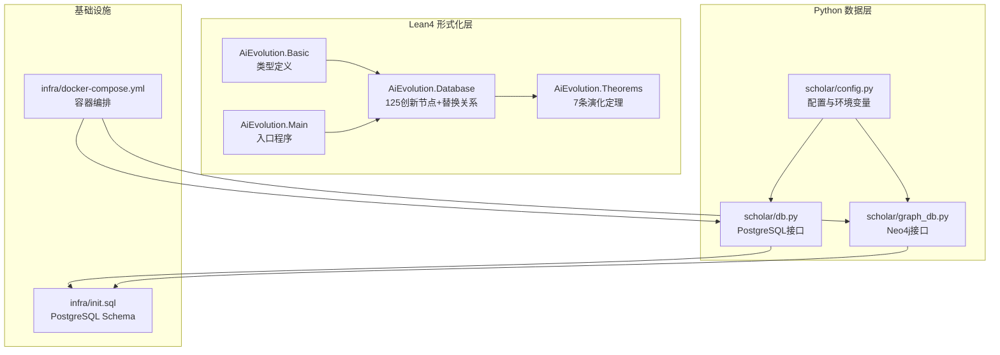
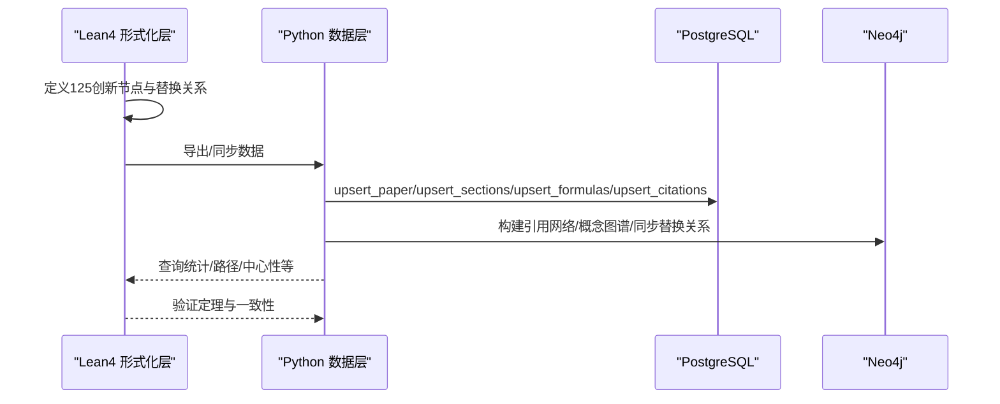
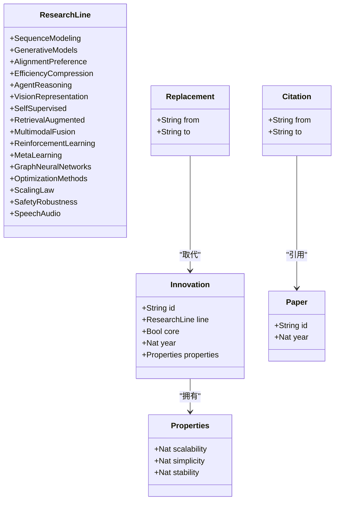
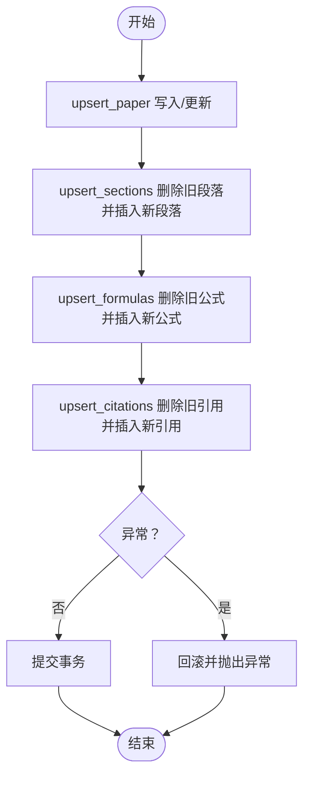
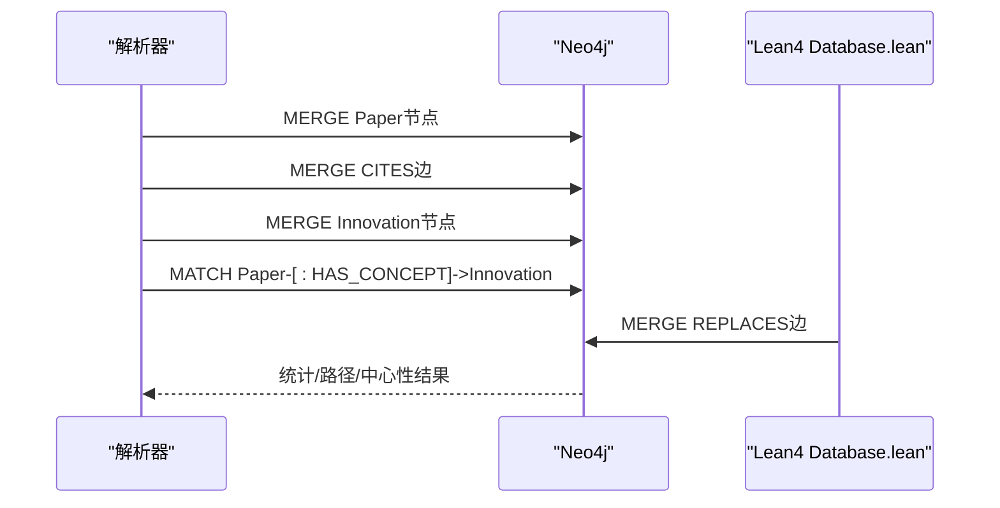
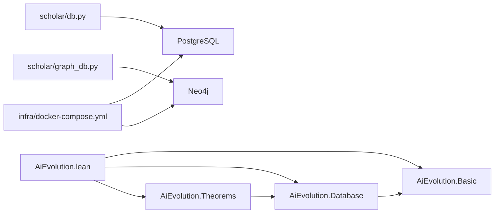

# 数据库集成与数据模型

<cite>
**本文档引用的文件**
- [Database.lean](file://LEAN/AiEvolution/Database.lean)
- [Basic.lean](file://LEAN/AiEvolution/Basic.lean)
- [Theorems.lean](file://LEAN/AiEvolution/Theorems.lean)
- [AiEvolution.lean](file://LEAN/AiEvolution.lean)
- [Main.lean](file://LEAN/Main.lean)
- [db.py](file://scholar/db.py)
- [graph_db.py](file://scholar/graph_db.py)
- [init.sql](file://infra/init.sql)
- [docker-compose.yml](file://infra/docker-compose.yml)
- [config.py](file://scholar/config.py)
- [README.md](file://README.md)
</cite>

## 目录
1. [简介](#简介)
2. [项目结构](#项目结构)
3. [核心组件](#核心组件)
4. [架构总览](#架构总览)
5. [详细组件分析](#详细组件分析)
6. [依赖关系分析](#依赖关系分析)
7. [性能考虑](#性能考虑)
8. [故障排除指南](#故障排除指南)
9. [结论](#结论)
10. [附录](#附录)

## 简介
本技术文档聚焦于Lean4与数据库系统的集成，涵盖在Lean4中访问和操作PostgreSQL与Neo4j数据库的方法，以及形式化验证与实际数据一致性保障。文档详细说明了125个创新节点的数据结构定义、字段含义、约束条件与关系连接；阐述了数据库查询在Lean4中的实现方式，包括复杂关系查询与聚合操作；解释了数据同步机制与事务处理策略；并提供了数据库schema的Lean4表示与数据迁移最佳实践。

## 项目结构
该项目采用多层架构：
- Lean4形式化层：定义研究线分类、创新节点属性、论文元数据与替换关系等核心类型与事实。
- Python数据层：提供PostgreSQL与Neo4j的访问接口，负责数据入库、查询与同步。
- 基础设施层：通过Docker编排PostgreSQL（含pgvector扩展）与Neo4j服务，提供稳定的数据库环境。

图表来源
- [AiEvolution.lean:1-7](file://LEAN/AiEvolution.lean#L1-L7)
- [Basic.lean:1-65](file://LEAN/AiEvolution/Basic.lean#L1-L65)
- [Database.lean:1-756](file://LEAN/AiEvolution/Database.lean#L1-L756)
- [Theorems.lean:1-168](file://LEAN/AiEvolution/Theorems.lean#L1-L168)
- [Main.lean:1-21](file://LEAN/Main.lean#L1-L21)
- [db.py:1-276](file://scholar/db.py#L1-L276)
- [graph_db.py:1-922](file://scholar/graph_db.py#L1-L922)
- [init.sql:1-131](file://infra/init.sql#L1-L131)
- [docker-compose.yml:1-44](file://infra/docker-compose.yml#L1-L44)

章节来源
- [README.md:217-263](file://README.md#L217-L263)

## 核心组件
- Lean4类型与事实
  - 研究线分类：16个研究线组织AI创新。
  - 创新节点：125个节点，包含id、所属研究线、是否核心、年份及三个维度属性（可扩展性、简洁性、稳定性）。
  - 论文记录：包含人类可读ID、年份等元数据。
  - 引用关系与替换关系：定义论文间引用与创新替代的结构化数据。
- Python数据库接口
  - PostgreSQL：提供论文、章节、公式、引用等表的增删改查与事务控制。
  - Neo4j：提供引用网络、概念图谱与Lean4创新节点同步能力。
- 基础设施
  - PostgreSQL Schema：定义papers、sections、formulas、citations、chunks、innovations、replacements等表及其索引。
  - Docker Compose：统一启动PostgreSQL（pgvector）与Neo4j服务。

章节来源
- [Basic.lean:10-63](file://LEAN/AiEvolution/Basic.lean#L10-L63)
- [Database.lean:11-170](file://LEAN/AiEvolution/Database.lean#L11-L170)
- [db.py:24-74](file://scholar/db.py#L24-L74)
- [graph_db.py:32-70](file://scholar/graph_db.py#L32-L70)
- [init.sql:9-131](file://infra/init.sql#L9-L131)
- [docker-compose.yml:1-44](file://infra/docker-compose.yml#L1-L44)

## 架构总览
系统通过Lean4形式化层定义数据模型与定理，Python层负责持久化与查询，基础设施层提供数据库服务。数据流从Lean4到PostgreSQL/Neo4j，再通过CLI与Agent工具提供查询与分析能力。

图表来源
- [Database.lean:617-753](file://LEAN/AiEvolution/Database.lean#L617-L753)
- [db.py:79-176](file://scholar/db.py#L79-L176)
- [graph_db.py:225-281](file://scholar/graph_db.py#L225-L281)

## 详细组件分析

### Lean4数据模型与定理证明
- 类型定义
  - ResearchLine：16个研究线枚举，覆盖序列建模、生成模型、对齐偏好、效率压缩、智能体推理、视觉表征、自监督学习、检索增强、多模态融合、强化学习、元学习、图神经网络、优化方法、缩放定律、安全鲁棒性、语音音频等。
  - Properties：量化属性，包含可扩展性、简洁性、稳定性三轴，取值范围为1-5。
  - Innovation：创新节点，包含id、line、core、year、properties。
  - Paper/Citation/Replacement：论文、引用、替换关系的结构化定义。
- 125创新节点
  - 按研究线分组，共覆盖9+10+9+11+8+8+10+8+8+8+6+6+8+5+8+3=125个节点。
  - 每个节点包含id、所属研究线、是否核心、年份与属性三轴的具体数值。
- 替换关系
  - replacesDb：定义创新节点间的“被取代”关系，用于形式化证明。
- 定理证明
  - dominates、scalesBetter、simpler、moreStable等谓词定义，证明替换关系在至少两个维度上严格优于前代。

图表来源
- [Basic.lean:11-63](file://LEAN/AiEvolution/Basic.lean#L11-L63)
- [Database.lean:18-170](file://LEAN/AiEvolution/Database.lean#L18-L170)

章节来源
- [Basic.lean:10-63](file://LEAN/AiEvolution/Basic.lean#L10-L63)
- [Database.lean:11-170](file://LEAN/AiEvolution/Database.lean#L11-L170)
- [Theorems.lean:23-44](file://LEAN/AiEvolution/Theorems.lean#L23-L44)

### PostgreSQL数据模型与查询实现
- Schema设计
  - papers：论文主表，包含id、标题、作者数组、年份、会议、摘要、arXiv/DOI、解析状态、节/公式/引用计数、阅读状态与时间戳。
  - sections/formulas：论文结构化文本与公式抽取。
  - citations：引用关系，支持未解析引用键与解析后的paper_id。
  - chunks：RAG向量索引块（pgvector）。
  - innovations/replacements：与Lean4同步的创新节点与替换关系。
- 查询与事务
  - upsert_paper：ON CONFLICT更新，保证幂等写入。
  - upsert_sections/upsert_formulas/upsert_citations：批量删除后插入，保持一致性。
  - cursor上下文管理器：自动commit/rollback，确保事务完整性。
  - list_papers/search_papers/get_stats：基础查询与统计。

图表来源
- [db.py:79-176](file://scholar/db.py#L79-L176)

章节来源
- [init.sql:9-131](file://infra/init.sql#L9-L131)
- [db.py:79-176](file://scholar/db.py#L79-L176)

### Neo4j数据模型与图谱构建
- 图谱三要素
  - 引用网络：Paper节点与CITES边，支持ref_key与解析后的ULID。
  - 概念图谱：Paper-:HAS_CONCEPT->Innovation，Innovation-:RELATED_TO->Innovation。
  - Lean4同步：Innovation节点与REPLACES边，来自Database.lean的replacesDb。
- 功能实现
  - build_citation_network：批量创建Paper节点与CITES边。
  - build_concept_graph：动态加载125创新节点，匹配论文概念并建立共现关系。
  - sync_lean4_replacements：从Lean4同步REPLACES关系。
  - get_citation_stats/get_citation_path/compute_centrality：引用网络分析与桥接论文发现。

图表来源
- [graph_db.py:225-281](file://scholar/graph_db.py#L225-L281)
- [graph_db.py:636-733](file://scholar/graph_db.py#L636-L733)
- [graph_db.py:794-806](file://scholar/graph_db.py#L794-L806)

章节来源
- [graph_db.py:225-281](file://scholar/graph_db.py#L225-L281)
- [graph_db.py:636-733](file://scholar/graph_db.py#L636-L733)
- [graph_db.py:794-806](file://scholar/graph_db.py#L794-L806)

### Lean4查询与复杂关系/聚合
- 查询模式
  - 直接访问Database模块中的创新节点与论文记录，结合Theorems中的谓词进行比较与排序。
  - Main中演示了如何打印特定节点的属性值，体现Lean4中的数据读取与格式化输出。
- 复杂关系与聚合
  - 在Lean4中可通过结构化类型与函数组合实现复杂比较（如dominates），并在定理中严格证明。
  - 对于跨表聚合，建议在Python层通过SQL完成（例如按年份统计、引用计数聚合），Lean4层负责逻辑验证与一致性检查。

章节来源
- [Main.lean:6-20](file://LEAN/Main.lean#L6-L20)
- [Theorems.lean:23-44](file://LEAN/AiEvolution/Theorems.lean#L23-L44)

### 数据同步机制与事务处理策略
- 同步策略
  - Lean4 → PostgreSQL：通过Python层将125创新节点与替换关系写入innovations与replacements表，保持与Lean4一致。
  - Lean4 → Neo4j：动态解析Database.lean生成Innovation节点与REPLACES边，确保形式化验证与图谱一致。
  - 引用网络：先写入未解析ref_key，再通过resolve_ref_keys进行规范化与重连。
- 事务处理
  - PostgreSQL：cursor上下文管理器自动commit/rollback，异常即回滚，保证幂等与一致性。
  - Neo4j：批处理UNWIND与MERGE，减少网络往返，提升吞吐。

章节来源
- [db.py:62-74](file://scholar/db.py#L62-L74)
- [graph_db.py:156-177](file://scholar/graph_db.py#L156-L177)
- [graph_db.py:794-806](file://scholar/graph_db.py#L794-L806)

### 数据库Schema的Lean4表示与迁移最佳实践
- Lean4表示
  - 通过Basic.lean中的结构体与枚举，将PostgreSQL/Neo4j的表结构映射为强类型数据模型，便于在Lean4中进行形式化验证。
- 迁移最佳实践
  - 版本化：每次Schema变更在init.sql中新增或ALTER，配合迁移脚本。
  - 兼容性：保留历史字段与默认值，逐步淘汰旧字段。
  - 同步校验：通过Lean4定理与Python层查询统计，验证迁移后数据一致性。

章节来源
- [Basic.lean:11-63](file://LEAN/AiEvolution/Basic.lean#L11-L63)
- [init.sql:9-131](file://infra/init.sql#L9-L131)

## 依赖关系分析
- 模块依赖
  - AiEvolution.lean导入Basic、Database、Theorems，形成完整的库入口。
  - Database.lean依赖Basic中的类型定义。
  - Theorems.lean依赖Database中的事实数据。
- 外部依赖
  - PostgreSQL：psycopg2，提供连接、事务与批量操作。
  - Neo4j：neo4j，提供Cypher执行与会话管理。
  - Docker：统一编排数据库服务，简化部署。

图表来源
- [AiEvolution.lean:1-7](file://LEAN/AiEvolution.lean#L1-L7)
- [Basic.lean:1-65](file://LEAN/AiEvolution/Basic.lean#L1-L65)
- [Database.lean:1-12](file://LEAN/AiEvolution/Database.lean#L1-L12)
- [Theorems.lean:1-14](file://LEAN/AiEvolution/Theorems.lean#L1-L14)
- [db.py:15-22](file://scholar/db.py#L15-L22)
- [graph_db.py:24-29](file://scholar/graph_db.py#L24-L29)
- [docker-compose.yml:1-44](file://infra/docker-compose.yml#L1-L44)

章节来源
- [AiEvolution.lean:1-7](file://LEAN/AiEvolution.lean#L1-L7)

## 性能考虑
- PostgreSQL
  - 批量插入：使用UNWIND与ON CONFLICT，减少往返次数。
  - 索引：为高频查询列建立索引（如papers.id、sections.paper_id、formulas.paper_id、citations.from_paper/to_paper）。
  - 连接池：生产环境建议引入连接池以降低连接开销。
- Neo4j
  - 批处理：UNWIND批量MERGE，减少网络往返。
  - 索引与约束：为Paper.ulid、Innovation.id建立唯一约束，加速查找。
  - 查询优化：合理使用OPTIONAL MATCH与LIMIT，避免全图扫描。
- Lean4
  - 定理证明：在Lean4中进行逻辑验证，减少运行时错误，间接提升整体系统可靠性。

## 故障排除指南
- PostgreSQL连接失败
  - 确认端口5433开放且凭据正确（docker-compose中已内置）。
  - 检查init.sql是否成功执行，确认扩展vector已加载。
- Neo4j连接失败
  - 确认7474/7687端口可用，认证凭据正确。
  - 检查apoc插件是否加载。
- 数据不一致
  - PostgreSQL：检查cursor上下文是否正确commit/rollback。
  - Neo4j：确认引用解析流程resolve_ref_keys是否执行，必要时重跑。
- Lean4同步异常
  - 确认Database.lean存在且可被graph_db.py解析，否则使用回退种子数据。

章节来源
- [db.py:32-44](file://scholar/db.py#L32-L44)
- [graph_db.py:39-49](file://scholar/graph_db.py#L39-L49)
- [docker-compose.yml:15-39](file://infra/docker-compose.yml#L15-L39)

## 结论
本项目通过Lean4形式化层与Python数据库层的协同，实现了从125个创新节点到论文、引用与概念图谱的全链路数据集成。PostgreSQL提供结构化存储与向量检索能力，Neo4j提供复杂关系与路径分析能力，Lean4则确保形式化验证与数据一致性。通过严格的事务处理与同步策略，系统能够在大规模数据场景下保持高可靠性和高性能。

## 附录
- 环境变量与配置
  - PostgreSQL：主机、端口、数据库名、用户名、密码。
  - Neo4j：URI、用户名、密码。
  - RAG嵌入：提供商、模型、维度、API Key。
- 常用命令
  - 启动数据库：./startup.ps1
  - 初始化：python -m scholar bootstrap
  - 统计：python -m scholar stats
  - 引用网络：python -m scholar cite-network

章节来源
- [config.py:42-61](file://scholar/config.py#L42-L61)
- [README.md:67-108](file://README.md#L67-L108)