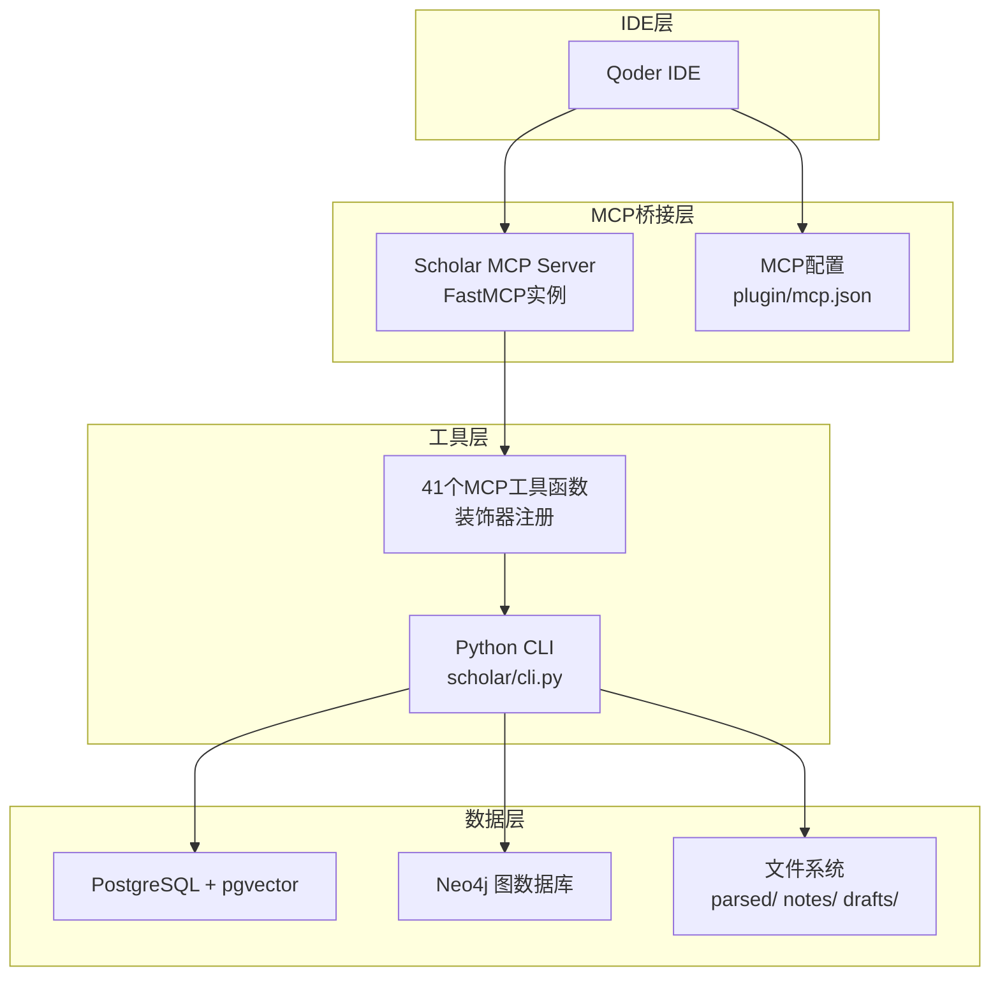
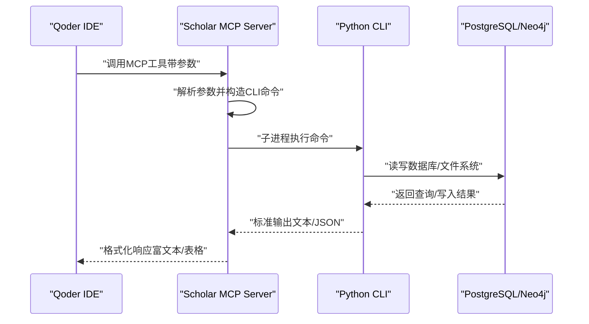
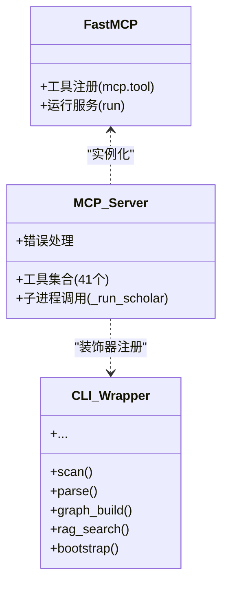
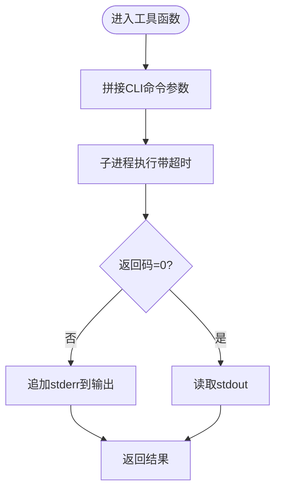
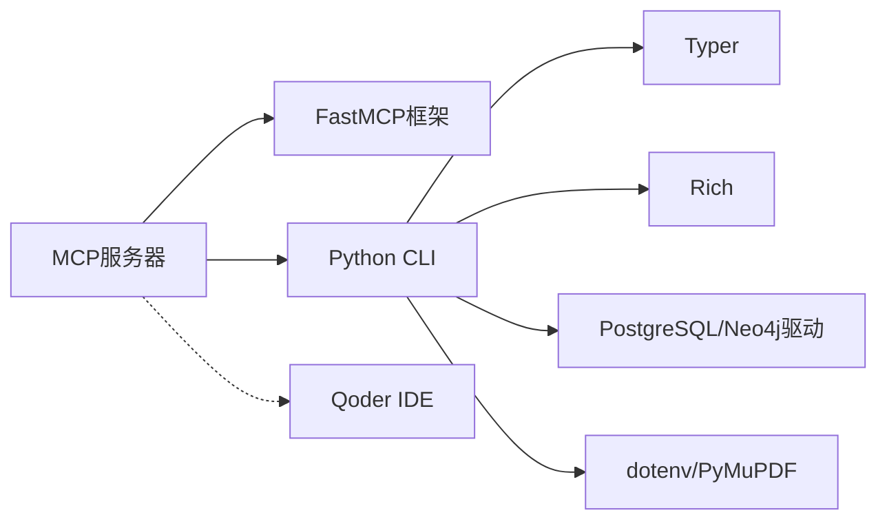

# MCP协议原理

<cite>
**本文档引用的文件**
- [scholar_mcp/server.py](file://scholar_mcp/server.py)
- [plugin/mcp.json](file://plugin/mcp.json)
- [scholar/__main__.py](file://scholar/__main__.py)
- [scholar/cli.py](file://scholar/cli.py)
- [requirements.txt](file://requirements.txt)
- [README.md](file://README.md)
- [plugin/commands/paper.md](file://plugin/commands/paper.md)
- [plugin/commands/find.md](file://plugin/commands/find.md)
- [plugin/commands/stats.md](file://plugin/commands/stats.md)
</cite>

## 目录
1. [简介](#简介)
2. [项目结构](#项目结构)
3. [核心组件](#核心组件)
4. [架构总览](#架构总览)
5. [详细组件分析](#详细组件分析)
6. [依赖分析](#依赖分析)
7. [性能考虑](#性能考虑)
8. [故障排除指南](#故障排除指南)
9. [结论](#结论)
10. [附录](#附录)

## 简介
本文件系统性阐述MCP（Model Context Protocol）协议在学术研究场景中的原理与实现，重点围绕Scholar MCP Server如何基于FastMCP框架将现有Python CLI命令桥接为MCP工具，以及这些工具在Qoder IDE中的集成与工作流。文档涵盖：
- MCP协议的核心概念与工作机制
- Scholar MCP Server的工具注册、消息传递与上下文管理
- FastMCP框架的使用与装饰器模式
- 相比传统REST/CLI API的优势（安全性、可扩展性、开发者体验）
- 协议规范的关键技术细节与最佳实践

## 项目结构
该项目采用“CLI工具层 + MCP桥接层 + IDE集成”的分层架构。其中：
- scholar/ 提供35个学术研究相关的CLI命令，覆盖论文解析、图谱构建、RAG检索、实验复现等能力
- scholar_mcp/ 将上述CLI命令包装为MCP工具，供Qoder IDE调用
- plugin/ 提供Qoder插件所需的技能、命令与MCP配置
- infra/ 提供PostgreSQL与Neo4j的Docker编排

**图表来源**
- [scholar_mcp/server.py:17-20](file://scholar_mcp/server.py#L17-L20)
- [plugin/mcp.json:1-16](file://plugin/mcp.json#L1-L16)
- [scholar/cli.py:23-29](file://scholar/cli.py#L23-L29)

**章节来源**
- [README.md:301-327](file://README.md#L301-L327)
- [plugin/mcp.json:1-16](file://plugin/mcp.json#L1-L16)
- [scholar_mcp/server.py:17-20](file://scholar_mcp/server.py#L17-L20)

## 核心组件
- FastMCP实例与工具注册
  - 通过FastMCP创建服务实例，并以装饰器方式批量注册工具函数，形成统一的MCP工具集合
- 子系统工具族
  - 论文库管理：扫描、解析、列表、统计、导出、年份/作者补全、批量预处理
  - 图谱与网络：图谱构建、概念查询、引用网络分析
  - RAG与检索：向量索引构建、语义搜索（支持混合检索）
  - 外部集成：arXiv搜索与下载
  - 知识库维护：增量入库、元数据补全、批量处理
  - 执行层：LaTeX编译、实验环境设置与运行、结果读取与日志诊断
  - 文件访问：读取解析后的JSON、自动生成的阅读笔记与质量评分、技能说明
- CLI桥接机制
  - 所有MCP工具最终通过子进程调用Python CLI入口，实现与现有功能的无缝衔接

**章节来源**
- [scholar_mcp/server.py:17-20](file://scholar_mcp/server.py#L17-L20)
- [scholar_mcp/server.py:41-340](file://scholar_mcp/server.py#L41-L340)
- [scholar/__main__.py:1-8](file://scholar/__main__.py#L1-L8)
- [scholar/cli.py:23-29](file://scholar/cli.py#L23-L29)

## 架构总览
Scholar MCP Server作为MCP服务器，负责：
- 初始化FastMCP实例并注册工具
- 接收来自IDE的工具调用请求
- 将请求参数转换为CLI命令参数
- 通过子进程执行CLI命令并返回结果
- 在IDE侧呈现结构化输出

**图表来源**
- [scholar_mcp/server.py:23-36](file://scholar_mcp/server.py#L23-L36)
- [scholar/__main__.py:1-8](file://scholar/__main__.py#L1-L8)
- [scholar/cli.py:13-19](file://scholar/cli.py#L13-L19)

## 详细组件分析

### FastMCP实例与工具注册
- 实例化与描述
  - 创建名为“Scholar Studio”的MCP服务器实例，附带项目说明
- 装饰器注册
  - 使用@mcp.tool()将大量Python函数注册为MCP工具，形成统一的工具目录
- 工具函数职责
  - 每个工具函数对应一个CLI命令，负责参数校验、子进程调用与错误合并

**图表来源**
- [scholar_mcp/server.py:17-20](file://scholar_mcp/server.py#L17-L20)
- [scholar_mcp/server.py:41-340](file://scholar_mcp/server.py#L41-L340)

**章节来源**
- [scholar_mcp/server.py:17-20](file://scholar_mcp/server.py#L17-L20)
- [scholar_mcp/server.py:41-340](file://scholar_mcp/server.py#L41-L340)

### 子进程调用与错误处理
- 参数到命令的映射
  - 工具函数将输入参数拼接到CLI命令行，支持可选参数与布尔开关
- 子进程执行
  - 通过Python子进程执行CLI入口，指定工作目录与超时时间
- 错误合并
  - 将stderr内容合并到输出，便于IDE侧统一展示

**图表来源**
- [scholar_mcp/server.py:23-36](file://scholar_mcp/server.py#L23-L36)

**章节来源**
- [scholar_mcp/server.py:23-36](file://scholar_mcp/server.py#L23-L36)

### 工具族与功能域划分
- 论文库管理
  - 扫描、解析、批量解析、信息查询、全文搜索、列表筛选、统计、导出、年份/作者补全
- 图谱与网络
  - 图谱构建（Neo4j）、概念查询、引用网络分析（全局/单篇）
- RAG与检索
  - 向量索引构建、语义搜索（支持混合检索）
- 外部与维护
  - arXiv搜索与下载、增量入库、元数据补全、批量处理
- 执行层
  - LaTeX编译（自动修复）、实验环境设置与运行、结果读取与日志诊断
- 文件访问
  - 读取解析后的JSON、阅读笔记、质量评分、技能说明

**章节来源**
- [scholar_mcp/server.py:41-340](file://scholar_mcp/server.py#L41-L340)
- [scholar/cli.py:46-800](file://scholar/cli.py#L46-L800)

### IDE集成与配置
- MCP配置
  - 通过plugin/mcp.json声明Scholar MCP Server的启动命令、参数与环境变量
- IDE侧加载
  - Qoder自动读取配置，启动MCP服务器并加载工具目录
- 命令与技能
  - plugin/commands/与plugin/skills/提供快捷指令与工作流，与MCP工具协同

**章节来源**
- [plugin/mcp.json:1-16](file://plugin/mcp.json#L1-L16)
- [README.md:109-128](file://README.md#L109-L128)
- [plugin/commands/paper.md:1-11](file://plugin/commands/paper.md#L1-L11)
- [plugin/commands/find.md:1-7](file://plugin/commands/find.md#L1-L7)
- [plugin/commands/stats.md:1-7](file://plugin/commands/stats.md#L1-L7)

## 依赖分析
- 外部依赖
  - mcp>=1.0：提供MCP协议与FastMCP框架
  - typer/rich：CLI框架与终端渲染
  - psycopg2-binary/neo4j：PostgreSQL与Neo4j客户端
  - python-dotenv/PyMuPDF：环境变量与PDF处理
- 内部耦合
  - MCP服务器与CLI模块通过子进程解耦，降低直接耦合风险
  - 工具函数集中于装饰器注册，便于扩展与维护

**图表来源**
- [requirements.txt:1-9](file://requirements.txt#L1-L9)
- [scholar_mcp/server.py:12-12](file://scholar_mcp/server.py#L12-L12)
- [scholar/cli.py:13-19](file://scholar/cli.py#L13-L19)

**章节来源**
- [requirements.txt:1-9](file://requirements.txt#L1-L9)
- [scholar_mcp/server.py:12-12](file://scholar_mcp/server.py#L12-L12)
- [scholar/cli.py:13-19](file://scholar/cli.py#L13-L19)

## 性能考虑
- 工具并发与超时
  - 不同工具设置不同超时（如批量解析、RAG索引、编译等），避免阻塞IDE交互
- 子进程隔离
  - 通过子进程执行CLI，隔离异常与资源占用，提升稳定性
- 数据库与外部API
  - 图谱构建与RAG索引涉及长耗时操作，建议在空闲时段执行或分批处理
- 输出控制
  - CLI侧使用表格与面板输出，MCP侧保持简洁文本，利于IDE渲染

[本节为通用指导，不直接分析具体文件]

## 故障排除指南
- Docker容器与端口
  - PostgreSQL默认端口5433，Neo4j端口7474/7687；若端口冲突，请调整docker-compose.yml
- RAG搜索无结果
  - 确认SCHOLAR_EMBEDDING_API_KEY有效；若无Key，RAG会回退至全文搜索
- Bootstrap中断恢复
  - 重复执行bootstrap可自动跳过已完成步骤；必要时可单独重跑parse-all/graph-build/rag-index
- Windows + VMware冲突
  - 若Docker Desktop无法启动WSL2后端，检查并重启相关虚拟机

**章节来源**
- [README.md:460-511](file://README.md#L460-L511)

## 结论
Scholar MCP Server通过FastMCP框架与装饰器模式，将成熟的Python CLI工具集无缝接入Qoder IDE，实现了：
- 更强的安全性：工具在受控子进程中执行，避免直接暴露底层接口
- 更好的可扩展性：新增工具仅需添加函数并使用@mcp.tool()装饰
- 更佳的开发者体验：IDE侧统一的工具目录与参数提示，配合丰富的学术工作流

该实现为学术研究场景提供了标准化、可复用的MCP集成范式。

[本节为总结性内容，不直接分析具体文件]

## 附录

### MCP协议要点与最佳实践
- 协议要点
  - 工具注册：通过装饰器或显式注册将函数暴露为MCP工具
  - 消息传递：请求/响应模型，参数与返回值以结构化形式传输
  - 上下文管理：工具可在会话中携带上下文状态，支持多步协作
- 最佳实践
  - 将复杂逻辑封装为CLI命令，MCP层仅做参数转发与结果整合
  - 为每个工具设定合理超时与错误处理策略
  - 在IDE侧提供清晰的工具描述与参数说明，提升可用性

[本节为概念性内容，不直接分析具体文件]