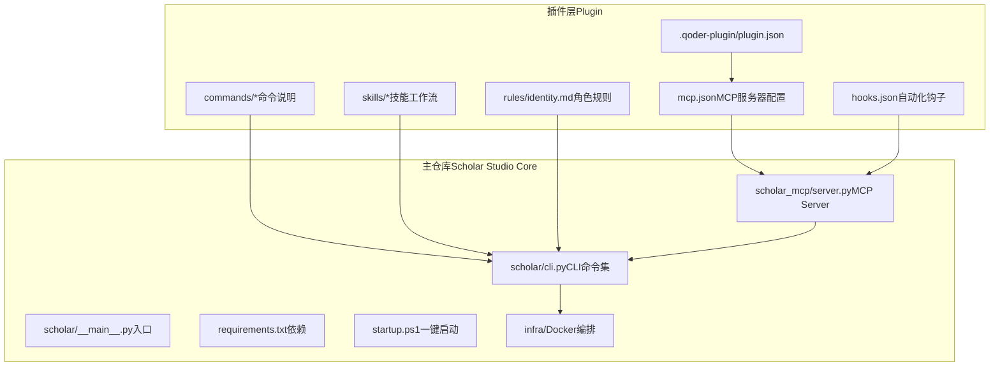
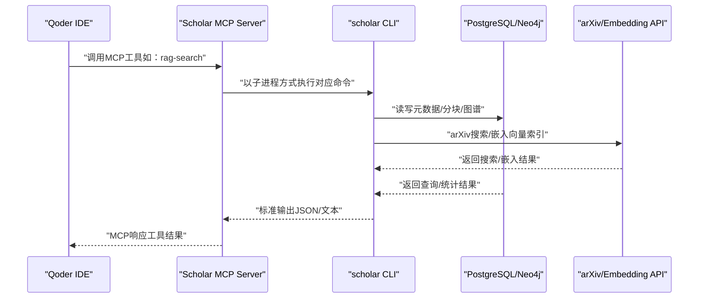
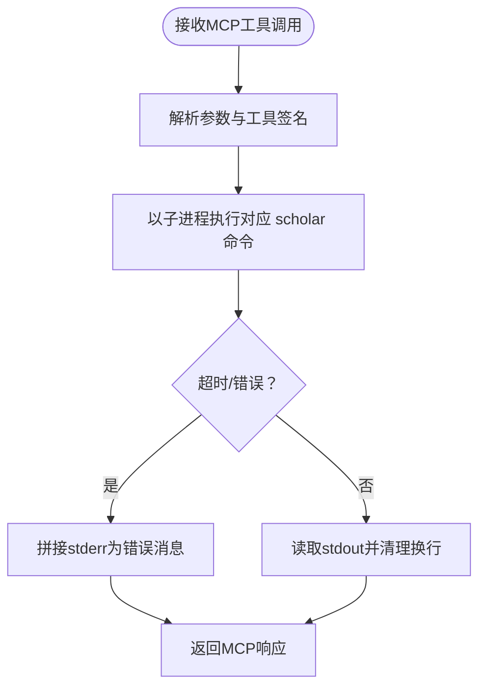
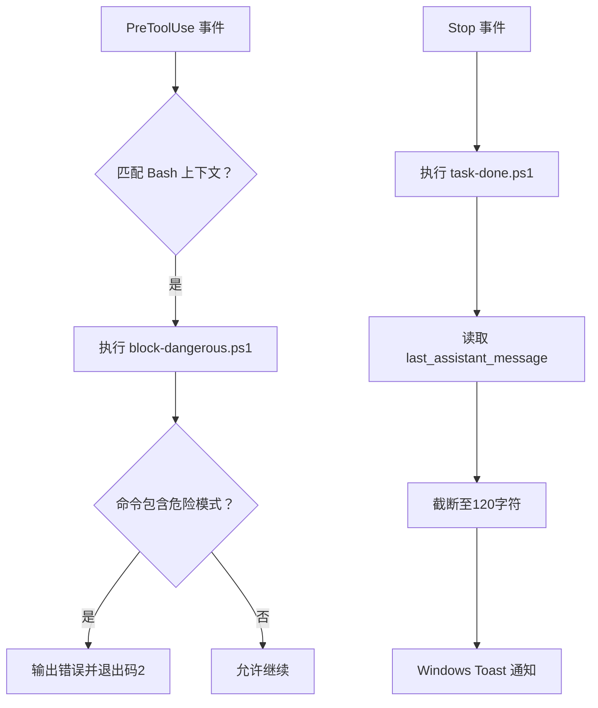
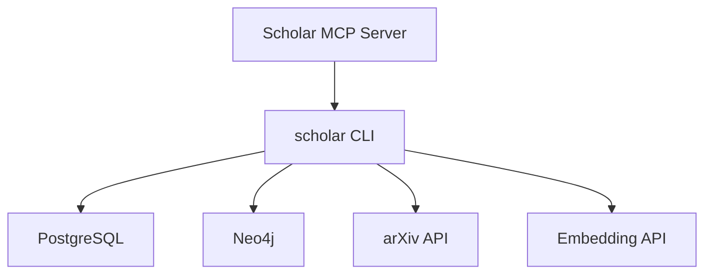

# MCP智能协作

<cite>
**本文档引用的文件**
- [plugin/mcp.json](file://plugin/mcp.json)
- [scholar_mcp/server.py](file://scholar_mcp/server.py)
- [plugin/hooks/hooks.json](file://plugin/hooks/hooks.json)
- [plugin/hooks/task-done.ps1](file://plugin/hooks/task-done.ps1)
- [plugin/hooks/block-dangerous.ps1](file://plugin/hooks/block-dangerous.ps1)
- [plugin/.qoder-plugin/plugin.json](file://plugin/.qoder-plugin/plugin.json)
- [requirements.txt](file://requirements.txt)
- [startup.ps1](file://startup.ps1)
- [plugin/README.md](file://plugin/README.md)
- [scholar/__main__.py](file://scholar/__main__.py)
- [scholar/cli.py](file://scholar/cli.py)
- [plugin/CONNECTORS.md](file://plugin/CONNECTORS.md)
- [plugin/commands/stats.md](file://plugin/commands/stats.md)
- [plugin/commands/find.md](file://plugin/commands/find.md)
- [plugin/commands/paper.md](file://plugin/commands/paper.md)
- [plugin/commands/health.md](file://plugin/commands/health.md)
- [plugin/rules/identity.md](file://plugin/rules/identity.md)
</cite>

## 目录
1. [简介](#简介)
2. [项目结构](#项目结构)
3. [核心组件](#核心组件)
4. [架构总览](#架构总览)
5. [详细组件分析](#详细组件分析)
6. [依赖关系分析](#依赖关系分析)
7. [性能考量](#性能考量)
8. [故障排查指南](#故障排查指南)
9. [结论](#结论)
10. [附录](#附录)

## 简介
本文件面向“MCP智能协作系统”的使用者与开发者，系统性阐述MCP（Model Context Protocol）协议在学术研究场景中的应用与落地。文档围绕Scholar MCP Server展开，覆盖其41个工具的注册与管理、与Qoder IDE的桥接机制、自动化钩子系统（任务完成通知与危险操作拦截）、hooks.json配置文件的作用与自定义钩子开发方法、MCP服务器的配置与安全注意事项、客户端集成与扩展开发指南，以及协作工作流的设计理念与实际应用场景。

## 项目结构
该仓库采用“插件 + 主仓库”双层架构：
- 插件层（plugin/）：提供14个Skills、4个Commands、1条Rules、2个Hooks、1个MCP Server配置，负责定义“做什么、怎么做”，并通过MCP桥接到主仓库的Python CLI。
- 主仓库（scholar/、scholar_mcp/）：提供完整的学术研究工具链（35个CLI命令、445+论文解析数据、PostgreSQL/Neo4j基础设施），作为“执行层”。

图表来源
- [plugin/.qoder-plugin/plugin.json:1-23](file://plugin/.qoder-plugin/plugin.json#L1-L23)
- [plugin/mcp.json:1-16](file://plugin/mcp.json#L1-L16)
- [scholar_mcp/server.py:1-573](file://scholar_mcp/server.py#L1-L573)
- [scholar/cli.py:1-800](file://scholar/cli.py#L1-L800)
- [startup.ps1:1-65](file://startup.ps1#L1-L65)

章节来源
- [plugin/README.md:1-79](file://plugin/README.md#L1-L79)
- [plugin/.qoder-plugin/plugin.json:1-23](file://plugin/.qoder-plugin/plugin.json#L1-L23)
- [plugin/mcp.json:1-16](file://plugin/mcp.json#L1-L16)
- [scholar_mcp/server.py:1-573](file://scholar_mcp/server.py#L1-L573)
- [scholar/cli.py:1-800](file://scholar/cli.py#L1-L800)
- [startup.ps1:1-65](file://startup.ps1#L1-L65)

## 核心组件
- Scholar MCP Server：基于FastMCP封装，将scholar CLI命令暴露为MCP工具，统一由Qoder IDE调用。
- Hooks系统：通过hooks.json定义事件钩子（PreToolUse、Stop），在Windows PowerShell环境下执行task-done.ps1与block-dangerous.ps1。
- CLI命令集：主仓库提供35个学术研究相关命令，涵盖论文扫描、解析、搜索、RAG、图谱构建、实验复现、编译等。
- 连接器与基础设施：PostgreSQL（元数据与分块）、Neo4j（引用与概念图谱）、可选智谱Embedding API（RAG向量索引）。
- 插件配置：plugin.json集中声明插件元信息、技能、命令、规则、钩子与MCP服务器位置。

章节来源
- [scholar_mcp/server.py:1-573](file://scholar_mcp/server.py#L1-L573)
- [plugin/hooks/hooks.json:1-27](file://plugin/hooks/hooks.json#L1-L27)
- [plugin/hooks/task-done.ps1:1-24](file://plugin/hooks/task-done.ps1#L1-L24)
- [plugin/hooks/block-dangerous.ps1:1-24](file://plugin/hooks/block-dangerous.ps1#L1-L24)
- [plugin/.qoder-plugin/plugin.json:1-23](file://plugin/.qoder-plugin/plugin.json#L1-L23)
- [plugin/CONNECTORS.md:1-45](file://plugin/CONNECTORS.md#L1-L45)
- [scholar/cli.py:1-800](file://scholar/cli.py#L1-L800)

## 架构总览
下图展示了MCP在学术研究中的端到端协作流程：IDE侧通过MCP调用Scholar MCP Server，Server以子进程方式执行scholar CLI命令，CLI再访问数据库与外部服务完成具体任务。

图表来源
- [scholar_mcp/server.py:23-36](file://scholar_mcp/server.py#L23-L36)
- [scholar/cli.py:1-800](file://scholar/cli.py#L1-L800)
- [plugin/CONNECTORS.md:1-45](file://plugin/CONNECTORS.md#L1-L45)

## 详细组件分析

### Scholar MCP Server（41个工具注册与管理）
- 工具注册：通过装饰器将scholar CLI命令映射为MCP工具，统一参数校验与错误处理。
- 工具分类：论文库（扫描、解析、统计、导出）、图谱与网络（构建、查询、引用分析）、RAG（索引、搜索）、外部接口（arXiv搜索）、元数据补全（作者、年份、引用解析）、批量预处理（自动生成笔记、质量评分、分类）、编排（引导式工作流）、文件访问（读取解析数据/笔记/质量评分）、知识库更新（下载、批量导入、元数据增强）、执行层（编译LaTeX、运行/比较/调试实验、数据集下载）。
- 错误处理：捕获子进程返回码与stderr，统一拼接到输出；超时控制保障稳定性。
- 资源依赖：依赖PostgreSQL、Neo4j、可选Embedding API；通过环境变量配置连接参数。

图表来源
- [scholar_mcp/server.py:23-36](file://scholar_mcp/server.py#L23-L36)
- [scholar_mcp/server.py:41-573](file://scholar_mcp/server.py#L41-L573)

章节来源
- [scholar_mcp/server.py:1-573](file://scholar_mcp/server.py#L1-L573)

### 与Qoder IDE的桥接机制
- 插件配置：plugin.json声明技能、命令、规则、钩子与MCP服务器位置，IDE加载后即可识别。
- MCP服务器：mcp.json定义Scholar MCP Server的启动命令、参数与环境变量（数据库与图数据库URI）。
- 工具可见性：IDE侧通过MCP协议发现并调用Scholar MCP Server提供的41个工具，无需直接接触底层CLI。

图表来源
- [plugin/.qoder-plugin/plugin.json:1-23](file://plugin/.qoder-plugin/plugin.json#L1-L23)
- [plugin/mcp.json:1-16](file://plugin/mcp.json#L1-L16)
- [scholar_mcp/server.py:1-573](file://scholar_mcp/server.py#L1-L573)

章节来源
- [plugin/.qoder-plugin/plugin.json:1-23](file://plugin/.qoder-plugin/plugin.json#L1-L23)
- [plugin/mcp.json:1-16](file://plugin/mcp.json#L1-L16)

### 自动化钩子系统（hooks.json、task-done.ps1、block-dangerous.ps1）
- hooks.json：定义两类钩子
  - Stop：任务完成后触发，调用task-done.ps1弹出Windows气泡通知。
  - PreToolUse：工具使用前触发，匹配Bash上下文，调用block-dangerous.ps1拦截危险命令。
- task-done.ps1：从标准输入读取JSON，提取最后一条助手消息，截断至120字符，使用Windows Forms弹出Toast通知。
- block-dangerous.ps1：从标准输入读取工具输入命令，匹配DROP/ TRUNCATE/ rm -rf/ docker rm/volume prune/system prune等危险操作，命中即输出错误并退出码2阻止执行。

图表来源
- [plugin/hooks/hooks.json:1-27](file://plugin/hooks/hooks.json#L1-L27)
- [plugin/hooks/task-done.ps1:1-24](file://plugin/hooks/task-done.ps1#L1-L24)
- [plugin/hooks/block-dangerous.ps1:1-24](file://plugin/hooks/block-dangerous.ps1#L1-L24)

章节来源
- [plugin/hooks/hooks.json:1-27](file://plugin/hooks/hooks.json#L1-L27)
- [plugin/hooks/task-done.ps1:1-24](file://plugin/hooks/task-done.ps1#L1-L24)
- [plugin/hooks/block-dangerous.ps1:1-24](file://plugin/hooks/block-dangerous.ps1#L1-L24)

### hooks.json配置文件详解与自定义钩子开发
- 配置结构：description、hooks对象，按事件类型组织多个钩子组。
- 事件类型：
  - Stop：任务结束时触发，常用于通知与收尾。
  - PreToolUse：工具调用前触发，常用于安全拦截与输入校验。
- 匹配器：matcher字段用于限定触发上下文（如Bash）。
- 命令钩子：type为command时，command字段为可执行命令（支持环境变量替换）。
- 自定义开发要点：
  - 使用标准输入读取IDE传入的上下文JSON。
  - 在钩子脚本中进行业务判断（如正则匹配、权限检查）。
  - 正确设置退出码（0表示允许，非0表示拒绝或异常）。
  - 注意跨平台兼容性（当前脚本为PowerShell，Windows环境）。

章节来源
- [plugin/hooks/hooks.json:1-27](file://plugin/hooks/hooks.json#L1-L27)

### MCP服务器配置指南（端口、认证、安全）
- 端口与传输：MCP协议由FastMCP实现，具体端口与传输细节由Qoder IDE与MCP Server协商决定；本仓库未显式配置固定端口，建议遵循IDE默认行为。
- 认证机制：当前未见专用认证配置；建议结合IDE侧会话与沙箱策略使用。
- 安全考虑：
  - 通过hooks.json的PreToolUse钩子拦截危险命令（DROP/TRUNCATE/rm -rf/docker rm等）。
  - 限制工具调用范围与参数，避免越权操作。
  - 将Scholar MCP Server置于受控网络环境中，避免暴露给不受信任的外部网络。
  - 严格管理环境变量（数据库URI、API密钥）与文件系统权限。

章节来源
- [plugin/hooks/block-dangerous.ps1:1-24](file://plugin/hooks/block-dangerous.ps1#L1-L24)
- [plugin/hooks/hooks.json:1-27](file://plugin/hooks/hooks.json#L1-L27)
- [plugin/mcp.json:1-16](file://plugin/mcp.json#L1-L16)

### 客户端集成示例与扩展开发指南
- 客户端集成：
  - 在QoderWork → 插件市场安装Scholar Studio插件，或手动导入zip包。
  - 插件加载后，IDE侧自动发现14个Skills、4个Commands、1条Rules与Scholar MCP Server。
  - 输入“调研 Transformer”触发research-survey；输入“知识库状态”触发stats命令。
- 扩展开发：
  - 新增CLI命令：在scholar/cli.py中添加Typer命令，遵循现有风格（typer.Option、rich输出、错误处理）。
  - 暴露为MCP工具：在scholar_mcp/server.py中使用@mcp.tool()装饰器包装对应函数，保持参数与返回值一致。
  - 更新插件清单：在plugin.json中同步skills/commands/mcpServers指向。
  - 验证与测试：使用python -m scholar <command>本地验证功能，再在IDE中测试MCP工具。

章节来源
- [plugin/README.md:1-79](file://plugin/README.md#L1-L79)
- [plugin/.qoder-plugin/plugin.json:1-23](file://plugin/.qoder-plugin/plugin.json#L1-L23)
- [scholar/cli.py:1-800](file://scholar/cli.py#L1-L800)
- [scholar_mcp/server.py:1-573](file://scholar_mcp/server.py#L1-L573)

### 协作工作流设计理念与应用场景
- 设计理念：
  - 数据驱动：所有学术声明以output/parsed/<ULID>.json中的结构化数据为依据。
  - 引用准确：使用paper_id格式，确保引用可追溯。
  - 公式精确：从JSON的formulas字段提取LaTeX，避免记忆偏差。
  - 增量操作：批量处理逐条执行，失败不阻塞整体。
  - 输出约定：生成内容统一输出到output/目录，便于复用与审计。
- 应用场景：
  - 文献调研：arXiv搜索 → 下载TeX → 批量解析 → RAG检索 → 图谱查询 → 生成综述。
  - 单篇深度分析：解析 → 自动生成笔记 → 质量评分 → 引用网络分析 → 数学验证。
  - 实验复现：环境准备 → 代码运行 → 结果对比 → 失败诊断 → 报告生成。
  - 写作流水线：调研 → 撰写 → 编译 → 审稿 → 修改 → 再编译。

章节来源
- [plugin/rules/identity.md:1-69](file://plugin/rules/identity.md#L1-L69)
- [plugin/commands/stats.md:1-7](file://plugin/commands/stats.md#L1-L7)
- [plugin/commands/find.md:1-7](file://plugin/commands/find.md#L1-L7)
- [plugin/commands/paper.md:1-11](file://plugin/commands/paper.md#L1-L11)
- [plugin/commands/health.md:1-10](file://plugin/commands/health.md#L1-L10)

## 依赖关系分析
- 外部依赖：PostgreSQL（元数据与分块）、Neo4j（图谱）、可选智谱Embedding API（向量索引）。
- 内部耦合：MCP Server依赖scholar CLI；CLI依赖数据库模块与外部API；IDE通过MCP协议间接调用。
- 环境变量：Scholar MCP Server通过环境变量传递数据库与图数据库连接信息。

图表来源
- [plugin/CONNECTORS.md:1-45](file://plugin/CONNECTORS.md#L1-L45)
- [plugin/mcp.json:1-16](file://plugin/mcp.json#L1-L16)
- [scholar_mcp/server.py:1-573](file://scholar_mcp/server.py#L1-L573)

章节来源
- [plugin/CONNECTORS.md:1-45](file://plugin/CONNECTORS.md#L1-L45)
- [plugin/mcp.json:1-16](file://plugin/mcp.json#L1-L16)
- [requirements.txt:1-9](file://requirements.txt#L1-L9)

## 性能考量
- 子进程开销：MCP工具每次调用均以子进程执行scholar命令，建议合理设置超时与并发上限。
- I/O密集：论文解析、RAG索引、图谱构建为I/O密集任务，建议使用SSD与充足内存。
- 网络依赖：arXiv与Embedding API请求可能成为瓶颈，建议缓存与限流。
- 数据库优化：合理索引与分页查询，避免一次性加载大量数据。

## 故障排查指南
- 服务未就绪：使用startup.ps1等待PostgreSQL与Neo4j健康检查，确认容器状态。
- MCP工具无响应：检查mcp.json中命令与环境变量；确认Scholar MCP Server进程正常。
- 危险命令被拦截：block-dangerous.ps1会阻止DROP/TRUNCATE/rm -rf/docker rm等命令，检查命令合法性。
- 任务完成通知无效：确认task-done.ps1可执行且Windows通知可用。
- CLI命令失败：查看stderr输出，定位数据库连接、API密钥或文件路径问题。

章节来源
- [startup.ps1:1-65](file://startup.ps1#L1-L65)
- [plugin/hooks/block-dangerous.ps1:1-24](file://plugin/hooks/block-dangerous.ps1#L1-L24)
- [plugin/hooks/task-done.ps1:1-24](file://plugin/hooks/task-done.ps1#L1-L24)
- [plugin/mcp.json:1-16](file://plugin/mcp.json#L1-L16)

## 结论
本系统通过MCP协议将强大的学术研究CLI工具链无缝接入Qoder IDE，配合hooks.json实现安全与体验增强。Scholar MCP Server以41个工具覆盖从论文解析、RAG检索、图谱分析到实验复现与写作编译的全流程，满足复杂学术协作需求。通过规范化的插件配置与扩展开发流程，团队可在此基础上持续迭代，解锁更多研究工作流与技能。

## 附录
- 快速启动：执行startup.ps1启动数据库与图数据库，安装依赖后运行bootstrap完成初始化。
- 常用命令：stats、search、rag-search、graph-build、bootstrap等，详见各命令说明与CLI实现。

章节来源
- [startup.ps1:1-65](file://startup.ps1#L1-L65)
- [plugin/commands/stats.md:1-7](file://plugin/commands/stats.md#L1-L7)
- [plugin/commands/find.md:1-7](file://plugin/commands/find.md#L1-L7)
- [plugin/commands/paper.md:1-11](file://plugin/commands/paper.md#L1-L11)
- [plugin/commands/health.md:1-10](file://plugin/commands/health.md#L1-L10)
- [scholar/cli.py:1-800](file://scholar/cli.py#L1-L800)