# MCP服务器实现

<cite>
**本文档引用的文件**
- [server.py](file://scholar_mcp/server.py)
- [cli.py](file://scholar/cli.py)
- [__main__.py](file://scholar/__main__.py)
- [config.py](file://scholar/config.py)
- [db.py](file://scholar/db.py)
- [mcp.json](file://plugin/mcp.json)
- [requirements.txt](file://requirements.txt)
</cite>

## 目录
1. [简介](#简介)
2. [项目结构](#项目结构)
3. [核心组件](#核心组件)
4. [架构概览](#架构概览)
5. [详细组件分析](#详细组件分析)
6. [依赖关系分析](#依赖关系分析)
7. [性能考虑](#性能考虑)
8. [故障排除指南](#故障排除指南)
9. [结论](#结论)

## 简介

Scholar MCP Server是一个基于FastMCP框架的学术研究工具服务器，它将Scholar CLI工具集包装为MCP（Model Context Protocol）工具，为Qoder IDE提供原生集成能力。该系统包含445+篇AI论文的知识库，支持引用图谱、Lean4形式化验证、混合标识符解析、知识库更新和执行层等功能。

该服务器通过子进程方式调用scholar CLI命令，实现了从论文解析、元数据补全到实验执行的完整学术研究工作流。

## 项目结构

项目采用模块化架构，主要包含以下核心模块：

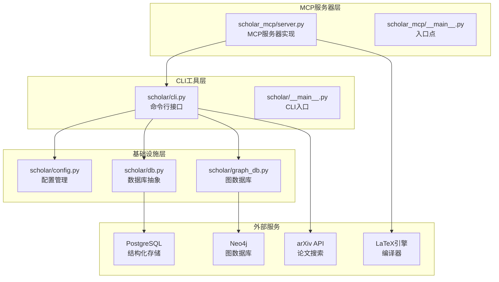

**图表来源**
- [server.py:1-573](file://scholar_mcp/server.py#L1-L573)
- [cli.py:1-2129](file://scholar/cli.py#L1-L2129)
- [config.py:1-116](file://scholar/config.py#L1-L116)

**章节来源**
- [server.py:1-50](file://scholar_mcp/server.py#L1-L50)
- [requirements.txt:1-9](file://requirements.txt#L1-L9)

## 核心组件

### FastMCP实例初始化

服务器使用FastMCP框架创建MCP服务器实例，配置了详细的指令说明和服务器信息：

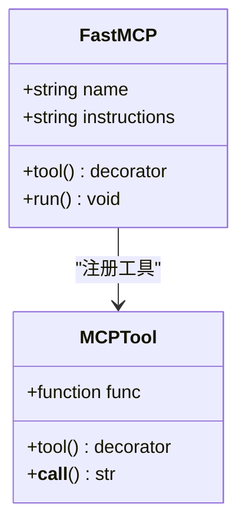

**图表来源**
- [server.py:17-20](file://scholar_mcp/server.py#L17-L20)

### 工具函数注册机制

所有工具函数都通过`@mcp.tool()`装饰器进行注册，形成统一的工具接口：

- **论文库管理工具**：扫描、解析、搜索、统计等基础操作
- **图网络分析工具**：构建图谱、查询概念、引用网络分析
- **RAG检索工具**：向量索引构建、语义搜索
- **元数据补全工具**：作者修复、引用解析、年份修正
- **批量预处理工具**：自动生成笔记、质量评分、分类标签
- **编排工作流工具**：引导式工作流、研究调查、领域景观分析
- **文件访问工具**：读取解析结果、技能说明文档
- **知识库更新工具**：arXiv下载、批量导入、元数据增强
- **执行层工具**：LaTeX编译、实验运行、数据集下载

**章节来源**
- [server.py:41-573](file://scholar_mcp/server.py#L41-L573)

## 架构概览

Scholar MCP Server采用分层架构设计，实现了MCP协议与Scholar CLI工具的桥接：

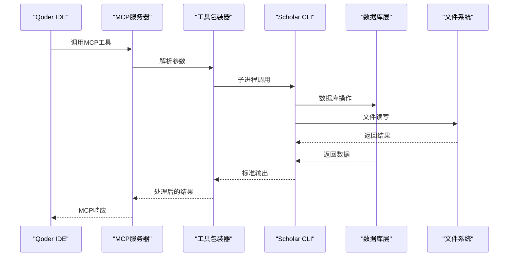

**图表来源**
- [server.py:23-36](file://scholar_mcp/server.py#L23-L36)
- [cli.py:1-30](file://scholar/cli.py#L1-L30)

### 超时控制策略

服务器实现了多级超时控制机制：

1. **默认超时**：120秒，适用于大多数工具
2. **长任务超时**：300-600秒，适用于批量处理
3. **极长任务超时**：1200秒，适用于引导式初始化
4. **子进程超时**：通过subprocess.run的timeout参数控制

**章节来源**
- [server.py:23-36](file://scholar_mcp/server.py#L23-L36)

## 详细组件分析

### 论文库管理模块

论文库管理是系统的基础功能模块，提供了完整的论文生命周期管理：

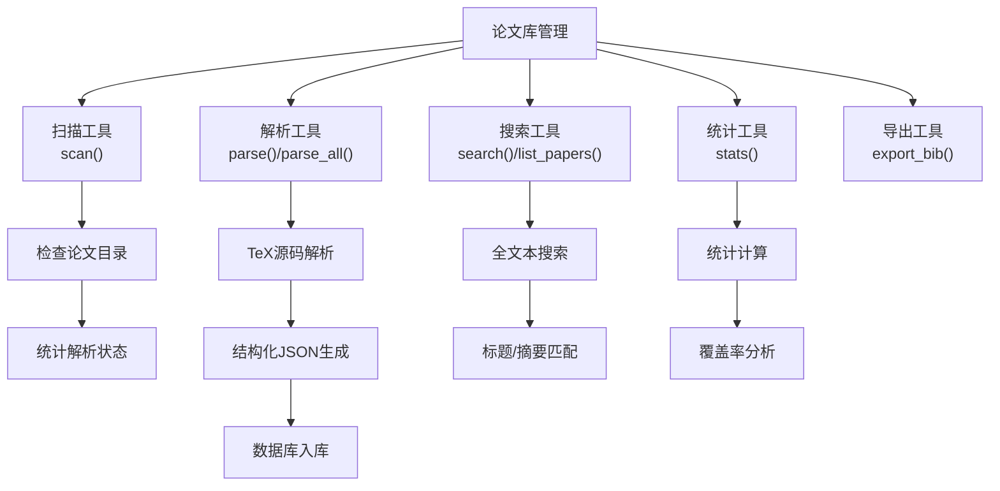

**图表来源**
- [server.py:41-123](file://scholar_mcp/server.py#L41-L123)
- [cli.py:46-127](file://scholar/cli.py#L46-L127)

#### 核心功能详解

**论文扫描工具** (`scholar_scan`)
- 功能：扫描论文目录，显示解析状态
- 输入：无
- 输出：表格化的论文状态信息
- 错误处理：目录不存在时返回错误信息

**批量解析工具** (`scholar_parse_all`)
- 功能：批量解析未解析的论文
- 超时：600秒
- 进度反馈：实时进度条显示
- 错误恢复：单个论文失败不影响整体流程

**章节来源**
- [server.py:41-123](file://scholar_mcp/server.py#L41-L123)
- [cli.py:175-237](file://scholar/cli.py#L175-L237)

### 图网络分析模块

图网络分析模块提供了复杂的研究网络可视化和分析能力：

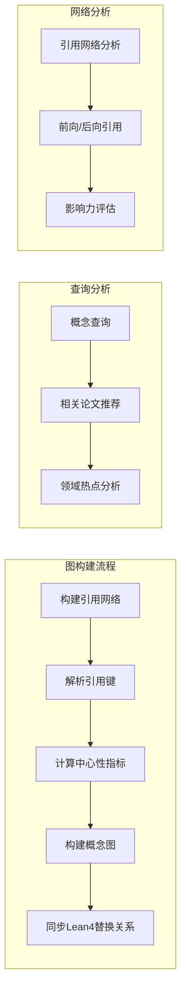

**图表来源**
- [server.py:127-156](file://scholar_mcp/server.py#L127-L156)
- [cli.py:663-706](file://scholar/cli.py#L663-L706)

#### 核心功能详解

**图构建工具** (`scholar_graph_build`)
- 功能：构建引用网络、概念图和Lean4替换关系
- 依赖：Neo4j数据库
- 超时：300秒
- 输出：详细的图构建统计信息

**引用网络分析** (`scholar_cite_network`)
- 功能：分析论文的引用关系
- 单篇分析：前向和后向引用分析
- 全局分析：网络统计指标

**章节来源**
- [server.py:127-156](file://scholar_mcp/server.py#L127-L156)
- [cli.py:838-889](file://scholar/cli.py#L838-L889)

### RAG检索模块

RAG（Retrieval-Augmented Generation）模块提供了先进的语义检索能力：

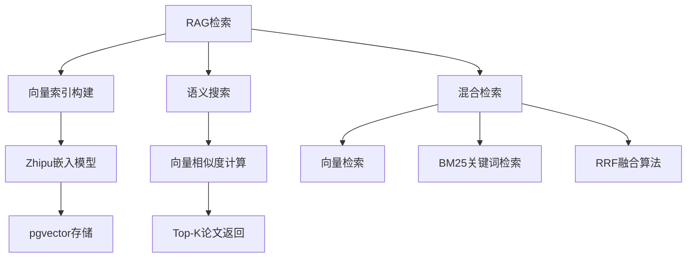

**图表来源**
- [server.py:160-180](file://scholar_mcp/server.py#L160-L180)
- [cli.py:928-993](file://scholar/cli.py#L928-L993)

#### 核心功能详解

**向量索引构建** (`scholar_rag_index`)
- 功能：使用Zhipu embedding-2模型构建向量索引
- 环境要求：SCHOLAR_EMBEDDING_API_KEY
- 超时：600秒
- 存储：PostgreSQL + pgvector

**语义搜索** (`scholar_rag_search`)
- 功能：自然语言语义检索
- 混合模式：向量+BM25+RRF融合
- 性能优化：向量相似度阈值过滤

**章节来源**
- [server.py:160-180](file://scholar_mcp/server.py#L160-L180)
- [cli.py:954-993](file://scholar/cli.py#L954-L993)

### 元数据补全模块

元数据补全模块确保知识库的完整性和准确性：

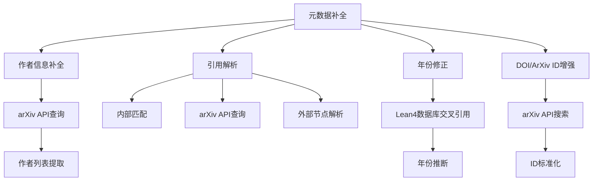

**图表来源**
- [server.py:197-227](file://scholar_mcp/server.py#L197-L227)
- [cli.py:529-600](file://scholar/cli.py#L529-L600)

#### 核心功能详解

**作者信息补全** (`scholar_author_fix`)
- 功能：通过arXiv API补全缺失的作者信息
- 限制：默认最多查询50篇论文
- 应用：支持dry-run和实际应用两种模式

**引用解析** (`scholar_cite_resolve`)
- 功能：解析论文引用，支持多种解析策略
- 内部匹配：基于知识库内部引用
- 外部查询：arXiv API和Neo4j外部节点

**章节来源**
- [server.py:197-227](file://scholar_mcp/server.py#L197-L227)
- [cli.py:1127-1172](file://scholar/cli.py#L1127-L1172)

### 批量预处理模块

批量预处理模块提供高效的论文自动化处理能力：

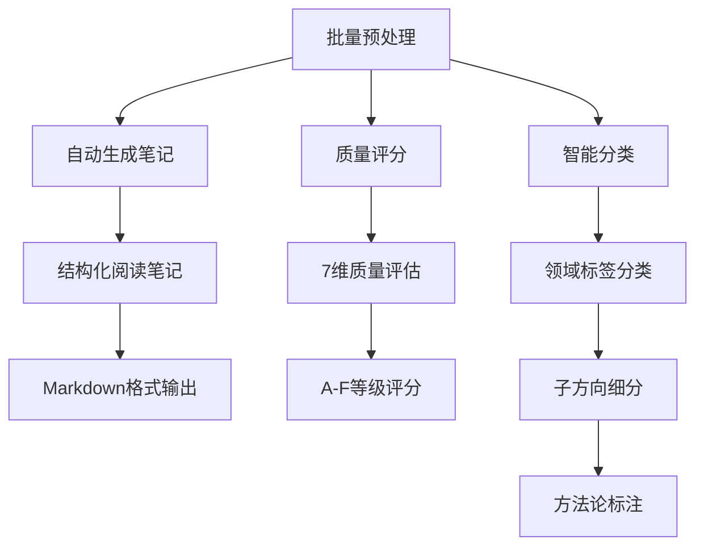

**图表来源**
- [server.py:231-280](file://scholar_mcp/server.py#L231-L280)
- [cli.py:994-1055](file://scholar/cli.py#L994-L1055)

#### 核心功能详解

**自动生成笔记** (`scholar_auto_notes`)
- 功能：为论文生成结构化的阅读笔记
- 模式：单篇或批量处理
- 控制：强制覆盖选项
- 超时：300秒

**质量评分** (`scholar_quality_score`)
- 功能：7维度质量评估体系
- 维度：元数据完整性、结构合理性、引用质量、可复现性、问题导向、创新性、实验设计
- 输出：详细的评分报告

**智能分类** (`scholar_classify`)
- 功能：论文自动分类标注
- 支持：单篇分类、批量处理、标签列表查看
- 应用：领域标签、子方向、方法论标注

**章节来源**
- [server.py:231-280](file://scholar_mcp/server.py#L231-L280)
- [cli.py:1026-1055](file://scholar/cli.py#L1026-L1055)

### 编排工作流模块

编排工作流模块提供端到端的研究工作流自动化：

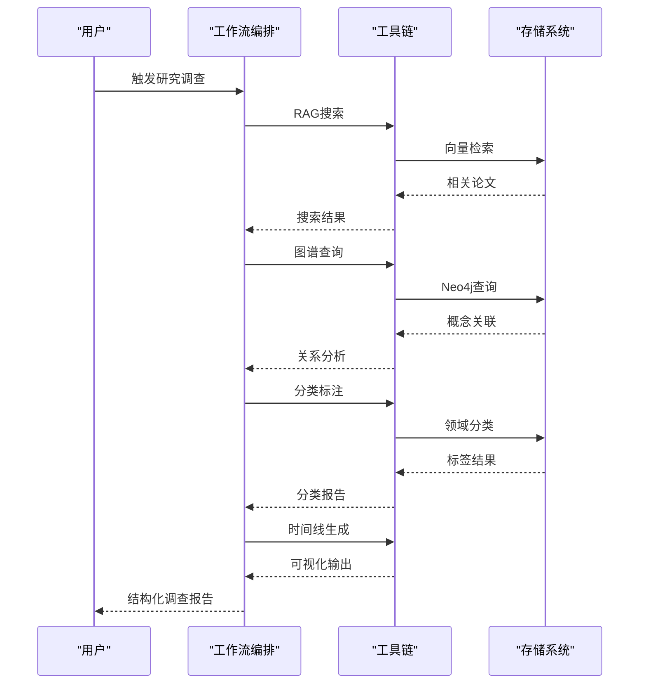

**图表来源**
- [server.py:284-325](file://scholar_mcp/server.py#L284-L325)

#### 核心功能详解

**引导式初始化** (`scholar_bootstrap`)
- 功能：完整的初始化工作流
- 流程：parse → year-fix → graph-build → rag-index → auto-notes → quality → classify
- 超时：1200秒
- 适用：新项目设置

**论文导入** (`scholar_ingest`)
- 功能：单篇论文导入工作流
- 流程：parse → auto-notes → quality-score → classify
- 超时：120秒

**研究调查** (`scholar_survey`)
- 功能：全面的研究调查工作流
- 组件：混合RAG搜索、图谱查询、分类、时间线分析
- 输出：结构化的调查报告
- 超时：300秒

**章节来源**
- [server.py:284-325](file://scholar_mcp/server.py#L284-L325)

### 文件访问模块

文件访问模块提供对生成内容的直接访问：

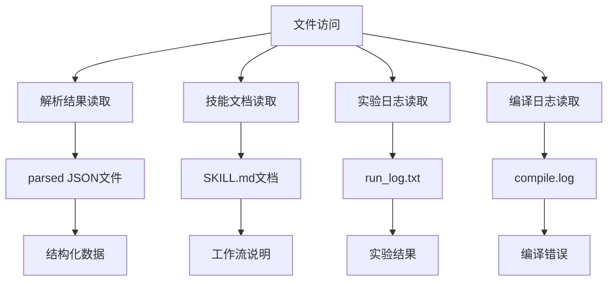

**图表来源**
- [server.py:359-385](file://scholar_mcp/server.py#L359-L385)

#### 核心功能详解

**解析结果读取** (`read_parsed_paper`)
- 功能：读取结构化的解析数据
- 路径：output/parsed/ULID.json
- 编码：UTF-8
- 错误处理：文件不存在时提示重新解析

**技能文档读取** (`read_skill`)
- 功能：获取工作流指导文档
- 路径：.qoder/skills/{skill_name}/SKILL.md
- 动态发现：列出可用技能

**章节来源**
- [server.py:359-385](file://scholar_mcp/server.py#L359-L385)

### 知识库更新模块

知识库更新模块提供持续的知识库维护能力：

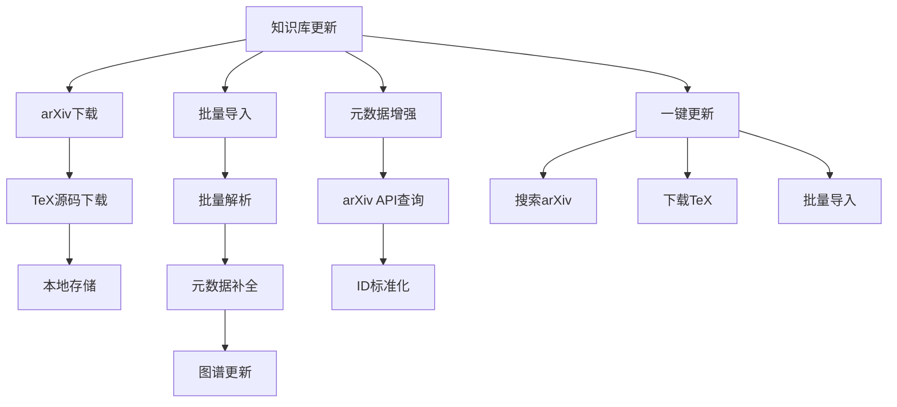

**图表来源**
- [server.py:389-441](file://scholar_mcp/server.py#L389-L441)
- [cli.py:1635-1694](file://scholar/cli.py#L1635-L1694)

#### 核心功能详解

**arXiv下载** (`scholar_arxiv_download`)
- 功能：从arXiv下载TeX源码
- 限制：最大结果数量
- 路径：data/papers/{arXiv_id}/source.tar.gz

**批量导入** (`scholar_batch_ingest`)
- 功能：批量论文导入工作流
- 参数：ULID列表（逗号分隔）
- 默认：处理所有未解析论文

**元数据增强** (`scholar_metadata_enrich`)
- 功能：增强现有论文的元数据
- 选项：应用更改、处理限制
- 来源：arXiv API搜索

**章节来源**
- [server.py:389-441](file://scholar_mcp/server.py#L389-L441)
- [cli.py:1664-1724](file://scholar/cli.py#L1664-L1724)

### 执行层模块

执行层模块提供完整的学术研究执行环境：

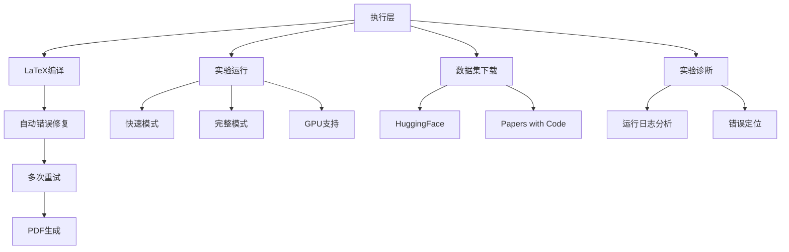

**图表来源**
- [server.py:445-565](file://scholar_mcp/server.py#L445-L565)
- [cli.py:1725-2010](file://scholar/cli.py#L1725-L2010)

#### 核心功能详解

**LaTeX编译** (`scholar_compile_paper`)
- 功能：将LaTeX源码编译为PDF
- 自动修复：常见错误自动修复
- 重试：最多3次重试
- 超时：300秒

**实验运行** (`scholar_exp_run`)
- 功能：运行论文中的实验代码
- 模式：快速（CPU+合成数据）、完整模式
- 设备：支持GPU加速
- 超时：3600秒

**数据集下载** (`scholar_dataset_download`)
- 功能：下载论文使用的数据集
- 来源：自动、HuggingFace、Papers with Code
- 超时：600秒

**章节来源**
- [server.py:445-565](file://scholar_mcp/server.py#L445-L565)
- [cli.py:1817-1894](file://scholar/cli.py#L1817-L1894)

## 依赖关系分析

系统依赖关系清晰，采用分层设计降低耦合度：

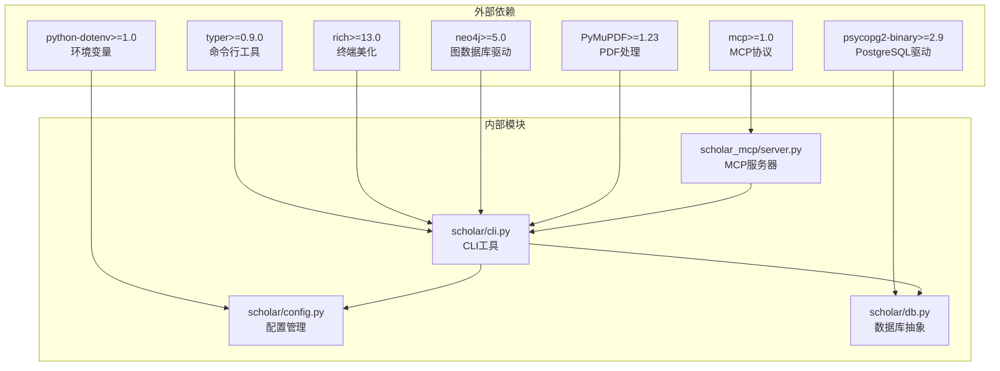

**图表来源**
- [requirements.txt:1-9](file://requirements.txt#L1-L9)
- [server.py:12](file://scholar_mcp/server.py#L12)

**章节来源**
- [requirements.txt:1-9](file://requirements.txt#L1-L9)

## 性能考虑

### 超时策略优化

系统针对不同类型的工具设置了合理的超时时间：

| 工具类型 | 默认超时 | 特殊场景 | 优化策略 |
|---------|---------|---------|---------|
| 基础查询 | 120秒 | - | 快速响应，避免阻塞 |
| 批量处理 | 300秒 | - | 平衡性能和完整性 |
| 长任务 | 600秒 | RAG索引、arXiv下载 | 分批处理，增量更新 |
| 极长任务 | 1200秒 | 引导式初始化 | 异步执行，进度反馈 |

### 资源管理

**内存优化**：
- 批量处理采用分页策略
- 大文件读写使用流式处理
- 缓存机制避免重复计算

**网络优化**：
- arXiv API请求重试机制
- 代理支持和超时控制
- 连接池管理

**存储优化**：
- PostgreSQL + pgvector组合存储
- 文件系统缓存策略
- 数据库连接池

## 故障排除指南

### 常见问题及解决方案

**MCP服务器启动失败**
- 检查Python环境和依赖安装
- 验证mcp.json配置文件
- 确认端口可用性

**数据库连接问题**
- 检查PostgreSQL服务状态
- 验证连接参数配置
- 确认数据库权限设置

**Neo4j连接失败**
- 启动Neo4j容器服务
- 验证连接URI和凭据
- 检查防火墙设置

**超时错误处理**
- 增加相应工具的超时时间
- 检查网络连接稳定性
- 优化数据库查询性能

**文件访问错误**
- 验证文件路径存在性
- 检查文件编码格式
- 确认文件权限设置

**章节来源**
- [server.py:23-36](file://scholar_mcp/server.py#L23-L36)
- [config.py:41-64](file://scholar/config.py#L41-L64)

## 结论

Scholar MCP Server实现了一个功能完整、架构清晰的学术研究工具平台。通过FastMCP框架，该系统成功地将复杂的Scholar CLI工具集包装为易于使用的MCP工具，为研究人员提供了强大的学术研究辅助能力。

### 主要优势

1. **模块化设计**：清晰的功能模块划分，便于维护和扩展
2. **性能优化**：合理的超时控制和资源管理策略
3. **错误处理**：完善的异常处理和故障恢复机制
4. **可扩展性**：基于装饰器的工具注册机制，易于添加新工具
5. **用户体验**：丰富的进度反馈和状态提示

### 技术特色

- **多层架构**：MCP协议层、工具包装层、CLI工具层的清晰分离
- **异步处理**：长任务的异步执行和进度反馈
- **容错机制**：网络请求重试、超时控制、错误恢复
- **监控支持**：详细的日志记录和状态报告

该实现为学术研究工作流的数字化转型提供了坚实的技术基础，能够有效提升研究人员的工作效率和研究质量。