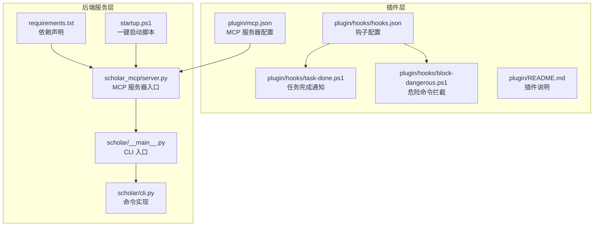
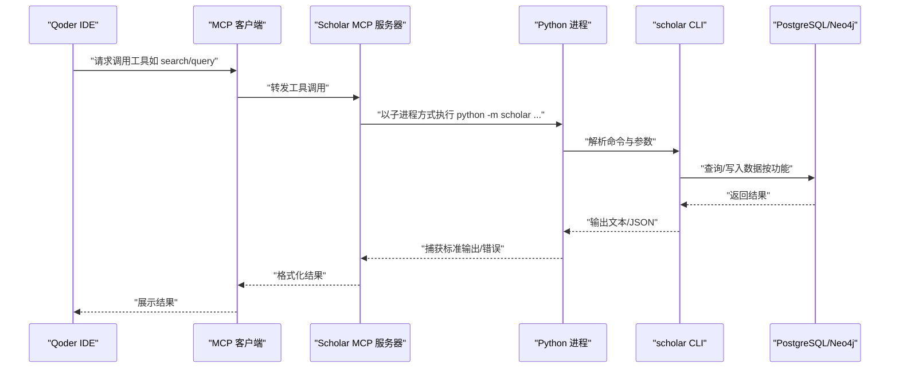
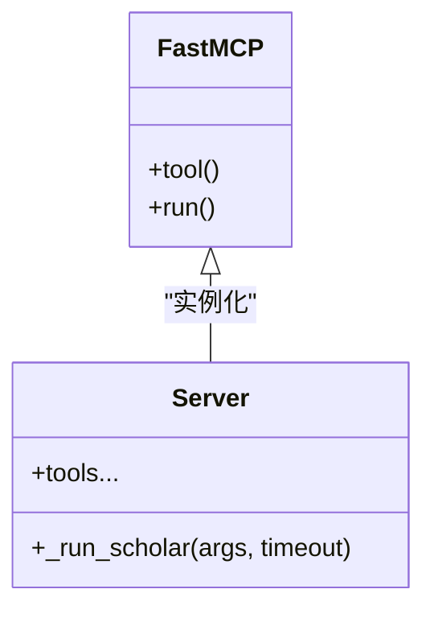
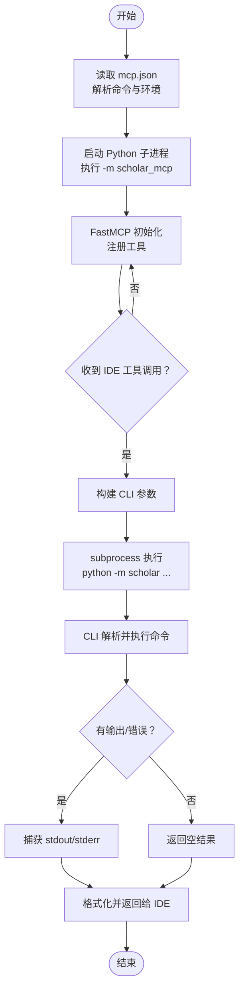
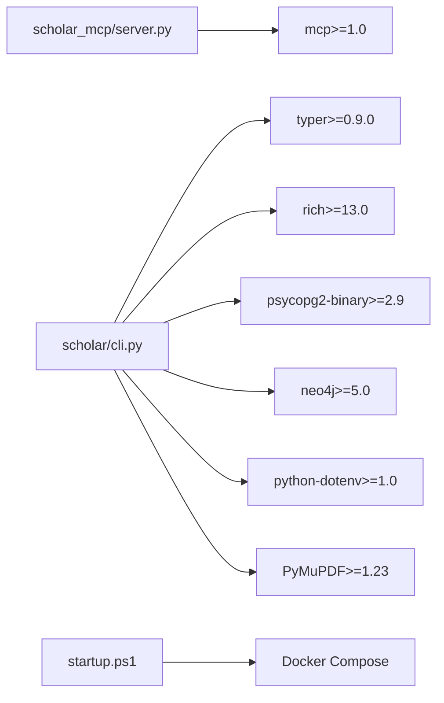

# 客户端集成指南

<cite>
**本文引用的文件**
- [plugin/mcp.json](file://plugin/mcp.json)
- [plugin/hooks/hooks.json](file://plugin/hooks/hooks.json)
- [plugin/hooks/task-done.ps1](file://plugin/hooks/task-done.ps1)
- [plugin/hooks/block-dangerous.ps1](file://plugin/hooks/block-dangerous.ps1)
- [plugin/README.md](file://plugin/README.md)
- [scholar_mcp/server.py](file://scholar_mcp/server.py)
- [scholar/__main__.py](file://scholar/__main__.py)
- [scholar/cli.py](file://scholar/cli.py)
- [requirements.txt](file://requirements.txt)
- [startup.ps1](file://startup.ps1)
</cite>

## 目录
1. [简介](#简介)
2. [项目结构](#项目结构)
3. [核心组件](#核心组件)
4. [架构总览](#架构总览)
5. [详细组件分析](#详细组件分析)
6. [依赖分析](#依赖分析)
7. [性能考虑](#性能考虑)
8. [故障排除指南](#故障排除指南)
9. [结论](#结论)
10. [附录](#附录)

## 简介
本指南面向希望在 Qoder IDE 中集成并使用 Scholar MCP Server 的开发者与研究者。内容涵盖：
- 在 Qoder IDE 中配置 mcp.json，使能 MCP 服务器连接
- 解释 hooks.json 的作用与危险操作拦截机制
- 完整的客户端连接、工具调用与结果处理流程
- 多种集成场景：命令行直接调用、IDE 插件集成、自动化脚本
- 性能优化建议与安全配置最佳实践

## 项目结构
该项目由“插件层”和“后端服务层”组成：
- 插件层提供 MCP 配置、钩子脚本与技能/命令说明
- 后端服务层通过 MCP 将 scholar CLI 暴露为可被 IDE 调用的工具集

图表来源
- [plugin/mcp.json:1-16](file://plugin/mcp.json#L1-L16)
- [plugin/hooks/hooks.json:1-27](file://plugin/hooks/hooks.json#L1-L27)
- [plugin/hooks/task-done.ps1:1-24](file://plugin/hooks/task-done.ps1#L1-L24)
- [plugin/hooks/block-dangerous.ps1:1-24](file://plugin/hooks/block-dangerous.ps1#L1-L24)
- [plugin/README.md:1-79](file://plugin/README.md#L1-L79)
- [scholar_mcp/server.py:1-573](file://scholar_mcp/server.py#L1-L573)
- [scholar/__main__.py:1-8](file://scholar/__main__.py#L1-L8)
- [scholar/cli.py:1-200](file://scholar/cli.py#L1-L200)
- [requirements.txt:1-9](file://requirements.txt#L1-L9)
- [startup.ps1:1-65](file://startup.ps1#L1-L65)

章节来源
- [plugin/README.md:1-79](file://plugin/README.md#L1-L79)
- [startup.ps1:1-65](file://startup.ps1#L1-L65)

## 核心组件
- MCP 服务器：将 scholar CLI 命令封装为 MCP 工具，供 Qoder IDE 调用
- MCP 配置：定义服务器命令、参数与环境变量
- 钩子系统：在特定事件（如任务完成、工具使用前）执行 PowerShell 脚本
- 后端 CLI：scholar 包的命令行入口，提供扫描、解析、检索、RAG、实验等能力

章节来源
- [scholar_mcp/server.py:17-20](file://scholar_mcp/server.py#L17-L20)
- [plugin/mcp.json:1-16](file://plugin/mcp.json#L1-L16)
- [plugin/hooks/hooks.json:1-27](file://plugin/hooks/hooks.json#L1-L27)
- [scholar/__main__.py:1-8](file://scholar/__main__.py#L1-L8)

## 架构总览
下图展示从 Qoder IDE 发起一次工具调用到最终返回结果的全链路。

图表来源
- [scholar_mcp/server.py:23-36](file://scholar_mcp/server.py#L23-L36)
- [scholar/__main__.py:1-8](file://scholar/__main__.py#L1-L8)
- [scholar/cli.py:1-200](file://scholar/cli.py#L1-L200)

## 详细组件分析

### MCP 服务器与工具暴露
- 服务器初始化：设置名称与说明，并注册大量工具函数
- 工具实现模式：每个工具函数对应一个 scholar 子命令；内部通过子进程调用 CLI
- 超时控制：不同工具设置不同超时时间，避免长时间阻塞
- 文件读取工具：支持读取解析后的 JSON、自动生成的阅读笔记、质量评分等

图表来源
- [scholar_mcp/server.py:17-20](file://scholar_mcp/server.py#L17-L20)
- [scholar_mcp/server.py:23-36](file://scholar_mcp/server.py#L23-L36)

章节来源
- [scholar_mcp/server.py:17-20](file://scholar_mcp/server.py#L17-L20)
- [scholar_mcp/server.py:23-36](file://scholar_mcp/server.py#L23-L36)

### mcp.json 配置详解
- 服务器别名：scholar
- 启动方式：通过 Python 解释器执行模块
- 参数传递：-m scholar_mcp
- 环境变量：
  - 数据库连接：SCHOLAR_PG_HOST、SCHOLAR_PG_PORT
  - 图数据库连接：SCHOLAR_NEO4J_URI
- 作用：让 Qoder IDE 能够定位并启动 MCP 服务器，同时注入必要的运行时参数

章节来源
- [plugin/mcp.json:1-16](file://plugin/mcp.json#L1-L16)

### hooks.json 配置详解
- 事件类型：
  - Stop：任务结束时触发
  - PreToolUse：工具使用前触发
- 匹配器：
  - Bash：对 Bash 类型的工具调用进行拦截
- 功能：
  - 任务完成通知：弹出 Windows 气泡提示
  - 危险命令拦截：阻止 DROP/ TRUNCATE/ rm -rf/ docker rm 等高危操作

章节来源
- [plugin/hooks/hooks.json:1-27](file://plugin/hooks/hooks.json#L1-L27)

### 钩子脚本实现
- 任务完成通知（task-done.ps1）
  - 读取输入 JSON，提取最后一条助手消息
  - 截断过长消息，使用 Windows Forms 显示气泡提示
- 危险命令拦截（block-dangerous.ps1）
  - 读取输入 JSON，提取工具命令
  - 正则匹配危险 SQL 与系统命令，若命中则输出错误并退出

章节来源
- [plugin/hooks/task-done.ps1:1-24](file://plugin/hooks/task-done.ps1#L1-L24)
- [plugin/hooks/block-dangerous.ps1:1-24](file://plugin/hooks/block-dangerous.ps1#L1-L24)

### 后端 CLI 与命令族
- CLI 入口：python -m scholar
- 命令族覆盖：
  - 论文库管理：scan、parse、parse-all、info、list-papers、stats、export-bib、year-fix
  - 图谱与网络：graph-build、graph-query、cite-network、graph-stats
  - RAG：rag-index、rag-search
  - 外部：arxiv-search、arxiv-download
  - 元数据补全：author-fix、cite-resolve、metadata-enrich
  - 批处理预处理：auto-notes、quality-score、classify
  - 编排：bootstrap、ingest、survey、landscape
  - 文件访问：read_auto_note、read_quality_score、read_parsed_paper、read_skill
  - 知识库更新：kb-update、batch-ingest
  - 执行层：compile-paper、exp-run、exp_compare、exp_setup、exp_debug、dataset-download、read_experiment_report、read_compile_log

章节来源
- [scholar/__main__.py:1-8](file://scholar/__main__.py#L1-L8)
- [scholar/cli.py:1-200](file://scholar/cli.py#L1-L200)

### 连接建立、工具调用与结果处理流程
- 连接建立
  - Qoder IDE 读取 mcp.json，启动 Python 子进程执行 -m scholar_mcp
  - 服务器初始化 FastMCP 并注册工具
- 工具调用
  - IDE 请求某个工具（例如 search 或 rag-search）
  - 服务器将请求转交给对应的工具函数
  - 工具函数构造参数并调用 subprocess 执行 python -m scholar ...
  - CLI 解析参数并执行相应命令
- 结果处理
  - CLI 输出文本/JSON
  - 服务器捕获标准输出与错误，拼接后返回给 IDE
  - IDE 展示结果

图表来源
- [plugin/mcp.json:1-16](file://plugin/mcp.json#L1-L16)
- [scholar_mcp/server.py:23-36](file://scholar_mcp/server.py#L23-L36)
- [scholar/__main__.py:1-8](file://scholar/__main__.py#L1-L8)
- [scholar/cli.py:1-200](file://scholar/cli.py#L1-L200)

## 依赖分析
- MCP 服务器依赖 mcp>=1.0，用于 FastMCP 框架
- 后端 CLI 依赖 typer、rich、psycopg2、neo4j、dotenv、PyMuPDF 等
- 一键启动脚本负责拉起 Docker 容器并等待健康检查

图表来源
- [requirements.txt:1-9](file://requirements.txt#L1-L9)
- [scholar_mcp/server.py:12](file://scholar_mcp/server.py#L12)
- [scholar/cli.py:13-29](file://scholar/cli.py#L13-L29)
- [startup.ps1:14](file://startup.ps1#L14)

章节来源
- [requirements.txt:1-9](file://requirements.txt#L1-L9)
- [startup.ps1:1-65](file://startup.ps1#L1-L65)

## 性能考虑
- 工具超时策略：不同工具设置不同超时（秒级），避免长时间阻塞
- 批处理与增量：优先使用批量工具（如 parse-all、batch-ingest、rag-index）减少重复开销
- I/O 优化：文件读取工具直接读取本地输出目录，避免不必要的网络请求
- 数据库与图谱：确保 PostgreSQL 与 Neo4j 可用且健康，必要时使用一键启动脚本等待服务就绪
- 并发与资源：实验类工具（如 exp-run）耗时较长，建议在后台运行并合理分配 CPU/GPU

章节来源
- [scholar_mcp/server.py:23-36](file://scholar_mcp/server.py#L23-L36)
- [startup.ps1:18-44](file://startup.ps1#L18-L44)

## 故障排除指南
- 无法连接 MCP 服务器
  - 检查 mcp.json 的命令与参数是否正确
  - 确认环境变量（数据库与图数据库地址）是否匹配
- 工具调用无响应
  - 查看工具超时设置，适当延长
  - 检查后端 CLI 是否正常输出日志
- 危险命令被拦截
  - 检查 hooks.json 的匹配器与正则规则
  - 若误拦截，请调整正则或临时禁用该钩子
- 任务完成通知不显示
  - 确认 PowerShell 脚本可执行且路径正确
  - 检查 Windows 通知权限
- 服务未就绪
  - 使用一键启动脚本等待 PostgreSQL 与 Neo4j 健康
  - 检查容器日志与端口占用

章节来源
- [plugin/mcp.json:1-16](file://plugin/mcp.json#L1-L16)
- [plugin/hooks/hooks.json:1-27](file://plugin/hooks/hooks.json#L1-L27)
- [plugin/hooks/block-dangerous.ps1:1-24](file://plugin/hooks/block-dangerous.ps1#L1-L24)
- [plugin/hooks/task-done.ps1:1-24](file://plugin/hooks/task-done.ps1#L1-L24)
- [startup.ps1:18-44](file://startup.ps1#L18-L44)

## 结论
通过本指南，您可以在 Qoder IDE 中无缝集成 Scholar MCP Server，利用丰富的学术研究工具完成论文解析、检索、RAG、实验复现与知识库维护等任务。配合 hooks.json 的安全与通知机制，以及一键启动脚本与合理的超时配置，可显著提升开发体验与安全性。

## 附录

### 集成场景与操作要点
- 直接命令行调用
  - 使用 python -m scholar 调用各命令，适合快速验证与批处理
- IDE 插件集成
  - 在 Qoder IDE 中加载 mcp.json，选择 scholar 服务器
  - 使用 hooks.json 实现任务完成通知与危险命令拦截
- 自动化脚本
  - 在 CI/CD 或本地脚本中调用 MCP 工具，结合超时与重试策略

章节来源
- [plugin/README.md:19-79](file://plugin/README.md#L19-L79)
- [plugin/mcp.json:1-16](file://plugin/mcp.json#L1-L16)
- [plugin/hooks/hooks.json:1-27](file://plugin/hooks/hooks.json#L1-L27)