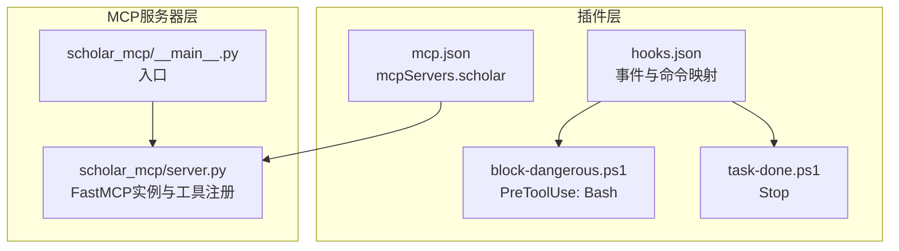
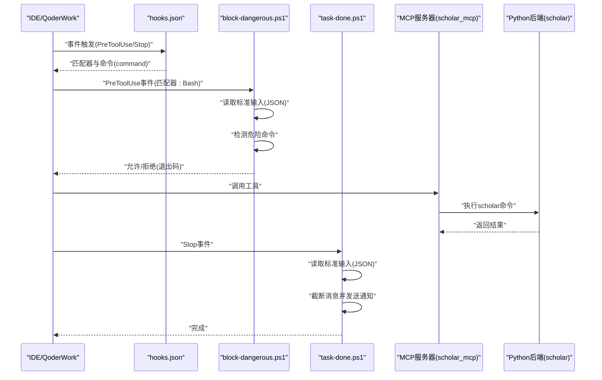
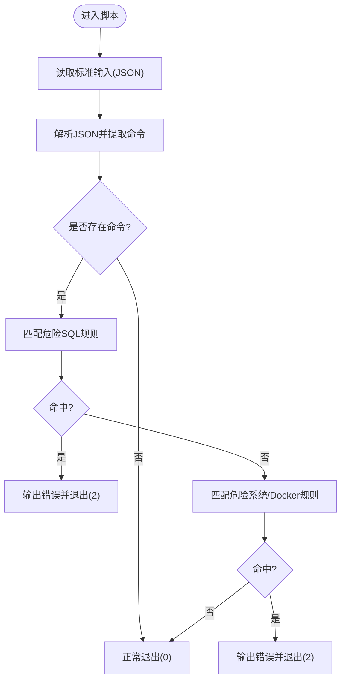
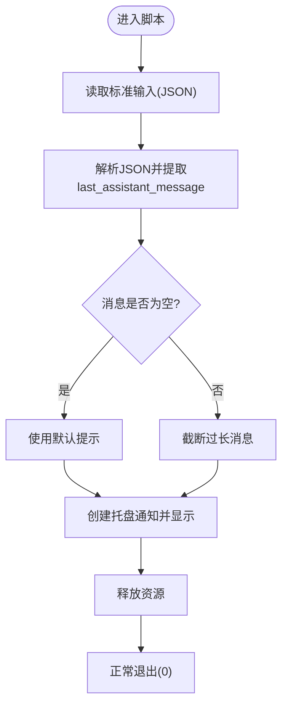
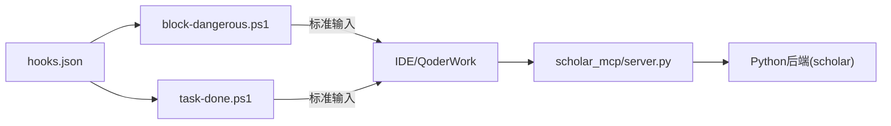

# 钩子系统

<cite>
**本文档引用的文件**
- [plugin/hooks/hooks.json](file://plugin/hooks/hooks.json)
- [plugin/hooks/block-dangerous.ps1](file://plugin/hooks/block-dangerous.ps1)
- [plugin/hooks/task-done.ps1](file://plugin/hooks/task-done.ps1)
- [plugin/mcp.json](file://plugin/mcp.json)
- [plugin/README.md](file://plugin/README.md)
- [scholar_mcp/server.py](file://scholar_mcp/server.py)
- [scholar_mcp/__main__.py](file://scholar_mcp/__main__.py)
</cite>

## 目录
1. [简介](#简介)
2. [项目结构](#项目结构)
3. [核心组件](#核心组件)
4. [架构总览](#架构总览)
5. [详细组件分析](#详细组件分析)
6. [依赖分析](#依赖分析)
7. [性能考虑](#性能考虑)
8. [故障排查指南](#故障排查指南)
9. [结论](#结论)
10. [附录](#附录)

## 简介
本文件面向MCP（Model Context Protocol）钩子系统，聚焦以下目标：
- 解释hooks.json配置文件的结构与事件触发条件
- 深入分析block-dangerous.ps1的安全机制（危险操作检测、权限验证与阻止策略）
- 解释task-done.ps1的任务完成通知机制（消息来源、通知发送与结果处理）
- 文档化自定义钩子的开发方法（脚本规范、事件监听、错误处理）
- 提供配置示例与调试方法
- 阐述钩子系统在整体MCP架构中的作用与重要性

## 项目结构
钩子系统位于插件目录下，由配置文件与两个PowerShell钩子脚本组成，并通过MCP服务器暴露工具集。关键文件如下：
- 配置：plugin/hooks/hooks.json
- 安全钩子：plugin/hooks/block-dangerous.ps1
- 通知钩子：plugin/hooks/task-done.ps1
- MCP服务配置：plugin/mcp.json
- 插件说明：plugin/README.md
- MCP服务器实现：scholar_mcp/server.py

图表来源
- [plugin/hooks/hooks.json:1-27](file://plugin/hooks/hooks.json#L1-L27)
- [plugin/hooks/block-dangerous.ps1:1-24](file://plugin/hooks/block-dangerous.ps1#L1-L24)
- [plugin/hooks/task-done.ps1:1-24](file://plugin/hooks/task-done.ps1#L1-L24)
- [plugin/mcp.json:1-16](file://plugin/mcp.json#L1-L16)
- [scholar_mcp/server.py:1-573](file://scholar_mcp/server.py#L1-L573)
- [scholar_mcp/__main__.py:1-5](file://scholar_mcp/__main__.py#L1-L5)

章节来源
- [plugin/README.md:1-79](file://plugin/README.md#L1-L79)
- [plugin/hooks/hooks.json:1-27](file://plugin/hooks/hooks.json#L1-L27)
- [plugin/mcp.json:1-16](file://plugin/mcp.json#L1-L16)

## 核心组件
- hooks.json：定义钩子事件与匹配器，将特定事件映射到命令执行。包含“Stop”和“PreToolUse”两类事件，分别绑定到任务完成通知与危险命令拦截。
- block-dangerous.ps1：在PreToolUse事件且匹配器为Bash时执行，从标准输入读取JSON，解析命令字段，对危险SQL/Docker/系统操作进行阻断。
- task-done.ps1：在Stop事件发生时执行，从标准输入读取最后一条助手消息，截断过长文本，通过Windows托盘气泡通知展示。
- mcp.json：声明名为“scholar”的MCP服务器，指定Python可执行文件与参数，用于启动scholar_mcp模块。

章节来源
- [plugin/hooks/hooks.json:1-27](file://plugin/hooks/hooks.json#L1-L27)
- [plugin/hooks/block-dangerous.ps1:1-24](file://plugin/hooks/block-dangerous.ps1#L1-L24)
- [plugin/hooks/task-done.ps1:1-24](file://plugin/hooks/task-done.ps1#L1-L24)
- [plugin/mcp.json:1-16](file://plugin/mcp.json#L1-L16)

## 架构总览
钩子系统在MCP工作流中的位置：
- 事件源：IDE/QoderWork在执行工具调用前后发出事件（如PreToolUse、Stop）
- 配置驱动：hooks.json根据事件类型与匹配器选择对应脚本
- 脚本执行：PowerShell脚本通过命令行启动，接收来自标准输入的上下文JSON
- MCP服务器：scholar_mcp/server.py作为FastMCP实例，承载大量工具函数，供IDE侧调用

图表来源
- [plugin/hooks/hooks.json:1-27](file://plugin/hooks/hooks.json#L1-L27)
- [plugin/hooks/block-dangerous.ps1:1-24](file://plugin/hooks/block-dangerous.ps1#L1-L24)
- [plugin/hooks/task-done.ps1:1-24](file://plugin/hooks/task-done.ps1#L1-L24)
- [scholar_mcp/server.py:1-573](file://scholar_mcp/server.py#L1-L573)

## 详细组件分析

### hooks.json：事件与命令映射
- 事件类型
  - Stop：在工具调用流程结束时触发，用于收尾动作（如任务完成通知）
  - PreToolUse：在工具调用前触发，用于安全检查（如危险命令拦截）
- 匹配器
  - Bash：仅当工具调用涉及Bash匹配器时才执行PreToolUse钩子
- 命令执行
  - 使用powershell.exe以绕过执行策略的方式运行脚本
  - 通过标准输入传递上下文JSON，脚本从其中提取必要字段进行判断

章节来源
- [plugin/hooks/hooks.json:1-27](file://plugin/hooks/hooks.json#L1-L27)

### block-dangerous.ps1：危险命令拦截
- 输入解析
  - 从标准输入读取完整内容并转换为JSON对象
  - 从JSON中提取命令字段作为判定依据
- 危险检测规则
  - 危险SQL：包含DROP TABLE/DROP DATABASE/TRUNCATE TABLE等对核心数据表的操作
  - 危险系统操作：包含docker rm/volume rm/system prune以及rm -rf等高风险系统命令
- 阻止策略
  - 若命中规则，向标准错误输出拦截信息并以特定退出码终止
  - 若未命中，则正常退出
- 权限与执行策略
  - 通过命令行参数绕过默认执行策略，确保脚本能被调用

图表来源
- [plugin/hooks/block-dangerous.ps1:1-24](file://plugin/hooks/block-dangerous.ps1#L1-L24)

章节来源
- [plugin/hooks/block-dangerous.ps1:1-24](file://plugin/hooks/block-dangerous.ps1#L1-L24)

### task-done.ps1：任务完成通知
- 输入解析
  - 从标准输入读取完整内容并转换为JSON对象
  - 从JSON中提取最后一条助手消息作为通知内容
- 内容处理
  - 若消息为空则使用默认提示
  - 若消息长度超过阈值则截断并追加省略号
- 通知机制
  - 使用Windows Forms组件创建托盘通知
  - 设置标题与文本，显示气泡提示并短暂停留
  - 释放资源后正常退出

图表来源
- [plugin/hooks/task-done.ps1:1-24](file://plugin/hooks/task-done.ps1#L1-L24)

章节来源
- [plugin/hooks/task-done.ps1:1-24](file://plugin/hooks/task-done.ps1#L1-L24)

### MCP服务器与钩子集成
- 服务器角色
  - scholar_mcp/server.py基于FastMCP创建MCP实例，注册大量工具函数
  - 通过子进程调用Python后端的scholar命令，实现工具的实际执行
- 集成点
  - 钩子事件在工具调用前后触发，与MCP生命周期紧密耦合
  - hooks.json中的命令最终由IDE/QoderWork调用，形成完整的事件链路

章节来源
- [scholar_mcp/server.py:1-573](file://scholar_mcp/server.py#L1-L573)
- [plugin/mcp.json:1-16](file://plugin/mcp.json#L1-L16)

## 依赖分析
- 组件内聚与耦合
  - hooks.json与两个脚本之间存在直接耦合：事件类型与命令字符串决定脚本执行时机
  - 脚本与IDE/QoderWork之间通过标准输入/输出进行解耦的数据交换
  - MCP服务器与Python后端通过子进程调用实现功能扩展
- 外部依赖
  - PowerShell执行策略可通过命令行参数绕过
  - Windows托盘通知依赖System.Windows.Forms
  - MCP服务器依赖FastMCP框架与Python后端

图表来源
- [plugin/hooks/hooks.json:1-27](file://plugin/hooks/hooks.json#L1-L27)
- [plugin/hooks/block-dangerous.ps1:1-24](file://plugin/hooks/block-dangerous.ps1#L1-L24)
- [plugin/hooks/task-done.ps1:1-24](file://plugin/hooks/task-done.ps1#L1-L24)
- [scholar_mcp/server.py:1-573](file://scholar_mcp/server.py#L1-L573)

章节来源
- [plugin/hooks/hooks.json:1-27](file://plugin/hooks/hooks.json#L1-L27)
- [plugin/hooks/block-dangerous.ps1:1-24](file://plugin/hooks/block-dangerous.ps1#L1-L24)
- [plugin/hooks/task-done.ps1:1-24](file://plugin/hooks/task-done.ps1#L1-L24)
- [scholar_mcp/server.py:1-573](file://scholar_mcp/server.py#L1-L573)

## 性能考虑
- 脚本执行开销
  - 钩子脚本均为轻量级PowerShell脚本，I/O瓶颈主要来自标准输入读取与正则匹配
  - 建议避免在脚本中引入重IO或复杂计算，以免影响工具调用的响应时间
- 正则匹配效率
  - 危险规则采用简单正则表达式，匹配成本低；若规则增多，建议合并或优化正则以减少回溯
- 通知延迟
  - Windows托盘通知会短暂驻留，建议控制消息长度，避免频繁触发导致用户体验下降

## 故障排查指南
- 事件未触发
  - 检查hooks.json中事件类型与匹配器是否与IDE侧一致
  - 确认命令路径与变量替换是否正确（例如根目录变量）
- 脚本无法执行
  - 确认PowerShell执行策略绕过参数已生效
  - 检查脚本路径与权限
- 危险命令误报/漏报
  - 校验正则表达式是否覆盖所有变体
  - 在本地测试不同命令格式，逐步完善规则
- 通知不显示
  - 确认Windows托盘通知可用且未被禁用
  - 检查消息长度与字符编码
- MCP服务器问题
  - 确认mcp.json中命令与参数正确
  - 检查Python后端服务是否正常运行

章节来源
- [plugin/hooks/hooks.json:1-27](file://plugin/hooks/hooks.json#L1-L27)
- [plugin/hooks/block-dangerous.ps1:1-24](file://plugin/hooks/block-dangerous.ps1#L1-L24)
- [plugin/hooks/task-done.ps1:1-24](file://plugin/hooks/task-done.ps1#L1-L24)
- [plugin/mcp.json:1-16](file://plugin/mcp.json#L1-L16)

## 结论
钩子系统通过简洁的配置与轻量脚本实现了MCP工作流的关键扩展点：
- 在PreToolUse阶段拦截潜在危险命令，保障系统安全
- 在Stop阶段推送任务完成通知，提升交互体验
- 与MCP服务器无缝集成，形成从事件触发到工具执行的闭环

该设计具备良好的可扩展性与可维护性，适合进一步增加更多事件与脚本以满足复杂场景需求。

## 附录

### 自定义钩子开发指南
- 脚本编写规范
  - 严格从标准输入读取JSON上下文，按需提取字段
  - 明确退出码语义：0表示允许继续，非0表示中断流程
  - 控制消息长度，避免超长输出影响性能
- 事件监听机制
  - 在hooks.json中声明事件类型与匹配器
  - 将命令指向新脚本路径，并确保变量替换正确
- 错误处理策略
  - 对空输入与缺失字段进行健壮性判断
  - 对异常情况输出明确错误信息并设置合适的退出码
- 测试与调试
  - 在本地模拟IDE事件，验证脚本行为
  - 逐步完善正则规则与边界条件

### 配置示例与调试方法
- 示例：新增一个PreToolUse钩子
  - 在hooks.json中添加新的事件条目，设置匹配器与命令
  - 编写脚本并确保其能正确解析上下文与输出日志
- 调试方法
  - 使用IDE侧的日志输出查看事件触发与脚本执行结果
  - 通过最小化命令复现实验，定位正则或逻辑问题