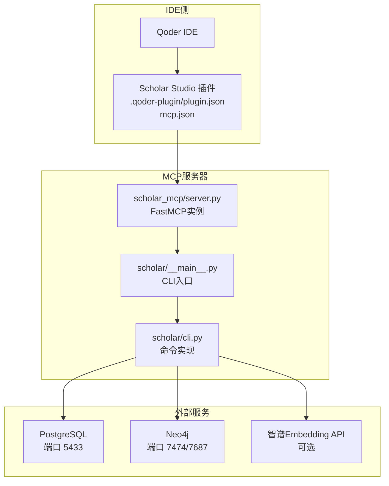
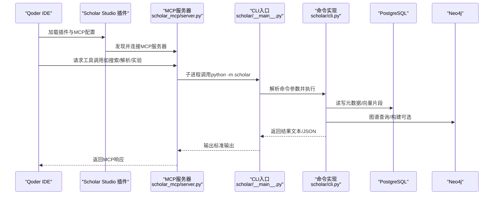
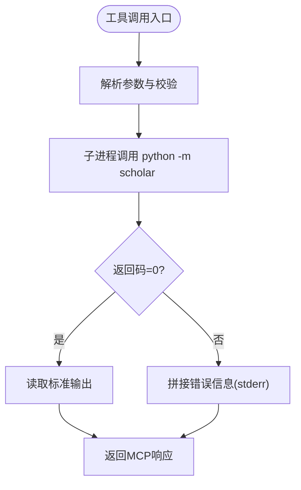
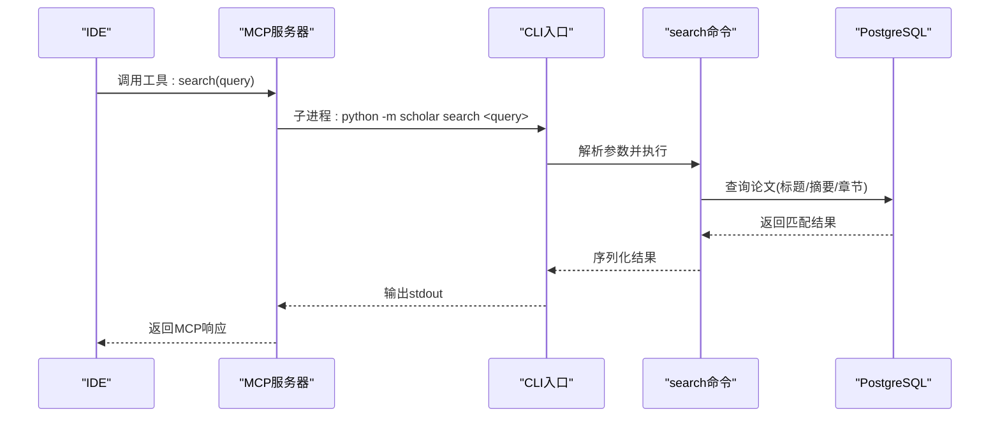
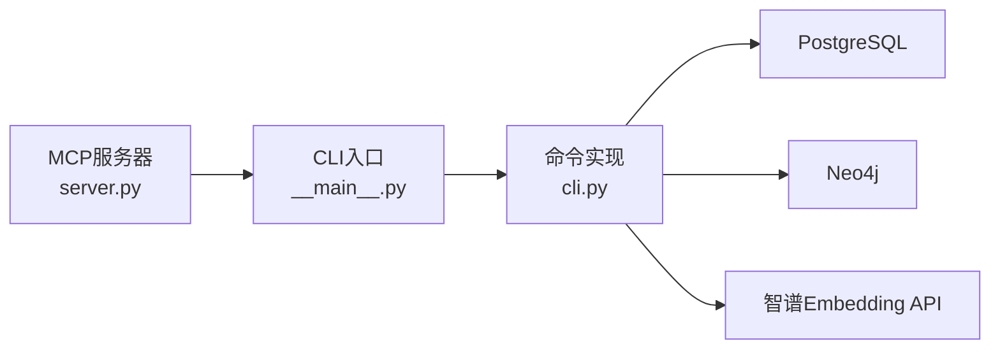

# IDE集成支持

<cite>
**本文档引用的文件**
- [plugin/.qoder-plugin/plugin.json](file://plugin/.qoder-plugin/plugin.json)
- [plugin/mcp.json](file://plugin/mcp.json)
- [plugin/CONNECTORS.md](file://plugin/CONNECTORS.md)
- [plugin/README.md](file://plugin/README.md)
- [scholar_mcp/server.py](file://scholar_mcp/server.py)
- [scholar/__main__.py](file://scholar/__main__.py)
- [scholar/cli.py](file://scholar/cli.py)
- [startup.ps1](file://startup.ps1)
</cite>

## 目录
1. [简介](#简介)
2. [项目结构](#项目结构)
3. [核心组件](#核心组件)
4. [架构总览](#架构总览)
5. [详细组件分析](#详细组件分析)
6. [依赖分析](#依赖分析)
7. [性能考虑](#性能考虑)
8. [故障排除指南](#故障排除指南)
9. [结论](#结论)
10. [附录](#附录)

## 简介
本指南面向需要在IDE（特别是Qoder IDE）中集成MCP（Model Context Protocol）服务的开发者与用户，围绕Scholar Studio的MCP服务器与IDE插件的协作进行系统化说明。内容覆盖：
- MCP服务器与IDE插件的安装配置
- 服务器发现与连接建立流程
- 工具调用与命令执行链路
- 不同IDE环境下的集成差异与配置要点
- 多语言支持、主题适配与用户体验优化建议
- 故障排除、调试技巧与性能监控方法
- 自定义IDE集成的开发指南与最佳实践

## 项目结构
该项目采用“插件 + 主仓库”的分层设计：
- 插件层（plugin/）：提供技能（Skills）、命令（Commands）、规则（Rules）、钩子（Hooks）以及MCP服务器配置（mcp.json），并与IDE交互。
- 主仓库（scholar/ 及其子模块）：提供完整的CLI命令与MCP服务器实现，负责实际的数据处理、数据库访问、外部服务调用等。

图表来源
- [plugin/.qoder-plugin/plugin.json:1-23](file://plugin/.qoder-plugin/plugin.json#L1-L23)
- [plugin/mcp.json:1-16](file://plugin/mcp.json#L1-L16)
- [scholar_mcp/server.py:1-631](file://scholar_mcp/server.py#L1-L631)
- [scholar/__main__.py:1-8](file://scholar/__main__.py#L1-L8)
- [scholar/cli.py:1-800](file://scholar/cli.py#L1-L800)
- [plugin/CONNECTORS.md:1-45](file://plugin/CONNECTORS.md#L1-L45)

章节来源
- [plugin/.qoder-plugin/plugin.json:1-23](file://plugin/.qoder-plugin/plugin.json#L1-L23)
- [plugin/mcp.json:1-16](file://plugin/mcp.json#L1-L16)
- [plugin/README.md:1-79](file://plugin/README.md#L1-L79)
- [scholar_mcp/server.py:1-631](file://scholar_mcp/server.py#L1-L631)
- [scholar/__main__.py:1-8](file://scholar/__main__.py#L1-L8)
- [scholar/cli.py:1-800](file://scholar/cli.py#L1-L800)
- [plugin/CONNECTORS.md:1-45](file://plugin/CONNECTORS.md#L1-L45)

## 核心组件
- 插件配置（plugin.json）
  - 定义插件名称、版本、展示名、描述、关键词、主页、仓库、许可证、资源目录映射（skills/commands/rules/hooks/mcpServers）。
  - 关键字段：name、version、displayName、skills、commands、rules、hooks、mcpServers。
- MCP服务器配置（mcp.json）
  - 定义MCP服务器清单，包含命令、参数与环境变量。
  - 关键字段：mcpServers.scholar.command、args、env（如数据库与图数据库的连接信息）。
- MCP服务器实现（server.py）
  - 基于FastMCP创建MCP实例，注册大量工具函数（如论文扫描、解析、搜索、RAG、图谱构建、实验执行等）。
  - 工具函数通过子进程调用scholar CLI，实现与后端逻辑解耦。
- CLI入口与命令实现（__main__.py、cli.py）
  - CLI入口转发至命令实现；命令实现负责数据库访问、外部服务调用、文件系统操作等。
- 外部服务依赖（CONNECTORS.md）
  - PostgreSQL（元数据与向量片段存储）、Neo4j（引用网络与概念图谱）、智谱Embedding API（可选，用于RAG）。
- 启动脚本（startup.ps1）
  - Docker容器编排与健康检查，确保数据库与图数据库可用；提供.env示例与依赖检测。

章节来源
- [plugin/.qoder-plugin/plugin.json:1-23](file://plugin/.qoder-plugin/plugin.json#L1-L23)
- [plugin/mcp.json:1-16](file://plugin/mcp.json#L1-L16)
- [scholar_mcp/server.py:1-631](file://scholar_mcp/server.py#L1-L631)
- [scholar/__main__.py:1-8](file://scholar/__main__.py#L1-L8)
- [scholar/cli.py:1-800](file://scholar/cli.py#L1-L800)
- [plugin/CONNECTORS.md:1-45](file://plugin/CONNECTORS.md#L1-L45)
- [startup.ps1:1-125](file://startup.ps1#L1-L125)

## 架构总览
下图展示了IDE、插件、MCP服务器与后端CLI之间的交互关系与数据流向。

图表来源
- [plugin/.qoder-plugin/plugin.json:1-23](file://plugin/.qoder-plugin/plugin.json#L1-L23)
- [plugin/mcp.json:1-16](file://plugin/mcp.json#L1-L16)
- [scholar_mcp/server.py:1-631](file://scholar_mcp/server.py#L1-L631)
- [scholar/__main__.py:1-8](file://scholar/__main__.py#L1-L8)
- [scholar/cli.py:1-800](file://scholar/cli.py#L1-L800)
- [plugin/CONNECTORS.md:1-45](file://plugin/CONNECTORS.md#L1-L45)

## 详细组件分析

### 插件与MCP配置
- 插件清单（plugin.json）
  - 资源目录映射：skills、commands、rules、hooks、mcpServers，便于IDE加载与调用。
  - mcpServers指向mcp.json，IDE通过该文件发现MCP服务器。
- MCP服务器清单（mcp.json）
  - 定义服务器名称（如scholar）、启动命令（python -m scholar_mcp）、环境变量（数据库与图数据库URI）。
  - 环境变量示例：SCHOLAR_PG_HOST、SCHOLAR_PG_PORT、SCHOLAR_NEO4J_URI。

章节来源
- [plugin/.qoder-plugin/plugin.json:1-23](file://plugin/.qoder-plugin/plugin.json#L1-L23)
- [plugin/mcp.json:1-16](file://plugin/mcp.json#L1-L16)

### MCP服务器实现与工具注册
- 服务器初始化
  - 创建FastMCP实例，设置服务器名称与说明。
- 工具注册模式
  - 使用装饰器注册工具函数，每个工具对应一个MCP工具名称，内部通过子进程调用python -m scholar并传入相应参数。
- 工具分类
  - 论文库管理：扫描、解析、信息查询、统计、导出、年份/作者/会议补全、参考文献解析。
  - 图谱与网络：构建图谱、查询概念、引用网络分析。
  - RAG：向量索引构建与语义检索。
  - 外部搜索：arXiv搜索与下载。
  - 批处理预处理：自动生成阅读笔记、质量评分、分类标签。
  - 研究编排：一次性引导、论文摄取、调研报告、领域景观分析。
  - 文件访问：读取解析后的JSON、技能说明文档。
  - 知识库更新：arXiv下载、批量摄取、KB更新、元数据补全。
  - 研究循环：兴趣方向管理、研究同步。
  - 执行层：LaTeX编译、实验运行/对比/环境准备/调试、数据集下载、读取实验/编译日志。
- 错误处理
  - 子进程返回码非零时，将stderr拼接到输出中，便于IDE侧定位问题。

图表来源
- [scholar_mcp/server.py:23-36](file://scholar_mcp/server.py#L23-L36)

章节来源
- [scholar_mcp/server.py:1-631](file://scholar_mcp/server.py#L1-L631)

### CLI命令实现与外部服务交互
- 数据库访问
  - 通过Database类封装连接与查询；若不可用则退化为文件系统模式。
- 外部服务
  - PostgreSQL：存储论文元数据与向量片段。
  - Neo4j：引用网络与概念图谱。
  - 智谱Embedding API：RAG向量索引构建与检索。
- 命令组织
  - 使用Typer定义命令与选项，Rich控制台输出表格、面板与进度条，提升可观测性与易用性。

章节来源
- [scholar/cli.py:1-800](file://scholar/cli.py#L1-L800)
- [plugin/CONNECTORS.md:1-45](file://plugin/CONNECTORS.md#L1-L45)

### 连接建立与生命周期
- 服务器发现
  - IDE通过插件的mcpServers字段发现MCP服务器；mcp.json中声明命令与环境变量。
- 连接管理
  - MCP服务器常驻运行，IDE按需发起工具调用；工具执行可能涉及长时间任务（如RAG索引、批量处理），应结合超时与进度反馈。
- 启动与健康检查
  - startup.ps1负责拉起Docker容器并等待服务健康；IDE侧可在连接前进行探测或重试。

章节来源
- [plugin/mcp.json:1-16](file://plugin/mcp.json#L1-L16)
- [startup.ps1:1-125](file://startup.ps1#L1-L125)

### 工具调用流程（以“全文搜索”为例）

图表来源
- [scholar_mcp/server.py:74-80](file://scholar_mcp/server.py#L74-L80)
- [scholar/cli.py:311-370](file://scholar/cli.py#L311-L370)

## 依赖分析
- 组件耦合
  - MCP服务器与CLI通过子进程解耦，降低直接耦合度；CLI与数据库/图数据库/外部API通过模块化封装耦合。
- 外部依赖
  - Docker容器编排（PostgreSQL、Neo4j）、Python依赖（typer、rich）、可选API（智谱Embedding）。
- 环境变量
  - 数据库与图数据库URI通过mcp.json/env注入，确保MCP服务器启动时具备正确上下文。

图表来源
- [scholar_mcp/server.py:1-631](file://scholar_mcp/server.py#L1-L631)
- [scholar/__main__.py:1-8](file://scholar/__main__.py#L1-L8)
- [scholar/cli.py:1-800](file://scholar/cli.py#L1-L800)
- [plugin/CONNECTORS.md:1-45](file://plugin/CONNECTORS.md#L1-L45)

章节来源
- [plugin/CONNECTORS.md:1-45](file://plugin/CONNECTORS.md#L1-L45)
- [plugin/mcp.json:1-16](file://plugin/mcp.json#L1-L16)

## 性能考虑
- I/O密集与长耗时任务
  - RAG索引、批量解析、图谱构建等任务耗时较长，建议在IDE侧提供进度反馈与取消机制。
- 超时与并发
  - 工具函数内置超时参数，避免阻塞；IDE侧应限制并发数量，防止资源争用。
- 缓存与增量
  - 对频繁查询的结果进行缓存；仅对新增/变更数据执行增量处理。
- 网络与外部API
  - 外部API请求需考虑限流与重试策略；本地代理配置可通过环境变量传递给子进程。

## 故障排除指南
- 无法连接数据库/图数据库
  - 确认Docker容器已启动且健康；检查端口映射与防火墙；查看startup.ps1的健康检查输出。
- MCP服务器未发现或无法连接
  - 核对mcp.json中的命令与环境变量；确认IDE插件已正确加载mcpServers。
- 工具执行失败
  - 查看MCP服务器输出中的stderr拼接信息；检查CLI命令参数与工作目录。
- 外部API密钥缺失
  - 若启用RAG功能，需设置SCHOLAR_EMBEDDING_API_KEY；否则相关工具会提示缺少凭据。
- 权限与路径
  - 确保IDE与MCP服务器进程对项目目录具有读写权限；注意相对路径与工作目录一致性。

章节来源
- [plugin/CONNECTORS.md:1-45](file://plugin/CONNECTORS.md#L1-L45)
- [startup.ps1:1-125](file://startup.ps1#L1-L125)
- [scholar_mcp/server.py:23-36](file://scholar_mcp/server.py#L23-L36)

## 结论
通过清晰的插件配置与MCP服务器实现，Scholar Studio能够在IDE环境中提供强大的学术研究能力。遵循本文档的安装、配置与集成流程，结合故障排除与性能优化建议，可显著提升研发效率与用户体验。

## 附录

### 不同IDE环境下的集成差异
- Qoder IDE
  - 通过插件的mcpServers字段自动发现MCP服务器；工具调用由IDE调度，MCP服务器以子进程方式调用CLI。
- 其他IDE（通用MCP客户端）
  - 遵循相同的MCP协议与工具命名；需确保IDE能够加载插件资源与环境变量，并正确传递工作目录。

### 配置文件格式与连接参数
- 插件清单（plugin.json）
  - 字段：name、version、displayName、skills、commands、rules、hooks、mcpServers。
- MCP服务器清单（mcp.json）
  - 字段：mcpServers.<server>.command、args、env（如SCHOLAR_PG_HOST、SCHOLAR_PG_PORT、SCHOLAR_NEO4J_URI）。
- 外部服务环境变量
  - PostgreSQL：SCHOLAR_PG_HOST、SCHOLAR_PG_PORT。
  - Neo4j：SCHOLAR_NEO4J_URI。
  - RAG：SCHOLAR_EMBEDDING_API_KEY。

章节来源
- [plugin/.qoder-plugin/plugin.json:1-23](file://plugin/.qoder-plugin/plugin.json#L1-L23)
- [plugin/mcp.json:1-16](file://plugin/mcp.json#L1-L16)
- [plugin/CONNECTORS.md:1-45](file://plugin/CONNECTORS.md#L1-L45)

### 多语言支持、主题适配与用户体验优化
- 多语言支持
  - 工具名称与描述建议提供中英文双语；IDE侧根据用户语言偏好切换显示。
- 主题适配
  - CLI输出使用Rich控制台，IDE侧可将表格/面板转换为可视化组件；保持一致的色彩与布局。
- 用户体验优化
  - 提供进度条与状态提示；对长耗时任务提供取消与重试机制；错误信息明确且可追踪。

### 自定义IDE集成的开发指南与最佳实践
- 插件开发
  - 在plugin.json中正确映射资源目录；在mcp.json中声明服务器与环境变量。
- MCP服务器扩展
  - 新增工具时，保持参数类型与返回值的一致性；对异常进行捕获并返回可读信息。
- CLI命令扩展
  - 使用Typer定义清晰的参数与帮助信息；对数据库/外部服务调用增加重试与降级策略。
- 集成测试
  - 在IDE中模拟工具调用，验证参数传递、输出格式与错误处理；结合startup.ps1进行端到端验证。