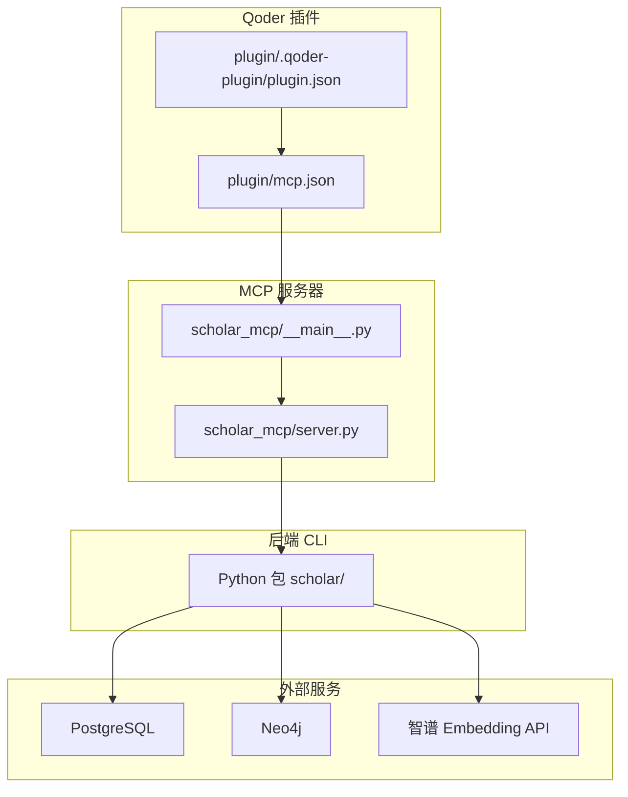
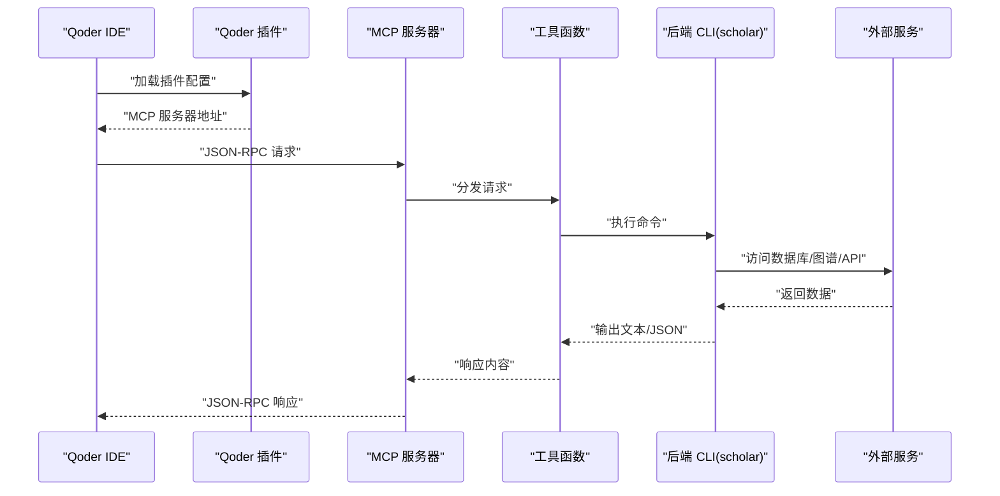
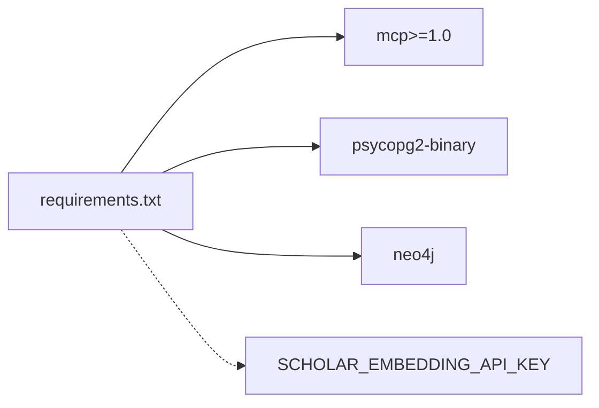

# MCP协议规范

<cite>
**本文档引用的文件**
- [plugin/mcp.json](file://plugin/mcp.json)
- [plugin/.qoder-plugin/plugin.json](file://plugin/.qoder-plugin/plugin.json)
- [plugin/CONNECTORS.md](file://plugin/CONNECTORS.md)
- [plugin/README.md](file://plugin/README.md)
- [requirements.txt](file://requirements.txt)
- [scholar_mcp/__main__.py](file://scholar_mcp/__main__.py)
- [scholar_mcp/server.py](file://scholar_mcp/server.py)
</cite>

## 目录
1. [简介](#简介)
2. [项目结构](#项目结构)
3. [核心组件](#核心组件)
4. [架构总览](#架构总览)
5. [详细组件分析](#详细组件分析)
6. [依赖分析](#依赖分析)
7. [性能考虑](#性能考虑)
8. [故障排查指南](#故障排查指南)
9. [结论](#结论)
10. [附录](#附录)

## 简介
本文件为 Model Context Protocol（MCP）在 Scholar Studio 中的参考规范，聚焦于消息格式、工具调用协议与响应规范，结合本仓库中的 MCP 服务器实现，给出请求/响应模式、认证机制、错误码与状态管理、版本兼容性与扩展字段支持、向后兼容策略、安全与性能优化建议，并提供与 Qoder IDE 集成的实现指南。

## 项目结构
本项目通过一个独立的 MCP 服务器进程暴露一组“工具”（tool），这些工具以 JSON-RPC 风格的请求/响应进行交互；同时，Qoder 插件通过配置文件声明 MCP 服务器，使 IDE 能够发现并调用这些工具。

**图表来源**
- [plugin/.qoder-plugin/plugin.json:1-23](file://plugin/.qoder-plugin/plugin.json#L1-L23)
- [plugin/mcp.json:1-16](file://plugin/mcp.json#L1-L16)
- [scholar_mcp/__main__.py:1-5](file://scholar_mcp/__main__.py#L1-L5)
- [scholar_mcp/server.py:1-631](file://scholar_mcp/server.py#L1-L631)
- [plugin/CONNECTORS.md:1-45](file://plugin/CONNECTORS.md#L1-L45)

**章节来源**
- [plugin/.qoder-plugin/plugin.json:1-23](file://plugin/.qoder-plugin/plugin.json#L1-L23)
- [plugin/mcp.json:1-16](file://plugin/mcp.json#L1-L16)
- [plugin/README.md:1-79](file://plugin/README.md#L1-L79)
- [scholar_mcp/__main__.py:1-5](file://scholar_mcp/__main__.py#L1-L5)
- [scholar_mcp/server.py:1-631](file://scholar_mcp/server.py#L1-L631)
- [plugin/CONNECTORS.md:1-45](file://plugin/CONNECTORS.md#L1-L45)

## 核心组件
- MCP 服务器入口与运行
  - 入口模块负责启动 MCP 服务器实例并运行。
  - 参考路径：[入口模块:1-5](file://scholar_mcp/__main__.py#L1-L5)
- MCP 服务器实现
  - 使用 FastMCP 创建服务器实例，注册多个工具函数，统一通过 JSON-RPC 请求/响应处理。
  - 参考路径：[服务器实现:1-631](file://scholar_mcp/server.py#L1-L631)
- Qoder 插件配置
  - 插件清单声明 MCP 服务器位置与资源目录，IDE 依据此配置加载 MCP。
  - 参考路径：[插件清单:1-23](file://plugin/.qoder-plugin/plugin.json#L1-L23)，[MCP 配置:1-16](file://plugin/mcp.json#L1-L16)
- 外部依赖与环境
  - PostgreSQL、Neo4j、智谱 Embedding API 等服务由 CONNECTORS 文档说明。
  - 参考路径：[连接器依赖:1-45](file://plugin/CONNECTORS.md#L1-L45)
- 运行时依赖
  - Python 包含 mcp>=1.0，以及数据库与图数据库驱动。
  - 参考路径：[依赖列表:1-14](file://requirements.txt#L1-L14)

**章节来源**
- [scholar_mcp/__main__.py:1-5](file://scholar_mcp/__main__.py#L1-L5)
- [scholar_mcp/server.py:1-631](file://scholar_mcp/server.py#L1-L631)
- [plugin/.qoder-plugin/plugin.json:1-23](file://plugin/.qoder-plugin/plugin.json#L1-L23)
- [plugin/mcp.json:1-16](file://plugin/mcp.json#L1-L16)
- [plugin/CONNECTORS.md:1-45](file://plugin/CONNECTORS.md#L1-L45)
- [requirements.txt:1-14](file://requirements.txt#L1-L14)

## 架构总览
下图展示 MCP 在系统中的角色：Qoder IDE 通过插件配置发现 MCP 服务器，随后以 JSON-RPC 风格发起请求；MCP 服务器将请求路由到对应工具函数，工具函数调用后端 CLI 执行具体任务，并返回结果。

**图表来源**
- [plugin/.qoder-plugin/plugin.json:1-23](file://plugin/.qoder-plugin/plugin.json#L1-L23)
- [plugin/mcp.json:1-16](file://plugin/mcp.json#L1-L16)
- [scholar_mcp/server.py:1-631](file://scholar_mcp/server.py#L1-L631)

## 详细组件分析

### JSON-RPC 风格请求/响应模式
- 请求模型
  - 方法名：字符串，唯一标识工具（如 "tools.scholar_scan"）。
  - 参数：对象，包含工具所需的命名参数。
  - ID：数字或字符串，用于匹配请求与响应。
- 响应模型
  - 结果：工具返回的文本或 JSON 字符串（根据工具实现）。
  - 错误：当出现异常或非零退出码时，响应中包含错误信息。
- 示例参考
  - 请求示例路径：[请求示例:46-48](file://plugin/README.md#L46-L48)
  - 响应示例路径：[响应示例:46-48](file://plugin/README.md#L46-L48)

**章节来源**
- [plugin/README.md:46-48](file://plugin/README.md#L46-L48)

### 认证机制
- 当前实现未显式声明认证流程。MCP 服务器通过本地进程启动，工具函数直接调用后端 CLI，未见网络层认证逻辑。
- 建议
  - 若部署为网络服务，应在网关或代理层引入认证（如 API Key、OAuth）。
  - 保持本地开发与生产环境的差异最小化，避免凭据泄露。

**章节来源**
- [scholar_mcp/server.py:1-631](file://scholar_mcp/server.py#L1-L631)

### 错误码与状态管理
- 错误来源
  - 子进程返回码非零：工具函数会将标准错误拼接到输出中，便于前端识别失败。
  - 文件不存在：读取本地文件的工具会在找不到目标文件时返回提示信息。
- 状态管理
  - 工具函数返回字符串或 JSON 文本，IDE 可据此判断成功/失败与进度。
  - 建议在工具层增加更细粒度的状态字段（例如阶段、进度百分比），以便前端可视化。

**章节来源**
- [scholar_mcp/server.py:23-36](file://scholar_mcp/server.py#L23-L36)
- [scholar_mcp/server.py:340-367](file://scholar_mcp/server.py#L340-L367)
- [scholar_mcp/server.py:372-384](file://scholar_mcp/server.py#L372-L384)

### 协议版本兼容性与扩展字段
- 版本声明
  - 插件清单包含版本号，可用于客户端侧的兼容性检查。
  - 参考路径：[插件版本](file://plugin/.qoder-plugin/plugin.json#L3)
- 扩展字段
  - 工具函数签名可携带默认值与可选参数，便于向后兼容新增参数。
  - 参考路径：[工具函数签名示例:48-54](file://scholar_mcp/server.py#L48-L54)，[工具函数签名示例:168-179](file://scholar_mcp/server.py#L168-L179)
- 向后兼容策略
  - 新增参数采用可选与默认值，避免破坏既有调用。
  - 保留旧方法名或提供别名，逐步迁移。

**章节来源**
- [plugin/.qoder-plugin/plugin.json](file://plugin/.qoder-plugin/plugin.json#L3)
- [scholar_mcp/server.py:48-54](file://scholar_mcp/server.py#L48-L54)
- [scholar_mcp/server.py:168-179](file://scholar_mcp/server.py#L168-L179)

### 工具调用协议与响应规范
- 工具注册与调用
  - 使用装饰器注册工具，方法名为 "tools.<function_name>"。
  - 参考路径：[工具注册示例:41-44](file://scholar_mcp/server.py#L41-L44)
- 参数类型与约束
  - 工具函数参数多为字符串或布尔值，部分带有默认值与可选参数。
  - 参考路径：[参数示例:168-179](file://scholar_mcp/server.py#L168-L179)，[参数示例:244-257](file://scholar_mcp/server.py#L244-L257)
- 响应内容
  - 返回文本或 JSON 字符串，IDE 将其作为纯文本或结构化数据展示。
  - 参考路径：[响应示例:42-44](file://scholar_mcp/server.py#L42-L44)

**章节来源**
- [scholar_mcp/server.py:41-44](file://scholar_mcp/server.py#L41-L44)
- [scholar_mcp/server.py:168-179](file://scholar_mcp/server.py#L168-L179)
- [scholar_mcp/server.py:244-257](file://scholar_mcp/server.py#L244-L257)

### 与 Qoder IDE 集成实现指南
- 插件配置
  - 在插件清单中声明 MCP 服务器路径与资源目录。
  - 参考路径：[插件清单:17-21](file://plugin/.qoder-plugin/plugin.json#L17-L21)，[MCP 配置:1-16](file://plugin/mcp.json#L1-L16)
- 启动 MCP 服务器
  - 通过 Python 模块入口启动，IDE 将自动发现并连接。
  - 参考路径：[入口模块:1-5](file://scholar_mcp/__main__.py#L1-L5)
- 验证与测试
  - 插件文档提供了验证步骤与示例命令，可在 IDE 内触发相应工具。
  - 参考路径：[验证步骤:44-48](file://plugin/README.md#L44-L48)

**章节来源**
- [plugin/.qoder-plugin/plugin.json:17-21](file://plugin/.qoder-plugin/plugin.json#L17-L21)
- [plugin/mcp.json:1-16](file://plugin/mcp.json#L1-L16)
- [scholar_mcp/__main__.py:1-5](file://scholar_mcp/__main__.py#L1-L5)
- [plugin/README.md:44-48](file://plugin/README.md#L44-L48)

## 依赖分析
- 运行时依赖
  - mcp>=1.0：提供 MCP 服务器框架。
  - 数据库与图数据库驱动：psycopg2-binary、neo4j。
  - 可选依赖：嵌入 API 密钥、数据集下载等。
- 外部服务
  - PostgreSQL、Neo4j、智谱 Embedding API，按功能需求启用。

**图表来源**
- [requirements.txt:1-14](file://requirements.txt#L1-L14)

**章节来源**
- [requirements.txt:1-14](file://requirements.txt#L1-L14)
- [plugin/CONNECTORS.md:1-45](file://plugin/CONNECTORS.md#L1-L45)

## 性能考虑
- 超时控制
  - 工具函数对耗时操作设置了超时阈值，避免长时间阻塞。
  - 参考路径：[超时示例:23-36](file://scholar_mcp/server.py#L23-L36)，[超时示例:160-165](file://scholar_mcp/server.py#L160-L165)
- 并发与批处理
  - 提供批量处理工具（如批量解析、批量注入），减少多次往返。
  - 参考路径：[批量工具示例:58-60](file://scholar_mcp/server.py#L58-L60)，[批量工具示例:414-423](file://scholar_mcp/server.py#L414-L423)
- 缓存与中间结果
  - 建议在工具层缓存解析后的 JSON 与图谱统计结果，降低重复计算成本。
- 网络与 I/O
  - 对外 API（如嵌入 API）建议增加重试与熔断策略，避免单点故障影响整体体验。

**章节来源**
- [scholar_mcp/server.py:23-36](file://scholar_mcp/server.py#L23-L36)
- [scholar_mcp/server.py:160-165](file://scholar_mcp/server.py#L160-L165)
- [scholar_mcp/server.py:58-60](file://scholar_mcp/server.py#L58-L60)
- [scholar_mcp/server.py:414-423](file://scholar_mcp/server.py#L414-L423)

## 故障排查指南
- 无法连接 MCP 服务器
  - 检查插件配置是否正确指向 MCP 服务器路径。
  - 参考路径：[MCP 配置:1-16](file://plugin/mcp.json#L1-L16)，[插件清单:20-21](file://plugin/.qoder-plugin/plugin.json#L20-L21)
- 工具执行失败
  - 查看工具返回的错误信息（stderr 拼接），定位问题根因。
  - 参考路径：[错误拼接:34-36](file://scholar_mcp/server.py#L34-L36)
- 文件读取失败
  - 确认目标文件是否存在，必要时先执行生成流程。
  - 参考路径：[文件读取示例:340-367](file://scholar_mcp/server.py#L340-L367)，[文件读取示例:372-384](file://scholar_mcp/server.py#L372-L384)
- 外部服务不可用
  - 按 CONNECTORS 文档启动 PostgreSQL、Neo4j 或配置嵌入 API 密钥。
  - 参考路径：[连接器依赖:1-45](file://plugin/CONNECTORS.md#L1-L45)

**章节来源**
- [plugin/mcp.json:1-16](file://plugin/mcp.json#L1-L16)
- [plugin/.qoder-plugin/plugin.json:20-21](file://plugin/.qoder-plugin/plugin.json#L20-L21)
- [scholar_mcp/server.py:34-36](file://scholar_mcp/server.py#L34-L36)
- [scholar_mcp/server.py:340-367](file://scholar_mcp/server.py#L340-L367)
- [scholar_mcp/server.py:372-384](file://scholar_mcp/server.py#L372-L384)
- [plugin/CONNECTORS.md:1-45](file://plugin/CONNECTORS.md#L1-L45)

## 结论
本规范基于现有代码实现，明确了 MCP 在 Scholar Studio 中的请求/响应模式、工具注册与调用、错误处理与状态管理、版本与扩展策略，并给出了与 Qoder IDE 的集成步骤与性能优化建议。建议在后续迭代中补充网络认证、更细粒度的状态字段与错误码，以提升协议的健壮性与可观测性。

## 附录
- API 参考（按类别）
  - 论文库
    - 工具：扫描、解析、批量解析、信息查询、全文搜索、列表、统计、导出、年份修正
    - 参考路径：[论文库工具:41-99](file://scholar_mcp/server.py#L41-L99)
  - 图谱与网络
    - 工具：构建图谱、查询概念、引用网络分析
    - 参考路径：[图谱工具:127-156](file://scholar_mcp/server.py#L127-L156)
  - RAG
    - 工具：构建索引、语义搜索
    - 参考路径：[RAG 工具:160-179](file://scholar_mcp/server.py#L160-L179)
  - 外部接口
    - 工具：arXiv 搜索
    - 参考路径：[外部工具:184-193](file://scholar_mcp/server.py#L184-L193)
  - 元数据补全
    - 工具：图谱统计、作者修正、会议修正、引用解析
    - 参考路径：[元数据工具:197-239](file://scholar_mcp/server.py#L197-L239)
  - 批处理预处理
    - 工具：自动生成笔记、质量评分、分类标签
    - 参考路径：[批处理工具:244-293](file://scholar_mcp/server.py#L244-L293)
  - 编排与工作流
    - 工具：全量引导、单篇摄入、调研、领域景观
    - 参考路径：[编排工具:297-337](file://scholar_mcp/server.py#L297-L337)
  - 文件访问
    - 工具：读取解析后的论文、读取技能说明
    - 参考路径：[文件访问工具:340-397](file://scholar_mcp/server.py#L340-L397)
  - 知识库更新
    - 工具：arXiv 下载、批量摄入、KB 更新、元数据增强
    - 参考路径：[KB 更新工具:402-453](file://scholar_mcp/server.py#L402-L453)
  - 研究循环
    - 工具：兴趣管理、研究同步
    - 参考路径：[研究循环工具:458-495](file://scholar_mcp/server.py#L458-L495)
  - 执行层
    - 工具：LaTeX 编译、实验运行、对比、环境准备、调试、数据集下载、读取实验报告、读取编译日志
    - 参考路径：[执行层工具:500-622](file://scholar_mcp/server.py#L500-L622)