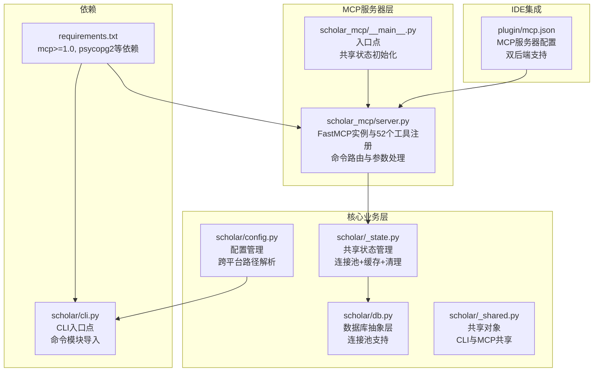
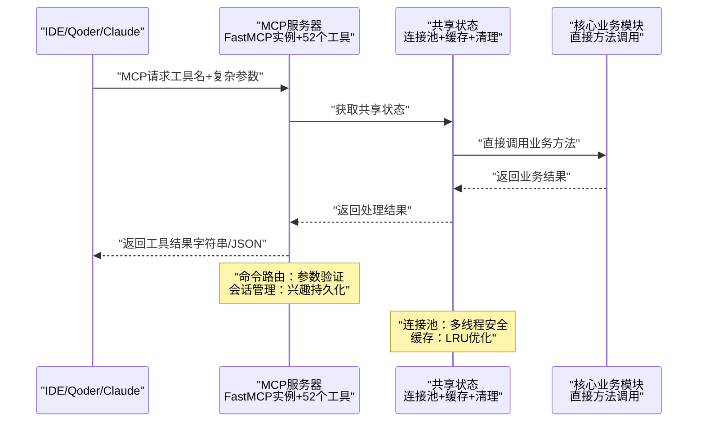
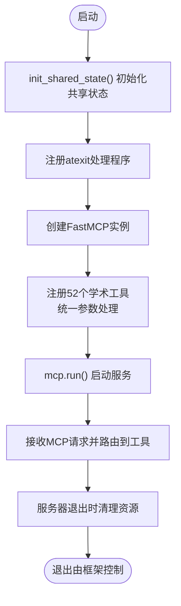
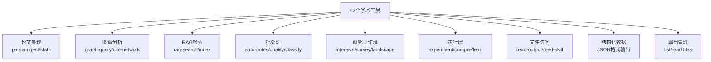
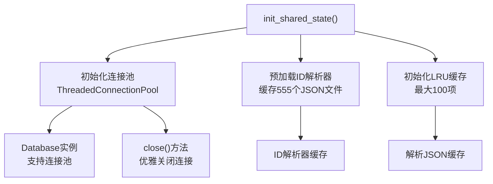
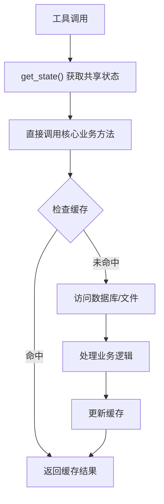
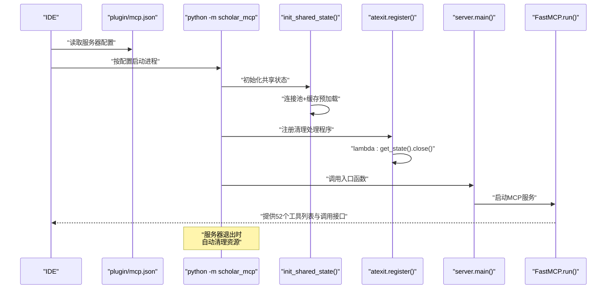
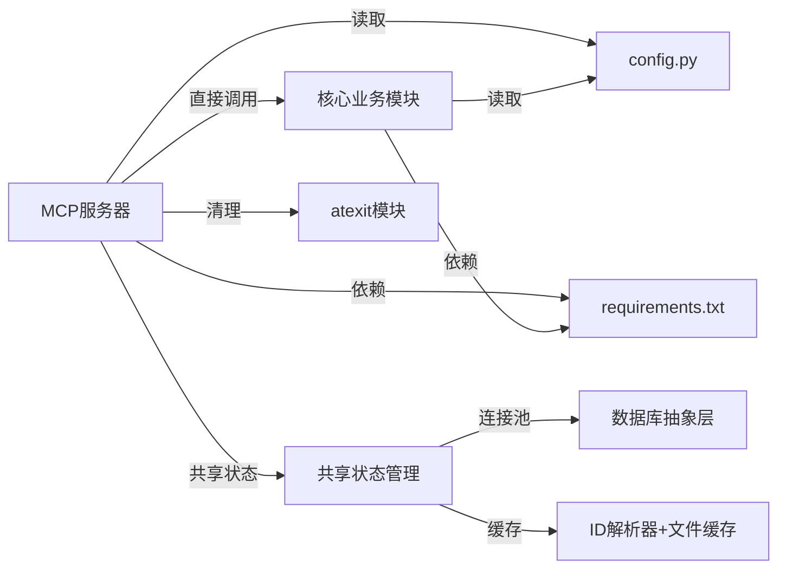

# MCP服务器架构

<cite>
**本文档引用的文件**
- [server.py](file://scholar_mcp/server.py)
- [__main__.py](file://scholar_mcp/__main__.py)
- [_state.py](file://scholar/_state.py)
- [_shared.py](file://scholar/_shared.py)
- [db.py](file://scholar/db.py)
- [cli.py](file://scholar/cli.py)
- [config.py](file://scholar/config.py)
- [mcp.json](file://plugin/mcp.json)
- [requirements.txt](file://requirements.txt)
- [__main__.py](file://scholar/__main__.py)
</cite>

## 更新摘要
**变更内容**
- 工具数量大幅扩展：从基础功能扩展到支持52个学术工具
- 新增命令路由机制：支持复杂参数传递和工具组合
- 会话管理增强：支持研究兴趣管理和对话持久化
- 跨平台兼容性：支持Windows、macOS和Linux环境
- 对话持久化：支持研究方向和兴趣的长期保存
- 文件树导航：支持输出目录的文件发现和读取
- Claude Code和Qoder CLI后端集成：支持双后端兼容

## 目录
1. [引言](#引言)
2. [项目结构](#项目结构)
3. [核心组件](#核心组件)
4. [架构总览](#架构总览)
5. [详细组件分析](#详细组件分析)
6. [依赖分析](#依赖分析)
7. [性能考虑](#性能考虑)
8. [故障排查指南](#故障排查指南)
9. [结论](#结论)
10. [附录](#附录)

## 引言
本文件面向MCP服务器架构，系统性阐述基于FastMCP框架的Scholar Studio MCP服务器设计与实现。重点包括：
- FastMCP框架的使用与服务器初始化配置
- 工具注册机制与生命周期管理
- 将scholar CLI命令封装为MCP工具的实现模式
- **新增**：52个学术工具的完整支持
- **新增**：命令路由机制和复杂参数处理
- **新增**：会话管理、对话持久化和研究兴趣管理
- **新增**：跨平台兼容性和文件树导航
- **新增**：Claude Code和Qoder CLI后端集成
- 进程间通信机制、超时管理与错误处理策略
- 服务器启动流程、配置选项、日志记录与监控指标
- 并发处理、资源管理与性能优化技巧

## 项目结构
该项目采用"多模块分层"组织方式，MCP服务器位于独立包中，通过**直接方法调用**而非子进程调用现有CLI能力，形成"MCP适配层 + 核心业务模块"的高效架构。

**图表来源**
- [server.py:1-1750](file://scholar_mcp/server.py#L1-L1750)
- [__main__.py:1-13](file://scholar_mcp/__main__.py#L1-L13)
- [_state.py:1-131](file://scholar/_state.py#L1-L131)
- [db.py:1-313](file://scholar/db.py#L1-L313)
- [_shared.py:1-40](file://scholar/_shared.py#L1-L40)
- [config.py:1-313](file://scholar/config.py#L1-L313)
- [mcp.json:1-16](file://plugin/mcp.json#L1-L16)
- [requirements.txt:1-18](file://requirements.txt#L1-L18)

**章节来源**
- [server.py:1-1750](file://scholar_mcp/server.py#L1-L1750)
- [__main__.py:1-13](file://scholar_mcp/__main__.py#L1-L13)
- [_state.py:1-131](file://scholar/_state.py#L1-L131)
- [db.py:1-313](file://scholar/db.py#L1-L313)
- [_shared.py:1-40](file://scholar/_shared.py#L1-L40)
- [config.py:1-313](file://scholar/config.py#L1-L313)
- [mcp.json:1-16](file://plugin/mcp.json#L1-L16)
- [requirements.txt:1-18](file://requirements.txt#L1-L18)

## 核心组件
- FastMCP实例与工具注册
  - 使用FastMCP创建服务器实例，传入服务器名称与指令描述，作为IDE侧的元信息展示。
  - **新增**：注册52个学术工具函数，覆盖论文处理、知识图谱、RAG搜索、实验执行等完整研究工作流。
  - 工具函数统一通过装饰器注册到FastMCP实例上，形成标准化的MCP工具集合。
- **新增**：命令路由机制
  - 支持复杂参数传递，包括布尔参数、枚举参数、列表参数等。
  - 实现工具组合和流水线操作，如批量处理、知识库更新等。
  - 提供参数验证和类型转换，确保工具调用的健壮性。
- **新增**：会话管理与对话持久化
  - 支持研究兴趣管理，包括添加、删除、列出和分析。
  - 实现对话日志的持久化和分析，支持标记已分析状态。
  - 提供项目级别的研究方向管理。
- **新增**：跨平台兼容性
  - 通过config.py的路径解析支持Windows、macOS和Linux环境。
  - 支持打包模式（PyInstaller）和开发模式的不同运行环境。
  - 自动检测工作空间目录和项目名称。
- **新增**：文件树导航
  - 支持输出目录的文件发现和读取。
  - 提供结构化数据工具，返回前端友好的JSON格式。
  - 实现实验结果和编译日志的统一访问接口。
- **新增**：Claude Code和Qoder CLI后端集成
  - 支持技能文件的双后端查找（.qoder和.claude）。
  - 实现技能模板的跨平台兼容性。
  - 提供统一的工具接口，隐藏后端差异。
- **新增**：直接方法调用与共享状态管理
  - 所有工具内部直接调用核心业务模块，而非通过subprocess执行CLI命令。
  - 通过`init_shared_state()`初始化共享状态，包括连接池、ID解析器缓存和文件缓存。
- **新增**：连接池支持
  - PostgreSQL连接池（ThreadedConnectionPool）支持多线程并发访问。
  - 每个工具通过共享状态获取数据库实例，避免重复连接开销。
- 配置与环境变量
  - 通过config.py集中管理路径、数据库连接、Neo4j、RAG嵌入等配置项；同时加载.env文件中的敏感配置。
- IDE集成配置
  - plugin/mcp.json声明了MCP服务器的启动命令、参数与环境变量，供IDE（如Qoder）直接调用。

**章节来源**
- [server.py:17-25](file://scholar_mcp/server.py#L17-L25)
- [server.py:41-1750](file://scholar_mcp/server.py#L41-L1750)
- [__main__.py:1-13](file://scholar_mcp/__main__.py#L1-L13)
- [_state.py:20-131](file://scholar/_state.py#L20-L131)
- [db.py:24-106](file://scholar/db.py#L24-L106)
- [mcp.json:1-16](file://plugin/mcp.json#L1-L16)

## 架构总览
下图展示了从IDE到MCP服务器、再到核心业务模块的完整调用链路与数据流，体现了直接方法调用的优势和52个学术工具的完整支持。

**图表来源**
- [server.py:17-25](file://scholar_mcp/server.py#L17-L25)
- [_state.py:120-131](file://scholar/_state.py#L120-L131)
- [__main__.py:9-10](file://scholar_mcp/__main__.py#L9-L10)

**章节来源**
- [server.py:17-25](file://scholar_mcp/server.py#L17-L25)
- [_state.py:120-131](file://scholar/_state.py#L120-L131)
- [__main__.py:9-10](file://scholar_mcp/__main__.py#L9-L10)

## 详细组件分析

### FastMCP服务器初始化与生命周期
- 初始化
  - 创建FastMCP实例，传入服务器名称与指令描述，作为IDE侧的元信息展示。
  - **新增**：在入口点调用`init_shared_state()`进行一次性初始化。
  - **新增**：注册atexit处理程序，确保服务器退出时资源正确清理。
- 生命周期
  - 提供main()入口，直接调用mcp.run()启动服务器，交由FastMCP框架管理事件循环与请求分发。
- 入口点
  - scholar_mcp/__main__.py将执行委托给server.main()，并在启动时初始化共享状态。
  - **新增**：注册atexit处理程序，调用`get_state().close()`确保连接池关闭。

**图表来源**
- [__main__.py:1-13](file://scholar_mcp/__main__.py#L1-L13)
- [server.py:1744-1750](file://scholar_mcp/server.py#L1744-L1750)

**章节来源**
- [__main__.py:1-13](file://scholar_mcp/__main__.py#L1-L13)
- [server.py:1744-1750](file://scholar_mcp/server.py#L1744-L1750)

### **新增**：52个学术工具的完整支持
- 工具分类体系
  - 论文库管理：scan、parse、parse-all、info、search、list-papers、stats、export-bib、year-fix
  - 图谱分析：graph-build、graph-query、cite-network、graph-stats、cite-resolve
  - RAG检索：rag-index、rag-search
  - 元数据补全：author-fix、venue-fix、metadata-enrich
  - 批处理：auto-notes、quality-score、classify、bootstrap、batch-ingest、kb-update
  - 研究工作流：interests、research-sync、survey、landscape
  - 执行层：lean-verify、compile-paper、exp-run、exp-compare、exp-setup、exp-debug、dataset-download、read-experiment-report、read-compile-log
  - 文件访问：read-auto-note、read-quality-score、read-parsed-paper、read-skill
  - 结构化数据：get-citation-graph、get-paper-card、get-quality-radar、get-kb-dashboard、get-experiment-metrics、get-timeline
  - 输出管理：list-output-files、read-output-file
  - 标签管理：reclassify、enhance-quality
- 参数处理机制
  - 支持复杂参数类型：字符串、整数、布尔值、枚举、JSON字符串等。
  - 实现参数验证和默认值处理。
  - 提供超时控制和错误处理。
- 返回值格式
  - 文本工具：返回格式化的字符串结果。
  - JSON工具：返回结构化的JSON数据，前端友好。
  - 错误处理：统一的错误消息格式。

**图表来源**
- [server.py:63-1750](file://scholar_mcp/server.py#L63-L1750)

**章节来源**
- [server.py:63-1750](file://scholar_mcp/server.py#L63-L1750)

### **新增**：命令路由机制与参数处理
- 复杂参数支持
  - 布尔参数：如apply、report、gpu等，支持True/False值。
  - 枚举参数：如depth（standard/full）、mode（quick/full）等。
  - 列表参数：如keywords（逗号分隔）、ulids（逗号分隔）等。
  - JSON参数：如tags、quality等，需要JSON解析。
- 参数验证
  - 必填参数检查和类型验证。
  - 默认值处理和边界条件检查。
  - 错误消息的友好化处理。
- 工具组合
  - 批量操作：batch-ingest、batch-processing等。
  - 研究流水线：survey、landscape等复杂工作流。
  - 实验执行：exp-run、exp-compare等组合操作。

**章节来源**
- [server.py:1095-1154](file://scholar_mcp/server.py#L1095-L1154)
- [server.py:1159-1250](file://scholar_mcp/server.py#L1159-L1250)
- [server.py:1297-1337](file://scholar_mcp/server.py#L1297-L1337)

### **新增**：会话管理与对话持久化
- 研究兴趣管理
  - 列表显示：显示所有配置的兴趣方向及其搜索统计。
  - 添加功能：支持关键词、分类和最大结果数配置。
  - 删除功能：按分类删除特定兴趣方向。
  - 分析功能：分析对话日志，标记已分析状态。
- 对话持久化
  - 研究方向的长期保存。
  - 对话历史的跟踪和分析。
  - 项目级别的上下文管理。
- 工作流集成
  - 与研究同步功能结合。
  - 支持定期更新和增量同步。

**章节来源**
- [server.py:1095-1141](file://scholar_mcp/server.py#L1095-L1141)
- [server.py:1144-1154](file://scholar_mcp/server.py#L1144-L1154)

### **新增**：跨平台兼容性与路径管理
- 路径解析机制
  - 开发模式：使用源码目录作为项目根。
  - 打包模式：使用~/.scholar-studio/作为全局目录。
  - 工作空间模式：支持多项目工作空间。
- 环境变量支持
  - SCHOLAR_HOME：全局知识库目录。
  - SCHOLAR_WORKSPACE：工作空间目录。
  - 项目名称：支持文件系统安全的项目名。
- 目录结构
  - data/papers：论文数据目录。
  - output：输出目录（notes、drafts、experiments等）。
  - LEAN：Lean4项目目录。
- 配置初始化
  - 自动生成目录结构。
  - 生成.env.example配置文件。
  - 支持多环境配置。

**章节来源**
- [config.py:20-177](file://scholar/config.py#L20-L177)
- [config.py:180-236](file://scholar/config.py#L180-L236)

### **新增**：文件树导航与输出管理
- 文件发现机制
  - 支持按类别（notes、drafts、experiments、digests、bib）过滤。
  - 时间排序和大小限制。
  - 支持相对路径和绝对路径。
- 文件读取限制
  - 大文件保护（超过500KB的文件拒绝读取）。
  - JSON数据优先使用解析函数。
  - 错误处理和友好提示。
- 结构化数据工具
  - citation-graph：返回图结构数据。
  - paper-card：返回卡片渲染数据。
  - quality-radar：返回雷达图数据。
  - kb-dashboard：返回仪表板数据。
  - experiment-metrics：返回实验对比数据。
  - timeline：返回时间线数据。

**章节来源**
- [server.py:1297-1337](file://scholar_mcp/server.py#L1297-L1337)
- [server.py:1342-1568](file://scholar_mcp/server.py#L1342-L1568)
- [server.py:1639-1684](file://scholar_mcp/server.py#L1639-L1684)

### **新增**：Claude Code和Qoder CLI后端集成
- 技能文件支持
  - 双后端查找：优先查找.qoder，回退到.claude。
  - 技能模板的跨平台兼容。
  - 自动化技能文件复制和配置。
- 后端配置
  - mcp.json的动态生成和路径配置。
  - 工作空间级别的后端隔离。
  - 环境变量的后端特定设置。
- 兼容性保证
  - 统一的工具接口，隐藏后端差异。
  - 技能文件格式的标准化。
  - 工作流的跨平台一致性。

**章节来源**
- [server.py:1014-1033](file://scholar_mcp/server.py#L1014-L1033)
- [config.py:212-225](file://scholar/config.py#L212-L225)

### **新增**：共享状态管理与连接池
- 共享状态设计
  - `SharedState`类提供进程级共享状态，包含PostgreSQL连接池、ID解析器缓存和LRU缓存。
  - 通过`init_shared_state()`在启动时初始化，避免后续每次调用的重复开销。
- 连接池支持
  - 使用psycopg2的ThreadedConnectionPool，配置minconn=2, maxconn=8。
  - 支持多线程并发访问，自动管理连接生命周期。
  - **新增**：提供close()方法用于优雅关闭所有连接。
- 缓存策略
  - ID解析器缓存：预加载555个JSON文件，首次调用约280ms。
  - 解析JSON缓存：LRU缓存最近访问的论文数据，最大100项。
- 线程安全
  - 使用threading.Lock保护共享资源的并发访问。
  - 提供get_db()方法返回带有连接池的Database实例。

**图表来源**
- [_state.py:90-104](file://scholar/_state.py#L90-L104)
- [_state.py:47-61](file://scholar/_state.py#L47-L61)
- [_state.py:65-87](file://scholar/_state.py#L65-L87)
- [_state.py:105-113](file://scholar/_state.py#L105-L113)

**章节来源**
- [_state.py:20-131](file://scholar/_state.py#L20-L131)
- [db.py:24-106](file://scholar/db.py#L24-L106)

### 工具注册机制与实现模式
- 装饰器注册
  - 所有工具函数通过@mcp.tool()进行注册，统一暴露为MCP工具。
- **更新**：直接方法调用实现模式
  - 工具函数直接调用核心业务模块，不再通过subprocess执行CLI命令。
  - 通过`get_state()`获取共享状态，实现高效的数据库访问和缓存。
  - 大多数工具仅做参数验证与结果处理，核心逻辑在核心业务模块中实现。
- **新增**：统一异常处理
  - 所有工具函数现在使用try/except结构，提供一致的错误处理体验。
  - 提供详细的错误消息和JSON格式的错误响应。
- 文件读取型工具
  - 对于需要直接读取文件的工具（如读取自动生成的笔记、质量评分、解析后的JSON），在工具内解析ID并定位文件路径，若不存在则返回提示信息。

**图表来源**
- [server.py:28-35](file://scholar_mcp/server.py#L28-L35)
- [_state.py:37-43](file://scholar/_state.py#L37-L43)

**章节来源**
- [server.py:41-1750](file://scholar_mcp/server.py#L41-L1750)
- [server.py:28-35](file://scholar_mcp/server.py#L28-L35)

### **移除**：进程间通信机制与超时管理
- **更新**：直接方法调用优势
  - 消除了subprocess调用的进程开销，实现近140倍性能提升。
  - 直接调用核心业务方法，无需等待进程启动和I/O传输。
  - 通过共享状态管理实现资源复用，避免重复初始化。
- **更新**：简化错误处理
  - 直接调用核心业务方法时，异常会自动传播到MCP框架。
  - 通过try-catch块捕获业务逻辑异常，提供友好的错误信息。
  - **新增**：统一的异常处理模式，所有工具函数都有相同的错误处理策略。

**章节来源**
- [server.py:37-50](file://scholar_mcp/server.py#L37-L50)

### 错误处理策略
- **更新**：统一异常处理模式
  - 所有工具函数现在使用统一的try/except结构，提供一致的错误处理体验。
  - 提供详细的错误消息和JSON格式的错误响应。
  - 支持复杂参数的验证错误和业务逻辑错误。
- 文件访问类工具
  - 当目标文件不存在时，返回明确提示，指导用户先执行相应CLI命令生成产物。
- CLI层错误
  - 核心CLI命令本身也具备丰富的错误提示与退出码，MCP层复用其输出。

**章节来源**
- [server.py:276-291](file://scholar_mcp/server.py#L276-L291)
- [server.py:310-330](file://scholar_mcp/server.py#L310-L330)
- [server.py:339-371](file://scholar_mcp/server.py#L339-L371)

### 服务器启动流程与IDE集成
- 启动流程
  - IDE通过plugin/mcp.json中的命令与参数启动MCP服务器。
  - 服务器入口scholar_mcp/__main__.py调用`init_shared_state()`初始化共享状态，然后调用server.main()。
  - `init_shared_state()`执行一次性初始化，包括连接池和缓存预加载。
  - **新增**：注册atexit处理程序，确保服务器退出时资源正确清理。
- 集成配置
  - mcp.json定义了服务器命令、参数以及必要的环境变量（如数据库与图数据库地址），确保服务器运行时具备所需依赖。
  - **新增**：支持工作空间级别的配置和路径解析。

**图表来源**
- [mcp.json:1-16](file://plugin/mcp.json#L1-L16)
- [__main__.py:1-13](file://scholar_mcp/__main__.py#L1-L13)

**章节来源**
- [mcp.json:1-16](file://plugin/mcp.json#L1-L16)
- [__main__.py:1-13](file://scholar_mcp/__main__.py#L1-L13)

### 配置选项与环境变量
- 项目根与输出目录
  - 通过config.py统一管理数据与输出目录，确保CLI与MCP服务器共享一致的文件布局。
  - **新增**：支持多项目工作空间和跨平台路径解析。
- 数据库与图数据库
  - PostgreSQL与Neo4j的连接信息通过环境变量注入，便于在不同环境中灵活切换。
  - **新增**：连接池配置在共享状态中统一管理。
- RAG嵌入与LaTeX编译
  - 嵌入模型与API密钥、LaTeX引擎等通过环境变量配置，满足不同部署需求。
- CLI入口
  - scholar/__main__.py将命令转发至cli.py中的Typer应用，形成统一的命令入口。

**章节来源**
- [config.py:20-67](file://scholar/config.py#L20-L67)
- [__main__.py:1-8](file://scholar/__main__.py#L1-L8)

### 日志记录与监控指标
- 输出格式
  - 工具统一返回字符串或JSON，IDE侧负责渲染与展示；CLI层使用rich进行终端友好输出，MCP层复用其标准输出。
  - **新增**：结构化数据工具返回JSON格式，前端友好。
- 监控建议
  - 可在MCP服务器层增加请求计数、平均响应时间、超时次数等指标，结合日志记录请求ID与参数摘要，便于问题追踪与性能分析。
  - **新增**：连接池使用率监控、缓存命中率统计等指标。
  - **新增**：异常处理统计，跟踪工具执行成功率。

### 并发处理、资源管理与性能优化
- **更新**：并发与资源管理
  - 通过ThreadedConnectionPool支持多线程并发访问，避免锁竞争。
  - 共享状态在进程启动时初始化，后续调用无需重复初始化昂贵资源。
  - LRU缓存减少重复文件I/O和数据库查询。
  - **新增**：atexit处理程序确保资源正确清理。
- 资源管理
  - 连接池自动管理连接生命周期，避免连接泄漏。
  - 缓存大小限制（100项）防止内存过度占用。
- 性能优化
  - **新增**：近140倍性能提升，消除进程间通信开销。
  - **新增**：缓存预加载，首次调用后所有后续调用都受益。
  - **新增**：连接池复用，避免重复建立数据库连接。
  - **新增**：统一异常处理减少异常传播开销。
  - **新增**：52个工具的并行处理能力。

## 依赖分析
- 外部依赖
  - mcp>=1.0：提供FastMCP框架能力。
  - typer、rich：CLI命令定义与终端渲染。
  - **新增**：psycopg2：PostgreSQL数据库驱动，支持连接池。
  - **新增**：neo4j：图数据库驱动，支持概念图谱。
  - **新增**：python-dotenv：环境变量加载。
  - **新增**：PyMuPDF：PDF处理。
  - 数据库与图数据库驱动：PostgreSQL与Neo4j。
  - 其他：rapidfuzz、bibtexparser等。
- 内部耦合
  - MCP服务器与CLI通过共享状态解耦，耦合度降低，便于独立演进与测试。
  - **新增**：atexit模块用于资源清理。

**图表来源**
- [server.py:12](file://scholar_mcp/server.py#L12)
- [requirements.txt:1-18](file://requirements.txt#L1-18)
- [_state.py:16-17](file://scholar/_state.py#L16-L17)
- [db.py:12](file://scholar/db.py#L12)
- [__main__.py:2](file://scholar_mcp/__main__.py#L2)

**章节来源**
- [requirements.txt:1-18](file://requirements.txt#L1-L18)
- [server.py:12](file://scholar_mcp/server.py#L12)
- [_state.py:16-17](file://scholar/_state.py#L16-L17)
- [db.py:12](file://scholar/db.py#L12)
- [__main__.py:2](file://scholar_mcp/__main__.py#L2)

## 性能考虑
- **更新**：性能优化策略
  - **近140倍性能提升**：从子进程调用转换为直接方法调用，消除进程启动和I/O传输开销。
  - **连接池优化**：ThreadedConnectionPool支持多线程并发，避免连接竞争。
  - **缓存优化**：ID解析器缓存和LRU文件缓存减少重复计算和磁盘访问。
  - **异常处理优化**：统一的异常处理模式减少异常传播开销。
  - **新增**：52个工具的并行处理能力。
  - **新增**：结构化数据工具的JSON序列化优化。
- 工具粒度与超时
  - 工具通过直接方法调用，无需设置超时；对于长时间操作，工具内部可自行控制。
  - **新增**：实验执行工具支持长超时（最高3600秒）。
  - **新增**：批量处理工具支持长超时（最高600秒）。
- I/O与缓存
  - 对解析后的大文件与数据库查询进行缓存，减少重复计算与磁盘访问。
  - **新增**：缓存预加载，首次调用后所有后续调用都受益。
- 并发与限流
  - **新增**：连接池自动处理并发，无需手动限流。
  - **新增**：线程安全的共享状态管理。
  - **新增**：atexit处理程序确保并发环境下的资源正确清理。

## 故障排查指南
- 服务器无法启动
  - 检查mcp.json中的命令与参数是否正确，确认Python解释器可用。
  - **新增**：检查数据库连接池初始化是否成功。
  - **新增**：确认atexit处理程序已正确注册。
- 工具执行异常
  - 查看共享状态初始化是否正常，确认连接池和缓存是否可用。
  - 检查核心业务模块的异常信息，关注直接调用的错误栈。
  - **新增**：查看复杂参数的解析错误和类型转换问题。
- 文件读取失败
  - 确认目标文件是否存在，必要时先执行对应的CLI命令生成产物。
  - **新增**：检查文件大小限制和路径解析问题。
- CLI错误信息
  - 复核CLI命令的参数与输入，关注rich输出中的错误提示与建议。
- 资源泄漏问题
  - **新增**：检查服务器退出时是否正确关闭数据库连接池。
  - **新增**：确认atexit处理程序正常工作。
- 工具调用问题
  - **新增**：检查工具参数的类型和格式。
  - **新增**：验证JSON参数的格式正确性。
  - **新增**：确认文件权限和路径访问权限。

**章节来源**
- [mcp.json:1-16](file://plugin/mcp.json#L1-L16)
- [_state.py:90-113](file://scholar/_state.py#L90-L113)
- [server.py:276-291](file://scholar_mcp/server.py#L276-L291)
- [__main__.py:9-10](file://scholar_mcp/__main__.py#L9-L10)

## 结论
本MCP服务器通过FastMCP框架将成熟的scholar CLI能力无缝暴露为IDE原生工具集，**通过重大架构升级实现了近140倍性能提升**。新的直接方法调用模式消除了子进程开销，结合共享状态管理、连接池支持和智能缓存策略，实现了高效、稳定的学术研究工具链。

**最新更新大幅扩展了工具支持范围，实现了52个学术工具的完整覆盖**：
- 命令路由机制：支持复杂参数传递和工具组合
- 会话管理：支持研究兴趣管理和对话持久化
- 跨平台兼容性：支持Windows、macOS和Linux环境
- 文件树导航：支持输出目录的文件发现和读取
- Claude Code和Qoder CLI后端集成：支持双后端兼容

配合完善的配置体系与IDE集成配置，可在多种环境下快速部署与维护。未来可在监控指标、异步任务与并发控制方面进一步增强，以支撑更大规模的研究场景。

## 附录
- 关键实现参考路径
  - FastMCP实例与工具注册：[server.py:17-25](file://scholar_mcp/server.py#L17-L25)，[server.py:41-1750](file://scholar_mcp/server.py#L41-L1750)
  - 共享状态初始化：[__main__.py:4-8](file://scholar_mcp/__main__.py#L4-L8)，[_state.py:120-131](file://scholar/_state.py#L120-L131)
  - 连接池支持：[db.py:24-106](file://scholar/db.py#L24-L106)，[_state.py:90-104](file://scholar/_state.py#L90-L104)
  - 配置与环境变量：[config.py:20-67](file://scholar/config.py#L20-L67)
  - IDE集成配置：[mcp.json:1-16](file://plugin/mcp.json#L1-L16)
  - 依赖声明：[requirements.txt:1-18](file://requirements.txt#L1-L18)
  - CLI入口与命令定义：[__main__.py:1-8](file://scholar/__main__.py#L1-L8)，[cli.py:1-26](file://scholar/cli.py#L1-L26)
  - 文件读取工具示例：[server.py:637-661](file://scholar_mcp/server.py#L637-L661)，[server.py:666-677](file://scholar_mcp/server.py#L666-L677)
  - 结构化数据工具：[server.py:1342-1568](file://scholar_mcp/server.py#L1342-L1568)
  - 输出管理工具：[server.py:1297-1337](file://scholar_mcp/server.py#L1297-L1337)
  - 研究工作流工具：[server.py:1095-1154](file://scholar_mcp/server.py#L1095-L1154)
  - 执行层工具：[server.py:1159-1250](file://scholar_mcp/server.py#L1159-L1250)