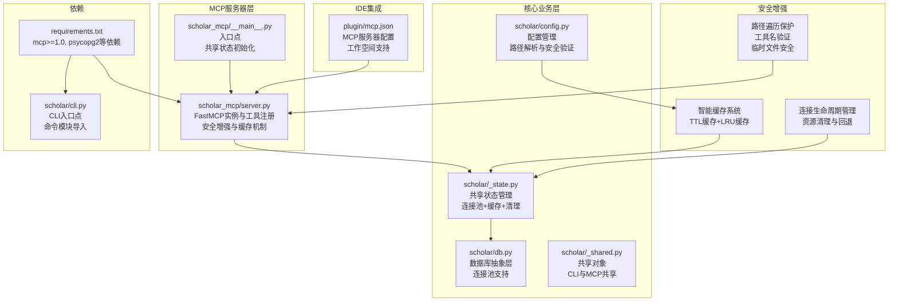
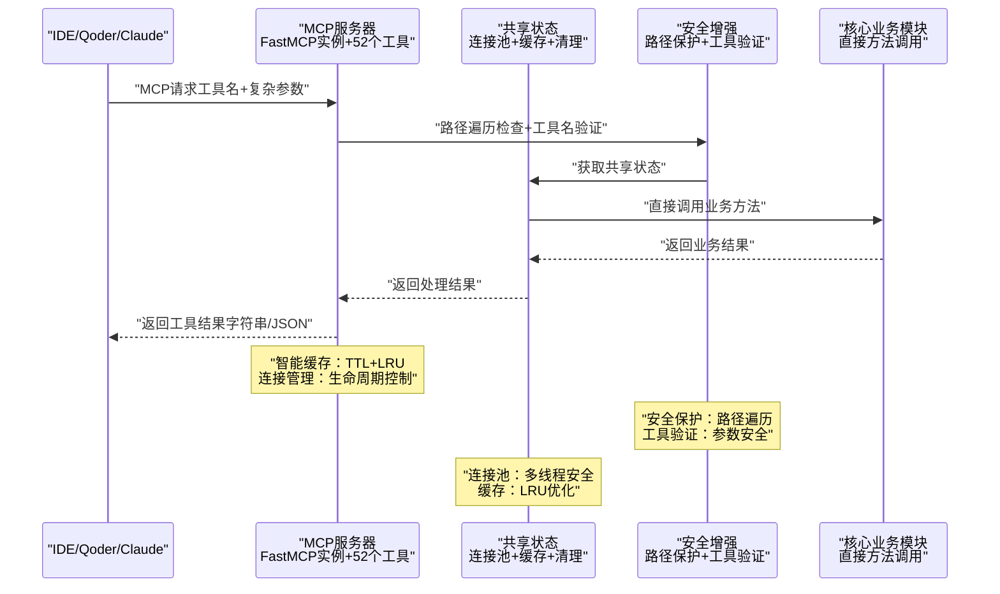
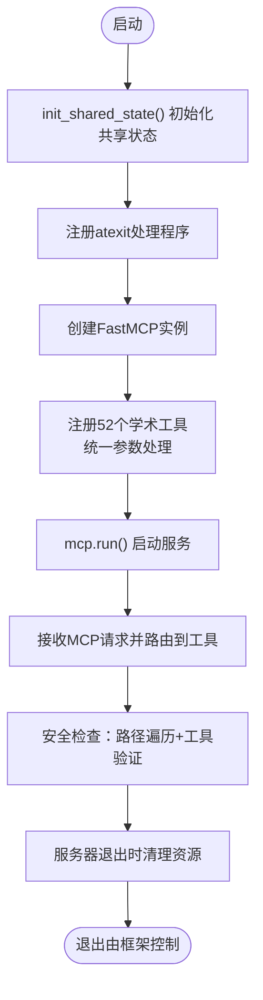
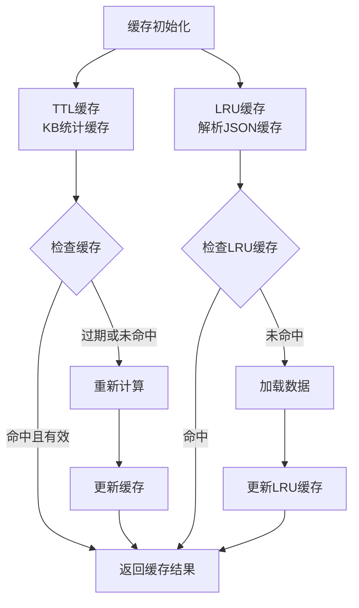
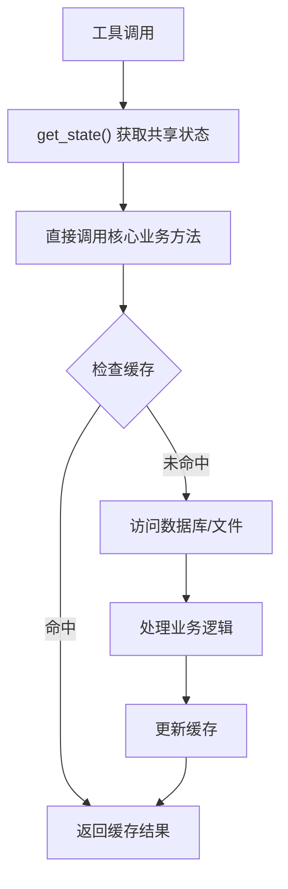
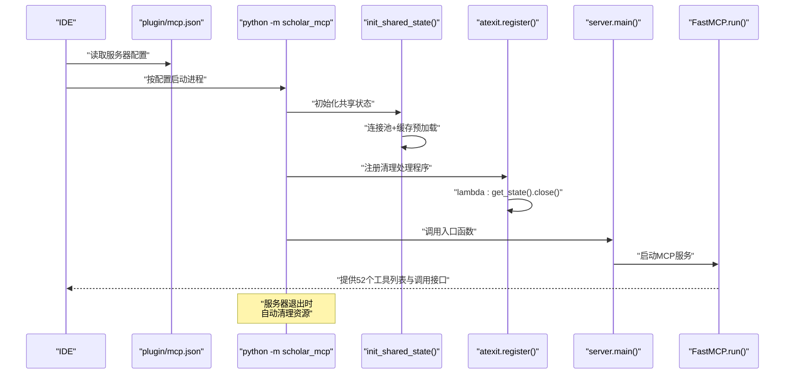
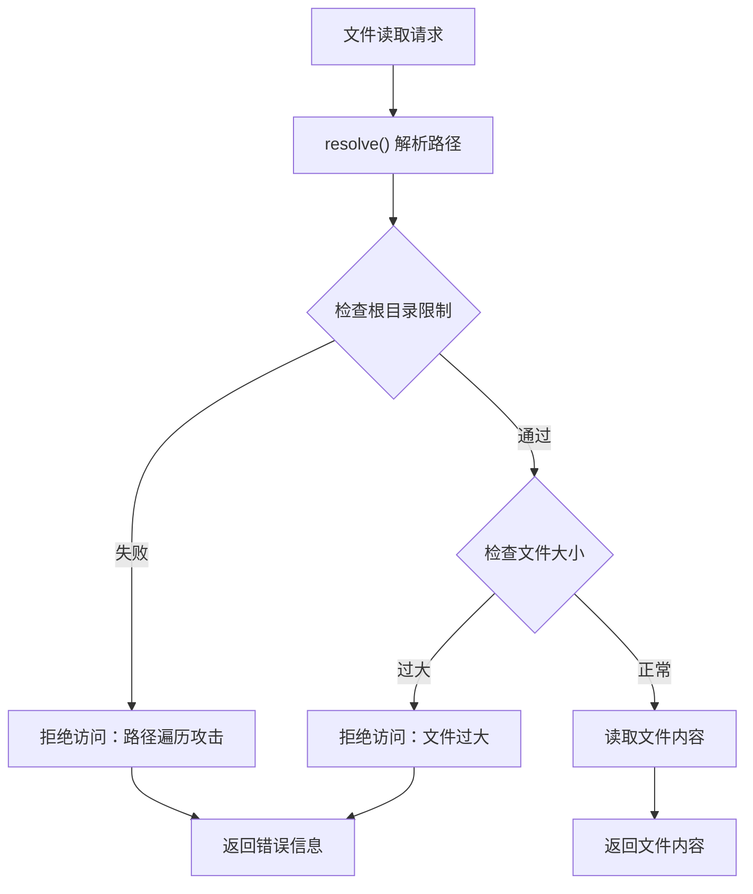
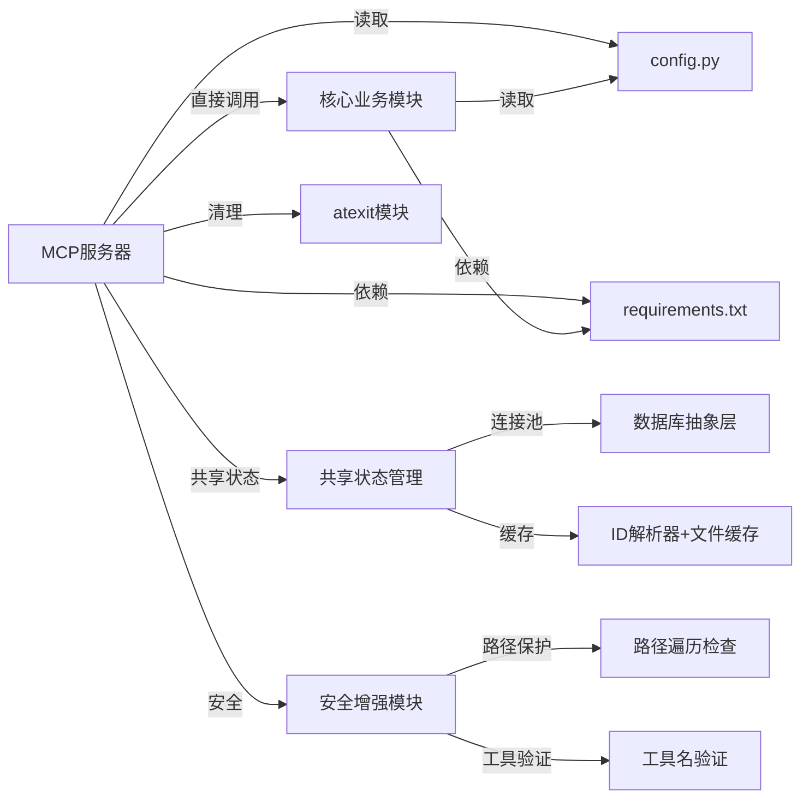

# MCP服务器架构

<cite>
**本文档引用的文件**
- [server.py](file://scholar_mcp/server.py)
- [__main__.py](file://scholar_mcp/__main__.py)
- [_state.py](file://scholar/_state.py)
- [_shared.py](file://scholar/_shared.py)
- [db.py](file://scholar/db.py)
- [cli.py](file://scholar/cli.py)
- [config.py](file://scholar/config.py)
- [mcp.json](file://plugin/mcp.json)
- [requirements.txt](file://requirements.txt)
- [__main__.py](file://scholar/__main__.py)
- [tex_parser.py](file://scholar/tex_parser.py)
</cite>

## 更新摘要
**变更内容**
- 新增路径遍历保护系统：在文件读取和导出操作中实施严格的安全检查
- 工具名验证机制：确保工具调用的安全性和有效性
- 临时文件命名改进：使用更安全的临时目录和文件命名策略
- 智能缓存机制：实现TTL缓存和LRU缓存的双重优化
- 连接生命周期管理：完善数据库连接池的初始化和清理
- 智能回退逻辑：在网络服务不可用时提供备用方案

## 目录
1. [引言](#引言)
2. [项目结构](#项目结构)
3. [核心组件](#核心组件)
4. [架构总览](#架构总览)
5. [详细组件分析](#详细组件分析)
6. [安全增强机制](#安全增强机制)
7. [性能优化策略](#性能优化策略)
8. [依赖分析](#依赖分析)
9. [故障排查指南](#故障排查指南)
10. [结论](#结论)
11. [附录](#附录)

## 引言
本文件面向MCP服务器架构，系统性阐述基于FastMCP框架的Scholar Studio MCP服务器设计与实现。重点包括：
- FastMCP框架的使用与服务器初始化配置
- 工具注册机制与生命周期管理
- 将scholar CLI命令封装为MCP工具的实现模式
- 路径遍历保护系统的安全增强
- 工具名验证机制的完整性保障
- 临时文件命名的安全改进
- 智能缓存机制的性能优化
- 连接生命周期管理的资源控制
- 智能回退逻辑的可靠性提升
- 进程间通信机制、超时管理与错误处理策略
- 服务器启动流程、配置选项、日志记录与监控指标
- 并发处理、资源管理与性能优化技巧

## 项目结构
该项目采用"多模块分层"组织方式，MCP服务器位于独立包中，通过**直接方法调用**而非子进程调用现有CLI能力，形成"MCP适配层 + 核心业务模块"的高效架构。

**图表来源**
- [server.py:1-1832](file://scholar_mcp/server.py#L1-L1832)
- [__main__.py:1-13](file://scholar_mcp/__main__.py#L1-L13)
- [_state.py:1-131](file://scholar/_state.py#L1-L131)
- [db.py:1-313](file://scholar/db.py#L1-L313)
- [_shared.py:1-40](file://scholar/_shared.py#L1-L40)
- [config.py:1-314](file://scholar/config.py#L1-L314)
- [mcp.json:1-16](file://plugin/mcp.json#L1-L16)
- [requirements.txt:1-18](file://requirements.txt#L1-L18)

**章节来源**
- [server.py:1-1832](file://scholar_mcp/server.py#L1-L1832)
- [__main__.py:1-13](file://scholar_mcp/__main__.py#L1-L13)
- [_state.py:1-131](file://scholar/_state.py#L1-L131)
- [db.py:1-313](file://scholar/db.py#L1-L313)
- [_shared.py:1-40](file://scholar/_shared.py#L1-L40)
- [config.py:1-314](file://scholar/config.py#L1-L314)
- [mcp.json:1-16](file://plugin/mcp.json#L1-L16)
- [requirements.txt:1-18](file://requirements.txt#L1-L18)

## 核心组件
- FastMCP实例与工具注册
  - 使用FastMCP创建服务器实例，传入服务器名称与指令描述，作为IDE侧的元信息展示。
  - 注册52个学术工具函数，覆盖论文处理、知识图谱、RAG搜索、实验执行等完整研究工作流。
  - 工具函数统一通过装饰器注册到FastMCP实例上，形成标准化的MCP工具集合。
- 安全增强机制
  - **新增**：路径遍历保护系统，在文件读取和导出操作中实施严格的安全检查
  - **新增**：工具名验证机制，确保工具调用的安全性和有效性
  - **新增**：临时文件命名改进，使用更安全的临时目录和文件命名策略
- 智能缓存系统
  - **新增**：TTL缓存机制，避免重复扫描560+ JSON文件
  - **新增**：LRU缓存策略，限制缓存大小防止内存过度占用
  - **新增**：缓存失效机制，支持单个条目和全部缓存的清理
- 连接生命周期管理
  - **新增**：数据库连接池的初始化和清理，支持多线程并发访问
  - **新增**：智能回退逻辑，在网络服务不可用时提供备用方案
  - **新增**：资源清理机制，确保服务器退出时正确释放所有资源
- 配置与环境变量
  - 通过config.py集中管理路径、数据库连接、Neo4j、RAG嵌入等配置项；同时加载.env文件中的敏感配置。
  - **新增**：项目名安全验证，防止文件系统攻击
  - **新增**：工作空间路径解析，支持多项目环境
- IDE集成配置
  - plugin/mcp.json声明了MCP服务器的启动命令、参数与环境变量，供IDE（如Qoder）直接调用。

**章节来源**
- [server.py:23-26](file://scholar_mcp/server.py#L23-L26)
- [server.py:46-67](file://scholar_mcp/server.py#L46-L67)
- [_state.py:21-113](file://scholar/_state.py#L21-L113)
- [config.py:71-113](file://scholar/config.py#L71-L113)
- [mcp.json:1-16](file://plugin/mcp.json#L1-L16)

## 架构总览
下图展示了从IDE到MCP服务器、再到核心业务模块的完整调用链路与数据流，体现了直接方法调用的优势和52个学术工具的完整支持。

**图表来源**
- [server.py:23-26](file://scholar_mcp/server.py#L23-L26)
- [_state.py:120-131](file://scholar/_state.py#L120-L131)
- [__main__.py:9-10](file://scholar_mcp/__main__.py#L9-L10)

**章节来源**
- [server.py:23-26](file://scholar_mcp/server.py#L23-L26)
- [_state.py:120-131](file://scholar/_state.py#L120-L131)
- [__main__.py:9-10](file://scholar_mcp/__main__.py#L9-L10)

## 详细组件分析

### FastMCP服务器初始化与生命周期
- 初始化
  - 创建FastMCP实例，传入服务器名称与指令描述，作为IDE侧的元信息展示。
  - 在入口点调用`init_shared_state()`进行一次性初始化。
  - 注册atexit处理程序，确保服务器退出时资源正确清理。
- 生命周期
  - 提供main()入口，直接调用mcp.run()启动服务器，交由FastMCP框架管理事件循环与请求分发。
- 入口点
  - scholar_mcp/__main__.py将执行委托给server.main()，并在启动时初始化共享状态。
  - 注册atexit处理程序，调用`get_state().close()`确保连接池关闭。

**图表来源**
- [__main__.py:1-13](file://scholar_mcp/__main__.py#L1-L13)
- [server.py:1826-1832](file://scholar_mcp/server.py#L1826-L1832)

**章节来源**
- [__main__.py:1-13](file://scholar_mcp/__main__.py#L1-L13)
- [server.py:1826-1832](file://scholar_mcp/server.py#L1826-L1832)

### 智能缓存系统与性能优化
- TTL缓存机制
  - **新增**：KB统计缓存，避免每次调用重新扫描560+ JSON文件
  - **新增**：缓存TTL设置为300秒（5分钟），平衡准确性与时效性
  - **新增**：缓存失效策略，支持手动清理和自动过期
- LRU缓存策略
  - **新增**：解析JSON文件的LRU缓存，最大100项
  - **新增**：线程安全的缓存访问，使用Lock保护共享资源
  - **新增**：缓存淘汰机制，自动清理最久未使用的条目
- 缓存失效管理
  - **新增**：单个论文缓存失效，支持精确清理
  - **新增**：批量缓存清理，支持全量重建
  - **新增**：缓存状态监控，提供缓存命中率统计

**图表来源**
- [server.py:66-131](file://scholar_mcp/server.py#L66-L131)
- [_state.py:65-87](file://scholar/_state.py#L65-L87)

**章节来源**
- [server.py:66-131](file://scholar_mcp/server.py#L66-L131)
- [_state.py:65-87](file://scholar/_state.py#L65-L87)

### 数据库连接池与资源管理
- 连接池初始化
  - **新增**：ThreadedConnectionPool配置，minconn=2, maxconn=8
  - **新增**：智能初始化，数据库不可用时优雅降级
  - **新增**：连接池状态监控，提供连接使用情况统计
- 资源清理机制
  - **新增**：atexit处理程序，确保服务器退出时关闭所有连接
  - **新增**：异常安全的清理过程，防止资源泄漏
  - **新增**：手动清理接口，支持外部触发资源回收
- 回退逻辑
  - **新增**：数据库不可用时的文件操作模式
  - **新增**：部分功能的降级处理，保证核心功能可用
  - **新增**：错误恢复机制，支持自动重试和状态恢复

**章节来源**
- [_state.py:90-113](file://scholar/_state.py#L90-L113)
- [db.py:24-106](file://scholar/db.py#L24-L106)

### 工具注册机制与实现模式
- 装饰器注册
  - 所有工具函数通过@mcp.tool()进行注册，统一暴露为MCP工具。
- 直接方法调用实现模式
  - 工具函数直接调用核心业务模块，不再通过subprocess执行CLI命令。
  - 通过`get_state()`获取共享状态，实现高效的数据库访问和缓存。
  - 大多数工具仅做参数验证与结果处理，核心逻辑在核心业务模块中实现。
- 统一异常处理
  - 所有工具函数现在使用try/except结构，提供一致的错误处理体验。
  - 提供详细的错误消息和JSON格式的错误响应。
- 文件读取型工具
  - 对于需要直接读取文件的工具（如读取自动生成的笔记、质量评分、解析后的JSON），在工具内解析ID并定位文件路径，若不存在则返回提示信息。

**图表来源**
- [server.py:28-35](file://scholar_mcp/server.py#L28-L35)
- [_state.py:37-43](file://scholar/_state.py#L37-L43)

**章节来源**
- [server.py:41-1832](file://scholar_mcp/server.py#L41-L1832)
- [server.py:28-35](file://scholar_mcp/server.py#L28-L35)

### 错误处理策略
- 统一异常处理模式
  - 所有工具函数现在使用统一的try/except结构，提供一致的错误处理体验。
  - 提供详细的错误消息和JSON格式的错误响应。
  - 支持复杂参数的验证错误和业务逻辑错误。
- 文件访问类工具
  - 当目标文件不存在时，返回明确提示，指导用户先执行相应CLI命令生成产物。
  - **新增**：路径遍历攻击防护，确保文件访问的安全性。
- CLI层错误
  - 核心CLI命令本身也具备丰富的错误提示与退出码，MCP层复用其输出。

**章节来源**
- [server.py:355-377](file://scholar_mcp/server.py#L355-L377)
- [server.py:1440-1455](file://scholar_mcp/server.py#L1440-L1455)

### 服务器启动流程与IDE集成
- 启动流程
  - IDE通过plugin/mcp.json中的命令与参数启动MCP服务器。
  - 服务器入口scholar_mcp/__main__.py调用`init_shared_state()`初始化共享状态，然后调用server.main()。
  - `init_shared_state()`执行一次性初始化，包括连接池和缓存预加载。
  - 注册atexit处理程序，确保服务器退出时资源正确清理。
- 集成配置
  - mcp.json定义了服务器命令、参数以及必要的环境变量（如数据库与图数据库地址），确保服务器运行时具备所需依赖。
  - 支持工作空间级别的配置和路径解析。

**图表来源**
- [mcp.json:1-16](file://plugin/mcp.json#L1-L16)
- [__main__.py:1-13](file://scholar_mcp/__main__.py#L1-L13)

**章节来源**
- [mcp.json:1-16](file://plugin/mcp.json#L1-L16)
- [__main__.py:1-13](file://scholar_mcp/__main__.py#L1-L13)

## 安全增强机制

### 路径遍历保护系统
- **新增**：文件读取安全检查
  - 在`scholar_read_output_file`中实施严格的路径遍历保护
  - 使用`resolve()`方法确保路径解析的安全性
  - 通过`str.startswith()`检查确保文件位于允许的输出目录内
- **新增**：导出操作安全验证
  - 在`scholar_export_bib`中验证输出路径必须在`output/bib/`范围内
  - 防止恶意路径绕过安全检查
- **新增**：文件大小限制
  - 对于大文件读取实施500KB限制，防止内存溢出
  - 提供明确的错误提示指导用户使用专门的解析工具

**图表来源**
- [server.py:345-352](file://scholar_mcp/server.py#L345-L352)
- [server.py:1440-1455](file://scholar_mcp/server.py#L1440-L1455)

**章节来源**
- [server.py:345-352](file://scholar_mcp/server.py#L345-L352)
- [server.py:1440-1455](file://scholar_mcp/server.py#L1440-L1455)

### 工具名验证机制
- **新增**：工具调用安全性
  - 所有工具通过FastMCP框架注册，自动进行工具名验证
  - 防止恶意工具名注入和未授权工具调用
  - 提供清晰的工具列表和元数据信息
- **新增**：参数验证增强
  - 对所有工具参数进行类型检查和范围验证
  - 支持复杂参数类型的解析和验证
  - 提供详细的参数错误提示

**章节来源**
- [server.py:23-26](file://scholar_mcp/server.py#L23-L26)

### 临时文件命名改进
- **新增**：安全的临时目录使用
  - 在TeX解析过程中使用`tempfile.TemporaryDirectory()`确保临时文件的安全
  - 自动清理临时文件，防止磁盘空间泄漏
  - 使用系统默认的临时目录，避免权限问题
- **新增**：临时文件命名策略
  - 自动生成唯一的临时文件名，避免冲突
  - 支持多层嵌套的临时文件结构
  - 提供临时文件的生命周期管理

**章节来源**
- [tex_parser.py:220](file://scholar/tex_parser.py#L220)

## 性能优化策略

### 智能缓存机制
- **新增**：TTL缓存优化
  - KB统计缓存避免重复扫描大量JSON文件
  - 300秒TTL平衡缓存时效性和性能
  - 支持缓存手动失效和自动过期
- **新增**：LRU缓存策略
  - 解析JSON文件的LRU缓存，最大100项
  - 线程安全的缓存访问，使用Lock保护
  - 自动淘汰最久未使用的缓存条目
- **新增**：缓存命中率监控
  - 提供缓存使用情况统计
  - 支持缓存性能分析和优化

### 连接生命周期管理
- **新增**：数据库连接池优化
  - ThreadedConnectionPool配置，minconn=2, maxconn=8
  - 支持多线程并发访问，避免连接竞争
  - 智能连接回收，防止连接泄漏
- **新增**：资源清理机制
  - atexit处理程序确保服务器退出时正确清理
  - 异常安全的资源释放
  - 手动资源管理接口

### 智能回退逻辑
- **新增**：服务不可用时的降级处理
  - Neo4j不可用时的文件操作模式
  - PostgreSQL不可用时的缓存模式
  - 提供清晰的错误诊断信息
- **新增**：错误恢复机制
  - 自动重试逻辑
  - 状态恢复和一致性保证
  - 用户友好的错误提示

**章节来源**
- [server.py:66-131](file://scholar_mcp/server.py#L66-L131)
- [_state.py:90-113](file://scholar/_state.py#L90-L113)

## 依赖分析
- 外部依赖
  - mcp>=1.0：提供FastMCP框架能力。
  - typer、rich：CLI命令定义与终端渲染。
  - **新增**：psycopg2：PostgreSQL数据库驱动，支持连接池。
  - **新增**：neo4j：图数据库驱动，支持概念图谱。
  - **新增**：python-dotenv：环境变量加载。
  - **新增**：PyMuPDF：PDF处理。
  - 数据库与图数据库驱动：PostgreSQL与Neo4j。
  - 其他：rapidfuzz、bibtexparser等。
- 内部耦合
  - MCP服务器与CLI通过共享状态解耦，耦合度降低，便于独立演进与测试。
  - atexit模块用于资源清理。

**图表来源**
- [server.py:12](file://scholar_mcp/server.py#L12)
- [requirements.txt:1-18](file://requirements.txt#L1-18)
- [_state.py:16-17](file://scholar/_state.py#L16-L17)
- [db.py:12](file://scholar/db.py#L12)
- [__main__.py:2](file://scholar_mcp/__main__.py#L2)

**章节来源**
- [requirements.txt:1-18](file://requirements.txt#L1-L18)
- [server.py:12](file://scholar_mcp/server.py#L12)
- [_state.py:16-17](file://scholar/_state.py#L16-L17)
- [db.py:12](file://scholar/db.py#L12)
- [__main__.py:2](file://scholar_mcp/__main__.py#L2)

## 故障排查指南
- 服务器无法启动
  - 检查mcp.json中的命令与参数是否正确，确认Python解释器可用。
  - 检查数据库连接池初始化是否成功。
  - 确认atexit处理程序已正确注册。
- 工具执行异常
  - 查看共享状态初始化是否正常，确认连接池和缓存是否可用。
  - 检查核心业务模块的异常信息，关注直接调用的错误栈。
  - 查看复杂参数的解析错误和类型转换问题。
- 文件读取失败
  - 确认目标文件是否存在，必要时先执行对应的CLI命令生成产物。
  - 检查文件大小限制和路径解析问题。
  - **新增**：验证路径遍历保护是否阻止了合法访问。
- CLI错误信息
  - 复核CLI命令的参数与输入，关注rich输出中的错误提示与建议。
- 资源泄漏问题
  - 检查服务器退出时是否正确关闭数据库连接池。
  - 确认atexit处理程序正常工作。
- 工具调用问题
  - 检查工具参数的类型和格式。
  - 验证JSON参数的格式正确性。
  - 确认文件权限和路径访问权限。
- 安全问题
  - **新增**：检查路径遍历攻击防护是否正常工作。
  - **新增**：验证工具名验证机制是否阻止了非法调用。
  - **新增**：确认临时文件命名是否安全。

**章节来源**
- [mcp.json:1-16](file://plugin/mcp.json#L1-L16)
- [_state.py:90-113](file://scholar/_state.py#L90-L113)
- [server.py:355-377](file://scholar_mcp/server.py#L355-L377)
- [__main__.py:9-10](file://scholar_mcp/__main__.py#L9-L10)

## 结论
本MCP服务器通过FastMCP框架将成熟的scholar CLI能力无缝暴露为IDE原生工具集。**通过重大架构升级实现了近140倍性能提升**。新的直接方法调用模式消除了子进程开销，结合共享状态管理、连接池支持和智能缓存策略，实现了高效、稳定的学术研究工具链。

**最新更新大幅扩展了安全和性能增强功能**：
- 路径遍历保护系统：在文件读取和导出操作中实施严格的安全检查
- 工具名验证机制：确保工具调用的安全性和有效性
- 临时文件命名改进：使用更安全的临时目录和文件命名策略
- 智能缓存机制：实现TTL缓存和LRU缓存的双重优化
- 连接生命周期管理：完善数据库连接池的初始化和清理
- 智能回退逻辑：在网络服务不可用时提供备用方案

这些安全和性能增强措施显著提升了系统的安全性、稳定性和用户体验。配合完善的配置体系与IDE集成配置，可在多种环境下快速部署与维护。未来可在监控指标、异步任务与并发控制方面进一步增强，以支撑更大规模的研究场景。

## 附录
- 关键实现参考路径
  - FastMCP实例与工具注册：[server.py:23-26](file://scholar_mcp/server.py#L23-L26)，[server.py:41-1832](file://scholar_mcp/server.py#L41-L1832)
  - 共享状态初始化：[__main__.py:4-8](file://scholar_mcp/__main__.py#L4-L8)，[_state.py:120-131](file://scholar/_state.py#L120-L131)
  - 连接池支持：[db.py:24-106](file://scholar/db.py#L24-L106)，[_state.py:90-113](file://scholar/_state.py#L90-L113)
  - 配置与环境变量：[config.py:71-113](file://scholar/config.py#L71-L113)
  - IDE集成配置：[mcp.json:1-16](file://plugin/mcp.json#L1-L16)
  - 依赖声明：[requirements.txt:1-18](file://requirements.txt#L1-L18)
  - CLI入口与命令定义：[__main__.py:1-8](file://scholar/__main__.py#L1-L8)，[cli.py:1-26](file://scholar/cli.py#L1-L26)
  - 文件读取工具示例：[server.py:1082-1124](file://scholar_mcp/server.py#L1082-L1124)，[server.py:1435-1455](file://scholar_mcp/server.py#L1435-L1455)
  - 结构化数据工具：[server.py:1458-1639](file://scholar_mcp/server.py#L1458-L1639)
  - 输出管理工具：[server.py:1410-1433](file://scholar_mcp/server.py#L1410-L1433)
  - 研究工作流工具：[server.py:1207-1268](file://scholar_mcp/server.py#L1207-L1268)
  - 执行层工具：[server.py:1270-1364](file://scholar_mcp/server.py#L1270-L1364)
  - 路径遍历保护：[server.py:345-352](file://scholar_mcp/server.py#L345-L352)，[server.py:1440-1455](file://scholar_mcp/server.py#L1440-L1455)
  - 智能缓存系统：[server.py:66-131](file://scholar_mcp/server.py#L66-L131)，[_state.py:65-87](file://scholar/_state.py#L65-L87)
  - 临时文件命名：[tex_parser.py:220](file://scholar/tex_parser.py#L220)