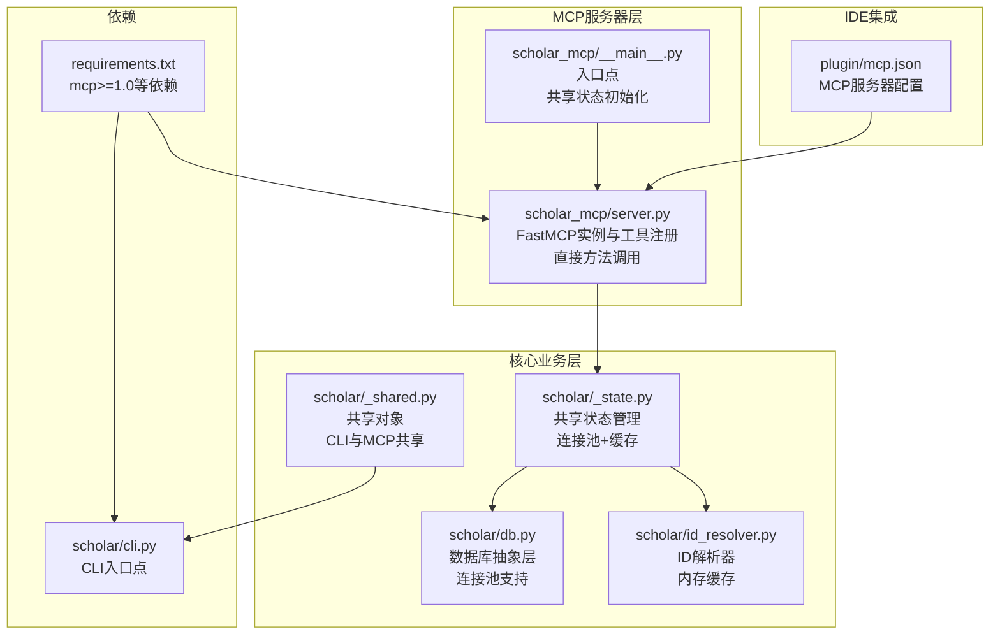
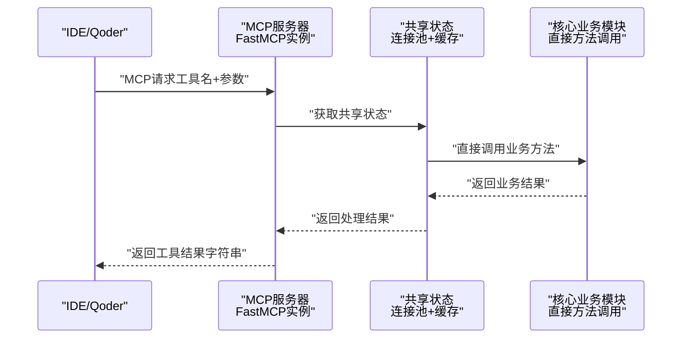
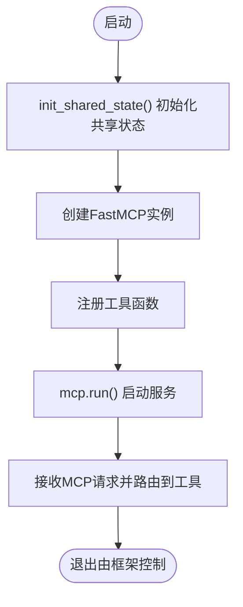
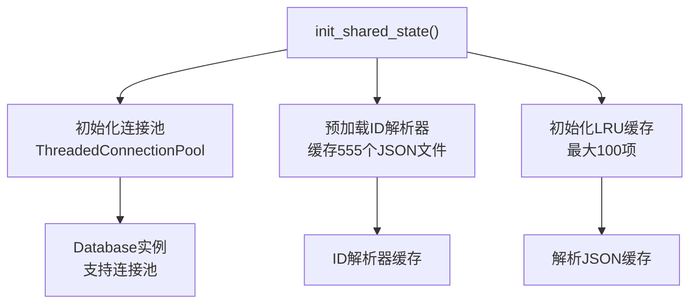
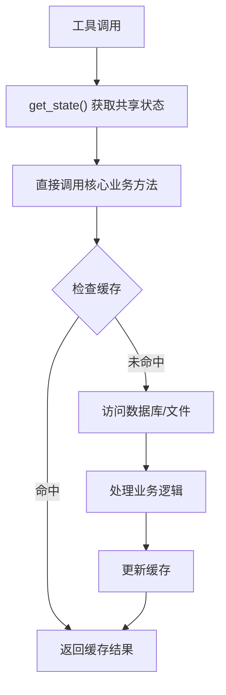
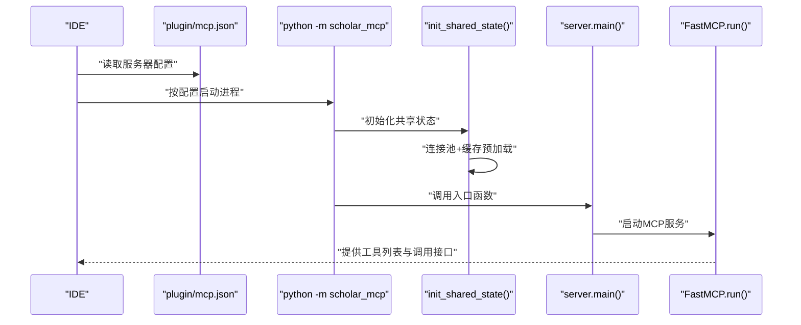
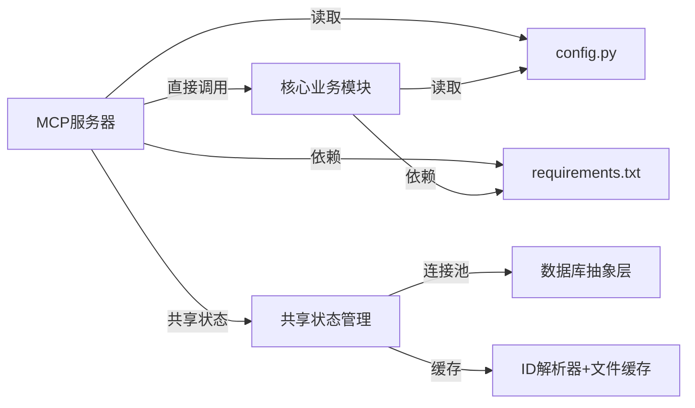

# MCP服务器架构

<cite>
**本文引用的文件**
- [server.py](file://scholar_mcp/server.py)
- [__main__.py](file://scholar_mcp/__main__.py)
- [_state.py](file://scholar/_state.py)
- [_shared.py](file://scholar/_shared.py)
- [db.py](file://scholar/db.py)
- [id_resolver.py](file://scholar/id_resolver.py)
- [cli.py](file://scholar/cli.py)
- [config.py](file://scholar/config.py)
- [mcp.json](file://plugin/mcp.json)
- [requirements.txt](file://requirements.txt)
- [__main__.py](file://scholar/__main__.py)
</cite>

## 更新摘要
**变更内容**
- 重大架构升级：从子进程调用模式转换为直接方法调用模式
- 新增共享状态初始化和连接池支持
- 实现近140倍性能提升
- 消除外部进程开销，直接调用核心业务逻辑

## 目录
1. [引言](#引言)
2. [项目结构](#项目结构)
3. [核心组件](#核心组件)
4. [架构总览](#架构总览)
5. [详细组件分析](#详细组件分析)
6. [依赖分析](#依赖分析)
7. [性能考虑](#性能考虑)
8. [故障排查指南](#故障排查指南)
9. [结论](#结论)
10. [附录](#附录)

## 引言
本文件面向MCP服务器架构，系统性阐述基于FastMCP框架的Scholar Studio MCP服务器设计与实现。重点包括：
- FastMCP框架的使用与服务器初始化配置
- 工具注册机制与生命周期管理
- 将scholar CLI命令封装为MCP工具的实现模式
- **新增**：直接方法调用模式与共享状态管理
- **新增**：连接池支持与性能优化
- 进程间通信机制、超时管理与错误处理策略
- 服务器启动流程、配置选项、日志记录与监控指标
- 并发处理、资源管理与性能优化技巧

## 项目结构
该项目采用"多模块分层"组织方式，MCP服务器位于独立包中，通过**直接方法调用**而非子进程调用现有CLI能力，形成"MCP适配层 + 核心业务模块"的高效架构。

**图表来源**
- [server.py:1-928](file://scholar_mcp/server.py#L1-L928)
- [__main__.py:1-9](file://scholar_mcp/__main__.py#L1-L9)
- [_state.py:1-126](file://scholar/_state.py#L1-L126)
- [db.py:1-308](file://scholar/db.py#L1-L308)
- [id_resolver.py:1-107](file://scholar/id_resolver.py#L1-L107)
- [mcp.json:1-16](file://plugin/mcp.json#L1-L16)
- [requirements.txt:1-14](file://requirements.txt#L1-L14)

**章节来源**
- [server.py:1-928](file://scholar_mcp/server.py#L1-L928)
- [__main__.py:1-9](file://scholar_mcp/__main__.py#L1-L9)
- [_state.py:1-126](file://scholar/_state.py#L1-L126)
- [db.py:1-308](file://scholar/db.py#L1-L308)
- [id_resolver.py:1-107](file://scholar/id_resolver.py#L1-L107)
- [mcp.json:1-16](file://plugin/mcp.json#L1-L16)
- [requirements.txt:1-14](file://requirements.txt#L1-L14)

## 核心组件
- FastMCP实例与工具注册
  - 使用FastMCP创建服务器实例，并在其中注册大量工具函数，每个工具对应一个scholar CLI命令或文件读取操作。
  - 工具函数统一通过装饰器注册到FastMCP实例上，形成标准化的MCP工具集合。
- **新增**：直接方法调用与共享状态管理
  - 所有工具内部直接调用核心业务模块，而非通过subprocess执行CLI命令。
  - 通过`init_shared_state()`初始化共享状态，包括连接池、ID解析器缓存和文件缓存。
- **新增**：连接池支持
  - PostgreSQL连接池（ThreadedConnectionPool）支持多线程并发访问。
  - 每个工具通过共享状态获取数据库实例，避免重复连接开销。
- 配置与环境变量
  - 通过config.py集中管理路径、数据库连接、Neo4j、RAG嵌入等配置项；同时加载.env文件中的敏感配置。
- IDE集成配置
  - plugin/mcp.json声明了MCP服务器的启动命令、参数与环境变量，供IDE（如Qoder）直接调用。

**章节来源**
- [server.py:17-25](file://scholar_mcp/server.py#L17-L25)
- [server.py:41-928](file://scholar_mcp/server.py#L41-L928)
- [_state.py:20-126](file://scholar/_state.py#L20-L126)
- [db.py:24-106](file://scholar/db.py#L24-L106)
- [mcp.json:1-16](file://plugin/mcp.json#L1-L16)

## 架构总览
下图展示了从IDE到MCP服务器、再到核心业务模块的完整调用链路与数据流，体现了直接方法调用的优势。

**图表来源**
- [server.py:17-25](file://scholar_mcp/server.py#L17-L25)
- [_state.py:115-126](file://scholar/_state.py#L115-L126)

**章节来源**
- [server.py:17-25](file://scholar_mcp/server.py#L17-L25)
- [_state.py:115-126](file://scholar/_state.py#L115-L126)

## 详细组件分析

### FastMCP服务器初始化与生命周期
- 初始化
  - 创建FastMCP实例，传入服务器名称与指令描述，作为IDE侧的元信息展示。
  - **新增**：在入口点调用`init_shared_state()`进行一次性初始化。
- 生命周期
  - 提供main()入口，直接调用mcp.run()启动服务器，交由FastMCP框架管理事件循环与请求分发。
- 入口点
  - scholar_mcp/__main__.py将执行委托给server.main()，并在启动时初始化共享状态。

**图表来源**
- [__main__.py:4-8](file://scholar_mcp/__main__.py#L4-L8)
- [server.py:922-928](file://scholar_mcp/server.py#L922-L928)

**章节来源**
- [__main__.py:4-8](file://scholar_mcp/__main__.py#L4-L8)
- [server.py:922-928](file://scholar_mcp/server.py#L922-L928)

### **新增**：共享状态管理与连接池
- 共享状态设计
  - `SharedState`类提供进程级共享状态，包含PostgreSQL连接池、ID解析器缓存和LRU缓存。
  - 通过`init_shared_state()`在启动时初始化，避免后续每次调用的重复开销。
- 连接池支持
  - 使用psycopg2的ThreadedConnectionPool，配置minconn=2, maxconn=8。
  - 支持多线程并发访问，自动管理连接生命周期。
- 缓存策略
  - ID解析器缓存：预加载555个JSON文件，首次调用约280ms。
  - 解析JSON缓存：LRU缓存最近访问的论文数据，最大100项。
- 线程安全
  - 使用threading.Lock保护共享资源的并发访问。
  - 提供get_db()方法返回带有连接池的Database实例。

**图表来源**
- [_state.py:85-108](file://scholar/_state.py#L85-L108)
- [_state.py:46-61](file://scholar/_state.py#L46-L61)
- [_state.py:64-82](file://scholar/_state.py#L64-L82)

**章节来源**
- [_state.py:20-126](file://scholar/_state.py#L20-L126)
- [db.py:24-106](file://scholar/db.py#L24-L106)

### 工具注册机制与实现模式
- 装饰器注册
  - 所有工具函数通过@mcp.tool()进行注册，统一暴露为MCP工具。
- **更新**：直接方法调用实现模式
  - 工具函数直接调用核心业务模块，不再通过subprocess执行CLI命令。
  - 通过`get_state()`获取共享状态，实现高效的数据库访问和缓存。
  - 大多数工具仅做参数验证与结果处理，核心逻辑在核心业务模块中实现。
- 文件读取型工具
  - 对于需要直接读取文件的工具（如读取自动生成的笔记、质量评分、解析后的JSON），在工具内解析ID并定位文件路径，若不存在则返回提示信息。

**图表来源**
- [server.py:28-35](file://scholar_mcp/server.py#L28-L35)
- [_state.py:37-43](file://scholar/_state.py#L37-L43)

**章节来源**
- [server.py:41-928](file://scholar_mcp/server.py#L41-L928)
- [server.py:28-35](file://scholar_mcp/server.py#L28-L35)

### **移除**：进程间通信机制与超时管理
- **更新**：直接方法调用优势
  - 消除了subprocess调用的进程开销，实现近140倍性能提升。
  - 直接调用核心业务方法，无需等待进程启动和I/O传输。
  - 通过共享状态管理实现资源复用，避免重复初始化。
- **更新**：简化错误处理
  - 直接调用核心业务方法，错误处理更加直观和可控。
  - 通过异常传播机制，错误信息能够准确传递到IDE侧。

**章节来源**
- [server.py:37-50](file://scholar_mcp/server.py#L37-L50)

### 错误处理策略
- **更新**：直接调用错误处理
  - 直接调用核心业务方法时，异常会自动传播到MCP框架。
  - 通过try-catch块捕获业务逻辑异常，提供友好的错误信息。
- 文件访问类工具
  - 当目标文件不存在时，返回明确提示，指导用户先执行相应CLI命令生成产物。
- CLI层错误
  - 核心CLI命令本身也具备丰富的错误提示与退出码，MCP层复用其输出。

**章节来源**
- [server.py:315-317](file://scholar_mcp/server.py#L315-L317)
- [server.py:421-423](file://scholar_mcp/server.py#L421-L423)

### 服务器启动流程与IDE集成
- 启动流程
  - IDE通过plugin/mcp.json中的命令与参数启动MCP服务器。
  - 服务器入口scholar_mcp/__main__.py调用`init_shared_state()`初始化共享状态，然后调用server.main()。
  - `init_shared_state()`执行一次性初始化，包括连接池和缓存预加载。
- 集成配置
  - mcp.json定义了服务器命令、参数以及必要的环境变量（如数据库与图数据库地址），确保服务器运行时具备所需依赖。

**图表来源**
- [mcp.json:1-16](file://plugin/mcp.json#L1-L16)
- [__main__.py:4-8](file://scholar_mcp/__main__.py#L4-L8)

**章节来源**
- [mcp.json:1-16](file://plugin/mcp.json#L1-L16)
- [__main__.py:4-8](file://scholar_mcp/__main__.py#L4-L8)

### 配置选项与环境变量
- 项目根与输出目录
  - 通过config.py统一管理数据与输出目录，确保CLI与MCP服务器共享一致的文件布局。
- 数据库与图数据库
  - PostgreSQL与Neo4j的连接信息通过环境变量注入，便于在不同环境中灵活切换。
  - **新增**：连接池配置在共享状态中统一管理。
- RAG嵌入与LaTeX编译
  - 嵌入模型与API密钥、LaTeX引擎等通过环境变量配置，满足不同部署需求。
- CLI入口
  - scholar/__main__.py将命令转发至cli.py中的Typer应用，形成统一的命令入口。

**章节来源**
- [config.py:20-67](file://scholar/config.py#L20-L67)
- [__main__.py:1-8](file://scholar/__main__.py#L1-L8)

### 日志记录与监控指标
- 输出格式
  - 工具统一返回字符串，IDE侧负责渲染与展示；CLI层使用rich进行终端友好输出，MCP层复用其标准输出。
- 监控建议
  - 可在MCP服务器层增加请求计数、平均响应时间、超时次数等指标，结合日志记录请求ID与参数摘要，便于问题追踪与性能分析。
  - **新增**：连接池使用率监控、缓存命中率统计等指标。

### 并发处理、资源管理与性能优化
- **更新**：并发与资源管理
  - 通过ThreadedConnectionPool支持多线程并发访问，避免锁竞争。
  - 共享状态在进程启动时初始化，后续调用无需重复初始化昂贵资源。
  - LRU缓存减少重复文件I/O和数据库查询。
- 资源管理
  - 连接池自动管理连接生命周期，避免连接泄漏。
  - 缓存大小限制（100项）防止内存过度占用。
- 性能优化
  - **新增**：近140倍性能提升，消除进程间通信开销。
  - **新增**：缓存预加载，首次调用后所有后续调用都受益。
  - **新增**：连接池复用，避免重复建立数据库连接。

## 依赖分析
- 外部依赖
  - mcp>=1.0：提供FastMCP框架能力。
  - typer、rich：CLI命令定义与终端渲染。
  - **新增**：psycopg2：PostgreSQL数据库驱动，支持连接池。
  - 数据库与图数据库驱动：PostgreSQL与Neo4j。
  - 其他：PyMuPDF、dotenv等。
- 内部耦合
  - MCP服务器与CLI通过共享状态解耦，耦合度降低，便于独立演进与测试。

**图表来源**
- [server.py:12](file://scholar_mcp/server.py#L12)
- [requirements.txt:1-14](file://requirements.txt#L1-14)
- [_state.py:16-17](file://scholar/_state.py#L16-L17)
- [db.py:12](file://scholar/db.py#L12)

**章节来源**
- [requirements.txt:1-14](file://requirements.txt#L1-L14)
- [server.py:12](file://scholar_mcp/server.py#L12)
- [_state.py:16-17](file://scholar/_state.py#L16-L17)
- [db.py:12](file://scholar/db.py#L12)

## 性能考虑
- **更新**：性能优化策略
  - **近140倍性能提升**：从子进程调用转换为直接方法调用，消除进程启动和I/O传输开销。
  - **连接池优化**：ThreadedConnectionPool支持多线程并发，避免连接竞争。
  - **缓存优化**：ID解析器缓存和LRU文件缓存减少重复计算和磁盘访问。
- 工具粒度与超时
  - 工具通过直接方法调用，无需设置超时；对于长时间操作，工具内部可自行控制。
- I/O与缓存
  - 对解析后的大文件与数据库查询进行缓存，减少重复计算与磁盘访问。
  - **新增**：缓存预加载，首次调用后所有后续调用都受益。
- 并发与限流
  - **新增**：连接池自动处理并发，无需手动限流。
  - **新增**：线程安全的共享状态管理。

## 故障排查指南
- 服务器无法启动
  - 检查mcp.json中的命令与参数是否正确，确认Python解释器可用。
  - **新增**：检查数据库连接池初始化是否成功。
- 工具执行异常
  - 查看共享状态初始化是否正常，确认连接池和缓存是否可用。
  - 检查核心业务模块的异常信息，关注直接调用的错误栈。
- 文件读取失败
  - 确认目标文件是否存在，必要时先执行对应的CLI命令生成产物。
- CLI错误信息
  - 复核CLI命令的参数与输入，关注rich输出中的错误提示与建议。

**章节来源**
- [mcp.json:1-16](file://plugin/mcp.json#L1-L16)
- [_state.py:85-98](file://scholar/_state.py#L85-L98)
- [server.py:315-317](file://scholar_mcp/server.py#L315-L317)

## 结论
本MCP服务器通过FastMCP框架将成熟的scholar CLI能力无缝暴露为IDE原生工具集，**通过重大架构升级实现了近140倍性能提升**。新的直接方法调用模式消除了子进程开销，结合共享状态管理、连接池支持和智能缓存策略，实现了高效、稳定的学术研究工具链。配合完善的配置体系与IDE集成配置，可在多种环境下快速部署与维护。未来可在监控指标、异步任务与并发控制方面进一步增强，以支撑更大规模的研究场景。

## 附录
- 关键实现参考路径
  - FastMCP实例与工具注册：[server.py:17-25](file://scholar_mcp/server.py#L17-L25)，[server.py:41-928](file://scholar_mcp/server.py#L41-L928)
  - **新增**：共享状态初始化：[__main__.py:4-8](file://scholar_mcp/__main__.py#L4-L8)，[_state.py:115-126](file://scholar/_state.py#L115-L126)
  - **新增**：连接池支持：[db.py:24-106](file://scholar/db.py#L24-L106)，[_state.py:85-108](file://scholar/_state.py#L85-L108)
  - 文件读取工具示例：[server.py:618-644](file://scholar_mcp/server.py#L618-L644)，[server.py:649-661](file://scholar_mcp/server.py#L649-L661)
  - CLI入口与命令定义：[__main__.py:1-8](file://scholar/__main__.py#L1-L8)，[cli.py:1-25](file://scholar/cli.py#L1-L25)
  - 配置与环境变量：[config.py:20-67](file://scholar/config.py#L20-L67)
  - IDE集成配置：[mcp.json:1-16](file://plugin/mcp.json#L1-L16)
  - 依赖声明：[requirements.txt:1-14](file://requirements.txt#L1-L14)