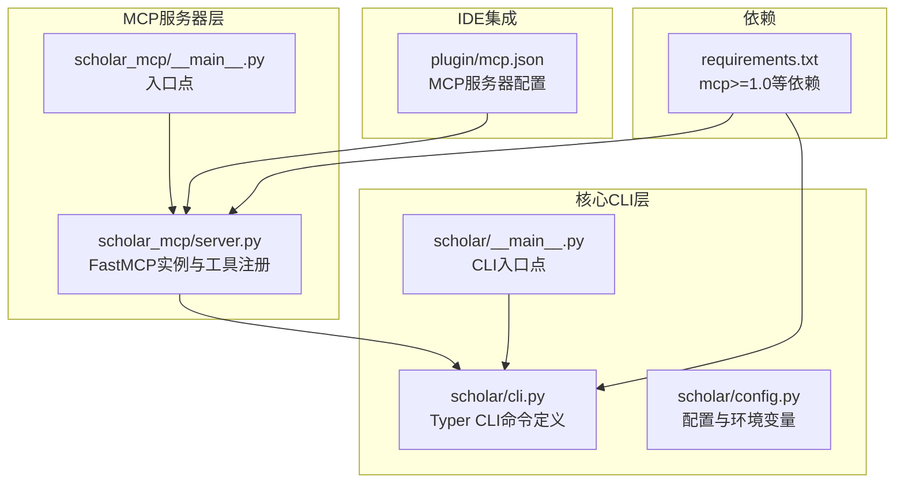
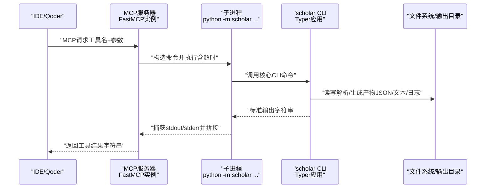
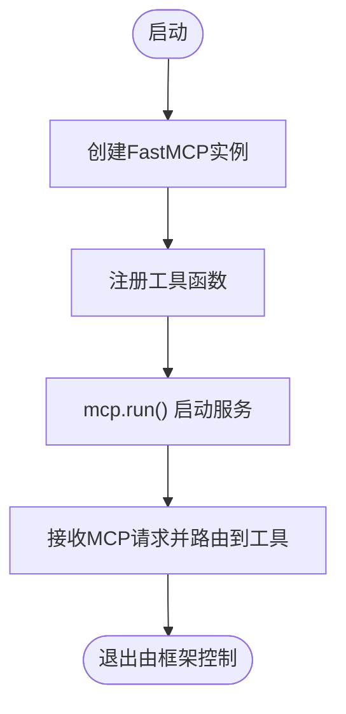
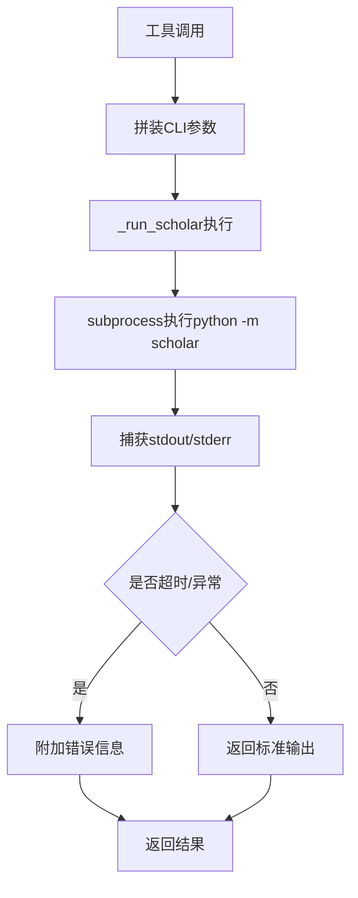
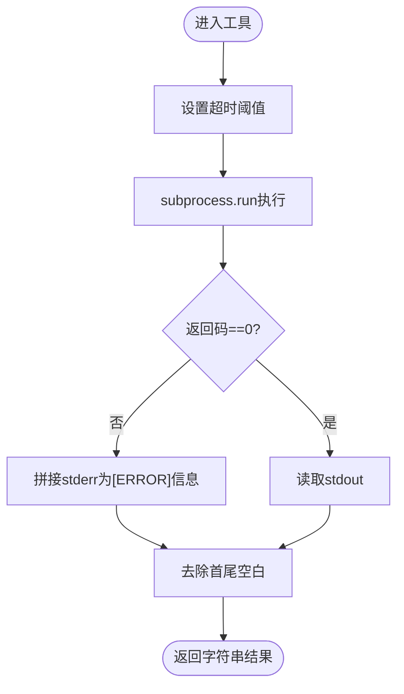
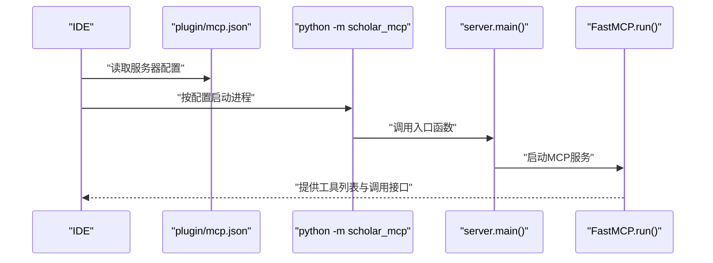
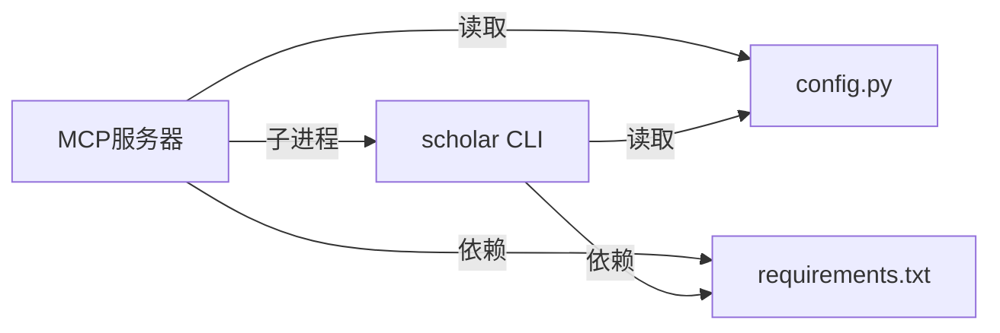

# MCP服务器架构

<cite>
**本文引用的文件**
- [server.py](file://scholar_mcp/server.py)
- [__main__.py](file://scholar_mcp/__main__.py)
- [cli.py](file://scholar/cli.py)
- [config.py](file://scholar/config.py)
- [mcp.json](file://plugin/mcp.json)
- [requirements.txt](file://requirements.txt)
- [__main__.py](file://scholar/__main__.py)
</cite>

## 目录
1. [引言](#引言)
2. [项目结构](#项目结构)
3. [核心组件](#核心组件)
4. [架构总览](#架构总览)
5. [详细组件分析](#详细组件分析)
6. [依赖分析](#依赖分析)
7. [性能考虑](#性能考虑)
8. [故障排查指南](#故障排查指南)
9. [结论](#结论)
10. [附录](#附录)

## 引言
本文件面向MCP服务器架构，系统性阐述基于FastMCP框架的Scholar Studio MCP服务器设计与实现。重点包括：
- FastMCP框架的使用与服务器初始化配置
- 工具注册机制与生命周期管理
- 将scholar CLI命令封装为MCP工具的实现模式
- 进程间通信机制、超时管理与错误处理策略
- 服务器启动流程、配置选项、日志记录与监控指标
- 并发处理、资源管理与性能优化技巧

## 项目结构
该项目采用“多模块分层”组织方式，MCP服务器位于独立包中，通过子进程调用现有CLI能力，形成“MCP适配层 + 核心业务CLI”的清晰边界。

**图表来源**
- [server.py:1-631](file://scholar_mcp/server.py#L1-L631)
- [__main__.py:1-5](file://scholar_mcp/__main__.py#L1-L5)
- [cli.py:1-800](file://scholar/cli.py#L1-L800)
- [__main__.py:1-8](file://scholar/__main__.py#L1-L8)
- [config.py:1-119](file://scholar/config.py#L1-L119)
- [mcp.json:1-16](file://plugin/mcp.json#L1-L16)
- [requirements.txt:1-14](file://requirements.txt#L1-L14)

**章节来源**
- [server.py:1-631](file://scholar_mcp/server.py#L1-L631)
- [__main__.py:1-5](file://scholar_mcp/__main__.py#L1-L5)
- [cli.py:1-800](file://scholar/cli.py#L1-L800)
- [config.py:1-119](file://scholar/config.py#L1-L119)
- [mcp.json:1-16](file://plugin/mcp.json#L1-L16)
- [requirements.txt:1-14](file://requirements.txt#L1-L14)

## 核心组件
- FastMCP实例与工具注册
  - 使用FastMCP创建服务器实例，并在其中注册大量工具函数，每个工具对应一个scholar CLI命令或文件读取操作。
  - 工具函数统一通过装饰器注册到FastMCP实例上，形成标准化的MCP工具集合。
- 子进程执行与超时控制
  - 所有工具内部通过subprocess以“python -m scholar ...”的方式调用核心CLI，统一设置超时时间，避免阻塞。
- 配置与环境变量
  - 通过config.py集中管理路径、数据库连接、Neo4j、RAG嵌入等配置项；同时加载.env文件中的敏感配置。
- IDE集成配置
  - plugin/mcp.json声明了MCP服务器的启动命令、参数与环境变量，供IDE（如Qoder）直接调用。

**章节来源**
- [server.py:17-36](file://scholar_mcp/server.py#L17-L36)
- [server.py:41-631](file://scholar_mcp/server.py#L41-L631)
- [config.py:20-67](file://scholar/config.py#L20-L67)
- [mcp.json:1-16](file://plugin/mcp.json#L1-L16)

## 架构总览
下图展示了从IDE到MCP服务器、再到核心CLI的完整调用链路与数据流。

**图表来源**
- [server.py:23-36](file://scholar_mcp/server.py#L23-L36)
- [cli.py:23-41](file://scholar/cli.py#L23-L41)

**章节来源**
- [server.py:23-36](file://scholar_mcp/server.py#L23-L36)
- [cli.py:23-41](file://scholar/cli.py#L23-L41)

## 详细组件分析

### FastMCP服务器初始化与生命周期
- 初始化
  - 创建FastMCP实例，传入服务器名称与指令描述，作为IDE侧的元信息展示。
  - 定义全局项目根路径，确保子进程在正确的工作目录执行。
- 生命周期
  - 提供main()入口，直接调用mcp.run()启动服务器，交由FastMCP框架管理事件循环与请求分发。
- 入口点
  - scholar_mcp/__main__.py将执行委托给server.main()，保持最小化入口逻辑。

**图表来源**
- [server.py:17-20](file://scholar_mcp/server.py#L17-L20)
- [server.py:625-631](file://scholar_mcp/server.py#L625-L631)
- [__main__.py:1-5](file://scholar_mcp/__main__.py#L1-L5)

**章节来源**
- [server.py:17-20](file://scholar_mcp/server.py#L17-L20)
- [server.py:625-631](file://scholar_mcp/server.py#L625-L631)
- [__main__.py:1-5](file://scholar_mcp/__main__.py#L1-L5)

### 工具注册机制与实现模式
- 装饰器注册
  - 所有工具函数通过@mcp.tool()进行注册，统一暴露为MCP工具。
- 实现模式
  - 统一的_run_scholar函数负责构建命令、执行、捕获输出与错误、设置超时。
  - 大多数工具仅做参数拼装与超时设置，核心逻辑在scholar CLI中实现。
- 文件读取型工具
  - 对于需要直接读取文件的工具（如读取自动生成的笔记、质量评分、解析后的JSON），在工具内解析ID并定位文件路径，若不存在则返回提示信息。

**图表来源**
- [server.py:23-36](file://scholar_mcp/server.py#L23-L36)
- [server.py:340-353](file://scholar_mcp/server.py#L340-L353)
- [server.py:370-384](file://scholar_mcp/server.py#L370-L384)

**章节来源**
- [server.py:41-631](file://scholar_mcp/server.py#L41-L631)
- [server.py:23-36](file://scholar_mcp/server.py#L23-L36)

### 进程间通信机制与超时管理
- IPC模型
  - MCP服务器与IDE之间通过MCP协议通信；服务器内部通过子进程与核心CLI交互。
- 超时策略
  - _run_scholar统一设置超时，默认120秒；针对耗时任务（如批量解析、RAG索引、编译、实验执行等）在工具层显式提高超时阈值。
- 错误处理
  - 若子进程返回码非零且存在stderr，则将错误信息拼接到输出末尾，便于IDE侧展示。

**图表来源**
- [server.py:23-36](file://scholar_mcp/server.py#L23-L36)

**章节来源**
- [server.py:23-36](file://scholar_mcp/server.py#L23-L36)

### 错误处理策略
- 子进程异常
  - 通过捕获非零返回码与stderr，保证错误信息可追溯。
- 文件访问类工具
  - 当目标文件不存在时，返回明确提示，指导用户先执行相应CLI命令生成产物。
- CLI层错误
  - 核心CLI命令本身也具备丰富的错误提示与退出码，MCP层复用其输出。

**章节来源**
- [server.py:340-353](file://scholar_mcp/server.py#L340-L353)
- [server.py:370-384](file://scholar_mcp/server.py#L370-L384)
- [cli.py:133-171](file://scholar/cli.py#L133-L171)

### 服务器启动流程与IDE集成
- 启动流程
  - IDE通过plugin/mcp.json中的命令与参数启动MCP服务器。
  - 服务器入口scholar_mcp/__main__.py调用server.main()，后者启动FastMCP实例。
- 集成配置
  - mcp.json定义了服务器命令、参数以及必要的环境变量（如数据库与图数据库地址），确保服务器运行时具备所需依赖。

**图表来源**
- [mcp.json:1-16](file://plugin/mcp.json#L1-L16)
- [__main__.py:1-5](file://scholar_mcp/__main__.py#L1-L5)
- [server.py:625-631](file://scholar_mcp/server.py#L625-L631)

**章节来源**
- [mcp.json:1-16](file://plugin/mcp.json#L1-L16)
- [__main__.py:1-5](file://scholar_mcp/__main__.py#L1-L5)
- [server.py:625-631](file://scholar_mcp/server.py#L625-L631)

### 配置选项与环境变量
- 项目根与输出目录
  - 通过config.py统一管理数据与输出目录，确保CLI与MCP服务器共享一致的文件布局。
- 数据库与图数据库
  - PostgreSQL与Neo4j的连接信息通过环境变量注入，便于在不同环境中灵活切换。
- RAG嵌入与LaTeX编译
  - 嵌入模型与API密钥、LaTeX引擎等通过环境变量配置，满足不同部署需求。
- CLI入口
  - scholar/__main__.py将命令转发至cli.py中的Typer应用，形成统一的命令入口。

**章节来源**
- [config.py:20-67](file://scholar/config.py#L20-L67)
- [__main__.py:1-8](file://scholar/__main__.py#L1-L8)

### 日志记录与监控指标
- 输出格式
  - 工具统一返回字符串，IDE侧负责渲染与展示；CLI层使用rich进行终端友好输出，MCP层复用其标准输出。
- 监控建议
  - 可在MCP服务器层增加请求计数、平均响应时间、超时次数等指标，结合日志记录请求ID与参数摘要，便于问题追踪与性能分析。

[本节为通用实践建议，不直接分析具体文件]

### 并发处理、资源管理与性能优化
- 并发与隔离
  - 工具通过独立子进程执行，避免相互干扰；建议在IDE侧限制并发请求数，防止资源争用。
- 资源管理
  - 针对高耗时工具（如RAG索引、编译、实验执行）合理设置超时与内存限制，必要时拆分为异步任务并在IDE侧轮询状态。
- 性能优化
  - 减少不必要的文件I/O：优先使用数据库查询替代全量扫描；对频繁读取的文件缓存关键片段。
  - 合理超时与重试：对外部API（如arXiv）增加指数退避重试，避免瞬时失败影响用户体验。

[本节为通用实践建议，不直接分析具体文件]

## 依赖分析
- 外部依赖
  - mcp>=1.0：提供FastMCP框架能力。
  - typer、rich：CLI命令定义与终端渲染。
  - 数据库与图数据库驱动：PostgreSQL与Neo4j。
  - 其他：PyMuPDF、dotenv等。
- 内部耦合
  - MCP服务器与CLI通过子进程解耦，耦合度低，便于独立演进与测试。

**图表来源**
- [server.py:12](file://scholar_mcp/server.py#L12)
- [requirements.txt:1-14](file://requirements.txt#L1-14)
- [config.py:1-119](file://scholar/config.py#L1-L119)

**章节来源**
- [requirements.txt:1-14](file://requirements.txt#L1-L14)
- [server.py:12](file://scholar_mcp/server.py#L12)
- [config.py:1-119](file://scholar/config.py#L1-L119)

## 性能考虑
- 工具粒度与超时
  - 将长耗时任务拆分为多个工具，分别设置合理的超时阈值，避免单点阻塞。
- I/O与缓存
  - 对解析后的大文件与数据库查询进行缓存，减少重复计算与磁盘访问。
- 并发与限流
  - 在IDE侧限制并发请求数量，或在服务器端引入队列与令牌桶控制，平滑突发流量。

[本节为通用实践建议，不直接分析具体文件]

## 故障排查指南
- 服务器无法启动
  - 检查mcp.json中的命令与参数是否正确，确认Python解释器可用。
- 工具执行超时
  - 查看工具定义中的超时设置，适当提高阈值；检查外部依赖（数据库、图数据库、API）连通性。
- 文件读取失败
  - 确认目标文件是否存在，必要时先执行对应的CLI命令生成产物。
- CLI错误信息
  - 复核CLI命令的参数与输入，关注rich输出中的错误提示与建议。

**章节来源**
- [mcp.json:1-16](file://plugin/mcp.json#L1-L16)
- [server.py:340-353](file://scholar_mcp/server.py#L340-L353)
- [server.py:370-384](file://scholar_mcp/server.py#L370-L384)
- [cli.py:133-171](file://scholar/cli.py#L133-L171)

## 结论
本MCP服务器通过FastMCP框架将成熟的scholar CLI能力无缝暴露为IDE原生工具集，借助子进程隔离与统一超时控制，实现了稳定、可扩展的学术研究工具链。配合完善的配置体系与IDE集成配置，可在多种环境下快速部署与维护。未来可在监控指标、异步任务与并发控制方面进一步增强，以支撑更大规模的研究场景。

## 附录
- 关键实现参考路径
  - FastMCP实例与工具注册：[server.py:17-20](file://scholar_mcp/server.py#L17-L20)，[server.py:41-631](file://scholar_mcp/server.py#L41-L631)
  - 子进程执行与超时：[server.py:23-36](file://scholar_mcp/server.py#L23-L36)
  - 文件读取工具示例：[server.py:340-353](file://scholar_mcp/server.py#L340-L353)，[server.py:370-384](file://scholar_mcp/server.py#L370-L384)
  - CLI入口与命令定义：[__main__.py:1-8](file://scholar/__main__.py#L1-L8)，[cli.py:1-800](file://scholar/cli.py#L1-L800)
  - 配置与环境变量：[config.py:20-67](file://scholar/config.py#L20-L67)
  - IDE集成配置：[mcp.json:1-16](file://plugin/mcp.json#L1-L16)
  - 依赖声明：[requirements.txt:1-14](file://requirements.txt#L1-L14)