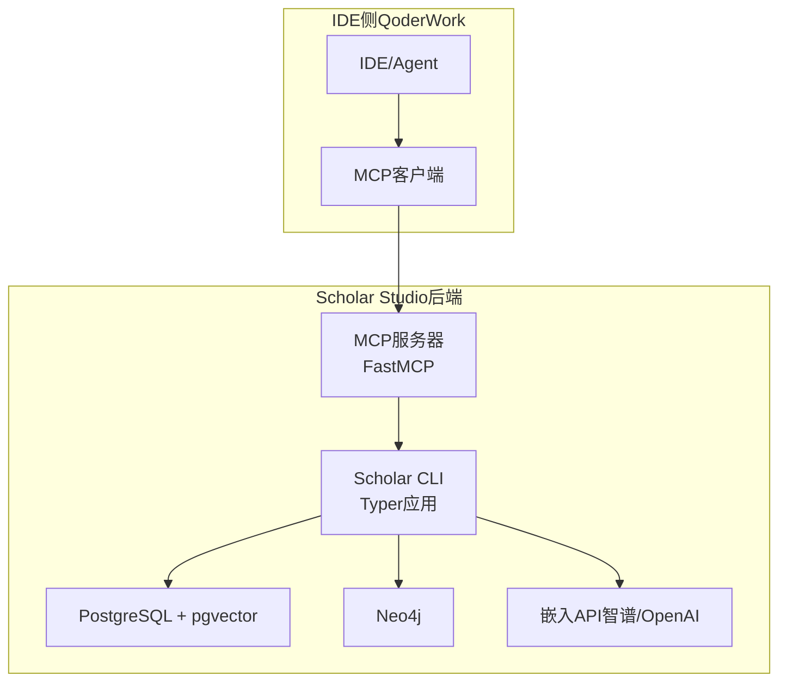
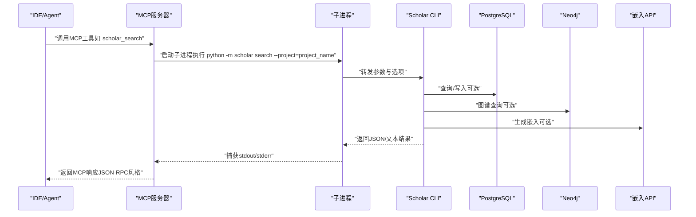
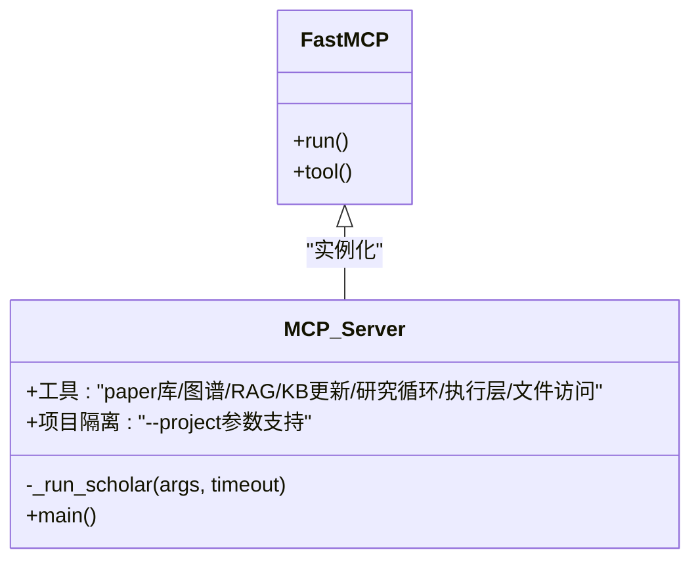
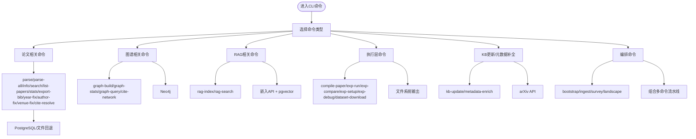
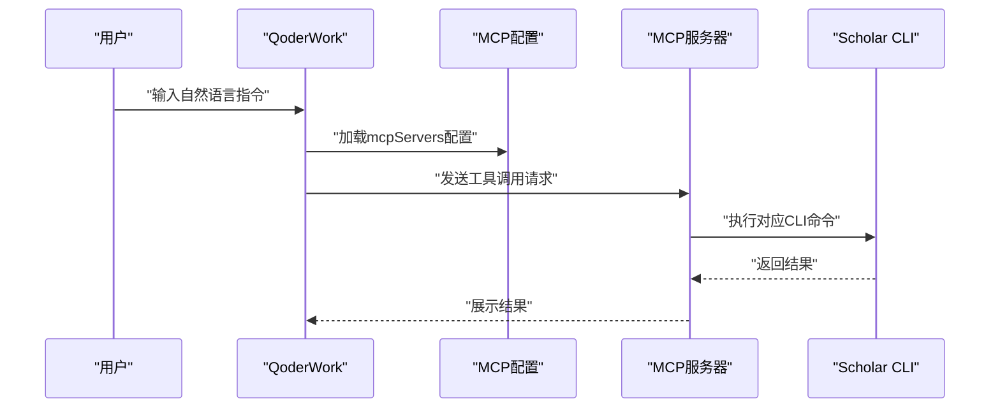
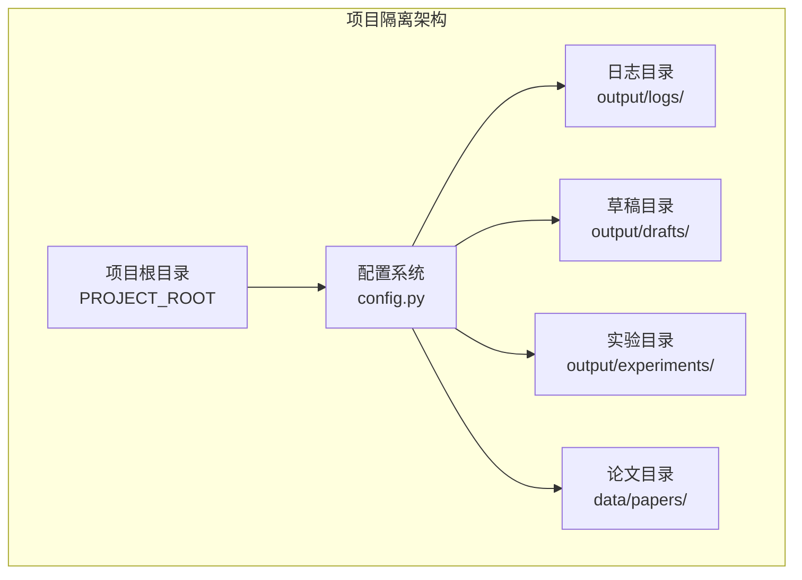
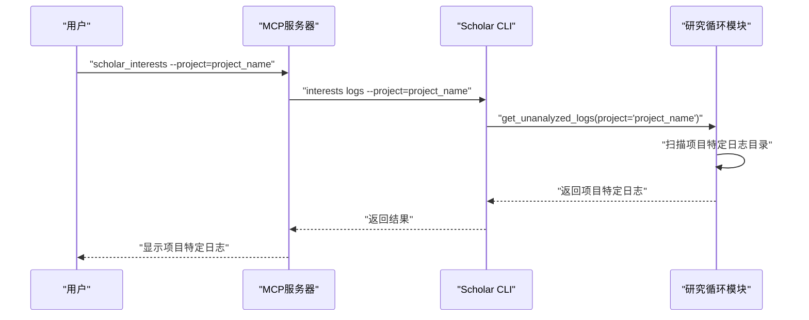
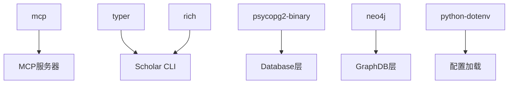

# MCP服务系统

<cite>
**本文档引用的文件**
- [plugin/mcp.json](file://plugin/mcp.json)
- [plugin/CONNECTORS.md](file://plugin/CONNECTORS.md)
- [plugin/README.md](file://plugin/README.md)
- [plugin/rules/tools.md](file://plugin/rules/tools.md)
- [scholar_mcp/server.py](file://scholar_mcp/server.py)
- [scholar/__main__.py](file://scholar/__main__.py)
- [scholar/cli.py](file://scholar/cli.py)
- [scholar/config.py](file://scholar/config.py)
- [scholar/db.py](file://scholar/db.py)
- [scholar/graph_db.py](file://scholar/graph_db.py)
- [scholar/rag.py](file://scholar/rag.py)
- [scholar/research_loop.py](file://scholar/research_loop.py)
- [scholar/commands/research_ops.py](file://scholar/commands/research_ops.py)
- [requirements.txt](file://requirements.txt)
- [infra/docker-compose.yml](file://infra/docker-compose.yml)
- [startup.ps1](file://startup.ps1)
</cite>

## 更新摘要
**所做更改**
- 新增项目隔离功能：添加--project参数支持多项目管理
- 改进日志目录管理：引入项目特定的日志目录结构
- 增强项目特定输出目录支持：为每个项目提供独立的输出空间
- 更新MCP工具：在研究兴趣管理工具中集成项目参数支持

## 目录
1. [简介](#简介)
2. [项目结构](#项目结构)
3. [核心组件](#核心组件)
4. [架构总览](#架构总览)
5. [详细组件分析](#详细组件分析)
6. [项目隔离与多租户支持](#项目隔离与多租户支持)
7. [依赖关系分析](#依赖关系分析)
8. [性能考量](#性能考量)
9. [故障排查指南](#故障排查指南)
10. [结论](#结论)
11. [附录](#附录)

## 简介
本项目为MCP（Model Context Protocol）服务系统，通过MCP服务器将学术研究工具链以标准化工具的形式暴露给IDE（如QoderWork）。系统围绕Scholar Studio构建，提供论文解析、知识库管理、图谱分析、RAG语义检索、实验执行与编译等能力，并通过FastMCP框架实现MCP协议的服务端实现与IDE集成。

**更新** 系统现已支持项目隔离功能，通过新增的--project参数实现多项目管理和独立的输出空间，增强了系统的多租户支持能力。

系统采用分层架构：
- MCP服务层：基于FastMCP封装，将scholar CLI命令转换为MCP工具
- 应用逻辑层：scholar包提供CLI命令与核心业务逻辑
- 数据与基础设施层：PostgreSQL（含pgvector）、Neo4j、外部嵌入API（如智谱）

## 项目结构
项目由两部分组成：
- plugin：MCP配置与规则、技能、命令、钩子等IDE侧集成资产
- scholar与scholar_mcp：Python后端与MCP服务器实现



**图表来源**
- [plugin/mcp.json:1-16](file://plugin/mcp.json#L1-L16)
- [scholar_mcp/server.py:17-20](file://scholar_mcp/server.py#L17-L20)
- [scholar/cli.py:23-28](file://scholar/cli.py#L23-L28)
- [scholar/config.py:44-61](file://scholar/config.py#L44-L61)
- [infra/docker-compose.yml:1-44](file://infra/docker-compose.yml#L1-L44)

**章节来源**
- [plugin/README.md:1-79](file://plugin/README.md#L1-L79)
- [plugin/mcp.json:1-16](file://plugin/mcp.json#L1-L16)
- [scholar_mcp/server.py:17-20](file://scholar_mcp/server.py#L17-L20)

## 核心组件
- MCP服务器（FastMCP）
  - 通过装饰器注册43个工具函数，将scholar CLI命令映射为MCP工具
  - 使用子进程调用python -m scholar执行具体命令，统一输出格式
  - **新增** 支持--project参数，实现项目隔离和多租户管理
- Scholar CLI（Typer）
  - 提供完整的学术研究工作流命令集，包括解析、搜索、统计、图谱、RAG、KB更新、实验执行等
  - **新增** 在研究兴趣管理命令中集成--project参数支持
- 数据与基础设施
  - PostgreSQL（pgvector）：结构化存储与向量检索
  - Neo4j：引用网络与概念图谱
  - 外部嵌入API：智谱embedding-2等
- 配置与环境
  - 通过.env加载环境变量，支持Docker一键启动
  - **新增** 项目特定的输出目录结构管理

**章节来源**
- [scholar_mcp/server.py:41-631](file://scholar_mcp/server.py#L41-L631)
- [scholar/cli.py:46-2462](file://scholar/cli.py#L46-L2462)
- [scholar/config.py:44-119](file://scholar/config.py#L44-L119)
- [requirements.txt:1-14](file://requirements.txt#L1-L14)
- [infra/docker-compose.yml:1-44](file://infra/docker-compose.yml#L1-L44)

## 架构总览
MCP服务通过FastMCP实例对外暴露工具，IDE侧通过MCP协议调用这些工具。工具内部通过子进程执行python -m scholar命令，从而复用现有CLI逻辑与数据层。

**更新** 新增项目隔离机制，MCP工具在执行时会将--project参数传递给底层CLI命令，实现多项目独立管理。



**图表来源**
- [scholar_mcp/server.py:23-36](file://scholar_mcp/server.py#L23-L36)
- [scholar/cli.py:312-370](file://scholar/cli.py#L312-L370)
- [scholar/config.py:44-61](file://scholar/config.py#L44-L61)

## 详细组件分析

### MCP服务器（FastMCP）
- 初始化
  - 创建FastMCP实例，设置服务器名称与指令说明
  - 定义项目根目录常量，用于相对路径访问输出与技能文件
- 工具注册
  - 使用@mcp.tool()装饰器将函数注册为MCP工具
  - 工具函数内部通过subprocess调用python -m scholar并传参
  - **新增** 在研究兴趣管理工具中支持--project参数
  - 统一处理超时、错误输出与返回值
- 工具分类
  - 论文库：扫描、解析、信息、搜索、列表、统计、导出Bib、年份修复等
  - 图谱与网络：构建图谱、查询概念、引用网络分析
  - RAG：构建索引、语义搜索（含混合检索）
  - 外部：arXiv搜索
  - 元数据补全：作者修复、会议修复、引用解析
  - 批量预处理：自动生成阅读笔记、质量评分、分类标签
  - 编排：引导初始化、单篇入库、调研报告、领域画像
  - 文件访问：读取解析后的JSON、技能说明
  - KB更新：arXiv下载、批量入库、知识库更新、元数据增强
  - 研究循环：兴趣管理、研究同步
  - 执行层：LaTeX编译、实验运行/对比/环境搭建/调试、数据集下载；读取实验日志与编译日志
- 运行入口
  - mcp.run()启动服务



**图表来源**
- [scholar_mcp/server.py:17-20](file://scholar_mcp/server.py#L17-L20)
- [scholar_mcp/server.py:23-36](file://scholar_mcp/server.py#L23-L36)
- [scholar_mcp/server.py:625-631](file://scholar_mcp/server.py#L625-L631)

**章节来源**
- [scholar_mcp/server.py:17-631](file://scholar_mcp/server.py#L17-L631)

### Scholar CLI（Typer应用）
- 命令组织
  - scan：扫描论文目录与解析状态
  - parse/parse-all：解析单篇或多篇TeX源为结构化JSON
  - info：查看论文详情（标题、作者、年份、会议、段落数、公式数、引用数）
  - search：全文搜索（标题、摘要、段落）
  - list-papers：列出解析后的论文（可按年份过滤）
  - stats：知识库统计与元数据覆盖率
  - export-bib：导出BibTeX
  - year-fix/author-fix/venue-fix/cite-resolve：元数据补全与引用解析
  - graph-build/graph-stats/graph-query/cite-network：图谱构建与查询
  - rag-index/rag-search：向量索引与语义搜索（含混合检索）
  - arxiv-search/arxiv-download：arXiv搜索与TeX下载
  - auto-notes/quality-score/classify：批量预处理
  - bootstrap/ingest/survey/landscape：编排工作流
  - compile-paper/exp-run/exp-compare/exp-setup/exp-debug/dataset-download：执行层
  - kb-update/metadata-enrich：知识库更新与增强
  - interests/research-sync：研究方向管理与同步
- 数据层
  - Database类封装PostgreSQL连接与操作，支持文件回退模式
  - GraphDB类封装Neo4j连接与Cypher查询
  - RAG模块负责分块、嵌入、向量存储与混合检索



**图表来源**
- [scholar/cli.py:46-2462](file://scholar/cli.py#L46-L2462)
- [scholar/db.py:24-276](file://scholar/db.py#L24-L276)
- [scholar/graph_db.py:32-70](file://scholar/graph_db.py#L32-L70)
- [scholar/rag.py:25-582](file://scholar/rag.py#L25-L582)

**章节来源**
- [scholar/cli.py:46-2462](file://scholar/cli.py#L46-L2462)
- [scholar/db.py:24-276](file://scholar/db.py#L24-L276)
- [scholar/graph_db.py:32-70](file://scholar/graph_db.py#L32-L70)
- [scholar/rag.py:25-582](file://scholar/rag.py#L25-L582)

### 数据与基础设施
- PostgreSQL（pgvector）
  - 存储论文、段落、公式、引用等结构化数据
  - 向量检索通过pgvector与HNSW索引实现
- Neo4j
  - 引用网络（CITES）、概念图谱（HAS_CONCEPT/RELATED_TO）、创新替换（REPLACES）
- 嵌入API
  - 支持智谱embedding-2与OpenAI text-embedding-3-small
- Docker Compose
  - 提供PostgreSQL与Neo4j容器编排，健康检查保障可用性

```mermaid
graph LR
DB["PostgreSQL<br/>pgvector"] <- --> RAG["RAG模块"]
GRAPH["Neo4j"] <- --> GraphOps["图谱构建/查询"]
EMB["嵌入API"] <- --> RAG
CLI["Scholar CLI"] --> DB
CLI --> GRAPH
CLI --> EMB
```

**图表来源**
- [scholar/config.py:44-61](file://scholar/config.py#L44-L61)
- [scholar/rag.py:182-289](file://scholar/rag.py#L182-L289)
- [scholar/graph_db.py:225-365](file://scholar/graph_db.py#L225-L365)
- [infra/docker-compose.yml:1-44](file://infra/docker-compose.yml#L1-L44)

**章节来源**
- [scholar/config.py:44-119](file://scholar/config.py#L44-L119)
- [scholar/rag.py:182-289](file://scholar/rag.py#L182-L289)
- [scholar/graph_db.py:225-365](file://scholar/graph_db.py#L225-L365)
- [infra/docker-compose.yml:1-44](file://infra/docker-compose.yml#L1-L44)

### IDE集成与MCP配置
- MCP服务器配置
  - 在IDE中配置mcpServers，指向python -m scholar_mcp
  - 可设置命令、参数、工作目录与环境变量
- 规则与工具清单
  - tools.md提供MCP工具与CLI命令对照，指导优先使用MCP工具
- 插件说明
  - plugin README说明了架构与安装流程，强调"大脑"（主仓库）与"身体"（插件）的关系



**图表来源**
- [plugin/mcp.json:1-16](file://plugin/mcp.json#L1-L16)
- [plugin/rules/tools.md:11-27](file://plugin/rules/tools.md#L11-L27)
- [plugin/README.md:19-44](file://plugin/README.md#L19-L44)

**章节来源**
- [plugin/mcp.json:1-16](file://plugin/mcp.json#L1-L16)
- [plugin/rules/tools.md:1-135](file://plugin/rules/tools.md#L1-L135)
- [plugin/README.md:1-79](file://plugin/README.md#L1-L79)

## 项目隔离与多租户支持

### 项目参数架构
系统现已支持通过--project参数实现项目隔离，为每个项目提供独立的输出空间和管理能力。



**图表来源**
- [scholar/config.py:50-93](file://scholar/config.py#L50-L93)
- [scholar_mcp/server.py:458-484](file://scholar_mcp/server.py#L458-L484)

### 项目参数实现细节
- **项目名称获取**：从SCHOLAR_PROJECT_NAME环境变量或项目根目录名称获取当前项目名
- **项目名称清理**：通过sanitize_project_name函数确保项目名符合文件系统安全要求
- **项目目录管理**：提供project_logs_dir和project_drafts_dir等函数生成项目特定目录
- **MCP工具集成**：在scholar_interests工具中新增project参数支持

### 研究兴趣管理的项目隔离
研究兴趣管理功能现在支持跨项目管理：



**图表来源**
- [scholar_mcp/server.py:458-484](file://scholar_mcp/server.py#L458-L484)
- [scholar/commands/research_ops.py:275-364](file://scholar/commands/research_ops.py#L275-L364)
- [scholar/research_loop.py:102-170](file://scholar/research_loop.py#L102-L170)

**章节来源**
- [scholar/config.py:50-93](file://scholar/config.py#L50-L93)
- [scholar_mcp/server.py:458-484](file://scholar_mcp/server.py#L458-L484)
- [scholar/commands/research_ops.py:275-364](file://scholar/commands/research_ops.py#L275-L364)
- [scholar/research_loop.py:102-170](file://scholar/research_loop.py#L102-L170)

## 依赖关系分析
- 运行时依赖
  - typer、rich：CLI交互与美化
  - psycopg2-binary、neo4j：数据库与图数据库访问
  - python-dotenv：环境变量加载
  - mcp：MCP协议实现
- 外部服务
  - PostgreSQL（pgvector）：结构化与向量检索
  - Neo4j：图谱分析
  - 嵌入API：智谱/OpenAI



**图表来源**
- [requirements.txt:1-14](file://requirements.txt#L1-L14)
- [scholar_mcp/server.py](file://scholar_mcp/server.py#L12)
- [scholar/cli.py](file://scholar/cli.py#L13)
- [scholar/db.py:15-22](file://scholar/db.py#L15-L22)
- [scholar/graph_db.py:24-29](file://scholar/graph_db.py#L24-L29)
- [scholar/config.py:11-18](file://scholar/config.py#L11-L18)

**章节来源**
- [requirements.txt:1-14](file://requirements.txt#L1-L14)
- [scholar/db.py:15-22](file://scholar/db.py#L15-L22)
- [scholar/graph_db.py:24-29](file://scholar/graph_db.py#L24-L29)
- [scholar/config.py:11-18](file://scholar/config.py#L11-L18)

## 性能考量
- 子进程调用开销
  - MCP工具通过subprocess调用python -m scholar，存在进程启动与IO开销
  - **新增** 项目隔离增加了额外的参数传递和目录检查开销
  - 建议：对高频工具进行缓存与批处理，减少重复解析与索引重建
- RAG索引与检索
  - 向量检索使用pgvector与HNSW索引，建议合理设置索引参数与批量大小
  - 混合检索（向量+BM25+RRF）在召回与排序上取得平衡，注意k值与融合权重
- 图谱构建
  - 大规模图谱构建涉及大量Cypher写入，建议分批处理与事务控制
- I/O与文件系统
  - **更新** 输出目录（notes、parsed、experiments等）按项目分离，减少文件冲突
  - 建议使用SSD与合理的并发限制，项目隔离不会显著增加I/O负担

## 故障排查指南
- 服务不可用
  - 检查PostgreSQL与Neo4j是否通过Docker健康检查
  - 使用startup.ps1进行一键启动与状态检查
- MCP无法连接
  - 确认mcpServers配置正确，命令、参数、工作目录与环境变量一致
  - 在IDE中查看MCP日志，确认端口与协议
- 数据库连接失败
  - 检查PG_HOST/PG_PORT/PG_USER/PG_PASS与DB层可用性检测
- 图谱功能异常
  - 确认Neo4j URI、账号密码与驱动可用性
- 嵌入API失败
  - 检查SCHOLAR_EMBEDDING_API_KEY与网络代理设置
- CLI命令报错
  - 查看stderr输出，定位具体工具与参数问题
- **新增** 项目隔离问题
  - 检查--project参数格式是否正确
  - 确认项目特定目录是否存在且具有适当权限
  - 验证项目名称是否符合sanitize_project_name函数的要求

**章节来源**
- [startup.ps1:64-91](file://startup.ps1#L64-L91)
- [plugin/mcp.json:1-16](file://plugin/mcp.json#L1-L16)
- [scholar/config.py:44-119](file://scholar/config.py#L44-L119)
- [scholar/db.py:31-44](file://scholar/db.py#L31-L44)
- [scholar/graph_db.py:39-49](file://scholar/graph_db.py#L39-L49)
- [plugin/CONNECTORS.md:1-45](file://plugin/CONNECTORS.md#L1-L45)

## 结论
本MCP服务系统通过FastMCP将Scholar Studio的丰富工具链以标准化方式暴露给IDE，结合PostgreSQL、Neo4j与嵌入API，形成从论文解析、知识库管理到图谱分析与RAG检索的完整闭环。

**更新** 系统现已支持项目隔离功能，通过新增的--project参数实现了多项目管理和独立的输出空间，增强了系统的多租户支持能力。这一改进使得系统能够更好地服务于多个研究团队或项目，每个项目都有独立的日志、草稿、实验和论文管理空间，同时保持了原有的高性能和易用性特点。

系统具备良好的扩展性与可维护性，适合在学术研究与工程实践中作为智能助手的核心能力底座。

## 附录

### MCP工具清单（节选）
- 论文库：scan、parse、parse-all、info、search、list-papers、stats、export-bib、year-fix
- 图谱与网络：graph-build、graph-stats、graph-query、cite-network
- RAG：rag-index、rag-search
- 元数据补全：author-fix、venue-fix、cite-resolve
- 批量预处理：auto-notes、quality-score、classify
- 编排：bootstrap、ingest、survey、landscape
- 文件访问：read-auto-note、read-quality-score、read-parsed-paper、read-skill
- KB更新：arxiv-download、batch-ingest、kb-update、metadata-enrich
- 研究循环：interests、research-sync
- 执行层：compile-paper、exp-run、exp-compare、exp-setup、exp-debug、dataset-download、read-experiment-report、read-compile-log

**更新** 研究兴趣管理工具现已支持--project参数，允许用户指定要操作的项目。

**章节来源**
- [scholar_mcp/server.py:41-631](file://scholar_mcp/server.py#L41-L631)
- [plugin/rules/tools.md:31-135](file://plugin/rules/tools.md#L31-L135)

### 配置示例
- MCP服务器配置（IDE侧）
  - 参考mcp.json中的mcpServers字段，设置command、args、env等
- 环境变量
  - 通过.env文件设置数据库、图数据库、嵌入API等参数
  - **新增** 可设置SCHOLAR_PROJECT_NAME环境变量来指定默认项目
- Docker一键启动
  - 使用startup.ps1启动PostgreSQL与Neo4j，并进行健康检查
- **新增** 项目隔离配置
  - 在MCP工具调用中添加--project参数指定目标项目
  - 系统会自动创建项目特定的输出目录结构

**章节来源**
- [plugin/mcp.json:1-16](file://plugin/mcp.json#L1-L16)
- [scholar/config.py:11-61](file://scholar/config.py#L11-L61)
- [startup.ps1:58-104](file://startup.ps1#L58-L104)

### 项目隔离最佳实践
- **项目命名规范**：使用简洁明了的项目名称，避免特殊字符
- **目录权限管理**：确保项目特定目录具有适当的读写权限
- **资源隔离**：不同项目的数据和日志完全隔离，避免交叉污染
- **监控与审计**：利用项目特定的日志目录进行独立监控和审计

**章节来源**
- [scholar/config.py:54-72](file://scholar/config.py#L54-L72)
- [scholar/research_loop.py:102-170](file://scholar/research_loop.py#L102-L170)