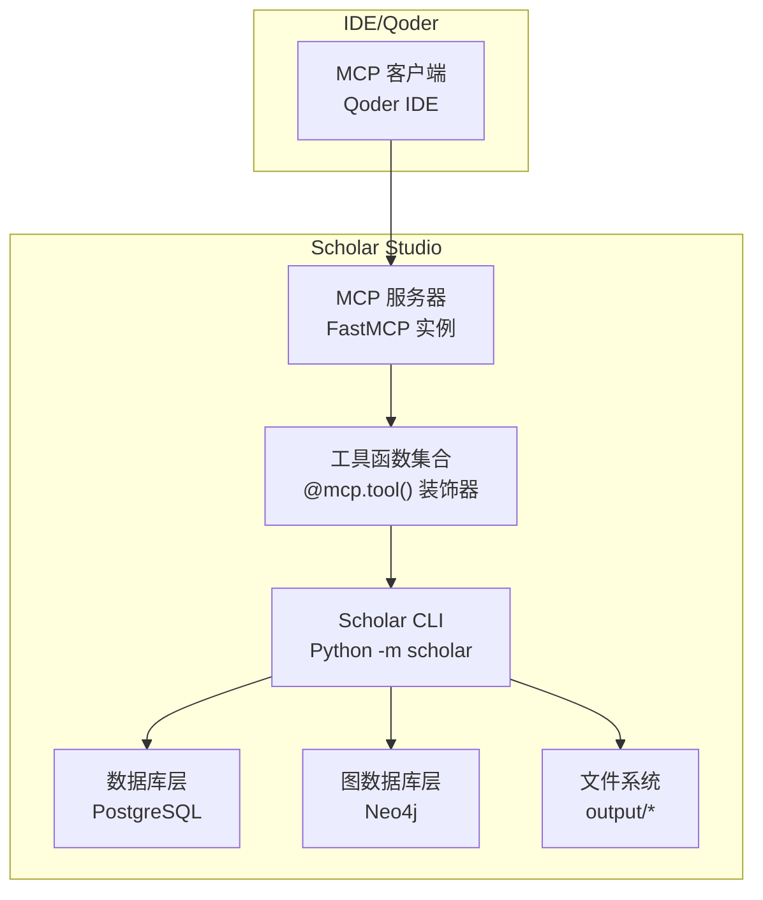
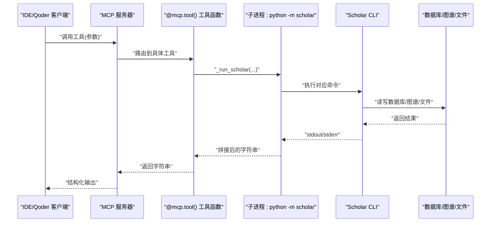
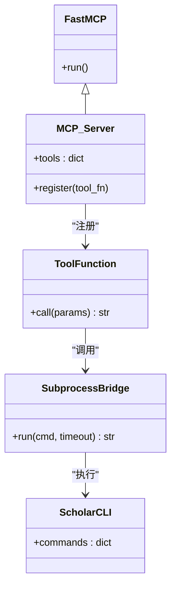
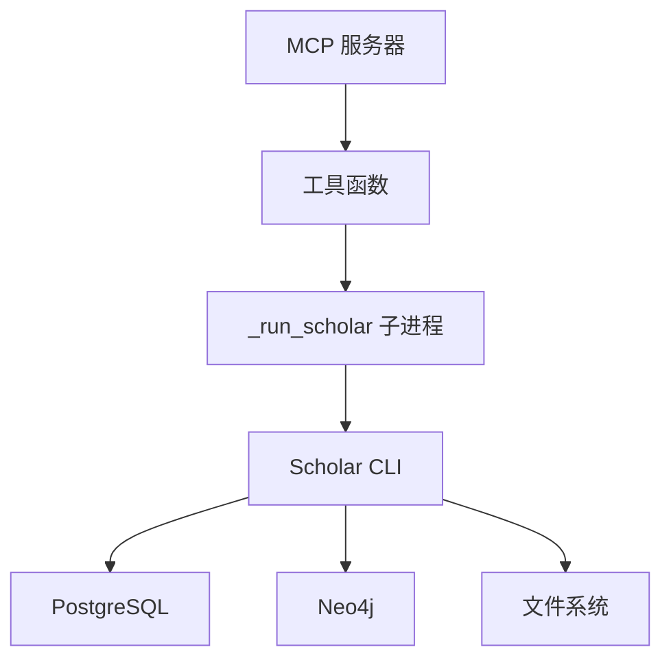

# 工具暴露机制

<cite>
**本文引用的文件**
- [mcp.json](file://plugin/mcp.json)
- [server.py](file://scholar_mcp/server.py)
- [__main__.py](file://scholar_mcp/__main__.py)
- [cli.py](file://scholar/cli.py)
- [db.py](file://scholar/db.py)
- [graph_db.py](file://scholar/graph_db.py)
- [kb_update.py](file://scholar/kb_update.py)
- [research_loop.py](file://scholar/research_loop.py)
- [tools.md](file://plugin/rules/tools.md)
- [sync.md](file://plugin/commands/sync.md)
- [paper.md](file://plugin/commands/paper.md)
- [stats.md](file://plugin/commands/stats.md)
- [health.md](file://plugin/commands/health.md)
- [resume.md](file://plugin/commands/resume.md)
</cite>

## 目录
1. [简介](#简介)
2. [项目结构](#项目结构)
3. [核心组件](#核心组件)
4. [架构总览](#架构总览)
5. [详细组件分析](#详细组件分析)
6. [依赖分析](#依赖分析)
7. [性能考量](#性能考量)
8. [故障排查指南](#故障排查指南)
9. [结论](#结论)
10. [附录](#附录)

## 简介
本文件系统性阐述 Scholar Studio 的 MCP 工具暴露机制，围绕 @mcp.tool() 装饰器、工具函数命名与参数映射规则，以及 445+ AI 论文知识库、引用图谱、Lean4 验证、混合 ID、知识库更新与执行层等核心工具的实现细节进行深入说明。文档同时覆盖参数定义、返回值格式、错误处理与超时设置，并提供最佳实践、性能优化与扩展指南，以及工具发现、版本管理与兼容性策略。

## 项目结构
Scholar Studio 将 CLI 命令封装为 MCP 工具，通过独立的 MCP 服务器进程对外暴露，IDE/Qoder 通过 MCP 协议直接调用这些工具，获得类型化参数与结构化结果。

- MCP 服务器入口与配置
  - MCP 服务器入口脚本负责启动 FastMCP 实例并注册工具函数。
  - 插件侧通过 mcp.json 指定 MCP 服务器命令、工作目录与环境变量。
- 工具实现
  - 每个 @mcp.tool() 装饰的函数对应一个 MCP 工具，内部通过子进程调用 Python -m scholar CLI，传递参数并捕获标准输出作为返回值；若子进程返回码非零，则将 stderr 追加到输出中。
- 工具分类
  - 知识库与检索：扫描、解析、搜索、统计、导出、列表等。
  - 图谱与网络：构建图谱、查询、引用分析、统计等。
  - RAG 语义检索：索引、搜索（含混合检索）。
  - 元数据补全：年份修正、作者修正、会议/期刊修正、引用解析。
  - 批处理预处理：自动生成阅读笔记、质量评分、分类标签。
  - 研究编排：引导式编排、领域景观、调查报告生成。
  - 知识库更新：arXiv 搜索、下载、批量入库、一键更新。
  - 研究循环：兴趣管理、对话日志分析、方向同步。
  - 执行层：LaTeX 编译、实验运行/对比/环境准备/调试、数据集下载、读取实验/编译日志。

图表来源
- [server.py:17-20](file://scholar_mcp/server.py#L17-L20)
- [server.py:23-36](file://scholar_mcp/server.py#L23-L36)
- [cli.py:23-29](file://scholar/cli.py#L23-L29)
- [db.py:24-44](file://scholar/db.py#L24-L44)
- [graph_db.py:32-49](file://scholar/graph_db.py#L32-L49)

章节来源
- [mcp.json:1-16](file://plugin/mcp.json#L1-L16)
- [server.py:17-20](file://scholar_mcp/server.py#L17-L20)
- [__main__.py:1-4](file://scholar_mcp/__main__.py#L1-L4)

## 核心组件
- MCP 服务器与装饰器
  - 使用 FastMCP 创建服务器实例，指令说明包含“445+ AI 论文、引用图谱、Lean4 验证、混合 ID、kb-update、执行层”等关键能力描述。
  - 每个工具函数通过 @mcp.tool() 装饰，自动注册为 MCP 工具；函数签名即工具参数定义，返回字符串作为工具输出。
- 子进程调用与错误传播
  - _run_scholar 封装子进程调用，统一设置超时、捕获 stdout/stderr 并拼接错误信息；非零返回码时将 stderr 追加到输出，便于客户端感知。
- 工具参数映射规则
  - 函数形参名即 MCP 工具参数名；可选参数默认值用于生成工具元数据；布尔开关通过显式参数传入（如 --apply/--dry-run 语义）。
- 返回值格式
  - 统一返回字符串，通常为人类可读文本或结构化 JSON 文本；部分工具读取本地文件并返回其内容。
- 超时与资源控制
  - 不同工具根据任务复杂度设置不同超时阈值（秒），长耗时任务（如图谱构建、RAG 索引、批量入库）采用较长超时。

章节来源
- [server.py:17-20](file://scholar_mcp/server.py#L17-L20)
- [server.py:23-36](file://scholar_mcp/server.py#L23-L36)
- [server.py:41-327](file://scholar_mcp/server.py#L41-L327)
- [server.py:400-454](file://scholar_mcp/server.py#L400-L454)
- [server.py:456-581](file://scholar_mcp/server.py#L456-L581)

## 架构总览
MCP 工具暴露机制的核心是“装饰器注册 + 子进程桥接”。客户端通过 MCP 协议调用工具，MCP 服务器将请求路由到对应 @mcp.tool() 函数，函数内部通过 _run_scholar 以子进程方式执行 Python -m scholar 对应命令，捕获输出并返回给客户端。

图表来源
- [server.py:23-36](file://scholar_mcp/server.py#L23-L36)
- [server.py:41-327](file://scholar_mcp/server.py#L41-L327)
- [cli.py:23-29](file://scholar/cli.py#L23-L29)
- [db.py:24-44](file://scholar/db.py#L24-L44)
- [graph_db.py:32-49](file://scholar/graph_db.py#L32-L49)

## 详细组件分析

### 装饰器与工具注册
- 装饰器作用
  - 将 Python 函数注册为 MCP 工具，函数签名即工具参数定义；返回值作为工具输出。
- 注册位置
  - 所有工具均在 MCP 服务器模块中以 @mcp.tool() 装饰并定义，集中于 server.py。
- 参数映射
  - 形参名即参数名；可选参数默认值参与工具元数据生成；布尔参数通过显式传参体现（如 --apply）。
- 返回值
  - 统一为字符串；部分工具读取本地文件内容并返回。

章节来源
- [server.py:41-327](file://scholar_mcp/server.py#L41-L327)
- [server.py:400-581](file://scholar_mcp/server.py#L400-L581)

### 工具函数命名规范与参数映射规则
- 命名规范
  - 采用小驼峰或下划线风格，语义清晰；与 CLI 命令保持一致或高度对应（如 scholar_parse 对应 parse）。
- 参数映射
  - 函数形参即工具参数；可选参数默认值参与元数据；布尔开关通过显式参数传入。
- 示例
  - scholar_parse(paper_id: str) 对应 parse 命令；scholar_rag_search(query: str, hybrid: bool = False) 对应 rag-search 命令，hybrid 映射为 --hybrid。
- 返回值
  - 字符串；部分工具返回 JSON 文本（如质量评分、解析后的论文 JSON）。

章节来源
- [server.py:48-54](file://scholar_mcp/server.py#L48-L54)
- [server.py:169-179](file://scholar_mcp/server.py#L169-L179)
- [server.py:341-352](file://scholar_mcp/server.py#L341-L352)
- [server.py:373-384](file://scholar_mcp/server.py#L373-L384)

### 核心工具详解

#### 知识库与检索类
- 工具清单
  - scholar_scan、scholar_parse、scholar_parse_all、scholar_info、scholar_search、scholar_list_papers、scholar_stats、scholar_export_bib、scholar_year_fix。
- 参数与行为
  - 解析与批量解析：支持超时延长（批量解析 600 秒）。
  - 年份修正：支持 --apply 写回 JSON。
  - 导出 BibTeX：支持指定输出路径。
- 错误处理
  - _run_scholar 将 stderr 追加到输出，便于客户端感知错误。

章节来源
- [server.py:41-123](file://scholar_mcp/server.py#L41-L123)
- [server.py:125-129](file://scholar_mcp/server.py#L125-L129)
- [server.py:129-142](file://scholar_mcp/server.py#L129-L142)
- [server.py:145-155](file://scholar_mcp/server.py#L145-L155)
- [server.py:183-192](file://scholar_mcp/server.py#L183-L192)
- [server.py:203-226](file://scholar_mcp/server.py#L203-L226)
- [server.py:229-239](file://scholar_mcp/server.py#L229-L239)

#### 引用图谱与网络类
- 工具清单
  - scholar_graph_build、scholar_graph_query、scholar_cite_network、scholar_graph_stats。
- 参数与行为
  - 图谱构建：超时 300 秒；需 Neo4j 可用。
  - 查询与统计：支持概念查询、全局/单篇引用分析、图统计。
- 错误处理
  - _run_scholar 将 stderr 追加到输出；Neo4j 不可用时 CLI 会提示启动服务。

章节来源
- [server.py:127-132](file://scholar_mcp/server.py#L127-L132)
- [server.py:135-142](file://scholar_mcp/server.py#L135-L142)
- [server.py:145-155](file://scholar_mcp/server.py#L145-L155)
- [server.py:197-200](file://scholar_mcp/server.py#L197-L200)
- [cli.py:663-704](file://scholar/cli.py#L663-L704)
- [cli.py:797-805](file://scholar/cli.py#L797-L805)

#### RAG 语义检索类
- 工具清单
  - scholar_rag_index、scholar_rag_search。
- 参数与行为
  - 索引：超时 600 秒；需设置嵌入 API 密钥。
  - 搜索：支持 --hybrid 混合检索。
- 错误处理
  - _run_scholar 将 stderr 追加到输出；未设置密钥时 CLI 会报错。

章节来源
- [server.py:160-165](file://scholar_mcp/server.py#L160-L165)
- [server.py:168-179](file://scholar_mcp/server.py#L168-L179)
- [cli.py:605-657](file://scholar/cli.py#L605-L657)

#### 元数据补全类
- 工具清单
  - scholar_author_fix、scholar_venue_fix、scholar_cite_resolve。
- 参数与行为
  - 支持 --apply 写回；支持限制处理数量。
- 错误处理
  - _run_scholar 将 stderr 追加到输出。

章节来源
- [server.py:203-213](file://scholar_mcp/server.py#L203-L213)
- [server.py:217-226](file://scholar_mcp/server.py#L217-L226)
- [server.py:230-239](file://scholar_mcp/server.py#L230-L239)

#### 批处理预处理类
- 工具清单
  - scholar_auto_notes、scholar_quality_score、scholar_classify。
- 参数与行为
  - 支持单篇/全部/列出标签；超时 300 秒。
- 错误处理
  - _run_scholar 将 stderr 追加到输出。

章节来源
- [server.py:244-257](file://scholar_mcp/server.py#L244-L257)
- [server.py:261-273](file://scholar_mcp/server.py#L261-L273)
- [server.py:276-292](file://scholar_mcp/server.py#L276-L292)

#### 编排与报告类
- 工具清单
  - scholar_bootstrap、scholar_ingest、scholar_survey、scholar_landscape。
- 参数与行为
  - 引导式初始化、增量入库、调查报告、领域景观；超时根据任务调整。
- 错误处理
  - _run_scholar 将 stderr 追加到输出。

章节来源
- [server.py:297-302](file://scholar_mcp/server.py#L297-L302)
- [server.py:305-312](file://scholar_mcp/server.py#L305-L312)
- [server.py:315-326](file://scholar_mcp/server.py#L315-L326)
- [server.py:329-337](file://scholar_mcp/server.py#L329-L337)

#### 知识库更新类
- 工具清单
  - scholar_arxiv_download、scholar_batch_ingest、scholar_kb_update、scholar_metadata_enrich。
- 参数与行为
  - arXiv 下载、批量入库、一键更新、元数据补全；超时 600 秒。
- 错误处理
  - _run_scholar 将 stderr 追加到输出。

章节来源
- [server.py:403-410](file://scholar_mcp/server.py#L403-L410)
- [server.py:414-423](file://scholar_mcp/server.py#L414-L423)
- [server.py:427-437](file://scholar_mcp/server.py#L427-L437)
- [server.py:441-453](file://scholar_mcp/server.py#L441-L453)

#### 研究循环类
- 工具清单
  - scholar_interests、scholar_research_sync。
- 参数与行为
  - 兴趣管理（增删查、标记分析）、方向同步；超时根据任务调整。
- 错误处理
  - _run_scholar 将 stderr 追加到输出。

章节来源
- [server.py:459-481](file://scholar_mcp/server.py#L459-L481)
- [server.py:485-495](file://scholar_mcp/server.py#L485-L495)

#### 执行层类
- 工具清单
  - scholar_compile_paper、scholar_exp_run、scholar_exp_compare、scholar_exp_setup、scholar_exp_debug、scholar_dataset_download、scholar_read_experiment_report、scholar_read_compile_log。
- 参数与行为
  - LaTeX 编译（含报告模式）、实验运行/对比/环境准备/调试、数据集下载、读取实验/编译日志；超时从 60 到 3600 秒不等。
- 错误处理
  - _run_scholar 将 stderr 追加到输出。

章节来源
- [server.py:500-514](file://scholar_mcp/server.py#L500-L514)
- [server.py:518-529](file://scholar_mcp/server.py#L518-L529)
- [server.py:533-543](file://scholar_mcp/server.py#L533-L543)
- [server.py:547-557](file://scholar_mcp/server.py#L547-L557)
- [server.py:561-567](file://scholar_mcp/server.py#L561-L567)
- [server.py:571-578](file://scholar_mcp/server.py#L571-L578)
- [server.py:582-601](file://scholar_mcp/server.py#L582-L601)
- [server.py:605-622](file://scholar_mcp/server.py#L605-L622)

### 类与关系图（代码级）

图表来源
- [server.py:17-20](file://scholar_mcp/server.py#L17-L20)
- [server.py:23-36](file://scholar_mcp/server.py#L23-L36)
- [cli.py:23-29](file://scholar/cli.py#L23-L29)

## 依赖分析
- MCP 服务器依赖
  - FastMCP：提供工具注册与运行框架。
  - 子进程：调用 Python -m scholar，依赖 CLI 模块与配置。
- CLI 依赖
  - 数据库层：PostgreSQL 访问与事务管理。
  - 图数据库层：Neo4j 连接与查询。
  - 文件系统：读写 output/* 目录下的中间产物与结果。
- 工具间耦合
  - 多数工具通过子进程调用 CLI，耦合集中在参数映射与超时设置；工具间低耦合，高内聚。

图表来源
- [server.py:23-36](file://scholar_mcp/server.py#L23-L36)
- [cli.py:23-29](file://scholar/cli.py#L23-L29)
- [db.py:24-44](file://scholar/db.py#L24-L44)
- [graph_db.py:32-49](file://scholar/graph_db.py#L32-L49)

章节来源
- [server.py:23-36](file://scholar_mcp/server.py#L23-L36)
- [cli.py:23-29](file://scholar/cli.py#L23-L29)
- [db.py:24-44](file://scholar/db.py#L24-L44)
- [graph_db.py:32-49](file://scholar/graph_db.py#L32-L49)

## 性能考量
- 超时策略
  - 长耗时任务（图谱构建、RAG 索引、批量入库、引导式初始化）采用较长超时（300–1200 秒），短任务（搜索、统计、文件读取）采用较短超时（30–60 秒）。
- I/O 与并发
  - 批处理工具（parse-all、quality-score --all、classify --all）建议分批执行，避免一次性占用过多资源。
- 外部依赖
  - Neo4j 与数据库连接失败时，CLI 会降级到文件模式；确保外部服务可用可显著提升性能与功能完整性。
- 缓存与中间产物
  - 优先利用已生成的中间产物（如 parsed JSON、notes、logs），减少重复计算。

## 故障排查指南
- 常见问题定位
  - 子进程返回非零：查看工具输出中的 [ERROR] 块，其中包含 stderr 内容。
  - Neo4j 不可用：图谱相关工具会提示启动服务；确认连接参数与服务状态。
  - 数据库不可用：统计与查询可能降级为文件模式；检查连接参数。
- 最佳实践
  - 优先使用 MCP 工具而非直接调用 CLI，以获得类型化参数与统一错误处理。
  - 对长耗时任务设置合理超时，必要时拆分为多个步骤。
  - 使用 --apply 写回前先执行干跑（dry-run）预览变更。

章节来源
- [server.py:23-36](file://scholar_mcp/server.py#L23-L36)
- [cli.py:663-704](file://scholar/cli.py#L663-L704)
- [db.py:32-44](file://scholar/db.py#L32-L44)

## 结论
MCP 工具暴露机制通过装饰器与子进程桥接，将丰富的 Scholar CLI 能力以类型化工具形式提供给 IDE/Qoder。该机制具备清晰的参数映射规则、完善的错误传播与超时控制，并覆盖从知识库管理到执行层的全链路科研工作流。遵循本文的最佳实践与扩展指南，可在保证稳定性的同时最大化发挥系统的科研生产力。

## 附录

### 工具发现与版本管理
- 工具发现
  - MCP 服务器启动后，客户端可枚举工具列表；工具名称与参数由装饰器与函数签名决定。
- 版本与兼容
  - MCP 服务器与 CLI 的版本需保持兼容；当 CLI 命令变更时，需同步更新 MCP 包装函数与参数映射。
- 配置与部署
  - 通过 mcp.json 指定 MCP 服务器命令、工作目录与环境变量（如数据库与图数据库连接参数）。

章节来源
- [mcp.json:1-16](file://plugin/mcp.json#L1-L16)
- [tools.md:11-27](file://plugin/rules/tools.md#L11-L27)

### 工具调用最佳实践
- 参数传递
  - 明确布尔开关（如 --apply/--hybrid/--report/--gpu）的语义；必要时提供默认值。
- 输出解析
  - 工具统一返回字符串；建议客户端对结构化 JSON 输出进行解析与渲染。
- 错误处理
  - 优先查看工具输出中的 [ERROR] 块；结合日志与中间产物定位问题。
- 超时与重试
  - 长耗时任务建议分步执行与重试；合理设置超时阈值。

章节来源
- [server.py:23-36](file://scholar_mcp/server.py#L23-L36)
- [server.py:41-327](file://scholar_mcp/server.py#L41-L327)
- [server.py:400-581](file://scholar_mcp/server.py#L400-L581)

### 相关插件与命令参考
- 研究方向同步：从对话日志提取兴趣并执行 arXiv 搜索与入库。
- 快速查看论文：信息、引用网络、质量评分与阅读笔记。
- 知识库健康：统计覆盖率、数据库一致性、图谱连通性与 RAG 索引状态。
- 恢复流程：从断点继续调研/写作流程，加载技能步骤并推进。

章节来源
- [sync.md:1-11](file://plugin/commands/sync.md#L1-L11)
- [paper.md:1-11](file://plugin/commands/paper.md#L1-L11)
- [stats.md:1-10](file://plugin/commands/stats.md#L1-L10)
- [health.md:1-13](file://plugin/commands/health.md#L1-L13)
- [resume.md:1-22](file://plugin/commands/resume.md#L1-L22)