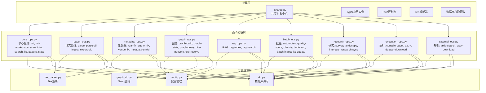
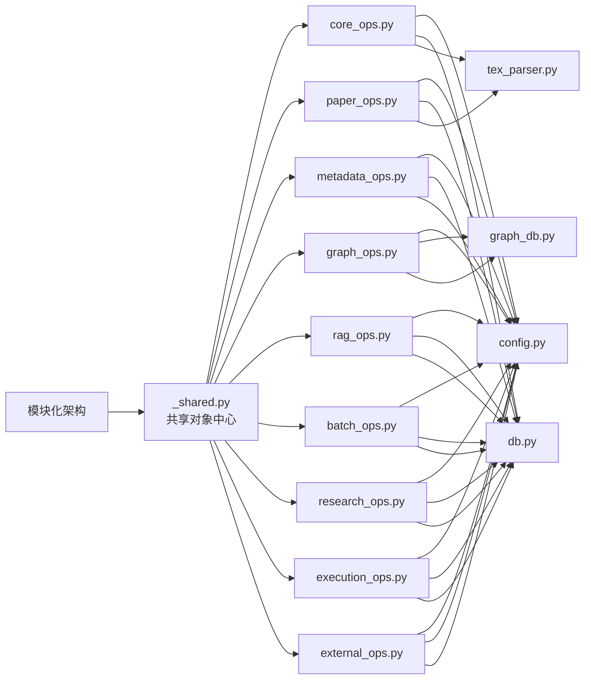

# CLI命令行接口

<cite>
**本文引用的文件列表**
- [_shared.py](file://scholar/_shared.py)
- [cli.py](file://scholar/cli.py)
- [__main__.py](file://scholar/__main__.py)
- [config.py](file://scholar/config.py)
- [requirements.txt](file://requirements.txt)
- [test_cli.py](file://test/test_cli.py)
- [core_ops.py](file://scholar/commands/core_ops.py)
- [paper_ops.py](file://scholar/commands/paper_ops.py)
- [metadata_ops.py](file://scholar/commands/metadata_ops.py)
- [graph_ops.py](file://scholar/commands/graph_ops.py)
- [rag_ops.py](file://scholar/commands/rag_ops.py)
- [batch_ops.py](file://scholar/commands/batch_ops.py)
- [research_ops.py](file://scholar/commands/research_ops.py)
- [execution_ops.py](file://scholar/commands/execution_ops.py)
- [external_ops.py](file://scholar/commands/external_ops.py)
</cite>

## 目录
1. [简介](#简介)
2. [模块化架构概览](#模块化架构概览)
3. [核心组件](#核心组件)
4. [模块化命令体系](#模块化命令体系)
5. [详细命令参考](#详细命令参考)
6. [依赖关系分析](#依赖关系分析)
7. [性能考量](#性能考量)
8. [故障排查指南](#故障排查指南)
9. [结论](#结论)
10. [附录](#附录)

## 简介
本文件面向模块化的CLI命令行接口，系统性梳理基于Typer框架构建的学术研究工具链命令体系。经过重构后，原2500+行的monolithic CLI已重构为9个专门的命令模块，每个模块专注于特定的功能领域，包括核心操作、论文处理、元数据管理、图谱操作、RAG检索、批量处理、研究流程、实验执行和外部集成等。文档同时总结Rich库在富文本输出、表格渲染、进度条展示方面的使用模式，给出错误处理策略、日志记录与调试技巧，并提供命令组合使用模式与最佳实践。

## 模块化架构概览
新架构采用共享对象中心的设计模式，通过`_shared.py`统一管理Typer应用实例、控制台输出和数据库连接，各命令模块通过导入共享对象实现松耦合的模块化设计。

**图表来源**
- [_shared.py:1-40](file://scholar/_shared.py#L1-L40)
- [cli.py:11-20](file://scholar/cli.py#L11-L20)
- [core_ops.py:1-10](file://scholar/commands/core_ops.py#L1-L10)
- [paper_ops.py:1-12](file://scholar/commands/paper_ops.py#L1-L12)

## 核心组件
- **共享对象中心**：`_shared.py`定义Typer应用实例、Rich控制台、TeX解析器和数据库获取函数，避免循环导入并提供统一的全局状态管理。
- **模块化命令注册**：通过`cli.py`中的导入语句将各模块的命令注册到共享的应用实例上，实现松耦合的模块化设计。
- **Rich UI组件**：统一使用控制台、表格、面板、进度条等组件提升交互体验，所有命令共享相同的UI风格。
- **配置与环境管理**：集中管理路径、数据库连接、嵌入模型、arXiv请求等全局设置，支持开发和生产两种模式。

**章节来源**
- [_shared.py:18-40](file://scholar/_shared.py#L18-L40)
- [cli.py:9-25](file://scholar/cli.py#L9-L25)
- [config.py:1-119](file://scholar/config.py#L1-L119)

## 模块化命令体系

### 核心操作模块 (core_ops.py)
负责基础的系统管理和状态查询功能，包括初始化、工作空间初始化、扫描、信息展示、搜索、列表和统计等核心命令。

**主要命令**
- `init`: 初始化知识库目录结构和配置文件
- `init-workspace`: 初始化当前目录作为工作空间
- `scan`: 扫描论文目录并显示解析状态
- `info`: 查看单篇论文的详细信息
- `search`: 全文检索已解析的论文
- `list-papers`: 列出已解析论文的元数据
- `stats`: 显示知识库统计信息

**章节来源**
- [core_ops.py:14-438](file://scholar/commands/core_ops.py#L14-L438)

### 论文处理模块 (paper_ops.py)
专注于论文的解析、批量处理、增量入库和BibTeX导出等功能。

**主要命令**
- `parse`: 解析单篇论文的TeX源码
- `parse-all`: 批量解析所有论文
- `ingest`: 增量入库流程（解析→作者补全→自动生成笔记→质量评分→分类→图谱更新→RAG重建）
- `export-bib`: 导出BibTeX参考文献

**章节来源**
- [paper_ops.py:15-263](file://scholar/commands/paper_ops.py#L15-L263)

### 元数据管理模块 (metadata_ops.py)
提供论文元数据的补全和修正功能，包括年份补全、作者补全、会议字段补全和元数据丰富化。

**主要命令**
- `year-fix`: 使用Lean4交叉引用补全年份
- `author-fix`: 使用arXiv API补全缺失作者
- `venue-fix`: 基于启发式规则补全会议字段
- `metadata-enrich`: 通过arXiv API回填arxiv_id/DOI等元数据

**章节来源**
- [metadata_ops.py:12-198](file://scholar/commands/metadata_ops.py#L12-L198)

### 图谱操作模块 (graph_ops.py)
管理Neo4j图数据库的操作，包括引用网络构建、统计分析、概念图查询和引用解析。

**主要命令**
- `graph-build`: 构建引用网络和概念图
- `graph-stats`: 查询图谱统计信息
- `graph-query`: 按概念ID查询相关论文
- `cite-network`: 引用网络分析
- `cite-resolve`: 解析引用参考文献

**章节来源**
- [graph_ops.py:11-252](file://scholar/commands/graph_ops.py#L11-L252)

### RAG操作模块 (rag_ops.py)
提供语义检索功能，支持向量检索和混合检索模式。

**主要命令**
- `rag-index`: 构建RAG向量索引
- `rag-search`: 语义检索（支持混合模式）

**章节来源**
- [rag_ops.py:10-74](file://scholar/commands/rag_ops.py#L10-L74)

### 批量处理模块 (batch_ops.py)
实现批量操作和完整的工作流管道，包括自动生成笔记、质量评分、分类、引导程序和知识库更新。

**主要命令**
- `auto-notes`: 自动生成阅读笔记（支持单篇和批量模式）
- `quality-score`: 质量评分（支持单篇和批量模式）
- `classify`: 论文分类（支持单篇、批量和标签列表）
- `bootstrap`: 完整初始化流水线
- `batch-ingest`: 批量增量入库
- `kb-update`: 知识库一键更新

**章节来源**
- [batch_ops.py:13-323](file://scholar/commands/batch_ops.py#L13-L323)

### 研究流程模块 (research_ops.py)
提供高级研究功能，包括研究综述、领域景观分析和研究方向管理。

**主要命令**
- `survey`: 研究综述流水线（RAG搜索→图谱查询→分类→时间线→结构化输出）
- `landscape`: 领域景观分析
- `interests`: 研究兴趣管理（list/add/remove/logs/mark-analyzed）
- `research-sync`: 研究同步（按兴趣方向搜索arXiv并入库）

**章节来源**
- [research_ops.py:13-404](file://scholar/commands/research_ops.py#L13-L404)

### 执行操作模块 (execution_ops.py)
管理实验执行、LaTeX编译和数据集下载等执行层面的功能。

**主要命令**
- `compile-paper`: LaTeX编译与报告（支持结构化错误报告）
- `exp-run`: 运行实验脚本
- `exp-compare`: 对比实验结果
- `exp-setup`: 设置实验环境（conda/Docker）
- `exp-debug`: 实验故障诊断
- `dataset-download`: 下载数据集

**章节来源**
- [execution_ops.py:18-517](file://scholar/commands/execution_ops.py#L18-L517)

### 外部集成模块 (external_ops.py)
处理与外部系统的交互，主要包括arXiv搜索和下载功能。

**主要命令**
- `arxiv-search`: 搜索arXiv论文
- `arxiv-download`: 从arXiv下载论文到知识库

**章节来源**
- [external_ops.py:10-93](file://scholar/commands/external_ops.py#L10-L93)

## 详细命令参考

### 核心操作命令

#### init：初始化知识库
- 功能：创建知识库目录结构和配置文件，检查数据库连接状态
- 输出：创建过程的详细信息和下一步操作指导
- 选项：无

**章节来源**
- [core_ops.py:17-70](file://scholar/commands/core_ops.py#L17-L70)

#### init-workspace：初始化工作空间
- 功能：初始化当前目录作为Scholar Studio工作空间，在当前工作空间中创建output/drafts/、output/notes/、output/logs/目录
- 输出：创建过程的详细信息和双拷贝布局说明
- 选项：无

**更新** 新增命令，用于支持项目级工作空间初始化

**章节来源**
- [core_ops.py:72-106](file://scholar/commands/core_ops.py#L72-L106)

#### scan：扫描论文目录
- 功能：遍历论文目录，统计解析状态、源码存在性和PDF存在性
- 输出：表格形式的状态概览和摘要面板
- 优化：大量数据时显示首尾片段并插入省略行

**章节来源**
- [core_ops.py:111-189](file://scholar/commands/core_ops.py#L111-L189)

#### info：查看论文详情
- 功能：加载解析后的JSON文件，展示标题、作者、年份、会议、TeX文件数、主文件名、摘要、章节、公式、引用等
- 输出：面板形式的详细信息和表格化的章节、公式、引用列表

**章节来源**
- [core_ops.py:194-254](file://scholar/commands/core_ops.py#L194-L254)

#### search：全文检索
- 功能：优先查询数据库，否则回退到解析JSON文件进行关键词匹配
- 输出：表格列出Paper ID、标题、年份，支持限制结果数量

**章节来源**
- [core_ops.py:259-313](file://scholar/commands/core_ops.py#L259-L313)

#### list-papers：列出解析论文
- 功能：按年份过滤与限制数量列出论文元数据
- 输出：表格含Paper ID、标题、年份、会议、节数、公式数、引用数

**章节来源**
- [core_ops.py:318-358](file://scholar/commands/core_ops.py#L318-L358)

#### stats：知识库统计
- 功能：统计解析论文数量、总节数、公式数、引用数、数据库连通性与元数据覆盖率
- 输出：面板统计与按年份、按会议的分布

**章节来源**
- [core_ops.py:364-438](file://scholar/commands/core_ops.py#L364-L438)

### 论文处理命令

#### parse：解析单篇论文
- 功能：解析TeX源码为结构化JSON，保存至输出目录，并尝试同步到数据库
- 参数：paper_id（位置参数，支持ULID、arXiv、DOI或slug）
- 行为：解析成功后输出摘要面板；失败时打印错误并退出

**章节来源**
- [paper_ops.py:18-56](file://scholar/commands/paper_ops.py#L18-L56)

#### parse-all：批量解析论文
- 功能：批量解析未解析论文，支持限制数量与强制重解析
- 进度：使用Rich进度条显示任务描述与完成进度
- 统计：输出成功/失败计数与失败清单（最多20项）

**章节来源**
- [paper_ops.py:61-122](file://scholar/commands/paper_ops.py#L61-L122)

#### ingest：增量入库
- 功能：完整的增量入库流水线，包括解析→作者补全→自动生成笔记→质量评分→分类→图谱更新→RAG重建
- 步骤：逐步执行各阶段并显示进度和结果

**章节来源**
- [paper_ops.py:163-263](file://scholar/commands/paper_ops.py#L163-L263)

#### export-bib：导出BibTeX
- 功能：遍历解析JSON，生成BibTeX条目并写入文件
- 输出：提示导出条目数量与目标路径

**章节来源**
- [paper_ops.py:127-157](file://scholar/commands/paper_ops.py#L127-L157)

### 元数据管理命令

#### year-fix：年份补全
- 功能：优先使用Lean4交叉引用补全年份，再回退arXiv API
- 选项：--apply决定是否写回JSON；支持dry-run模式
- 输出：面板统计查询数与填充数；展示前若干条结果预览

**章节来源**
- [metadata_ops.py:89-121](file://scholar/commands/metadata_ops.py#L89-L121)

#### author-fix：作者补全
- 功能：对缺失作者的论文，使用arXiv API按标题搜索，填充作者列表
- 选项：--apply决定是否写回JSON；limit限制查询次数
- 输出：面板统计查询数与填充数；展示前若干条结果预览

**章节来源**
- [metadata_ops.py:15-84](file://scholar/commands/metadata_ops.py#L15-L84)

#### venue-fix：会议字段补全
- 功能：基于arxiv_id与标题启发式补全会议字段（arXiv/Preprint）
- 选项：--apply决定是否写回JSON
- 输出：面板统计补全数量与跳过原因

**章节来源**
- [metadata_ops.py:152-197](file://scholar/commands/metadata_ops.py#L152-L197)

#### metadata-enrich：元数据补全
- 功能：通过arXiv API回填arxiv_id/DOI/会议/年份等字段
- 选项：--apply写回；--limit限制处理数量
- 输出：面板统计总量、已存在、匹配、填充、错误等

**章节来源**
- [metadata_ops.py:126-146](file://scholar/commands/metadata_ops.py#L126-L146)

### 图谱操作命令

#### graph-build：构建引用网络与概念图
- 功能：连接Neo4j，构建引用网络、解析引用键、计算中心性指标、构建概念图、同步Lean4替换关系
- 输出：分步统计与最终汇总面板

**章节来源**
- [graph_ops.py:14-56](file://scholar/commands/graph_ops.py#L14-L56)

#### graph-stats：图谱统计
- 功能：查询节点与边数量、解析/未解析引用、孤立节点、Top被引与桥接论文
- 输出：面板统计与Top表

**章节来源**
- [graph_ops.py:62-136](file://scholar/commands/graph_ops.py#L62-L136)

#### graph-query：概念图查询
- 功能：查询包含指定概念的论文及关联概念
- 输出：论文表格与关联概念列表

**章节来源**
- [graph_ops.py:142-176](file://scholar/commands/graph_ops.py#L142-L176)

#### cite-network：引用网络分析
- 功能：可选查询特定论文的前向/后向引用，或展示全局统计与Top被引论文
- 输出：面板与表格

**章节来源**
- [graph_ops.py:182-226](file://scholar/commands/graph_ops.py#L182-L226)

#### cite-resolve：引用解析
- 功能：内部匹配+arXiv API+Neo4j节点，解析引用参考文献
- 选项：--apply写回；--dry-run仅预览
- 输出：面板统计解析结果

**章节来源**
- [graph_ops.py:232-251](file://scholar/commands/graph_ops.py#L232-L251)

### RAG检索命令

#### rag-index：构建RAG向量索引
- 功能：检查嵌入API密钥，调用向量化服务构建HNSW索引
- 输出：面板统计论文数、块数、嵌入数与索引状态

**章节来源**
- [rag_ops.py:13-33](file://scholar/commands/rag_ops.py#L13-L33)

#### rag-search：语义检索
- 功能：支持纯向量与混合检索（向量+BM25+RRF），返回Paper ID、章节、内容相似度
- 选项：--hybrid启用混合模式
- 输出：表格列出结果

**章节来源**
- [rag_ops.py:39-74](file://scholar/commands/rag_ops.py#L39-L74)

### 批量处理命令

#### auto-notes：自动生成阅读笔记
- 功能：单篇或批量生成结构化阅读笔记，支持强制覆盖
- 选项：--force覆盖现有笔记
- 输出：面板显示状态与路径；批量模式显示创建/跳过/失败计数

**章节来源**
- [batch_ops.py:16-42](file://scholar/commands/batch_ops.py#L16-L42)

#### quality-score：质量评分
- 功能：对单篇或全部论文进行多维度质量评分，展示维度明细与等级分布
- 选项：--all对所有论文评分；--paper-id指定论文ID
- 输出：表格与面板统计

**章节来源**
- [batch_ops.py:48-94](file://scholar/commands/batch_ops.py#L48-L94)

#### classify：论文分类
- 功能：对单篇或全部论文进行领域/子方向/方法标签分类，支持列出标签
- 选项：--all对所有论文分类；--list-tags列出标签；--paper-id指定论文ID
- 输出：面板与分布统计

**章节来源**
- [batch_ops.py:99-144](file://scholar/commands/batch_ops.py#L99-L144)

#### bootstrap：全量初始化流水线
- 功能：串行执行解析、年份补全、作者补全、图谱构建、PostgreSQL同步、RAG索引、自动生成笔记、质量评分、分类
- 输出：步骤式进度与最终汇总面板

**章节来源**
- [batch_ops.py:149-260](file://scholar/commands/batch_ops.py#L149-L260)

#### batch-ingest：批量入库
- 功能：批量执行增量入库，支持跳过笔记与质量评分
- 选项：--skip-notes跳过笔记生成；--skip-quality跳过质量评分
- 输出：面板统计各阶段计数与错误列表

**章节来源**
- [batch_ops.py:266-292](file://scholar/commands/batch_ops.py#L266-L292)

#### kb-update：知识库一键更新
- 功能：arXiv搜索→下载→批量入库
- 选项：--max限制结果数；--pdf/--no-pdf控制PDF下载
- 输出：面板统计下载与入库情况

**章节来源**
- [batch_ops.py:297-323](file://scholar/commands/batch_ops.py#L297-L323)

### 研究流程命令

#### survey：研究综述流水线
- 功能：混合RAG搜索→图谱概念查询→元数据丰富→时间线与结构化输出
- 选项：--depth控制深度（standard/full）；--limit限制论文数量
- 输出：Markdown草稿保存路径

**章节来源**
- [research_ops.py:16-149](file://scholar/commands/research_ops.py#L16-L149)

#### landscape：领域景观分析
- 功能：匹配领域标签→收集论文→年份分布→图谱中心性→质量分布→关键论文→报告输出
- 输出：Markdown报告保存路径

**章节来源**
- [research_ops.py:155-262](file://scholar/commands/research_ops.py#L155-L262)

#### interests：研究兴趣管理
- 功能：list/add/remove/logs/mark-analyzed，支持按周标记分析完成
- 选项：--keywords逗号分隔的关键字；--category兴趣类别；--week周ID；--found发现的兴趣数量
- 输出：面板与表格，清晰展示兴趣方向与分析进度

**章节来源**
- [research_ops.py:268-367](file://scholar/commands/research_ops.py#L268-L367)

#### research-sync：研究同步
- 功能：按兴趣方向搜索arXiv并全流程入库，支持单方向与全方向同步
- 选项：--category指定方向；--max每关键字最大结果数
- 输出：面板统计与结果列表

**章节来源**
- [research_ops.py:370-404](file://scholar/commands/research_ops.py#L370-L404)

### 执行操作命令

#### compile-paper：LaTeX编译与报告
- 功能：调用LaTeX引擎，二次编译解决交叉引用，解析.log提取致命/警告/信息类错误，输出结构化报告
- 选项：--report仅解析已有日志；--engine覆盖引擎；--max-retries重试次数
- 输出：面板报告与错误定位

**章节来源**
- [execution_ops.py:143-246](file://scholar/commands/execution_ops.py#L143-L246)

#### exp-run：运行实验脚本
- 功能：运行实验代码并收集标准输出/错误与返回码，保存日志
- 选项：--gpu使用GPU；--timeout超时时间；--mode运行模式
- 输出：面板显示状态与日志路径

**章节来源**
- [execution_ops.py:251-321](file://scholar/commands/execution_ops.py#L251-L321)

#### exp-compare：对比实验结果
- 功能：对比实验结果与论文指标，支持基线对比
- 选项：--baseline-id基线论文ID
- 输出：面板显示比较结果

**章节来源**
- [execution_ops.py:326-386](file://scholar/commands/execution_ops.py#L326-L386)

#### exp-setup：设置实验环境
- 功能：为实验配置conda或Docker环境
- 选项：--conda/--no-conda使用conda；--docker使用Docker
- 输出：环境配置指令

**章节来源**
- [execution_ops.py:392-431](file://scholar/commands/execution_ops.py#L392-L431)

#### exp-debug：实验故障诊断
- 功能：解析run_log.txt，识别常见问题（模块缺失、OOM、文件缺失、运行时错误）
- 输出：面板显示检测到的问题和最后500字符的stderr内容

**章节来源**
- [execution_ops.py:436-473](file://scholar/commands/execution_ops.py#L436-L473)

#### dataset-download：数据集下载
- 功能：优先使用huggingface-cli，其次使用datasets库，支持自动选择来源
- 选项：--source指定来源（auto/huggingface/paperswithcode）
- 输出：面板提示下载状态与可用拆分

**章节来源**
- [execution_ops.py:479-517](file://scholar/commands/execution_ops.py#L479-L517)

### 外部集成命令

#### arxiv-search：arXiv搜索
- 功能：调用arXiv API，解析XML响应，展示标题、作者、年份、arXiv ID
- 选项：--max限制结果数
- 输出：表格列出搜索结果；失败时提示代理配置

**章节来源**
- [external_ops.py:13-63](file://scholar/commands/external_ops.py#L13-L63)

#### arxiv-download：从arXiv下载论文
- 功能：下载TeX源码到知识库，支持PDF下载开关
- 选项：--max限制下载数量；--pdf/--no-pdf控制PDF下载
- 输出：面板统计下载/跳过/失败数量与示例清单

**章节来源**
- [external_ops.py:69-93](file://scholar/commands/external_ops.py#L69-L93)

## 依赖关系分析
新架构通过共享对象中心实现了清晰的依赖层次：

- **共享层依赖**：所有命令模块都依赖`_shared.py`提供的共享对象
- **配置依赖**：各模块通过导入`config.py`获取全局配置
- **数据库依赖**：核心模块依赖`db.py`和`graph_db.py`进行数据持久化
- **解析依赖**：论文处理模块依赖`tex_parser.py`进行TeX解析
- **外部服务依赖**：元数据和外部模块依赖arXiv API和嵌入服务

**图表来源**
- [cli.py:11-20](file://scholar/cli.py#L11-L20)
- [_shared.py:18-40](file://scholar/_shared.py#L18-L40)

**章节来源**
- [requirements.txt:1-14](file://requirements.txt#L1-L14)
- [cli.py:9-25](file://scholar/cli.py#L9-L25)
- [config.py:69-119](file://scholar/config.py#L69-L119)

## 性能考量
- **模块化加载**：通过延迟导入减少启动时间和内存占用
- **批量处理优化**：parse-all与批量命令使用Rich进度条，避免阻塞与提升可观测性
- **分页与截断**：info命令对公式与引用进行截断展示；scan命令对长列表进行省略处理
- **回退策略**：search与graph-stats在数据库不可用时采用文件系统回退方案
- **向量化索引**：RAG索引构建完成后可显著降低检索延迟
- **缓存机制**：数据库连接通过_get_db函数实现懒加载和缓存

## 故障排查指南
- **模块导入错误**：检查各模块的导入路径和循环依赖
- **共享对象访问**：确保通过`_shared.py`正确访问共享对象
- **数据库连接**：graph-build/graph-stats等命令会提示Neo4j不可用；需启动容器或安装驱动
- **arXiv请求失败**：检查代理设置与超时配置；命令会提示设置HTTP_PROXY环境变量
- **LaTeX编译失败**：compile-paper解析.log提取致命/警告/信息类错误，定位文件与行号；必要时增加重试次数
- **嵌入API密钥缺失**：rag-index要求设置SCHOLAR_EMBEDDING_API_KEY
- **文件不存在**：parse/compile-paper等命令对缺失文件进行明确报错并退出
- **工作空间初始化失败**：init-workspace命令会在当前目录创建output子目录，确保有足够的磁盘权限

**章节来源**
- [graph_ops.py:20-23](file://scholar/commands/graph_ops.py#L20-L23)
- [external_ops.py:30-32](file://scholar/commands/external_ops.py#L30-L32)
- [execution_ops.py:172-174](file://scholar/commands/execution_ops.py#L172-L174)
- [rag_ops.py:18-22](file://scholar/commands/rag_ops.py#L18-L22)

## 结论
新模块化CLI架构通过共享对象中心的设计，实现了高度解耦的命令体系。9个专门的命令模块各司其职，既保持了功能的完整性，又提高了代码的可维护性和扩展性。通过合理的错误处理、进度反馈与回退策略，既保证了易用性也兼顾了健壮性。新增的`init-workspace`命令进一步完善了部署工作流，支持项目级工作空间的初始化。建议在生产环境中配合环境变量与外部服务配置，充分利用bootstrap与kb-update等流水线命令实现快速初始化与持续更新。

## 附录

### Rich UI组件使用要点
- **控制台输出**：统一使用Console进行彩色输出与格式化
- **表格渲染**：Table用于结构化数据展示，支持列宽、标题与对齐
- **面板展示**：Panel用于突出重要统计与结果摘要
- **进度条**：Progress + SpinnerColumn + TextColumn提供实时任务进度反馈

**章节来源**
- [core_ops.py:83-152](file://scholar/commands/core_ops.py#L83-L152)
- [paper_ops.py:83-122](file://scholar/commands/paper_ops.py#L83-L122)
- [batch_ops.py:36-42](file://scholar/commands/batch_ops.py#L36-L42)

### 命令组合与最佳实践
- **初始化**：bootstrap一次性完成解析、补全、图谱、索引、笔记、评分、分类
- **新增论文**：arxiv-download + ingest，或kb-update + batch-ingest
- **检索与分析**：rag-search或search + graph-query + classify + quality-score
- **实验管理**：exp-setup + exp-run + exp-compare + exp-debug
- **维护与补全**：year-fix + author-fix + metadata-enrich + venue-fix
- **工作空间管理**：scholar init + scholar init-workspace + scholar stats

**章节来源**
- [batch_ops.py:149-260](file://scholar/commands/batch_ops.py#L149-L260)
- [external_ops.py:69-93](file://scholar/commands/external_ops.py#L69-L93)
- [paper_ops.py:163-263](file://scholar/commands/paper_ops.py#L163-L263)
- [batch_ops.py:297-323](file://scholar/commands/batch_ops.py#L297-L323)
- [execution_ops.py:251-321](file://scholar/commands/execution_ops.py#L251-L321)
- [metadata_ops.py:89-121](file://scholar/commands/metadata_ops.py#L89-L121)
- [metadata_ops.py:15-84](file://scholar/commands/metadata_ops.py#L15-L84)
- [metadata_ops.py:126-146](file://scholar/commands/metadata_ops.py#L126-L146)
- [metadata_ops.py:152-197](file://scholar/commands/metadata_ops.py#L152-L197)