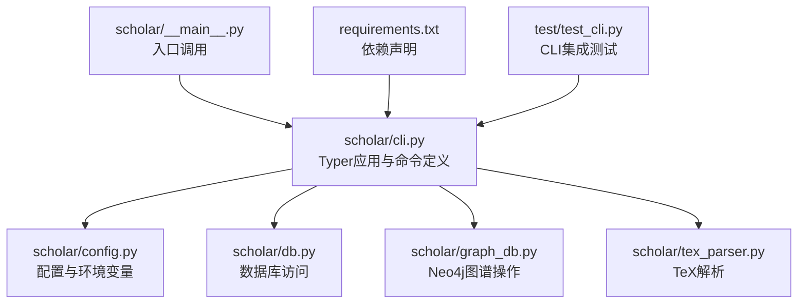
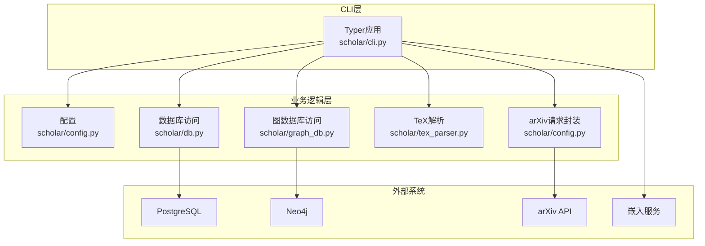
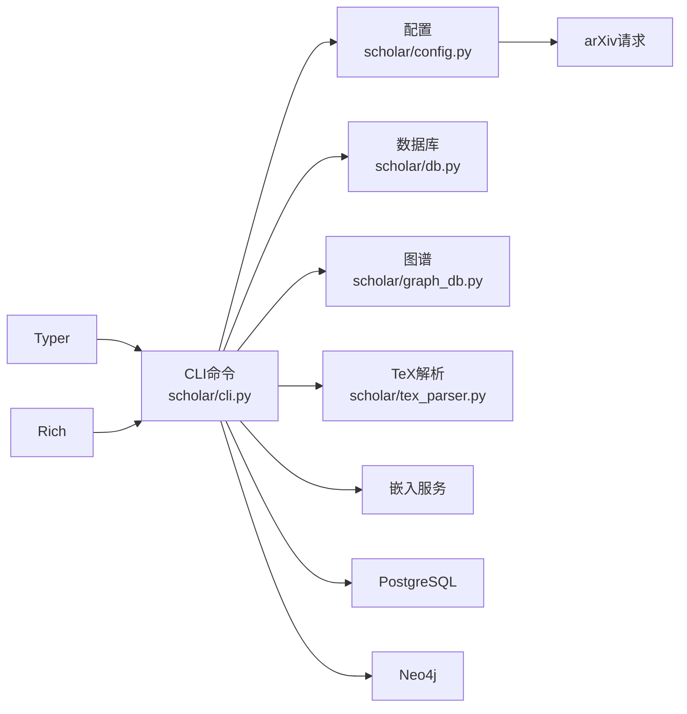

# CLI命令行接口

<cite>
**本文引用的文件列表**
- [cli.py](file://scholar/cli.py)
- [__main__.py](file://scholar/__main__.py)
- [config.py](file://scholar/config.py)
- [requirements.txt](file://requirements.txt)
- [test_cli.py](file://test/test_cli.py)
</cite>

## 目录
1. [简介](#简介)
2. [项目结构](#项目结构)
3. [核心组件](#核心组件)
4. [架构总览](#架构总览)
5. [详细组件分析](#详细组件分析)
6. [依赖关系分析](#依赖关系分析)
7. [性能考量](#性能考量)
8. [故障排查指南](#故障排查指南)
9. [结论](#结论)
10. [附录](#附录)

## 简介
本文件面向CLI命令行接口，系统性梳理基于Typer框架构建的学术研究工具链命令体系，覆盖扫描、解析、检索、统计、导出、作者补全、arXiv搜索、图谱构建与查询、质量评分、分类、Bootstrap流水线、LaTeX编译、实验管理、数据集下载、元数据补全等核心功能。文档同时总结Rich库在富文本输出、表格渲染、进度条展示方面的使用模式，给出错误处理策略、日志记录与调试技巧，并提供命令组合使用模式与最佳实践建议。

## 项目结构
- CLI入口位于模块级入口文件，实际命令定义集中在主CLI模块中，通过Typer注册子命令。
- 配置模块集中管理路径、数据库连接、嵌入模型、arXiv请求等全局设置。
- 测试模块对CLI进行端到端集成测试，确保命令存在且帮助信息可正常输出。

图表来源
- [__main__.py:1-8](file://scholar/__main__.py#L1-L8)
- [cli.py:1-40](file://scholar/cli.py#L1-L40)
- [config.py:1-60](file://scholar/config.py#L1-L60)
- [requirements.txt:1-14](file://requirements.txt#L1-L14)
- [test_cli.py:1-111](file://test/test_cli.py#L1-L111)

章节来源
- [__main__.py:1-8](file://scholar/__main__.py#L1-L8)
- [cli.py:1-40](file://scholar/cli.py#L1-L40)
- [config.py:1-60](file://scholar/config.py#L1-L60)
- [requirements.txt:1-14](file://requirements.txt#L1-L14)
- [test_cli.py:1-111](file://test/test_cli.py#L1-L111)

## 核心组件
- Typer应用与命令注册：通过Typer实例注册各类命令，统一入口、帮助信息与参数校验。
- Rich UI组件：使用控制台、表格、面板、进度条等组件提升交互体验。
- 数据与图谱层：解析TeX、持久化JSON、PostgreSQL同步、Neo4j图谱构建与查询。
- 外部服务：arXiv API请求、嵌入模型API、LaTeX引擎调用、实验脚本执行。
- 配置与环境：路径、数据库、嵌入模型、代理、超时等参数集中管理。

章节来源
- [cli.py:1-40](file://scholar/cli.py#L1-L40)
- [config.py:1-119](file://scholar/config.py#L1-L119)

## 架构总览
下图展示了CLI命令与内部模块的交互关系，以及外部依赖（数据库、图数据库、arXiv API、嵌入服务）。

图表来源
- [cli.py:1-40](file://scholar/cli.py#L1-L40)
- [config.py:69-119](file://scholar/config.py#L69-L119)

## 详细组件分析

### 命令定义与参数处理机制
- Typer装饰器用于声明命令、参数与选项，支持位置参数、可选参数、默认值、帮助信息与类型提示。
- 参数解析遵循“位置参数优先于选项”的规则；选项通过前缀标识，支持布尔开关与带值选项。
- 错误处理：命令内捕获异常后打印错误信息并返回非零退出码；部分命令在无法满足前置条件时直接退出。

章节来源
- [cli.py:46-171](file://scholar/cli.py#L46-L171)
- [cli.py:176-237](file://scholar/cli.py#L176-L237)
- [cli.py:242-306](file://scholar/cli.py#L242-L306)

### scan：扫描论文目录并显示状态
- 功能：遍历论文目录，统计源码包、PDF、解析状态，生成汇总面板与表格。
- 输出：表格列含状态、ULID、源码存在性、PDF存在性、是否解析；摘要面板显示总数与覆盖率。
- 优化：当数量过多时仅显示首尾片段并插入省略行，避免表格溢出。

章节来源
- [cli.py:46-127](file://scholar/cli.py#L46-L127)

### parse：解析单篇论文
- 功能：解析TeX源码为结构化JSON，保存至输出目录，并尝试同步到数据库。
- 参数：paper_id（位置参数，支持ULID、arXiv、DOI或slug）。
- 行为：解析成功后输出摘要面板；失败时打印错误并退出。

章节来源
- [cli.py:132-171](file://scholar/cli.py#L132-L171)

### parse-all：批量解析论文
- 功能：批量解析未解析论文，支持限制数量与强制重解析。
- 进度：使用Rich进度条显示任务描述与完成进度。
- 统计：输出成功/失败计数与失败清单（最多20项）。

章节来源
- [cli.py:176-237](file://scholar/cli.py#L176-L237)

### info：查看论文详情
- 功能：加载解析后的JSON，展示标题、作者、年份、会议、TeX文件数、主文件名、摘要、章节、公式、引用等。
- 截断：公式与引用分别截断展示，超出部分提示剩余数量。

章节来源
- [cli.py:242-306](file://scholar/cli.py#L242-L306)

### search：全文检索
- 功能：优先查询数据库（若可用），否则回退到解析JSON文件进行关键词匹配。
- 评分：按标题命中、摘要命中、章节内容命中给予不同权重，排序取前limit条。
- 输出：表格列出Paper ID、标题、年份。

章节来源
- [cli.py:311-370](file://scholar/cli.py#L311-L370)

### list-papers：列出解析论文
- 功能：按年份过滤与限制数量列出论文元数据。
- 输出：表格含Paper ID、标题、年份、会议、节数、公式数、引用数。

章节来源
- [cli.py:375-416](file://scholar/cli.py#L375-L416)

### stats：知识库统计
- 功能：统计解析论文数量、总节数、公式数、引用数、数据库连通性与元数据覆盖率（年份、作者、摘要、会议）。
- 输出：面板统计与按年份、按会议的分布。

章节来源
- [cli.py:421-487](file://scholar/cli.py#L421-L487)

### export-bib：导出BibTeX
- 功能：遍历解析JSON，生成BibTeX条目并写入文件。
- 输出：提示导出条目数量与目标路径。

章节来源
- [cli.py:492-524](file://scholar/cli.py#L492-L524)

### author-fix：作者补全（arXiv）
- 功能：对缺失作者的论文，使用arXiv API按标题搜索，填充作者列表。
- 选项：--apply决定是否写回JSON；limit限制查询次数。
- 输出：面板统计查询数与填充数；展示前若干条结果预览。

章节来源
- [cli.py:529-600](file://scholar/cli.py#L529-L600)

### arxiv-search：arXiv搜索
- 功能：调用arXiv API，解析XML响应，展示标题、作者、年份、arXiv ID。
- 选项：--max限制结果数。
- 输出：表格列出搜索结果；失败时提示代理配置。

章节来源
- [cli.py:605-658](file://scholar/cli.py#L605-L658)

### graph-build：构建引用网络与概念图
- 功能：连接Neo4j，构建引用网络、解析引用键、计算中心性指标、构建概念图、同步Lean4替换关系。
- 输出：分步统计与最终汇总面板。

章节来源
- [cli.py:663-705](file://scholar/cli.py#L663-L705)

### graph-stats：图谱统计
- 功能：查询节点与边数量、解析/未解析引用、孤立节点、Top被引与桥接论文。
- 输出：面板统计与Top表。

章节来源
- [cli.py:711-791](file://scholar/cli.py#L711-L791)

### graph-query：概念图查询
- 功能：查询包含指定概念的论文及关联概念。
- 输出：论文表格与关联概念列表。

章节来源
- [cli.py:797-833](file://scholar/cli.py#L797-L833)

### cite-network：引用网络分析
- 功能：可选查询特定论文的前向/后向引用，或展示全局统计与Top被引论文。
- 输出：面板与表格。

章节来源
- [cli.py:839-885](file://scholar/cli.py#L839-L885)

### year-fix：年份补全
- 功能：优先使用Lean4交叉引用补全年份，再回退arXiv API；支持dry-run与apply。
- 输出：面板统计与arXiv回填结果预览。

章节来源
- [cli.py:891-924](file://scholar/cli.py#L891-L924)

### rag-index：构建RAG向量索引
- 功能：检查嵌入API密钥，调用向量化服务构建HNSW索引。
- 输出：面板统计论文数、块数、嵌入数与索引状态。

章节来源
- [cli.py:929-949](file://scholar/cli.py#L929-L949)

### rag-search：语义检索
- 功能：支持纯向量与混合检索（向量+BM25+RRF），返回Paper ID、章节、内容相似度。
- 输出：表格列出结果。

章节来源
- [cli.py:955-989](file://scholar/cli.py#L955-L989)

### auto-notes：自动生成阅读笔记
- 功能：单篇或批量生成结构化阅读笔记，支持强制覆盖。
- 输出：面板显示状态与路径；批量模式显示创建/跳过/失败计数。

章节来源
- [cli.py:995-1021](file://scholar/cli.py#L995-L1021)

### quality-score：质量评分
- 功能：对单篇或全部论文进行多维度质量评分，展示维度明细与等级分布。
- 输出：表格与面板统计。

章节来源
- [cli.py:1027-1073](file://scholar/cli.py#L1027-L1073)

### classify：论文分类
- 功能：对单篇或全部论文进行领域/子方向/方法标签分类，支持列出标签。
- 输出：面板与分布统计。

章节来源
- [cli.py:1078-1123](file://scholar/cli.py#L1078-L1123)

### cite-resolve：引用解析
- 功能：内部匹配+arXiv API+Neo4j节点，解析引用参考文献。
- 选项：--apply写回；--dry-run仅预览。
- 输出：面板统计解析结果。

章节来源
- [cli.py:1128-1147](file://scholar/cli.py#L1128-L1147)

### bootstrap：全量初始化流水线
- 功能：串行执行解析、年份补全、作者补全、图谱构建、PostgreSQL同步、RAG索引、自动生成笔记、质量评分、分类。
- 输出：步骤式进度与最终汇总面板。

章节来源
- [cli.py:1153-1265](file://scholar/cli.py#L1153-L1265)

### ingest：增量入库
- 功能：解析→作者补全→自动生成笔记→质量评分→分类→图谱更新→RAG重建（尽力而为）。
- 输出：步骤式进度与最终成功提示。

章节来源
- [cli.py:1271-1371](file://scholar/cli.py#L1271-L1371)

### survey：研究综述流水线
- 功能：混合RAG搜索→图谱概念查询→元数据丰富→时间线与结构化输出。
- 输出：Markdown草稿保存路径。

章节来源
- [cli.py:1377-1515](file://scholar/cli.py#L1377-L1515)

### landscape：领域景观分析
- 功能：匹配领域标签→收集论文→年份分布→图谱中心性→质量分布→关键论文→报告输出。
- 输出：Markdown报告保存路径。

章节来源
- [cli.py:1520-1630](file://scholar/cli.py#L1520-L1630)

### arxiv-download：从arXiv下载论文
- 功能：下载TeX源码到知识库，支持PDF下载开关。
- 输出：面板统计下载/跳过/失败数量与示例清单。

章节来源
- [cli.py:1636-1660](file://scholar/cli.py#L1636-L1660)

### batch-ingest：批量入库
- 功能：批量执行增量入库，支持跳过笔记与质量评分。
- 输出：面板统计各阶段计数与错误列表。

章节来源
- [cli.py:1665-1691](file://scholar/cli.py#L1665-L1691)

### kb-update：知识库一键更新
- 功能：arXiv搜索→下载→批量入库。
- 输出：面板统计下载与入库情况。

章节来源
- [cli.py:1696-1722](file://scholar/cli.py#L1696-L1722)

### compile-paper：LaTeX编译与报告
- 功能：调用LaTeX引擎，二次编译解决交叉引用，解析.log提取致命/警告/信息类错误，输出结构化报告。
- 选项：--report仅解析已有日志；--engine覆盖引擎；--max-retries重试次数。
- 输出：面板报告与错误定位。

章节来源
- [cli.py:1810-1974](file://scholar/cli.py#L1810-L1974)

### 实验管理命令族
- exp-run：运行实验脚本，收集标准输出/错误与返回码，保存日志。
- exp-compare：对比实验结果与论文报告，支持基线对比。
- exp-setup：为实验配置conda或Docker环境。
- exp-debug：解析run_log.txt，识别常见问题（模块缺失、OOM、文件缺失、运行时错误）。
- 输出：面板与表格，清晰标注状态与定位信息。

章节来源
- [cli.py:1980-2124](file://scholar/cli.py#L1980-L2124)
- [cli.py:2129-2169](file://scholar/cli.py#L2129-L2169)
- [cli.py:2174-2214](file://scholar/cli.py#L2174-L2214)

### dataset-download：数据集下载
- 功能：优先使用huggingface-cli，其次使用datasets库，支持自动选择来源。
- 输出：面板提示下载状态与可用拆分。

章节来源
- [cli.py:2219-2260](file://scholar/cli.py#L2219-L2260)

### metadata-enrich：元数据补全
- 功能：通过arXiv API回填arxiv_id/DOI/会议/年份等字段，支持dry-run与apply。
- 输出：面板统计总量、已存在、匹配、填充、错误等。

章节来源
- [cli.py:2265-2285](file://scholar/cli.py#L2265-L2285)

### venue-fix：会议字段补全
- 功能：基于arxiv_id与标题启发式补全会议字段（arXiv/Preprint）。
- 输出：面板统计补全数量与跳过原因。

章节来源
- [cli.py:2291-2336](file://scholar/cli.py#L2291-L2336)

### research-loop：研究方向管理
- 功能：list/add/remove/logs/mark-analyzed，支持按周标记分析完成。
- 输出：面板与表格，清晰展示兴趣方向与分析进度。

章节来源
- [cli.py:2343-2419](file://scholar/cli.py#L2343-L2419)

### research-sync：研究同步
- 功能：按兴趣方向搜索arXiv并全流程入库，支持单方向与全方向同步。
- 输出：面板统计与结果列表。

章节来源
- [cli.py:2421-2455](file://scholar/cli.py#L2421-L2455)

## 依赖关系分析
- Typer：命令定义与参数解析的核心框架。
- Rich：控制台、表格、面板、进度条等UI组件。
- 数据库：PostgreSQL（结构化存储与RAG向量检索）、Neo4j（图谱）。
- 外部服务：arXiv API、嵌入服务（智谱等）。
- LaTeX：MiKTeX（pdflatex/xelatex）。

图表来源
- [requirements.txt:1-14](file://requirements.txt#L1-L14)
- [cli.py:1-40](file://scholar/cli.py#L1-L40)
- [config.py:69-119](file://scholar/config.py#L69-L119)

章节来源
- [requirements.txt:1-14](file://requirements.txt#L1-L14)
- [cli.py:1-40](file://scholar/cli.py#L1-L40)
- [config.py:69-119](file://scholar/config.py#L69-L119)

## 性能考量
- 批处理与进度条：parse-all与批量命令使用Rich进度条，避免阻塞与提升可观测性。
- 分页与截断：info命令对公式与引用进行截断展示；scan命令对长列表进行省略处理。
- 回退策略：search与graph-stats在数据库不可用时采用文件系统回退方案。
- 超时与重试：arXiv请求封装支持超时与指数退避重试，提升稳定性。
- 向量化索引：RAG索引构建完成后可显著降低检索延迟。

[本节为通用指导，无需具体文件引用]

## 故障排查指南
- 常见错误与处理：
  - 数据库不可用：graph-build/graph-stats等命令会提示Neo4j不可用；需启动容器或安装驱动。
  - arXiv请求失败：检查代理设置与超时配置；命令会提示设置HTTP_PROXY环境变量。
  - LaTeX编译失败：compile-paper解析.log提取致命/警告/信息类错误，定位文件与行号；必要时增加重试次数。
  - 嵌入API密钥缺失：rag-index要求设置SCHOLAR_EMBEDDING_API_KEY。
  - 文件不存在：parse/compile-paper等命令对缺失文件进行明确报错并退出。
- 调试技巧：
  - 使用--help快速确认命令与参数。
  - 在author-fix/year-fix/metadata-enrich等命令中使用--apply写回变更，便于复现与验证。
  - 利用实验调试命令exp-debug解析run_log.txt，快速定位模块缺失、OOM、文件路径等问题。
  - 通过scan与stats观察整体状态，辅助定位问题范围。

章节来源
- [cli.py:663-705](file://scholar/cli.py#L663-L705)
- [cli.py:605-658](file://scholar/cli.py#L605-L658)
- [cli.py:1810-1974](file://scholar/cli.py#L1810-L1974)
- [cli.py:929-949](file://scholar/cli.py#L929-L949)
- [cli.py:1980-2124](file://scholar/cli.py#L1980-L2124)
- [cli.py:2265-2285](file://scholar/cli.py#L2265-L2285)

## 结论
该CLI以Typer为核心，结合Rich实现丰富的终端交互体验，围绕论文解析、检索、图谱与RAG索引、实验与数据集管理形成完整的学术研究工作流。通过合理的错误处理、进度反馈与回退策略，既保证了易用性也兼顾了健壮性。建议在生产环境中配合环境变量与外部服务配置，充分利用bootstrap与kb-update等流水线命令实现快速初始化与持续更新。

[本节为总结性内容，无需具体文件引用]

## 附录

### Rich UI组件使用要点
- 控制台输出：统一使用Console进行彩色输出与格式化。
- 表格渲染：Table用于结构化数据展示，支持列宽、标题与对齐。
- 面板展示：Panel用于突出重要统计与结果摘要。
- 进度条：Progress + SpinnerColumn + TextColumn提供实时任务进度反馈。

章节来源
- [cli.py:14-28](file://scholar/cli.py#L14-L28)
- [cli.py:198-230](file://scholar/cli.py#L198-L230)
- [cli.py:358-370](file://scholar/cli.py#L358-L370)
- [cli.py:744-753](file://scholar/cli.py#L744-L753)

### 命令组合与最佳实践
- 初始化：bootstrap一次性完成解析、补全、图谱、索引、笔记、评分、分类。
- 新增论文：arxiv-download + ingest，或kb-update + batch-ingest。
- 检索与分析：rag-search或search + graph-query + classify + quality-score。
- 实验管理：exp-setup + exp-run + exp-compare + exp-debug。
- 维护与补全：year-fix + author-fix + metadata-enrich + venue-fix。

章节来源
- [cli.py:1153-1265](file://scholar/cli.py#L1153-L1265)
- [cli.py:1636-1660](file://scholar/cli.py#L1636-L1660)
- [cli.py:1271-1371](file://scholar/cli.py#L1271-L1371)
- [cli.py:1696-1722](file://scholar/cli.py#L1696-L1722)
- [cli.py:1980-2124](file://scholar/cli.py#L1980-L2124)
- [cli.py:891-924](file://scholar/cli.py#L891-L924)
- [cli.py:529-600](file://scholar/cli.py#L529-L600)
- [cli.py:2265-2285](file://scholar/cli.py#L2265-L2285)
- [cli.py:2291-2336](file://scholar/cli.py#L2291-L2336)