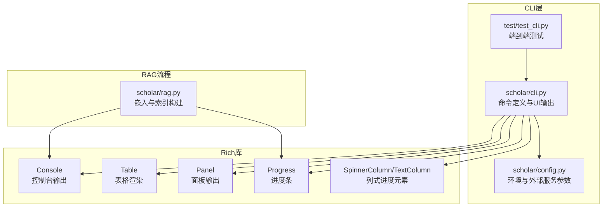
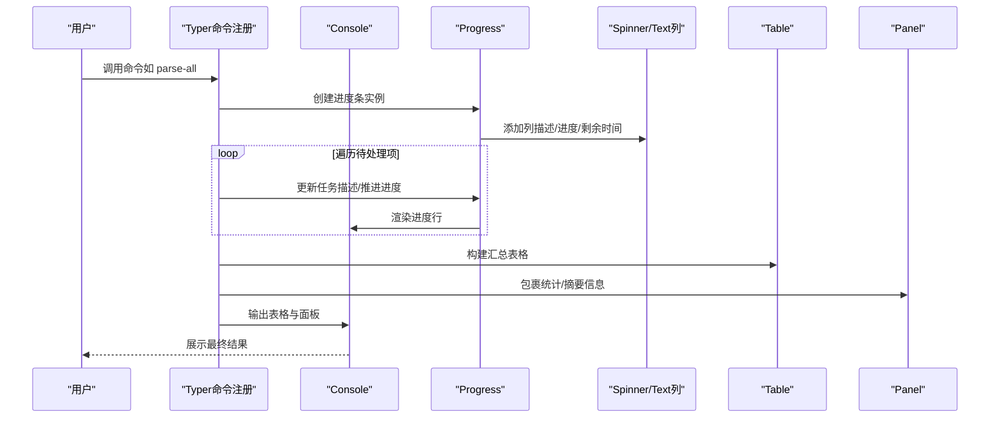
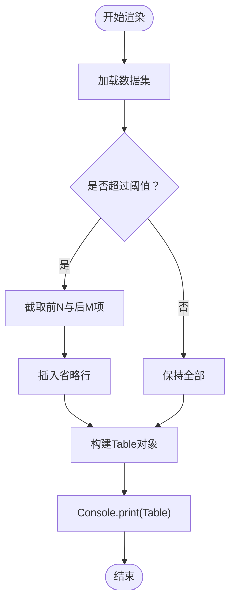
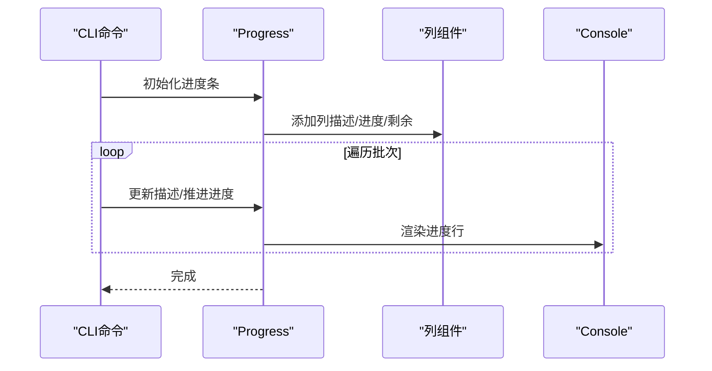
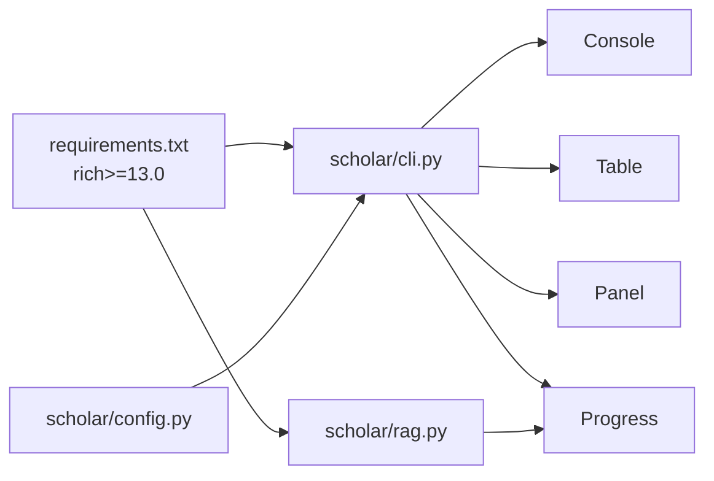

# UI组件与交互

<cite>
**本文引用的文件**
- [cli.py](file://scholar/cli.py)
- [rag.py](file://scholar/rag.py)
- [config.py](file://scholar/config.py)
- [requirements.txt](file://requirements.txt)
- [test_cli.py](file://test/test_cli.py)
</cite>

## 目录
1. [简介](#简介)
2. [项目结构](#项目结构)
3. [核心组件](#核心组件)
4. [架构总览](#架构总览)
5. [组件详解](#组件详解)
6. [依赖关系分析](#依赖关系分析)
7. [性能考量](#性能考量)
8. [故障排查指南](#故障排查指南)
9. [结论](#结论)
10. [附录](#附录)

## 简介
本文件聚焦于CLI界面组件中Rich库的应用与交互体验设计，系统梳理表格渲染、进度条显示、富文本输出、控制台格式化与状态反馈机制，并给出UI定制、样式配置与用户体验优化的最佳实践与调试方法。内容基于仓库中的Python CLI模块与RAG流程，覆盖命令行参数解析、表格展示、进度可视化、面板输出与错误处理等关键环节。

## 项目结构
本项目以Python为主，Rich作为富文本与终端UI的核心库；同时包含RAG嵌入索引流程与CLI命令集合。与UI相关的入口与核心逻辑集中在CLI模块，Rich的导入与使用主要分布在以下位置：
- CLI命令模块：集中定义命令、表格、面板、进度条与富文本输出
- RAG嵌入流程：在向量化与索引构建阶段使用Rich进度条增强可观测性
- 配置模块：提供环境变量与外部服务连接参数，间接影响UI行为（如arXiv请求失败提示）

图表来源
- [cli.py](file://scholar/cli.py)
- [rag.py](file://scholar/rag.py)
- [config.py](file://scholar/config.py)
- [test_cli.py](file://test/test_cli.py)

章节来源
- [cli.py](file://scholar/cli.py)
- [rag.py](file://scholar/rag.py)
- [config.py](file://scholar/config.py)
- [requirements.txt](file://requirements.txt)
- [test_cli.py](file://test/test_cli.py)

## 核心组件
- 控制台输出器（Console）
  - 统一的终端输出接口，负责富文本、颜色与格式化输出
- 表格（Table）
  - 用于结构化数据展示，支持列宽、标题与分页截断
- 进度条（Progress）
  - 提供任务进度可视化，支持多种列式组件（Spinner、Text、Bar、TimeRemaining）
- 面板（Panel）
  - 将信息包裹在带标题的面板中，提升可读性与层次感
- 富文本与样式
  - 使用标签语法进行颜色、强调与弱化等样式控制

章节来源
- [cli.py](file://scholar/cli.py)
- [rag.py](file://scholar/rag.py)

## 架构总览
下图展示了CLI命令在执行过程中如何组合Rich组件完成“表格+面板+进度”的综合输出，并通过配置模块与外部服务交互：

图表来源
- [cli.py](file://scholar/cli.py)
- [rag.py](file://scholar/rag.py)

## 组件详解

### 表格渲染（Table）
- 设计要点
  - 列宽与标题明确，避免信息溢出
  - 大列表采用“头尾截断+省略行”策略，兼顾完整性与可读性
  - 对长文本进行截断与省略，保留关键片段
- 典型场景
  - 论文扫描状态表、搜索结果表、已解析论文清单、图统计Top表
- 可定制点
  - 列宽、最大宽度、标题文案、省略策略
  - 内容截断与省略提示（如“... 更多”）

图表来源
- [cli.py](file://scholar/cli.py)

章节来源
- [cli.py](file://scholar/cli.py)

### 进度条显示（Progress）
- 设计要点
  - 使用列式组件组合（描述、进度、剩余时间），实时反馈任务进展
  - 在批量处理中统一更新任务描述，便于追踪当前处理目标
- 典型场景
  - 批量解析论文、嵌入向量化与索引构建
- 可定制点
  - 列组件类型与顺序、任务总数、描述模板、时间估算策略

图表来源
- [cli.py](file://scholar/cli.py)
- [rag.py](file://scholar/rag.py)

章节来源
- [cli.py](file://scholar/cli.py)
- [rag.py](file://scholar/rag.py)

### 面板输出（Panel）
- 设计要点
  - 将统计摘要、错误信息或结果概要放入带标题的面板，突出重点
  - 面板内支持富文本，便于强调关键数值与状态
- 典型场景
  - 解析完成摘要、批量处理结果、知识库统计、图统计概览

章节来源
- [cli.py](file://scholar/cli.py)
- [rag.py](file://scholar/rag.py)

### 富文本输出与样式
- 设计要点
  - 使用标签语法进行颜色、强调与弱化，提升可读性与层级感
  - 错误、成功、警告与次要信息采用不同样式区分
- 典型场景
  - 错误提示、成功/失败计数、摘要标题、摘要正文

章节来源
- [cli.py](file://scholar/cli.py)
- [rag.py](file://scholar/rag.py)

### 用户交互与状态反馈
- 设计要点
  - 通过表格与面板提供清晰的上下文信息
  - 通过进度条提供持续的状态反馈，减少等待焦虑
  - 对异常与边界条件（如无结果、数据库不可用）给出明确提示
- 典型场景
  - 搜索无结果、数据库未连接、arXiv请求失败、解析失败

章节来源
- [cli.py](file://scholar/cli.py)
- [config.py](file://scholar/config.py)

## 依赖关系分析
- Rich版本要求
  - 项目依赖Rich≥13.0，确保表格、面板与进度条等特性可用
- CLI与Rich的耦合
  - CLI命令直接依赖Console/Table/Panel/Progress等Rich组件
  - RAG流程在嵌入阶段也引入Rich进度条，增强可观测性
- 外部服务与UI的关系
  - 配置模块提供arXiv请求封装，失败时通过控制台输出提示，影响用户感知

图表来源
- [requirements.txt](file://requirements.txt)
- [cli.py](file://scholar/cli.py)
- [rag.py](file://scholar/rag.py)
- [config.py](file://scholar/config.py)

章节来源
- [requirements.txt](file://requirements.txt)
- [cli.py](file://scholar/cli.py)
- [rag.py](file://scholar/rag.py)
- [config.py](file://scholar/config.py)

## 性能考量
- 表格渲染
  - 大列表截断与省略可显著降低渲染开销与终端滚动压力
  - 合理设置列宽与最大宽度，避免频繁换行
- 进度条
  - 频繁更新会带来I/O开销，建议按批次推进并控制更新频率
  - 时间剩余估算依赖任务完成率，合理设置任务总数
- 富文本
  - 标签语法简单高效，但过多嵌套可能影响渲染速度，建议适度使用
- 外部服务
  - arXiv请求具备重试与超时机制，失败时及时提示有助于避免长时间阻塞

章节来源
- [cli.py](file://scholar/cli.py)
- [rag.py](file://scholar/rag.py)
- [config.py](file://scholar/config.py)

## 故障排查指南
- 常见问题与定位
  - 无结果或空表：检查输入关键字、过滤条件与数据源可用性
  - 数据库不可用：确认连接参数与服务状态，查看提示信息
  - arXiv请求失败：检查代理、超时与重试配置，参考错误提示
  - 编码问题：Windows环境下emoji或特殊字符可能导致编码错误，建议在兼容环境中运行或调整输出
- 测试与验证
  - 使用集成测试验证命令存在性与帮助输出
  - 针对错误输入与边界条件进行回归测试，确保不崩溃且输出友好提示

章节来源
- [test_cli.py](file://test/test_cli.py)
- [cli.py](file://scholar/cli.py)
- [config.py](file://scholar/config.py)

## 结论
本项目通过Rich库实现了结构化的CLI界面：表格承载结构化信息、面板突出摘要与提示、进度条提供实时反馈、富文本增强可读性与层级感。结合合理的截断策略、列式进度组件与错误提示，有效提升了用户体验与可观测性。建议在后续迭代中进一步细化样式主题、统一色彩语义，并在跨平台环境中加强编码与字体兼容性测试。

## 附录
- UI组件定制与样式配置建议
  - 统一色彩语义：成功（绿色）、警告（黄色）、错误（红色）、次要（灰色/弱化）
  - 字体与宽度：根据终端宽度设定最大列宽，避免长文本换行
  - 面板标题：简洁明了，突出关键指标
- 用户体验优化技巧
  - 批量操作时提供任务描述与剩余时间预估
  - 大列表默认截断并提供“查看更多”入口
  - 错误信息提供可操作建议（如启用代理、检查配置）
- 调试方法
  - 使用测试用例验证命令行为与输出稳定性
  - 在不同终端与操作系统上验证富文本与编码表现
  - 对外部服务调用增加日志与重试策略，提升鲁棒性