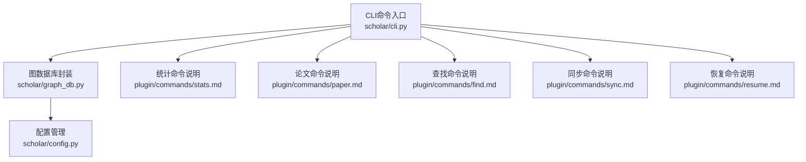
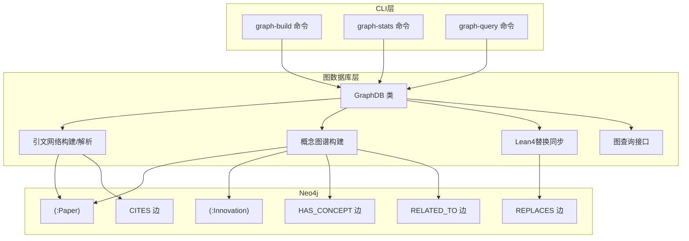
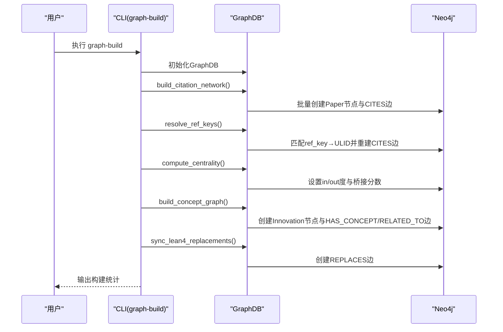
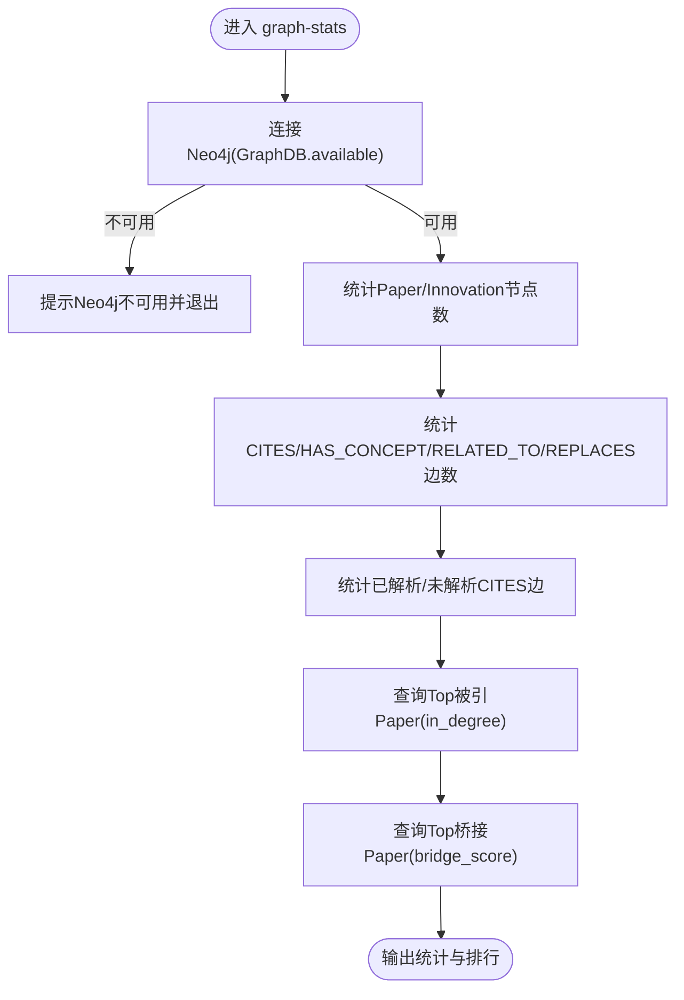
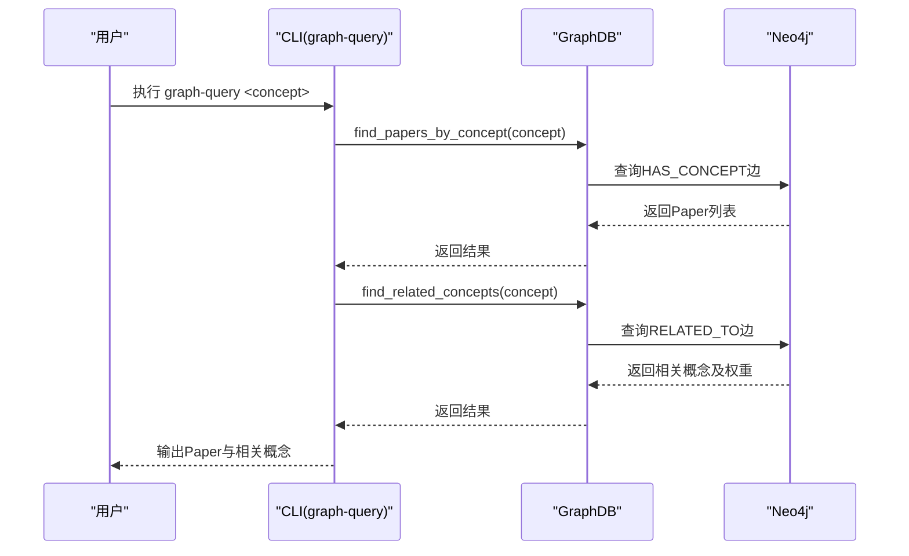
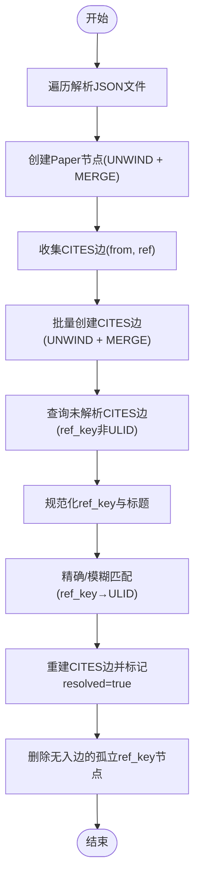
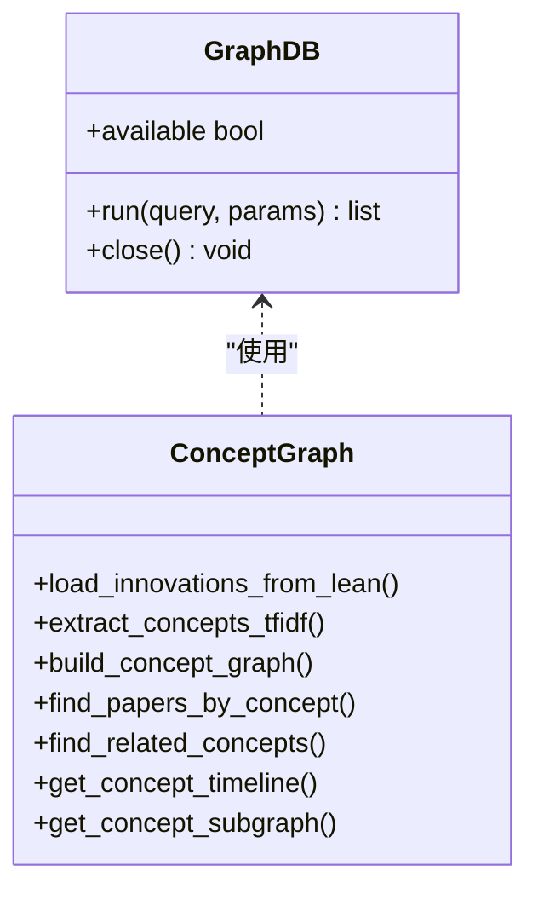
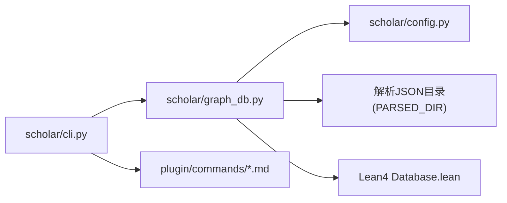

# 图数据库命令

<cite>
**本文档引用的文件**
- [cli.py](file://scholar/cli.py)
- [graph_db.py](file://scholar/graph_db.py)
- [config.py](file://scholar/config.py)
- [stats.md](file://plugin/commands/stats.md)
- [paper.md](file://plugin/commands/paper.md)
- [find.md](file://plugin/commands/find.md)
- [sync.md](file://plugin/commands/sync.md)
- [resume.md](file://plugin/commands/resume.md)
</cite>

## 目录
1. [简介](#简介)
2. [项目结构](#项目结构)
3. [核心组件](#核心组件)
4. [架构总览](#架构总览)
5. [详细组件分析](#详细组件分析)
6. [依赖关系分析](#依赖关系分析)
7. [性能考量](#性能考量)
8. [故障排查指南](#故障排查指南)
9. [结论](#结论)
10. [附录](#附录)

## 简介
本文件面向CLI图数据库命令，系统性介绍graph-build、graph-stats、graph-query等与Neo4j图数据库交互的命令，涵盖引文网络构建、概念图谱生成、图查询执行机制，并结合图数据结构、节点关系建模与查询优化策略，提供图分析方法与可视化技巧。读者可据此快速上手并深入理解Scholar Studio在学术知识图谱中的图数据库能力。

## 项目结构
围绕图数据库命令的相关模块分布如下：
- CLI入口与命令定义：scholar/cli.py
- Neo4j图数据库封装与图构建/查询逻辑：scholar/graph_db.py
- 系统配置（含Neo4j连接参数）：scholar/config.py
- 插件命令说明文档：plugin/commands/*.md

图表来源
- [cli.py:660-834](file://scholar/cli.py#L660-L834)
- [graph_db.py:1-120](file://scholar/graph_db.py#L1-L120)
- [config.py:51-55](file://scholar/config.py#L51-L55)

章节来源
- [cli.py:660-834](file://scholar/cli.py#L660-L834)
- [graph_db.py:1-120](file://scholar/graph_db.py#L1-L120)
- [config.py:51-55](file://scholar/config.py#L51-L55)

## 核心组件
- GraphDB类：封装Neo4j连接、Cypher执行与资源关闭，提供可用性检测。
- 引文网络构建：从解析后的JSON数据创建Paper节点与CITES边，支持批量写入与增量更新。
- 引文解析与对齐：将ref_key映射到Paper ULID，计算in/out度与桥接分数等中心性指标。
- 概念图谱构建：基于创新概念别名表匹配论文文本，建立Innovation节点、HAS_CONCEPT边与RELATED_TO共现边。
- Lean4替换关系同步：从Lean4数据库加载或回退硬编码规则，建立REPLACES边。
- 图统计与查询：提供节点/边计数、中心性排行、概念相关性查询等。

章节来源
- [graph_db.py:32-70](file://scholar/graph_db.py#L32-L70)
- [graph_db.py:225-281](file://scholar/graph_db.py#L225-L281)
- [graph_db.py:85-178](file://scholar/graph_db.py#L85-L178)
- [graph_db.py:180-223](file://scholar/graph_db.py#L180-L223)
- [graph_db.py:636-733](file://scholar/graph_db.py#L636-L733)
- [graph_db.py:794-839](file://scholar/graph_db.py#L794-L839)
- [graph_db.py:739-788](file://scholar/graph_db.py#L739-L788)

## 架构总览
下图展示了CLI命令与图数据库层的交互关系，以及三类图（引文网络、概念图谱、创新替换）在Neo4j中的统一布局。

图表来源
- [cli.py:660-834](file://scholar/cli.py#L660-L834)
- [graph_db.py:32-70](file://scholar/graph_db.py#L32-L70)
- [graph_db.py:225-281](file://scholar/graph_db.py#L225-L281)
- [graph_db.py:636-733](file://scholar/graph_db.py#L636-L733)
- [graph_db.py:794-839](file://scholar/graph_db.py#L794-L839)

## 详细组件分析

### graph-build：引文网络与概念图谱构建
该命令负责：
- 创建Paper节点与CITES边
- 将ref_key解析为Paper ULID，修正CITES边
- 计算中心性指标（in/out度、桥接分数）
- 构建概念图谱（Innovation节点、HAS_CONCEPT边、RELATED_TO边）
- 同步Lean4 REPLACES关系

图表来源
- [cli.py:660-706](file://scholar/cli.py#L660-L706)
- [graph_db.py:225-281](file://scholar/graph_db.py#L225-L281)
- [graph_db.py:85-178](file://scholar/graph_db.py#L85-L178)
- [graph_db.py:180-223](file://scholar/graph_db.py#L180-L223)
- [graph_db.py:636-733](file://scholar/graph_db.py#L636-L733)
- [graph_db.py:794-839](file://scholar/graph_db.py#L794-L839)

章节来源
- [cli.py:660-706](file://scholar/cli.py#L660-L706)
- [graph_db.py:225-281](file://scholar/graph_db.py#L225-L281)
- [graph_db.py:85-178](file://scholar/graph_db.py#L85-L178)
- [graph_db.py:180-223](file://scholar/graph_db.py#L180-L223)
- [graph_db.py:636-733](file://scholar/graph_db.py#L636-L733)
- [graph_db.py:794-839](file://scholar/graph_db.py#L794-L839)

### graph-stats：图统计与中心性分析
该命令用于：
- 统计Paper与Innovation节点数量
- 统计各类边的数量（CITES、HAS_CONCEPT、RELATED_TO、REPLACES）
- 分析已解析与未解析的CITES边比例
- 列出被引最多与桥接分数最高的Paper

图表来源
- [cli.py:710-791](file://scholar/cli.py#L710-L791)
- [graph_db.py:32-70](file://scholar/graph_db.py#L32-L70)

章节来源
- [cli.py:710-791](file://scholar/cli.py#L710-L791)
- [graph_db.py:32-70](file://scholar/graph_db.py#L32-L70)

### graph-query：概念图谱查询
该命令用于：
- 查询与指定概念相关的Paper列表
- 查询与该概念相关性强的概念集合
- 支持概念子图的节点与边提取

图表来源
- [cli.py:794-834](file://scholar/cli.py#L794-L834)
- [graph_db.py:739-788](file://scholar/graph_db.py#L739-L788)

章节来源
- [cli.py:794-834](file://scholar/cli.py#L794-L834)
- [graph_db.py:739-788](file://scholar/graph_db.py#L739-L788)

### 引文网络构建与解析
- 节点与边创建：从解析JSON批量创建Paper节点与CITES边，避免重复。
- ref_key解析：通过规范化标题进行精确与模糊匹配，将ref_key映射到真实ULID；重建CITES边并清理孤立节点。
- 中心性计算：设置in/out度与桥接分数，便于识别高影响力与跨领域桥梁Paper。

图表来源
- [graph_db.py:225-281](file://scholar/graph_db.py#L225-L281)
- [graph_db.py:85-178](file://scholar/graph_db.py#L85-L178)
- [graph_db.py:180-223](file://scholar/graph_db.py#L180-L223)

章节来源
- [graph_db.py:225-281](file://scholar/graph_db.py#L225-L281)
- [graph_db.py:85-178](file://scholar/graph_db.py#L85-L178)
- [graph_db.py:180-223](file://scholar/graph_db.py#L180-L223)

### 概念图谱构建与查询
- 创新节点：从Lean4动态加载或回退硬编码种子数据，创建Innovation节点。
- 概念匹配：基于标题/摘要/章节标题的别名表匹配，建立HAS_CONCEPT边。
- 共现关系：统计概念共现频次，构建RELATED_TO边并设置权重。
- 查询接口：按概念查找Paper、相关概念与时间线，支持子图抽取。

图表来源
- [graph_db.py:32-70](file://scholar/graph_db.py#L32-L70)
- [graph_db.py:371-440](file://scholar/graph_db.py#L371-L440)
- [graph_db.py:581-633](file://scholar/graph_db.py#L581-L633)
- [graph_db.py:636-733](file://scholar/graph_db.py#L636-L733)
- [graph_db.py:739-788](file://scholar/graph_db.py#L739-L788)

章节来源
- [graph_db.py:371-440](file://scholar/graph_db.py#L371-L440)
- [graph_db.py:581-633](file://scholar/graph_db.py#L581-L633)
- [graph_db.py:636-733](file://scholar/graph_db.py#L636-L733)
- [graph_db.py:739-788](file://scholar/graph_db.py#L739-L788)

### Lean4替换关系同步
- 动态加载：从Lean4 Database.lean中解析替换关系，若文件不存在则回退硬编码。
- 写入Neo4j：以REPLACES边连接创新概念，形成演进路径。

章节来源
- [graph_db.py:794-839](file://scholar/graph_db.py#L794-L839)

## 依赖关系分析
- CLI命令依赖图数据库封装：graph-build、graph-stats、graph-query均通过GraphDB访问Neo4j。
- GraphDB依赖配置模块：从环境变量读取Neo4j连接参数。
- 概念图谱依赖别名表与Lean4种子数据：动态加载或回退硬编码。
- 引文解析依赖解析JSON目录：构建ref_key→ULID映射。

图表来源
- [cli.py:660-834](file://scholar/cli.py#L660-L834)
- [graph_db.py:1-120](file://scholar/graph_db.py#L1-L120)
- [config.py:51-55](file://scholar/config.py#L51-L55)

章节来源
- [cli.py:660-834](file://scholar/cli.py#L660-L834)
- [graph_db.py:1-120](file://scholar/graph_db.py#L1-L120)
- [config.py:51-55](file://scholar/config.py#L51-L55)

## 性能考量
- 批量写入：节点与边创建采用UNWIND批处理，减少往返开销。
- 增量更新：提供upsert辅助函数，支持单篇Paper的节点与关系增量更新。
- 查询优化：
  - 使用索引字段（Paper.ulid、Innovation.id）进行匹配。
  - 限制返回数量（LIMIT），避免大规模排序导致的延迟。
  - 对高频查询（如Top被引/桥接Paper）可考虑预计算属性并持久化。
- 数据清洗：解析阶段对ref_key进行规范化与模糊匹配，降低解析失败率，减少后续重建边的代价。

章节来源
- [graph_db.py:249-262](file://scholar/graph_db.py#L249-L262)
- [graph_db.py:271-279](file://scholar/graph_db.py#L271-L279)
- [graph_db.py:156-168](file://scholar/graph_db.py#L156-L168)
- [graph_db.py:846-922](file://scholar/graph_db.py#L846-L922)

## 故障排查指南
- Neo4j不可用
  - 现象：graph-build/graph-stats/graph-query提示Neo4j不可用。
  - 处理：检查环境变量NEO4J_URI/USER/PASS是否正确；确认Neo4j服务运行。
- 引文解析失败
  - 现象：ref_key无法解析为ULID，CITES边未指向真实Paper。
  - 处理：确认解析JSON目录存在且包含有效Paper数据；检查ref_key与标题匹配逻辑。
- 概念匹配不准确
  - 现象：某些Paper未被标注概念或标注错误。
  - 处理：检查别名表覆盖范围；必要时扩展别名；确认Paper文本字段完整性。
- 查询结果为空
  - 现象：graph-query无Paper或相关概念。
  - 处理：确认graph-build已完成；检查概念ID拼写；确认HAS_CONCEPT/RELATED_TO边存在。

章节来源
- [cli.py:668-672](file://scholar/cli.py#L668-L672)
- [cli.py:716-719](file://scholar/cli.py#L716-L719)
- [cli.py:804-807](file://scholar/cli.py#L804-L807)
- [config.py:51-55](file://scholar/config.py#L51-L55)

## 结论
本文档系统梳理了Scholar Studio的图数据库命令与实现，重点覆盖引文网络与概念图谱的构建流程、Neo4j集成方式、查询接口与优化策略。通过graph-build、graph-stats、graph-query三大命令，用户可以高效地完成学术知识图谱的构建与分析工作。建议在生产环境中配合批量写入、增量更新与预计算策略，持续提升性能与稳定性。

## 附录
- 命令使用参考
  - graph-build：构建引文网络、解析ref_key、计算中心性、构建概念图谱、同步Lean4替换关系。
  - graph-stats：查看节点/边统计、解析率、Top被引与桥接Paper。
  - graph-query：按概念查询Paper与相关概念。
- 相关插件命令
  - 统计命令说明：[stats.md](file://plugin/commands/stats.md)
  - 论文命令说明：[paper.md](file://plugin/commands/paper.md)
  - 查找命令说明：[find.md](file://plugin/commands/find.md)
  - 同步命令说明：[sync.md](file://plugin/commands/sync.md)
  - 恢复命令说明：[resume.md](file://plugin/commands/resume.md)