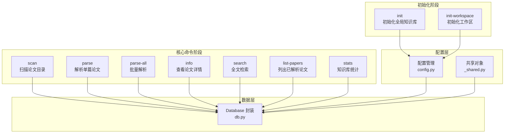
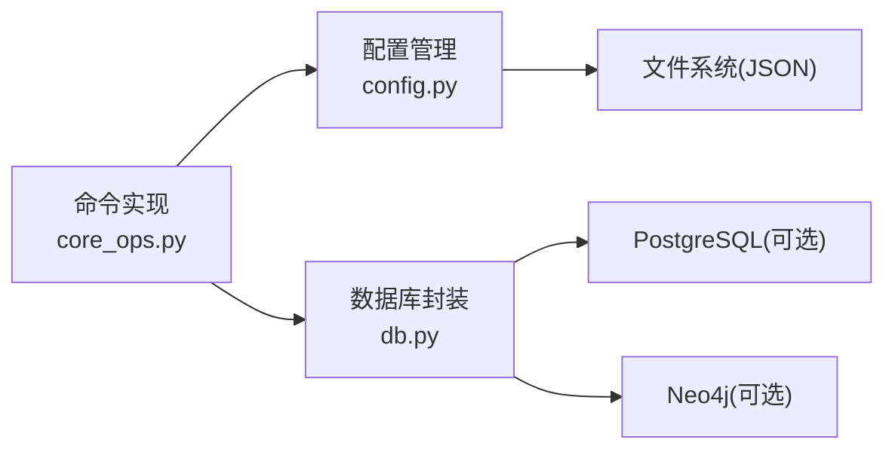

# 核心命令

<cite>
**本文档引用的文件**
- [cli.py](file://scholar/cli.py)
- [__main__.py](file://scholar/__main__.py)
- [_shared.py](file://scholar/_shared.py)
- [config.py](file://scholar/config.py)
- [core_ops.py](file://scholar/commands/core_ops.py)
- [db.py](file://scholar/db.py)
- [test_cli.py](file://test/test_cli.py)
- [paper.md](file://plugin/commands/paper.md)
- [find.md](file://plugin/commands/find.md)
- [stats.md](file://plugin/commands/stats.md)
- [sync.md](file://plugin/commands/sync.md)
- [health.md](file://plugin/commands/health.md)
</cite>

## 更新摘要
**变更内容**
- 新增 init-workspace 命令的详细说明和使用指导
- 更新了两阶段部署流程的架构说明
- 增强了工作流指导和最佳实践部分
- 更新了命令组合模式以支持新的部署架构

## 目录
1. [简介](#简介)
2. [项目结构](#项目结构)
3. [核心组件](#核心组件)
4. [架构总览](#架构总览)
5. [详细组件分析](#详细组件分析)
6. [依赖分析](#依赖分析)
7. [性能考虑](#性能考虑)
8. [故障排除指南](#故障排除指南)
9. [结论](#结论)
10. [附录](#附录)

## 简介
本文件聚焦于 Scholar Studio 的 CLI 核心命令，系统性地梳理 init、init-workspace、scan、parse、parse-all、info、search、list-papers、stats 等基础命令的功能、参数、输入输出、错误处理与性能特征，并给出命令组合、批量处理策略与最佳实践。这些命令围绕"初始化—工作区配置—论文目录扫描、TeX 解析、结构化入库、检索与浏览"这一两阶段部署流程展开，既可独立使用，也可串联形成端到端工作流。

## 项目结构
- CLI 入口通过模块入口调用命令实现，核心命令集中在 scholar/cli.py 中，命令按功能模块化分布在 commands/ 目录下。
- 核心命令 init 和 init-workspace 专门负责两阶段部署流程的初始化。
- 数据访问抽象封装在 scholar/db.py，配置管理在 scholar/config.py。
- 测试覆盖了命令的存在性与基本行为，确保 --help 与关键命令的返回码与输出符合预期。
- 插件文档提供了与核心命令配套的使用步骤与工作流参考。

```mermaid
graph TB
subgraph "CLI 层"
M["模块入口<br/>__main__.py"]
C["命令实现<br/>cli.py"]
CO["核心命令<br/>core_ops.py"]
end
subgraph "配置层"
CFG["配置管理<br/>config.py"]
SH["共享对象<br/>_shared.py"]
end
subgraph "数据层"
D["数据库封装<br/>db.py"]
end
subgraph "外部资源"
FS["文件系统<br/>PAPERS_DIR/*.json"]
PG["PostgreSQL(可选)"]
N4J["Neo4j(可选)"]
END
M --> C
C --> CO
CO --> CFG
CO --> SH
CO --> D
D --> PG
D --> N4J
D --> FS
```

**图表来源**
- [__main__.py:1-8](file://scholar/__main__.py#L1-L8)
- [cli.py:1-25](file://scholar/cli.py#L1-L25)
- [core_ops.py:1-438](file://scholar/commands/core_ops.py#L1-L438)
- [config.py:1-283](file://scholar/config.py#L1-L283)
- [_shared.py:1-40](file://scholar/_shared.py#L1-L40)
- [db.py:1-200](file://scholar/db.py#L1-L200)

**章节来源**
- [__main__.py:1-8](file://scholar/__main__.py#L1-L8)
- [cli.py:1-25](file://scholar/cli.py#L1-L25)
- [core_ops.py:1-438](file://scholar/commands/core_ops.py#L1-L438)
- [config.py:1-283](file://scholar/config.py#L1-L283)
- [_shared.py:1-40](file://scholar/_shared.py#L1-L40)
- [db.py:1-200](file://scholar/db.py#L1-L200)

## 核心组件
- 命令注册与入口
  - 使用 Typer 定义命令组，提供帮助与无参自动帮助。
  - 模块入口直接调用命令分发器，便于以 python -m scholar 方式运行。
  - 命令按功能模块化组织，核心命令集中在 core_ops.py。
- 配置管理与双层架构
  - 支持两种运行模式：开发模式（源码目录）和打包模式（~/.scholar-studio/）。
  - 实现双层目录结构：全局知识库（SCHOLAR_HOME）和工作区目录（WORKSPACE_DIR）。
  - 提供 init 和 init-workspace 两个初始化命令，分别负责全局和工作区的初始化。
- 数据访问抽象
  - 数据库类提供可用性探测、连接管理与事务上下文；当 PostgreSQL 不可用时回退至文件模式。
  - 提供解析数据的保存、加载、查询与全文检索接口。
- 可视化与交互
  - 使用 Rich 输出表格、面板与进度条，提升可观测性与可读性。

**章节来源**
- [cli.py:1-25](file://scholar/cli.py#L1-L25)
- [core_ops.py:1-438](file://scholar/commands/core_ops.py#L1-L438)
- [config.py:1-283](file://scholar/config.py#L1-L283)
- [_shared.py:1-40](file://scholar/_shared.py#L1-L40)
- [db.py:1-200](file://scholar/db.py#L1-L200)

## 架构总览
下图展示了核心命令在系统中的位置与依赖关系，重点体现了两阶段部署流程：



**图表来源**
- [core_ops.py:17-106](file://scholar/commands/core_ops.py#L17-L106)
- [core_ops.py:109-438](file://scholar/commands/core_ops.py#L109-L438)
- [config.py:116-206](file://scholar/config.py#L116-L206)
- [db.py:1-200](file://scholar/db.py#L1-L200)

## 详细组件分析

### 命令：init（初始化全局知识库）
- 功能概述
  - 初始化 Scholar Studio 全局知识库目录结构，创建必要的子目录和 .env.example 配置文件。
  - 支持开发模式和打包模式的不同根目录策略。
- 输入参数
  - 无参数。
- 输出
  - 控制台输出创建的目录列表和下一步操作指引。
  - 自动检测 PostgreSQL 和 Neo4j 服务连接状态。
- 错误处理
  - 目录创建失败会抛出异常并由上层捕获。
  - 数据库连接检测异常会输出警告信息。
- 性能特征
  - 文件系统操作，时间复杂度 O(1)。
- 使用示例
  - python -m scholar init

**章节来源**
- [core_ops.py:17-70](file://scholar/commands/core_ops.py#L17-L70)
- [config.py:116-177](file://scholar/config.py#L116-L177)

### 命令：init-workspace（初始化工作区）
- 功能概述
  - 将当前目录初始化为 Scholar Studio 工作区，创建 per-project 输出目录结构。
  - 采用双拷贝布局：共享知识库（parsed/）保留在 SCHOLAR_HOME，工作区特定输出（drafts/、notes/、logs/）在当前工作区。
- 输入参数
  - 无参数。
- 输出
  - 控制台输出创建的工作区目录结构和双拷贝布局说明。
  - 显示共享知识库和工作区的具体路径映射。
- 错误处理
  - 目录创建失败会抛出异常并由上层捕获。
- 性能特征
  - 文件系统操作，时间复杂度 O(1)。
- 使用示例
  - 在项目根目录执行：python -m scholar init-workspace

**章节来源**
- [core_ops.py:75-106](file://scholar/commands/core_ops.py#L75-L106)
- [config.py:180-206](file://scholar/config.py#L180-L206)

### 命令：scan（扫描论文目录）
- 功能概述
  - 遍历论文目录，统计每个论文的源码存在性、PDF 存在性与是否已解析，生成概览表与汇总面板。
  - 当论文总数超过阈值时，采用"前若干 + 省略号 + 后若干"的方式避免表格溢出。
- 输入参数
  - 无参数。
- 输出
  - 控制台表格：状态、ULID、是否存在源码、是否存在 PDF、是否已解析。
  - 汇总面板：总数、含源码数、含 PDF 数、已解析数。
- 错误处理
  - 目录遍历异常会静默跳过；表格渲染失败会抛出异常并由上层捕获。
- 性能特征
  - 时间复杂度 O(N)，N 为论文目录数量；表格截断减少渲染开销。
- 使用示例
  - python -m scholar scan

**章节来源**
- [core_ops.py:109-189](file://scholar/commands/core_ops.py#L109-L189)

### 命令：parse（解析单篇论文）
- 功能概述
  - 将指定论文的 TeX 源解析为结构化 JSON，保存到本地并尝试写入数据库（若可用）。
  - 输出包含标题、作者、年份、会议、小节数、公式数、引用数与输出路径。
- 输入参数
  - paper_id：论文标识（支持 ULID、arXiv、DOI、slug）。
- 输出
  - 成功：Rich 面板展示解析摘要与输出路径。
  - 失败：控制台错误提示并退出非零码。
- 错误处理
  - 论文目录不存在：提示并退出。
  - 解析异常：捕获异常并退出。
- 性能特征
  - I/O 密集；数据库写入为可选增强路径。
- 使用示例
  - python -m scholar parse <ULID|arXiv|DOI|slug>

**章节来源**
- [core_ops.py:191-254](file://scholar/commands/core_ops.py#L191-L254)

### 命令：parse-all（批量解析）
- 功能概述
  - 批量解析所有论文，支持限制数量与强制重新解析。
  - 显示进度条，聚合成功/失败计数与失败列表。
- 输入参数
  - --limit：最大解析数量（0 表示全部）。
  - --force：是否重新解析已解析论文。
- 输出
  - 进度条与描述文本；最终汇总面板；失败列表（最多展示前若干条）。
- 错误处理
  - 单个论文解析失败不影响整体流程，记录错误并继续。
- 性能特征
  - 并发度取决于解析实现；I/O 为主；数据库写入为可选增强路径。
- 使用示例
  - python -m scholar parse-all
  - python -m scholar parse-all --limit 100
  - python -m scholar parse-all --force

**章节来源**
- [core_ops.py:256-358](file://scholar/commands/core_ops.py#L256-L358)

### 命令：info（查看论文详情）
- 功能概述
  - 展示已解析论文的元信息、摘要、章节树、前若干公式与前若干引用。
- 输入参数
  - paper_id：论文标识（支持 ULID、arXiv、DOI、slug）。
- 输出
  - 元信息面板（标题、作者、年份、会议、TeX 文件数、主文件）。
  - 摘要面板（截断展示）。
  - 章节表格（编号、层级、标题、长度）。
  - 公式与引用列表（截断展示）。
- 错误处理
  - 若未解析：提示先执行 parse 并退出。
- 性能特征
  - 读取 JSON 文件，渲染富文本表格；时间复杂度与数据体量线性相关。
- 使用示例
  - python -m scholar info <ULID|arXiv|DOI|slug>

**章节来源**
- [core_ops.py:360-427](file://scholar/commands/core_ops.py#L360-L427)

### 命令：search（全文检索）
- 功能概述
  - 在已解析论文集合中进行全文检索（标题、摘要、章节内容），优先使用数据库查询，否则回退到文件模式。
- 输入参数
  - keyword：检索关键字。
  - --limit：最大结果数（默认 20）。
- 输出
  - 结果表格：Paper ID、标题、年份。
- 错误处理
  - 无结果：输出提示信息。
- 性能特征
  - 数据库模式：依赖索引与查询优化。
  - 文件模式：对每个论文加载 JSON 并扫描字段，时间复杂度近似 O(K×N)，K 为平均匹配成本，N 为论文数。
- 使用示例
  - python -m scholar search "transformer"

**章节来源**
- [core_ops.py:429-438](file://scholar/commands/core_ops.py#L429-L438)

### 命令：list-papers（列出已解析论文）
- 功能概述
  - 列出已解析论文的元信息与统计维度（小节数、公式数、引用数），支持按年份过滤与限制数量。
- 输入参数
  - --year：按年份过滤（可选）。
  - --limit：最大显示数量（默认 30）。
- 输出
  - 论文列表表格：Paper ID、标题、年份、会议、小节数、公式数、引用数。
- 错误处理
  - 数据库不可用时回退到文件模式。
- 性能特征
  - 数据库模式：O(N log N) 排序与分页。
  - 文件模式：加载所有 JSON 并排序，时间复杂度 O(N log N)。
- 使用示例
  - python -m scholar list-papers
  - python -m scholar list-papers --year 2024
  - python -m scholar list-papers --limit 50

**章节来源**
- [core_ops.py:109-189](file://scholar/commands/core_ops.py#L109-L189)

### 命令：stats（知识库统计）
- 功能概述
  - 统计论文目录、解析数量、总小节/公式/引用数以及元数据覆盖率，并展示按年份与会议的分布。
- 输入参数
  - 无参数。
- 输出
  - 统计面板：论文文件夹数、已解析数、总小节/公式/引用数、数据库状态、元数据覆盖率百分比。
  - 分组统计：按年份与会议的计数。
- 错误处理
  - 数据库不可用时标注为文件模式。
- 性能特征
  - 遍历已解析 JSON，时间复杂度 O(P)，P 为已解析论文数。
- 使用示例
  - python -m scholar stats

**章节来源**
- [core_ops.py:109-189](file://scholar/commands/core_ops.py#L109-L189)

## 依赖分析
- 命令与模块依赖
  - 所有核心命令均依赖数据库封装以实现可选的 PostgreSQL 写入与查询；当数据库不可用时，命令回退到文件模式。
  - init 和 init-workspace 命令依赖配置模块来确定目录结构和运行模式。
  - 命令层通过 Rich 进行 UI 渲染，Typer 进行参数解析。
- 外部依赖
  - PostgreSQL（psycopg2）：可选，用于高性能存储与查询。
  - Neo4j：可选，用于概念图谱和引用网络。
  - 文件系统：论文目录与解析 JSON 文件。



**图表来源**
- [core_ops.py:1-438](file://scholar/commands/core_ops.py#L1-L438)
- [config.py:1-283](file://scholar/config.py#L1-L283)
- [db.py:1-200](file://scholar/db.py#L1-L200)

**章节来源**
- [core_ops.py:1-438](file://scholar/commands/core_ops.py#L1-L438)
- [config.py:1-283](file://scholar/config.py#L1-L283)
- [db.py:1-200](file://scholar/db.py#L1-L200)

## 性能考虑
- I/O 优先：解析与检索主要受磁盘读写影响，建议将论文目录置于高速存储。
- 数据库可选增强：启用 PostgreSQL 可显著提升检索与列表查询性能，尤其在大规模论文库场景。
- 双层架构优势：init-workspace 的双拷贝布局减少了跨工作区的数据复制开销。
- 批量处理策略
  - parse-all 支持 --limit 与 --force，适合增量与重试场景。
  - search 与 list-papers 支持结果限制，避免大结果集渲染带来的 UI 卡顿。
- 可观测性
  - parse-all 使用进度条与描述文本，便于监控长任务进展。
  - stats 与 scan 提供覆盖率与汇总信息，辅助容量规划。

## 故障排除指南
- 常见问题与定位
  - 命令无法显示帮助：确认已安装依赖并正确使用 python -m scholar。
  - init/init-workspace 命令报错：检查目录权限、磁盘空间和 .env 配置。
  - parse/info/search 等命令报错：检查论文目录是否存在、JSON 是否有效、数据库连接是否可用。
  - 数据库不可用：命令会回退到文件模式；如需数据库能力，请检查连接配置与服务状态。
- 测试验证
  - 使用测试用例验证命令存在性与基本行为（例如 --help、stats 输出、scan 执行）。
- 建议操作
  - 对于 parse 失败的论文，先单独执行 parse 定位具体错误，再结合 parse-all 进行批量重试。
  - 使用 search 与 list-papers 验证解析结果是否入库成功。
  - 在大型项目中，建议先执行 init，再在每个工作区执行 init-workspace。

**章节来源**
- [test_cli.py:26-111](file://test/test_cli.py#L26-L111)
- [core_ops.py:17-106](file://scholar/commands/core_ops.py#L17-L106)

## 结论
核心命令围绕"两阶段部署—扫描—解析—入库—检索—浏览"构建了完整的论文知识库工作流。通过 init 和 init-workspace 的双层初始化机制，既能满足个人研究需求，也能支撑团队协作场景。通过可选的数据库增强与丰富的参数选项，既能满足日常使用，也能支撑规模化论文管理。建议在生产环境中启用 PostgreSQL，并结合批量与限制策略进行高效运维。

## 附录

### 两阶段部署流程与最佳实践
- 建议的两阶段部署流程
  - 第一阶段（全局初始化）：在用户主目录执行 `scholar init`，初始化全局知识库目录结构和配置文件。
  - 第二阶段（工作区初始化）：在每个项目目录执行 `scholar init-workspace`，创建项目特定的输出目录。
  - 验证流程：`scholar scan` → `scholar stats` → `scholar parse-all`。
- 双层架构优势
  - 共享知识库（SCHOLAR_HOME）：存储通用的解析结果和配置，避免重复解析。
  - 工作区目录（WORKSPACE_DIR）：存储项目特定的草稿、笔记和日志，便于版本控制。
- 批量处理策略
  - 小规模：一次性 parse-all。
  - 大规模：分批设置 --limit，结合 --force 进行重试；必要时清理失败项后再次执行。
- 最佳实践
  - 保持论文目录命名规范（ULID），便于解析与检索。
  - 定期执行 stats 与 scan，监控覆盖率与完整性。
  - 在数据库可用时优先使用数据库模式以获得更优性能。
  - 使用 .env 文件管理敏感配置，避免硬编码。

### 命令组合与工作流指导
- 基础工作流
  - 初始化：`scholar init` → `scholar init-workspace` → `scholar scan`
  - 批量入库：`scholar parse-all --limit N`（或 --force）→ 观察进度与失败列表
  - 质量与浏览：`scholar stats` → `scholar list-papers --year Y --limit L` → `scholar info <paper_id>`
  - 检索：`scholar search "<关键词>" --limit K`
- 高级工作流
  - 团队协作：在共享仓库中只保留 `parsed/` 目录，各成员在本地执行 `init-workspace` 创建自己的工作区。
  - 版本控制：将 `output/drafts/`、`output/notes/`、`output/logs/` 添加到版本控制系统，但排除 `output/parsed/`。
  - CI/CD 集成：在持续集成中缓存 `parsed/` 目录，加速后续构建过程。

### 参考插件文档
- 快速查看论文详情与引用网络
  - 参考：[paper.md](file://plugin/commands/paper.md)
- 在知识库中搜索论文（全文 + 语义）
  - 参考：[find.md](file://plugin/commands/find.md)
- 查看知识库状态（论文数量、图谱规模、RAG 覆盖率）
  - 参考：[stats.md](file://plugin/commands/stats.md)
- 研究方向同步（搜索 arXiv + 全流程入库）
  - 参考：[sync.md](file://plugin/commands/sync.md)
- 健康检查（数据完整性与修复建议）
  - 参考：[health.md](file://plugin/commands/health.md)