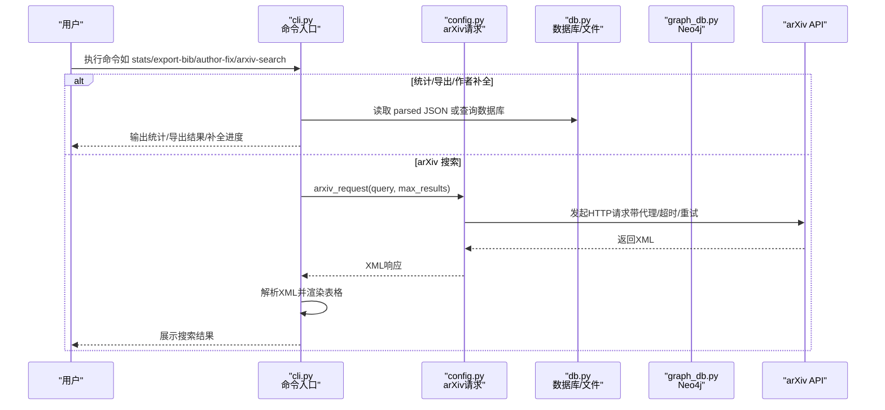
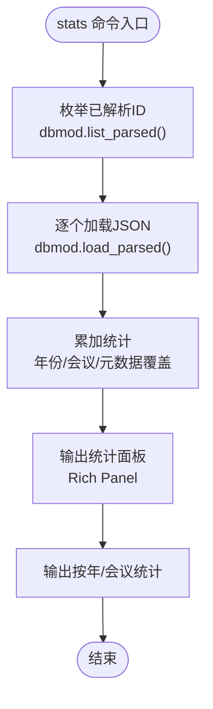
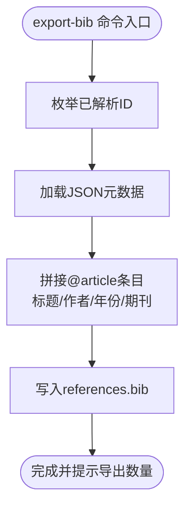
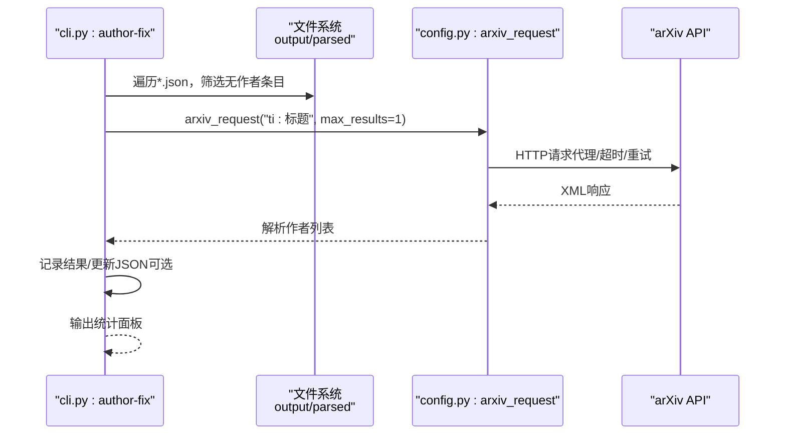
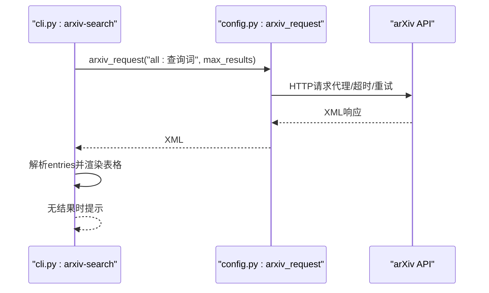
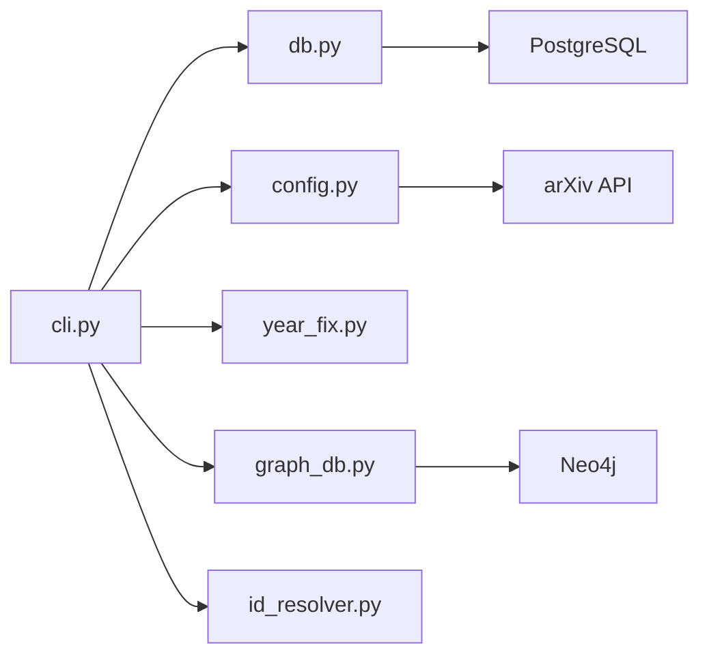

# 高级命令

<cite>
**本文档引用的文件**
- [cli.py](file://scholar/cli.py)
- [config.py](file://scholar/config.py)
- [db.py](file://scholar/db.py)
- [graph_db.py](file://scholar/graph_db.py)
- [year_fix.py](file://scholar/year_fix.py)
- [tex_parser.py](file://scholar/tex_parser.py)
- [id_resolver.py](file://scholar/id_resolver.py)
- [__main__.py](file://scholar/__main__.py)
- [CONNECTORS.md](file://plugin/CONNECTORS.md)
- [stats.md](file://plugin/commands/stats.md)
- [find.md](file://plugin/commands/find.md)
- [paper.md](file://plugin/commands/paper.md)
- [resume.md](file://plugin/commands/resume.md)
- [sync.md](file://plugin/commands/sync.md)
</cite>

## 目录
1. [简介](#简介)
2. [项目结构](#项目结构)
3. [核心组件](#核心组件)
4. [架构总览](#架构总览)
5. [详细组件分析](#详细组件分析)
6. [依赖分析](#依赖分析)
7. [性能考虑](#性能考虑)
8. [故障排除指南](#故障排除指南)
9. [结论](#结论)
10. [附录](#附录)

## 简介
本文件面向高级用户与维护者，系统性阐述 Scholar Studio 的 CLI 高级命令：stats、export-bib、author-fix、arxiv-search。内容覆盖实现原理、数据流、错误处理、性能优化与最佳实践，并提供复杂查询模式与 API 集成方法的参考路径。

## 项目结构
- CLI 命令入口位于 scholar/cli.py，通过 Typer 注册子命令。
- 数据访问与持久化封装在 scholar/db.py；可选图数据库 Neo4j 封装在 scholar/graph_db.py。
- 配置与外部服务集成在 scholar/config.py，包含 arXiv API 请求工具。
- 文献元数据解析在 scholar/tex_parser.py；ID 解析在 scholar/id_resolver.py。
- 年份与作者补全逻辑在 scholar/year_fix.py。
- 插件命令文档位于 plugin/commands/*.md，用于指导用户操作。

```mermaid
graph TB
subgraph "CLI 层"
CLI["cli.py<br/>Typer 子命令注册"]
MAIN["__main__.py<br/>入口"]
end
subgraph "业务层"
DB["db.py<br/>PostgreSQL 封装"]
GDB["graph_db.py<br/>Neo4j 图数据库封装"]
TEX["tex_parser.py<br/>TeX 解析"]
IDRES["id_resolver.py<br/>ID 解析"]
YFIX["year_fix.py<br/>年份/作者补全"]
CFG["config.py<br/>配置与arXiv请求"]
end
subgraph "外部服务"
PG["PostgreSQL"]
NEO["Neo4j"]
ARX["arXiv API"]
end
MAIN --> CLI
CLI --> DB
CLI --> GDB
CLI --> CFG
CLI --> TEX
CLI --> IDRES
CLI --> YFIX
DB <- --> PG
GDB <- --> NEO
CFG --> ARX
```

图表来源
- [cli.py:1-800](file://scholar/cli.py#L1-L800)
- [db.py:1-276](file://scholar/db.py#L1-L276)
- [graph_db.py:1-800](file://scholar/graph_db.py#L1-L800)
- [config.py:1-119](file://scholar/config.py#L1-L119)

章节来源
- [cli.py:1-800](file://scholar/cli.py#L1-L800)
- [__main__.py:1-8](file://scholar/__main__.py#L1-L8)

## 核心组件
- 统计命令 stats：聚合 parsed JSON 中的元数据，计算覆盖度与分布，支持数据库连接状态提示。
- BibTeX 导出 export-bib：遍历 parsed JSON，生成 .bib 条目并写入文件。
- 作者补全 author-fix：对缺失作者的条目进行 arXiv 标题搜索补全，支持 dry-run 与应用。
- arXiv 搜索 arxiv-search：基于 arXiv API 查询，解析 Atom XML，渲染结果表格。

章节来源
- [cli.py:420-524](file://scholar/cli.py#L420-L524)
- [cli.py:605-658](file://scholar/cli.py#L605-L658)

## 架构总览
下图展示高级命令的数据流与依赖关系，突出 CLI、数据库/文件系统、图数据库与外部 API 的交互。



图表来源
- [cli.py:420-524](file://scholar/cli.py#L420-L524)
- [cli.py:605-658](file://scholar/cli.py#L605-L658)
- [config.py:70-119](file://scholar/config.py#L70-L119)
- [db.py:244-276](file://scholar/db.py#L244-L276)

## 详细组件分析

### 统计命令 stats
- 功能概述
  - 从 data/papers 与 output/parsed 目录统计 parsed 数量、章节/公式/引用总数、年份与会议分布。
  - 计算元数据覆盖度（年份/作者/摘要/会议），并以面板形式输出。
- 数据来源与处理
  - 遍历 dbmod.list_parsed() 对应的 JSON 文件，读取字段并累加统计。
  - 若数据库可用，则使用数据库查询替代文件扫描（在其他命令中体现）。
- 输出结构
  - 总览面板：论文目录数、已解析数、总章节/公式/引用数、数据库状态、元数据覆盖百分比。
  - 分组统计：按年份与会议排序展示前若干项。
- 使用建议
  - 在大规模知识库中，优先启用数据库模式以提升统计效率。



图表来源
- [cli.py:420-487](file://scholar/cli.py#L420-L487)
- [db.py:271-276](file://scholar/db.py#L271-L276)

章节来源
- [cli.py:420-487](file://scholar/cli.py#L420-L487)
- [stats.md:1-10](file://plugin/commands/stats.md#L1-L10)

### BibTeX 导出 export-bib
- 功能概述
  - 遍历所有已解析论文，提取标题、作者、年份、会议，生成 @article 条目，写入 .bib 文件。
- 数据来源与处理
  - 从 dbmod.list_parsed() 与 dbmod.load_parsed() 获取元数据。
  - 采用 paper_id 作为 cite key，保证唯一性。
- 输出与位置
  - 默认输出至 output/bib/references.bib，父目录不存在时自动创建。
- 使用建议
  - 在批量导出前，确保 parsed JSON 已完整生成；必要时先执行 parse/parse-all。



图表来源
- [cli.py:492-524](file://scholar/cli.py#L492-L524)
- [db.py:248-268](file://scholar/db.py#L248-L268)

章节来源
- [cli.py:492-524](file://scholar/cli.py#L492-L524)

### 作者补全 author-fix
- 功能概述
  - 对缺失作者的条目，基于标题进行 arXiv API 标题搜索，回填作者列表。
  - 支持 --apply 应用更改，否则仅 dry-run 报告。
- 数据来源与处理
  - 从 output/parsed 目录扫描 JSON，过滤无作者条目。
  - 调用 config.arxiv_request 构造 ti: 查询，解析 Atom XML 提取作者。
  - 可选写回 JSON（dry-run 时跳过）。
- 限制与策略
  - 限制最大查询数量（limit），避免过度请求。
  - 仅对存在标题的条目查询，空标题跳过。
- 使用建议
  - 建议先 dry-run 观察结果，再决定是否 --apply。
  - 合理设置 limit，避免触发速率限制。



图表来源
- [cli.py:529-600](file://scholar/cli.py#L529-L600)
- [config.py:70-119](file://scholar/config.py#L70-L119)

章节来源
- [cli.py:529-600](file://scholar/cli.py#L529-L600)
- [year_fix.py:360-420](file://scholar/year_fix.py#L360-L420)

### arXiv 搜索 arxiv-search
- 功能概述
  - 在 arXiv 上执行全文搜索，解析 Atom XML，渲染标题、作者、年份、arXiv ID 表格。
- 数据来源与处理
  - 调用 config.arxiv_request("all:关键词", max_results)，解析 XML。
  - 提取标题、作者（最多3人）、年份、ID，构造表格。
- 错误处理
  - 请求失败时提示设置代理环境变量（HTTP_PROXY/HTTPS_PROXY）。
- 使用建议
  - 合理设置 --max 控制结果数量；在受限网络环境下配置代理。



图表来源
- [cli.py:605-658](file://scholar/cli.py#L605-L658)
- [config.py:70-119](file://scholar/config.py#L70-L119)

章节来源
- [cli.py:605-658](file://scholar/cli.py#L605-L658)

### 复杂查询模式与数据导出格式
- 复杂查询模式
  - arXiv 查询语法：支持 all:、ti:、au:、abs:、cat: 等组合查询；在代码中以 "all:关键词" 与 "ti:标题" 为例。
  - 数据库查询：在搜索与列表命令中使用 ILIKE 与 JOIN sections 实现跨表检索。
- 数据导出格式
  - BibTeX：@article 类型，字段包括 title、author、year、journal；cite key 使用 paper_id。
  - 统计输出：Rich Panel + 表格，包含覆盖率与分布。
- API 集成方法
  - arXiv API：统一请求封装，支持代理、超时、重试与 User-Agent 设置。
  - PostgreSQL/Neo4j：通过连接参数与驱动库进行访问；不可用时降级为文件模式。

章节来源
- [cli.py:309-370](file://scholar/cli.py#L309-L370)
- [cli.py:375-416](file://scholar/cli.py#L375-L416)
- [cli.py:492-524](file://scholar/cli.py#L492-L524)
- [config.py:70-119](file://scholar/config.py#L70-L119)
- [db.py:206-222](file://scholar/db.py#L206-L222)

## 依赖分析
- 组件耦合
  - CLI 命令依赖 db.py 与 config.py；部分命令（如 author-fix）依赖 year_fix.py。
  - 图数据库功能独立于 CLI 主流程，仅在 graph-* 命令中使用 graph_db.py。
- 外部依赖
  - PostgreSQL/Neo4j：可选依赖，通过环境变量配置；不可用时退化为文件模式。
  - arXiv API：标准库 urllib 实现请求，支持代理与重试。
- 循环依赖
  - 未发现循环导入；模块间通过函数调用解耦。



图表来源
- [cli.py:1-800](file://scholar/cli.py#L1-L800)
- [db.py:1-276](file://scholar/db.py#L1-L276)
- [graph_db.py:1-800](file://scholar/graph_db.py#L1-L800)
- [config.py:1-119](file://scholar/config.py#L1-L119)

章节来源
- [CONNECTORS.md:1-45](file://plugin/CONNECTORS.md#L1-L45)

## 性能考虑
- 批量统计与导出
  - 对于大量 parsed JSON，建议启用数据库模式以减少文件 IO；在 stats 命令中已体现数据库可用性检测。
- arXiv 请求
  - 使用指数回退与超时控制，避免阻塞；合理设置 limit 与 --max，避免触发速率限制。
- 图数据库
  - Neo4j 查询与批处理需注意节点/边数量；建议在生产环境中开启索引与事务批处理。
- I/O 与缓存
  - ID 解析器具备内存缓存，首次加载后复用；建议在高频查询场景保持缓存有效性。

## 故障排除指南
- arXiv 请求失败
  - 现象：提示请求失败并建议设置代理。
  - 处理：配置 HTTP_PROXY/HTTPS_PROXY 环境变量；检查网络连通性与超时设置。
- 数据库不可用
  - 现象：stats 输出数据库状态为不可用（file-only mode）。
  - 处理：确认 PostgreSQL 连接参数与服务状态；或仅使用文件模式。
- Neo4j 不可用
  - 现象：graph-build/graph-stats 提示 Neo4j 不可用。
  - 处理：启动 Neo4j 容器或安装驱动；或跳过图谱相关命令。
- 作者补全无结果
  - 现象：dry-run 报告填充数量为 0。
  - 处理：检查标题完整性与 arXiv 可检索性；适当提高 limit。

章节来源
- [cli.py:612-626](file://scholar/cli.py#L612-L626)
- [cli.py:669-672](file://scholar/cli.py#L669-L672)
- [CONNECTORS.md:16-25](file://plugin/CONNECTORS.md#L16-L25)

## 结论
本文档系统梳理了 stats、export-bib、author-fix、arxiv-search 四个高级命令的实现原理、数据流与使用方法。通过合理的查询模式、导出格式与 API 集成策略，结合性能优化与故障排除建议，可在大规模学术知识库管理中高效运行。

## 附录
- 相关命令文档
  - [stats.md](file://plugin/commands/stats.md)
  - [find.md](file://plugin/commands/find.md)
  - [paper.md](file://plugin/commands/paper.md)
  - [resume.md](file://plugin/commands/resume.md)
  - [sync.md](file://plugin/commands/sync.md)
- 外部服务依赖
  - [CONNECTORS.md](file://plugin/CONNECTORS.md)