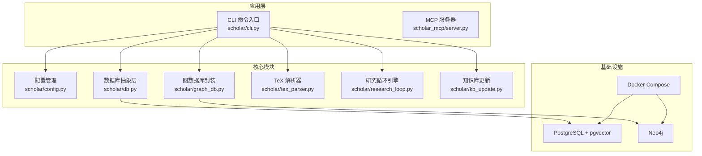
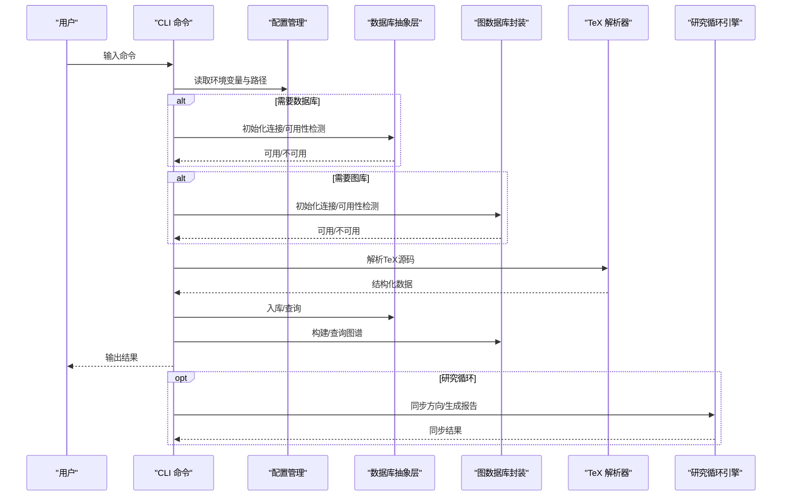
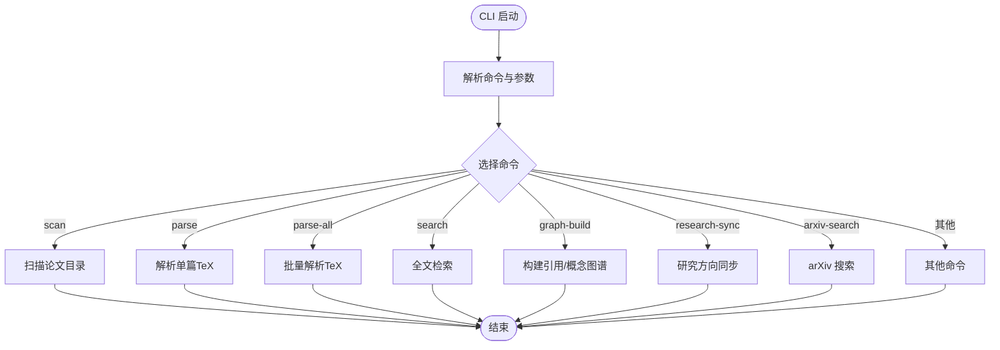
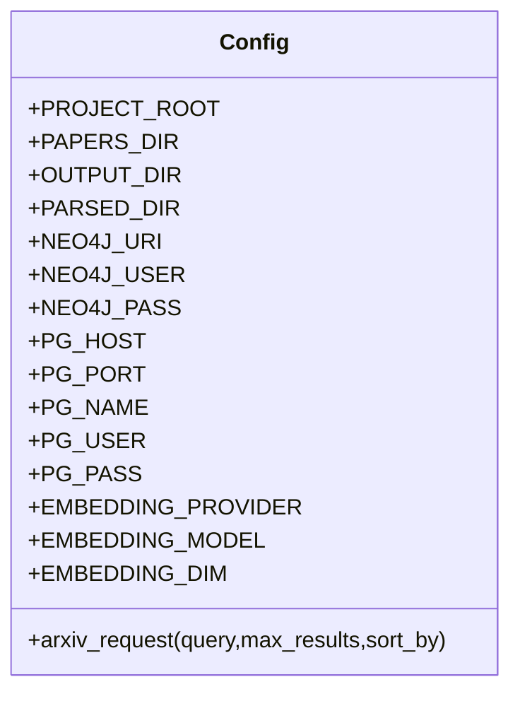
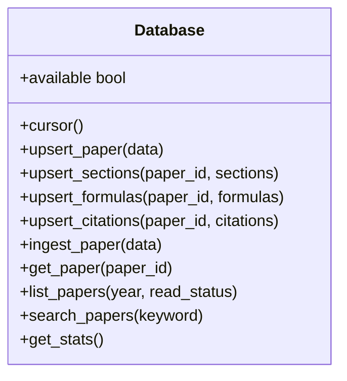
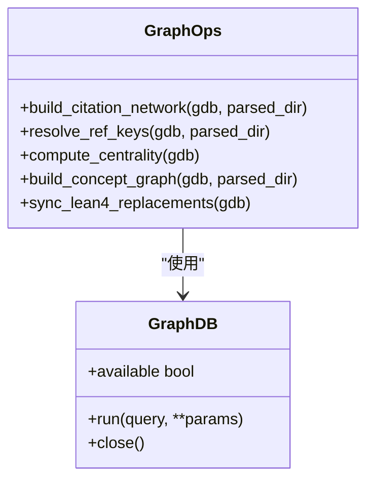
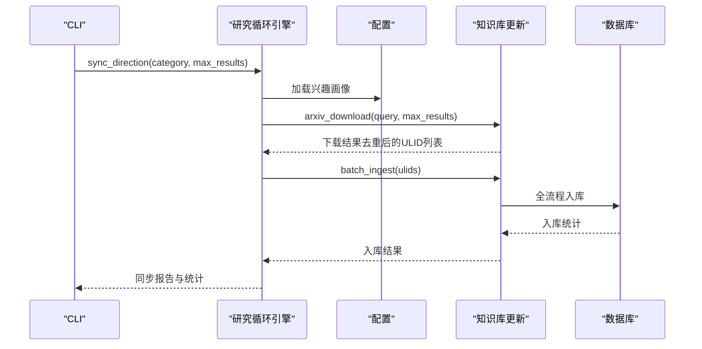
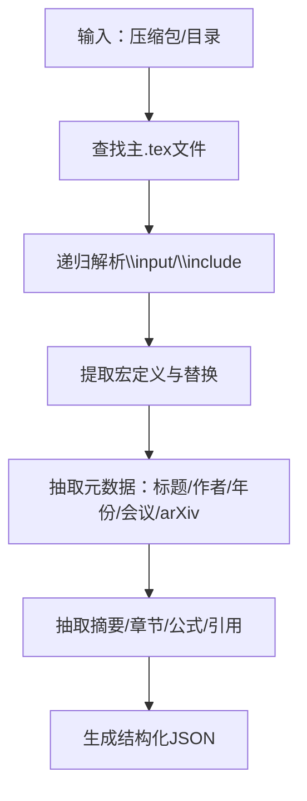
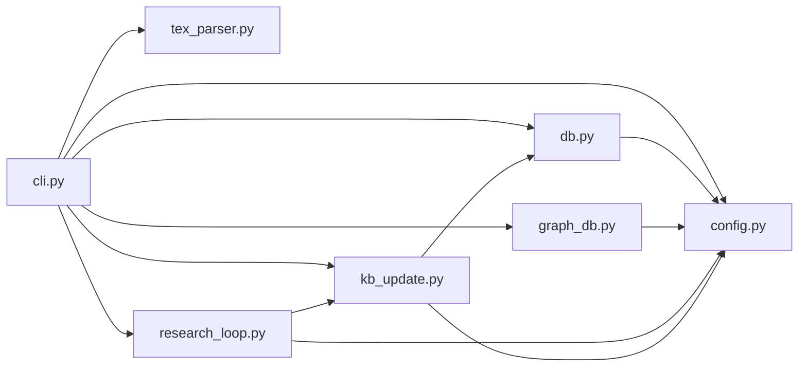

# Python后端系统

<cite>
**本文档引用的文件**
- [__main__.py](file://scholar/__main__.py)
- [cli.py](file://scholar/cli.py)
- [config.py](file://scholar/config.py)
- [db.py](file://scholar/db.py)
- [graph_db.py](file://scholar/graph_db.py)
- [research_loop.py](file://scholar/research_loop.py)
- [tex_parser.py](file://scholar/tex_parser.py)
- [kb_update.py](file://scholar/kb_update.py)
- [requirements.txt](file://requirements.txt)
- [docker-compose.yml](file://infra/docker-compose.yml)
- [README.md](file://plugin/README.md)
- [test_cli.py](file://test/test_cli.py)
</cite>

## 目录
1. [简介](#简介)
2. [项目结构](#项目结构)
3. [核心组件](#核心组件)
4. [架构总览](#架构总览)
5. [详细组件分析](#详细组件分析)
6. [依赖关系分析](#依赖关系分析)
7. [性能考量](#性能考量)
8. [故障排查指南](#故障排查指南)
9. [结论](#结论)
10. [附录](#附录)

## 简介
本项目是一个面向学术研究的Python后端系统，提供命令行接口（CLI）、配置管理、数据库抽象层、图数据库连接以及自适应研究循环引擎。系统通过CLI统一调度解析、入库、检索、图谱构建与维护、兴趣驱动的知识库同步等功能，并以PostgreSQL（pgvector）与Neo4j作为核心数据存储与图计算平台。系统设计强调可扩展性、容错与渐进式功能启用（如数据库与图库不可用时的文件模式回退）。

## 项目结构
- scholar/：核心Python包，包含CLI入口、配置、数据库抽象、图数据库封装、研究循环、TeX解析器、知识库更新等模块
- infra/：Docker Compose配置，启动PostgreSQL（pgvector）与Neo4j服务
- plugin/：插件说明文档，描述与外部Agent协作的边界与职责
- test/：CLI集成测试，覆盖命令可用性、输出与错误处理
- requirements.txt：Python依赖清单
- 其他脚本与配置文件用于启动与初始化

图表来源
- [cli.py](file://scholar/cli.py)
- [config.py](file://scholar/config.py)
- [db.py](file://scholar/db.py)
- [graph_db.py](file://scholar/graph_db.py)
- [tex_parser.py](file://scholar/tex_parser.py)
- [research_loop.py](file://scholar/research_loop.py)
- [kb_update.py](file://scholar/kb_update.py)
- [docker-compose.yml](file://infra/docker-compose.yml)

章节来源
- [__main__.py](file://scholar/__main__.py)
- [cli.py](file://scholar/cli.py)
- [config.py](file://scholar/config.py)
- [db.py](file://scholar/db.py)
- [graph_db.py](file://scholar/graph_db.py)
- [tex_parser.py](file://scholar/tex_parser.py)
- [research_loop.py](file://scholar/research_loop.py)
- [kb_update.py](file://scholar/kb_update.py)
- [docker-compose.yml](file://infra/docker-compose.yml)

## 核心组件
- CLI命令行接口：基于Typer构建，提供扫描、解析、查询、统计、导出、arXiv搜索、图谱构建与统计、兴趣管理与研究同步等命令；支持Rich输出与进度条。
- 配置管理系统：集中管理环境变量与项目路径，支持dotenv加载、目录创建、arXiv请求工具与嵌入模型参数。
- 数据库抽象层：封装psycopg2，提供文件模式回退；支持论文、章节、公式、引用的增删改查与全文检索。
- 图数据库封装：封装neo4j驱动，提供连接可用性检测、Cypher执行、引用网络与概念图构建与查询。
- 研究循环引擎：基于对话日志的兴趣画像管理、方向级同步、批量下载与入库、报告生成。
- TeX解析器：从压缩包或目录解析LaTeX源码，抽取标题、作者、年份、会议、arXiv ID、摘要、章节、公式、引用等结构化数据。
- 知识库更新：从arXiv批量下载TeX/PDF、生成ULID目录、去重、入库。

章节来源
- [cli.py](file://scholar/cli.py)
- [config.py](file://scholar/config.py)
- [db.py](file://scholar/db.py)
- [graph_db.py](file://scholar/graph_db.py)
- [research_loop.py](file://scholar/research_loop.py)
- [tex_parser.py](file://scholar/tex_parser.py)
- [kb_update.py](file://scholar/kb_update.py)

## 架构总览
系统采用“CLI统一入口 + 模块化核心 + 可选数据库/图库”的架构：
- CLI负责用户交互与工作流编排
- 核心模块独立封装业务逻辑与数据访问
- 数据库与图库为可选增强，不可用时进入文件模式回退
- Docker Compose提供PostgreSQL与Neo4j的容器化服务

图表来源
- [cli.py](file://scholar/cli.py)
- [config.py](file://scholar/config.py)
- [db.py](file://scholar/db.py)
- [graph_db.py](file://scholar/graph_db.py)
- [tex_parser.py](file://scholar/tex_parser.py)
- [research_loop.py](file://scholar/research_loop.py)

## 详细组件分析

### CLI命令行接口
- 设计理念：以Typer构建命令树，统一帮助信息与参数校验；Rich提供表格、面板、进度条等可视化输出。
- 关键命令：
  - 扫描与解析：scan、parse、parse-all、info、search、list-papers、stats、export-bib
  - arXiv：arxiv-search、author-fix
  - 图谱：graph-build、graph-stats、graph-query
  - 研究循环：interests（增删查）、research-sync（单方向/全方向）
- 错误处理：对不可用数据库/图库进行优雅降级；对异常捕获并提示用户；对不存在的论文ID给出明确提示。

图表来源
- [cli.py](file://scholar/cli.py)

章节来源
- [cli.py](file://scholar/cli.py)

### 配置管理系统
- 环境变量加载：优先使用dotenv加载根目录.env；若缺失则回退至os.environ
- 目录结构：统一管理数据与输出目录，确保首次运行时自动创建
- 数据库与图库连接：通过环境变量注入PostgreSQL与Neo4j连接参数
- arXiv请求工具：封装请求、代理、重试、超时策略，支持排序与最大结果数
- 嵌入模型参数：支持指定提供商、模型与维度，便于后续RAG向量化检索

图表来源
- [config.py](file://scholar/config.py)

章节来源
- [config.py](file://scholar/config.py)

### 数据库抽象层（PostgreSQL + pgvector）
- 设计目标：在数据库可用时提供结构化存储与全文检索；不可用时回退到JSON文件模式
- 主要能力：
  - 论文：upsert_paper、get_paper、list_papers、search_papers
  - 章节：upsert_sections
  - 公式：upsert_formulas
  - 引用：upsert_citations
  - 文件模式：save_parsed、load_parsed、list_parsed
- 连接管理：惰性连接、可用性探测、上下文事务控制

图表来源
- [db.py](file://scholar/db.py)

章节来源
- [db.py](file://scholar/db.py)

### 图数据库封装（Neo4j）
- 设计目标：统一图数据库连接、Cypher执行与图谱构建/查询
- 主要能力：
  - 连接：GraphDB类封装driver与session
  - 引用网络：build_citation_network、resolve_ref_keys、compute_centrality、查询接口
  - 概念图：build_concept_graph（TF-IDF别名匹配）、查询接口
  - Lean4同步：sync_lean4_replacements
  - 统计与查询：graph-stats、graph-query等

图表来源
- [graph_db.py](file://scholar/graph_db.py)

章节来源
- [graph_db.py](file://scholar/graph_db.py)

### 研究循环引擎
- 兴趣管理：加载/保存兴趣画像，支持去重与历史记录
- 日志分析：识别未分析周日志，原子化标记完成
- 方向级同步：对指定方向执行arXiv搜索→下载→入库→生成报告
- 全局同步：遍历所有方向执行同步

图表来源
- [research_loop.py](file://scholar/research_loop.py)
- [kb_update.py](file://scholar/kb_update.py)
- [db.py](file://scholar/db.py)

章节来源
- [research_loop.py](file://scholar/research_loop.py)
- [kb_update.py](file://scholar/kb_update.py)

### TeX解析器
- 功能：从压缩包或目录解析LaTeX源码，抽取标题、作者、年份、会议、arXiv ID、摘要、章节、公式、引用等
- 特性：宏展开、输入文件递归解析、格式化命令清洗、数学环境识别、引用提取、会议识别等
- 输出：结构化JSON，包含paper_id、title、authors、year、venue、arxiv_id、abstract、sections、formulas、citations、tex_file_count、main_tex_file等字段

图表来源
- [tex_parser.py](file://scholar/tex_parser.py)

章节来源
- [tex_parser.py](file://scholar/tex_parser.py)

### 知识库更新（arXiv下载与入库）
- arXiv下载：搜索→去重→下载TeX/PDF→生成ULID目录→写入初始元数据
- 批量入库：调用TeX解析器→入库（数据库或文件模式）
- 错误处理：下载失败清理目录、元数据写入失败清理产物、跨关键词去重

章节来源
- [kb_update.py](file://scholar/kb_update.py)

## 依赖关系分析
- CLI依赖配置、数据库、图库、TeX解析器、研究循环与知识库更新模块
- 数据库抽象层依赖psycopg2与配置参数
- 图数据库封装依赖neo4j驱动与配置参数
- 研究循环依赖配置与知识库更新
- 知识库更新依赖配置、数据库与arXiv API

图表来源
- [cli.py](file://scholar/cli.py)
- [config.py](file://scholar/config.py)
- [db.py](file://scholar/db.py)
- [graph_db.py](file://scholar/graph_db.py)
- [research_loop.py](file://scholar/research_loop.py)
- [kb_update.py](file://scholar/kb_update.py)

章节来源
- [cli.py](file://scholar/cli.py)
- [config.py](file://scholar/config.py)
- [db.py](file://scholar/db.py)
- [graph_db.py](file://scholar/graph_db.py)
- [research_loop.py](file://scholar/research_loop.py)
- [kb_update.py](file://scholar/kb_update.py)

## 性能考量
- 数据库层
  - 使用ON CONFLICT DO UPDATE减少重复插入开销
  - 批量写入（UNWIND）提升Neo4j写入效率
  - 事务控制与连接池化（psycopg2）降低连接成本
- 图谱层
  - 引用网络与概念图构建采用MERGE避免重复节点/边
  - 中心性计算与最短路径查询前先建立索引（建议在数据库初始化脚本中）
- 解析层
  - TeX解析器采用多轮宏替换与正则匹配，注意复杂度控制；对大型输入文件建议分阶段处理
- 研究循环
  - arXiv下载内置速率限制与重试，避免触发限流
  - 兴趣同步按方向聚合，跨关键词去重减少重复下载

## 故障排查指南
- 数据库不可用
  - 现象：命令提示数据库不可用，切换文件模式
  - 处理：确认PostgreSQL服务运行、连接参数正确；必要时回退到文件模式
- 图库不可用
  - 现象：图谱相关命令报错
  - 处理：确认Neo4j服务运行、认证正确；必要时关闭连接句柄
- arXiv请求失败
  - 现象：arXiv搜索/下载失败
  - 处理：检查代理设置、超时与重试参数；确认网络可达
- CLI命令异常
  - 现象：命令崩溃或输出异常
  - 处理：查看测试用例与错误处理分支；确保输入参数合法

章节来源
- [cli.py](file://scholar/cli.py)
- [config.py](file://scholar/config.py)
- [db.py](file://scholar/db.py)
- [graph_db.py](file://scholar/graph_db.py)
- [test_cli.py](file://test/test_cli.py)

## 结论
本系统通过清晰的模块划分与可选数据库/图库增强，实现了从TeX解析、结构化入库、全文检索、图谱构建到自适应研究循环的完整链路。CLI提供统一入口与良好用户体验，配置管理与依赖清单保证了部署一致性。建议在生产环境中结合Docker Compose快速搭建数据库与图库服务，并根据数据规模调整批处理与索引策略。

## 附录
- 环境变量与默认值
  - PostgreSQL：主机、端口、数据库名、用户名、密码
  - Neo4j：URI、用户名、密码
  - 嵌入模型：提供商、模型、维度、API密钥
  - LaTeX编译：命令
  - Lean4项目目录：指向LEAN目录
- 目录结构
  - data/papers：论文源码与产物
  - output：解析、笔记、草稿、参考文献、实验、数据集、PDF、摘要、日志等输出
- Docker Compose
  - PostgreSQL（pgvector）：端口映射、初始化SQL、健康检查
  - Neo4j：端口映射、认证、插件、内存参数、健康检查

章节来源
- [config.py](file://scholar/config.py)
- [docker-compose.yml](file://infra/docker-compose.yml)
- [requirements.txt](file://requirements.txt)
- [README.md](file://plugin/README.md)