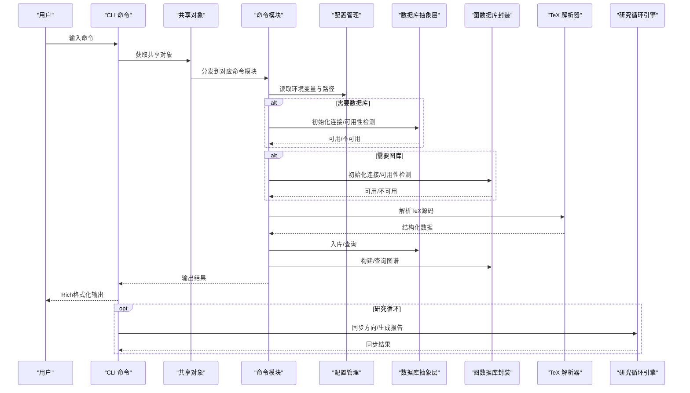
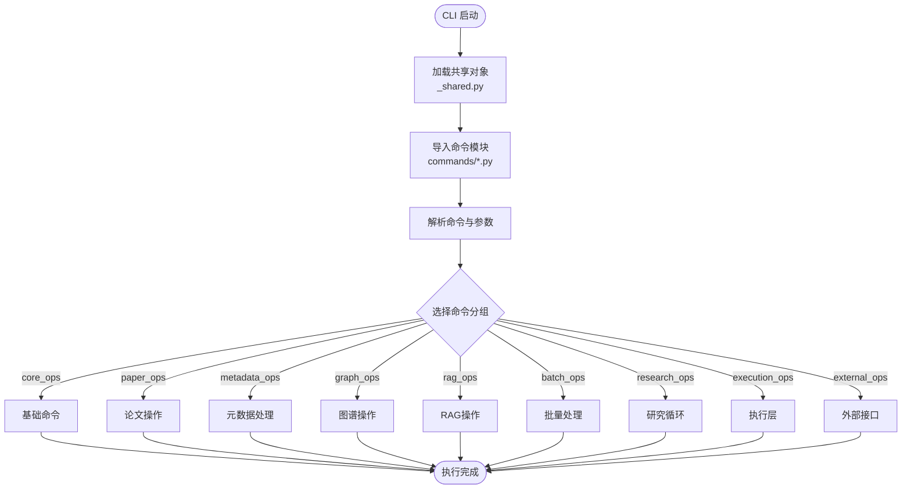
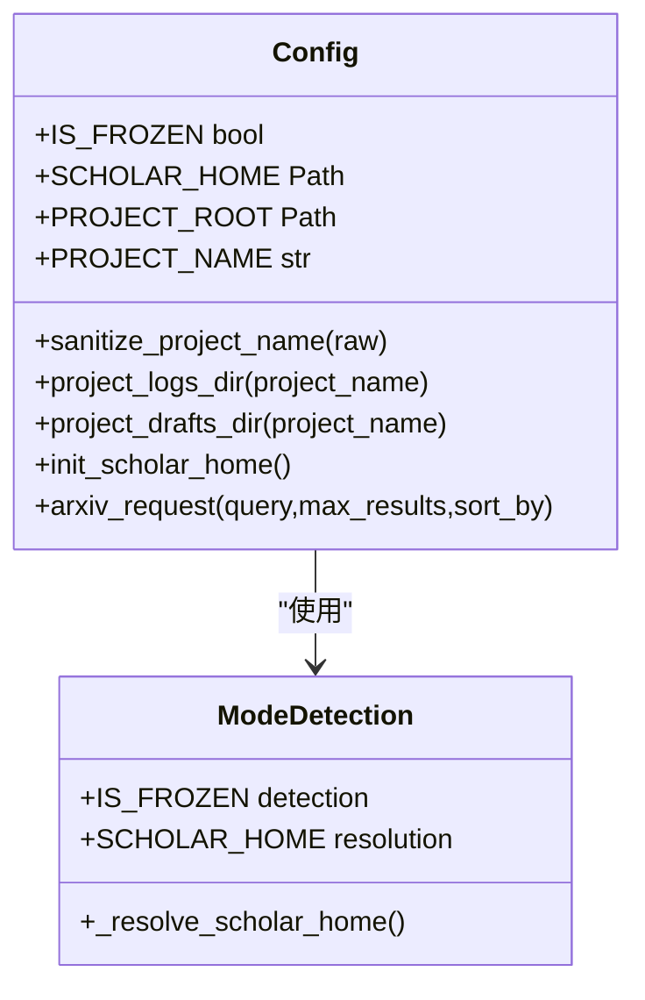
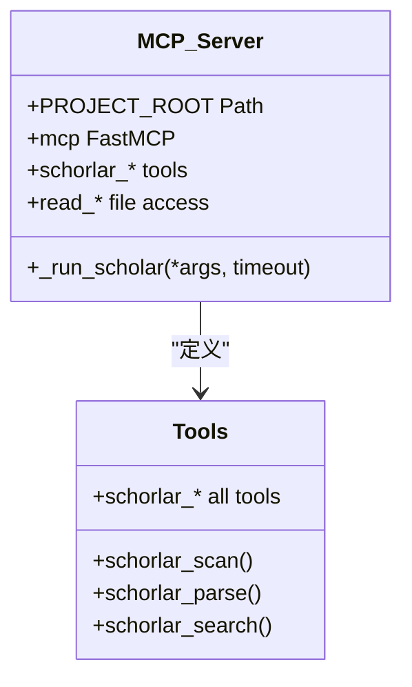
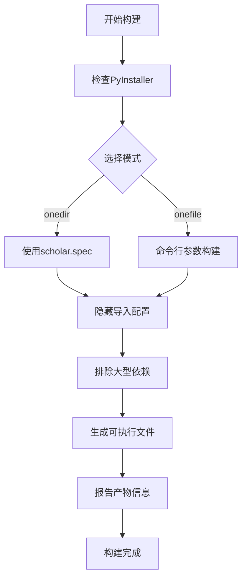
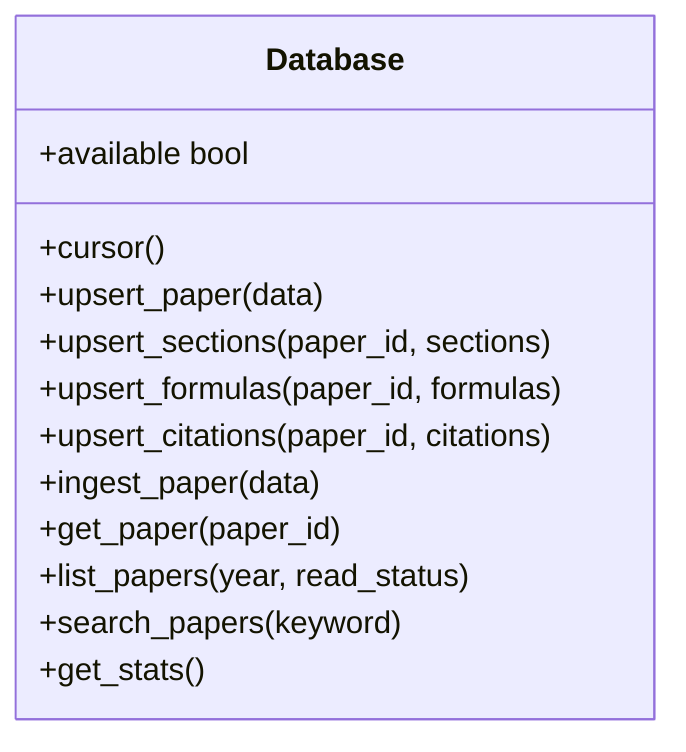
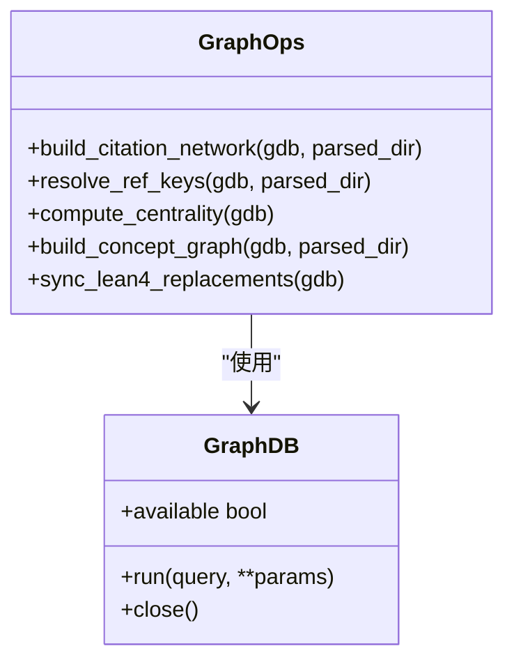
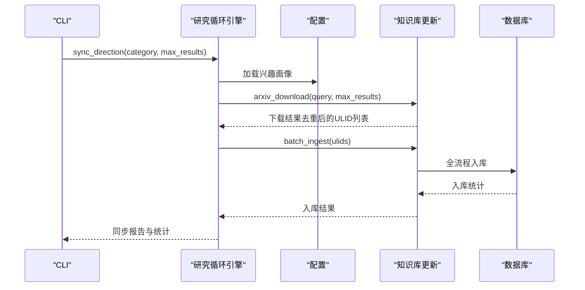
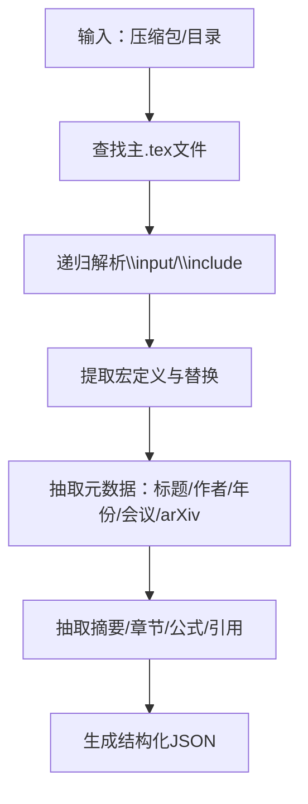
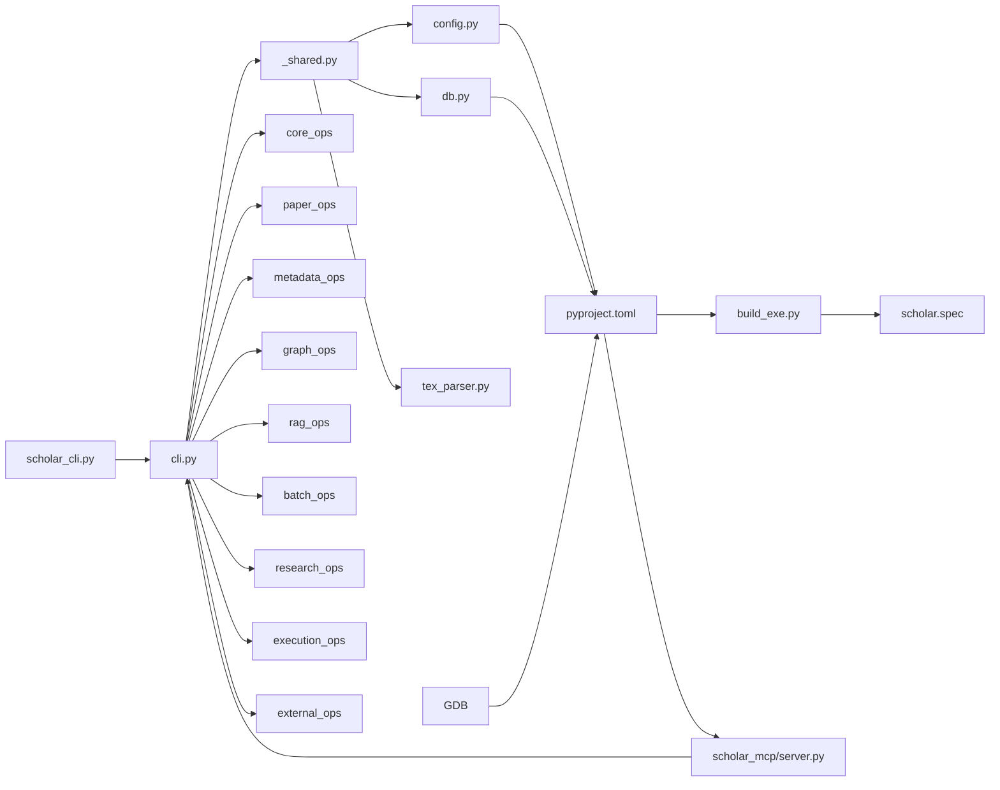

# Python后端系统

<cite>
**本文档引用的文件**
- [__main__.py](file://scholar/__main__.py)
- [cli.py](file://scholar/cli.py)
- [_shared.py](file://scholar/_shared.py)
- [config.py](file://scholar/config.py)
- [db.py](file://scholar/db.py)
- [graph_db.py](file://scholar/graph_db.py)
- [research_loop.py](file://scholar/research_loop.py)
- [tex_parser.py](file://scholar/tex_parser.py)
- [kb_update.py](file://scholar/kb_update.py)
- [server.py](file://scholar_mcp/server.py)
- [pyproject.toml](file://pyproject.toml)
- [build_exe.py](file://build_exe.py)
- [scholar.spec](file://scholar.spec)
- [scholar_cli.py](file://scholar_cli.py)
- [requirements.txt](file://requirements.txt)
- [docker-compose.yml](file://infra/docker-compose.yml)
- [README.md](file://plugin/README.md)
- [test_cli.py](file://test/test_cli.py)
</cite>

## 更新摘要
**所做更改**
- 更新CLI模块化架构部分，反映命令模块化组织结构
- 新增配置系统改进章节，包括打包模式支持和项目隔离
- 新增打包支持章节，详细说明PyInstaller构建流程
- 新增MCP服务器项目隔离增强章节
- 更新架构总览图，反映新的模块化结构
- 更新依赖关系分析，体现新的包结构

## 目录
1. [简介](#简介)
2. [项目结构](#项目结构)
3. [核心组件](#核心组件)
4. [架构总览](#架构总览)
5. [详细组件分析](#详细组件分析)
6. [依赖关系分析](#依赖关系分析)
7. [性能考量](#性能考量)
8. [故障排查指南](#故障排查指南)
9. [结论](#结论)
10. [附录](#附录)

## 简介
本项目是一个面向学术研究的Python后端系统，提供命令行接口（CLI）、配置管理、数据库抽象层、图数据库连接以及自适应研究循环引擎。系统通过CLI统一调度解析、入库、检索、图谱构建与维护、兴趣驱动的知识库同步等功能，并以PostgreSQL（pgvector）与Neo4j作为核心数据存储与图计算平台。系统设计强调可扩展性、容错与渐进式功能启用（如数据库与图库不可用时的文件模式回退）。

**更新** 系统已完成重大重构，实现了CLI模块化、配置系统改进、打包支持和MCP服务器项目隔离增强。

## 项目结构
- scholar/：核心Python包，包含CLI入口、共享对象、配置、数据库抽象、图数据库封装、研究循环、TeX解析器、知识库更新等模块
- scholar_mcp/：MCP服务器包，提供Qoder IDE集成的MCP工具
- infra/：Docker Compose配置，启动PostgreSQL（pgvector）与Neo4j服务
- plugin/：插件说明文档，描述与外部Agent协作的边界与职责
- test/：CLI集成测试，覆盖命令可用性、输出与错误处理
- build/：构建脚本，支持PyInstaller打包
- 其他脚本与配置文件用于启动与初始化

```mermaid
graph TB
subgraph "应用层"
CLI["CLI 命令入口<br/>scholar/cli.py"]
MCP["MCP 服务器<br/>scholar_mcp/server.py"]
ENTRY["独立CLI入口<br/>scholar_cli.py"]
END
subgraph "核心模块"
SHARED["_shared.py<br/>共享对象"]
CFG["配置管理<br/>scholar/config.py"]
DB["数据库抽象层<br/>scholar/db.py"]
GDB["图数据库封装<br/>scholar/graph_db.py"]
TEX["TeX 解析器<br/>scholar/tex_parser.py"]
RL["研究循环引擎<br/>scholar/research_loop.py"]
KB["知识库更新<br/>scholar/kb_update.py"]
END
subgraph "命令模块"
CORE["core_ops<br/>基础命令"]
PAPER["paper_ops<br/>论文操作"]
META["metadata_ops<br/>元数据处理"]
GRAPH["graph_ops<br/>图谱操作"]
RAG["rag_ops<br/>RAG操作"]
BATCH["batch_ops<br/>批量处理"]
RESEARCH["research_ops<br/>研究循环"]
EXECUTION["execution_ops<br/>执行层"]
EXTERNAL["external_ops<br/>外部接口"]
END
subgraph "基础设施"
PG["PostgreSQL + pgvector"]
NEO["Neo4j"]
DC["Docker Compose"]
BUILD["PyInstaller 构建"]
END
CLI --> SHARED
CLI --> CORE
CLI --> PAPER
CLI --> META
CLI --> GRAPH
CLI --> RAG
CLI --> BATCH
CLI --> RESEARCH
CLI --> EXECUTION
CLI --> EXTERNAL
SHARED --> CFG
SHARED --> DB
SHARED --> TEX
MCP --> CLI
ENTRY --> CLI
DB --> PG
GDB --> NEO
BUILD --> ENTRY
DC --> PG
DC --> NEO
```

**图表来源**
- [cli.py](file://scholar/cli.py)
- [_shared.py](file://scholar/_shared.py)
- [config.py](file://scholar/config.py)
- [db.py](file://scholar/db.py)
- [graph_db.py](file://scholar/graph_db.py)
- [tex_parser.py](file://scholar/tex_parser.py)
- [research_loop.py](file://scholar/research_loop.py)
- [kb_update.py](file://scholar/kb_update.py)
- [server.py](file://scholar_mcp/server.py)
- [scholar_cli.py](file://scholar_cli.py)
- [build_exe.py](file://build_exe.py)
- [scholar.spec](file://scholar.spec)
- [docker-compose.yml](file://infra/docker-compose.yml)

**章节来源**
- [__main__.py](file://scholar/__main__.py)
- [cli.py](file://scholar/cli.py)
- [_shared.py](file://scholar/_shared.py)
- [config.py](file://scholar/config.py)
- [db.py](file://scholar/db.py)
- [graph_db.py](file://scholar/graph_db.py)
- [tex_parser.py](file://scholar/tex_parser.py)
- [research_loop.py](file://scholar/research_loop.py)
- [kb_update.py](file://scholar/kb_update.py)
- [server.py](file://scholar_mcp/server.py)
- [scholar_cli.py](file://scholar_cli.py)
- [build_exe.py](file://build_exe.py)
- [scholar.spec](file://scholar.spec)
- [docker-compose.yml](file://infra/docker-compose.yml)

## 核心组件
- CLI命令行接口：基于Typer构建，实现模块化命令组织，提供扫描、解析、查询、统计、导出、arXiv搜索、图谱构建与统计、兴趣管理与研究同步等命令；支持Rich输出与进度条。
- 配置管理系统：集中管理环境变量与项目路径，支持dotenv加载、目录创建、arXiv请求工具与嵌入模型参数，新增打包模式支持和项目隔离功能。
- 数据库抽象层：封装psycopg2，提供文件模式回退；支持论文、章节、公式、引用的增删改查与全文检索。
- 图数据库封装：封装neo4j驱动，提供连接可用性检测、Cypher执行、引用网络与概念图构建与查询。
- 研究循环引擎：基于对话日志的兴趣画像管理、方向级同步、批量下载与入库、报告生成。
- TeX解析器：从压缩包或目录解析LaTeX源码，抽取标题、作者、年份、会议、arXiv ID、摘要、章节、公式、引用等结构化数据。
- 知识库更新：从arXiv批量下载TeX/PDF、生成ULID目录、去重、入库。
- MCP服务器：提供Qoder IDE集成的MCP工具，通过子进程调用scholar CLI实现IDE内联功能。
- 打包支持：PyInstaller构建脚本，支持onedir和onefile两种打包模式。

**更新** 新增MCP服务器和打包支持组件，实现IDE集成和跨平台部署。

**章节来源**
- [cli.py](file://scholar/cli.py)
- [_shared.py](file://scholar/_shared.py)
- [config.py](file://scholar/config.py)
- [db.py](file://scholar/db.py)
- [graph_db.py](file://scholar/graph_db.py)
- [research_loop.py](file://scholar/research_loop.py)
- [tex_parser.py](file://scholar/tex_parser.py)
- [kb_update.py](file://scholar/kb_update.py)
- [server.py](file://scholar_mcp/server.py)
- [build_exe.py](file://build_exe.py)

## 架构总览
系统采用"CLI统一入口 + 模块化核心 + 可选数据库/图库"的架构，现已实现完全模块化：
- CLI负责用户交互与工作流编排，通过_shared.py提供共享对象
- 核心模块独立封装业务逻辑与数据访问
- 命令模块化组织，每个功能组独立管理
- 数据库与图库为可选增强，不可用时进入文件模式回退
- Docker Compose提供PostgreSQL与Neo4j的容器化服务
- MCP服务器提供IDE集成支持
- PyInstaller支持跨平台打包部署

**更新** 架构已完全模块化，新增MCP服务器和打包支持。



**图表来源**
- [cli.py](file://scholar/cli.py)
- [_shared.py](file://scholar/_shared.py)
- [config.py](file://scholar/config.py)
- [db.py](file://scholar/db.py)
- [graph_db.py](file://scholar/graph_db.py)
- [tex_parser.py](file://scholar/tex_parser.py)
- [research_loop.py](file://scholar/research_loop.py)

## 详细组件分析

### CLI模块化架构
- 设计理念：采用模块化命令组织，通过_shared.py提供共享对象，命令按功能分组导入
- 共享对象：Typer应用实例、Rich控制台、TeX解析器、数据库连接助手
- 命令分组：
  - core_ops：基础命令（init、scan、info、search、list-papers、stats）
  - paper_ops：论文操作（parse、parse-all、ingest、export-bib）
  - metadata_ops：元数据处理（year-fix、author-fix、venue-fix、metadata-enrich）
  - graph_ops：图谱操作（graph-build、graph-stats、graph-query、cite-network、cite-resolve）
  - rag_ops：RAG操作（rag-index、rag-search）
  - batch_ops：批量处理（auto-notes、quality-score、classify、bootstrap、batch-ingest、kb-update）
  - research_ops：研究循环（interests、research-sync、survey、landscape）
  - execution_ops：执行层（compile-paper、exp-*、dataset-download）
  - external_ops：外部接口（arxiv-search、arxiv-download）

**更新** 完全模块化重构，命令按功能分组组织，提高可维护性和扩展性。



**图表来源**
- [cli.py](file://scholar/cli.py)
- [_shared.py](file://scholar/_shared.py)

**章节来源**
- [cli.py](file://scholar/cli.py)
- [_shared.py](file://scholar/_shared.py)

### 配置系统改进
- 运行模式检测：支持开发模式和打包模式自动切换
- 打包模式支持：PyInstaller打包时使用全局目录`~/.scholar-studio/`
- 项目隔离：支持多项目并存，通过项目名称隔离输出目录
- 环境变量管理：优先使用dotenv加载，支持多个.env文件加载
- 目录结构：统一管理数据与输出目录，支持项目特定的输出目录
- 初始化功能：自动创建目录结构和.env.example文件

**更新** 新增打包模式支持和项目隔离功能，增强部署灵活性。



**图表来源**
- [config.py](file://scholar/config.py)

**章节来源**
- [config.py](file://scholar/config.py)

### MCP服务器项目隔离增强
- 独立项目根目录：MCP服务器使用父目录作为项目根，确保与主应用隔离
- 子进程调用：通过subprocess调用scholar CLI，保持功能一致性
- 工具函数：提供445+个MCP工具，覆盖所有CLI命令
- IDE集成：为Qoder IDE提供原生MCP支持
- 文件访问：直接读取项目文件系统，提供文件内容访问

**更新** 新增MCP服务器模块，实现IDE深度集成和项目隔离。



**图表来源**
- [server.py](file://scholar_mcp/server.py)

**章节来源**
- [server.py](file://scholar_mcp/server.py)

### 打包支持
- PyInstaller构建：支持onedir和onefile两种打包模式
- 自动依赖收集：自动收集scholar包所有子模块依赖
- 隐藏导入：手动添加PyInstaller遗漏的第三方库
- 构建脚本：提供build_exe.py简化构建过程
- SPEC文件：scholar.spec定义详细的构建配置
- 独立入口：scholar_cli.py提供独立的可执行入口点

**更新** 新增完整的打包支持，实现跨平台部署。



**图表来源**
- [build_exe.py](file://build_exe.py)
- [scholar.spec](file://scholar.spec)
- [scholar_cli.py](file://scholar_cli.py)

**章节来源**
- [build_exe.py](file://build_exe.py)
- [scholar.spec](file://scholar.spec)
- [scholar_cli.py](file://scholar_cli.py)

### 数据库抽象层（PostgreSQL + pgvector）
- 设计目标：在数据库可用时提供结构化存储与全文检索；不可用时回退到JSON文件模式
- 主要能力：
  - 论文：upsert_paper、get_paper、list_papers、search_papers
  - 章节：upsert_sections
  - 公式：upsert_formulas
  - 引用：upsert_citations
  - 文件模式：save_parsed、load_parsed、list_parsed
- 连接管理：惰性连接、可用性探测、上下文事务控制



**图表来源**
- [db.py](file://scholar/db.py)

**章节来源**
- [db.py](file://scholar/db.py)

### 图数据库封装（Neo4j）
- 设计目标：统一图数据库连接、Cypher执行与图谱构建/查询
- 主要能力：
  - 连接：GraphDB类封装driver与session
  - 引用网络：build_citation_network、resolve_ref_keys、compute_centrality、查询接口
  - 概念图：build_concept_graph（TF-IDF别名匹配）、查询接口
  - Lean4同步：sync_lean4_replacements
  - 统计与查询：graph-stats、graph-query等



**图表来源**
- [graph_db.py](file://scholar/graph_db.py)

**章节来源**
- [graph_db.py](file://scholar/graph_db.py)

### 研究循环引擎
- 兴趣管理：加载/保存兴趣画像，支持去重与历史记录
- 日志分析：识别未分析周日志，原子化标记完成
- 方向级同步：对指定方向执行arXiv搜索→下载→入库→生成报告
- 全局同步：遍历所有方向执行同步



**图表来源**
- [research_loop.py](file://scholar/research_loop.py)
- [kb_update.py](file://scholar/kb_update.py)
- [db.py](file://scholar/db.py)

**章节来源**
- [research_loop.py](file://scholar/research_loop.py)
- [kb_update.py](file://scholar/kb_update.py)

### TeX解析器
- 功能：从压缩包或目录解析LaTeX源码，抽取标题、作者、年份、会议、arXiv ID、摘要、章节、公式、引用等
- 特性：宏展开、输入文件递归解析、格式化命令清洗、数学环境识别、引用提取、会议识别等
- 输出：结构化JSON，包含paper_id、title、authors、year、venue、arxiv_id、abstract、sections、formulas、citations、tex_file_count、main_tex_file等字段



**图表来源**
- [tex_parser.py](file://scholar/tex_parser.py)

**章节来源**
- [tex_parser.py](file://scholar/tex_parser.py)

### 知识库更新（arXiv下载与入库）
- arXiv下载：搜索→去重→下载TeX/PDF→生成ULID目录→写入初始元数据
- 批量入库：调用TeX解析器→入库（数据库或文件模式）
- 错误处理：下载失败清理目录、元数据写入失败清理产物、跨关键词去重

**章节来源**
- [kb_update.py](file://scholar/kb_update.py)

## 依赖关系分析
- CLI模块化：cli.py通过_shared.py提供共享对象，命令模块按功能分组导入
- 配置系统：config.py支持打包模式和项目隔离，提供初始化功能
- MCP服务器：server.py独立于主应用，通过子进程调用scholar CLI
- 打包支持：build_exe.py和scholar.spec管理PyInstaller构建流程
- 核心模块：数据库、图库、TeX解析器、研究循环等模块相互独立
- 依赖管理：pyproject.toml定义项目依赖和可选依赖

**更新** 依赖关系已完全模块化，新增MCP服务器和打包支持依赖。



**图表来源**
- [cli.py](file://scholar/cli.py)
- [_shared.py](file://scholar/_shared.py)
- [config.py](file://scholar/config.py)
- [db.py](file://scholar/db.py)
- [graph_db.py](file://scholar/graph_db.py)
- [server.py](file://scholar_mcp/server.py)
- [scholar_cli.py](file://scholar_cli.py)
- [build_exe.py](file://build_exe.py)
- [scholar.spec](file://scholar.spec)
- [pyproject.toml](file://pyproject.toml)

**章节来源**
- [cli.py](file://scholar/cli.py)
- [_shared.py](file://scholar/_shared.py)
- [config.py](file://scholar/config.py)
- [db.py](file://scholar/db.py)
- [graph_db.py](file://scholar/graph_db.py)
- [server.py](file://scholar_mcp/server.py)
- [scholar_cli.py](file://scholar_cli.py)
- [build_exe.py](file://build_exe.py)
- [scholar.spec](file://scholar.spec)
- [pyproject.toml](file://pyproject.toml)

## 性能考量
- 数据库层
  - 使用ON CONFLICT DO UPDATE减少重复插入开销
  - 批量写入（UNWIND）提升Neo4j写入效率
  - 事务控制与连接池化（psycopg2）降低连接成本
- 图谱层
  - 引用网络与概念图构建采用MERGE避免重复节点/边
  - 中心性计算与最短路径查询前先建立索引（建议在数据库初始化脚本中）
- 解析层
  - TeX解析器采用多轮宏替换与正则匹配，注意复杂度控制；对大型输入文件建议分阶段处理
- 研究循环
  - arXiv下载内置速率限制与重试，避免触发限流
  - 兴趣同步按方向聚合，跨关键词去重减少重复下载
- 打包优化
  - PyInstaller排除大型依赖，减小包体积
  - onedir模式提供更快启动速度
  - 隐藏导入确保所有依赖被正确打包

**更新** 新增打包性能优化考量。

## 故障排查指南
- 数据库不可用
  - 现象：命令提示数据库不可用，切换文件模式
  - 处理：确认PostgreSQL服务运行、连接参数正确；必要时回退到文件模式
- 图库不可用
  - 现象：图谱相关命令报错
  - 处理：确认Neo4j服务运行、认证正确；必要时关闭连接句柄
- arXiv请求失败
  - 现象：arXiv搜索/下载失败
  - 处理：检查代理设置、超时与重试参数；确认网络可达
- CLI命令异常
  - 现象：命令崩溃或输出异常
  - 处理：查看测试用例与错误处理分支；确保输入参数合法
- 打包问题
  - 现象：构建失败或运行时错误
  - 处理：检查PyInstaller版本，确认隐藏导入配置，验证SPEC文件
- MCP集成问题
  - 现象：IDE中MCP工具不可用
  - 处理：确认MCP服务器运行，检查子进程调用权限，验证项目路径

**更新** 新增打包和MCP集成故障排查指南。

**章节来源**
- [cli.py](file://scholar/cli.py)
- [config.py](file://scholar/config.py)
- [db.py](file://scholar/db.py)
- [graph_db.py](file://scholar/graph_db.py)
- [test_cli.py](file://test/test_cli.py)
- [build_exe.py](file://build_exe.py)
- [server.py](file://scholar_mcp/server.py)

## 结论
本系统通过清晰的模块划分与可选数据库/图库增强，实现了从TeX解析、结构化入库、全文检索、图谱构建到自适应研究循环的完整链路。CLI提供统一入口与良好用户体验，配置管理与依赖清单保证了部署一致性。**更新** 重大重构后，系统现已实现完全模块化、打包支持和MCP服务器集成，显著提升了可维护性、部署灵活性和IDE集成能力。建议在生产环境中结合Docker Compose快速搭建数据库与图库服务，并根据数据规模调整批处理与索引策略。

## 附录
- 环境变量与默认值
  - PostgreSQL：主机、端口、数据库名、用户名、密码
  - Neo4j：URI、用户名、密码
  - 嵌入模型：提供商、模型、维度、API密钥
  - LaTeX编译：命令
  - Lean4项目目录：指向LEAN目录
  - 打包模式：SCHOLAR_HOME环境变量覆盖默认路径
- 目录结构
  - data/papers：论文源码与产物
  - output：解析、笔记、草稿、参考文献、实验、数据集、PDF、摘要、日志等输出
  - ~/.scholar-studio/：打包模式下的全局知识库目录
- Docker Compose
  - PostgreSQL（pgvector）：端口映射、初始化SQL、健康检查
  - Neo4j：端口映射、认证、插件、内存参数、健康检查
- 打包配置
  - PyInstaller：支持onedir和onefile两种模式
  - 隐藏导入：确保所有依赖被正确打包
  - SPEC文件：定义详细的构建配置
- MCP服务器
  - IDE集成：为Qoder IDE提供原生MCP支持
  - 工具数量：445+个MCP工具覆盖所有CLI功能
  - 项目隔离：独立项目根目录确保与主应用分离

**章节来源**
- [config.py](file://scholar/config.py)
- [docker-compose.yml](file://infra/docker-compose.yml)
- [requirements.txt](file://requirements.txt)
- [README.md](file://plugin/README.md)
- [pyproject.toml](file://pyproject.toml)
- [build_exe.py](file://build_exe.py)
- [scholar.spec](file://scholar.spec)
- [server.py](file://scholar_mcp/server.py)