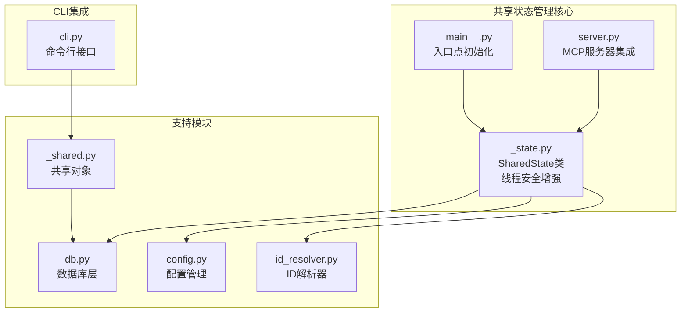
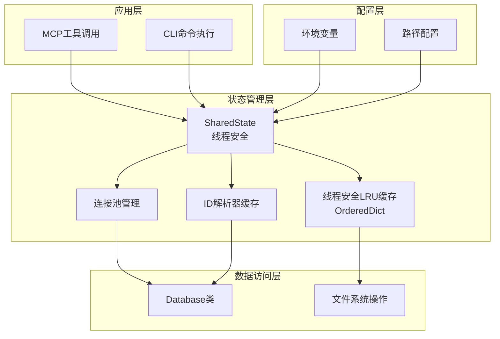
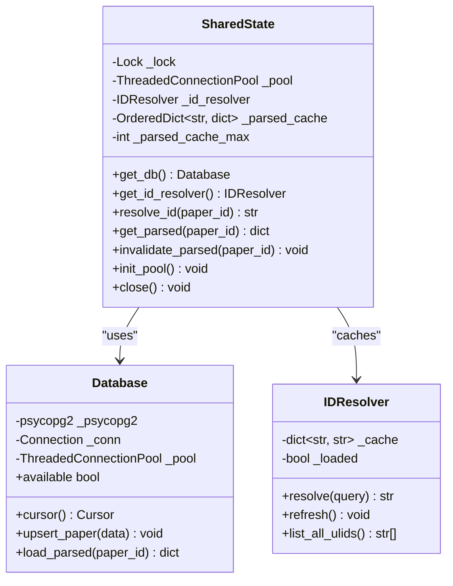
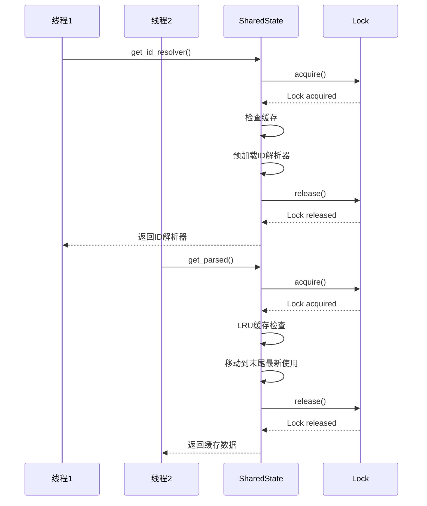
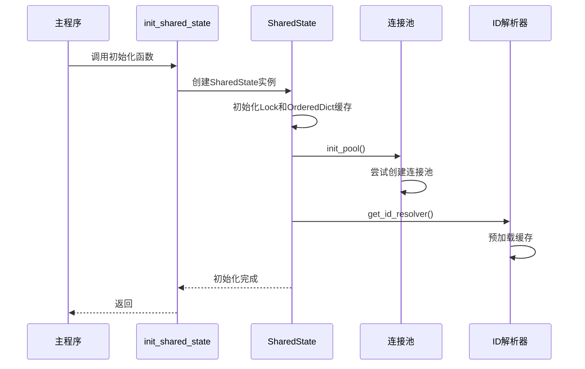
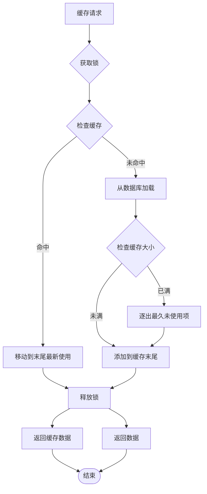
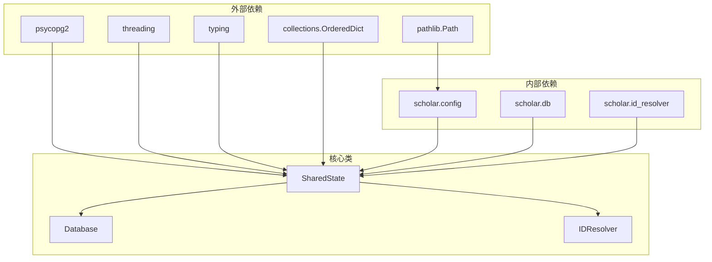

# 共享状态管理系统

<cite>
**本文档中引用的文件**
- [_state.py](file://scholar/_state.py)
- [server.py](file://scholar_mcp/server.py)
- [__main__.py](file://scholar_mcp/__main__.py)
- [_shared.py](file://scholar/_shared.py)
- [db.py](file://scholar/db.py)
- [config.py](file://scholar/config.py)
- [id_resolver.py](file://scholar/id_resolver.py)
- [cli.py](file://scholar/cli.py)
</cite>

## 更新摘要
**变更内容**
- 更新了缓存机制实现，从普通字典改为OrderedDict以支持LRU缓存的线程安全操作
- 添加了完整的线程安全保护机制，包括threading.Lock的使用
- 增强了LRU缓存的线程安全操作，确保多线程环境下的数据一致性
- 更新了架构图和代码示例以反映新的线程安全实现

## 目录
1. [简介](#简介)
2. [项目结构](#项目结构)
3. [核心组件](#核心组件)
4. [架构概览](#架构概览)
5. [详细组件分析](#详细组件分析)
6. [依赖关系分析](#依赖关系分析)
7. [性能考虑](#性能考虑)
8. [故障排除指南](#故障排除指南)
9. [结论](#结论)

## 简介

共享状态管理系统是 Scholar Studio 项目中的一个关键架构组件，专门为 MCP（Model Context Protocol）服务器提供长期运行进程的状态管理。该系统通过连接池、缓存资源和线程安全机制，实现了高效的资源复用和性能优化，特别适用于需要频繁处理多个学术研究任务的场景。

**更新** 系统现已实现全面的线程安全增强，包括缓存机制从普通字典改为OrderedDict，添加了threading.Lock保护，以及LRU缓存的线程安全操作，确保在高并发环境下的数据一致性和系统稳定性。

该系统的核心目标是在保持线程安全的前提下，最大化资源利用率，减少重复初始化成本，并提供灵活的缓存策略来加速数据访问。

## 项目结构

Scholar Studio 采用模块化的项目结构，共享状态管理功能主要分布在以下关键文件中：



**图表来源**
- [_state.py:1-131](file://scholar/_state.py#L1-L131)
- [__main__.py:1-13](file://scholar_mcp/__main__.py#L1-L13)
- [server.py:1-800](file://scholar_mcp/server.py#L1-L800)

**章节来源**
- [_state.py:1-131](file://scholar/_state.py#L1-L131)
- [__main__.py:1-13](file://scholar_mcp/__main__.py#L1-L13)
- [server.py:1-800](file://scholar_mcp/server.py#L1-L800)

## 核心组件

共享状态管理系统由三个主要组件构成：

### 1. SharedState 类
这是系统的核心类，负责管理所有共享资源：
- PostgreSQL 连接池
- ID 解析器缓存
- **线程安全的LRU缓存机制**（使用OrderedDict）
- **完整的线程安全控制**（使用threading.Lock）

### 2. 初始化流程
系统在 MCP 服务器启动时进行一次性初始化，包括：
- 连接池建立
- ID 解析器预加载
- 资源预热

### 3. 访问接口
提供统一的访问接口，确保线程安全和资源的有效管理。

**章节来源**
- [_state.py:21-131](file://scholar/_state.py#L21-L131)

## 架构概览

共享状态管理系统采用分层架构设计，确保各组件之间的清晰分离和职责明确：



**更新** 新增了线程安全LRU缓存组件，使用OrderedDict确保缓存操作的线程安全性。

**图表来源**
- [_state.py:21-113](file://scholar/_state.py#L21-L113)
- [db.py:24-106](file://scholar/db.py#L24-L106)
- [config.py:238-313](file://scholar/config.py#L238-L313)

## 详细组件分析

### SharedState 类详解

SharedState 类是整个系统的核心，采用了多种设计模式来确保高效性和可靠性：

#### 数据结构设计



**更新** 数据结构已更新，使用OrderedDict替代普通字典以支持LRU缓存的线程安全操作。

**图表来源**
- [_state.py:21-113](file://scholar/_state.py#L21-L113)
- [db.py:24-106](file://scholar/db.py#L24-L106)
- [id_resolver.py:15-107](file://scholar/id_resolver.py#L15-L107)

#### 线程安全机制

系统使用 `threading.Lock` 和 `OrderedDict` 确保多线程环境下的数据一致性：



**更新** 新增了完整的线程安全序列图，展示了锁机制如何保护缓存操作。

**图表来源**
- [_state.py:47-86](file://scholar/_state.py#L47-L86)

#### 连接池管理

系统实现了智能的连接池管理策略：

```mermaid
flowchart TD
Start([初始化连接池]) --> TryInit{尝试初始化}
TryInit --> |成功| CreatePool[创建ThreadedConnectionPool]
TryInit --> |失败| HandleError[捕获异常并忽略]
CreatePool --> ConfigPool[配置minconn=2, maxconn=8]
ConfigPool --> StorePool[存储到实例变量]
HandleError --> Continue[继续执行]
StorePool --> Ready[连接池就绪]
Continue --> Ready
Ready --> UsePool{使用连接池}
UsePool --> |需要连接| GetConn[getconn()]
GetConn --> UseConn[执行数据库操作]
UseConn --> PutConn[putconn()]
PutConn --> UsePool
```

**图表来源**
- [_state.py:90-113](file://scholar/_state.py#L90-L113)

**章节来源**
- [_state.py:21-113](file://scholar/_state.py#L21-L113)

### 初始化流程分析

系统采用延迟初始化策略，确保只在需要时才进行昂贵的操作：



**更新** 初始化流程已更新，新增了Lock和OrderedDict缓存的初始化步骤。

**图表来源**
- [_state.py:120-131](file://scholar/_state.py#L120-L131)

**章节来源**
- [_state.py:120-131](file://scholar/_state.py#L120-L131)

### 缓存策略实现

系统实现了多层缓存策略来优化性能：

#### 线程安全的LRU缓存机制



**更新** 新增了完整的线程安全LRU缓存流程图，展示了OrderedDict和锁机制如何协同工作。

**图表来源**
- [_state.py:65-86](file://scholar/_state.py#L65-L86)

**章节来源**
- [_state.py:65-86](file://scholar/_state.py#L65-L86)

## 依赖关系分析

共享状态管理系统与其他组件的依赖关系如下：



**更新** 新增了collections.OrderedDict作为外部依赖，反映了缓存机制的技术变更。

**图表来源**
- [_state.py:13-18](file://scholar/_state.py#L13-L18)
- [db.py:15-22](file://scholar/db.py#L15-L22)

**章节来源**
- [_state.py:13-18](file://scholar/_state.py#L13-L18)
- [db.py:15-22](file://scholar/db.py#L15-L22)

## 性能考虑

### 内存使用优化

系统通过以下机制优化内存使用：
- **线程安全的LRU缓存限制为 100 个条目**（使用OrderedDict）
- 懒加载策略避免不必要的初始化
- 连接池大小合理配置（min=2, max=8）

### 并发性能

**更新** 线程安全通过以下方式保证：
- 使用 `threading.Lock` 保护所有共享资源访问
- **OrderedDict确保缓存操作的线程安全性**
- 连接池本身是线程安全的
- **缓存操作使用锁机制，避免竞态条件**

### 错误处理策略

系统采用优雅降级策略：
- PostgreSQL 不可用时进入文件模式
- 连接池初始化失败不影响其他功能
- 缓存失效不会导致系统崩溃
- **线程安全异常会被捕获并处理**

## 故障排除指南

### 常见问题及解决方案

#### 连接池初始化失败
**症状**: 系统启动时报错，无法建立数据库连接
**原因**: PostgreSQL 服务未启动或配置错误
**解决方案**: 
1. 检查 PostgreSQL 服务状态
2. 验证配置文件中的连接参数
3. 确认网络连接正常

#### 缓存性能问题
**症状**: 缓存命中率低或内存占用过高
**原因**: 缓存大小设置不当或缓存策略不合理
**解决方案**:
1. 调整 `_parsed_cache_max` 参数
2. 定期清理无效缓存
3. 监控缓存使用情况

#### **线程安全问题**
**症状**: 多线程环境下出现数据竞争或缓存不一致
**原因**: 缺少适当的同步机制
**解决方案**:
1. 确保所有共享资源访问都经过锁保护
2. 避免在持有锁的情况下执行阻塞操作
3. **定期进行并发测试，验证OrderedDict的线程安全性**
4. **监控锁的竞争情况，避免死锁**

#### **缓存一致性问题**
**症状**: 不同线程看到不同的缓存状态
**原因**: OrderedDict操作未正确加锁
**解决方案**:
1. **确认所有缓存操作都包含在with self._lock:语句块中**
2. **验证move_to_end()、popitem()等OrderedDict操作的原子性**
3. **检查缓存失效操作的线程安全性**

**章节来源**
- [_state.py:90-113](file://scholar/_state.py#L90-L113)
- [db.py:32-52](file://scholar/db.py#L32-L52)

## 结论

共享状态管理系统通过精心设计的架构和实现策略，成功地解决了学术研究工具在长时间运行环境中面临的资源管理和性能优化挑战。**更新后的系统通过以下关键改进，进一步提升了可靠性和性能**：

1. **高效性**: 通过连接池和线程安全的缓存机制显著减少了资源初始化成本
2. **可靠性**: 采用优雅降级策略确保系统在各种环境下都能稳定运行
3. **可扩展性**: 模块化设计便于功能扩展和维护
4. **线程安全**: **完整的锁保护机制和OrderedDict的线程安全操作保证了多线程环境下的数据一致性**
5. **性能优化**: **OrderedDict的使用确保了LRU缓存操作的高效性和线程安全性**

**更新** 新的线程安全增强包括：
- **缓存机制从普通字典升级为OrderedDict，支持LRU缓存的线程安全操作**
- **完整的threading.Lock保护，覆盖所有共享资源访问**
- **LRU缓存的线程安全实现，确保多线程环境下的数据一致性**

该系统为 Scholar Studio 提供了坚实的基础设施支持，使得复杂的学术研究工作流能够在高性能、稳定的环境中运行，为研究人员提供了强大的技术支持。**线程安全的增强使其能够更好地应对高并发场景，为大规模学术研究应用提供了可靠的基础架构**。