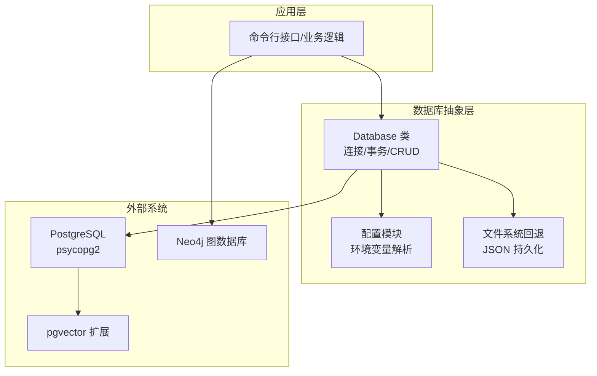
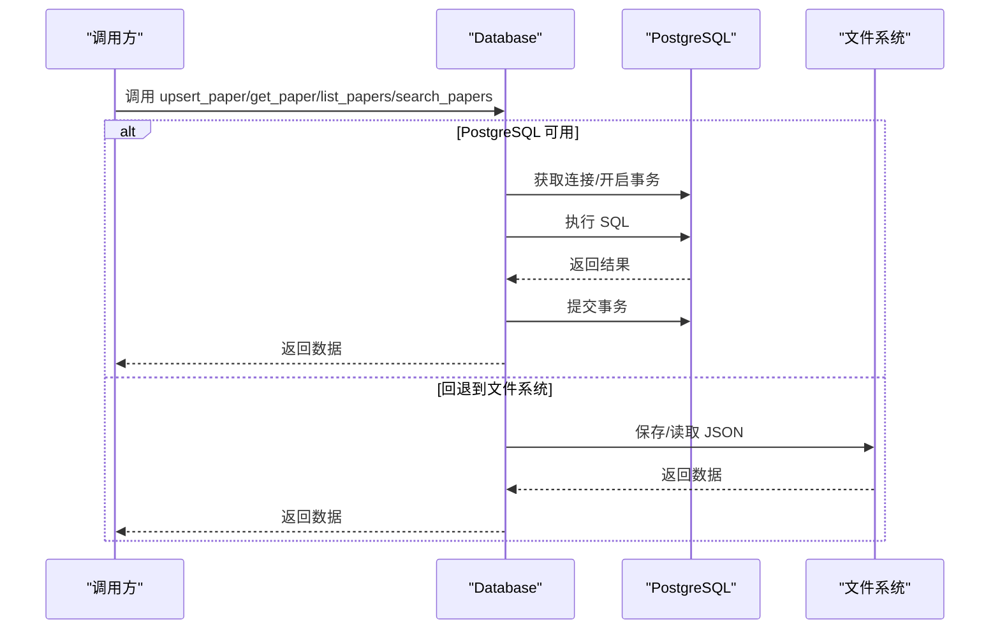
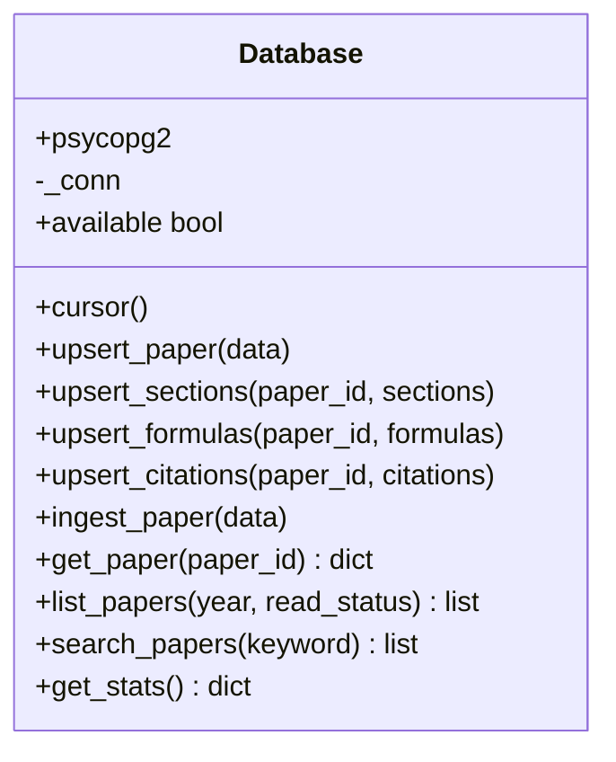
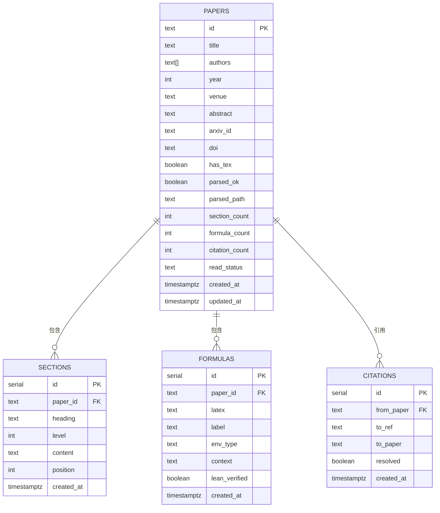
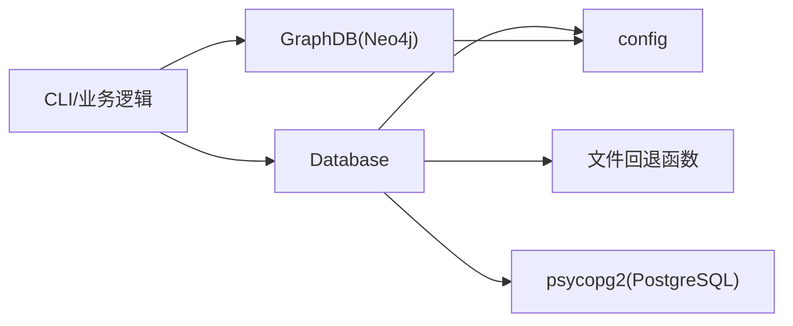

# 数据库抽象层

<cite>
**本文引用的文件**
- [scholar/db.py](file://scholar/db.py)
- [infra/init.sql](file://infra/init.sql)
- [scholar/config.py](file://scholar/config.py)
- [test/test_db.py](file://test/test_db.py)
- [scholar/graph_db.py](file://scholar/graph_db.py)
</cite>

## 目录
1. [简介](#简介)
2. [项目结构](#项目结构)
3. [核心组件](#核心组件)
4. [架构总览](#架构总览)
5. [详细组件分析](#详细组件分析)
6. [依赖分析](#依赖分析)
7. [性能考虑](#性能考虑)
8. [故障排查指南](#故障排查指南)
9. [结论](#结论)
10. [附录](#附录)

## 简介
本文件为数据库抽象层的技术文档，聚焦于 PostgreSQL 的连接管理、查询封装与事务处理机制；同时覆盖 Database 类的设计模式、连接可用性检测、异常处理策略；并基于数据库表结构说明 Paper、ParsedPaper、Citation 等核心实体的数据模型与 CRUD 实现路径。文档还提供 SQL 查询优化、索引策略、批量操作性能调优建议，并说明文件系统回退机制、数据迁移与版本兼容性处理思路。

## 项目结构
数据库抽象层主要由以下模块组成：
- 数据库访问层：Database 类封装连接、事务与 CRUD 操作
- 配置层：从环境变量加载数据库连接参数
- 文件回退层：当 PostgreSQL 不可用时，使用 JSON 文件进行持久化
- 单元测试：验证文件回退与可用性检测逻辑
- 图数据库集成：Neo4j 引入概念图谱与引用网络，作为补充存储

图表来源
- [scholar/db.py:24-74](file://scholar/db.py#L24-L74)
- [scholar/config.py:44-49](file://scholar/config.py#L44-L49)
- [infra/init.sql:4](file://infra/init.sql#L4)
- [scholar/graph_db.py:32-69](file://scholar/graph_db.py#L32-L69)

章节来源
- [scholar/db.py:1-276](file://scholar/db.py#L1-L276)
- [scholar/config.py:1-119](file://scholar/config.py#L1-L119)
- [infra/init.sql:1-131](file://infra/init.sql#L1-L131)
- [test/test_db.py:1-108](file://test/test_db.py#L1-L108)
- [scholar/graph_db.py:1-342](file://scholar/graph_db.py#L1-L342)

## 核心组件
- Database 类：提供 PostgreSQL 连接、事务上下文、Paper/Sections/Formulas/Citations 的增删改查与全量导入
- 配置模块：集中管理数据库连接参数与输出目录
- 文件回退：在 PostgreSQL 不可用时，以 JSON 文件保存解析后的论文数据
- 单元测试：验证文件回退与可用性检测

章节来源
- [scholar/db.py:24-276](file://scholar/db.py#L24-L276)
- [scholar/config.py:44-49](file://scholar/config.py#L44-L49)
- [test/test_db.py:14-108](file://test/test_db.py#L14-L108)

## 架构总览
数据库抽象层采用“可选 PostgreSQL + 文件系统回退”的设计。Database 类通过上下文管理器确保事务的提交或回滚；当 PostgreSQL 可用时，优先使用数据库；否则回退到文件系统进行读写。

图表来源
- [scholar/db.py:62-73](file://scholar/db.py#L62-L73)
- [scholar/db.py:79-126](file://scholar/db.py#L79-L126)
- [scholar/db.py:181-221](file://scholar/db.py#L181-L221)
- [scholar/db.py:248-276](file://scholar/db.py#L248-L276)

## 详细组件分析

### Database 类设计与事务处理
- 设计模式
  - 责任链/适配器：根据 PostgreSQL 是否可用动态切换实现
  - 上下文管理器：cursor 提供自动提交/回滚与资源释放
  - 命令模式：每个 CRUD 方法封装具体 SQL 操作
- 连接管理
  - 可用性检测：临时连接后立即关闭，避免缓存死连接
  - 连接复用：若当前连接有效则复用，否则重新建立
- 事务处理
  - 自动提交：正常退出时提交
  - 自动回滚：异常发生时回滚并抛出
  - 资源释放：finally 中关闭游标

图表来源
- [scholar/db.py:24-276](file://scholar/db.py#L24-L276)

章节来源
- [scholar/db.py:24-74](file://scholar/db.py#L24-L74)
- [scholar/db.py:79-176](file://scholar/db.py#L79-L176)
- [scholar/db.py:181-241](file://scholar/db.py#L181-L241)

### Paper/Sections/Formulas/Citations 数据模型与 CRUD
- 表结构与字段
  - papers：主键 id，标题、作者、年份、会议、摘要、arXiv/DOI、是否含 TeX、解析状态与路径、统计计数、阅读状态、时间戳
  - sections：paper_id 外键，标题、层级、内容、位置、时间戳
  - formulas：paper_id 外键，LaTeX 内容、标签、环境类型、上下文、验证标记、时间戳
  - citations：from_paper 外键，目标引用键/ULID、目标 paper_id、解析标记、唯一约束
- CRUD 实现要点
  - upsert_paper：按 id 冲突更新，部分字段使用 COALESCE 保留已有值
  - upsert_sections/formulas：先删除旧记录，再逐条插入
  - upsert_citations：先删除旧引用，再逐条插入（忽略重复）
  - ingest_paper：一次性完成 paper+sections+formulas+citations 的全量导入
  - 查询：get_paper、list_papers（条件拼接）、search_papers（多表关联模糊匹配）

图表来源
- [infra/init.sql:9-71](file://infra/init.sql#L9-L71)

章节来源
- [infra/init.sql:9-71](file://infra/init.sql#L9-L71)
- [scholar/db.py:79-176](file://scholar/db.py#L79-L176)

### 查询封装与性能特性
- get_paper：单主键查询，返回完整行并映射为字典
- list_papers：动态拼接 where 条件，支持年份与阅读状态过滤，按年份倒序与标题排序
- search_papers：左连接 sections，三列模糊匹配，限制返回数量，按年份倒序
- 性能特征
  - 单表查询为主，适合配合索引优化
  - 模糊匹配使用 ILIKE，可能影响索引选择性
  - 统计查询用于概览，避免复杂联结

章节来源
- [scholar/db.py:181-221](file://scholar/db.py#L181-L221)

### 文件系统回退机制
- 适用场景：PostgreSQL 不可用或未安装 psycopg2
- 实现方式：以 paper_id 为文件名保存 JSON；读取时按需解码
- 优势：无需数据库即可运行，便于离线/开发环境
- 局限：不支持 ACID 事务与复杂查询，适合小规模数据

图表来源
- [scholar/db.py:248-276](file://scholar/db.py#L248-L276)
- [test/test_db.py:17-83](file://test/test_db.py#L17-L83)

章节来源
- [scholar/db.py:248-276](file://scholar/db.py#L248-L276)
- [test/test_db.py:14-83](file://test/test_db.py#L14-L83)

### 配置与环境变量
- 数据库连接参数：主机、端口、数据库名、用户名、密码
- 输出目录：解析产物、笔记、草稿、参考文献、实验、数据集、PDF、摘要、日志等
- 其他：Neo4j 连接、嵌入模型与维度、arXiv 请求重试与超时

章节来源
- [scholar/config.py:44-49](file://scholar/config.py#L44-L49)
- [scholar/config.py:23-42](file://scholar/config.py#L23-L42)
- [scholar/config.py:72-119](file://scholar/config.py#L72-L119)

### 与图数据库的协作
- Neo4j 用于构建引用网络与概念图谱，Paper 节点与数据库中的 papers 字段保持一致
- 提供节点批量创建、边批量创建、统计查询与路径查找等能力
- 与 PostgreSQL 的互补：结构化数据存在数据库，复杂关系与图分析在图数据库中完成

章节来源
- [scholar/graph_db.py:225-281](file://scholar/graph_db.py#L225-L281)
- [scholar/graph_db.py:287-342](file://scholar/graph_db.py#L287-L342)

## 依赖分析
- 内部依赖
  - Database 依赖配置模块提供的连接参数
  - 文件回退函数依赖配置模块提供的输出目录
- 外部依赖
  - PostgreSQL + psycopg2（可选）
  - Neo4j（可选）
  - python-dotenv（可选）

图表来源
- [scholar/db.py:12](file://scholar/db.py#L12)
- [scholar/config.py:11-18](file://scholar/config.py#L11-L18)
- [scholar/graph_db.py:17](file://scholar/graph_db.py#L17)

章节来源
- [scholar/db.py:12-29](file://scholar/db.py#L12-L29)
- [scholar/config.py:11-18](file://scholar/config.py#L11-L18)
- [scholar/graph_db.py:17-34](file://scholar/graph_db.py#L17-L34)

## 性能考虑
- 连接与事务
  - 使用上下文管理器确保事务边界清晰，减少长事务带来的锁竞争
  - 在可用性检测中使用一次性连接，避免连接池占用
- 查询优化
  - 为 papers.id、sections.paper_id、formulas.paper_id、citations.from_paper、citations.to_paper 建立索引（已存在）
  - 模糊查询 ILIKE 可能绕过 B-tree 索引，建议评估 GIN/GIST 或全文索引（取决于 PostgreSQL 版本与扩展）
  - 对高频过滤字段（year、read_status）考虑复合索引
- 批量操作
  - upsert_* 系列方法采用逐条 INSERT，建议在数据量较大时使用 COPY 或批量 INSERT 以降低往返开销
  - citations 导入使用 ON CONFLICT DO NOTHING，避免重复键冲突
- 存储与 IO
  - 文件回退仅适用于小规模数据；大规模场景建议使用数据库
  - JSON 序列化使用 UTF-8 编码，注意 Unicode 正确性

章节来源
- [infra/init.sql:41-71](file://infra/init.sql#L41-L71)
- [scholar/db.py:128-176](file://scholar/db.py#L128-L176)
- [test/test_db.py:69-76](file://test/test_db.py#L69-L76)

## 故障排查指南
- PostgreSQL 不可用
  - 现象：Database.available 为 False
  - 排查：确认 psycopg2 安装、网络连通、凭据正确
  - 处理：启用文件回退，使用 save_parsed/load_parsed/list_parsed
- 连接异常
  - 现象：_connect 抛出异常或 ping 失败
  - 排查：检查主机/端口/数据库名/用户/密码
  - 处理：修复配置后重试
- 事务问题
  - 现象：异常导致回滚但未提交
  - 排查：检查异常堆栈与 SQL 参数绑定
  - 处理：确保异常被捕获并记录，必要时手动回滚
- 文件回退问题
  - 现象：保存时报错或读取为空
  - 排查：确认 parsed 目录存在且具备写权限；JSON 编码/解码正确
  - 处理：使用测试用例中的断言行为作为参考

章节来源
- [test/test_db.py:85-108](file://test/test_db.py#L85-L108)
- [scholar/db.py:31-44](file://scholar/db.py#L31-L44)
- [scholar/db.py:46-60](file://scholar/db.py#L46-L60)
- [scholar/db.py:248-276](file://scholar/db.py#L248-L276)

## 结论
该数据库抽象层通过“可选 PostgreSQL + 文件系统回退”实现了高可用与易用性的平衡：在具备数据库时提供强一致与高性能查询，在不具备数据库时仍可稳定运行。结合合理的索引与批量操作策略，可在中小规模场景下获得良好体验；对于更大规模与更复杂的查询需求，建议引入连接池、全文检索与向量化扩展（如 pgvector）以进一步提升性能与功能。

## 附录

### 数据模型与字段说明（摘要）
- papers
  - 主键：id
  - 关键字段：title、authors、year、venue、abstract、arxiv_id、doi、has_tex、parsed_ok、parsed_path、section_count、formula_count、citation_count、read_status、created_at、updated_at
- sections
  - 外键：paper_id → papers.id
  - 关键字段：heading、level、content、position、created_at
- formulas
  - 外键：paper_id → papers.id
  - 关键字段：latex、label、env_type、context、lean_verified、created_at
- citations
  - 外键：from_paper → papers.id
  - 关键字段：to_ref、to_paper、resolved、created_at
  - 唯一约束：(from_paper, to_ref)

章节来源
- [infra/init.sql:9-71](file://infra/init.sql#L9-L71)