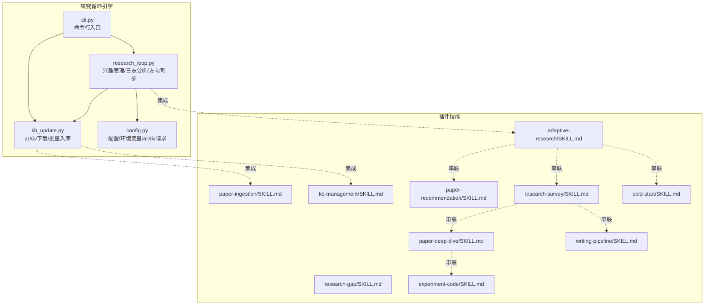
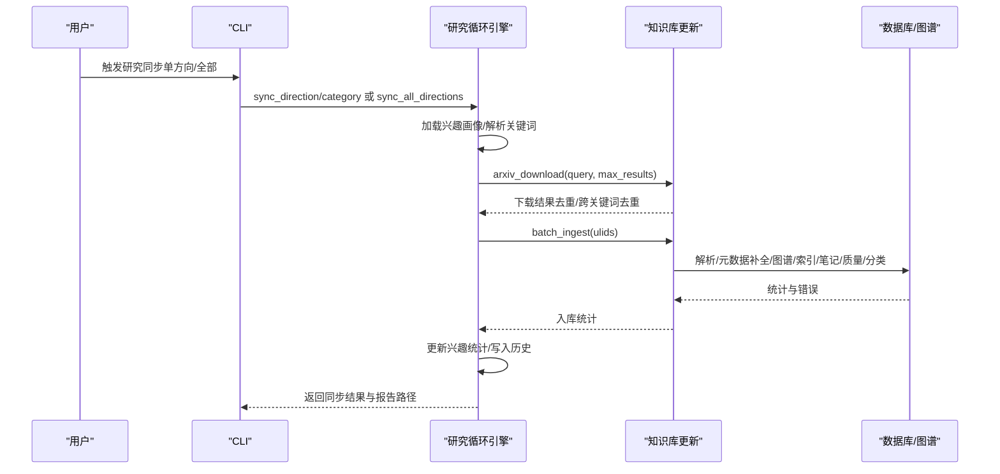
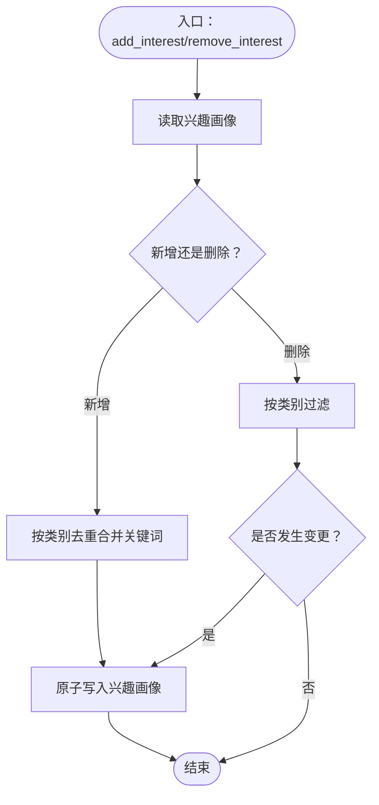
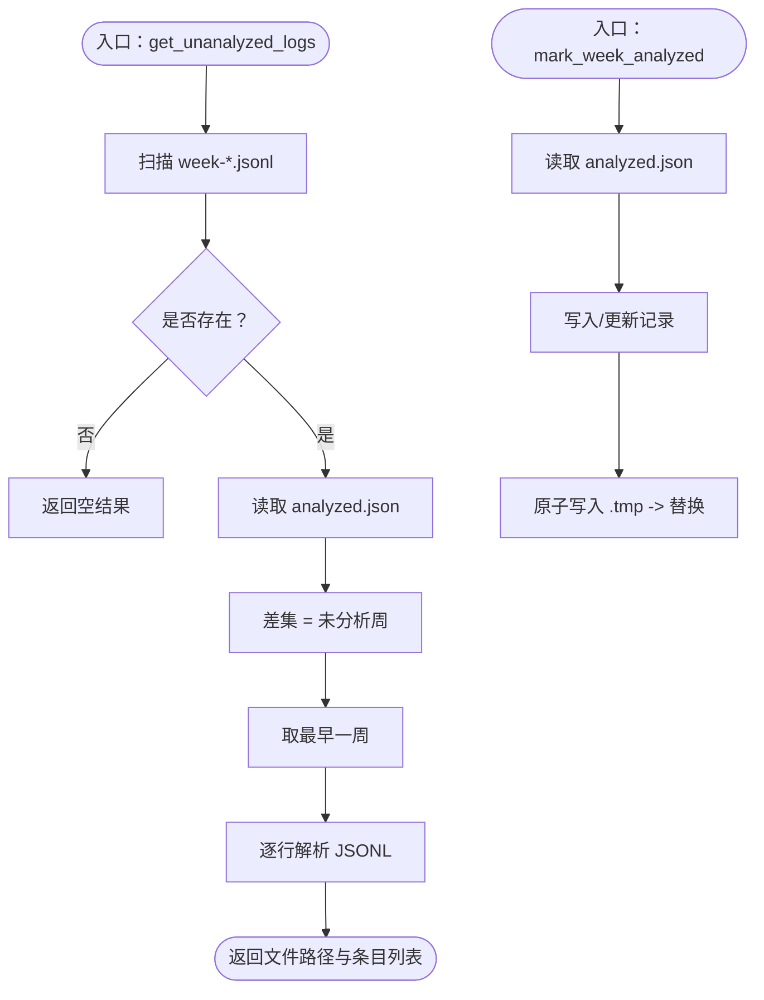
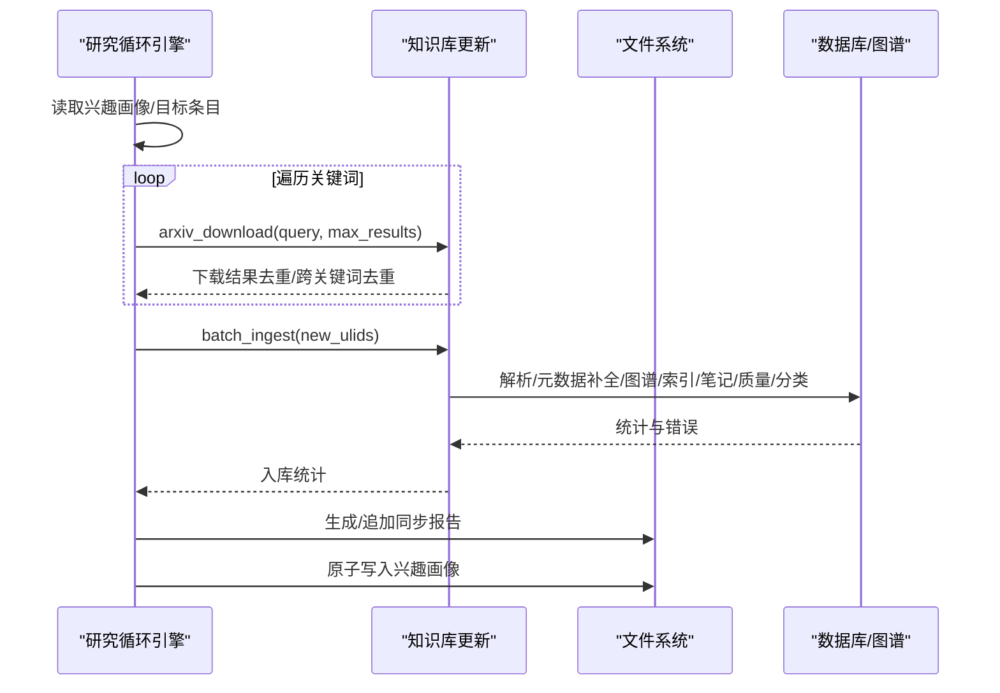
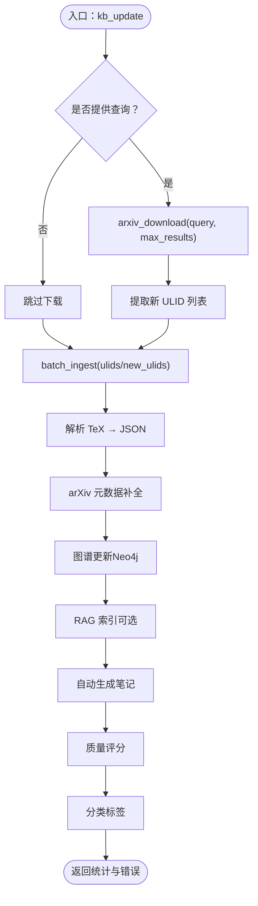
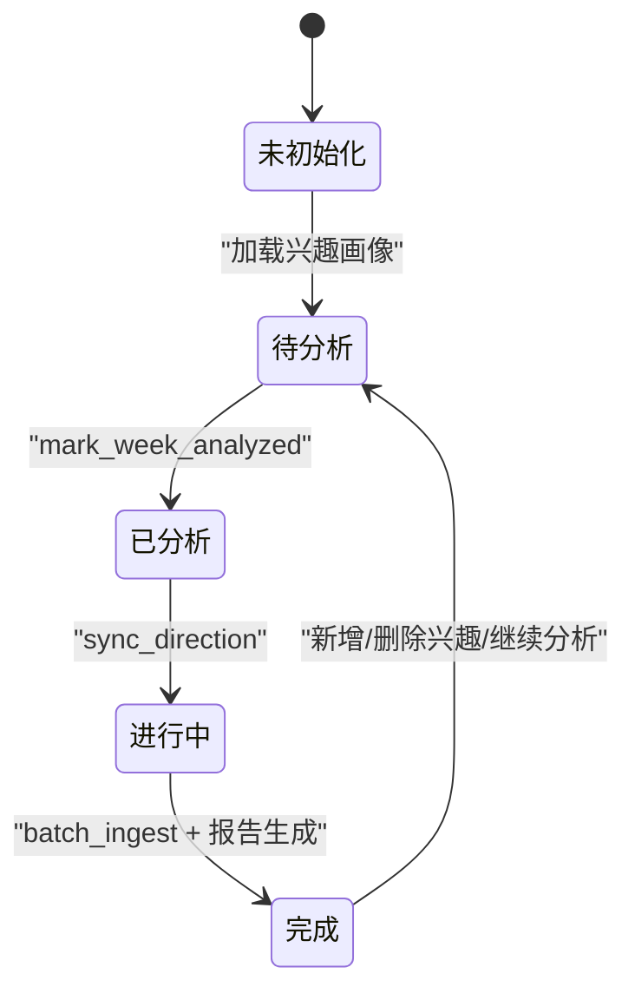
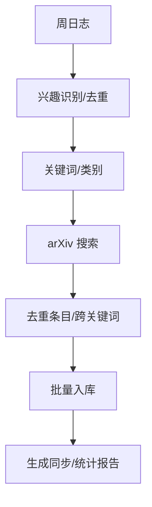
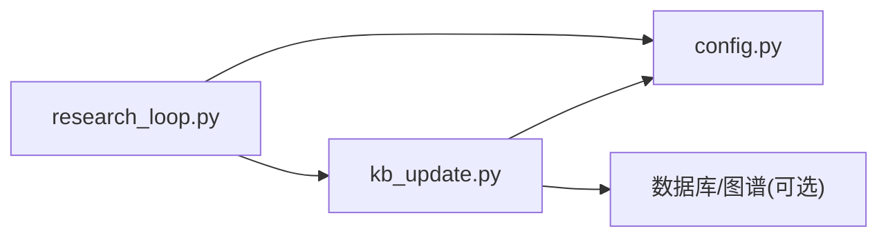

# 研究循环引擎

<cite>
**本文档引用的文件**
- [research_loop.py](file://scholar/research_loop.py)
- [kb_update.py](file://scholar/kb_update.py)
- [config.py](file://scholar/config.py)
- [cli.py](file://scholar/cli.py)
- [SKILL.md（自适应研究循环）](file://plugin/skills/adaptive-research/SKILL.md)
- [SKILL.md（论文入库）](file://plugin/skills/paper-ingestion/SKILL.md)
- [SKILL.md（知识库维护）](file://plugin/skills/kb-management/SKILL.md)
- [SKILL.md（论文推荐）](file://plugin/skills/paper-recommendation/SKILL.md)
- [SKILL.md（研究空白）](file://plugin/skills/research-gap/SKILL.md)
- [SKILL.md（文献调研）](file://plugin/skills/research-survey/SKILL.md)
- [SKILL.md（冷启动）](file://plugin/skills/cold-start/SKILL.md)
- [SKILL.md（论文深度分析）](file://plugin/skills/paper-deep-dive/SKILL.md)
- [SKILL.md（写作流水线）](file://plugin/skills/writing-pipeline/SKILL.md)
- [SKILL.md（实验代码）](file://plugin/skills/experiment-code/SKILL.md)
</cite>

## 目录
1. [简介](#简介)
2. [项目结构](#项目结构)
3. [核心组件](#核心组件)
4. [架构总览](#架构总览)
5. [详细组件分析](#详细组件分析)
6. [依赖分析](#依赖分析)
7. [性能考虑](#性能考虑)
8. [故障排查指南](#故障排查指南)
9. [结论](#结论)
10. [附录](#附录)

## 简介
本文件为“研究循环引擎”的技术文档，聚焦于兴趣管理算法、日志分析处理与方向同步机制的实现原理，系统阐述研究循环的状态机设计、事件驱动架构与异步处理模式，并覆盖兴趣点识别、文献筛选、知识整合与报告生成的完整流程。文档还提供算法参数调优、性能监控与错误恢复策略，以及与其他组件的集成接口与扩展机制。

## 项目结构
研究循环引擎位于 scholar 子模块，围绕兴趣画像、日志分析与方向同步三大能力构建，配合插件技能实现端到端研究工作流。核心目录与文件如下：
- scholar/research_loop.py：兴趣管理、日志分析、方向同步与报告生成
- scholar/kb_update.py：arXiv 下载、批量入库、统一处理流程
- scholar/config.py：配置与环境变量、arXiv API 请求封装
- scholar/cli.py：命令行入口与可视化输出
- plugin/skills/*：配套技能文档，定义端到端工作流与交互

**图示来源**
- [research_loop.py:1-359](file://scholar/research_loop.py#L1-L359)
- [kb_update.py:1-473](file://scholar/kb_update.py#L1-L473)
- [config.py:1-119](file://scholar/config.py#L1-L119)
- [cli.py:1-800](file://scholar/cli.py#L1-L800)
- [SKILL.md（自适应研究循环）:1-68](file://plugin/skills/adaptive-research/SKILL.md#L1-L68)
- [SKILL.md（论文入库）:1-85](file://plugin/skills/paper-ingestion/SKILL.md#L1-L85)
- [SKILL.md（知识库维护）:1-59](file://plugin/skills/kb-management/SKILL.md#L1-L59)
- [SKILL.md（论文推荐）:1-96](file://plugin/skills/paper-recommendation/SKILL.md#L1-L96)
- [SKILL.md（研究空白）:1-105](file://plugin/skills/research-gap/SKILL.md#L1-L105)
- [SKILL.md（文献调研）:1-113](file://plugin/skills/research-survey/SKILL.md#L1-L113)
- [SKILL.md（冷启动）:1-147](file://plugin/skills/cold-start/SKILL.md#L1-L147)
- [SKILL.md（论文深度分析）:1-84](file://plugin/skills/paper-deep-dive/SKILL.md#L1-L84)
- [SKILL.md（写作流水线）:1-135](file://plugin/skills/writing-pipeline/SKILL.md#L1-L135)
- [SKILL.md（实验代码）:1-111](file://plugin/skills/experiment-code/SKILL.md#L1-L111)

**章节来源**
- [research_loop.py:1-359](file://scholar/research_loop.py#L1-L359)
- [kb_update.py:1-473](file://scholar/kb_update.py#L1-L473)
- [config.py:1-119](file://scholar/config.py#L1-L119)
- [cli.py:1-800](file://scholar/cli.py#L1-L800)

## 核心组件
- 兴趣管理（research_loop.interests）
  - 兴趣画像结构：版本号、更新时间、兴趣条目数组、历史记录
  - 关键操作：新增/去重合并关键词、按类别删除、持久化写入（原子替换）
- 日志分析（research_loop.logs）
  - 周日志扫描：output/logs/week-*.jsonl，差集计算未分析周
  - 解析与标记：逐行 JSONL 解析，完成分析后写入 analyzed.json（原子写入）
- 方向同步（research_loop.sync_direction）
  - 单方向同步：关键词去重、跨关键词去重、批量入库、统计更新、报告生成
  - 全局同步：遍历所有兴趣方向，聚合结果
- 知识库更新（kb_update.kb_update）
  - 一键流程：arXiv 搜索 → 下载 TeX/PDF → 批量入库（解析/元数据补全/图谱/索引/笔记/质量/分类）
- 配置与环境（config）
  - 目录结构、数据库/图数据库/嵌入配置、arXiv 请求封装（重试/超时/代理）

**章节来源**
- [research_loop.py:22-285](file://scholar/research_loop.py#L22-L285)
- [kb_update.py:441-473](file://scholar/kb_update.py#L441-L473)
- [config.py:72-119](file://scholar/config.py#L72-L119)

## 架构总览
研究循环引擎采用“事件驱动 + 状态机”的架构模式：
- 事件来源：对话日志（周文件）、用户触发（CLI/插件技能）
- 状态机：兴趣画像（active/inactive）、日志分析（待分析/已分析）、同步（未开始/进行中/完成）
- 处理模式：同步阻塞（方向同步）与最佳努力（图谱/索引/笔记/质量/分类）

**图示来源**
- [research_loop.py:181-313](file://scholar/research_loop.py#L181-L313)
- [kb_update.py:216-438](file://scholar/kb_update.py#L216-L438)

## 详细组件分析

### 兴趣管理算法
- 数据结构
  - 兴趣画像字典包含版本、更新时间、条目数组、历史记录
  - 条目包含类别、关键词集合、最大结果数、添加日期、搜索次数、最近搜索日期
- 关键流程
  - 新增/去重：按类别去重，合并关键词并去重，保留较大 max_results
  - 删除：按类别过滤，若发生变更则持久化
  - 原子写入：先写临时文件，再替换，避免中断导致损坏
- 复杂度
  - 去重与合并：O(n)（n 为关键词数量）
  - 写入：O(1) 原子替换

**图示来源**
- [research_loop.py:52-95](file://scholar/research_loop.py#L52-L95)

**章节来源**
- [research_loop.py:22-95](file://scholar/research_loop.py#L22-L95)

### 日志分析处理
- 未分析日志发现
  - 扫描 output/logs/week-*.jsonl，读取 analyzed.json 差集，取最早一周
  - 逐行解析 JSONL，忽略空行与解析异常
- 标记完成
  - 原子写入 analyzed.json，记录分析时间、发现数量与条目总数
- 错误处理
  - 文件读取异常、JSON 解析异常均降级为空结果

**图示来源**
- [research_loop.py:102-174](file://scholar/research_loop.py#L102-L174)

**章节来源**
- [research_loop.py:102-174](file://scholar/research_loop.py#L102-L174)

### 方向同步机制
- 单方向同步
  - 读取目标兴趣条目，拆分关键词
  - 逐关键词调用 arxiv_download，内部完成搜索、去重、下载
  - 跨关键词去重（同一 arXiv ID 只保留一次）
  - 批量入库 batch_ingest，记录统计与错误
  - 更新兴趣画像统计与历史记录，生成同步报告
- 全局同步
  - 遍历所有兴趣方向，聚合总数与结果
- 报告生成
  - 同一天多次同步追加时间戳区隔，汇总论文与错误

**图示来源**
- [research_loop.py:181-285](file://scholar/research_loop.py#L181-L285)
- [kb_update.py:216-438](file://scholar/kb_update.py#L216-L438)

**章节来源**
- [research_loop.py:181-313](file://scholar/research_loop.py#L181-L313)
- [kb_update.py:216-438](file://scholar/kb_update.py#L216-L438)

### 知识库更新与统一处理
- arXiv 下载
  - 搜索 XML 解析、已有 arXiv ID 去重、TeX/PDF 下载、元数据 JSON 生成
  - 失败清理：删除空目录，避免孤儿目录
  - 成功后按 3 秒间隔速率限制
- 批量入库
  - 解析 TeX → JSON
  - 元数据补全（arXiv API，单次查询）
  - 图谱更新（Neo4j）、RAG 索引（可选）
  - 自动生成笔记、质量评分、分类标签
  - 数据库可用时写入，不可用时文件模式回退
- 一键更新
  - 可选外部搜索 + 下载 + 入库一体化

**图示来源**
- [kb_update.py:88-213](file://scholar/kb_update.py#L88-L213)
- [kb_update.py:216-438](file://scholar/kb_update.py#L216-L438)
- [kb_update.py:441-473](file://scholar/kb_update.py#L441-L473)

**章节来源**
- [kb_update.py:88-213](file://scholar/kb_update.py#L88-L213)
- [kb_update.py:216-438](file://scholar/kb_update.py#L216-L438)
- [kb_update.py:441-473](file://scholar/kb_update.py#L441-L473)

### 研究循环状态机设计
- 状态
  - 兴趣画像：空/已初始化/已更新
  - 日志：未分析/已分析
  - 同步：未开始/进行中/完成
- 事件
  - 用户触发同步、日志分析完成、入库完成
- 转移
  - 日志分析 → 兴趣画像更新 → 同步执行 → 报告生成 → 统计更新
- 并发与异步
  - 关键 API 调用（arXiv、图谱、嵌入）采用最佳努力与速率限制
  - 文件系统写入采用原子替换，保证一致性

**图示来源**
- [research_loop.py:32-95](file://scholar/research_loop.py#L32-L95)
- [research_loop.py:151-174](file://scholar/research_loop.py#L151-L174)
- [research_loop.py:181-285](file://scholar/research_loop.py#L181-L285)

**章节来源**
- [research_loop.py:32-95](file://scholar/research_loop.py#L32-L95)
- [research_loop.py:151-174](file://scholar/research_loop.py#L151-L174)
- [research_loop.py:181-285](file://scholar/research_loop.py#L181-L285)

### 事件驱动与异步处理模式
- 事件来源
  - 定时任务（每周日）触发日志分析与方向同步
  - 用户命令行触发（CLI）与插件技能触发
- 异步特性
  - arXiv 请求具备重试与指数退避
  - 图谱/索引/笔记/质量/分类为最佳努力，失败不影响主流程
- 串并结合
  - 关键路径（下载/入库）串行，其余步骤并行或异步

**章节来源**
- [config.py:72-119](file://scholar/config.py#L72-L119)
- [kb_update.py:281-361](file://scholar/kb_update.py#L281-L361)

### 端到端工作流（兴趣识别 → 文献筛选 → 知识整合 → 报告生成）
- 兴趣识别
  - 从周日志中提取信号，去重后写入兴趣画像
- 文献筛选
  - 基于关键词与类别，arXiv 搜索与去重，跨关键词去重
- 知识整合
  - 批量入库：解析、元数据补全、图谱/索引、笔记、质量、分类
- 报告生成
  - 同步报告与统计报告，支持追加与汇总

**图示来源**
- [research_loop.py:102-174](file://scholar/research_loop.py#L102-L174)
- [research_loop.py:181-285](file://scholar/research_loop.py#L181-L285)
- [kb_update.py:216-438](file://scholar/kb_update.py#L216-L438)

**章节来源**
- [research_loop.py:102-174](file://scholar/research_loop.py#L102-L174)
- [research_loop.py:181-285](file://scholar/research_loop.py#L181-L285)
- [kb_update.py:216-438](file://scholar/kb_update.py#L216-L438)

## 依赖分析
- 组件耦合
  - research_loop 依赖 kb_update（下载/入库）、config（目录/环境）
  - kb_update 依赖 config（目录/环境）、数据库/图谱（可选）
- 外部依赖
  - arXiv API（重试/超时/代理）
  - Neo4j（图谱）
  - PostgreSQL/pgvector（结构化存储/向量检索）
  - RAG 嵌入服务（可选）
- 潜在环路
  - 无直接循环依赖，数据流向单向（日志 → 兴趣 → 同步 → 入库 → 报告）

**图示来源**
- [research_loop.py:14-16](file://scholar/research_loop.py#L14-L16)
- [kb_update.py:15-17](file://scholar/kb_update.py#L15-L17)
- [config.py:44-61](file://scholar/config.py#L44-L61)

**章节来源**
- [research_loop.py:14-16](file://scholar/research_loop.py#L14-L16)
- [kb_update.py:15-17](file://scholar/kb_update.py#L15-L17)
- [config.py:44-61](file://scholar/config.py#L44-L61)

## 性能考虑
- 速率限制
  - arXiv 请求与下载之间固定 3 秒间隔，避免触发限流
- 最佳努力处理
  - 图谱/索引/笔记/质量/分类在数据库不可用时回退至文件模式
- I/O 原子性
  - 兴趣画像与 analyzed.json 写入采用 .tmp + replace，避免部分写入
- 批处理
  - 批量入库减少重复解析成本，提升吞吐

**章节来源**
- [research_loop.py:244-245](file://scholar/research_loop.py#L244-L245)
- [kb_update.py:210-211](file://scholar/kb_update.py#L210-L211)
- [kb_update.py:361-438](file://scholar/kb_update.py#L361-L438)

## 故障排查指南
- 兴趣画像损坏
  - 现象：JSON 解析失败或文件缺失
  - 处理：自动回退到空模板；检查权限与磁盘空间
- 日志解析异常
  - 现象：JSONL 行解析失败或 analyzed.json 读取异常
  - 处理：忽略异常行；检查文件编码与格式
- arXiv 请求失败
  - 现象：超时/网络错误/代理问题
  - 处理：启用重试与指数退避；配置 HTTP_PROXY/HTTPS_PROXY
- 下载失败清理
  - 现象：TeX/PDF 下载失败或元数据写入失败
  - 处理：删除空目录，避免孤儿目录；重试或人工介入
- 入库错误
  - 现象：解析/元数据补全/图谱/索引/笔记/质量/分类失败
  - 处理：记录错误明细；数据库不可用时文件模式回退

**章节来源**
- [research_loop.py:37-40](file://scholar/research_loop.py#L37-L40)
- [research_loop.py:123-126](file://scholar/research_loop.py#L123-L126)
- [config.py:104-118](file://scholar/config.py#L104-L118)
- [kb_update.py:165-205](file://scholar/kb_update.py#L165-L205)
- [kb_update.py:277-278](file://scholar/kb_update.py#L277-L278)

## 结论
研究循环引擎通过兴趣管理、日志分析与方向同步三大能力，实现了从信号提取到知识整合的自动化闭环。其事件驱动与状态机设计确保流程可控，速率限制与最佳努力处理保障稳定性。配合插件技能，形成从“冷启动—调研—深度分析—写作—实验”的完整研究工作流。

## 附录
- 算法参数调优建议
  - max_results：根据方向热度与存储容量平衡
  - 速率限制：维持 3 秒间隔，避免触发 arXiv 限流
  - 重试策略：合理设置重试次数与退避时间
- 性能监控
  - 统计指标：下载/入库数量、错误率、解析耗时
  - 可视化：CLI stats 输出与报告文件
- 错误恢复策略
  - 原子写入：兴趣画像与 analyzed.json
  - 失败清理：下载失败删除空目录
  - 回退模式：数据库不可用时文件模式
- 集成与扩展
  - 插件技能：与 adaptive-research、research-survey、paper-deep-dive 等无缝衔接
  - 扩展点：新增方向类别、自定义关键词、外部数据源接入

**章节来源**
- [SKILL.md（自适应研究循环）:1-68](file://plugin/skills/adaptive-research/SKILL.md#L1-L68)
- [SKILL.md（文献调研）:1-113](file://plugin/skills/research-survey/SKILL.md#L1-L113)
- [SKILL.md（论文深度分析）:1-84](file://plugin/skills/paper-deep-dive/SKILL.md#L1-L84)
- [SKILL.md（写作流水线）:1-135](file://plugin/skills/writing-pipeline/SKILL.md#L1-L135)
- [SKILL.md（实验代码）:1-111](file://plugin/skills/experiment-code/SKILL.md#L1-L111)