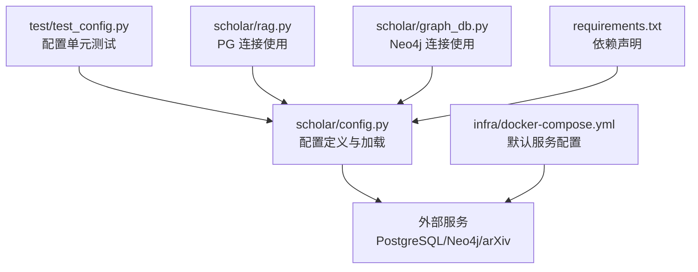
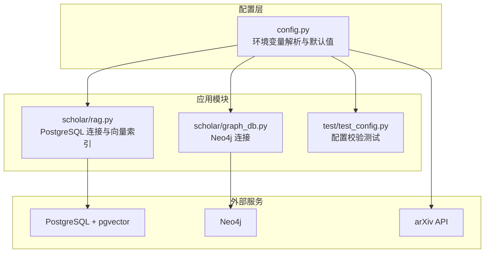
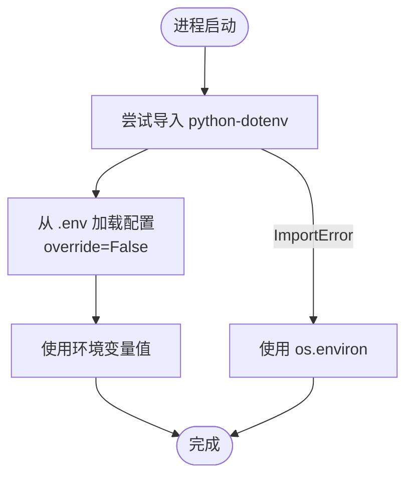
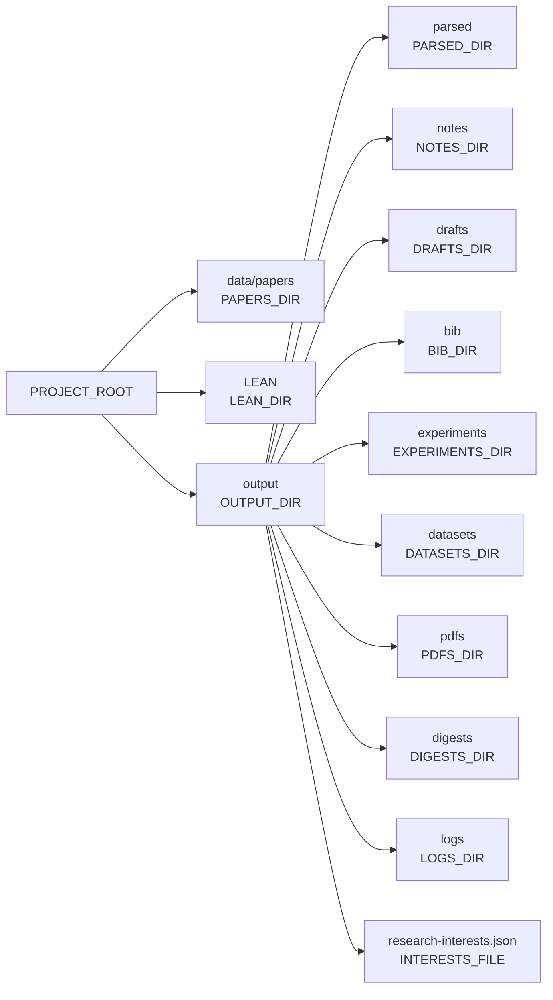
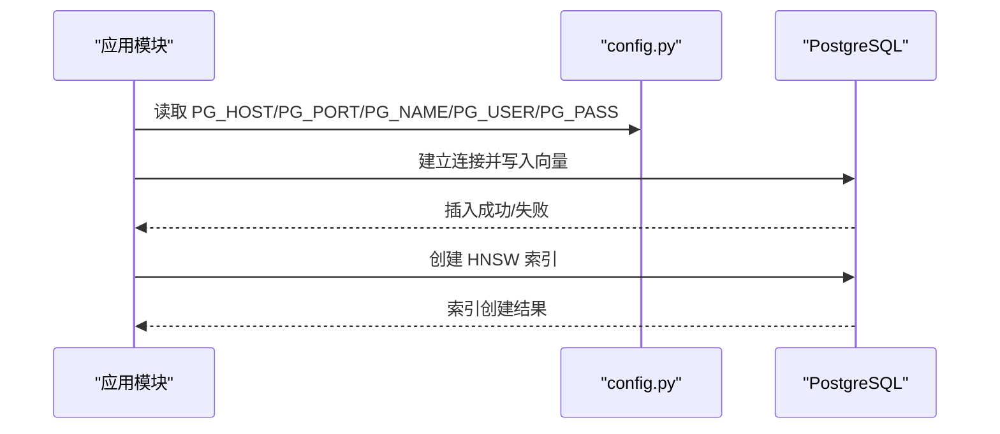
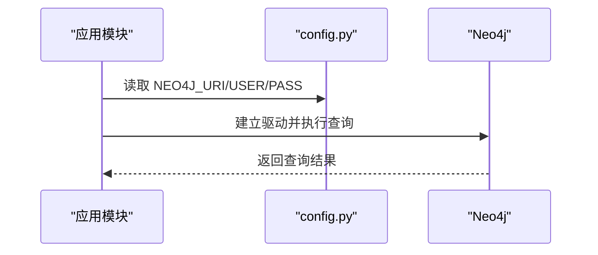
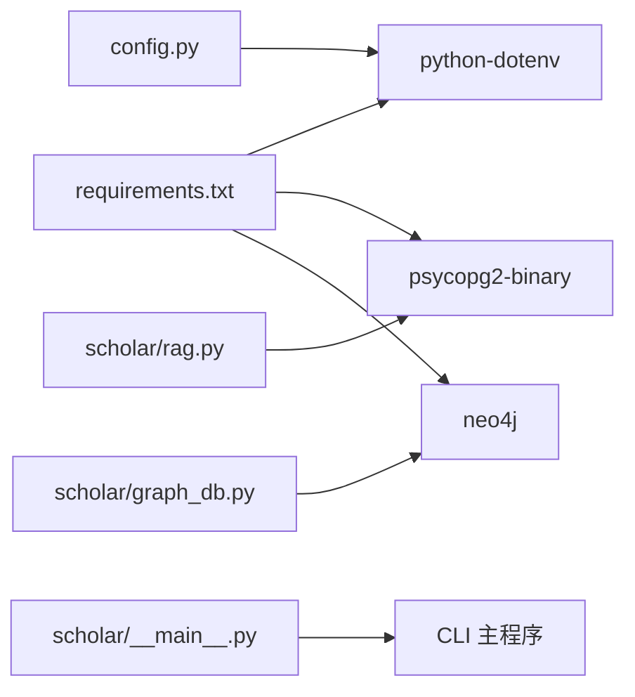

# 配置管理系统

<cite>
**本文档引用的文件**
- [config.py](file://scholar/config.py)
- [test_config.py](file://test/test_config.py)
- [requirements.txt](file://requirements.txt)
- [docker-compose.yml](file://infra/docker-compose.yml)
- [rag.py](file://scholar/rag.py)
- [graph_db.py](file://scholar/graph_db.py)
- [__main__.py](file://scholar/__main__.py)
</cite>

## 目录
1. [简介](#简介)
2. [项目结构](#项目结构)
3. [核心组件](#核心组件)
4. [架构总览](#架构总览)
5. [详细组件分析](#详细组件分析)
6. [依赖分析](#依赖分析)
7. [性能考虑](#性能考虑)
8. [故障排除指南](#故障排除指南)
9. [结论](#结论)

## 简介
本文件为配置管理系统的完整技术文档，聚焦于以下方面：
- 环境变量配置与加载机制
- 目录结构管理与默认路径
- 外部服务集成（PostgreSQL+pgvector、Neo4j、arXiv API、嵌入模型）
- 配置加载优先级、验证与错误处理策略
- 多环境配置管理、安全配置与性能优化建议

该系统通过 Python 的环境变量与 .env 文件进行集中式配置管理，并在运行时解析为可复用的配置对象，供各模块按需读取。

## 项目结构
配置相关的主文件位于 scholar/config.py，配套测试位于 test/test_config.py；外部服务通过 docker-compose.yml 提供默认容器化环境；数据库与图数据库访问在 rag.py 与 graph_db.py 中体现配置使用。

图表来源
- [config.py:1-119](file://scholar/config.py#L1-L119)
- [test_config.py:1-115](file://test/test_config.py#L1-L115)
- [docker-compose.yml:1-43](file://infra/docker-compose.yml#L1-L43)
- [rag.py:178-260](file://scholar/rag.py#L178-L260)
- [graph_db.py:51-87](file://scholar/graph_db.py#L51-L87)
- [requirements.txt:1-14](file://requirements.txt#L1-L14)

章节来源
- [config.py:1-119](file://scholar/config.py#L1-L119)
- [test_config.py:1-115](file://test/test_config.py#L1-L115)
- [docker-compose.yml:1-43](file://infra/docker-compose.yml#L1-L43)
- [requirements.txt:1-14](file://requirements.txt#L1-L14)

## 核心组件
本节概述配置系统的关键要素与职责划分。

- 环境变量加载与回退
  - 通过 python-dotenv 从项目根目录下的 .env 文件加载环境变量，且不覆盖已存在的进程环境变量，确保用户本地覆盖优先。
  - 若未安装 python-dotenv，则直接使用 os.environ，保证最小可用性。

- 项目根目录与数据目录
  - PROJECT_ROOT：scholar 目录的父目录，作为所有相对路径的基础。
  - PAPERS_DIR：论文原始数据目录，默认位于 PROJECT_ROOT/data/papers。
  - LEAN_DIR：Lean4 形式化项目目录，默认位于 PROJECT_ROOT/LEAN。
  - OUTPUT_DIR：输出根目录，默认位于 PROJECT_ROOT/output。
  - PARSED_DIR、NOTES_DIR、DRAFTS_DIR、BIB_DIR、EXPERIMENTS_DIR、DATASETS_DIR、PDFS_DIR、DIGESTS_DIR、LOGS_DIR：各类生成物的子目录，启动时自动创建。

- 数据库与图数据库配置
  - PostgreSQL（含 pgvector）：主机、端口、数据库名、用户名、密码。
  - Neo4j：URI、用户名、密码。

- RAG 嵌入配置
  - 提供者、模型、维度、API Key。

- LaTeX 与 Lean4 配置
  - LATEX_CMD：LaTeX 编译命令。
  - LEAN_PROJECT_DIR：Lean4 项目目录。

- arXiv API 工具
  - 支持查询构建、代理、超时与重试策略。

章节来源
- [config.py:11-18](file://scholar/config.py#L11-L18)
- [config.py:20-42](file://scholar/config.py#L20-L42)
- [config.py:44-66](file://scholar/config.py#L44-L66)
- [config.py:69-119](file://scholar/config.py#L69-L119)

## 架构总览
下图展示配置系统如何被外部服务与模块使用：

图表来源
- [config.py:1-119](file://scholar/config.py#L1-L119)
- [rag.py:178-260](file://scholar/rag.py#L178-L260)
- [graph_db.py:51-87](file://scholar/graph_db.py#L51-L87)
- [test_config.py:1-115](file://test/test_config.py#L1-L115)

## 详细组件分析

### 环境变量加载与优先级
- 加载位置：项目根目录下的 .env 文件。
- 加载策略：使用 load_dotenv(..., override=False)，避免覆盖已存在于 os.environ 的值。
- 回退机制：若导入 python-dotenv 失败，则直接使用 os.environ。
- 典型用途：用于本地开发覆盖默认配置，CI/CD 环境通过容器或平台变量注入。

图表来源
- [config.py:11-18](file://scholar/config.py#L11-L18)

章节来源
- [config.py:11-18](file://scholar/config.py#L11-L18)

### 目录结构管理
- 项目根目录：PROJECT_ROOT 由配置文件所在目录的父目录确定。
- 数据目录：
  - PAPERS_DIR：原始论文数据
  - LEAN_DIR：Lean4 项目
- 输出目录：
  - OUTPUT_DIR：统一输出根目录
  - 子目录：PARSED、NOTES、DRAFTS、BIB、EXPERIMENTS、DATASETS、PDFS、DIGESTS、LOGS
  - INTERESTS_FILE：研究兴趣 JSON 文件路径
- 自动创建：启动时对上述输出目录执行 mkdir(parents=True, exist_ok=True，确保新克隆仓库也能正常工作。

图表来源
- [config.py:20-42](file://scholar/config.py#L20-L42)

章节来源
- [config.py:20-42](file://scholar/config.py#L20-L42)

### 外部服务集成

#### PostgreSQL + pgvector
- 配置项：PG_HOST、PG_PORT、PG_NAME、PG_USER、PG_PASS
- 使用场景：结构化存储与 RAG 向量检索
- 容器默认：docker-compose.yml 将端口映射为 5433，并预设数据库、用户与密码
- 代码使用：在 rag.py 中通过配置建立连接、写入向量、创建 HNSW 索引

图表来源
- [config.py:44-50](file://scholar/config.py#L44-L50)
- [rag.py:182-237](file://scholar/rag.py#L182-L237)
- [docker-compose.yml:2-19](file://infra/docker-compose.yml#L2-L19)

章节来源
- [config.py:44-50](file://scholar/config.py#L44-L50)
- [rag.py:182-237](file://scholar/rag.py#L182-L237)
- [docker-compose.yml:2-19](file://infra/docker-compose.yml#L2-L19)

#### Neo4j
- 配置项：NEO4J_URI、NEO4J_USER、NEO4J_PASS
- 使用场景：概念图谱与引用网络
- 容器默认：docker-compose.yml 暴露浏览器与 Bolt 端口，设置默认认证
- 代码使用：graph_db.py 通过配置建立驱动并执行 Cypher 查询

图表来源
- [config.py:51-55](file://scholar/config.py#L51-L55)
- [graph_db.py:51-64](file://scholar/graph_db.py#L51-L64)
- [docker-compose.yml:21-39](file://infra/docker-compose.yml#L21-L39)

章节来源
- [config.py:51-55](file://scholar/config.py#L51-L55)
- [graph_db.py:51-64](file://scholar/graph_db.py#L51-L64)
- [docker-compose.yml:21-39](file://infra/docker-compose.yml#L21-L39)

#### arXiv API
- 功能：构建查询 URL、支持代理、超时与指数回退重试
- 关键参数：查询语句、最大结果数、排序方式
- 环境变量：SCHOLAR_ARXIV_TIMEOUT、SCHOLAR_ARXIV_RETRIES
- 代理：自动读取 HTTP_PROXY/HTTPS_PROXY 环境变量

图表来源
- [config.py:69-119](file://scholar/config.py#L69-L119)

章节来源
- [config.py:69-119](file://scholar/config.py#L69-L119)

#### RAG 嵌入配置
- 提供者：SCHOLAR_EMBEDDING_PROVIDER（默认 zhipu）
- 模型：SCHOLAR_EMBEDDING_MODEL（默认 embedding-2）
- 维度：SCHOLAR_EMBEDDING_DIM（默认 1024）
- API Key：SCHOLAR_EMBEDDING_API_KEY（默认空）

章节来源
- [config.py:56-61](file://scholar/config.py#L56-L61)

#### LaTeX 与 Lean4
- LaTeX：SCHOLAR_LATEX_CMD（默认 pdflatex）
- Lean4：LEAN_PROJECT_DIR（指向 LEAN_DIR）

章节来源
- [config.py:62-67](file://scholar/config.py#L62-L67)

### 配置验证与测试
- 路径正确性：测试确保 PROJECT_ROOT 为目录、PAPERS_DIR 位于 PROJECT_ROOT/data/papers 下、INTERESTS_FILE 位于 OUTPUT_DIR 下。
- 输出目录存在性：测试断言多个输出目录均存在。
- 默认值断言：测试断言 PostgreSQL、Neo4j、嵌入模型的默认值符合预期。
- arXiv 请求行为：测试验证 URL 构建、重试逻辑与全部失败时的异常抛出。

章节来源
- [test_config.py:10-44](file://test/test_config.py#L10-L44)
- [test_config.py:46-115](file://test/test_config.py#L46-L115)

## 依赖分析
- Python 依赖：typer、rich、psycopg2-binary、neo4j、python-dotenv、PyMuPDF、mcp 等。
- 配置对依赖的使用：
  - python-dotenv：用于加载 .env
  - psycopg2-binary：用于 PostgreSQL 连接
  - neo4j：用于 Neo4j 连接
  - rich、typer：用于 CLI 交互（入口文件中调用 CLI 主程序）

图表来源
- [requirements.txt:1-14](file://requirements.txt#L1-L14)
- [config.py:11-18](file://scholar/config.py#L11-L18)
- [rag.py:182-237](file://scholar/rag.py#L182-L237)
- [graph_db.py:51-64](file://scholar/graph_db.py#L51-L64)
- [__main__.py:1-8](file://scholar/__main__.py#L1-L8)

章节来源
- [requirements.txt:1-14](file://requirements.txt#L1-L14)
- [config.py:11-18](file://scholar/config.py#L11-L18)
- [rag.py:182-237](file://scholar/rag.py#L182-L237)
- [graph_db.py:51-64](file://scholar/graph_db.py#L51-L64)
- [__main__.py:1-8](file://scholar/__main__.py#L1-L8)

## 性能考虑
- 目录提前创建：启动时批量创建输出目录，避免后续 I/O 报错与重复检查开销。
- 数据库连接池：建议在生产环境中引入连接池以减少频繁连接/断开带来的延迟。
- 向量索引：HNSW 索引创建后可显著提升相似度检索性能，但首次创建会消耗资源，建议在初始化阶段执行。
- arXiv 请求：合理设置 SCHOLAR_ARXIV_TIMEOUT 与 SCHOLAR_ARXIV_RETRIES，避免过长等待或过度重试导致资源浪费。
- 代理与网络：在受限网络环境下启用代理可提高成功率，但需注意代理延迟对整体性能的影响。

## 故障排除指南
- 环境变量未生效
  - 确认 .env 文件位于项目根目录，且未被 .gitignore 忽略。
  - 确认 python-dotenv 已安装；若未安装，系统将回退到 os.environ。
- PostgreSQL 连接失败
  - 检查 SCHOLAR_PG_HOST/SCHOLAR_PG_PORT/SCHOLAR_PG_NAME/SCHOLAR_PG_USER/SCHOLAR_PG_PASS 是否与 docker-compose.yml 中的默认值一致。
  - 确认容器已启动并通过健康检查。
- Neo4j 连接失败
  - 检查 SCHOLAR_NEO4J_URI/SCHOLAR_NEO4J_USER/SCHOLAR_NEO4J_PASS 是否与 docker-compose.yml 中的默认值一致。
  - 确认容器已启动并通过健康检查。
- arXiv 请求失败
  - 检查 SCHOLAR_ARXIV_TIMEOUT 与 SCHOLAR_ARXIV_RETRIES 设置是否合理。
  - 确认 HTTP_PROXY/HTTPS_PROXY 环境变量配置正确。
- 目录不存在或权限不足
  - 确认 OUTPUT_DIR 及其子目录存在且具备写权限；系统会在启动时自动创建，若仍失败请检查权限。

章节来源
- [config.py:11-18](file://scholar/config.py#L11-L18)
- [config.py:44-66](file://scholar/config.py#L44-L66)
- [config.py:69-119](file://scholar/config.py#L69-L119)
- [docker-compose.yml:1-43](file://infra/docker-compose.yml#L1-L43)

## 结论
本配置管理系统通过集中化的环境变量与默认值设计，结合容器化默认服务与严格的测试保障，实现了高可移植、易维护的多环境配置方案。建议在生产环境中：
- 明确区分 .env 与 CI/CD 注入的环境变量优先级
- 为数据库与图数据库配置连接池与监控
- 对 arXiv 请求设置合理的超时与重试上限
- 在部署前执行一次目录与服务健康检查