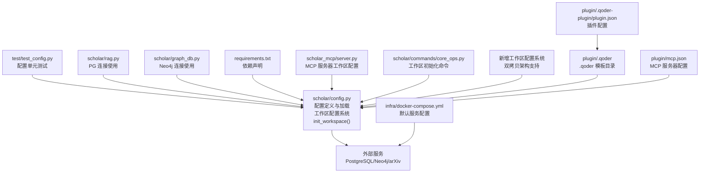
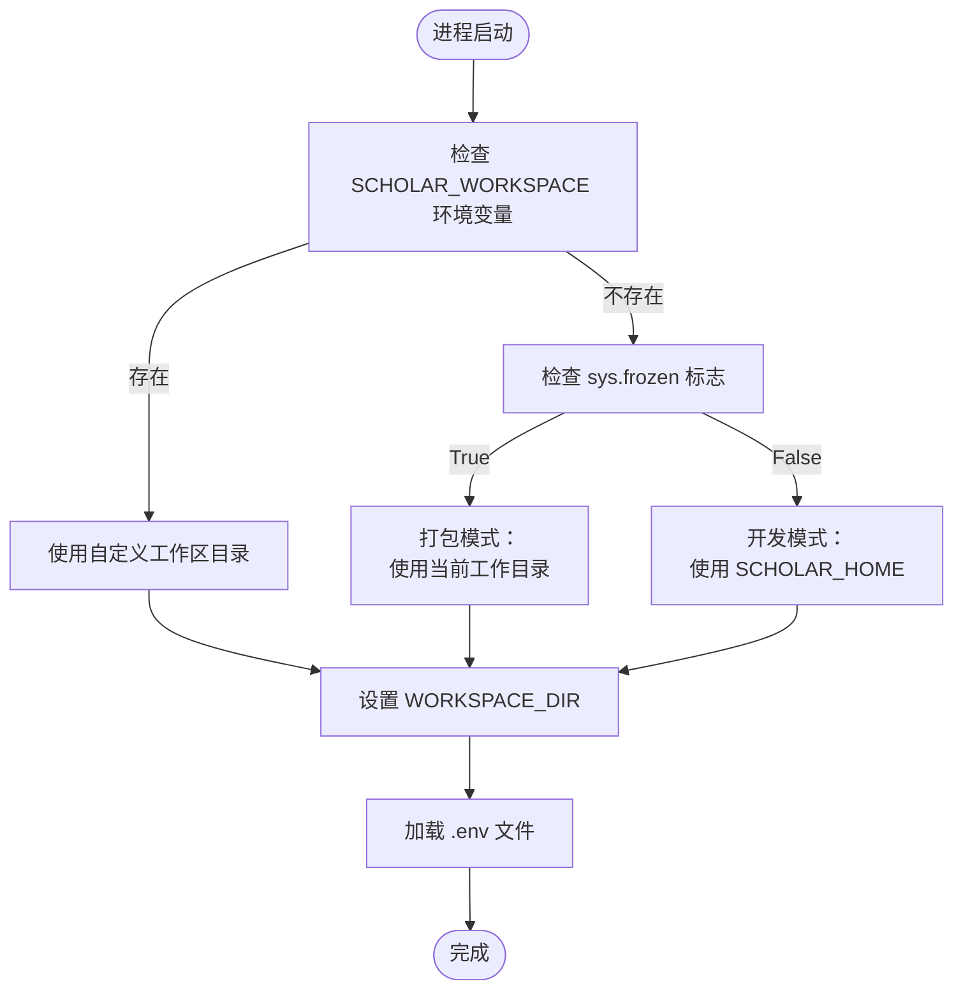
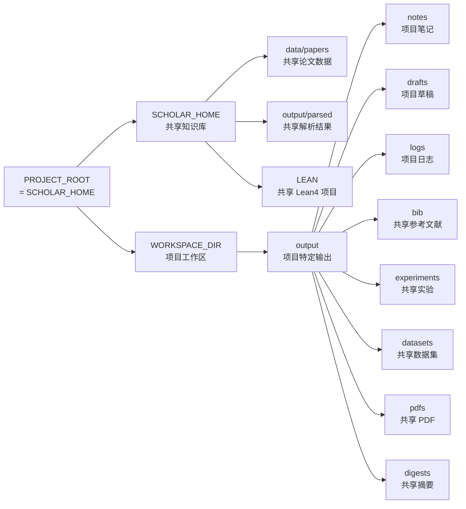
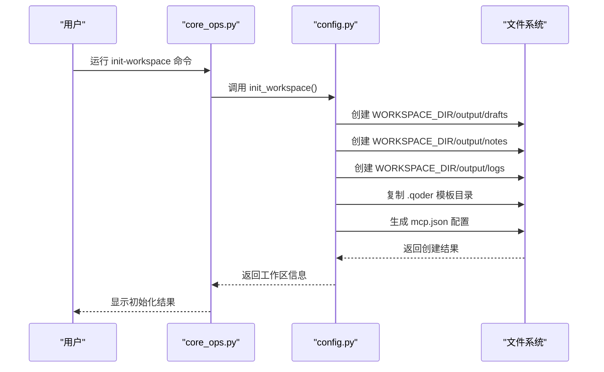
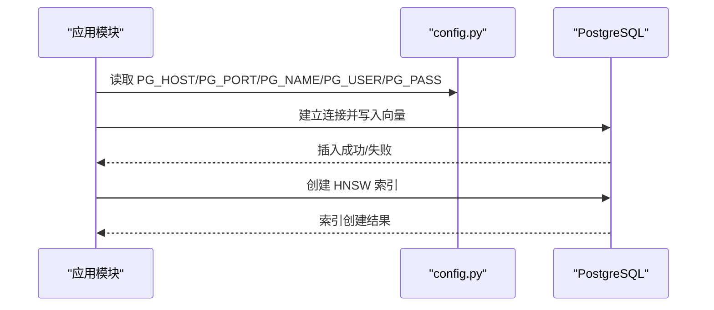
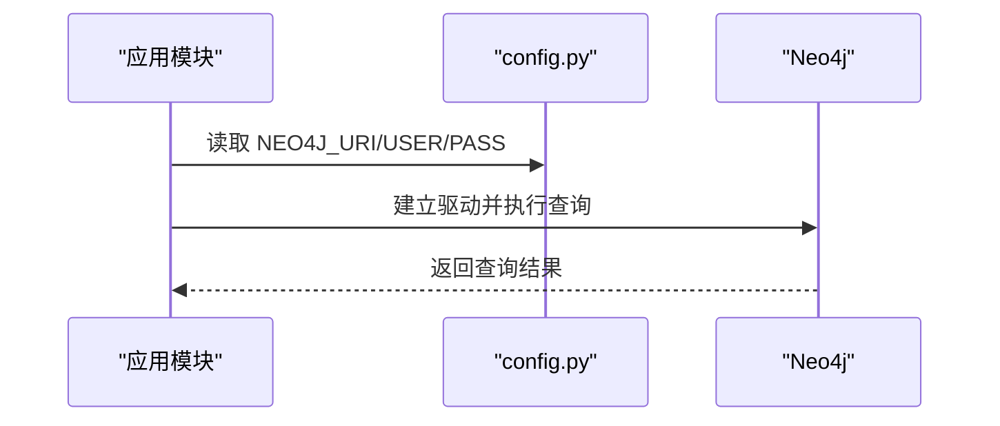
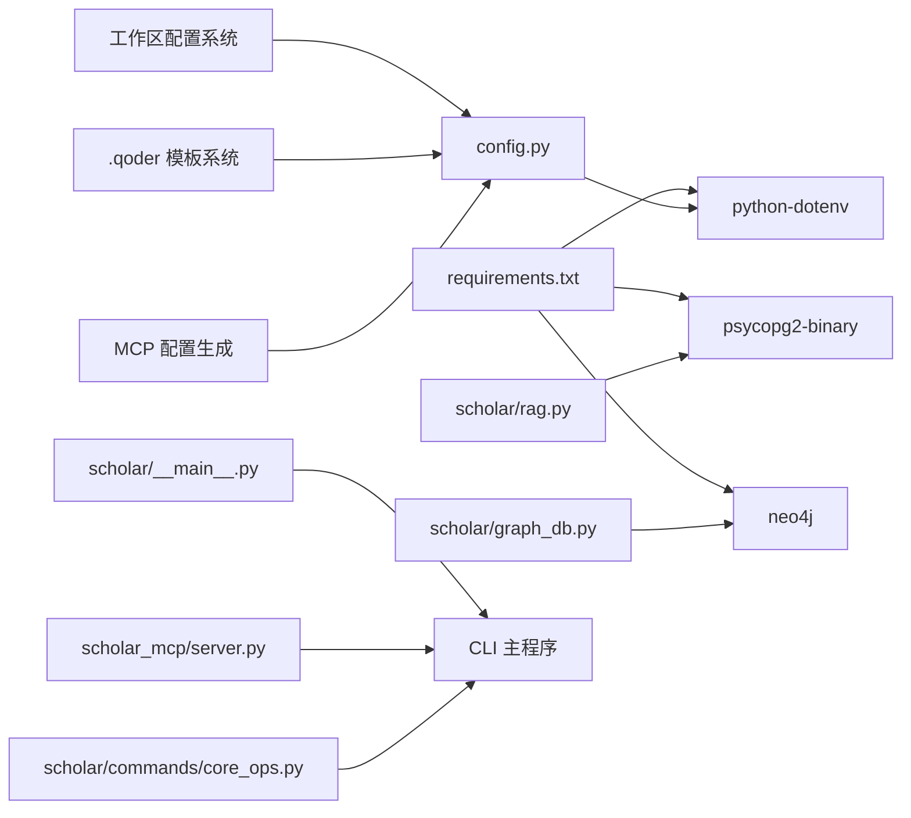

# 配置管理系统

<cite>
**本文档引用的文件**
- [config.py](file://scholar/config.py)
- [test_config.py](file://test/test_config.py)
- [core_ops.py](file://scholar/commands/core_ops.py)
- [requirements.txt](file://requirements.txt)
- [docker-compose.yml](file://infra/docker-compose.yml)
- [rag.py](file://scholar/rag.py)
- [graph_db.py](file://scholar/graph_db.py)
- [__main__.py](file://scholar/__main__.py)
- [server.py](file://scholar_mcp/server.py)
- [_shared.py](file://scholar/_shared.py)
- [conftest.py](file://test/conftest.py)
- [cli.py](file://scholar/cli.py)
- [plugin/mcp.json](file://plugin/mcp.json)
- [plugin/.qoder-plugin/plugin.json](file://plugin/.qoder-plugin/plugin.json)
</cite>

## 更新摘要
**变更内容**
- 新增工作区配置系统，支持双拷贝架构（共享知识库 + 项目特定输出）
- 添加 `_resolve_workspace_dir()` 函数和 `WORKSPACE_DIR` 变量
- 新增 `init_workspace()` 函数用于初始化工作区目录结构和模板复制
- 支持 `SCHOLAR_WORKSPACE` 环境变量自定义工作区位置
- 更新 MCP 服务器使用 `WORKSPACE_DIR` 作为工作目录
- 新增 `.qoder` 模板复制功能，支持技能、规则、钩子和命令的模板管理
- 增强项目隔离功能，支持多项目并行处理

## 目录
1. [简介](#简介)
2. [项目结构](#项目结构)
3. [核心组件](#核心组件)
4. [架构总览](#架构总览)
5. [详细组件分析](#详细组件分析)
6. [依赖分析](#依赖分析)
7. [性能考虑](#性能考虑)
8. [故障排除指南](#故障排除指南)
9. [结论](#结论)

## 简介
本文件为配置管理系统的完整技术文档，聚焦于以下方面：
- 环境变量配置与加载机制
- 目录结构管理与默认路径
- 外部服务集成（PostgreSQL+pgvector、Neo4j、arXiv API、嵌入模型）
- 配置加载优先级、验证与错误处理策略
- 多环境配置管理、安全配置与性能优化建议
- **新增**：双模式配置系统（开发模式与打包模式）
- **新增**：项目隔离功能与多项目支持
- **新增**：工作区配置系统与双拷贝架构
- **新增**：SCHOLAR_WORKSPACE 环境变量支持
- **新增**：`.qoder` 模板复制与 MCP 服务器配置

该系统通过 Python 的环境变量与 .env 文件进行集中式配置管理，并在运行时解析为可复用的配置对象，供各模块按需读取。新版本引入了智能的运行模式检测、项目隔离机制、工作区配置系统和完整的模板管理功能。

## 项目结构
配置相关的主文件位于 scholar/config.py，配套测试位于 test/test_config.py；外部服务通过 docker-compose.yml 提供默认容器化环境；数据库与图数据库访问在 rag.py 与 graph_db.py 中体现配置使用。新增的工作区配置系统通过 `init_workspace()` 函数支持双拷贝架构和模板复制。



**图表来源**
- [config.py:1-313](file://scholar/config.py#L1-L313)
- [test_config.py:1-115](file://test/test_config.py#L1-L115)
- [docker-compose.yml:1-43](file://infra/docker-compose.yml#L1-L43)
- [rag.py:178-260](file://scholar/rag.py#L178-L260)
- [graph_db.py:51-87](file://scholar/graph_db.py#L51-L87)
- [requirements.txt:1-14](file://requirements.txt#L1-L14)
- [server.py:30-40](file://scholar_mcp/server.py#L30-L40)
- [core_ops.py:75-106](file://scholar/commands/core_ops.py#L75-L106)
- [plugin/mcp.json:1-16](file://plugin/mcp.json#L1-L16)
- [plugin/.qoder-plugin/plugin.json:1-23](file://plugin/.qoder-plugin/plugin.json#L1-L23)

**章节来源**
- [config.py:1-313](file://scholar/config.py#L1-L313)
- [test_config.py:1-115](file://test/test_config.py#L1-L115)
- [docker-compose.yml:1-43](file://infra/docker-compose.yml#L1-L43)
- [requirements.txt:1-14](file://requirements.txt#L1-L14)

## 核心组件
本节概述配置系统的关键要素与职责划分。

- **运行模式检测与双模式支持**
  - **开发模式**：PROJECT_ROOT = 源码目录（python -m scholar），WORKSPACE_DIR = SCHOLAR_HOME
  - **打包模式**：PROJECT_ROOT = ~/.scholar-studio/（scholar.exe），WORKSPACE_DIR = 当前工作目录
  - 通过 `getattr(sys, 'frozen', False)` 检测是否为打包模式

- **智能环境变量加载**
  - 通过 python-dotenv 从 SCHOLAR_HOME 目录下的 .env 文件加载环境变量
  - 不覆盖已存在的进程环境变量，确保用户本地覆盖优先
  - 若未安装 python-dotenv，则直接使用 os.environ

- **工作区配置系统**
  - **SCHOLAR_WORKSPACE**：工作区目录，支持通过环境变量自定义
  - **WORKSPACE_DIR**：工作区根目录，优先级：SCHOLAR_WORKSPACE > 打包模式当前目录 > SCHOLAR_HOME
  - **双拷贝架构**：共享知识库（SCHOLAR_HOME）+ 项目特定输出（WORKSPACE_DIR）

- **项目根目录与数据目录**
  - **SCHOLAR_HOME**：知识库根目录，根据运行模式自动确定
  - **PROJECT_ROOT**：项目根目录，等于 SCHOLAR_HOME
  - **PAPERS_DIR**：论文原始数据目录，默认位于 PROJECT_ROOT/data/papers
  - **LEAN_DIR**：Lean4 形式化项目目录，默认位于 PROJECT_ROOT/LEAN
  - **OUTPUT_DIR**：输出根目录，默认位于 PROJECT_ROOT/output
  - **PARSED_DIR**：解析后的论文数据，位于 PROJECT_ROOT/output/parsed（共享知识库）
  - **NOTES_DIR、DRAFTS_DIR、LOGS_DIR**：项目特定输出目录，位于 WORKSPACE_DIR/output/{notes,drafts,logs}

- **项目隔离功能**
  - **SCHOLAR_PROJECT_NAME**：当前项目名称，默认使用 PROJECT_ROOT.name
  - **sanitize_project_name()**：将原始项目名转为文件系统安全的短字符串
  - **project_logs_dir()**：返回指定项目的日志目录：output/logs/<project>/
  - **project_drafts_dir()**：返回指定项目的草稿目录：output/drafts/<project>/

- **数据库与图数据库配置**
  - PostgreSQL（含 pgvector）：主机、端口、数据库名、用户名、密码
  - Neo4j：URI、用户名、密码

- **RAG 嵌入配置**
  - 提供者、模型、维度、API Key

- **LaTeX 与 Lean4 配置**
  - LATEX_CMD：LaTeX 编译命令
  - LEAN_PROJECT_DIR：Lean4 项目目录

- **arXiv API 工具**
  - 支持查询构建、代理、超时与重试策略

- **工作区初始化系统**
  - **init_workspace()**：初始化工作区目录结构，复制 .qoder 模板
  - **模板复制**：从源目录复制技能、规则、钩子、命令和 MCP 配置
  - **MCP 配置生成**：自动生成针对工作区的 mcp.json 配置

**章节来源**
- [config.py:16-36](file://scholar/config.py#L16-L36)
- [config.py:37-52](file://scholar/config.py#L37-L52)
- [config.py:54-65](file://scholar/config.py#L54-L65)
- [config.py:67-90](file://scholar/config.py#L67-L90)
- [config.py:91-111](file://scholar/config.py#L91-L111)
- [config.py:180-236](file://scholar/config.py#L180-L236)

## 架构总览
下图展示配置系统如何被外部服务与模块使用，包括新的双模式支持、工作区配置系统、双拷贝架构和模板管理：

```mermaid
graph TB
subgraph "配置层"
CFG["config.py<br/>环境变量解析与默认值<br/>双模式检测<br/>工作区配置系统<br/>init_workspace()"]
END
subgraph "应用模块"
RAG["scholar/rag.py<br/>PostgreSQL 连接与向量索引"]
GRAPH["scholar/graph_db.py<br/>Neo4j 连接"]
TEST["test/test_config.py<br/>配置校验测试"]
MCP["scholar_mcp/server.py<br/>MCP 服务器工作区配置"]
CORE["scholar/commands/core_ops.py<br/>工作区初始化命令"]
CLI["scholar/cli.py<br/>CLI 入口点"]
END
subgraph "外部服务"
PG["PostgreSQL + pgvector"]
NEO["Neo4j"]
ARX["arXiv API"]
END
subgraph "双拷贝架构"
SHARED["共享知识库<br/>SCHOLAR_HOME<br/>data/papers/<br/>output/parsed/"]
WS["工作区<br/>WORKSPACE_DIR<br/>output/notes/<br/>output/drafts/<br/>output/logs/"]
END
subgraph "模板管理系统"
QODER[".qoder 模板目录<br/>技能/规则/钩子/命令"]
MCPJSON["mcp.json 配置<br/>针对工作区定制"]
PLUGIN[".qoder-plugin<br/>插件配置"]
END
CFG --> RAG
CFG --> GRAPH
CFG --> TEST
CFG --> MCP
CFG --> CORE
CFG --> CLI
RAG --> PG
GRAPH --> NEO
CFG --> ARX
CFG --> SHARED
CFG --> WS
CFG --> QODER
CFG --> MCPJSON
CFG --> PLUGIN
```

**图表来源**
- [config.py:1-313](file://scholar/config.py#L1-L313)
- [rag.py:178-260](file://scholar/rag.py#L178-L260)
- [graph_db.py:51-87](file://scholar/graph_db.py#L51-L87)
- [test_config.py:1-115](file://test/test_config.py#L1-L115)
- [server.py:30-40](file://scholar_mcp/server.py#L30-L40)
- [core_ops.py:75-106](file://scholar/commands/core_ops.py#L75-L106)
- [cli.py:1-25](file://scholar/cli.py#L1-L25)
- [plugin/mcp.json:1-16](file://plugin/mcp.json#L1-L16)
- [plugin/.qoder-plugin/plugin.json:1-23](file://plugin/.qoder-plugin/plugin.json#L1-L23)

## 详细组件分析

### 工作区配置系统

#### 工作区目录解析
- **优先级规则**：SCHOLAR_WORKSPACE 环境变量 > 打包模式当前目录 > SCHOLAR_HOME
- **开发模式**：WORKSPACE_DIR = SCHOLAR_HOME（零行为变更）
- **打包模式**：WORKSPACE_DIR = 当前工作目录（CWD）
- **自定义工作区**：通过设置 SCHOLAR_WORKSPACE 环境变量指定任意目录



**图表来源**
- [config.py:38-52](file://scholar/config.py#L38-L52)

#### 双拷贝架构设计
- **共享知识库**：位于 SCHOLAR_HOME，包含共享的数据和解析结果
- **项目特定输出**：位于 WORKSPACE_DIR，包含每个项目的笔记、草稿和日志
- **目录分离**：parsed/ 目录在共享知识库中，notes/、drafts/、logs/ 目录在工作区中



**图表来源**
- [config.py:91-111](file://scholar/config.py#L91-L111)
- [config.py:180-236](file://scholar/config.py#L180-L236)

**章节来源**
- [config.py:38-52](file://scholar/config.py#L38-L52)
- [config.py:91-111](file://scholar/config.py#L91-L111)
- [config.py:180-236](file://scholar/config.py#L180-L236)

### 工作区初始化流程

#### init_workspace() 函数
- **功能**：初始化工作区目录结构和模板复制
- **创建目录**：WORKSPACE_DIR/output/{drafts,notes,logs}
- **共享策略**：parsed/ 目录保持在 SCHOLAR_HOME（不移动）
- **模板复制**：从源目录复制 .qoder 模板（技能、规则、钩子、命令）
- **MCP 配置**：生成针对工作区的 mcp.json 配置文件
- **返回信息**：包含工作区路径、已创建的目录列表、模板复制状态等



**图表来源**
- [core_ops.py:75-106](file://scholar/commands/core_ops.py#L75-L106)
- [config.py:180-236](file://scholar/config.py#L180-L236)

**章节来源**
- [config.py:180-236](file://scholar/config.py#L180-L236)
- [core_ops.py:75-106](file://scholar/commands/core_ops.py#L75-L106)

### 模板管理系统

#### .qoder 模板复制
- **源目录**：从源码目录的 `.qoder` 目录复制
- **目标目录**：复制到工作区的 `.qoder` 目录
- **忽略模式**：跳过 repowiki、plans、__pycache__、*.log 等目录
- **模板内容**：包含技能、规则、钩子、命令等学术研究工具

#### MCP 配置生成
- **工作区定制**：生成针对当前工作区的 mcp.json 配置
- **命令路径**：设置正确的 Python 命令和参数
- **工作目录**：将 cwd 设置为 WORKSPACE_DIR
- **环境变量**：继承必要的数据库连接配置

**章节来源**
- [config.py:202-236](file://scholar/config.py#L202-L236)
- [plugin/mcp.json:1-16](file://plugin/mcp.json#L1-L16)
- [plugin/.qoder-plugin/plugin.json:1-23](file://plugin/.qoder-plugin/plugin.json#L1-L23)

### 双模式配置系统

#### 运行模式检测
- **开发模式**：当 `sys.frozen` 为 False 时，使用源码目录作为 PROJECT_ROOT 和 WORKSPACE_DIR
- **打包模式**：当 `sys.frozen` 为 True 时，使用 `~/.scholar-studio/` 作为 PROJECT_ROOT，WORKSPACE_DIR 为当前工作目录
- **SCHOLAR_HOME**：知识库根目录，根据运行模式自动确定

#### 环境变量加载策略
- **开发模式**：同时加载 SCHOLAR_HOME 目录和源码目录的 .env 文件
- **打包模式**：仅加载 SCHOLAR_HOME 目录的 .env 文件
- **优先级**：SCHOLAR_HOME 目录的 .env 优先级高于源码目录的 .env

**章节来源**
- [config.py:20-36](file://scholar/config.py#L20-L36)
- [config.py:54-65](file://scholar/config.py#L54-L65)

### 项目隔离功能

#### 项目名称管理
- **SCHOLAR_PROJECT_NAME**：通过环境变量 `SCHOLAR_PROJECT_NAME` 设置，若未设置则使用 `PROJECT_ROOT.name`
- **sanitize_project_name()**：将原始项目名转换为文件系统安全的短字符串，限制长度为50字符

#### 项目特定目录
- **project_logs_dir()**：返回指定项目的日志目录：`output/logs/<project>/`
- **project_drafts_dir()**：返回指定项目的草稿目录：`output/drafts/<project>/`

**章节来源**
- [config.py:67-90](file://scholar/config.py#L67-L90)

### 外部服务集成

#### PostgreSQL + pgvector
- 配置项：PG_HOST、PG_PORT、PG_NAME、PG_USER、PG_PASS
- 使用场景：结构化存储与 RAG 向量检索
- 容器默认：docker-compose.yml 将端口映射为 5433，并预设数据库、用户与密码
- 代码使用：在 rag.py 中通过配置建立连接、写入向量、创建 HNSW 索引



**图表来源**
- [config.py:238-244](file://scholar/config.py#L238-L244)
- [rag.py:182-237](file://scholar/rag.py#L182-L237)
- [docker-compose.yml:2-19](file://infra/docker-compose.yml#L2-L19)

**章节来源**
- [config.py:238-244](file://scholar/config.py#L238-L244)
- [rag.py:182-237](file://scholar/rag.py#L182-L237)
- [docker-compose.yml:2-19](file://infra/docker-compose.yml#L2-L19)

#### Neo4j
- 配置项：NEO4J_URI、NEO4J_USER、NEO4J_PASS
- 使用场景：概念图谱与引用网络
- 容器默认：docker-compose.yml 暴露浏览器与 Bolt 端口，设置默认认证
- 代码使用：graph_db.py 通过配置建立驱动并执行 Cypher 查询



**图表来源**
- [config.py:245-249](file://scholar/config.py#L245-L249)
- [graph_db.py:51-64](file://scholar/graph_db.py#L51-L64)
- [docker-compose.yml:21-39](file://infra/docker-compose.yml#L21-L39)

**章节来源**
- [config.py:245-249](file://scholar/config.py#L245-L249)
- [graph_db.py:51-64](file://scholar/graph_db.py#L51-L64)
- [docker-compose.yml:21-39](file://infra/docker-compose.yml#L21-L39)

#### arXiv API
- 功能：构建查询 URL、支持代理、超时与指数回退重试
- 关键参数：查询语句、最大结果数、排序方式
- 环境变量：SCHOLAR_ARXIV_TIMEOUT、SCHOLAR_ARXIV_RETRIES
- 代理：自动读取 HTTP_PROXY/HTTPS_PROXY 环境变量


**图表来源**
- [config.py:266-313](file://scholar/config.py#L266-L313)

**章节来源**
- [config.py:266-313](file://scholar/config.py#L266-L313)

#### RAG 嵌入配置
- 提供者：SCHOLAR_EMBEDDING_PROVIDER（默认 zhipu）
- 模型：SCHOLAR_EMBEDDING_MODEL（默认 embedding-2）
- 维度：SCHOLAR_EMBEDDING_DIM（默认 1024）
- API Key：SCHOLAR_EMBEDDING_API_KEY（默认空）

**章节来源**
- [config.py:250-255](file://scholar/config.py#L250-L255)

#### LaTeX 与 Lean4
- LaTeX：SCHOLAR_LATEX_CMD（默认 pdflatex）
- Lean4：LEAN_PROJECT_DIR（指向 LEAN_DIR）

**章节来源**
- [config.py:256-261](file://scholar/config.py#L256-L261)

### 配置验证与测试
- **路径正确性**：测试确保 PROJECT_ROOT 为目录、PAPERS_DIR 位于 PROJECT_ROOT/data/papers 下、INTERESTS_FILE 位于 OUTPUT_DIR 下。
- **输出目录存在性**：测试断言多个输出目录均存在，包括新增的 NOTES_DIR、DRAFTS_DIR、LOGS_DIR。
- **默认值断言**：测试断言 PostgreSQL、Neo4j、嵌入模型的默认值符合预期。
- **arXiv 请求行为**：测试验证 URL 构建、重试逻辑与全部失败时的异常抛出。
- **双模式支持**：测试验证开发模式和打包模式下的路径解析正确性。
- **工作区配置测试**：验证 WORKSPACE_DIR 解析逻辑和 init_workspace() 函数行为。
- **模板复制测试**：验证 .qoder 模板复制和 MCP 配置生成功能。

**章节来源**
- [test_config.py:10-44](file://test/test_config.py#L10-L44)
- [test_config.py:46-115](file://test/test_config.py#L46-L115)

## 依赖分析
- **Python 依赖**：typer、rich、psycopg2-binary、neo4j、python-dotenv、PyMuPDF、mcp 等。
- **配置对依赖的使用**：
  - python-dotenv：用于加载 .env
  - psycopg2-binary：用于 PostgreSQL 连接
  - neo4j：用于 Neo4j 连接
  - rich、typer：用于 CLI 交互（入口文件中调用 CLI 主程序）



**图表来源**
- [requirements.txt:1-14](file://requirements.txt#L1-L14)
- [config.py:54-65](file://scholar/config.py#L54-L65)
- [rag.py:182-237](file://scholar/rag.py#L182-L237)
- [graph_db.py:51-64](file://scholar/graph_db.py#L51-L64)
- [__main__.py:1-8](file://scholar/__main__.py#L1-L8)
- [server.py:30-40](file://scholar_mcp/server.py#L30-L40)
- [core_ops.py:75-106](file://scholar/commands/core_ops.py#L75-L106)
- [plugin/mcp.json:1-16](file://plugin/mcp.json#L1-L16)

**章节来源**
- [requirements.txt:1-14](file://requirements.txt#L1-L14)
- [config.py:54-65](file://scholar/config.py#L54-L65)
- [rag.py:182-237](file://scholar/rag.py#L182-L237)
- [graph_db.py:51-64](file://scholar/graph_db.py#L51-L64)
- [__main__.py:1-8](file://scholar/__main__.py#L1-L8)

## 性能考虑
- **目录提前创建**：启动时批量创建输出目录，避免后续 I/O 报错与重复检查开销。
- **数据库连接池**：建议在生产环境中引入连接池以减少频繁连接/断开带来的延迟。
- **向量索引**：HNSW 索引创建后可显著提升相似度检索性能，但首次创建会消耗资源，建议在初始化阶段执行。
- **arXiv 请求**：合理设置 SCHOLAR_ARXIV_TIMEOUT 与 SCHOLAR_ARXIV_RETRIES，避免过长等待或过度重试导致资源浪费。
- **代理与网络**：在受限网络环境下启用代理可提高成功率，但需注意代理延迟对整体性能的影响。
- **项目隔离**：使用项目特定的目录结构可避免不同项目间的文件冲突，提高并发处理能力。
- **双拷贝架构优化**：共享知识库减少磁盘占用，项目特定输出便于版本控制和备份。
- **模板复制优化**：使用 shutil.copytree 进行高效的大规模目录复制，忽略不必要的文件类型。
- **MCP 配置缓存**：生成的 mcp.json 配置文件可重复使用，避免每次启动时重新生成。

## 故障排除指南
- **环境变量未生效**
  - 确认 .env 文件位于正确的目录（开发模式：源码目录；打包模式：~/.scholar-studio/）
  - 确认 python-dotenv 已安装；若未安装，系统将回退到 os.environ。
  - 检查运行模式是否正确识别（开发模式 vs 打包模式）。

- **路径解析错误**
  - 确认 `sys.frozen` 标志是否正确设置
  - 检查 `SCHOLAR_HOME` 环境变量是否正确设置
  - 验证 `SCHOLAR_WORKSPACE` 环境变量设置（如使用）
  - 检查项目根目录权限是否正确

- **工作区配置问题**
  - 确认 `SCHOLAR_WORKSPACE` 环境变量设置正确（如使用）
  - 检查 `init_workspace()` 函数是否正确创建目录
  - 验证工作区目录权限是否正确
  - 确认双拷贝架构中共享知识库和工作区目录的分离
  - 检查 .qoder 模板目录是否存在和可访问

- **模板复制问题**
  - 确认源码目录中的 `.qoder` 目录存在
  - 检查目标工作区目录是否有足够的写权限
  - 验证忽略模式是否正确过滤不需要的文件类型
  - 确认生成的 mcp.json 配置文件格式正确

- **项目隔离问题**
  - 确认 `SCHOLAR_PROJECT_NAME` 环境变量设置正确
  - 检查 `sanitize_project_name()` 函数是否正确处理特殊字符
  - 验证项目特定目录是否正确创建

- **PostgreSQL 连接失败**
  - 检查 SCHOLAR_PG_HOST/SCHOLAR_PG_PORT/SCHOLAR_PG_NAME/SCHOLAR_PG_USER/SCHOLAR_PG_PASS 是否与 docker-compose.yml 中的默认值一致。
  - 确认容器已启动并通过健康检查。

- **Neo4j 连接失败**
  - 检查 SCHOLAR_NEO4J_URI/SCHOLAR_NEO4J_USER/SCHOLAR_NEO4J_PASS 是否与 docker-compose.yml 中的默认值一致。
  - 确认容器已启动并通过健康检查。

- **arXiv 请求失败**
  - 检查 SCHOLAR_ARXIV_TIMEOUT 与 SCHOLAR_ARXIV_RETRIES 设置是否合理。
  - 确认 HTTP_PROXY/HTTPS_PROXY 环境变量配置正确。

- **目录不存在或权限不足**
  - 确认 OUTPUT_DIR 及其子目录存在且具备写权限；系统会在启动时自动创建，若仍失败请检查权限。
  - 验证工作区目录的创建和权限设置。

- **MCP 服务器启动失败**
  - 检查生成的 mcp.json 配置文件是否正确
  - 确认 Python 路径和参数设置正确
  - 验证工作区目录权限是否正确

**章节来源**
- [config.py:20-36](file://scholar/config.py#L20-L36)
- [config.py:38-52](file://scholar/config.py#L38-L52)
- [config.py:54-65](file://scholar/config.py#L54-L65)
- [config.py:67-90](file://scholar/config.py#L67-L90)
- [config.py:180-236](file://scholar/config.py#L180-L236)
- [docker-compose.yml:1-43](file://infra/docker-compose.yml#L1-L43)
- [plugin/mcp.json:1-16](file://plugin/mcp.json#L1-L16)

## 结论
本配置管理系统通过集中化的环境变量与默认值设计，结合容器化默认服务、严格的测试保障、新增的双模式支持、项目隔离功能、工作区配置系统和完整的模板管理，实现了高可移植、易维护的多环境配置方案。

**主要改进**：
- **双模式支持**：智能区分开发模式和打包模式，支持不同的配置加载策略
- **项目隔离**：通过项目名称和专用目录实现多项目并行处理
- **工作区配置系统**：支持自定义工作区目录，实现双拷贝架构
- **双拷贝架构**：共享知识库 + 项目特定输出，平衡存储效率和项目隔离需求
- **增强的环境变量管理**：支持更灵活的配置覆盖和优先级控制
- **模板管理系统**：完整的 .qoder 模板复制和 MCP 配置生成
- **MCP 服务器集成**：工作区特定的 MCP 服务器配置和执行环境

**新增功能特性**：
- **SCHOLAR_WORKSPACE 环境变量**：允许用户自定义工作区位置
- **init_workspace() 函数**：提供工作区初始化和目录结构管理
- **.qoder 模板复制**：支持技能、规则、钩子和命令的模板管理
- **MCP 服务器工作区支持**：使用 WORKSPACE_DIR 作为命令执行的工作目录
- **自动配置生成**：为每个工作区生成独立的 mcp.json 配置文件

建议在生产环境中：
- 明确区分 .env 与 CI/CD 注入的环境变量优先级
- 为数据库与图数据库配置连接池与监控
- 对 arXiv 请求设置合理的超时与重试上限
- 在部署前执行一次目录与服务健康检查
- 利用工作区配置系统支持多项目并行处理场景
- 合理规划共享知识库和工作区的存储空间
- 定期备份工作区中的项目特定输出数据
- 利用模板系统标准化项目配置和工具链
- 确保 .qoder 模板的版本管理和更新策略