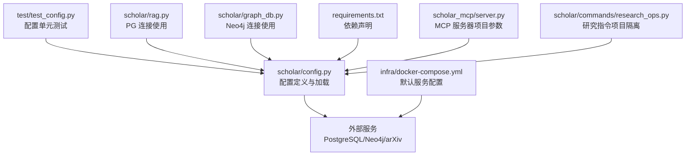
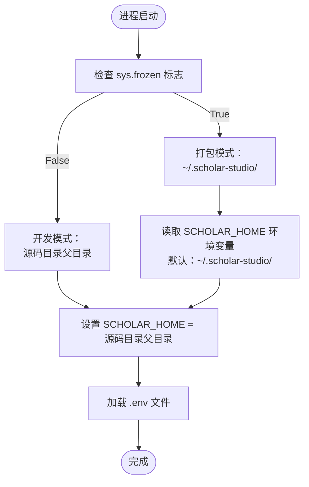
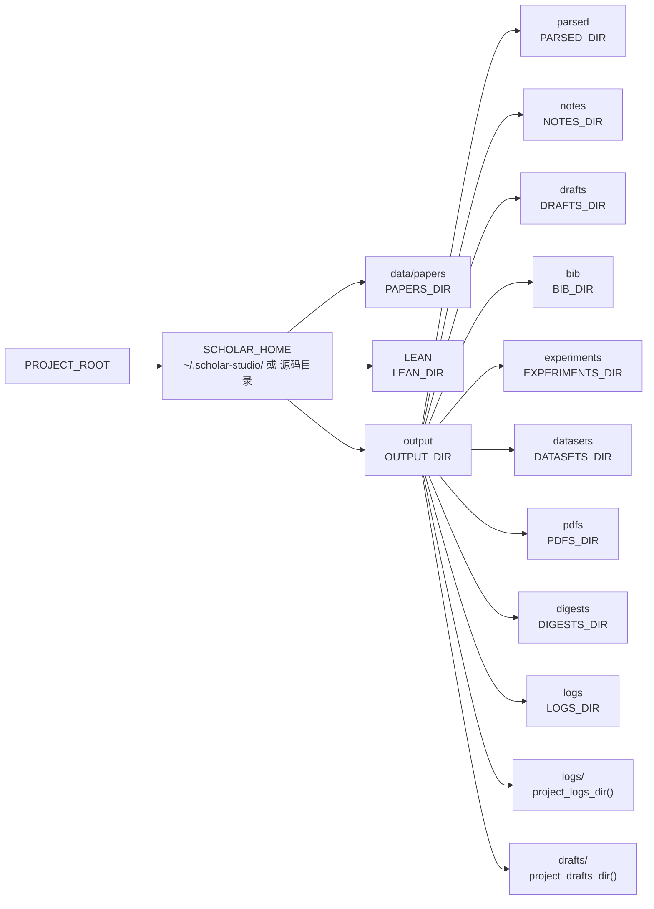
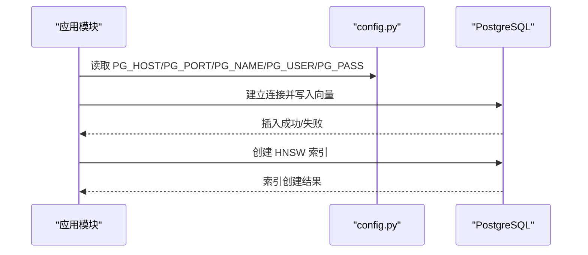
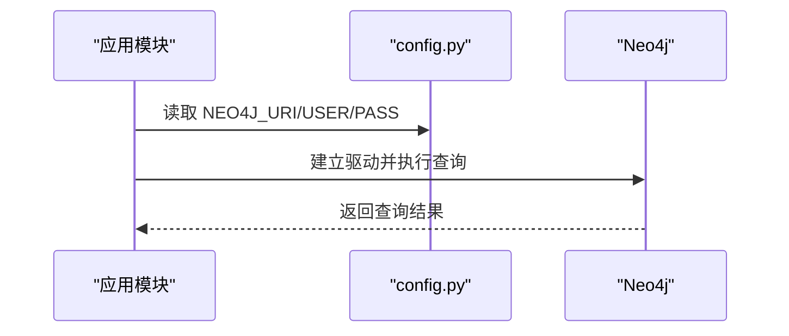
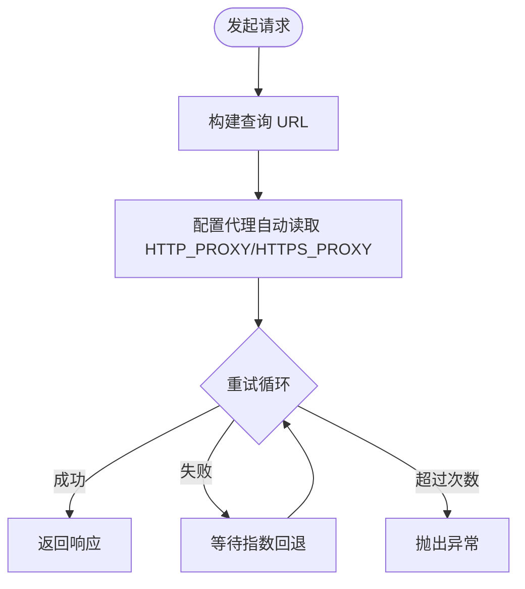
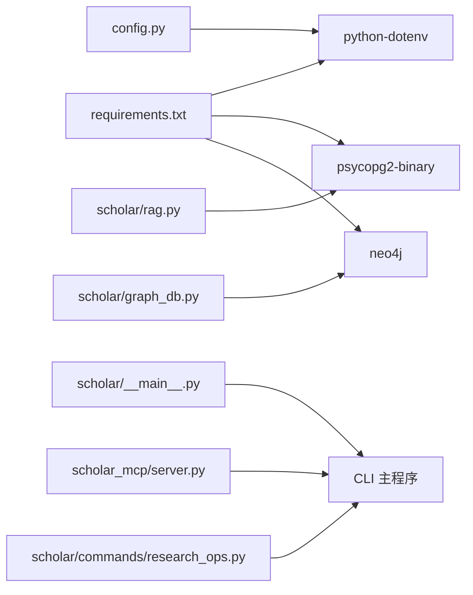

# 配置管理系统

<cite>
**本文档引用的文件**
- [config.py](file://scholar/config.py)
- [test_config.py](file://test/test_config.py)
- [requirements.txt](file://requirements.txt)
- [docker-compose.yml](file://infra/docker-compose.yml)
- [rag.py](file://scholar/rag.py)
- [graph_db.py](file://scholar/graph_db.py)
- [__main__.py](file://scholar/__main__.py)
- [server.py](file://scholar_mcp/server.py)
- [research_ops.py](file://scholar/commands/research_ops.py)
- [_shared.py](file://scholar/_shared.py)
- [conftest.py](file://test/conftest.py)
</cite>

## 目录
1. [简介](#简介)
2. [项目结构](#项目结构)
3. [核心组件](#核心组件)
4. [架构总览](#架构总览)
5. [详细组件分析](#详细组件分析)
6. [依赖分析](#依赖分析)
7. [性能考虑](#性能考虑)
8. [故障排除指南](#故障排除指南)
9. [结论](#结论)

## 简介
本文件为配置管理系统的完整技术文档，聚焦于以下方面：
- 环境变量配置与加载机制
- 目录结构管理与默认路径
- 外部服务集成（PostgreSQL+pgvector、Neo4j、arXiv API、嵌入模型）
- 配置加载优先级、验证与错误处理策略
- 多环境配置管理、安全配置与性能优化建议
- **新增**：双模式配置系统（开发模式与打包模式）
- **新增**：项目隔离功能与多项目支持

该系统通过 Python 的环境变量与 .env 文件进行集中式配置管理，并在运行时解析为可复用的配置对象，供各模块按需读取。新版本引入了智能的运行模式检测和项目隔离机制。

## 项目结构
配置相关的主文件位于 scholar/config.py，配套测试位于 test/test_config.py；外部服务通过 docker-compose.yml 提供默认容器化环境；数据库与图数据库访问在 rag.py 与 graph_db.py 中体现配置使用。



**图表来源**
- [config.py:1-237](file://scholar/config.py#L1-L237)
- [test_config.py:1-115](file://test/test_config.py#L1-L115)
- [docker-compose.yml:1-43](file://infra/docker-compose.yml#L1-L43)
- [rag.py:178-260](file://scholar/rag.py#L178-L260)
- [graph_db.py:51-87](file://scholar/graph_db.py#L51-L87)
- [requirements.txt:1-14](file://requirements.txt#L1-L14)
- [server.py:459-484](file://scholar_mcp/server.py#L459-L484)
- [research_ops.py:275-364](file://scholar/commands/research_ops.py#L275-L364)

**章节来源**
- [config.py:1-237](file://scholar/config.py#L1-L237)
- [test_config.py:1-115](file://test/test_config.py#L1-L115)
- [docker-compose.yml:1-43](file://infra/docker-compose.yml#L1-L43)
- [requirements.txt:1-14](file://requirements.txt#L1-L14)

## 核心组件
本节概述配置系统的关键要素与职责划分。

- **运行模式检测与双模式支持**
  - **开发模式**：PROJECT_ROOT = 源码目录（python -m scholar），使用源码目录下的 .env 文件
  - **打包模式**：PROJECT_ROOT = ~/.scholar-studio/（scholar.exe），使用用户主目录下的 .scholar-studio/.env 文件
  - 通过 `getattr(sys, 'frozen', False)` 检测是否为打包模式

- **智能环境变量加载**
  - 通过 python-dotenv 从 SCHOLAR_HOME 目录下的 .env 文件加载环境变量
  - 不覆盖已存在的进程环境变量，确保用户本地覆盖优先
  - 若未安装 python-dotenv，则直接使用 os.environ

- **项目根目录与数据目录**
  - **SCHOLAR_HOME**：知识库根目录，根据运行模式自动确定
  - **PROJECT_ROOT**：项目根目录，等于 SCHOLAR_HOME
  - **PAPERS_DIR**：论文原始数据目录，默认位于 PROJECT_ROOT/data/papers
  - **LEAN_DIR**：Lean4 形式化项目目录，默认位于 PROJECT_ROOT/LEAN
  - **OUTPUT_DIR**：输出根目录，默认位于 PROJECT_ROOT/output
  - **PARSED_DIR、NOTES_DIR、DRAFTS_DIR、BIB_DIR、EXPERIMENTS_DIR、DATASETS_DIR、PDFS_DIR、DIGESTS_DIR、LOGS_DIR**：各类生成物的子目录，启动时自动创建

- **项目隔离功能**
  - **SCHOLAR_PROJECT_NAME**：当前项目名称，默认使用 PROJECT_ROOT.name
  - **sanitize_project_name()**：将原始项目名转为文件系统安全的短字符串
  - **project_logs_dir()**：返回指定项目的日志目录：output/logs/<project>/
  - **project_drafts_dir()**：返回指定项目的草稿目录：output/drafts/<project>/

- **数据库与图数据库配置**
  - PostgreSQL（含 pgvector）：主机、端口、数据库名、用户名、密码
  - Neo4j：URI、用户名、密码

- **RAG 嵌入配置**
  - 提供者、模型、维度、API Key

- **LaTeX 与 Lean4 配置**
  - LATEX_CMD：LaTeX 编译命令
  - LEAN_PROJECT_DIR：Lean4 项目目录

- **arXiv API 工具**
  - 支持查询构建、代理、超时与重试策略

**章节来源**
- [config.py:16-36](file://scholar/config.py#L16-L36)
- [config.py:37-48](file://scholar/config.py#L37-L48)
- [config.py:50-73](file://scholar/config.py#L50-L73)
- [config.py:74-94](file://scholar/config.py#L74-L94)
- [config.py:162-184](file://scholar/config.py#L162-L184)
- [config.py:187-237](file://scholar/config.py#L187-L237)

## 架构总览
下图展示配置系统如何被外部服务与模块使用，包括新的双模式支持和项目隔离功能：

```mermaid
graph TB
subgraph "配置层"
CFG["config.py<br/>环境变量解析与默认值<br/>双模式检测与项目隔离"]
END
subgraph "应用模块"
RAG["scholar/rag.py<br/>PostgreSQL 连接与向量索引"]
GRAPH["scholar/graph_db.py<br/>Neo4j 连接"]
TEST["test/test_config.py<br/>配置校验测试"]
MCP["scholar_mcp/server.py<br/>MCP 服务器项目参数"]
RESEARCH["scholar/commands/research_ops.py<br/>研究指令项目隔离"]
END
subgraph "外部服务"
PG["PostgreSQL + pgvector"]
NEO["Neo4j"]
ARX["arXiv API"]
END
CFG --> RAG
CFG --> GRAPH
CFG --> TEST
CFG --> MCP
CFG --> RESEARCH
RAG --> PG
GRAPH --> NEO
CFG --> ARX
```

**图表来源**
- [config.py:1-237](file://scholar/config.py#L1-L237)
- [rag.py:178-260](file://scholar/rag.py#L178-L260)
- [graph_db.py:51-87](file://scholar/graph_db.py#L51-L87)
- [test_config.py:1-115](file://test/test_config.py#L1-L115)
- [server.py:459-484](file://scholar_mcp/server.py#L459-L484)
- [research_ops.py:275-364](file://scholar/commands/research_ops.py#L275-L364)

## 详细组件分析

### 双模式配置系统

#### 运行模式检测
- **开发模式**：当 `sys.frozen` 为 False 时，使用源码目录作为 PROJECT_ROOT
- **打包模式**：当 `sys.frozen` 为 True 时，使用 `~/.scholar-studio/` 作为 PROJECT_ROOT
- **SCHOLAR_HOME**：知识库根目录，根据运行模式自动确定



**图表来源**
- [config.py:20-31](file://scholar/config.py#L20-L31)
- [config.py:37-48](file://scholar/config.py#L37-L48)

#### 环境变量加载策略
- **开发模式**：同时加载 SCHOLAR_HOME 目录和源码目录的 .env 文件
- **打包模式**：仅加载 SCHOLAR_HOME 目录的 .env 文件
- **优先级**：SCHOLAR_HOME 目录的 .env 优先级高于源码目录的 .env

**章节来源**
- [config.py:20-31](file://scholar/config.py#L20-L31)
- [config.py:37-48](file://scholar/config.py#L37-L48)

### 项目隔离功能

#### 项目名称管理
- **SCHOLAR_PROJECT_NAME**：通过环境变量 `SCHOLAR_PROJECT_NAME` 设置，若未设置则使用 `PROJECT_ROOT.name`
- **sanitize_project_name()**：将原始项目名转换为文件系统安全的短字符串，限制长度为50字符

#### 项目特定目录
- **project_logs_dir()**：返回指定项目的日志目录：`output/logs/<project>/`
- **project_drafts_dir()**：返回指定项目的草稿目录：`output/drafts/<project>/`



**图表来源**
- [config.py:50-73](file://scholar/config.py#L50-L73)
- [config.py:74-94](file://scholar/config.py#L74-L94)

**章节来源**
- [config.py:50-73](file://scholar/config.py#L50-L73)
- [config.py:74-94](file://scholar/config.py#L74-L94)

### 外部服务集成

#### PostgreSQL + pgvector
- 配置项：PG_HOST、PG_PORT、PG_NAME、PG_USER、PG_PASS
- 使用场景：结构化存储与 RAG 向量检索
- 容器默认：docker-compose.yml 将端口映射为 5433，并预设数据库、用户与密码
- 代码使用：在 rag.py 中通过配置建立连接、写入向量、创建 HNSW 索引



**图表来源**
- [config.py:162-167](file://scholar/config.py#L162-L167)
- [rag.py:182-237](file://scholar/rag.py#L182-L237)
- [docker-compose.yml:2-19](file://infra/docker-compose.yml#L2-L19)

**章节来源**
- [config.py:162-167](file://scholar/config.py#L162-L167)
- [rag.py:182-237](file://scholar/rag.py#L182-L237)
- [docker-compose.yml:2-19](file://infra/docker-compose.yml#L2-L19)

#### Neo4j
- 配置项：NEO4J_URI、NEO4J_USER、NEO4J_PASS
- 使用场景：概念图谱与引用网络
- 容器默认：docker-compose.yml 暴露浏览器与 Bolt 端口，设置默认认证
- 代码使用：graph_db.py 通过配置建立驱动并执行 Cypher 查询



**图表来源**
- [config.py:169-172](file://scholar/config.py#L169-L172)
- [graph_db.py:51-64](file://scholar/graph_db.py#L51-L64)
- [docker-compose.yml:21-39](file://infra/docker-compose.yml#L21-L39)

**章节来源**
- [config.py:169-172](file://scholar/config.py#L169-L172)
- [graph_db.py:51-64](file://scholar/graph_db.py#L51-L64)
- [docker-compose.yml:21-39](file://infra/docker-compose.yml#L21-L39)

#### arXiv API
- 功能：构建查询 URL、支持代理、超时与指数回退重试
- 关键参数：查询语句、最大结果数、排序方式
- 环境变量：SCHOLAR_ARXIV_TIMEOUT、SCHOLAR_ARXIV_RETRIES
- 代理：自动读取 HTTP_PROXY/HTTPS_PROXY 环境变量



**图表来源**
- [config.py:187-237](file://scholar/config.py#L187-L237)

**章节来源**
- [config.py:187-237](file://scholar/config.py#L187-L237)

#### RAG 嵌入配置
- 提供者：SCHOLAR_EMBEDDING_PROVIDER（默认 zhipu）
- 模型：SCHOLAR_EMBEDDING_MODEL（默认 embedding-2）
- 维度：SCHOLAR_EMBEDDING_DIM（默认 1024）
- API Key：SCHOLAR_EMBEDDING_API_KEY（默认空）

**章节来源**
- [config.py:174-178](file://scholar/config.py#L174-L178)

#### LaTeX 与 Lean4
- LaTeX：SCHOLAR_LATEX_CMD（默认 pdflatex）
- Lean4：LEAN_PROJECT_DIR（指向 LEAN_DIR）

**章节来源**
- [config.py:180-184](file://scholar/config.py#L180-L184)

### 配置验证与测试
- **路径正确性**：测试确保 PROJECT_ROOT 为目录、PAPERS_DIR 位于 PROJECT_ROOT/data/papers 下、INTERESTS_FILE 位于 OUTPUT_DIR 下。
- **输出目录存在性**：测试断言多个输出目录均存在。
- **默认值断言**：测试断言 PostgreSQL、Neo4j、嵌入模型的默认值符合预期。
- **arXiv 请求行为**：测试验证 URL 构建、重试逻辑与全部失败时的异常抛出。
- **双模式支持**：测试验证开发模式和打包模式下的路径解析正确性。

**章节来源**
- [test_config.py:10-44](file://test/test_config.py#L10-L44)
- [test_config.py:46-115](file://test/test_config.py#L46-L115)

## 依赖分析
- **Python 依赖**：typer、rich、psycopg2-binary、neo4j、python-dotenv、PyMuPDF、mcp 等。
- **配置对依赖的使用**：
  - python-dotenv：用于加载 .env
  - psycopg2-binary：用于 PostgreSQL 连接
  - neo4j：用于 Neo4j 连接
  - rich、typer：用于 CLI 交互（入口文件中调用 CLI 主程序）



**图表来源**
- [requirements.txt:1-14](file://requirements.txt#L1-L14)
- [config.py:37-48](file://scholar/config.py#L37-L48)
- [rag.py:182-237](file://scholar/rag.py#L182-L237)
- [graph_db.py:51-64](file://scholar/graph_db.py#L51-L64)
- [__main__.py:1-8](file://scholar/__main__.py#L1-L8)
- [server.py:459-484](file://scholar_mcp/server.py#L459-L484)
- [research_ops.py:275-364](file://scholar/commands/research_ops.py#L275-L364)

**章节来源**
- [requirements.txt:1-14](file://requirements.txt#L1-L14)
- [config.py:37-48](file://scholar/config.py#L37-L48)
- [rag.py:182-237](file://scholar/rag.py#L182-L237)
- [graph_db.py:51-64](file://scholar/graph_db.py#L51-L64)
- [__main__.py:1-8](file://scholar/__main__.py#L1-L8)

## 性能考虑
- **目录提前创建**：启动时批量创建输出目录，避免后续 I/O 报错与重复检查开销。
- **数据库连接池**：建议在生产环境中引入连接池以减少频繁连接/断开带来的延迟。
- **向量索引**：HNSW 索引创建后可显著提升相似度检索性能，但首次创建会消耗资源，建议在初始化阶段执行。
- **arXiv 请求**：合理设置 SCHOLAR_ARXIV_TIMEOUT 与 SCHOLAR_ARXIV_RETRIES，避免过长等待或过度重试导致资源浪费。
- **代理与网络**：在受限网络环境下启用代理可提高成功率，但需注意代理延迟对整体性能的影响。
- **项目隔离**：使用项目特定的目录结构可避免不同项目间的文件冲突，提高并发处理能力。

## 故障排除指南
- **环境变量未生效**
  - 确认 .env 文件位于正确的目录（开发模式：源码目录；打包模式：~/.scholar-studio/）
  - 确认 python-dotenv 已安装；若未安装，系统将回退到 os.environ。
  - 检查运行模式是否正确识别（开发模式 vs 打包模式）。

- **路径解析错误**
  - 确认 `sys.frozen` 标志是否正确设置
  - 检查 `SCHOLAR_HOME` 环境变量是否正确设置
  - 验证项目根目录权限是否正确

- **项目隔离问题**
  - 确认 `SCHOLAR_PROJECT_NAME` 环境变量设置正确
  - 检查 `sanitize_project_name()` 函数是否正确处理特殊字符
  - 验证项目特定目录是否正确创建

- **PostgreSQL 连接失败**
  - 检查 SCHOLAR_PG_HOST/SCHOLAR_PG_PORT/SCHOLAR_PG_NAME/SCHOLAR_PG_USER/SCHOLAR_PG_PASS 是否与 docker-compose.yml 中的默认值一致。
  - 确认容器已启动并通过健康检查。

- **Neo4j 连接失败**
  - 检查 SCHOLAR_NEO4J_URI/SCHOLAR_NEO4J_USER/SCHOLAR_NEO4J_PASS 是否与 docker-compose.yml 中的默认值一致。
  - 确认容器已启动并通过健康检查。

- **arXiv 请求失败**
  - 检查 SCHOLAR_ARXIV_TIMEOUT 与 SCHOLAR_ARXIV_RETRIES 设置是否合理。
  - 确认 HTTP_PROXY/HTTPS_PROXY 环境变量配置正确。

- **目录不存在或权限不足**
  - 确认 OUTPUT_DIR 及其子目录存在且具备写权限；系统会在启动时自动创建，若仍失败请检查权限。

**章节来源**
- [config.py:20-31](file://scholar/config.py#L20-L31)
- [config.py:37-48](file://scholar/config.py#L37-L48)
- [config.py:50-73](file://scholar/config.py#L50-L73)
- [config.py:162-184](file://scholar/config.py#L162-L184)
- [docker-compose.yml:1-43](file://infra/docker-compose.yml#L1-L43)

## 结论
本配置管理系统通过集中化的环境变量与默认值设计，结合容器化默认服务、严格的测试保障以及新增的双模式支持和项目隔离功能，实现了高可移植、易维护的多环境配置方案。

**主要改进**：
- **双模式支持**：智能区分开发模式和打包模式，支持不同的配置加载策略
- **项目隔离**：通过项目名称和专用目录实现多项目并行处理
- **增强的环境变量管理**：支持更灵活的配置覆盖和优先级控制

建议在生产环境中：
- 明确区分 .env 与 CI/CD 注入的环境变量优先级
- 为数据库与图数据库配置连接池与监控
- 对 arXiv 请求设置合理的超时与重试上限
- 在部署前执行一次目录与服务健康检查
- 利用项目隔离功能支持多项目并行处理场景