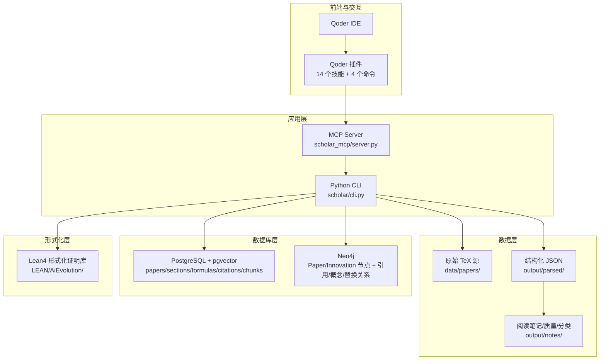
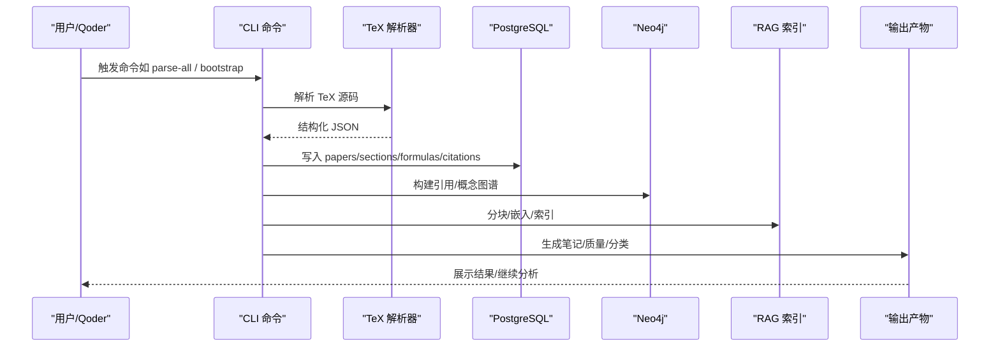
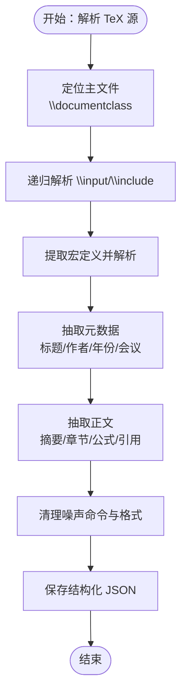
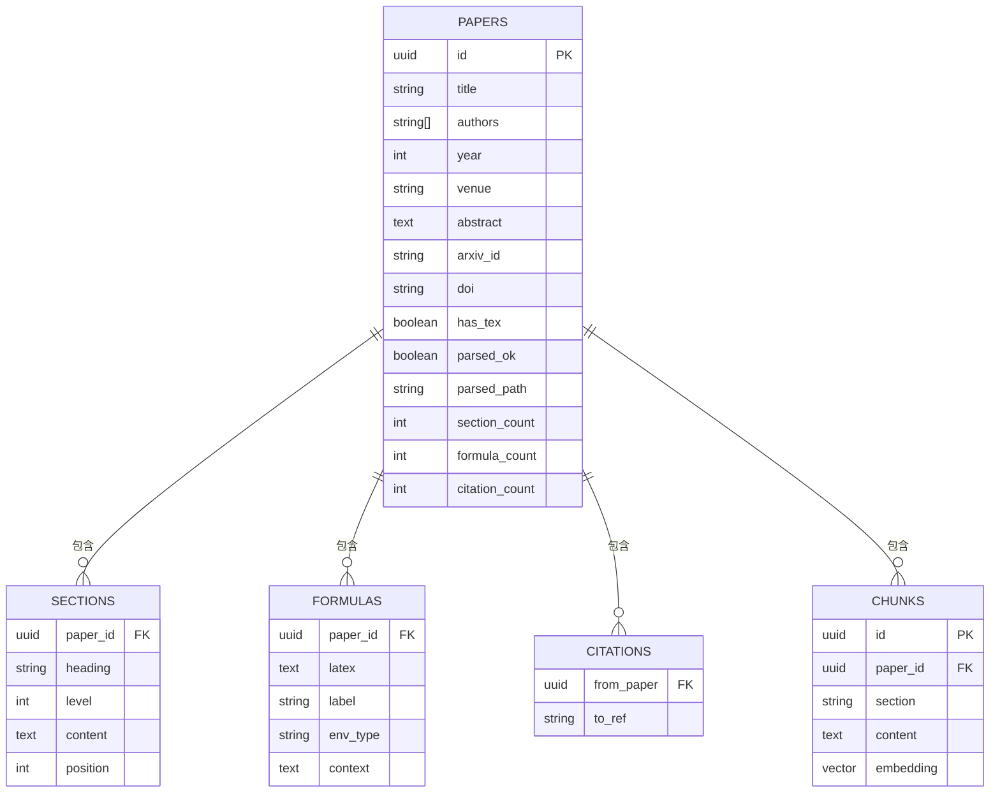
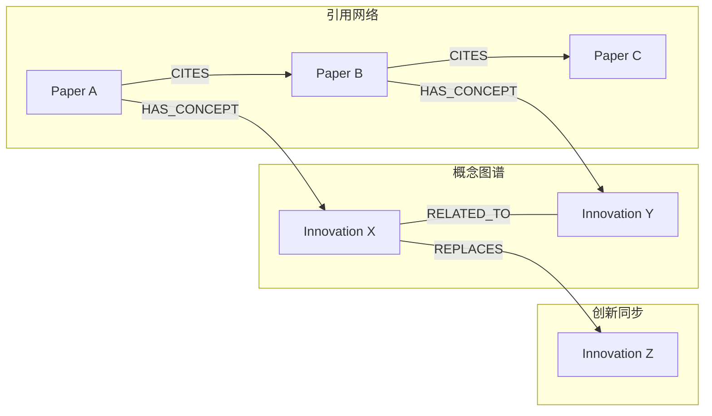
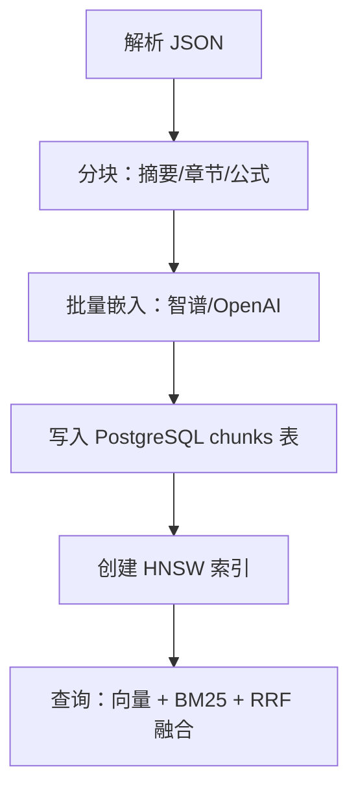
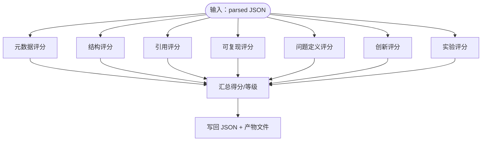
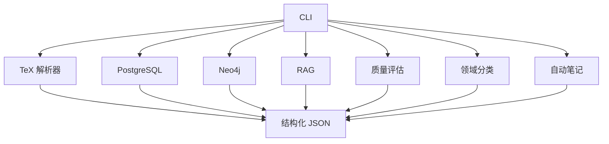
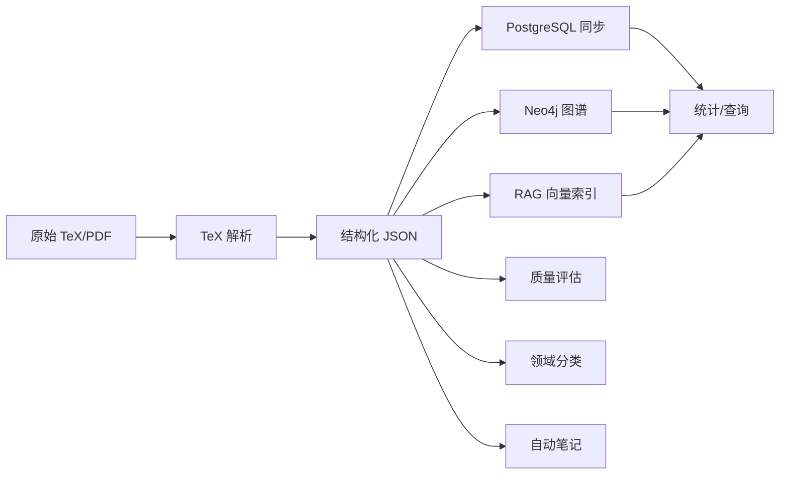

# 学术研究工作流

<cite>
**本文档引用的文件**
- [README.md](file://README.md)
- [scholar/__main__.py](file://scholar/__main__.py)
- [scholar/cli.py](file://scholar/cli.py)
- [scholar/tex_parser.py](file://scholar/tex_parser.py)
- [scholar/db.py](file://scholar/db.py)
- [scholar/graph_db.py](file://scholar/graph_db.py)
- [scholar/kb_update.py](file://scholar/kb_update.py)
- [scholar/auto_notes.py](file://scholar/auto_notes.py)
- [scholar/quality.py](file://scholar/quality.py)
- [scholar/classify.py](file://scholar/classify.py)
- [scholar/rag.py](file://scholar/rag.py)
- [scholar/metadata_enrich.py](file://scholar/metadata_enrich.py)
- [scholar/year_fix.py](file://scholar/year_fix.py)
- [requirements.txt](file://requirements.txt)
- [plugin/README.md](file://plugin/README.md)
</cite>

## 目录
1. [简介](#简介)
2. [项目结构](#项目结构)
3. [核心组件](#核心组件)
4. [架构总览](#架构总览)
5. [详细组件分析](#详细组件分析)
6. [依赖关系分析](#依赖关系分析)
7. [性能考虑](#性能考虑)
8. [故障排除指南](#故障排除指南)
9. [结论](#结论)
10. [附录](#附录)

## 简介
本项目是一个面向人工智能领域的学术研究工作流系统，围绕 440 篇 AI 演化方向论文构建，提供从 TeX 源码解析、结构化数据抽取、元数据补全，到知识库管理、引用网络分析、RAG 语义检索、质量评估、领域分类与自动笔记生成的完整流水线。系统采用 Qoder IDE + 14 个学术技能（8 个原子技能 + 6 个工作流）与 MCP 服务集成，支持端到端的调研→精读→对比→写作自动化。

## 项目结构
项目主要分为以下层次：
- 数据层：原始论文（PDF + TeX 源）与解析后的结构化 JSON（output/parsed）
- 应用层：Python CLI 与 MCP 服务器（scholar/ 与 scholar_mcp/）
- 基础设施：PostgreSQL（pgvector）+ Neo4j（引用图谱 + 概念图谱 + Lean4 创新节点同步）
- 插件层：Qoder 插件封装（plugin/），包含 14 个技能、4 个快捷指令与 MCP 配置

**图表来源**
- [README.md: 217-262:217-262](file://README.md#L217-L262)
- [plugin/README.md: 1-79:1-79](file://plugin/README.md#L1-L79)

**章节来源**
- [README.md: 1-511:1-511](file://README.md#L1-L511)
- [plugin/README.md: 1-79:1-79](file://plugin/README.md#L1-L79)

## 核心组件
- 论文解析与标准化：TeX 源码解析、元数据抽取、公式与章节提取、跨引用解析
- 知识库管理：PostgreSQL 数据模型与同步、Neo4j 图谱构建与维护、RAG 向量索引
- 高级分析：引用网络分析、研究空白发现、概念演化追踪、跨论文对比
- 质量评估与分类：7 维质量评分、多级领域标签体系
- 自动化产物：结构化阅读笔记、自动摘要与贡献提取
- CLI 与 MCP：统一命令行接口、与 Qoder 的桥接层

**章节来源**
- [scholar/cli.py: 1-800:1-800](file://scholar/cli.py#L1-L800)
- [scholar/tex_parser.py: 1-800:1-800](file://scholar/tex_parser.py#L1-L800)
- [scholar/db.py: 1-276:1-276](file://scholar/db.py#L1-L276)
- [scholar/graph_db.py: 1-922:1-922](file://scholar/graph_db.py#L1-L922)
- [scholar/rag.py: 1-582:1-582](file://scholar/rag.py#L1-L582)
- [scholar/quality.py: 1-432:1-432](file://scholar/quality.py#L1-L432)
- [scholar/classify.py: 1-328:1-328](file://scholar/classify.py#L1-L328)
- [scholar/auto_notes.py: 1-355:1-355](file://scholar/auto_notes.py#L1-L355)
- [scholar/kb_update.py: 1-445:1-445](file://scholar/kb_update.py#L1-L445)
- [scholar/metadata_enrich.py: 1-217:1-217](file://scholar/metadata_enrich.py#L1-L217)
- [scholar/year_fix.py: 1-420:1-420](file://scholar/year_fix.py#L1-L420)

## 架构总览
系统采用“解析→入库→图谱/索引→分析”的分层架构。解析阶段将 TeX 源码转换为结构化 JSON；入库阶段同步至 PostgreSQL 与 Neo4j；RAG 阶段构建向量索引；分析阶段提供引用网络、概念演化、质量评估与分类等能力；产物阶段生成阅读笔记与质量评分。

**图表来源**
- [README.md: 253-262:253-262](file://README.md#L253-L262)
- [scholar/cli.py: 176-237:176-237](file://scholar/cli.py#L176-L237)
- [scholar/db.py: 170-176:170-176](file://scholar/db.py#L170-L176)
- [scholar/graph_db.py: 225-281:225-281](file://scholar/graph_db.py#L225-L281)
- [scholar/rag.py: 471-548:471-548](file://scholar/rag.py#L471-L548)

## 详细组件分析

### 论文解析与标准化（TeX 源码处理）
- 功能要点
  - 支持 tar.gz/zip 源码解压与主文件识别（优先含 \input 的 orchestrator 文件）
  - 宏展开与自定义命令解析，标题/作者/年份/会议/摘要/章节/公式/引用提取
  - 作者解析支持多种格式（\author/\and/\icmlauthor 等），并清洗邮箱、注记与格式命令
  - 年份提取支持 arXiv ID、会议样式、注释行与内容启发式规则
  - 会议/期刊识别与规范化
- 数据结构
  - 输入：data/papers/<ULID>/source.tar.gz
  - 输出：output/parsed/<ULID>.json（包含 title/authors/year/venue/abstract/sections/formulas/citations 等）

**图表来源**
- [scholar/tex_parser.py: 214-285:214-285](file://scholar/tex_parser.py#L214-L285)
- [scholar/tex_parser.py: 333-361:333-361](file://scholar/tex_parser.py#L333-L361)
- [scholar/tex_parser.py: 428-514:428-514](file://scholar/tex_parser.py#L428-L514)
- [scholar/tex_parser.py: 516-701:516-701](file://scholar/tex_parser.py#L516-L701)

**章节来源**
- [scholar/tex_parser.py: 23-800:23-800](file://scholar/tex_parser.py#L23-L800)

### PostgreSQL 数据库设计与同步
- 数据模型
  - papers：论文元数据与解析状态
  - sections/formulas/citations：章节、公式、引用的细粒度存储
  - chunks：RAG 向量索引的文本块与嵌入向量
- 同步策略
  - CLI 解析后直接写入 PostgreSQL（upsert）
  - 支持按 paper_id 删除旧数据后重写（保证一致性）
  - 提供查询接口（全文搜索、统计、列表）

**图表来源**
- [scholar/db.py: 79-176:79-176](file://scholar/db.py#L79-L176)
- [scholar/rag.py: 182-212:182-212](file://scholar/rag.py#L182-L212)

**章节来源**
- [scholar/db.py: 24-276:24-276](file://scholar/db.py#L24-L276)

### Neo4j 图数据库与引用网络分析
- 图谱构建
  - 引用网络：Paper 节点 + CITES 边（ref_key→ULID 映射与解析）
  - 概念图谱：Paper-Has_Concept-Concept（Innovation）边 + 同现关系 RELATED_TO
  - 创新同步：从 Lean4 Database.lean 动态加载 REPLACES 关系
- 查询与分析
  - 引用统计、最被引用/活跃论文、最短引用路径
  - 概念时间线、相关概念、子图提取
  - 中心性指标（入度/出度/桥接分数）

**图表来源**
- [scholar/graph_db.py: 225-281:225-281](file://scholar/graph_db.py#L225-L281)
- [scholar/graph_db.py: 636-732:636-732](file://scholar/graph_db.py#L636-L732)
- [scholar/graph_db.py: 794-806:794-806](file://scholar/graph_db.py#L794-L806)

**章节来源**
- [scholar/graph_db.py: 32-922:32-922](file://scholar/graph_db.py#L32-L922)

### RAG 向量索引与语义检索
- 分块策略
  - 抽取摘要、章节段落、公式上下文，带标题前缀增强检索语义
- 嵌入与存储
  - 支持智谱/OPENAI API，批量获取嵌入并写入 PostgreSQL pgvector
  - 创建 HNSW 索引提升近似最近邻搜索效率
- 检索融合
  - 向量相似度 + BM25 关键词匹配 + RRF 融合排序

**图表来源**
- [scholar/rag.py: 25-93:25-93](file://scholar/rag.py#L25-L93)
- [scholar/rag.py: 427-469:427-469](file://scholar/rag.py#L427-L469)
- [scholar/rag.py: 551-582:551-582](file://scholar/rag.py#L551-L582)

**章节来源**
- [scholar/rag.py: 1-582:1-582](file://scholar/rag.py#L1-L582)

### 质量评估体系与领域分类
- 质量评分（7 维）
  - 元数据完整性、结构质量、引用密度、可复现信号、问题定义清晰度、创新信号、实验严谨性
  - 输出总分与等级，并写回 parsed JSON 与独立质量 JSON
- 领域分类（多级标签）
  - 一级：NLP/CV/RL/ML/Safety/Systems/Multimodal
  - 二级：具体子方向（如语言建模、目标检测、策略优化等）
  - 三级：方法标签（如 Transformer、ResNet、DQN 等）
  - 基于关键词匹配 + 会议倾向权重

**图表来源**
- [scholar/quality.py: 317-357:317-357](file://scholar/quality.py#L317-L357)
- [scholar/classify.py: 161-239:161-239](file://scholar/classify.py#L161-L239)

**章节来源**
- [scholar/quality.py: 1-432:1-432](file://scholar/quality.py#L1-L432)
- [scholar/classify.py: 1-328:1-328](file://scholar/classify.py#L1-L328)

### 自动笔记生成
- 产物：Markdown 阅读笔记，包含摘要、核心贡献、方法概述、关键公式、章节树、引用摘要
- 算法：基于正则与启发式抽取（首句摘要、贡献模式、方法关键词、公式打分）

**章节来源**
- [scholar/auto_notes.py: 28-161:28-161](file://scholar/auto_notes.py#L28-L161)
- [scholar/auto_notes.py: 167-276:167-276](file://scholar/auto_notes.py#L167-L276)

### 元数据补全与知识库维护
- 元数据补全：arXiv API 回填 arxiv_id/DOI，标题相似度匹配
- 年份补全：Lean4 论文年份映射 + 内容启发式 + arXiv 查询
- 作者补全：arXiv API 回填缺失作者
- 批量维护：一键下载新论文、批量入库、增量图谱与索引更新

**章节来源**
- [scholar/metadata_enrich.py: 112-164:112-164](file://scholar/metadata_enrich.py#L112-L164)
- [scholar/year_fix.py: 165-239:165-239](file://scholar/year_fix.py#L165-L239)
- [scholar/year_fix.py: 262-304:262-304](file://scholar/year_fix.py#L262-L304)
- [scholar/kb_update.py: 87-197:87-197](file://scholar/kb_update.py#L87-L197)
- [scholar/kb_update.py: 199-413:199-413](file://scholar/kb_update.py#L199-L413)

## 依赖关系分析
- 外部依赖
  - Python 3.10+、Docker Desktop、Qoder IDE、Git
  - PostgreSQL（pgvector 扩展）、Neo4j 5 社区版
  - 智谱/OPENAI 嵌入 API（可选）
- 内部模块耦合
  - CLI 作为统一入口，协调解析、入库、图谱、索引、分析与产物生成
  - 解析器与数据库层弱耦合，支持文件模式与数据库模式双通道
  - 图谱与 RAG 均依赖解析产物，形成闭环

**图表来源**
- [requirements.txt: 1-9:1-9](file://requirements.txt#L1-L9)
- [scholar/cli.py: 1-800:1-800](file://scholar/cli.py#L1-L800)

**章节来源**
- [requirements.txt: 1-9:1-9](file://requirements.txt#L1-L9)

## 性能考虑
- 批处理与进度条：解析、嵌入、入库均支持批量与进度反馈
- 索引优化：PostgreSQL HNSW 向量索引，提升大规模相似度检索性能
- 融合检索：向量 + BM25 + RRF，兼顾语义与关键词召回
- 速率限制：arXiv API 查询间隔控制，避免限流
- 断点续传：bootstrap 与增量更新支持跳过已完成步骤

[本节为通用指导，无需特定文件引用]

## 故障排除指南
- Docker 容器启动失败
  - 检查 Docker Desktop 状态与端口占用（5433/7474/7687）
  - 如与 VMware 冲突，重启 WSL2 后端再启动
- PostgreSQL 连接超时
  - 端口默认 5433，避免与本地 PostgreSQL 冲突
- RAG 搜索无结果
  - 缺少有效 API Key 时回落至 BM25；确认已执行 rag-index
- Bootstrap 中断恢复
  - 重复运行 bootstrap 将跳过已完成步骤；必要时强制重跑对应步骤

**章节来源**
- [README.md: 460-498:460-498](file://README.md#L460-L498)

## 结论
本工作流以 TeX 解析为核心，打通从原始论文到结构化数据再到智能分析的全链路，结合 PostgreSQL、Neo4j 与 RAG，形成可扩展、可观测、可维护的学术研究基础设施。通过 14 个技能与 MCP 集成，实现从调研、精读、对比到写作的自动化闭环，适合持续维护与扩展更大规模的论文库。

[本节为总结，无需特定文件引用]

## 附录

### 数据流总览（从原始论文到智能分析）

**图表来源**
- [README.md: 253-262:253-262](file://README.md#L253-L262)

### CLI 命令参考与使用示例
- 论文库管理
  - 查看统计：python -m scholar stats
  - 全文搜索：python -m scholar search "<关键词>"
  - 列表筛选：python -m scholar list-papers [--year <年份>]
  - 论文详情：python -m scholar info <ULID>
  - 导出 BibTeX：python -m scholar export-bib
- 图谱与检索
  - 图谱统计：python -m scholar graph-stats
  - 概念查询：python -m scholar graph-query "<概念ID>"
  - 引用网络：python -m scholar cite-network [ULID]
  - 语义搜索：python -m scholar rag-search "<查询>" [--hybrid]
- 批处理与编排
  - 扫描与解析：python -m scholar scan / parse-all
  - 元数据补全：python -m scholar year-fix / author-fix
  - 元数据回填：python -m scholar metadata-enrich
  - 图谱重建：python -m scholar graph-build
  - RAG 重建：python -m scholar rag-index
  - 自动生成：python -m scholar auto-notes / quality-score --all / classify --all
  - 全量初始化：python -m scholar bootstrap
  - 增量入库：python -m scholar ingest <ULID>
- 外部集成
  - arXiv 搜索：python -m scholar arxiv-search "<查询>"

**章节来源**
- [README.md: 266-297:266-297](file://README.md#L266-L297)