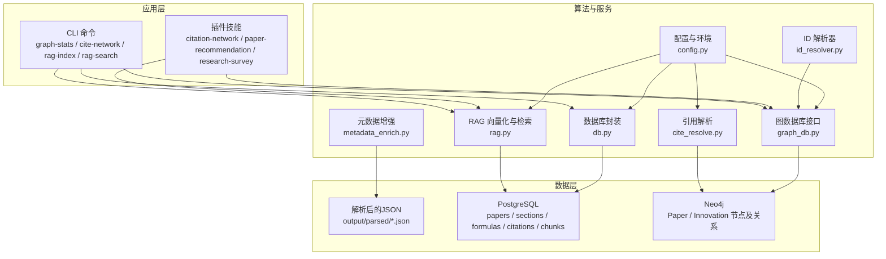
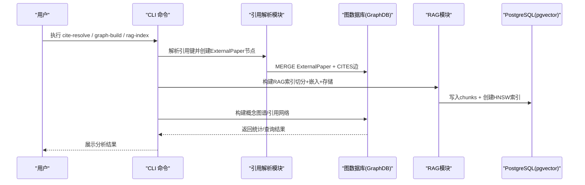
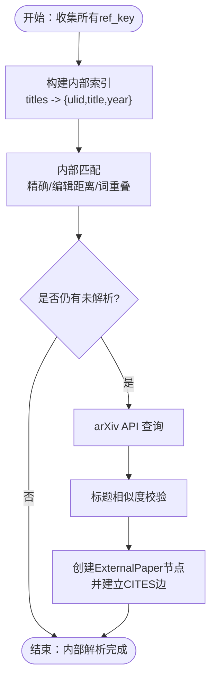
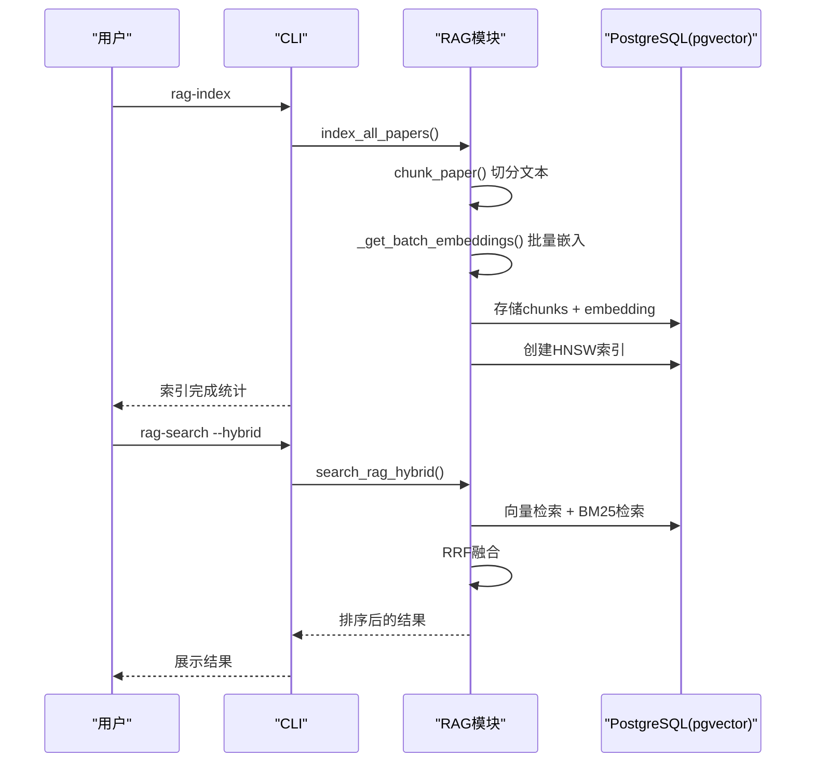
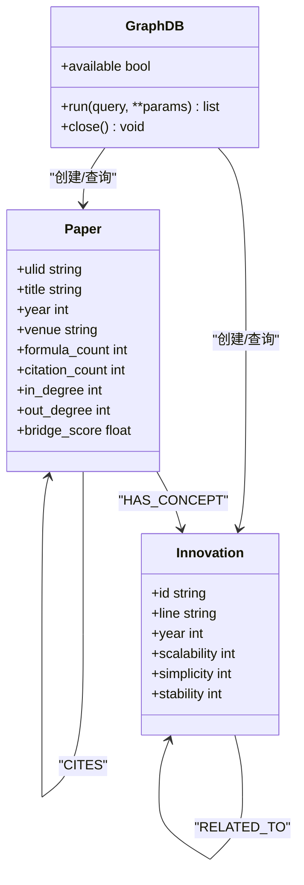
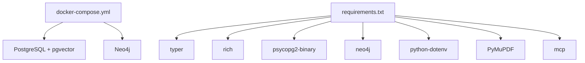

# 引用网络分析

<cite>
**本文档引用的文件**
- [cite_resolve.py](file://scholar/cite_resolve.py)
- [rag.py](file://scholar/rag.py)
- [graph_db.py](file://scholar/graph_db.py)
- [id_resolver.py](file://scholar/id_resolver.py)
- [metadata_enrich.py](file://scholar/metadata_enrich.py)
- [db.py](file://scholar/db.py)
- [config.py](file://scholar/config.py)
- [cli.py](file://scholar/cli.py)
- [docker-compose.yml](file://infra/docker-compose.yml)
- [requirements.txt](file://requirements.txt)
- [SKILL.md](file://plugin/skills/citation-network/SKILL.md)
- [SKILL.md](file://plugin/skills/paper-recommendation/SKILL.md)
- [SKILL.md](file://plugin/skills/research-survey/SKILL.md)
</cite>

## 目录
1. [简介](#简介)
2. [项目结构](#项目结构)
3. [核心组件](#核心组件)
4. [架构总览](#架构总览)
5. [详细组件分析](#详细组件分析)
6. [依赖关系分析](#依赖关系分析)
7. [性能考量](#性能考量)
8. [故障排查指南](#故障排查指南)
9. [结论](#结论)
10. [附录](#附录)

## 简介
本项目围绕“引用网络分析”构建，提供从原始引用键到可解析引用的端到端能力，涵盖：
- 引用解析算法：作者姓名标准化、期刊信息提取、引用格式识别
- RAG（检索增强生成）系统：向量嵌入生成、相似度计算、检索策略
- 引用网络可视化与分析：关键节点识别、桥接论文计算、概念图谱
- 研究热点追踪与影响力计算：基于Neo4j的图分析与PostgreSQL的结构化存储
- 性能优化与大规模数据处理策略：批处理、索引、混合检索

## 项目结构
项目采用模块化设计，核心模块包括：
- 引用解析与外部解析：cite_resolve.py
- RAG向量化与检索：rag.py
- 图数据库层（Neo4j）：graph_db.py
- ID解析器：id_resolver.py
- 元数据增强：metadata_enrich.py
- 结构化数据库（PostgreSQL）：db.py
- 配置与环境：config.py
- CLI命令入口：cli.py
- 基础设施编排：docker-compose.yml
- 依赖声明：requirements.txt
- 插件技能文档：plugin/skills/*

图表来源
- [cli.py:711-990](file://scholar/cli.py#L711-L990)
- [graph_db.py:32-70](file://scholar/graph_db.py#L32-L70)
- [rag.py:25-93](file://scholar/rag.py#L25-L93)
- [cite_resolve.py:65-93](file://scholar/cite_resolve.py#L65-L93)
- [id_resolver.py:15-46](file://scholar/id_resolver.py#L15-L46)
- [metadata_enrich.py:112-163](file://scholar/metadata_enrich.py#L112-L163)
- [db.py:24-74](file://scholar/db.py#L24-L74)
- [config.py:23-58](file://scholar/config.py#L23-L58)

章节来源
- [cli.py:711-990](file://scholar/cli.py#L711-L990)
- [graph_db.py:32-70](file://scholar/graph_db.py#L32-L70)
- [rag.py:25-93](file://scholar/rag.py#L25-L93)
- [cite_resolve.py:65-93](file://scholar/cite_resolve.py#L65-L93)
- [id_resolver.py:15-46](file://scholar/id_resolver.py#L15-L46)
- [metadata_enrich.py:112-163](file://scholar/metadata_enrich.py#L112-L163)
- [db.py:24-74](file://scholar/db.py#L24-L74)
- [config.py:23-58](file://scholar/config.py#L23-L58)

## 核心组件
- 引用解析与外部解析：支持内部引用键到已知论文的匹配，以及通过arXiv API解析外部引用，最终在Neo4j中创建ExternalPaper节点并建立CITES边。
- RAG系统：将论文切分为块，生成向量嵌入，存储至PostgreSQL pgvector，并提供向量检索、BM25关键词检索与RRF融合检索。
- 图数据库层：构建并维护引用网络（Paper-CITES-Paper）、概念图谱（Paper-HAS_CONCEPT-Innovation-RELATED_TO-Innovation）与Lean4替换关系（Innovation-REPLACES-Innovation），并提供中心性计算与查询。
- ID解析器：统一解析ULID、arXiv ID、DOI、slug等ID格式，支持缓存与模糊匹配。
- 元数据增强：批量为论文补全arXiv ID与DOI，提升引用解析质量。
- 数据库封装：提供PostgreSQL访问与文件回退模式，支持upsert与查询操作。
- 配置管理：集中管理目录、数据库、图数据库、嵌入模型与arXiv API请求参数。

章节来源
- [cite_resolve.py:229-314](file://scholar/cite_resolve.py#L229-L314)
- [rag.py:25-582](file://scholar/rag.py#L25-L582)
- [graph_db.py:225-364](file://scholar/graph_db.py#L225-L364)
- [id_resolver.py:15-107](file://scholar/id_resolver.py#L15-L107)
- [metadata_enrich.py:166-217](file://scholar/metadata_enrich.py#L166-L217)
- [db.py:24-276](file://scholar/db.py#L24-L276)
- [config.py:69-116](file://scholar/config.py#L69-L116)

## 架构总览
系统由“数据采集与解析”、“结构化存储”、“图谱与向量检索”三层组成，CLI作为统一入口协调各模块。

图表来源
- [cli.py:708-706](file://scholar/cli.py#L708-L706)
- [cite_resolve.py:229-314](file://scholar/cite_resolve.py#L229-L314)
- [graph_db.py:225-364](file://scholar/graph_db.py#L225-L364)
- [rag.py:471-548](file://scholar/rag.py#L471-L548)

## 详细组件分析

### 引用解析与外部解析（cite_resolve.py）
- 文本规范化：统一大小写、去除标点、合并多余空格，用于模糊匹配。
- 内部匹配策略：
  - 精确匹配（规范化后）
  - 编辑距离相似度阈值匹配
  - 词集合重叠率阈值匹配
- 外部解析：通过arXiv API查询，清洗XML响应，提取标题、作者、年份、arXiv ID，并进行标题相似度校验。
- Neo4j外部节点创建：为未解析的引用创建ExternalPaper节点，并建立CITES边。
- 主流程：收集所有ref_key → 内部匹配 → arXiv解析 → 创建外部节点。

图表来源
- [cite_resolve.py:65-134](file://scholar/cite_resolve.py#L65-L134)
- [cite_resolve.py:140-182](file://scholar/cite_resolve.py#L140-L182)
- [cite_resolve.py:188-223](file://scholar/cite_resolve.py#L188-L223)
- [cite_resolve.py:229-314](file://scholar/cite_resolve.py#L229-L314)

章节来源
- [cite_resolve.py:26-59](file://scholar/cite_resolve.py#L26-L59)
- [cite_resolve.py:96-134](file://scholar/cite_resolve.py#L96-L134)
- [cite_resolve.py:140-182](file://scholar/cite_resolve.py#L140-L182)
- [cite_resolve.py:188-223](file://scholar/cite_resolve.py#L188-L223)
- [cite_resolve.py:229-314](file://scholar/cite_resolve.py#L229-L314)

### RAG（检索增强生成）系统（rag.py）
- 文本切分策略：抽象单独成块；章节按段落拆分，超过阈值则切分；公式与上下文单独成块。
- 向量嵌入：
  - 支持智谱与OpenAI两种提供商
  - 批量嵌入（智谱支持批量）与逐条回退
  - 本地嵌入预留接口
- 存储与索引：
  - 写入PostgreSQL chunks表（paper_id、section、content、embedding）
  - 创建HNSW索引（余弦距离）加速近似最近邻搜索
- 检索策略：
  - 向量检索：基于pgvector的向量内积（余弦距离）
  - BM25关键词检索：轻量实现，适合无外部依赖场景
  - 混合检索：RRF（Reciprocal Rank Fusion）融合向量与BM25结果
- 批量索引：遍历解析后的JSON，分批生成嵌入并入库，支持Rich进度条。

图表来源
- [rag.py:471-548](file://scholar/rag.py#L471-L548)
- [rag.py:25-93](file://scholar/rag.py#L25-L93)
- [rag.py:427-469](file://scholar/rag.py#L427-L469)
- [rag.py:252-289](file://scholar/rag.py#L252-L289)
- [rag.py:383-421](file://scholar/rag.py#L383-L421)

章节来源
- [rag.py:25-93](file://scholar/rag.py#L25-L93)
- [rag.py:100-176](file://scholar/rag.py#L100-L176)
- [rag.py:182-238](file://scholar/rag.py#L182-L238)
- [rag.py:252-289](file://scholar/rag.py#L252-L289)
- [rag.py:295-365](file://scholar/rag.py#L295-L365)
- [rag.py:383-421](file://scholar/rag.py#L383-L421)
- [rag.py:427-469](file://scholar/rag.py#L427-L469)
- [rag.py:471-548](file://scholar/rag.py#L471-L548)

### 图数据库层（graph_db.py）
- 引用网络构建：
  - 创建Paper节点（ulid、title、year、venue、公式/引用计数）
  - 建立CITES边（ref_key）
  - 解析ref_key到ULID：规范化标题匹配 + 模糊匹配 + 词重叠
- 中心性与桥接论文：
  - 计算in_degree、out_degree、bridge_score
  - 提供Top被引与Top桥接论文查询
- 概念图谱构建：
  - 动态加载Lean4创新节点（AiEvolution/Database.lean）
  - 将论文与概念匹配（TF-IDF-like权重）
  - 构建概念共现关系（RELATED_TO）
- 查询接口：统计、引用路径、概念查询、子图抽取等。

图表来源
- [graph_db.py:32-70](file://scholar/graph_db.py#L32-L70)
- [graph_db.py:225-280](file://scholar/graph_db.py#L225-L280)
- [graph_db.py:180-222](file://scholar/graph_db.py#L180-L222)
- [graph_db.py:636-732](file://scholar/graph_db.py#L636-L732)

章节来源
- [graph_db.py:85-177](file://scholar/graph_db.py#L85-L177)
- [graph_db.py:180-222](file://scholar/graph_db.py#L180-L222)
- [graph_db.py:225-280](file://scholar/graph_db.py#L225-L280)
- [graph_db.py:636-732](file://scholar/graph_db.py#L636-L732)

### ID解析器（id_resolver.py）
- 缓存机制：首次调用扫描所有解析后的JSON，构建any_id→ulid映射
- 解析策略：
  - 精确匹配（ULID、arXiv ID、DOI、slug）
  - arXiv ID归一化（去版本号）
  - DOI归一化（支持URL与裸ID）
  - slug模糊匹配（仅匹配含连字符且非arXiv/DOI格式的键）

章节来源
- [id_resolver.py:15-107](file://scholar/id_resolver.py#L15-L107)

### 元数据增强（metadata_enrich.py）
- 通过arXiv API按标题搜索，提取最佳匹配的arXiv ID与DOI
- 标题相似度采用Jaccard系数
- 支持批量处理，带延迟与错误统计，可写回JSON并更新PostgreSQL

章节来源
- [metadata_enrich.py:60-110](file://scholar/metadata_enrich.py#L60-L110)
- [metadata_enrich.py:112-163](file://scholar/metadata_enrich.py#L112-L163)
- [metadata_enrich.py:166-217](file://scholar/metadata_enrich.py#L166-L217)

### 数据库封装（db.py）
- PostgreSQL封装：提供Paper/Sections/Formulas/Citations的upsert与查询
- 文件回退：在DB不可用时保存/读取解析后的JSON
- 统计查询：论文总数、解析数、章节/公式/引用数量、年份范围

章节来源
- [db.py:24-276](file://scholar/db.py#L24-L276)

### 配置与环境（config.py）
- 目录与数据库配置：PostgreSQL、Neo4j、输出目录
- RAG嵌入配置：提供商、模型、维度、API Key
- arXiv API请求工具：带重试、超时、代理支持

章节来源
- [config.py:23-58](file://scholar/config.py#L23-L58)
- [config.py:69-116](file://scholar/config.py#L69-L116)

### CLI命令入口（cli.py）
- graph-stats：展示节点/边统计、Top被引与Top桥接论文
- graph-query：查询概念图谱（论文、相关概念、时间线）
- cite-network：分析单篇论文的前后向引用或全局统计
- rag-index：构建RAG向量索引
- rag-search：向量检索或混合检索
- year-fix：使用Lean4与arXiv补全年份

章节来源
- [cli.py:711-791](file://scholar/cli.py#L711-L791)
- [cli.py:797-834](file://scholar/cli.py#L797-L834)
- [cli.py:839-885](file://scholar/cli.py#L839-L885)
- [cli.py:929-949](file://scholar/cli.py#L929-L949)
- [cli.py:955-989](file://scholar/cli.py#L955-L989)
- [cli.py:889-924](file://scholar/cli.py#L889-L924)

## 依赖关系分析
- 容器编排：PostgreSQL（pgvector）与Neo4j通过docker-compose启动
- Python依赖：typer、rich、psycopg2-binary、neo4j、python-dotenv、PyMuPDF、mcp
- 环境变量：通过dotenv加载，支持代理、超时、重试等参数

图表来源
- [docker-compose.yml:1-44](file://infra/docker-compose.yml#L1-L44)
- [requirements.txt:1-9](file://requirements.txt#L1-L9)

章节来源
- [docker-compose.yml:1-44](file://infra/docker-compose.yml#L1-L44)
- [requirements.txt:1-9](file://requirements.txt#L1-L9)

## 性能考量
- 引用解析
  - 内部匹配采用预构建索引与阈值控制，避免全量暴力匹配
  - arXiv查询限制并发与次数，结合标题相似度过滤
- RAG
  - 批量嵌入（智谱支持批量）减少API往返
  - HNSW索引显著降低向量检索时间
  - 混合检索RRF融合，兼顾语义与关键词召回
- 图数据库
  - 使用MERGE避免重复节点/边
  - 中心性计算与查询结果缓存（CLI中表格展示）
- 数据库
  - PostgreSQL写入采用批量插入
  - 文件回退模式保证离线可用性

章节来源
- [cite_resolve.py:229-314](file://scholar/cite_resolve.py#L229-L314)
- [rag.py:427-469](file://scholar/rag.py#L427-L469)
- [rag.py:214-238](file://scholar/rag.py#L214-L238)
- [graph_db.py:249-278](file://scholar/graph_db.py#L249-L278)
- [cli.py:711-791](file://scholar/cli.py#L711-L791)

## 故障排查指南
- Neo4j不可用
  - 确认容器启动与健康检查
  - 使用CLI命令前先启动Neo4j：docker compose up -d neo4j
- PostgreSQL不可用
  - 确认容器启动与健康检查
  - 确保HNSW扩展可用（pgvector镜像内置）
- RAG索引失败
  - 检查嵌入API Key与提供商配置
  - 确认chunks表结构与HNSW索引创建
- 引用解析失败
  - 检查parsed目录下JSON完整性
  - 确认arXiv API可用与限速设置
- 元数据增强失败
  - 检查arXiv API返回与标题相似度阈值
  - 确认JSON中title字段存在

章节来源
- [docker-compose.yml:15-39](file://infra/docker-compose.yml#L15-L39)
- [config.py:69-116](file://scholar/config.py#L69-L116)
- [cli.py:929-949](file://scholar/cli.py#L929-L949)
- [metadata_enrich.py:166-217](file://scholar/metadata_enrich.py#L166-L217)

## 结论
本项目提供了从引用解析到RAG检索再到图谱分析的完整链路，具备良好的可扩展性与工程化实践。通过Neo4j与PostgreSQL的协同，既能进行结构化存储与高效检索，也能进行复杂的图分析与可视化。建议在生产环境中：
- 配置合理的嵌入API Key与限速策略
- 定期重建HNSW索引以保持检索性能
- 使用Lean4与arXiv双重补全机制提升引用解析质量
- 基于CLI与插件技能文档形成标准化的工作流

## 附录
- 插件技能文档
  - 引用网络分析：[SKILL.md](file://plugin/skills/citation-network/SKILL.md)
  - 论文推荐：[SKILL.md](file://plugin/skills/paper-recommendation/SKILL.md)
  - 研究调研：[SKILL.md](file://plugin/skills/research-survey/SKILL.md)